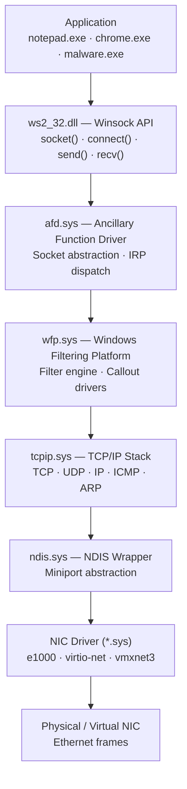

# Appendix A: Windows Networking Internals

> **Framing note:** Appendix này tiếp cận networking từ góc nhìn security researcher — không phải hướng dẫn cấu hình mạng. Mỗi layer trong network stack là một telemetry source, một attack surface, và một lateral movement vector tiềm năng. Mục tiêu là xây dựng mental model đủ sâu để phân tích traffic, đặt sensor đúng chỗ, và hiểu tại sao một số kỹ thuật tấn công mạng hoạt động ở layer nào.

---

## Status

Draft implementation.

---

## 0. Depends on

Ch.6 (I/O system, IRP, driver stack), Ch.7 (security, authentication, token), Ch.10 (ETW, diagnostics), Ch.11 (file system — named pipes là NPFS).

---

## 1. Researcher Mindset

**Networking không chỉ là "gửi và nhận data".**

Từ góc nhìn security researcher, mỗi network connection là:

- **Một trust boundary crossing** — data rời khỏi process boundary, rời khỏi machine boundary, đi qua môi trường không tin tưởng
- **Một authentication event** — ai đang nói chuyện với ai, với credential gì, được verified bởi cơ chế nào?
- **Một telemetry opportunity** — WFP callout, ETW network provider, Sysmon Event 3, firewall log đều capture ở các layer khác nhau
- **Một lateral movement vector** — SMB, WMI, RPC, WinRM, DCOM đều là protocol được Windows expose mặc định; attacker abuse chúng vì chúng legitimate

**Ba câu hỏi đúng với mọi network activity:**

1. **Protocol gì?** — Encrypted hay plaintext? Authenticated hay anonymous? Standard hay custom?
2. **Authentication xảy ra ở layer nào?** — Application-layer (HTTP Basic), transport-layer (TLS client cert), network-layer (Kerberos/NTLM)?
3. **Telemetry nào capture connection này?** — WFP thấy connection-level; NDIS thấy packet-level; application-layer logging thấy content

**Mental model: adversary perspective**

```
Attacker muốn:
  C2 communication → cần channel ra ngoài; HTTP/S qua port 80/443 ít bị block nhất
  Lateral movement  → cần protocol đến target machine; SMB/WMI/RPC/WinRM thường mở
  Credential relay   → cần protocol có NTLM authentication; SMB/HTTP/LDAP/MSSQL là candidates
  Data exfiltration  → cần outbound channel; DNS tunneling, ICMP, HTTP/S đều được dùng
```

---

## 2. Windows Network Stack — Layers

### 2.1 Stack Overview

```
Application (notepad.exe, chrome.exe, malware.exe)
        ↓ gọi
Winsock API (ws2_32.dll)
        ↓ IRP qua
AFD.sys — Ancillary Function Driver (socket abstraction layer)
        ↓
tcpip.sys — TCP/IP protocol stack (TCP, UDP, IP, ICMP, DNS client)
        ↓
NDIS.sys — Network Driver Interface Specification (wrapper)
        ↓
NIC miniport driver (e1000.sys, virtio-net, vmxnet3, broadcom...)
        ↓
Physical NIC / Virtual NIC
```



### 2.2 Key Drivers

| Driver | Role | Researcher relevance |
|---|---|---|
| `afd.sys` | Ancillary Function Driver — socket abstraction cho Winsock. Mọi socket operation đi qua AFD. | AFD IOCTL là interface giữa Winsock và kernel; raw socket research target |
| `tcpip.sys` | TCP/IP stack đầy đủ: TCP, UDP, IP, ICMP, IPv6, ARP, DNS client stub | Implement TCP state machine; có thể debug với WinDbg `!tcpip` |
| `ndis.sys` | NDIS (Network Driver Interface Specification) wrapper — abstract hoá NIC driver API | Miniport driver attach tại đây; NDIS filter driver = packet-level inspection layer |
| `wfp.sys` | Windows Filtering Platform — kernel-mode network filter framework | EDR/Firewall callout driver attach tại đây; primary kernel-mode network telemetry source |
| `mpsdrv.sys` | Windows Firewall kernel driver | Implement default firewall policy; uses WFP |
| `netbt.sys` | NetBIOS over TCP/IP (NBT) — legacy protocol | NBNS name resolution — LLMNR/NBT-NS poisoning target |
| `npfs.sys` | Named Pipe File System | Named pipe IPC; không phải network nhưng thường được abuse cho lateral movement qua SMB |
| `srvnet.sys` / `srv2.sys` | SMB server kernel driver | Server-side SMB processing; CVE target class |
| `mrxsmb.sys` / `mrxsmb20.sys` | SMB client (Mini Redirector) | Client-side SMB; NTLM relay originator |

### 2.3 Winsock Internals

Khi application gọi `connect(socket, addr, len)`:

```
connect()                          [ws2_32.dll — user mode]
  → WSPConnect()                   [Winsock Service Provider Interface]
  → DeviceIoControl(afd_handle,    [IOCTL_AFD_CONNECT]
      IOCTL_AFD_CONNECT, ...)
  → IRP đến afd.sys                [kernel mode — dispatch queue]
  → afd.sys gọi tcpip.sys         [TDI/WSK interface]
  → tcpip.sys: TCP SYN packet      [TCP state machine: CLOSED → SYN_SENT]
  → NDIS → NIC driver → wire
  → TCP SYN-ACK received → ACK
  → tcpip.sys: state ESTABLISHED
  → IRP completed → return to app
```

**Tại sao quan trọng với researcher:**
- WFP filter engine được evaluated trong stack này — connection có thể bị block hoặc inspected ở `tcpip.sys` layer trước khi đến NIC
- EDR hook ở `ws2_32.dll` level chỉ thấy Winsock API calls. Attacker dùng raw socket qua trực tiếp AFD IOCTL hay raw IP socket sẽ có telemetry profile khác
- Direct socket creation qua raw IP (`SOCK_RAW`) bypass TCP/UDP framing nhưng vẫn đi qua WFP

---

## 3. Windows Filtering Platform (WFP)

### 3.1 Architecture

WFP là framework kernel-mode cho phép callout driver inspect và optionally block/modify network traffic tại nhiều điểm trong stack.

```
WFP Filter Engine
  ├── Layers (filtering points):
  │     - FWPM_LAYER_INBOUND_TRANSPORT_V4   ← inbound TCP/UDP packet
  │     - FWPM_LAYER_OUTBOUND_TRANSPORT_V4  ← outbound TCP/UDP packet
  │     - FWPM_LAYER_ALE_CONNECT_V4         ← TCP connect() initiation (per connection, not per packet)
  │     - FWPM_LAYER_ALE_FLOW_ESTABLISHED_V4 ← flow established
  │     - FWPM_LAYER_ALE_AUTH_LISTEN_V4     ← listen() call
  │     - FWPM_LAYER_DATAGRAM_DATA_V4       ← UDP datagrams
  │     - FWPM_LAYER_STREAM_V4              ← stream data
  │
  ├── Filters (rules): conditions + action (PERMIT / BLOCK / CALLOUT)
  │
  └── Callout drivers: kernel-mode code registered to inspect/modify at specific layers
```

**Hai loại consumer của WFP:**

| Consumer | Ví dụ | Dùng WFP như thế nào |
|---|---|---|
| Windows Firewall | `mpssvc` + `mpsdrv.sys` | Đăng ký filter rules theo inbound/outbound policy; block/permit per rule |
| EDR/AV drivers | Carbon Black, CrowdStrike, SentinelOne | Đăng ký callout tại `ALE_CONNECT` layer để observe outbound connections per process; optionally block C2 |
| Network inspection tools | Wireshark (via NDIS filter), Npcap | Không dùng WFP trực tiếp; dùng NDIS raw packet capture |

### 3.2 WFP như EDR Telemetry Source

Layer quan trọng nhất cho EDR là **`FWPM_LAYER_ALE_CONNECT_V4`** (và IPv6 variant):
- Fired mỗi lần process mở một TCP connection
- Context đầy đủ: source IP/port, destination IP/port, **process ID, process path, user token**
- Per-connection (không phải per-packet) — overhead thấp hơn packet inspection
- EDR callout tại layer này có thể: log event, block connection, hoặc allow

**Sysmon Event 3** là user-mode representation của WFP-level connection data (via kernel driver).

**Windows Security Event 5156/5157/5158:**
```
5156: Windows Filtering Platform has permitted a connection
  - Application Name: process path
  - Direction: Inbound/Outbound
  - Protocol: TCP/UDP
  - Source/Destination IP:Port

5157: Windows Filtering Platform has blocked a connection
5158: Windows Filtering Platform has permitted a bind to a local port
```

### 3.3 WFP Filter Bypass — Researcher Perspective

WFP là security boundary quan trọng. Một số cách attacker tìm cách bypass (để defender hiểu phải monitor gì):

| Technique category | Cơ chế | Tại sao nó là vấn đề |
|---|---|---|
| Raw socket injection | Dùng SOCK_RAW ở IP level, bypass TCP layer; vẫn đi qua WFP network layer | Một số WFP layers có thể bị miss nếu filter không đăng ký ở đúng layer |
| NDIS filter bypass | Nếu có kernel access, inject packet trực tiếp vào NDIS tanstack bên dưới WFP | Cần kernel mode; bypass toàn bộ WFP |
| Protocol encapsulation | Tunnel C2 trong HTTP/HTTPS qua port 80/443 — WFP thấy legitimate protocol; content không bị block | WFP không decrypt TLS; chỉ thấy connection metadata |
| Living-off-the-land protocol | Dùng SMB, WMI, WinRM thay vì custom C2; đây là protocol legitimate nên ít bị filter | Protocol allowlisted; phân biệt cần behavior analytics, không chỉ protocol filter |

---

## 4. Key Networking APIs và Internals

### 4.1 Winsock API

```c
// Ví dụ TCP client cơ bản — trace qua stack
SOCKET s = socket(AF_INET, SOCK_STREAM, IPPROTO_TCP);
// → ws2_32!socket() → AFD IOCTL IOCTL_AFD_CREATE → afd.sys tạo endpoint object

connect(s, (SOCKADDR*)&addr, sizeof(addr));
// → ws2_32!connect() → AFD IOCTL IOCTL_AFD_CONNECT
// → afd.sys → tcpip.sys TCP SYN → wire
// → WFP ALE_CONNECT layer evaluated HERE với process context

send(s, buf, len, 0);
// → ws2_32!send() → AFD IOCTL IOCTL_AFD_SEND
// → afd.sys → tcpip.sys → WFP OUTBOUND_TRANSPORT layer → wire

recv(s, buf, len, 0);
// → ws2_32!recv() → AFD IOCTL IOCTL_AFD_RECV → blocked IRP khi không có data
// → data arrives → tcpip.sys → WFP INBOUND_TRANSPORT layer → afd.sys completes IRP
```

### 4.2 WinInet / WinHTTP

| API | DLL | Dùng cho | Tại sao quan trọng |
|---|---|---|---|
| `WinInet` | `wininet.dll` | IE legacy, nhiều Windows component | Cache request/response; credential storage; proxy setting từ registry |
| `WinHTTP` | `winhttp.dll` | Modern Windows HTTP, WinRM, PowerShell web cmdlets | No UI; system-level proxy; dùng bởi nhiều legitimate và malicious tool |
| `System.Net.HttpClient` (.NET) | CLR | .NET application | Wrap WinHTTP hoặc managed socket tùy version |
| `curl.exe` (built-in Win10+) | Standalone | Command line HTTP | Dùng libcurl, không qua WinInet/WinHTTP — profile khác |

**Researcher note:** PowerShell `Invoke-WebRequest` và `Invoke-RestMethod` sử dụng WinHTTP (hoặc .NET HttpClient). Traffic visible trong Sysmon Event 3. HTTPS traffic là TLS-encrypted — WFP thấy connection metadata, không thấy HTTP request content.

### 4.3 RPC/DCOM

RPC (Remote Procedure Call) là protocol Windows dùng cho hầu hết inter-process và inter-machine communication:

```
RPC Client Application
  → RPC Runtime (rpcrt4.dll)
  → Transport selection:
     ├── Named pipe (\\.\pipe\...) → NPFS → SMB nếu remote
     ├── TCP socket → ws2_32 → afd.sys → tcpip.sys
     ├── ALPC (local) → kernel ALPC port → zero-copy IPC
     └── HTTP (ncacn_http) → WinHTTP → TCP

RPC Server (nếu DCOM):
  → svchost.exe với RPCSS service
  → COM Activation (SCM port → DCOM port negotiation)
  → Object activation
```

**DCOM lateral movement:** Attacker dùng DCOM (WMI, ShellWindows, MMC20) để execute code trên remote machine với stolen credentials — legitimate RPC over TCP (port 135 + dynamic high port).

Detection: Event 4624 (logon type 3), network connection to port 135 + dynamic high port, WMI activity events.

### 4.4 SMB Protocol

SMB (Server Message Block) — protocol Windows dùng cho file sharing, printer sharing, remote named pipes, và nhiều lateral movement technique.

```
SMB Client (mrxsmb20.sys)
  ↓ NetBIOS/Direct TCP (port 445)
SMB Server (srv2.sys + srvnet.sys)
  ↓
Named Pipe layer (npfs.sys) — nếu pipe access
  hoặc
NTFS / Storage driver — nếu file access
```

**SMB là lateral movement Swiss Army knife:**

| Use case | Mechanism | Detection signal |
|---|---|---|
| File copy | SMB file share (C$, ADMIN$, IPC$) | Event 5140 (share access), 5145 (share object check) |
| Remote service install | SCM over SMB named pipe (\pipe\svcctl) | Event 7045, 4697 |
| PsExec-style execution | Write exe to ADMIN$, create service | Event 7045, file creation in ADMIN$ |
| Pass-the-Hash | NTLM auth over SMB with stolen hash | Event 4624 logon type 3; NTLM auth |
| Remote scheduled task | Task Scheduler RPC over SMB | Event 4698 (task created), 4702 (modified) |

---

## 5. Name Resolution Internals

### 5.1 DNS Resolution Flow

```
Application gọi getaddrinfo("target.example.com")
  ↓
ws2_32.dll → NSS (Name Space Service)
  ↓
Dnsapi.dll — DNS client library
  ↓ cache check (Dnscache service in-memory cache)
  ↓ nếu miss:
DNS query → UDP/TCP port 53 đến DNS server
  (DNS server config: HKLM\SYSTEM\CurrentControlSet\Services\Tcpip\Parameters\NameServer)
  ↓
tcpip.sys → wire → DNS response
  ↓
Dnscache service cache kết quả
  ↓
Return IP address(es) đến application
```

**Registry keys quan trọng:**
```
HKLM\SYSTEM\CurrentControlSet\Services\Tcpip\Parameters
  └── NameServer: DNS server IP(s)
  └── Domain: DNS domain suffix
  └── SearchList: DNS suffix search list

HKLM\SYSTEM\CurrentControlSet\Services\Dnscache
  └── Start: service start type
```

### 5.2 LLMNR và NetBIOS (NBNS)

**LLMNR (Link-Local Multicast Name Resolution):**
- Resolves single-label hostnames không tìm thấy trong DNS
- Dùng multicast UDP port 5355
- Không có authentication — bất kỳ host nào có thể respond
- Enabled by default trên Windows

**NetBIOS Name Service (NBNS):**
- Legacy protocol, UDP port 137
- Broadcast-based name resolution
- Không có authentication

**Security implication:** Cả hai protocol đều dễ bị poisoning — attacker respond thay cho host thật để capture NTLM authentication.

**Detection:**
```
LLMNR traffic: UDP/5355 multicast đến 224.0.0.252 (IPv4) hoặc FF02::1:3 (IPv6)
NBNS traffic: UDP/137 broadcast đến 255.255.255.255
Disable nếu không cần:
  LLMNR: Group Policy → Computer Config → Admin Templates → DNS Client → Turn off multicast name resolution
  NBNS: Network adapter → IPv4 Properties → Advanced → WINS → Disable NetBIOS over TCP/IP
```

**ETW Monitoring:**
```
ETW Provider: Microsoft-Windows-DNS-Client
  Event 3008: DNS query with result
  Event 3020: DNS response (query type, result, source)
```

### 5.3 DNS Tunneling (Researcher Awareness)

DNS tunneling encode data trong DNS query/response:
- Subdomain labels encode data: `<base64data>.c2domain.com`
- DNS TXT/CNAME records carry C2 response
- Traffic appears as DNS queries — many environments allow DNS outbound
- Detection: high query volume, unusual subdomain entropy, query length anomalies, A record returns same IP repeatedly

---

## 6. Authentication Protocols

### 6.1 NTLM

NTLM (NT LAN Manager) — challenge-response authentication protocol:

```
Client                          Server
  |                               |
  | ← Negotiate message          |
  |   (capabilities)             |
  |                               |
  | → Challenge message          |
  |   (random 8-byte nonce)      |
  |                               |
  | Compute NTLMv2 response:     |
  |   NTHash = MD4(password)     |
  |   NTLMv2Hash = HMAC-MD5(     |
  |     NTHash, username+domain) |
  |   response = HMAC-MD5(       |
  |     NTLMv2Hash, challenge +  |
  |     client_nonce + timestamp)|
  |                               |
  | → Authenticate message       |
  |   (response + username)      |
```

**NTLM relay:** Attacker poisoned LLMNR/NBNS → client authenticates to attacker → attacker relays auth to real server.
- No hash cracking needed — replay authentication in real-time
- Detection: Event 4624 logon type 3 từ unexpected source; NTLM auth khi Kerberos expected

**Key Event IDs:**
```
4624: Successful logon
  - Logon Type 3 = Network (NTLM hoặc Kerberos)
  - Authentication Package = NTLM → đây là NTLM logon
  
4625: Failed logon
  - SubStatus 0xC000006A = wrong password
  - SubStatus 0xC0000064 = username doesn't exist
  
4776: NTLM authentication attempt (on DC)
```

### 6.2 Kerberos

Kerberos là authentication protocol mặc định trong Active Directory domain:

```
AS-REQ/AS-REP flow (initial ticket):
  Client → KDC (port 88): AS-REQ (username, encrypted timestamp)
  KDC → Client: AS-REP (TGT encrypted with krbtgt key + session key)

TGS-REQ/TGS-REP flow (service ticket):
  Client → KDC: TGS-REQ (TGT + SPN for target service)
  KDC → Client: TGS-REP (Service Ticket encrypted with service account's key)

Service authentication:
  Client → Service: AP-REQ (Service Ticket + Authenticator)
  Service decrypts ticket với own key → validates client identity
```

**PAC (Privilege Attribute Certificate):**
- Embedded trong ticket; chứa SID, group memberships, privileges
- Signed by KDC; service validates signature (optionally)
- Forged PAC = Golden Ticket attack vector

**Kerberoasting (detection angle):**
- Attacker requests TGS ticket cho service account SPNs
- Offline crack the ticket (encrypted với service account password)
- Detection: Event 4769 (Kerberos Service Ticket Request) với RC4 encryption type (0x17) — modern environments use AES

**Key Event IDs:**
```
4768: Kerberos TGT request (AS-REQ)
4769: Kerberos Service Ticket request (TGS-REQ)
  - Ticket Encryption Type: 0x17 (RC4) là signal untuk Kerberoasting
4771: Kerberos pre-authentication failed
```

### 6.3 SSPI/GSSAPI — Authentication Abstraction

**SSPI (Security Support Provider Interface)** là Windows API cho phép application dùng security protocols mà không biết protocol cụ thể:

```c
// Application dùng SSPI
AcquireCredentialsHandle(...)    // lấy credential handle
InitializeSecurityContext(...)   // tạo authentication message (client)
AcceptSecurityContext(...)       // process authentication (server)
// SSPI chọn package (Kerberos/NTLM) tự động theo context
```

Packages registered trong LSASS:
- `msv1_0.dll` → NTLM
- `kerberos.dll` → Kerberos  
- `tspkg.dll` → Terminal Services
- `pku2u.dll` → Peer-to-peer authentication (HomeGroup)

**SMB Signing:**
- Nếu SMB signing disabled, attacker có thể relay NTLM authentication mà không bị detect bởi message integrity
- Detection: Audit SMB server config; alert on SMB connections without signing to sensitive servers
- Registry: `HKLM\SYSTEM\CurrentControlSet\Services\LanmanServer\Parameters\RequireSecuritySignature`

---

## 7. Network as EDR Telemetry Source

### 7.1 Telemetry Layers

| Layer | Cơ chế | Cung cấp gì | Visibility gap |
|---|---|---|---|
| **WFP callout (kernel)** | Callout driver tại `ALE_CONNECT_V4` layer | Process, IP, port, direction, per-connection | TLS content opaque; NDIS-level injection invisible |
| **ETW network providers** | ETW session collecting TCPIP/NDIS/WFP events | TCP state, packet events, WFP filter events | Event drop if buffer full; consumer session required |
| **Sysmon Event 3** | Sysmon driver wraps WFP connection data | Process + hash + IP + port, DNS name if resolved | Does not capture encrypted content |
| **Windows Firewall Event Log** | `Microsoft-Windows-Windows Firewall With Advanced Security` | Firewall allow/block events per rule | Only connections matching configured audit rules |
| **Security Event Log** | 5156/5157/5158 | Per-connection WFP decision | Requires audit policy; high volume |
| **Application-layer logging** | Per-application (IIS, WinRM, Exchange) | HTTP request, auth events | Only that application; no cross-app correlation |

### 7.2 Key ETW Providers

```
Microsoft-Windows-TCPIP
  → TCP connection state changes, retransmissions, window scaling
  → Useful for: identifying high-volume connections, TCP state anomalies

Microsoft-Windows-NDIS
  → NIC-level packet events (can be extremely high volume)
  → Useful for: very low-level traffic analysis, rarely used by EDR

Microsoft-Windows-WFP
  → Filter engine decisions, callout notifications
  → Useful for: understanding why connection was blocked/allowed

Microsoft-Windows-DNS-Client
  → DNS query/response events (Event 3008, 3020)
  → Useful for: DNS-based C2 detection, domain reputation queries
```

**Collecting network ETW:**
```powershell
# Start network trace với WFP events
netsh trace start capture=yes tracefile=C:\Temp\net.etl

# Stop
netsh trace stop

# Alternative: ETW session cho DNS
logman create trace "dns-trace" -p "Microsoft-Windows-DNS-Client" -o C:\Temp\dns.etl
logman start "dns-trace"
# ... observe ...
logman stop "dns-trace"
```

### 7.3 Visibility Gaps

- **TLS/HTTPS:** WFP thấy connection metadata (IP, port) nhưng không thấy HTTP request/response trong TLS stream — content inspection cần SSL inspection proxy nằm trong traffic path
- **DNS tunneling:** WFP không decode DNS payload; DNS event log chỉ thấy query/domain, không phân tích entropy hay tunneling patterns — cần analytics layer
- **Encrypted C2 protocols:** Cobalt Strike default profile dùng HTTPS; nhiều C2 framework dùng JA3/JA3S fingerprint evasion
- **IPv6:** Nhiều environments không monitor IPv6 đầy đủ; attacker có thể leverage IPv6 tunneling
- **QUIC/HTTP3:** Chrome và Edge dùng QUIC (UDP/443) — nhiều WFP setup chỉ monitor TCP

---

## 8. Named Pipes và ALPC

### 8.1 Named Pipes

Named pipe là IPC mechanism dùng file-like interface. Kernel implement qua NPFS (Named Pipe File System driver):

```
Server side:
  CreateNamedPipe(
    "\\\\.\\pipe\\MyPipe",   // pipe name
    PIPE_ACCESS_DUPLEX,
    PIPE_TYPE_MESSAGE,
    1,                        // max instances
    4096, 4096, 0,
    &sa                       // security descriptor
  )
  ConnectNamedPipe(hPipe, NULL)   // wait for client
  ReadFile(hPipe, ...) / WriteFile(hPipe, ...)

Client side:
  CreateFile("\\\\.\\pipe\\MyPipe", GENERIC_READ|GENERIC_WRITE, ...)
  WriteFile(hPipe, ...) / ReadFile(hPipe, ...)
```

**Object namespace:** Named pipe servers visible trong Object Manager tại `\Device\NamedPipe\` hoặc browse via `\\.\pipe\`.

**Security:**
- Pipe security descriptor kiểm soát ai có thể connect
- Null DACL = anyone can connect (misconfiguration, malware C2 channel)
- Server có thể impersonate connected client: `ImpersonateNamedPipeClient()` → đây là vector cho privilege escalation nếu high-privilege server pipe có weak ACL

**Cross-session pipes:**
- Session-0 service có thể create pipe accessible từ user sessions
- Malware C2 dùng named pipe là common technique: payload inject vào legitimate process, communicate back via named pipe

**Detection:**
```powershell
# Enumerate named pipes
Get-ChildItem \\.\pipe\ | Select-Object Name, @{N='FullName';E={$_.FullName}}

# Sysinternals PipeList
pipelist.exe

# WinObj: browse \Device\NamedPipe\
```

**Remote named pipes qua SMB:**
- `\\server\pipe\svcctl` — SCM interface
- `\\server\pipe\winreg` — remote registry
- `\\server\pipe\atsvc` — Task Scheduler
- Đây là lateral movement vector: connect đến SMB target → access named pipe server → RPC over pipe

### 8.2 ALPC (Advanced Local Procedure Call)

ALPC là replacement của LPC trong Vista+. Là low-level Windows IPC mechanism:

```
ALPC Port (kernel object trong Object Manager):
  Server: NtCreateAlpcPort() → ALPC port object
  Client: NtConnectAlpcPort() → connection request
  
Message passing:
  NtAlpcSendWaitReceivePort() — blocking send/receive
  Messages trong shared section cho large data
```

**ALPC không expose trực tiếp đến user code** — developer không gọi ALPC trực tiếp. Nhưng:
- **RPC runtime** (`rpcrt4.dll`) sử dụng ALPC cho local RPC (`ncalrpc://` transport)
- **COM/DCOM** dùng RPC → ALPC cho local COM
- **WinRM, PowerShell Remoting** over ALPC locally
- **Task Scheduler, SCM** communicate via ALPC ports

**Security relevance:**
- ALPC port có security descriptor — misconfigured port = unauthorized access
- ALPC message passing không logged bởi default telemetry — lỗ hổng observability
- Memory forensics có thể enumerate ALPC ports và connections
- WinObj: `\RPC Control\` directory chứa ALPC ports cho RPC

---

## 9. Attack Surface Map

| Surface | Cơ chế | Researcher angle | Telemetry signal |
|---|---|---|---|
| **NTLM Relay** | LLMNR/NBNS poisoning → capture NTLM auth → relay đến real server | Không cần crack hash; affected: SMB, HTTP, LDAP nếu signing disabled | Event 4624 (type 3 from unexpected source); LLMNR traffic; Sysmon Event 3 |
| **SMB without signing** | SMB message không có integrity check → man-in-the-middle modification | Any sensitive SMB connection without signing is relay-able | SMB negotiation capabilities; Event 4624 with NTLM from unknown host |
| **DNS/LLMNR/NBNS poisoning** | Rogue responder trả lời trước real DNS/LLMNR | Capture credentials / redirect connections | ETW Microsoft-Windows-DNS-Client; Sysmon Event 22 (DNS query); unusual DNS source IP |
| **Lateral movement via WMI** | `Win32_Process.Create` over DCOM/TCP → execute on remote | WMI uses legitimate Windows service (winmgmt) | Event 4688 (child of WmiPrvSE.exe); Event 4624 type 3; Sysmon Event 20 (WMI event consumer) |
| **Lateral movement via RPC/SCM** | Create service over \pipe\svcctl → run arbitrary binary | SCM is legitimate service; binary in ADMIN$ share | Event 7045; Event 4697; Sysmon Event 1 (child of services.exe) |
| **Lateral movement via WinRM** | PowerShell Remoting / `Enter-PSSession` → arbitrary PS execution | WinRM is legitimate management protocol; enabled on servers | Event 4624 type 3; Event 4688 (wsmprovhost.exe child); WinRM Operational log |
| **C2 over HTTP/HTTPS** | Malware beacons outbound to attacker C2 over web ports | Port 80/443 often allowed outbound; HTTPS is encrypted | Sysmon Event 3; WFP Event 5156; unusual process → external IP on 443 |
| **DNS tunneling** | Encode C2 data in DNS queries → exfiltrate/receive commands | DNS often allowed; content invisible in simple DNS logging | High query volume per domain; high subdomain entropy; ETW DNS events |
| **Named pipe C2** | Malware inject into process; use named pipe back-channel | Pipe is local IPC — no network footprint; cross-process visibility needed | PipeList enumeration; Sysmon Event 17/18 (pipe created/connected) |
| **ICMP tunneling** | Encode data in ICMP payload | ICMP often unrestricted; content rarely inspected | WFP; NDIS; network IDS/IPS |

---

## 10. Labs

### Lab A.1 — Trace TCP Connection: Process → Socket

**Goal:** Correlate một process với network connection của nó qua nhiều tool.

**Requirements:**
- Windows 10/11 VM
- Wireshark hoặc `netsh trace`
- Process Monitor (Sysinternals)
- PowerShell

**Steps:**
1. Mở Process Monitor → Filter: `Operation is TCP Connect`
2. Trong PowerShell:
   ```powershell
   Invoke-WebRequest -Uri "http://example.com" -UseBasicParsing
   ```
3. Trong Process Monitor: quan sát TCP Connect event từ `powershell.exe` đến IP của example.com
4. Cùng lúc, chạy `netstat -ano` để thấy connection:
   ```powershell
   netstat -ano | Select-String "80"
   # Tìm PID và map sang process name:
   Get-Process -Id <PID>
   ```
5. So sánh output:
   - Process Monitor: path đầy đủ, operation detail
   - netstat: IP:port mapping
   - Sysmon Event 3 (nếu Sysmon installed): hash, DNS name

**Expected:** Thấy `powershell.exe` mở TCP connection đến 93.184.216.34:80. Mỗi tool thấy một góc nhìn khác nhau của cùng event.

**Cleanup:** Không cần.

---

### Lab A.2 — Observe DNS và LLMNR

**Goal:** Hiểu name resolution hierarchy và LLMNR traffic.

**Requirements:**
- Windows 10/11 VM
- Wireshark (optional — để thấy LLMNR)
- PowerShell

**Steps:**
1. Xem DNS cache hiện tại:
   ```powershell
   ipconfig /displaydns | Select-String "Record Name" -A 4 | Select-Object -First 40
   ```
2. Xóa cache và query một domain:
   ```powershell
   ipconfig /flushdns
   Resolve-DnsName "microsoft.com"
   ipconfig /displaydns | Select-String "microsoft.com" -A 4
   ```
3. Query một tên không tồn tại trong DNS:
   ```powershell
   Resolve-DnsName "nonexistenthost12345" -ErrorAction SilentlyContinue
   # Quan sát: DNS fail → LLMNR query nếu single-label
   ```
4. Kiểm tra ETW DNS events:
   ```powershell
   $etw = [System.Diagnostics.Eventing.Reader.EventLogQuery]::new(
       "Microsoft-Windows-DNS-Client/Operational",
       [System.Diagnostics.Eventing.Reader.PathType]::LogName)
   ```
5. Kiểm tra LLMNR enabled:
   ```powershell
   Get-ItemProperty "HKLM:\SOFTWARE\Policies\Microsoft\Windows NT\DNSClient" -ErrorAction SilentlyContinue | Select-Object EnableMulticast
   # EnableMulticast = 0 → LLMNR disabled; absent → enabled
   ```

**Expected:** DNS cache updates sau query. Nonexistent hostname trigger LLMNR multicast (visible in Wireshark filter: `udp.port == 5355`).

**Cleanup:** `ipconfig /flushdns`

---

### Lab A.3 — Enumerate Named Pipes

**Goal:** Thấy toàn bộ named pipe hiện tại, hiểu cái nào là legitimate.

**Requirements:**
- PowerShell (admin preferred)
- Sysinternals PipeList (optional)

**Steps:**
1. Enumerate pipes via PowerShell:
   ```powershell
   Get-ChildItem \\.\pipe\ | Select-Object -ExpandProperty Name | Sort-Object
   ```
2. Tìm pipes liên quan đến Windows services:
   ```powershell
   Get-ChildItem \\.\pipe\ | Where-Object { $_.Name -match "svc|ctl|rpc|lsa" }
   ```
3. Nếu có PipeList.exe:
   ```
   pipelist.exe
   ```
4. Identify known legitimate pipes:
   - `lsass` — LSASS authentication
   - `svcctl` — SCM interface
   - `winreg` — remote registry
   - `atsvc` — Task Scheduler
   - `NetLogon` — domain authentication
   - Browser-related pipes (Chrome, Firefox có custom pipe names)

5. Quan sát khi start/stop một application — pipes mới xuất hiện.

**Expected:** Hệ thống healthy thường có 20-40 named pipes. Random alphanumeric pipe names hoặc pipes với unusually high process IDs đáng điều tra thêm.

**Cleanup:** Không cần.

---

### Lab A.4 — Audit WFP Filters

**Goal:** Xem Windows Firewall rules qua WFP perspective.

**Requirements:**
- PowerShell (admin)
- `netsh` (built-in)

**Steps:**
1. Export WFP filters:
   ```
   netsh wfp show filters file=C:\Temp\wfp-filters.xml
   ```
2. Xem filter summary:
   ```
   netsh wfp show state file=C:\Temp\wfp-state.xml
   ```
3. Xem rules qua PowerShell:
   ```powershell
   Get-NetFirewallRule | Where-Object { $_.Enabled -eq "True" -and $_.Direction -eq "Inbound" } |
     Select-Object DisplayName, Action, Profile | Format-Table -AutoSize
   ```
4. Xem outbound rules:
   ```powershell
   Get-NetFirewallRule | Where-Object { $_.Enabled -eq "True" -and $_.Direction -eq "Outbound" -and $_.Action -eq "Block" } |
     Select-Object DisplayName, Action | Format-Table -AutoSize
   ```
5. Enumerate callout drivers (third-party WFP consumers):
   ```powershell
   # Trong WFP state XML, tìm <callout> elements — mỗi element là một registered callout driver
   [xml]$state = Get-Content C:\Temp\wfp-state.xml
   $state.wfpstate.callouts.item | Select-Object -ExpandProperty displayData | Select-Object name
   ```

**Expected:** Thấy Windows Firewall rules, third-party security software callouts (antivirus, EDR) trong callout list.

**Cleanup:** `Remove-Item C:\Temp\wfp-filters.xml, C:\Temp\wfp-state.xml -Force`

---

## 11. References

### Microsoft Documentation
- [Windows Filtering Platform (WFP)](https://learn.microsoft.com/en-us/windows/win32/fwp/windows-filtering-platform-start-page)
- [Winsock reference](https://learn.microsoft.com/en-us/windows/win32/winsock/windows-sockets-start-page-2)
- [AFD — Ancillary Function Driver](https://learn.microsoft.com/en-us/windows-hardware/drivers/network/ancillary-function-drivers)
- [NDIS Overview](https://learn.microsoft.com/en-us/windows-hardware/drivers/network/ndis-drivers)
- [Kerberos Authentication (Windows)](https://learn.microsoft.com/en-us/windows-server/security/kerberos/kerberos-authentication-overview)
- [NTLM Authentication](https://learn.microsoft.com/en-us/windows/win32/secauthn/microsoft-ntlm)
- [SSPI Reference](https://learn.microsoft.com/en-us/windows/win32/secauthn/sspi)
- [Named Pipes](https://learn.microsoft.com/en-us/windows/win32/ipc/named-pipes)

### RFCs
- [RFC 4120 — The Kerberos Network Authentication Service (V5)](https://www.rfc-editor.org/rfc/rfc4120)
- [RFC 4178 — SPNEGO](https://www.rfc-editor.org/rfc/rfc4178)
- [MS-NLMP — NTLM authentication protocol specification](https://learn.microsoft.com/en-us/openspecs/windows_protocols/ms-nlmp/)
- [MS-SMB2 — SMB2 protocol specification](https://learn.microsoft.com/en-us/openspecs/windows_protocols/ms-smb2/)

### Research and Security
- [Windows Internals 7th Ed., Part 1 Ch.6 (I/O System) — driver stack background]
- [James Forshaw — tiraniddo.dev — ALPC and RPC research]
- [LLMNR/NBT-NS Poisoning mitigations — Microsoft Security Blog]

---

*Appendix A hoàn thành. Xem tiếp: [Appendix B — EDR/AV Telemetry Architecture](app-b-edr-av-telemetry-architecture.md)*
