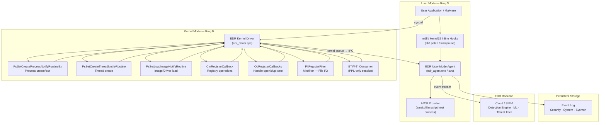

# Appendix B: EDR/AV Telemetry Architecture

> **Framing note:** Appendix này là field guide cho kiến trúc telemetry của EDR và AV từ góc nhìn Windows internals, detection engineering, và security research. Mục tiêu là giúp researcher hiểu *tại sao* telemetry được thu thập từ từng layer, *cơ chế kernel nào* đứng sau từng signal, *giới hạn nào* tồn tại ở từng sensor placement, và *pipeline nào* đưa dữ liệu từ kernel callback đến detection engine. Đây không phải hướng dẫn tắt EDR hay bypass sensor.

---

## Status

Draft implementation. Cần provider-specific verification records và build-specific callback behavior notes trước khi publication-ready.

---

## 0. Tại sao appendix này tồn tại

Chapters 1–12 đề cập telemetry ở nhiều chỗ — kernel callbacks trong Ch.2, process/thread monitoring trong Ch.3/4, memory signals trong Ch.5, I/O minifilter trong Ch.6, access control trong Ch.7, ETW trong Ch.10, file artifact trong Ch.11, service monitoring trong Ch.12. Nhưng không có chỗ nào dừng lại để vẽ **toàn bộ kiến trúc** của một EDR agent hoạt động thế nào.

Appendix này lấp đầy gap đó:

- Không có một sensor nào là đủ — layering là tất yếu kiến trúc, không phải lựa chọn.
- Kernel callback và user-mode hook có reliability và blind spot khác nhau cơ bản.
- Tamper resistance của EDR chính là ứng dụng của Ch.6 (driver), Ch.7 (PPL), Ch.9 (HVCI/VBS).
- Hiểu kiến trúc EDR = hiểu tại sao một số detection gap tồn tại, và đặt detection đúng chỗ.

---

## 1. Researcher Mindset

### 1.1 Telemetry là observation, không phải ground truth

Mọi telemetry — ETW event, kernel callback notification, user-mode API log — là **view được tạo ra bởi một sensor ở một vị trí cụ thể**. View đó bị giới hạn bởi:

- **Sensor placement**: nằm ở lớp nào trong stack?
- **Sensor privilege**: user-mode hay kernel-mode? PPL hay không?
- **Coverage**: có hook được mọi code path không?
- **Configuration**: keyword, level, buffer có đủ để capture không?
- **Availability**: callback có bị disable hoặc tamper không?

> *"Absence of telemetry is not absence of behavior. It is absence of observation at that sensor layer."*

### 1.2 Layering là tất yếu, không phải redundancy

Không có lớp sensor nào cover toàn bộ attack surface:

| Lớp sensor | Không thấy được |
|---|---|
| Win32 API hook | Code gọi Native API hoặc syscall trực tiếp |
| ntdll inline hook | Code dùng direct syscall; ntdll remapping/tamper |
| Kernel process callback | Post-creation image replacement; DKOM ẩn process |
| Kernel file minifilter | Direct disk write bỏ qua I/O Manager; encrypted volume content |
| ETW provider | ETW session chưa được start; provider bị tamper từ kernel |
| Network sensor | Encrypted tunnel; DNS-over-HTTPS; protocol anomaly ở layer thấp hơn |

Defense cần **depth** — nhiều lớp, ở nhiều trust level, với correlation.

### 1.3 Kernel-level sensor là tin cậy hơn từ góc nhìn user-mode attacker

Kernel callbacks như `PsSetCreateProcessNotifyRoutineEx` và `ObRegisterCallbacks` không bị visibility gap bởi bất kỳ user-mode technique nào — direct syscall, ntdll unhooking, API unhooking, hay AMSI bypass đều không ảnh hưởng đến callback kernel đã đăng ký. Chúng chỉ có thể bị tắt bởi code chạy ở Ring 0.

---

## 2. Big Picture

### 2.1 EDR Architecture — Tổng quan



### 2.2 Event pipeline — từ kernel callback đến detection

```
Kernel callback fires (ví dụ: PsSetCreateProcessNotifyRoutineEx)
    ↓ callback function trong EDR driver được gọi ở IRQL PASSIVE_LEVEL
    ↓ Driver collect: image path, PID, PPID, command line, token, integrity
    ↓ Driver enqueue event vào kernel-mode ring buffer / lookaside list
    ↓ IPC mechanism (ALPC / shared memory / IOCTL) → user-mode agent
    ↓ Agent decode event, enrich với additional context (DLL list, file hash, network state)
    ↓ Agent run local detection rules (signature, heuristic, behavioral)
    ↓ Agent emit event → EDR cloud / SIEM (streaming or batch)
    ↓ Cloud: correlation engine, ML model, threat intel lookup
    ↓ Alert / block / quarantine action
```

---

## 3. Key Terms

| Term | Giải thích | Tại sao quan trọng |
|---|---|---|
| **EDR** | Endpoint Detection and Response — platform thu thập telemetry, detect threats, và enable response | Kiến trúc EDR quyết định những gì nó thấy và không thấy |
| **AV** | Antivirus truyền thống — focus vào file signature scan và heuristic | AV ít kernel callback hơn EDR; detection surface hẹp hơn |
| **Sensor** | Một điểm thu thập telemetry cụ thể (callback, hook, ETW provider...) | Mỗi sensor có placement, privilege, coverage, và blind spot riêng |
| **Kernel callback** | Cơ chế OS cho phép driver đăng ký notification cho events kernel-level | Tin cậy nhất từ user-mode attacker perspective; cần kernel access để disable |
| **Minifilter** | Filter driver đăng ký với Filter Manager để intercept I/O operations | EDR primary mechanism để monitor file create/write/delete/rename |
| **ETW-TI** | Microsoft-Windows-Threat-Intelligence — ETW provider kernel-level cho high-value security events | Chỉ PPL process mới consume được; emit events như ReadVirtualMemory, WriteVirtualMemory |
| **ELAM** | Early Launch Anti-Malware — driver load trước tất cả third-party drivers ở boot | Cho phép scan drivers trước khi họ load; cần code signing đặc biệt |
| **PPL** | Protected Process Light — kernel mechanism bảo vệ EDR/AV process khỏi bị tamper dù attacker có admin | Tăng tamper resistance; cần WHQL certificate loại đặc biệt |
| **AMSI** | Antimalware Scan Interface — COM-based interface cho script hosts call để scan content | Scan script source trước khi execute; vulnerable với in-process patch |
| **IAT hook** | Import Address Table hook — ghi đè pointer trong IAT để redirect API calls | Dễ implement, dễ detect, dễ bypass bằng dynamic loading |
| **Inline hook** | Ghi đè bytes đầu của function với JMP đến hook handler | Mạnh hơn IAT hook; nhưng vẫn trong user-mode, vẫn có blind spots |
| **Instrumentation callback** | Mechanism kernel cho phép process đăng ký callback được gọi sau mỗi syscall return | Dùng bởi một số EDR để observe syscall flow; cần careful implementation |
| **ObRegisterCallbacks** | Kernel API đăng ký callback cho handle open/duplicate operations | Có thể deny hoặc strip access mask — active protection, không chỉ monitoring |
| **Altitude** | Số xác định vị trí của minifilter trong stack so với minifilters khác | Thứ tự load quyết định ai thấy I/O trước |

---

## 4. Sensor Placement Taxonomy

### 4.1 User-Mode Sensors

#### IAT Hook (Import Address Table Hook)

EDR inject vào process và patch Import Address Table — bảng pointer đến API functions trong DLLs đã import.

```
Process A memory:
IAT entry for CreateFile:
  Normal:  → kernel32.dll!CreateFileW  (0x7FF...)
  Hooked:  → edr_hook.dll!HookCreateFileW (0x7EE...)
               ↓ log event
               → kernel32.dll!CreateFileW (real call)
```

**Strengths:** Đơn giản, không cần driver, cover được Win32-level calls.

**Blind spots:**
- Code dùng `GetProcAddress` để resolve API dynamically — không qua IAT
- Code gọi Native API (`ntdll.NtCreateFile`) trực tiếp
- Code gọi direct syscall

#### Inline Hook (Trampoline Hook)

EDR patch bytes đầu tiên của function trong memory với `JMP <hook_handler>`.

```
ntdll.dll!NtCreateFile in memory:
  Normal:  MOV EAX, 55    ← syscall number
           SYSCALL
           RET
  Hooked:  JMP 0x7EE...   ← jump to EDR hook handler
           (bị overwrite)
```

**Strengths:** Cover cả Native API layer — harder to bypass than IAT hook.

**Blind spots:**
- Code allocate clean copy của ntdll từ disk và call functions từ đó (module stomping research class)
- Code parse PE headers để tìm syscall number, call SYSCALL trực tiếp
- Code dùng memory mapping của ntdll từ section đã unmapped hook region

#### AMSI (Antimalware Scan Interface)

AMSI là COM interface được script hosts (PowerShell, VBScript, JScript, .NET, Office macros) gọi để submit script content cho scan trước khi execute.

```
PowerShell execute "Invoke-Mimikatz"
    → PowerShell gọi AmsiScanBuffer() với script content
    → AMSI provider (EDR đăng ký) nhận content
    → Scan → return AMSI_RESULT_DETECTED
    → PowerShell chặn execution, throw error
```

**Strengths:** Thấy plaintext script content trước khi execute — ngay cả khi script được obfuscate, AMSI thấy content đã decode.

**Blind spots:**
- Patch `AmsiScanBuffer` function trong memory của process để luôn return `AMSI_RESULT_CLEAN`
- Load script qua mechanism không gọi AMSI (một số API paths)
- Encode payload trong memory sau khi qua AMSI scan, decode và exec in-process

#### Instrumentation Callback

Windows hỗ trợ đăng ký `InstrumentationCallback` trong KPROCESS — một function pointer được gọi sau mỗi syscall return (khi CPU return từ kernel về user mode). Một số EDR dùng để observe syscall results.

**Strengths:** Cover toàn bộ syscall flow trong process — bao gồm cả direct syscall.

**Blind spots:**
- Callback chỉ áp dụng cho process đã đăng ký — phải inject vào target process
- Attacker trong process đó có thể clear/overwrite pointer

### 4.2 Kernel-Mode Sensors — Primary Reliability Layer

#### PsSetCreateProcessNotifyRoutineEx — Process Create/Exit

```c
// Đăng ký
PsSetCreateProcessNotifyRoutineEx(MyProcessNotifyCallback, FALSE);

// Callback signature
VOID MyProcessNotifyCallback(
    PEPROCESS Process,
    HANDLE ProcessId,
    PPS_CREATE_NOTIFY_INFO CreateInfo  // NULL khi exit
);
```

Khi `CreateInfo != NULL` (process creation), driver nhận được:
- `CreateInfo->ImageFileName` — full image path của executable
- `CreateInfo->CommandLine` — full command line
- `CreateInfo->ParentProcessId` — PPID
- `CreateInfo->CreatingThreadId` — thread đã call CreateProcess
- `CreateInfo->FileOpenNameAvailable` — có thể query file object

**Khi nào fires:** Trước khi initial thread của process mới được phép chạy. Process đã được tạo nhưng chưa execute code.

**EDR action có thể thực hiện:** Set `CreateInfo->CreationStatus = STATUS_ACCESS_DENIED` để block process creation.

**Reliability:** Rất cao. Fires bất kể process được tạo qua Win32 `CreateProcess`, Native `NtCreateUserProcess`, hay direct syscall. Không bị visibility gap bởi user-mode technique.

**Blind spots:**
- Process hollowing: process được tạo (callback fires với hợp lệ image path), sau đó image bị replace với malicious code. Callback không fires lại.
- DKOM: attacker đã ở kernel có thể remove EPROCESS từ active process list sau creation.

#### PsSetCreateThreadNotifyRoutine — Thread Create

```c
PsSetCreateThreadNotifyRoutine(MyThreadNotifyCallback);

VOID MyThreadNotifyCallback(
    HANDLE ProcessId,
    HANDLE ThreadId,
    BOOLEAN Create   // TRUE=create, FALSE=exit
);
```

Fires khi thread mới được tạo trong **bất kỳ process nào** — kể cả remote thread tạo trong process khác.

**Relevance với cross-process execution:** Khi attacker gọi `CreateRemoteThread` trong target process, callback fires với ProcessId = target process. EDR có thể correlate với handle access event từ ObRegisterCallbacks để reconstruct: "Process A opened handle to Process B, then a new thread appeared in Process B" — đây là remote thread injection pattern.

**Reliability:** Cao. Không bị visibility gap từ user mode.

**Blind spots:**
- Thread pool reuse: attacker queue APC vào existing thread — không cần tạo thread mới, callback không fires.
- Fiber execution: fibers không trigger thread callback.

#### PsSetLoadImageNotifyRoutine — Image/Driver Load

```c
PsSetLoadImageNotifyRoutine(MyImageNotifyCallback);

VOID MyImageNotifyCallback(
    PUNICODE_STRING FullImageName,
    HANDLE ProcessId,         // 0 = kernel-mode (driver)
    PIMAGE_INFO ImageInfo     // base address, size, system mode flag
);
```

Fires khi:
- Executable hoặc DLL được loaded vào process memory bởi OS loader
- Kernel driver (`.sys`) được loaded — `ProcessId == 0` và `ImageInfo->SystemModeImage == TRUE`

**EDR uses:**
- Inventory DLLs trong mọi process — detect unknown/unsigned DLLs
- Hash file ngay khi load — so sánh với threat intel trước khi code execute
- Detect driver load — correlate với signed/unsigned status

**Reliability:** Cao cho standard OS loader path. 

**Blind spots:**
- Manual mapping: attacker tự parse PE, allocate memory, copy sections, fix relocations, resolve imports — không qua OS loader, callback không fires. Memory forensics (VAD scan) vẫn thấy region nhưng không có module entry.

#### CmRegisterCallback — Registry Operations

```c
CmRegisterCallbackEx(MyRegistryCallback, &Altitude, ...);

NTSTATUS MyRegistryCallback(
    PVOID CallbackContext,
    PVOID Argument1,      // REG_NOTIFY_CLASS (RegNtPreSetValueKey, etc.)
    PVOID Argument2       // operation-specific struct
);
```

Fires cho mọi registry operation — pre-operation (trước khi thực hiện) và post-operation (sau khi hoàn thành). EDR nhận được key path, value name, data type, data content.

**Ví dụ coverage:** Khi malware write autorun key `HKCU\SOFTWARE\Microsoft\Windows\CurrentVersion\Run\Malware`, callback fires với key path và value data — trước khi write xảy ra, EDR có thể deny.

**Reliability:** Cao.

**Blind spots:**
- Kernel-mode registry write bởi attacker đã ở kernel — có thể bypass callback bằng cách gọi `ZwSetValueKey` ở elevated IRQL hoặc patch callback table.
- Direct binary edit của hive file trên disk — bỏ qua registry API hoàn toàn.

#### ObRegisterCallbacks — Handle Access Control

```c
OB_OPERATION_REGISTRATION ops[] = {
    {
        PsProcessType,
        OB_OPERATION_HANDLE_CREATE | OB_OPERATION_HANDLE_DUPLICATE,
        PreHandleCallback,
        PostHandleCallback
    }
};
ObRegisterCallbacks(&cbReg, &handle);
```

Fires khi bất kỳ process nào mở handle đến process hoặc thread object. **Đây là cơ chế mạnh nhất** vì:
- Fires cho cả `OpenProcess` và `DuplicateHandle`
- Pre-callback có thể **strip access rights** khỏi requested mask
- Post-callback thấy actual handle được cấp

**Ví dụ: Bảo vệ lsass:**
```
Attacker process gọi OpenProcess(PROCESS_ALL_ACCESS, ..., lsass_pid)
    → ObRegisterCallbacks pre-callback fires trong EDR driver
    → EDR kiểm tra: target là lsass, caller không phải trusted
    → EDR strip PROCESS_VM_READ | PROCESS_VM_WRITE khỏi access mask
    → Kernel cấp handle nhưng với reduced rights
    → Attacker nhận handle — nhưng không thể ReadProcessMemory
```

**Reliability:** Cao. Fires kể cả khi caller có `SeDebugPrivilege`.

**Blind spots:**
- Attacker đã có handle từ trước khi EDR load callback (handle inheritance, early-stage attack)
- Kernel-mode attacker có thể đọc memory trực tiếp — không cần handle
- Handle duplication từ process có valid handle

#### FltRegisterFilter — Minifilter File I/O

Minifilter là filter driver đăng ký với Filter Manager (`fltmgr.sys`) và intercept I/O Request Packets (IRP) cho file operations.

```c
FltRegisterFilter(DriverObject, &FilterRegistration, &gFilter);
FltStartFiltering(gFilter);

// Pre-operation callback
FLT_PREOP_CALLBACK_STATUS PreCreate(
    PFLT_CALLBACK_DATA Data,
    PCFLT_RELATED_OBJECTS FltObjects,
    PVOID *CompletionContext
) {
    // Data->Iopb->Parameters.Create.* chứa file path, flags, access
    // Có thể set Data->IoStatus.Status = STATUS_ACCESS_DENIED để block
}
```

**Coverage:** Create, Read, Write, Delete, Rename, Directory Enumeration, Hard Link creation, Stream operations — toàn bộ I/O qua File System.

**Altitude:** Mỗi minifilter có altitude number quyết định vị trí trong stack. AV/EDR thường ở altitude 320000–360000. Minifilter với altitude cao hơn thấy I/O trước minifilter với altitude thấp hơn.

```powershell
# Xem minifilter đang load và altitude của chúng
fltmc
```

Ví dụ output:
```
Filter Name                     Num Instances    Altitude    Frame
------------------------------  -------------  ------------  -----
bindflt                                 1       409800         0
WdFilter                               16       328010         0   ← Windows Defender
FileInfo                               16       40500          0
```

**Reliability:** Cao cho I/O qua standard file system stack.

**Blind spots:**
- Direct disk write bỏ qua file system (kernel-level, raw disk access) — hoàn toàn bypass minifilter
- Encrypted volume: minifilter thấy ciphertext, không phải plaintext

### 4.3 ETW-TI — Microsoft-Windows-Threat-Intelligence

ETW-TI là ETW provider đặc biệt emit high-value security events về memory operations và process interactions. Nó khác tất cả provider khác ở chỗ:

- **Chỉ PPL-protected processes mới có thể subscribe** (EDR processes cần PPL-Antimalware hoặc cao hơn)
- Events emit **synchronously** trong context của calling thread — không bị drop như asynchronous ETW
- Coverage bao gồm những operations mà không có kernel callback nào khác cover

**Một số events của ETW-TI:**

| Event | Ý nghĩa |
|---|---|
| `ReadVirtualMemory` | Một process đọc memory của process khác — signature của credential dumping |
| `WriteVirtualMemory` | Một process ghi vào memory của process khác — signature của process injection |
| `AllocateVirtualMemory` | Memory allocation với executable protection trong context process khác |
| `ProtectVirtualMemory` | Protection change trên memory region của process khác |
| `MapViewOfSection` | Section được map vào process — có thể là PE injection via section |
| `QueueUserAPC` | APC được queued vào thread của process khác |
| `CreateThread` (remote) | Thread tạo trong context process khác |

**Ví dụ phát hiện credential dumping:**
```
[ETW-TI] ReadVirtualMemory
  Source process:   mimikatz.exe (PID 1234)
  Target process:   lsass.exe (PID 600)
  Read address:     0x7FF... (in lsass virtual address space)
  Read size:        65536 bytes
  ← Đây là signal rõ ràng cho memory-based credential access
```

---

## 5. Tamper Resistance Mechanisms

### 5.1 PPL cho EDR Driver và Agent

EDR/AV vendor có thể đăng ký process của họ như PPL với signer level `Antimalware` (level 3). Điều này có nghĩa:

- Admin không thể `OpenProcess` với debug rights vào EDR agent process
- Malware không thể inject DLL vào EDR agent để blind sensor
- Malware không thể terminate EDR agent trực tiếp từ user mode

```
EPROCESS.Protection của EDR agent:
    Type   = ProtectedLight (1)
    Signer = Antimalware (3)
```

Để bypass, attacker cần:
1. Kernel-mode access để modify `EPROCESS.Protection` byte
2. Hoặc load PPL-signed driver của riêng họ với signer level ≥ Antimalware

### 5.2 ELAM — Early Launch Anti-Malware

ELAM driver được load ở boot time **trước tất cả third-party drivers**. Từ vị trí này, ELAM có thể:
- Scan các drivers sắp được loaded và mark chúng (Known Good / Unknown / Known Bad)
- Thông báo cho Windows Boot Loader về trust status của driver
- Cung cấp data cho PPL protection sau khi OS boot

ELAM driver phải:
- Được sign bởi Microsoft với ELAM certificate
- Có kích thước tối thiểu (để load nhanh ở boot)
- Chỉ có read-only access đến registry hives tại boot

### 5.3 Driver Signing và HVCI

Từ Windows 10 x64, kernel-mode drivers phải được signed với WHQL signature (hoặc EV code signing certificate). HVCI (Hypervisor-Protected Code Integrity) thêm một lớp nữa:

- Hypervisor kiểm soát EPT (Extended Page Tables) — page nào là executable trong kernel
- Chỉ code đã pass Code Integrity check mới được mark executable
- Attacker không thể inject shellcode vào kernel memory và execute nó kể cả khi có kernel R/W primitive

**Implication:** BYOVD (Bring Your Own Vulnerable Driver) vẫn là vector — driver hợp lệ được signed, được load qua normal path. Nhưng arbitrary code injection vào kernel memory (không qua signed driver) bị block bởi HVCI.

### 5.4 Callback Table Protection

Kernel duy trì lists của registered callbacks (process notify, thread notify, image load, registry...). Attacker với kernel access có thể patch các lists này để remove EDR callbacks. Một số EDR đăng ký nhiều callbacks từ nhiều driver, hoặc dùng VBS-protected memory cho callback pointers để make tampering harder.

---

## 6. Detection Logic Tiers

### 6.1 Signature-based Detection

Match event hoặc file content với known bad pattern:

- **File hash**: SHA-256 của executable match known malware hash
- **YARA rule**: byte pattern match trong memory hoặc file
- **IoC**: IP address, domain, registry key path match threat intel feed

**Strengths:** High precision, fast, explainable.
**Weaknesses:** Zero-day bypass; trivial to evade by changing one byte.

### 6.2 Heuristic Detection

Pattern matching trên behavior attributes không nhất thiết phải match exact signature:

- Process spawn từ Office application với encoded command line
- Service install với binary path trong `%TEMP%`
- DLL loaded từ `%APPDATA%` với no publisher certificate

**Strengths:** Catch variations.
**Weaknesses:** False positives; attacker có thể design malware để pass heuristic checks.

### 6.3 Behavioral Detection

Correlate nhiều events theo timeline để detect attack pattern:

```
T+0s: explorer.exe spawns powershell.exe với base64-encoded command
T+2s: powershell.exe loads System.Net.WebClient
T+3s: powershell.exe makes outbound connection to 198.51.100.10:443
T+4s: powershell.exe writes file to %APPDATA%\update.exe
T+5s: powershell.exe executes update.exe
    → Detection: download-and-execute chain via PowerShell
```

**Strengths:** Khó bypass vì phải change toàn bộ behavior pattern.
**Weaknesses:** Cần event correlation engine; latency; false positives ở environments unusual.

### 6.4 ML-based Detection

Model học từ historical data để classify behavior:

- File-based ML: PE features (import table, section entropy, header fields)
- Sequence model: chuỗi API calls hoặc system events theo thứ tự
- Graph-based: process tree + network + file graph anomaly detection

**Strengths:** Detect unknown/novel threats.
**Weaknesses:** Black box; adversarial examples; model drift; requires infrastructure.

---

## 7. Case Studies — Detection Architecture Examples

### 7.1 Process Injection Detection

**Attack flow:**
```
1. attacker.exe → OpenProcess(PROCESS_VM_WRITE | PROCESS_CREATE_THREAD, target.exe)
2. attacker.exe → VirtualAllocEx(target.exe, PAGE_EXECUTE_READWRITE, 4096)
3. attacker.exe → WriteProcessMemory(target.exe, alloc_addr, shellcode, 4096)
4. attacker.exe → CreateRemoteThread(target.exe, ..., alloc_addr)
```

**EDR signals correlating:**

| Step | Signal | Source |
|---|---|---|
| Step 1 | Handle open với VM_WRITE + CREATE_THREAD đến target | ObRegisterCallbacks pre-callback |
| Step 1 | Event 4656 (object access) | Security Event Log |
| Step 1 | Sysmon Event 10 (ProcessAccess) | Sysmon |
| Step 2 | ETW-TI AllocateVirtualMemory với PAGE_EXECUTE_READWRITE trong process khác | ETW-TI consumer |
| Step 3 | ETW-TI WriteVirtualMemory — write vào region đã alloc | ETW-TI consumer |
| Step 4 | PsSetCreateThreadNotifyRoutine fires với ProcessId = target | Kernel callback |
| Step 4 | Sysmon Event 8 (CreateRemoteThread) | Sysmon |

Correlation: handle open (step 1) + alloc with RWX (step 2) + write to same range (step 3) + new thread at write address (step 4) = process injection pattern.

### 7.2 Credential Dumping Detection (lsass Memory Read)

**Attack flow:**
```
1. attacker.exe → OpenProcess(PROCESS_VM_READ, lsass.exe)
2. attacker.exe → ReadProcessMemory(lsass_handle, addr, buf, size)
```

**EDR signals:**

| Step | Signal | Source |
|---|---|---|
| Step 1 | Handle open với PROCESS_VM_READ đến lsass.exe | ObRegisterCallbacks — EDR strips VM_READ, handle cấp với reduced rights |
| Step 1 | Event 4656: Object Access — lsass handle request | Security Event Log |
| Step 1 | Sysmon Event 10: ProcessAccess — GrantedAccess mask | Sysmon |
| Step 2 | ETW-TI ReadVirtualMemory — source=attacker, target=lsass | ETW-TI (nếu handle không bị stripped đủ) |

Nếu ObRegisterCallbacks stripped VM_READ, bước 2 fail với ACCESS_DENIED. Tổ hợp "handle open attempt đến lsass bởi non-system process" là signal đủ mạnh dù bị block.

### 7.3 Driver-Based Attack Detection (BYOVD)

**Attack flow:**
```
1. Attacker drop vulnerable_driver.sys vào disk
2. Attacker install service: sc create vuln_svc binpath=vulnerable_driver.sys type=kernel
3. Attacker start service: sc start vuln_svc
4. Driver loads → attacker exploit vulnerability để gain kernel code execution
```

**EDR signals:**

| Step | Signal | Source |
|---|---|---|
| Step 1 | Minifilter: File create event cho .sys file in temp/user-writable dir | FltRegisterFilter callback |
| Step 1 | File hash check against known vulnerable driver database | Agent enrichment |
| Step 2 | Registry write đến HKLM\SYSTEM\CurrentControlSet\Services\ | CmRegisterCallback |
| Step 2 | Event 7045: New service installed với type=kernel | System Event Log |
| Step 3 | PsSetLoadImageNotifyRoutine fires với SystemModeImage=TRUE | Kernel image load callback |
| Step 3 | ELAM có thể mark driver Unknown/Bad nếu đã có signature tương ứng | ELAM early boot |
| Step 4 | Detection depends on what exploit does — callback tamper, DKOM, etc. | Behavioral correlation |

---

## 8. Labs

### Lab B.1 — Xem registered kernel callbacks qua WinDbg

**Goal:** List actual callbacks đang registered trong kernel — bao gồm EDR callbacks.

**Requirements:** WinDbg kernel debugging (local kernel debug hoặc VM với COM port), system symbols.

**Steps:**
```windbg
; Xem process notify callbacks
kd> dt nt!_EX_CALLBACK_ROUTINE_BLOCK
kd> !process 0 0   ← để warm up symbols

; Dump PspCreateProcessNotifyRoutine array
kd> dq nt!PspCreateProcessNotifyRoutine L20
; Mỗi entry là pointer đến callback routine (low 3 bits là flags, mask với ~0x7)
; Unobscure:
kd> .for (r $t0 = 0; $t0 < 8; $t0 = $t0 + 1) { dq poi(nt!PspCreateProcessNotifyRoutine + (@$t0 * 8)) L1 }

; Xem thread notify callbacks
kd> dq nt!PspCreateThreadNotifyRoutine L10

; Xem image load callbacks
kd> dq nt!PspLoadImageNotifyRoutine L10
```

**Expected observations:** Mỗi registered EDR xuất hiện như một entry trong array. Tên module có thể được resolved từ pointer.

**Note:** Exact symbol names có thể thay đổi theo Windows build. Consult WI7 hoặc ntoskrnl symbols.

**Cleanup:** Read-only — không cần.

---

### Lab B.2 — Xem minifilter altitude với fltmc

**Goal:** List tất cả minifilters đang active và altitude của chúng.

**Requirements:** Admin PowerShell hoặc cmd.

**Steps:**
```powershell
# Xem tất cả minifilter và altitude
fltmc

# Xem instances của một filter cụ thể
fltmc instances -f WdFilter

# Xem volumes được monitor
fltmc volumes
```

**Expected observations:**
- Windows Defender (WdFilter) ở altitude 328010
- Các EDR vendor có altitude riêng trong range 320000–360000
- Thứ tự altitude quyết định ai thấy I/O trước

**Cleanup:** Read-only — không cần.

---

### Lab B.3 — Observe Process Creation Events qua ETW

**Goal:** Capture real-time process creation events từ kernel provider.

**Requirements:** Admin PowerShell.

**Steps:**
```powershell
# Bật ETW session để capture process events
logman start ProcessTrace -p "Microsoft-Windows-Kernel-Process" -o C:\Temp\process_trace.etl -ets

# Tạo một process để generate event
Start-Process notepad.exe
Start-Sleep 2
Stop-Process -Name notepad -Force

# Stop trace
logman stop ProcessTrace -ets

# Read events
Get-WinEvent -Path C:\Temp\process_trace.etl | 
    Where-Object { $_.Id -in 1,2 } |  # 1=ProcessStart, 2=ProcessStop
    Select-Object TimeCreated, Id, Message |
    Format-List
```

**Expected observations:**
- Event ID 1: ProcessStart với ImageName, ProcessID, ParentProcessId
- Event ID 2: ProcessStop với ProcessID, ExitCode

**Cleanup:**
```powershell
Remove-Item C:\Temp\process_trace.etl -ErrorAction SilentlyContinue
```

---

## 9. Common Researcher Mistakes

| Sai lầm | Thực tế |
|---|---|
| "Nếu không có alert thì không có attack" | Alert phụ thuộc detection rule, sensor coverage, và threshold. Absence of alert ≠ absence of attack |
| "EDR hook tất cả API calls" | EDR hook ở specific layers; có nhiều paths không đi qua hook layer |
| "SYSTEM account là kernel mode" | SYSTEM vẫn là user mode. Kernel mode cần Ring 0 code execution |
| "Nếu bypass ntdll hook thì EDR không thấy gì" | Kernel callbacks (Ps, Ob, Cm, minifilter) không bị ảnh hưởng bởi ntdll hook bypass |
| "PPL ngăn mọi attack vào protected process" | PPL ngăn user-mode attack. Kernel-mode attacker có thể patch EPROCESS.Protection |
| "ETW-TI cung cấp realtime stream cho mọi consumer" | ETW-TI chỉ accessible cho PPL-protected consumers; phải có proper signing |
| "Disable một EDR service là đủ" | Driver vẫn load; kernel callbacks vẫn active; minifilter vẫn intercept I/O |
| "AMSI bypass = bypass toàn bộ EDR" | AMSI là một lớp trong user mode. Kernel-level behavioral detection không bị ảnh hưởng |
| "HVCI ngăn mọi kernel exploit" | HVCI ngăn arbitrary code execution trong kernel. BYOVD (signed vulnerable driver) vẫn là vector |

---

## 10. References

### Microsoft Documentation
- [Kernel-Mode Driver Architecture: Callback Objects](https://learn.microsoft.com/en-us/windows-hardware/drivers/kernel/callback-objects)
- [PsSetCreateProcessNotifyRoutineEx](https://learn.microsoft.com/en-us/windows-hardware/drivers/ddi/ntddk/nf-ntddk-pssetcreateprocessnotifyroutineex)
- [ObRegisterCallbacks](https://learn.microsoft.com/en-us/windows-hardware/drivers/ddi/wdm/nf-wdm-obregistercallbacks)
- [Filter Manager and Minifilter Architecture](https://learn.microsoft.com/en-us/windows-hardware/drivers/ifs/filter-manager-concepts)
- [Early Launch AntiMalware](https://learn.microsoft.com/en-us/windows-hardware/drivers/install/early-launch-antimalware)
- [AMSI Overview](https://learn.microsoft.com/en-us/windows/win32/amsi/antimalware-scan-interface-portal)
- [Virtualization-Based Security](https://learn.microsoft.com/en-us/windows-hardware/design/device-experiences/oem-vbs)

### Windows Internals Book
- WI7 Part 1, Chapter 2: System Architecture — kernel callbacks overview
- WI7 Part 1, Chapter 3: Processes — PsSetCreateProcessNotifyRoutineEx
- WI7 Part 1, Chapter 4: Threads — PsSetCreateThreadNotifyRoutine
- WI7 Part 1, Chapter 6: I/O System — minifilter architecture
- WI7 Part 1, Chapter 7: Security — ObRegisterCallbacks, PPL

### Research Blogs / Papers
- [windows-internals.com](https://windows-internals.com) — kernel internals blog từ WI7 authors
- [Alex Ionescu — "Protected Processes"](https://www.alex-ionescu.com/?p=97)
- [Microsoft Security Response Center — ETW Threat Intelligence](https://www.microsoft.com/en-us/security/blog/)
- [j00ru syscall table](https://j00ru.vexillium.org/syscalls/nt/64/) — syscall numbers

---

*Appendix B — Phụ lục sau: [Appendix C — Kernel Debugging Field Guide](app-c-kernel-debugging-field-guide.md)*
