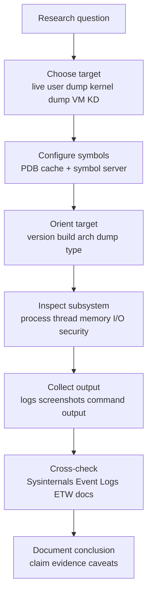

# Appendix C: Kernel Debugging Field Guide

> **Framing note:** Appendix này là field guide cho **read-only Windows kernel debugging** và crash dump analysis. Mục tiêu là giúp researcher dùng WinDbg như một công cụ quan sát có kỷ luật: hiểu process/thread/memory/I/O/security state, đọc crash dump không đoán mò, map commands về các chapter Windows Internals, và ghi chép kết luận có source-layer + build/config caveats. Đây không phải guide patch memory, disable protections, hay thao tác live target theo hướng destructive.

---

## 0. Why this appendix exists

12 core chapters nhắc WinDbg nhiều lần:

- Ch.2: architecture, kernel/executive managers, system processes.
- Ch.3: process objects, EPROCESS, PEB, handles, address space.
- Ch.4: threads, ETHREAD/KTHREAD, waits, stacks.
- Ch.5: memory, VAD, PTE, sections, page faults.
- Ch.6: I/O, IRP, driver object, device object, file object, device stacks.
- Ch.7: tokens, privileges, security descriptors, PPL.
- Ch.8: Object Manager, syscalls, exceptions, debugging mechanisms.
- Ch.9: VBS/HVCI, VTL, Secure Kernel visibility limits.
- Ch.10: diagnostics, Event Logs, WER, dumps, tracing.
- Ch.11: file cache, mapped files, file objects, filesystem artifacts.
- Ch.12: boot, crash, shutdown, boot debugging, hiber/dump context.
- Appendix E: repeatable lab setup, symbols, snapshots, notes.

WinDbg appears across all of these because it is not “one tool for crashes.” It is a structured inspection interface for runtime state and dump state. But debugger output is not magic truth. It depends on:

- Windows build and architecture.
- Dump type and memory availability.
- Symbol quality.
- Extension command availability.
- VBS/HVCI/PPL state.
- Whether target is live or a stale snapshot.
- Whether you are in correct process/thread/register context.

This appendix consolidates a practical workflow for **read-only inspection**: orient, verify symbols, choose context, inspect subsystem, cross-check with other evidence, and document limits.

---

## 1. Researcher Mindset

### 1.1 Debugger output is evidence, not automatically truth

WinDbg shows a view produced by debugger engine + symbols + dump/live target memory + extension logic. That view can be incomplete, stale, or misinterpreted.

Examples:

- `!process` shows process state, but command line may be absent in a kernel dump or stale in PEB.
- `!vad` depends on symbols and available memory; minidumps may not contain enough memory.
- `!token` output must be interpreted using Ch.7 security model: SID, groups, privileges, integrity level, impersonation, PPL context.
- `!drvobj` and `!devstack` require Ch.6 I/O model: driver object vs device object vs attachment stack vs IRP path.
- Stack traces can be incomplete because of optimized code, missing frame pointers, corrupted stack, trap/context confusion, or wrong architecture mode.
- PPL/VBS/HVCI can change what is visible or allowed.

Debugger output should be treated like witness testimony: useful, often high-value, but scoped.

### 1.2 Always record context

Before any conclusion, record:

| Field | Why it matters |
|-------|----------------|
| Windows build/revision | Structures, commands, providers, mitigations change |
| Edition | Client/server features differ |
| Architecture | x64/ARM64/x86 affects registers, stack, commands |
| Dump/live target type | Determines available memory and timing |
| Dump type | Complete/kernel/small/user/triage limits analysis |
| Symbol path | Bad symbols cause bad interpretations |
| Debugger version | Extension behavior changes |
| VBS/HVCI state | Affects driver/memory/security assumptions |
| Secure Boot state | Boot trust context |
| PPL/LSA protection state | Affects user-mode inspection and security conclusions |
| Snapshot/lab name | Reproducibility |
| Time zone/time of dump | Timeline correlation |

### 1.3 Never trust structure offsets without symbols

Private kernel structures are build-specific. `dt nt!_EPROCESS`, `dt nt!_ETHREAD`, `_KTHREAD`, `_MMVAD`, `_MMPTE`, `_TOKEN`, `_IRP`, `_FILE_OBJECT`, `_DEVICE_OBJECT` can differ by build.

> Research caveat:
> Structure fields, offsets, and extension output are build-, symbol-, architecture-, and configuration-dependent. Treat them as a research model, then verify on the target build with public symbols, WinDbg, Microsoft documentation, and controlled lab observations.

### 1.4 Use multiple views

Do not end analysis at WinDbg. Cross-check with:

- Sysinternals: Process Explorer, VMMap, RAMMap, Handle, Procmon.
- Event Logs and WER reports.
- ETW/WPR traces if captured.
- Memory forensics frameworks when appropriate.
- File artifacts: MFT/USN/PML/ETL.
- Microsoft docs and Windows Internals chapters.
- Controlled reproduction in lab VM.

A strong conclusion usually says: “WinDbg output supports X; Event Log/Procmon/ETW/Sysinternals also supports Y; limitation Z remains.”

### 1.5 Prefer read-only observation first

This appendix focuses on commands that inspect. Avoid commands that write memory, patch state, resume/alter target timing, change BCD, enable verifier, or unload/load drivers unless a separate controlled lab explicitly requires it.

Read-only first principle:

1. Open dump or attach read-only where possible.
2. Record target and symbol state.
3. Log commands.
4. Inspect without modifying.
5. Save output.
6. Cross-check.
7. Document limits.

---

## 2. Big Picture

### 2.1 Debugging workflow



### 2.2 Debugging layers

```text
Source/documentation
  ↓
Symbols/PDB
  ↓
Debugger engine
  ↓
Live target or dump
  ↓
Kernel/user structures
  ↓
Commands/extensions
  ↓
Observation
  ↓
Hypothesis
  ↓
Cross-validation
```

If symbols are wrong, structure interpretation is wrong. If dump lacks memory, commands fail or show partial state. If target is live, state changes while you inspect. If VBS is active, some secure-world state may be outside normal visibility.

### 2.3 User-mode vs kernel-mode debugging

| Dimension | User-mode debugging | Kernel-mode debugging |
|-----------|--------------------|-----------------------|
| Scope | One process | Whole kernel/system context |
| Typical target | EXE/process dump | Kernel dump/live VM/bugcheck |
| Visibility | User address space, modules, heaps, threads | Kernel objects, drivers, IRPs, device stacks, processes |
| Risk | Lower; target process timing changes | Higher; system-wide timing/boot risk |
| Common tools | WinDbg, x64dbg, ProcDump | WinDbg KD, crash dumps, LiveKD |
| Best for | App crash, malware user-mode behavior, API/state | Driver crash, kernel memory, object/I/O/security state |

### 2.4 Live debugging vs dump debugging

**Live debugging:** target continues to exist and can change. Breakpoints and inspection can alter timing. Useful for interactive exploration, but not always reproducible.

**Dump debugging:** point-in-time snapshot. Safe and repeatable, but cannot show future state and may lack memory depending dump type.

**Crash dump analysis:** asks “why did this fail at this point?” Start with bugcheck/exception/context/stack, then validate.

**Interactive debugging:** asks “what happens if I observe/step/break here?” Higher risk; outside this appendix’s read-only focus unless in a lab.

---

## 3. Key Terms

| Term | Vietnamese explanation | Researcher relevance |
|------|------------------------|----------------------|
| **WinDbg** | Microsoft debugger for user/kernel/dump analysis | Primary inspection tool |
| **Debugger engine** | Core engine behind WinDbg/CDB/KD | Command behavior depends on engine/version |
| **Symbol** | Name/type/debug metadata for binaries | Turns addresses into meaningful structures/functions |
| **PDB** | Program Database file | Symbol/type information source |
| **Symbol path** | Path/server chain for loading symbols | Bad path = bad analysis |
| **Microsoft symbol server** | Public server for Microsoft symbols | Needed for ntoskrnl/drivers/user DLLs |
| **Public symbol** | Limited symbol metadata | Often enough for function names and many types |
| **Private symbol** | Full internal symbol metadata | Usually not available; do not assume |
| **Extension command** | `!command` provided by debugger extension | Version/target dependent |
| **Live debugging** | Debugging running target | State can change; timing affected |
| **Crash dump** | Snapshot after crash/bugcheck/failure | Root cause analysis artifact |
| **Kernel dump** | Kernel memory dump | Kernel state, not full user memory |
| **Complete memory dump** | Full physical memory dump | Rich but large/sensitive |
| **Small memory dump / minidump** | Minimal crash data | Fast but limited memory |
| **User-mode dump** | Dump of one process | Process-level crash/reversing |
| **Triage dump** | Reduced diagnostic dump | Quick first look, many limits |
| **Bugcheck** | Kernel stop code | Starting point for crash analysis |
| **Exception** | CPU/software exception | User or kernel fault/control path |
| **Stack trace** | Call chain view | High-value but imperfect evidence |
| **Call frame** | One stack level | Needs symbols/context |
| **Register context** | CPU register state at point | Essential for exception/bugcheck |
| **Module** | Loaded image: EXE/DLL/SYS | Address range + symbols |
| **Driver** | Kernel module | I/O/security/boot crash relevance |
| **ntoskrnl** | Windows kernel image | Core kernel symbols/types |
| **HAL** | Hardware Abstraction Layer | Hardware/platform abstraction |
| **Process object** | Kernel representation of process | EPROCESS-backed state |
| **Thread object** | Kernel representation of thread | ETHREAD/KTHREAD-backed state |
| **ETHREAD** | Executive thread structure | Thread metadata |
| **EPROCESS** | Executive process structure | Process metadata |
| **KTHREAD** | Scheduler thread structure | Scheduling/wait/stack state |
| **PEB** | User-mode Process Environment Block | Process params/modules; user-mode view |
| **TEB** | Thread Environment Block | User-mode thread state |
| **VAD** | Virtual Address Descriptor | Process VA region metadata |
| **PTE** | Page Table Entry | VA→PA/protection/page state |
| **Handle table** | Per-process handle mapping | Object access evidence |
| **Object** | Object Manager resource | Handles reference objects |
| **Token** | Security identity object | SID/groups/privileges/integrity |
| **IRP** | I/O Request Packet | I/O operation state |
| **Device object** | Kernel object for device stack node | I/O routing |
| **Driver object** | Kernel object for driver | Dispatch routines/devices |
| **Symbol mismatch** | Symbols do not match binary | Invalid output risk |
| **Build-specific structure** | Layout changes by build | Verify every target |
| **VBS** | Virtualization-Based Security | Can limit normal visibility/model |
| **HVCI** | Hypervisor-Protected Code Integrity | Driver/memory assumptions change |
| **PPL** | Protected Process Light | User-mode access/debug limits |

---

## 4. Core Debugging Workflow

### 4.1 Prepare debugger environment

Install WinDbg Preview or Debugging Tools for Windows. Keep debugger version in notes.

Recommended symbol path:

```text
SRV*C:\Symbols*https://msdl.microsoft.com/download/symbols
```

WinDbg commands:

```windbg
.sympath SRV*C:\Symbols*https://msdl.microsoft.com/download/symbols
.reload
.sympath
```

Useful symbol diagnostics:

```windbg
!sym noisy
.reload /f nt
!sym quiet
lm
lmvm nt
```

**Why symbols matter:**

- Without symbols, addresses remain opaque.
- Wrong symbols produce wrong stack/function/type interpretation.
- Type commands (`dt nt!_EPROCESS`) depend on symbol type info.
- Extension commands often rely on matching symbols.

**Local cache:** `C:\Symbols` stores downloaded PDBs. It can grow large and should be documented.

### 4.2 Choose target type

| Target | What you can inspect | Limits | Typical use |
|--------|----------------------|--------|-------------|
| User-mode live process | Threads, modules, heaps, user memory | Timing changes; PPL may block | App/malware/reversing |
| User-mode dump | Process snapshot | No future state; dump scope limited | Crash/hang triage |
| Kernel crash dump | Kernel state at bugcheck | User memory may be limited | Driver/kernel crash |
| Complete memory dump | Broad memory state | Large/sensitive | Deep forensics/debug |
| Small minidump | Bugcheck basics | Many commands fail/partial | First triage |
| Live local kernel | Some local kernel inspection | Restricted vs full KD | Quick state checks |
| VM kernel debugging | Full interactive KD in VM | Setup complexity; timing altered | Driver/boot research |
| Forensic memory dump | Acquired physical memory | Tool/dump format limits | Memory forensics correlation |

### 4.3 Start with orientation

Do not jump directly to conclusions. Orient first:

```windbg
vertarget
version
.time
.effmach
.sympath
.reload
lm
!analyze -v
.bugcheck
```

If available:

```windbg
!sysinfo machineid
!sysinfo cpuspeed
```

Record:

- OS version/build.
- Architecture/effective machine.
- Dump type.
- Uptime/time of crash.
- Loaded module list.
- Symbol state.
- Current process/thread.

### 4.4 Crash dump triage

Start with:

```windbg
!analyze -v
.bugcheck
kv
lm
r
```

Then inspect context:

```windbg
.cxr <context_record>
.exr <exception_record>
.trap <trap_frame>
!thread
!process
```

Crash triage questions:

1. What is bugcheck code and parameters?
2. What was current thread/process?
3. What stack path led to crash?
4. Which module owns the faulting instruction?
5. Is there an exception/trap/context record?
6. Were drivers recently loaded or on stack?
7. Is memory available enough to inspect objects?
8. Does Event Log/WER/driver install timeline support the hypothesis?

> Research caveat:
> `!analyze -v` is a starting point, not final truth. It can identify a probable module or pattern, but root cause requires stack/context/object/timeline validation.

### 4.5 Process inspection

Commands:

```windbg
!process 0 0
!process 0 1
!process <EPROCESS> 1
!process <EPROCESS> 7
dt nt!_EPROCESS <EPROCESS>
.process /p /r <EPROCESS>
```

What it answers:

- Process list.
- Current process.
- PID and image name.
- Session.
- Threads.
- Handle table pointer conceptually.
- Token pointer conceptually.
- Address space context.

Caveats:

- EPROCESS fields are build/symbol-dependent.
- ImageFileName can be truncated and is not full path.
- Command line may live in PEB/user memory and may be missing.
- `.process /p /r` changes debugger context, not target memory, but affects later commands.
- PID display can be hex in some contexts; document carefully.

### 4.6 Thread inspection

Commands:

```windbg
!thread
~
~* k
k
kv
!stacks
dt nt!_ETHREAD <ETHREAD>
dt nt!_KTHREAD <KTHREAD>
```

What it answers:

- Current thread.
- Thread state/wait reason.
- Kernel stack.
- User stack if available and context set.
- Owning process.
- Start address clues.
- IRP association sometimes visible.

Caveats:

- Wait reasons are state snapshots, not full causality.
- Stack may be stale/corrupt/incomplete.
- User stack may not be present in kernel dump.
- StartAddress/Win32StartAddress needs Ch.4 interpretation.

### 4.7 Stack walking

Commands:

```windbg
k
kb
kv
kp
kn
r
.frame <n>
.cxr <addr>
.trap <addr>
```

Stack interpretation:

- `k` shows call stack.
- `kb` includes first parameters where possible.
- `kv` adds frame details and FPO/unwind info.
- `kp` displays parameters with symbols when possible.
- `kn` numbers frames.
- `.frame` changes selected frame.
- `.cxr` sets context record.
- `.trap` sets trap frame context.

Research notes:

- Stack is high-value but not perfect.
- Optimized/inlined functions can hide frames.
- Wrong context produces misleading stack.
- Correlate with module list, current thread, registers, and disassembly if needed.

### 4.8 Module and driver inspection

Commands:

```windbg
lm
lmv
lmvm <module>
!lmi <module>
!drvobj <driver> 2
!devobj <device>
!devstack <device>
!object \Driver\<name>
```

What it answers:

- Loaded modules/drivers.
- Base address and image range.
- Timestamp/checksum/version info when available.
- Driver object and dispatch routines.
- Device objects created by driver.
- Device stack attachment order.

Caveats:

- Module timestamp/signature info is not a full trust verdict.
- Unloaded drivers may require separate commands/logs and may not be available.
- Driver object exists only if loaded at dump time.
- Device stack interpretation requires Ch.6 model.

### 4.9 Memory inspection

Commands:

```windbg
!address
!vad
!pte <address>
db <addr>
dc <addr>
dd <addr>
dq <addr>
du <addr>
da <addr>
s -a <range> <string>
!pool <addr>
!heap
```

What it answers:

- VA regions and protections.
- VAD tree / mapped files / private memory.
- PTE/page state.
- Raw bytes/strings/pointers.
- Pool allocation clues.
- User heap state in user-mode dumps.

Caveats:

- PTE/VAD/pool details are build-dependent.
- Memory may be paged out or absent from dump.
- Searching memory can produce false positives.
- `!pool` requires correct pool context and available memory.
- VBS/HVCI can alter assumptions about executable memory and secure-world visibility.

### 4.10 Handles and objects

Commands:

```windbg
!handle
!handle 0 0 <EPROCESS>
!handle <handle> f <EPROCESS>
!object
!object \Device
!object \Sessions
!obtrace
```

What it answers:

- Per-process handles.
- Object type and granted access.
- Object Manager namespace.
- Device/session/base named object paths.
- Reference/lifetime clues.

Caveats:

- Handle values are per-process.
- Granted access needs object-specific interpretation.
- Object lifetime can outlive names or handles.
- `!obtrace` availability/config depends on target.

### 4.11 Token and security inspection

Commands:

```windbg
!token <token>
!process <EPROCESS> 1
!handle 0 0 <EPROCESS>
!object <security-relevant-object>
```

What it answers:

- User SID.
- Groups.
- Privileges.
- Integrity level if visible.
- Token type/impersonation clues.
- Security context of process/thread.

Caveats:

- Token output requires Ch.7 model.
- Privilege present vs enabled matters.
- Thread impersonation can differ from process token.
- PPL may restrict user-mode inspection, though kernel dump view differs.
- Credential Guard/VBS affects credential material visibility, not necessarily token metadata in same way.

### 4.12 I/O and driver debugging

Commands:

```windbg
!irp <IRP>
!fileobj <FILE_OBJECT>
!drvobj <driver> 2
!devobj <device>
!devstack <device>
!devnode
!fltkd.filters
!fltkd.instances
!fltkd.volume
```

What it answers:

- IRP major/minor function and stack locations.
- Current I/O owner/waiting thread clues.
- File object path/state if available.
- Device stack path.
- Driver dispatch table.
- Minifilter inventory if fltkd extension works.

Caveats:

- IRP may be completed, reused, or absent.
- File object name can be empty/stale depending state.
- Minifilter extension availability differs.
- I/O stack must be interpreted with Ch.6 and Ch.11.

### 4.13 VBS/HVCI/PPL caveats

- Normal kernel debugging may not expose VTL1 secure-world internals.
- HVCI can affect driver loading and executable memory assumptions.
- PPL restricts user-mode access and changes tool behavior.
- Kernel dumps may not contain secure-world data.
- LSA protection/Credential Guard affect LSASS analysis.
- Always document feature state and avoid comparing VBS-enabled and disabled targets as equivalent.

---

## 5. Important Commands / Structures

### 5.1 Command map

| Area | Commands | What it answers | Caveats |
|------|----------|-----------------|---------|
| Orientation | `vertarget`, `version`, `.time`, `.effmach`, `lm` | Build, arch, time, modules | Summary only; verify symbols |
| Symbols | `.sympath`, `.reload`, `!sym noisy`, `lmvm` | Symbol path and load state | Mismatch ruins analysis |
| Crash triage | `!analyze -v`, `.bugcheck`, `kv`, `r` | Bugcheck, stack, context hints | Starting point only |
| Process | `!process`, `.process`, `dt nt!_EPROCESS` | Process list/state/address space | Build/symbol-dependent |
| Thread | `!thread`, `~* k`, `!stacks`, `dt nt!_ETHREAD` | Thread state/stacks/waits | Snapshot, not full causality |
| Stack | `k`, `kb`, `kv`, `kp`, `.frame`, `.cxr`, `.trap` | Call path/context | Can be incomplete/corrupt |
| Modules/drivers | `lm`, `lmvm`, `!drvobj`, `!devobj`, `!devstack` | Loaded images/driver/device stack | Signer/trust not fully shown |
| Memory/VAD/PTE | `!address`, `!vad`, `!pte`, `db/dc/dd/dq/du/da`, `s` | Memory layout/raw data | Dump may lack pages |
| Handles/objects | `!handle`, `!object`, `!obtrace` | Object namespace/handles/access | Per-process handle context |
| Token/security | `!token`, `!process`, `!handle` | SID/groups/privileges | Needs Ch.7 interpretation |
| I/O/IRP/device | `!irp`, `!fileobj`, `!drvobj`, `!devstack`, `!fltkd.*` | I/O path and file/device state | Extension availability varies |
| Exceptions | `.exr`, `.cxr`, `.trap`, `r`, `ub`, `u` | Exception/register/instruction context | Correct context required |
| Logging output | `.logopen`, `.logclose`, `.printf` | Reproducible command record | Logs may contain secrets |

### 5.2 Structure map

| Structure | Chapter dependency | What it represents | Verify with |
|-----------|-------------------|--------------------|-------------|
| `EPROCESS` | Ch.3 | Kernel process metadata | `!process`, `dt nt!_EPROCESS`, symbols |
| `ETHREAD` | Ch.4 | Executive thread metadata | `!thread`, `dt nt!_ETHREAD` |
| `KTHREAD` | Ch.4 | Scheduler/wait/stack state | `dt nt!_KTHREAD`, `!thread` |
| `PEB` | Ch.3/Ch.5 | User-mode process environment | `.process`, user memory availability |
| `TEB` | Ch.4 | User-mode thread environment | thread context/user dump |
| `VAD` | Ch.5 | Virtual address region metadata | `!vad`, `!address` |
| `PTE` | Ch.5 | Page table entry | `!pte`, architecture docs |
| `OBJECT_HEADER` high-level | Ch.8 | Object Manager metadata wrapper | `!object`, symbols |
| `HANDLE_TABLE` high-level | Ch.3/Ch.8 | Per-process handle table | `!handle`, `!process` |
| `TOKEN` | Ch.7 | Security identity and privileges | `!token`, access token docs |
| `IRP` | Ch.6 | I/O request packet | `!irp`, WDK docs |
| `FILE_OBJECT` | Ch.6/Ch.11 | Open file instance | `!fileobj`, I/O model |
| `DEVICE_OBJECT` | Ch.6 | Device stack node | `!devobj`, `!devstack` |
| `DRIVER_OBJECT` | Ch.6 | Loaded driver object | `!drvobj`, `!object \Driver` |

---

## 6. Trust Boundaries

### 6.1 Debugger vs target boundary

Debugger observation changes how you think about the target. Live target can change while inspected. Breakpoints and pauses alter timing. Dump state is frozen but limited.

### 6.2 Symbols vs assumptions boundary

Symbol mismatch causes wrong interpretation. Private structures require build-specific validation. Do not copy offsets from blogs into analysis without verifying target symbols.

### 6.3 User-mode vs kernel-mode debugging boundary

User-mode debugging sees one process and user-mode state. Kernel-mode debugging sees system-wide kernel state but needs higher privileges/setup and can affect system behavior.

### 6.4 Live debugging vs dump boundary

Live debugging can alter timing and state. Dump debugging cannot show future state. Minidumps may lack memory needed for VAD/handle/token/file object inspection.

### 6.5 PPL/VBS/HVCI boundary

Protected processes and secure-world components may limit visibility or access. Debug settings may change security posture. VBS/HVCI state must be recorded before conclusions.

### 6.6 Read-only vs modifying commands boundary

This guide focuses on inspection. Avoid writing memory, patching instructions, changing registers, forcing execution, or altering kernel state unless a separate controlled research plan explicitly authorizes it.

---

## 7. Attack Surface Map

Debugging has its own research-control surface.

| Surface | Examples | Boundary crossed | What to observe | Research value |
|---------|----------|------------------|-----------------|----------------|
| Symbol server trust | Microsoft symbol server, local cache | Network/source trust | PDB path, cache, mismatches | Accurate structures/functions |
| Dump files | `.dmp`, minidumps | Memory disclosure | Dump type, source, access control | Root cause and forensic evidence |
| Live kernel connection | KDNET/serial/VM pipe | Debugger-target boundary | Transport, auth, timing | Driver/boot research |
| Debug settings | BCD debug, local kernel debug | Boot/security config | `bcdedit`, Event Logs | Lab-only state changes |
| Boot debug config | bootdebug/kernel debug | Pre-kernel/kernel boundary | BCD, BitLocker impact | Early boot debugging |
| Local admin requirement | Attach/open dump/symbol cache | Privilege boundary | Token/admin state | Tool access control |
| Kernel debugger transport | network/COM/USB/VM | Host/guest boundary | Connection config | Debug reliability |
| Crash dump storage | `MEMORY.DMP`, minidump folder | Disk/privacy boundary | ACL, retention, size | Evidence preservation |
| Memory contents | strings, credentials, paths | Sensitive data | Redaction policy | Forensics/reversing |
| PPL target visibility | LSASS/PPL processes | Protection boundary | PPL/VBS state | Security model validation |
| VBS/HVCI state | secure world, CI policy | Trust boundary | msinfo32, DeviceGuard, logs | Debug visibility limits |
| Third-party extensions | debugger extensions | Tool trust | Source/hash/version | Avoid misleading output |
| Scripts/commands | `.cmdtree`, scripts | Automation boundary | Command log | Reproducibility |
| Copied debugger output | snippets/screenshots | Disclosure boundary | Redaction | Public reporting safety |
| Shared dumps/logs | upload/email/repo | Data boundary | Secrets/PII paths | Responsible handling |

---

## 8. Abuse Patterns — Concept Level

These are research failure patterns, not attacker instructions.

### 8.1 Wrong symbols → false claim

Wrong PDB or symbol mismatch can make `dt` output wrong and stack names misleading. Always check `lmvm` and symbol load diagnostics.

### 8.2 Overtrusting `!analyze`

`!analyze -v` can point to “probably caused by” but cannot replace context. Validate stack, module, object state, driver history, and event timeline.

### 8.3 Stale dump mistaken for live state

A dump is a point-in-time artifact. Service state, file handles, network connections, and memory layout may have changed after dump creation.

### 8.4 Dump secrecy failure

Dumps can contain passwords, tokens, paths, documents, private keys, malware config, and customer data. Treat as confidential.

### 8.5 User/kernel context confusion

User-mode PEB/TEB/heap state is not kernel truth. Kernel object state is not necessarily user-visible. Use correct context.

### 8.6 Universal offset mistake

Offsets from one build do not generalize. Use symbols on the target build.

### 8.7 VBS/PPL/security state ignored

Secure-world/PPL/LSA protection can change visibility. Document state before interpreting missing data.

### 8.8 Unknown extensions

Random debugger extensions can crash the debugger, misparse structures, or leak data. Prefer Microsoft extensions and trusted tools.

### 8.9 Debug settings forgotten

BCD debug, test signing, Driver Verifier, GFlags, IFEO, page heap, and breakpoints alter behavior. Document and cleanup.

---

## 9. Defender / EDR Telemetry

Debugging itself creates telemetry.

| Event class | Examples | Source layer | Research notes | Limits |
|-------------|----------|--------------|----------------|--------|
| Debugger process creation | WinDbg, cdb, kd | Process telemetry/EDR | Legit admin/research activity | Tool name alone is weak |
| Process attach | DebugActiveProcess-like behavior | EDR/Security tooling | Sensitive process attach is high-signal | PPL may block |
| Dump creation | ProcDump, Task Manager, WER | File/process/EDR | Dumps are sensitive artifacts | Some dumps created by OS automatically |
| Crash events | Bugcheck, app crash | Event Log/WER | Timeline and root cause | Logs may be delayed until reboot |
| WER reports | Report archive/queue | WER/Event Log/files | App crash context | Policy-dependent |
| Kernel debug settings | BCD debug/bootdebug | BCD/file/EDR | Changes boot/security posture | Lab/admin use common |
| bcdedit changes | Debug options | Process/file telemetry | High-value config change | Repair/debug labs false positives |
| Driver load during debugging | Test drivers, KD transports | CI/System/EDR | Driver research context | HVCI/signing matters |
| Symbol downloads | msdl symbol server | Network/file telemetry | Expected for debugging | Can be large/noisy |
| Dump file access | Read/copy/upload `.dmp` | File/EDR/DLP | Data exfil/privacy concern | Legit IR workflow |
| Event Logs around crashes | Kernel-Power, BugCheck, WER | Event Log | Correlate dump creation | Event IDs provider-specific |

Telemetry interpretation note: ETW/Event Log/WMI/EDR are provider-generated or sensor-generated views, not universal ground truth. Telemetry must be interpreted with source layer, configuration, provider state, collection policy, and retention. Absence of an event is not proof of absence. High-signal anomaly still requires context and correlation.

---

## 10. Forensic Artifacts

Kernel debugging and dump analysis create or consume artifacts:

- Crash dumps: `MEMORY.DMP`, kernel dumps, complete dumps.
- Minidumps: `%SystemRoot%\Minidump`.
- User-mode dumps from ProcDump/Task Manager/WER.
- WER reports and report queues.
- Debugger logs from `.logopen`.
- Command history if saved.
- Symbol cache under `C:\Symbols` or configured path.
- ETL traces if WPR/logman used during debugging.
- Event Logs around crash/debug/service/driver load.
- Copied screenshots and command output.
- BCD/debug setting changes.
- Registry crash dump configuration.
- ProcDump output and configuration.
- Driver verifier settings if used in separate labs.
- VM snapshots containing pre/post crash state.

Handle dumps as sensitive. Do not commit raw dumps/logs to public repos unless sanitized and intentionally included.

---

## 11. Debugging and Reversing Notes

### 11.1 Command logging

Use:

```windbg
.logopen /t C:\Labs\Logs\windbg-session.txt
... commands ...
.logclose
```

Logs preserve exact commands and output. They may contain secrets; store carefully.

### 11.2 Keep raw output

Do not only keep screenshots. Save text output for search/diff/review. For each conclusion, cite command output.

### 11.3 Compare with Sysinternals

- Process Explorer: process tree, tokens, handles, DLLs.
- VMMap: user-mode memory/VAD-like view.
- RAMMap: system memory/cache state.
- Handle: object/handle cross-check.
- Procmon: file/registry/process operation timeline.

### 11.4 x64dbg for user-mode path

Use x64dbg for interactive user-mode reversing; use WinDbg when you need better dump/symbol/kernel integration. Match bitness.

### 11.5 Event Viewer correlation

For crashes and driver issues, collect Event Logs:

- System.
- Application.
- WER.
- CodeIntegrity.
- Service Control Manager.
- Kernel-Power/BugCheck.

### 11.6 Avoid one-tool conclusions

Debugger says “probably caused by driver.sys” → verify driver version, stack, recent install/update, CI logs, Event Log timeline, and whether driver is merely on stack as a victim.

---

## 12. Practical Labs

All labs are read-only and safe. Use a Windows VM snapshot and sanitized dumps.

### Lab C.1 — Configure symbols and verify module symbols

**Goal:** Configure symbol path and prove symbols load.

**Requirements:** WinDbg installed, internet access or pre-populated symbol cache.

**Steps:**

1. Open WinDbg.
2. Run:

   ```windbg
   .sympath SRV*C:\Symbols*https://msdl.microsoft.com/download/symbols
   .reload
   lmvm nt
   ```

3. Enable noisy symbols briefly if needed.
4. Record debugger version and symbol path.

**Expected observations:** `lmvm nt` shows kernel module and symbol status.

**Research notes:** Symbol mismatch invalidates structure interpretation.

**Cleanup:** None; keep symbol cache.

### Lab C.2 — Open a user-mode dump and inspect modules/stacks

**Goal:** Practice non-invasive user-mode dump triage.

**Requirements:** Harmless user-mode dump from test process.

**Steps:**

1. Open dump in WinDbg.
2. Run `vertarget`, `.time`, `lm`, `~* k`, `!analyze -v`.
3. Inspect loaded modules with `lmvm <module>`.
4. Save log.

**Expected observations:** Threads, modules, and stacks are visible within dump scope.

**Research notes:** User dump does not show kernel objects broadly.

**Cleanup:** Store or delete dump according to sensitivity.

### Lab C.3 — Open a kernel crash dump and run triage

**Goal:** Learn crash triage without overclaiming.

**Requirements:** Lab kernel dump or Microsoft sample dump.

**Steps:**

1. Open dump.
2. Run `!analyze -v`, `.bugcheck`, `kv`, `lm`.
3. Record bugcheck code, parameters, current thread/process.
4. Identify top stack modules.
5. Write a cautious hypothesis.

**Expected observations:** `!analyze` gives starting hypothesis, not final proof.

**Research notes:** Dump type controls memory availability.

**Cleanup:** Keep log; protect dump.

### Lab C.4 — List processes and inspect one EPROCESS

**Goal:** Map Ch.3 process model to WinDbg.

**Requirements:** Kernel dump or live kernel lab.

**Steps:**

1. Run `!process 0 0`.
2. Pick a known process.
3. Run `!process <EPROCESS> 1`.
4. Run `dt nt!_EPROCESS <EPROCESS>` cautiously.
5. Record PID/image/session/thread count.

**Expected observations:** Process object view differs from user-mode process list.

**Research notes:** EPROCESS fields are build-dependent.

**Cleanup:** None.

### Lab C.5 — Inspect threads and wait reasons

**Goal:** Connect Ch.4 thread/wait model to debugger output.

**Requirements:** Kernel dump/live lab.

**Steps:**

1. Use `!process <EPROCESS> 7` or `!thread`.
2. Run `~* k` if user-mode dump.
3. Inspect one thread with `!thread`.
4. Record wait reason and stack.

**Expected observations:** Wait reason is a snapshot; stack gives context.

**Research notes:** Do not infer full causality from one wait state.

**Cleanup:** None.

### Lab C.6 — Inspect loaded drivers and device stack

**Goal:** Connect Ch.6 driver/device model to WinDbg.

**Requirements:** Kernel dump/live lab.

**Steps:**

1. Run `lm` and identify a driver.
2. Run `!drvobj <driver> 2`.
3. Inspect device object if available with `!devobj`.
4. Run `!devstack <device>`.
5. Record stack order.

**Expected observations:** Driver object and device stack are related but distinct.

**Research notes:** Device stack interpretation requires I/O model.

**Cleanup:** None.

### Lab C.7 — Inspect handles and objects

**Goal:** Map handles to Object Manager concepts.

**Requirements:** Kernel dump or live lab.

**Steps:**

1. Set process context if needed.
2. Run `!handle 0 0 <EPROCESS>`.
3. Pick a handle and run `!handle <handle> f <EPROCESS>`.
4. Run `!object \Device` and `!object \Sessions`.

**Expected observations:** Handle values are per-process references to objects.

**Research notes:** Granted access must be interpreted by object type.

**Cleanup:** None.

### Lab C.8 — Inspect memory regions / VADs

**Goal:** Connect Ch.5 memory model to debugger commands.

**Requirements:** Dump with enough memory.

**Steps:**

1. Set process context with `.process /p /r <EPROCESS>`.
2. Run `!vad` or `!address`.
3. Pick a region and inspect with `!pte <address>`.
4. Dump bytes with `db/dq/du` as appropriate.

**Expected observations:** VAD/PTE/raw memory views answer different questions.

**Research notes:** Missing pages are common in small/kernel dumps.

**Cleanup:** None.

### Lab C.9 — Inspect token/security context

**Goal:** Connect Ch.7 token model to debugger output.

**Requirements:** Kernel dump/live lab.

**Steps:**

1. Run `!process <EPROCESS> 1`.
2. Identify token pointer conceptually.
3. Run `!token <token>`.
4. Record user SID, groups, privileges.
5. Compare with Process Explorer on live lab if possible.

**Expected observations:** Token output needs security model context.

**Research notes:** Thread impersonation may differ from process token.

**Cleanup:** None.

### Lab C.10 — Build a reusable WinDbg command log template

**Goal:** Standardize debugger notes.

**Requirements:** Text editor and WinDbg.

**Steps:** Create template:

```text
Target:
Dump/live type:
Windows build:
Architecture:
VBS/HVCI/PPL state:
Symbol path:
Debugger version:
Commands run:
Key outputs:
Hypothesis:
Cross-checks:
Limits:
Conclusion:
```

Use `.logopen /t` at the start of every session.

**Expected observations:** Debug sessions become reproducible and reviewable.

**Research notes:** Logs may contain secrets.

**Cleanup:** Store sanitized logs only.

---

## 13. Common Researcher Mistakes

1. No symbol path.
2. Symbol mismatch ignored.
3. Overtrusting `!analyze`.
4. Ignoring dump type.
5. Ignoring build number.
6. Treating offsets as universal.
7. Confusing PID decimal/hex.
8. Confusing process context.
9. Forgetting `.process` context.
10. Trusting stack blindly.
11. Ignoring optimized/inlined frames.
12. Reading paged-out memory in dump and treating failure as absence.
13. Treating PEB as kernel truth.
14. Ignoring VBS/HVCI.
15. Ignoring PPL.
16. Ignoring architecture/bitness.
17. Mixing user/kernel commands.
18. Using stale dump as live state.
19. Not saving logs.
20. Not recording commands.
21. Using random extensions.
22. Sharing dumps with secrets.
23. Not comparing with Sysinternals.
24. Not documenting cleanup.
25. Forgetting current register/context record.
26. Assuming minidump contains enough memory.
27. Treating module timestamp as signer/trust proof.
28. Ignoring Event Log/WER timeline.
29. Assuming one crash stack proves root cause.
30. Forgetting debugger version.

---

## 14. Windows Version Notes

- Windows 10 vs Windows 11 can differ in structure layouts, mitigations, VBS defaults, and extension output.
- Symbols are build-specific; update symbol cache when target build changes.
- VBS/HVCI can limit assumptions about executable memory and driver loading.
- PPL behavior and protection levels vary by OS/configuration.
- Extension command availability differs between debugger versions and dump types.
- Complete dumps, kernel dumps, active memory dumps, triage dumps, and minidumps support different commands.
- Driver model basics are stable, but driver stacks and filters depend on installed software.
- Public symbols do not expose everything; private symbols are usually unavailable.
- ARM64 debugging has different register/architecture assumptions.

---

## 15. Summary

Kernel debugging is structured inspection, not magic. A good workflow:

1. Record target context.
2. Configure and verify symbols.
3. Identify dump/live type and architecture.
4. Start with orientation.
5. Inspect the relevant subsystem.
6. Treat extension output as scoped evidence.
7. Cross-check with Sysinternals, Event Logs, ETW, memory forensics, and docs.
8. Document claims, caveats, and gaps.

Read-only debugging is one of the safest and highest-value skills for Windows internals research.

---

## 16. Research Questions

1. What dump type do you have, and which commands are limited by it?
2. Are symbols correct for the target build?
3. What is the current process/thread context?
4. Does the stack match the exception or trap context?
5. Which module owns the faulting instruction?
6. Is the suspected driver root cause or merely on stack?
7. Does Event Log/WER support the crash timeline?
8. Does VBS/HVCI/PPL affect what you can inspect?
9. Does user-mode PEB data match kernel/process telemetry?
10. Can Sysinternals reproduce the same process/handle/module view live?
11. Are you reading actual memory or missing/paged-out dump data?
12. What is the weakest assumption in your conclusion?

---

## 17. References

- Microsoft Learn WinDbg docs — https://learn.microsoft.com/en-us/windows-hardware/drivers/debugger/
- Microsoft symbol server docs — https://learn.microsoft.com/en-us/windows-hardware/drivers/debugger/symbol-path
- Crash dump analysis docs — https://learn.microsoft.com/en-us/windows-hardware/drivers/debugger/crash-dump-files
- Bugcheck docs — https://learn.microsoft.com/en-us/windows-hardware/drivers/debugger/bug-check-code-reference2
- `!analyze` docs — https://learn.microsoft.com/en-us/windows-hardware/drivers/debuggercmds/-analyze
- Process/thread extension docs — https://learn.microsoft.com/en-us/windows-hardware/drivers/debuggercmds/-process
- Driver debugging docs — https://learn.microsoft.com/en-us/windows-hardware/drivers/debugger/debugging-a-driver
- Memory debugging docs — https://learn.microsoft.com/en-us/windows-hardware/drivers/debuggercmds/-address
- Windows Internals, Part 1: Ch.2–7.
- Windows Internals, Part 2: Ch.8–12.
- Sysinternals ProcDump — https://learn.microsoft.com/en-us/sysinternals/downloads/procdump
- Sysinternals Process Explorer — https://learn.microsoft.com/en-us/sysinternals/downloads/process-explorer
- Sysinternals VMMap — https://learn.microsoft.com/en-us/sysinternals/downloads/vmmap
- Sysinternals Handle — https://learn.microsoft.com/en-us/sysinternals/downloads/handle

---

## 18. Illustration Plan

### Mermaid diagrams

1. **Debugging workflow** — research question → target → symbols → subsystem → output → cross-check → conclusion. Included in Section 2.
2. **Symbol resolution pipeline** — proposed:

   ```mermaid
   graph LR
       BIN[Target binary\nntoskrnl/driver/app]
       GUID[GUID+Age / timestamp identity]
       PATH[Symbol path]
       CACHE[Local cache]
       MS[Microsoft symbol server]
       PDB[PDB loaded]
       CMD[dt/lm/stack commands]
       BIN --> GUID --> PATH
       PATH --> CACHE
       PATH --> MS
       CACHE --> PDB
       MS --> PDB
       PDB --> CMD
   ```

3. **Dump triage flow** — proposed:

   ```mermaid
   graph TD
       DMP[Open dump]
       ORIENT[vertarget .time lm symbols]
       ANALYZE[!analyze -v]
       CTX[.bugcheck .cxr .trap .exr]
       STACK[kv / modules]
       OBJ[process thread driver memory objects]
       XCHECK[Event Logs WER Sysinternals]
       REPORT[Conclusion + caveats]
       DMP --> ORIENT --> ANALYZE --> CTX --> STACK --> OBJ --> XCHECK --> REPORT
   ```

4. **Subsystem command map** — proposed:

   ```mermaid
   graph TD
       Q[Question]
       PROC[Process\n!process !handle]
       THR[Thread\n!thread ~*k]
       MEM[Memory\n!vad !address !pte]
       IO[I/O\n!irp !fileobj !devstack]
       SEC[Security\n!token]
       DRV[Drivers\nlm !drvobj]
       Q --> PROC
       Q --> THR
       Q --> MEM
       Q --> IO
       Q --> SEC
       Q --> DRV
   ```

### Screenshot ideas

- WinDbg symbol settings.
- `!analyze -v` output with sensitive paths redacted.
- `!process 0 0` output.
- `lm` / `lmvm nt` output.
- `!handle` output.
- `!devstack` output.
- `.logopen` session log example.
- Symbol cache folder.

### Search terms

- WinDbg symbol path
- WinDbg crash dump analysis
- WinDbg !process !thread
- WinDbg driver debugging
- Windows kernel dump analysis
- WinDbg VAD memory commands
