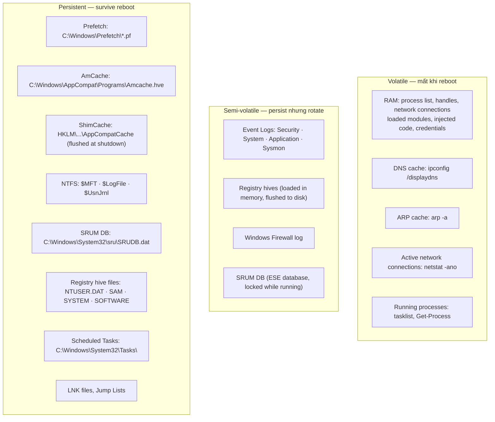

# Appendix D: Windows Forensics Artifact Matrix

> **Framing note:** Appendix này là field guide cho Windows digital forensics — artifact nào tồn tại ở đâu, tại sao nó xuất hiện, nó cho biết gì, dùng tool gì để extract, và caveats nào cần lưu ý trước khi đưa ra kết luận. Mục tiêu là giúp researcher/analyst có một reference nhanh về artifact taxonomy thay vì phải nhớ từng path riêng lẻ. Đây không phải hướng dẫn incident response đầy đủ — nó là bản đồ artifact để bắt đầu.

---

## Status

Draft implementation. Cần lab verification records cho từng artifact với build-specific notes. Path và behavior của một số artifact thay đổi giữa Windows versions — cần version annotation đầy đủ.

---

## 0. Tại sao appendix này tồn tại

Chapters 3–12 đề cập forensic artifacts rải rác — Prefetch trong Ch.2/3, registry artifacts trong Ch.1/7, USN journal và ADS trong Ch.11, service artifacts trong Ch.12, memory forensics trong Ch.5. Không có chỗ nào tập trung toàn bộ artifact map vào một chỗ.

Appendix này tổng hợp:
- **Volatile** artifacts: sống trong RAM — mất khi system reboot
- **Semi-volatile** artifacts: tồn tại trên disk nhưng thay đổi thường xuyên (Event Log, registry hive running)
- **Persistent** artifacts: tồn tại lâu dài trên disk dù system reboot

---

## 1. Researcher Mindset

### 1.1 Artifact là evidence layer, không phải ground truth

Mọi artifact đều có điều kiện tồn tại và điều kiện mất. Không có artifact nào là:
- Không thể xóa
- Không thể forge
- Không thể bị missed

Mọi kết luận forensic cần nói rõ: artifact gì, lấy từ đâu, dùng tool nào, build/config của hệ thống.

### 1.2 Timeline correlation là nền tảng

Một artifact đơn lẻ ít có giá trị hơn tập hợp artifacts được correlate theo timeline. Câu hỏi đúng:

> *"Artifact này tồn tại ở thời điểm nào? Nó consistent với artifacts khác trong cùng thời điểm không? Có gap bất thường trong timeline không?"*

### 1.3 Absence có thể là signal

Nếu hệ thống nên có Prefetch nhưng Prefetch folder trống → có thể đã bị xóa hoặc disabled. Nếu Event Log bị clear → Event 1102 (Security log cleared) tồn tại. Absence cần được documented, không phải ignored.

---

## 2. Big Picture — Artifact Taxonomy



---

## 3. Key Terms

| Term | Giải thích | Tại sao quan trọng |
|---|---|---|
| **MACB timestamps** | Modified, Accessed, Changed ($MFT), Born — 4 timestamps của NTFS file | Timeline analysis; timestamp manipulation là anti-forensic technique phổ biến |
| **$MFT** | Master File Table — database của mọi file/directory trong NTFS | Chứa metadata (timestamps, size, permissions) cho mọi file dù đã xóa |
| **$UsnJrnl** | Update Sequence Number Journal — change log của NTFS | Ghi lại file create/delete/rename; hữu ích cho "chứng minh file từng tồn tại" |
| **ADS** | Alternate Data Stream — stream ẩn của NTFS file | Zone.Identifier là ADS phổ biến nhất; malware dùng để hide payload |
| **Prefetch** | File ghi lại executable và resources đã access trong 10 giây đầu | Chứng minh execution; last run time; số lần chạy |
| **AmCache** | Hive ghi SHA-1 hash của executable đã chạy | Hash available ngay cả khi file bị xóa; dùng để identify malware |
| **ShimCache** | Registry key ghi lại executables đã execute hoặc touch | Path + last modified; không có hash; flushed tại shutdown |
| **SRUM** | System Resource Usage Monitor — database theo dõi resource usage per-process | 30–60 ngày data; network bytes sent/received per process |
| **UserAssist** | Registry key ghi GUI applications launched từ Explorer | ROT13-encoded; last run time, run count |
| **BAM** | Background Activity Moderator — registry key ghi execution của processes | Per-user; path + timestamp của lần execute gần nhất |
| **Zone.Identifier** | ADS gắn vào file download từ internet | Chứa ZoneId (3=Internet), URL nguồn, referrer |
| **LNK file** | Shell link file tạo tự động khi mở file — trong Recent\ | Chứa: target path, timestamps của target và LNK, volume serial, machine GUID |
| **Jump List** | AutomaticDestinations file trong Recent\ — history của recent items per-app | AppID map, file paths, timestamps |
| **ESE database** | Extensible Storage Engine — database format dùng bởi SRUM, Windows Search, IE History | Cần tool đặc biệt để parse (EseDbViewer, ESEDatabaseViewer) |
| **Shadow Copy (VSS)** | Volume Shadow Copy Service snapshot — backup của volume tại thời điểm cụ thể | Có thể recover deleted files và registry hives từ past snapshots |
| **Volatility** | Memory forensics framework — analyze RAM dump | Plugins: pslist, pstree, netscan, filescan, malfind, cmdline |

---

## 4. Volatile Artifacts — Live System

> **Lưu ý:** Những artifacts này chỉ tồn tại khi system đang chạy. Thu thập phải được thực hiện trên **live system** trước khi shutdown. Sau khi reboot, chúng mất hoàn toàn.

### 4.1 Process List (Live)

**What it tells you:** Tất cả processes đang chạy, PID, PPID, path, command line, user context.

```powershell
# Basic list
Get-Process | Select-Object Name, Id, CPU, WorkingSet, Path

# Với parent PID và command line
Get-WmiObject Win32_Process | Select-Object Name, ProcessId, ParentProcessId, CommandLine, ExecutablePath | Format-Table -AutoSize

# Nhìn anomalies trong process tree
Get-WmiObject Win32_Process | Sort-Object ParentProcessId | Format-Table ParentProcessId, ProcessId, Name, CommandLine
```

**Tools:** Process Explorer (Sysinternals), `tasklist /v`, Volatility `pslist` / `pstree` từ memory dump.

**Caveats:**
- DKOM (Direct Kernel Object Manipulation) có thể unlink EPROCESS từ active list → process invisible đến tasklist nhưng vẫn chạy trong kernel memory
- Volatility `psscan` scan memory cho EPROCESS pool tags — có thể tìm hidden processes

### 4.2 Network Connections (Live)

**What it tells you:** Active TCP/UDP connections, listening ports, process owning each connection.

```powershell
# Active connections với PID
netstat -ano

# Map PID đến process name
netstat -ano | ForEach-Object {
    if ($_ -match '(\d+\.\d+\.\d+\.\d+):(\d+)\s+(\d+\.\d+\.\d+\.\d+):(\d+)\s+\S+\s+(\d+)') {
        [PSCustomObject]@{
            LocalAddr = $Matches[1]; LocalPort = $Matches[2]
            RemoteAddr = $Matches[3]; RemotePort = $Matches[4]
            PID = $Matches[5]
            Process = (Get-Process -Id $Matches[5] -ErrorAction SilentlyContinue).Name
        }
    }
}
```

**Tools:** `netstat -ano`, TCPView (Sysinternals), Volatility `netscan`.

**Caveats:**
- Một số network connections có thể ẩn qua kernel-level hooking nếu attacker đã có Ring 0
- HTTPS connections chỉ thấy endpoint — nội dung encrypted

### 4.3 Loaded Modules Per Process (Live)

**What it tells you:** DLLs nào đang loaded trong process, từ path nào, có signature không.

```powershell
$targetProc = Get-Process -Name "explorer" | Select-Object -First 1
$targetProc.Modules | Select-Object ModuleName, FileName, BaseAddress, Size | Format-Table -AutoSize
```

**Tool:** Process Explorer (Ctrl+D → DLL list), Volatility `dlllist`.

**Red flags:**
- DLL với tên hợp lệ (kernel32.dll) nhưng path bất thường (`C:\Temp\kernel32.dll`)
- DLL không có digital signature
- DLL trong memory nhưng không có file trên disk (manual mapped — không có backing file)

### 4.4 Active Handles (Live)

```powershell
# Dùng Sysinternals handle.exe
handle.exe -p <PID>

# Hoặc qua WinDbg
# !handle trong context process
```

**Caveats:** Requires SeDebugPrivilege để inspect handle table của process khác.

---

## 5. Process Execution Artifacts

### 5.1 Prefetch

**Location:** `C:\Windows\Prefetch\*.pf`

**What it tells you:**
- Executable đã được launched (filename embedded trong .pf filename)
- Last run time (embedded trong file, xem metadata cũng có hints)
- Run count (số lần chạy)
- Files/DLLs được access trong 10 giây đầu của execution

**Format:** `<EXECUTABLE>-<HASH>.pf` (hash là hash của path lowercase)

**Ví dụ:**
```
NOTEPAD.EXE-1B4D2E05.pf   ← notepad.exe
MIMIKATZ.EXE-8F2A1C3E.pf  ← mimikatz đã chạy!
CMD.EXE-A9F25631.pf
```

```powershell
# List prefetch files với last write time
Get-ChildItem C:\Windows\Prefetch -Filter *.pf |
    Select-Object Name, LastWriteTime, Length |
    Sort-Object LastWriteTime -Descending
```

**Tools:** WinPrefetchView (NirSoft), PECmd (Eric Zimmermann), Volatility windows.prefetch.

**Timeline coverage:** Thường giữ lại 128 entries (desktop) hoặc 32 entries (server). Khi đầy, cũ nhất bị overwrite.

**Caveats:**
- Bị disable mặc định trên Windows Server và nhiều SSD-optimized configurations. Check: `HKLM\SYSTEM\CurrentControlSet\Control\Session Manager\Memory Management\PrefetchParameters\EnablePrefetcher` (0 = disabled)
- Attacker có thể delete .pf files — nhưng nếu `$UsnJrnl` chưa rotate, delete entry vẫn còn
- Last write time của .pf file ≠ last run time — cần parse file nội dung để lấy run timestamps

### 5.2 AmCache

**Location:** `C:\Windows\AppCompat\Programs\Amcache.hve`

**What it tells you:**
- SHA-1 (và SHA-256 từ Windows 10 1607+) hash của executable đã chạy
- File path, last write time của file
- Compile timestamp từ PE header
- Publisher information

**Đây là artifact cực kỳ mạnh:** SHA-1 hash available ngay cả khi malware file đã bị xóa. Nếu hash match known malware từ threat intel → chứng minh execution.

```powershell
# AmCache là locked hive khi system running — cần copy trước
# Dùng Volume Shadow Copy hoặc offline forensics

# Nếu đã export hive: dùng Registry Explorer hoặc AmcacheParser
# AmcacheParser.exe -f Amcache.hve --csv C:\Output
```

**Tools:** AmcacheParser (Eric Zimmermann), RegRipper amcache plugin, Registry Explorer.

**Timeline coverage:** Không có defined TTL — entries tồn tại cho đến khi hive maintenance xóa old entries.

**Caveats:**
- Hive bị locked khi system running; cần live acquisition tool (raw copy) hoặc VSS copy
- Behavior thay đổi giữa Windows versions — một số entries chỉ available trên Windows 10+
- Entry tồn tại không chắc chắn 100% có nghĩa file đã execute — có thể chỉ là "installer touched" trong một số cases

### 5.3 ShimCache / AppCompatCache

**Location:** `HKLM\SYSTEM\CurrentControlSet\Control\Session Manager\AppCompatCache`

**What it tells you:**
- Đường dẫn executable đã được executed hoặc được accessed bởi PEB loader/application compatibility check
- Last modified time của file tại thời điểm ghi vào ShimCache

**Không có hash** — chỉ có path và last modified time.

```powershell
# ShimCache là in-memory khi system running — flushed tại shutdown
# Cần dump từ registry sau shutdown hoặc từ memory dump live

# Offline: extract từ SYSTEM hive
# ShimCacheParser.exe -i SYSTEM -o output.csv
```

**Tools:** ShimCacheParser (AppCompatCacheParser bởi Eric Zimmermann), RegRipper.

**Timeline coverage:** Biến đổi — Windows 10 thường giữ vài nghìn entries.

**Caveats:**
- **Chỉ flushed tại OS shutdown** — trên live system, ShimCache in registry có thể outdated so với in-memory state. Nếu cần current state: memory forensics hoặc wait for shutdown.
- Execution vs touched: ShimCache không luôn luôn chứng minh execution — có thể là file được touched bởi application compatibility layer mà không execute
- Entries cũ nhất bị dropped khi list quá lớn

### 5.4 UserAssist

**Location:** `HKCU\SOFTWARE\Microsoft\Windows\CurrentVersion\Explorer\UserAssist\{GUID}\Count`

**What it tells you:**
- GUI applications đã được launched từ Explorer (double-click, Start menu, Desktop shortcuts)
- Last run time và run count
- Dữ liệu per-user

**Encoding:** Key names là ROT13-encoded paths.

```powershell
# Decode UserAssist entries
$ua = Get-ItemProperty "HKCU:\SOFTWARE\Microsoft\Windows\CurrentVersion\Explorer\UserAssist\{CEBFF5CD-ACE2-4F4F-9178-9926F41749EA}\Count"
$ua.PSObject.Properties | Where-Object { $_.Name -notmatch '^PS' } | ForEach-Object {
    $decoded = $_.Name -replace '[A-Za-z]', { [char](([int][char]$_.Value + 13 - if ([char]$_.Value -ge 'a' -and [char]$_.Value -le 'z') { 97 } else { 65 }) % 26 + if ([char]$_.Value -ge 'a' -and [char]$_.Value -le 'z') { 97 } else { 65 }) }
    [PSCustomObject]@{ EncodedName = $_.Name; DecodedPath = $decoded }
}
# Hoặc dùng UserAssistView (NirSoft) để tự động decode
```

**Tools:** UserAssistView (NirSoft), RegRipper userassist plugin.

**Caveats:**
- Chỉ capture GUI launches từ Shell/Explorer — không capture console app, scripts, service-launched programs
- Per-user artifact — mỗi user profile có riêng

### 5.5 SRUM — System Resource Usage Monitor

**Location:** `C:\Windows\System32\sru\SRUDB.dat`

**What it tells you:**
- Per-process: CPU time, memory usage, disk read/write bytes
- Per-process: network bytes sent và received, connection counts
- Per-process: energy usage (battery impact)
- Application execution timeline kéo dài 30–60 ngày

**Đây là artifact cực kỳ mạnh cho long-term timeline analysis.**

```powershell
# SRUDB.dat là ESE database — locked khi running
# Copy từ VSS hoặc dùng live acquisition

# Parse: SrumECmd (Eric Zimmermann)
# SrumECmd.exe -f SRUDB.dat --csv C:\Output
```

**Tools:** SrumECmd (Eric Zimmermann), SRUM-DUMP.

**Caveats:**
- Database locked khi system running — phải copy (VSS hoặc specialized tool)
- Windows có thể compact database và remove old entries
- Cần correlate với SOFTWARE hive để map application IDs đến actual paths

### 5.6 BAM — Background Activity Moderator

**Location:** `HKLM\SYSTEM\CurrentControlSet\Services\bam\State\UserSettings\<SID>\`

**What it tells you:**
- Per-user: executable paths đã được execute với timestamp của lần chạy cuối
- Timestamp phản ánh actual execution time (không phải file modified time)

```powershell
# List BAM entries cho tất cả users
$bamPath = "HKLM:\SYSTEM\CurrentControlSet\Services\bam\State\UserSettings"
Get-ChildItem $bamPath | ForEach-Object {
    $sid = $_.PSChildName
    Get-ItemProperty $_.PSPath | ForEach-Object {
        $_.PSObject.Properties | Where-Object { $_.Name -notmatch '^PS' } | ForEach-Object {
            [PSCustomObject]@{
                SID = $sid
                ExecutablePath = $_.Name
                RawData = $_.Value
            }
        }
    }
}
```

**Tools:** RegRipper bam plugin, manual registry read.

**Timeline coverage:** Windows 10+ — thường vài ngày đến vài tuần.

**Caveats:**
- BAM chỉ track một số loại process execution nhất định — không phải mọi process
- Timestamp format là FILETIME trong binary data — cần parse
- Entries có thể bị cleared bởi registry cleanup

---

## 6. User Activity Artifacts

### 6.1 LNK Files (Shell Link)

**Location:**
```
C:\Users\<user>\AppData\Roaming\Microsoft\Windows\Recent\*.lnk
C:\Users\<user>\AppData\Roaming\Microsoft\Office\Recent\*.lnk
C:\Users\<user>\Desktop\*.lnk  ← manual shortcuts
```

**What it tells you:**
- Target file path (ngay cả khi target đã bị xóa)
- Timestamps của **target file** tại thời điểm LNK được tạo/modified: MAC timestamps
- Timestamps của LNK file itself
- **Volume serial number** của volume chứa target
- **Machine GUID** và NetBIOS name của máy tạo LNK — có thể identify máy gốc nếu LNK di chuyển
- Nếu target là removable drive: drive type, label, serial

```powershell
# List recent LNK files
Get-ChildItem "C:\Users\$env:USERNAME\AppData\Roaming\Microsoft\Windows\Recent" -Filter *.lnk |
    Select-Object Name, CreationTime, LastWriteTime, LastAccessTime
```

**Tools:** LNKParser, LECmd (Eric Zimmermann), ShellBagsExplorer.

**Caveats:**
- LNK tự động tạo khi mở file từ Explorer — không phải khi mở từ command line
- Recent folder có giới hạn số entries — cũ nhất bị remove
- Attacker có thể delete LNK manually

### 6.2 Jump Lists

**Location:**
```
C:\Users\<user>\AppData\Roaming\Microsoft\Windows\Recent\AutomaticDestinations\*.automaticDestinations-ms
C:\Users\<user>\AppData\Roaming\Microsoft\Windows\Recent\CustomDestinations\*.customDestinations-ms
```

**What it tells you:**
- Recent items per application (keyed by AppID)
- File paths accessed through that application
- Timestamps

```powershell
# List jump list files
Get-ChildItem "$env:APPDATA\Microsoft\Windows\Recent\AutomaticDestinations"
```

**Tools:** JLECmd (Eric Zimmermann), JumpListExplorer.

### 6.3 RecentDocs Registry

**Location:** `HKCU\SOFTWARE\Microsoft\Windows\CurrentVersion\Explorer\RecentDocs`

**What it tells you:**
- Recent documents opened from Explorer — sorted by extension under subkeys
- Order reflects MRU (Most Recently Used) order

```powershell
Get-ItemProperty "HKCU:\SOFTWARE\Microsoft\Windows\CurrentVersion\Explorer\RecentDocs"
```

### 6.4 Windows Search Index

**Location:** `C:\ProgramData\Microsoft\Search\Data\Applications\Windows\Windows.edb`

**What it tells you:** Indexed content of files — tên file, path, metadata, và đôi khi content — cho files từng tồn tại trong indexed locations.

**Tools:** EseDbViewer, SearchIndexParser.

**Caveats:** Index chỉ cover indexed locations (thường là User folders và Document libraries). Bị disable trên một số server configurations.

---

## 7. Network Artifacts

### 7.1 Windows Firewall Log

**Location:** `C:\Windows\System32\LogFiles\Firewall\pfirewall.log` (nếu được enable)

**What it tells you:** Inbound và outbound connections (allowed và dropped) với timestamp, protocol, src/dst IP và port, action.

```powershell
# Kiểm tra xem firewall logging có enabled không
netsh advfirewall show allprofiles | Select-String "LogFile\|LogAllowedConnections\|LogDroppedConnections"

# Enable logging (cần admin):
# netsh advfirewall set allprofiles logging filename C:\Windows\System32\LogFiles\Firewall\pfirewall.log
# netsh advfirewall set allprofiles logging maxfilesize 32767
# netsh advfirewall set allprofiles logging droppedconnections enable
# netsh advfirewall set allprofiles logging allowedconnections enable
```

**Caveats:** Không enabled theo mặc định. Log rotation mất data cũ. Không ghi nội dung — chỉ connection metadata.

### 7.2 DNS Cache (Volatile)

**What it tells you:** Domain names đã được resolve gần đây — có thể reveal C2 domains, download sources.

```powershell
# Live system — volatile
ipconfig /displaydns | Select-String "Record Name|A \(Host\) Record"

# Lưu output
ipconfig /displaydns > C:\Temp\dns_cache.txt
```

**Caveats:** Cleared khi DNS Client service restart hoặc system reboot. Volatile.

### 7.3 SRUM Network Usage

Xem Section 5.5. SRUM ghi **bytes sent và received per process** — không phải chỉ process existence.

**Forensic value:** "Process X đã gửi 50MB ra ngoài trong khoảng thời gian Y" — data exfiltration evidence.

### 7.4 RDP Artifacts

**What they tell you:** RDP connection history — both outgoing (mstsc) và incoming (Event Log).

```powershell
# Outgoing RDP connections (từ mstsc)
Get-ItemProperty "HKCU:\SOFTWARE\Microsoft\Terminal Server Client\Default" 2>$null
Get-ChildItem "HKCU:\SOFTWARE\Microsoft\Terminal Server Client\Servers" 2>$null | ForEach-Object {
    $server = $_.PSChildName
    $username = (Get-ItemProperty $_.PSPath -ErrorAction SilentlyContinue).UsernameHint
    [PSCustomObject]@{ Server = $server; Username = $username }
}

# Incoming RDP — Security Event Log
Get-WinEvent -LogName Security -FilterXPath "*[System[EventID=4624] and EventData[Data[@Name='LogonType']='10']]" |
    Select-Object TimeCreated, @{N='User';E={$_.Properties[5].Value}}, @{N='SrcIP';E={$_.Properties[18].Value}} |
    Select-Object -First 20
```

**Event IDs for RDP:**
- Security `4624` LogonType 10 = RemoteInteractive (RDP)
- Security `4625` LogonType 10 = Failed RDP login
- Security `4778` = Session reconnected
- Security `4779` = Session disconnected

**Registry path:** `HKCU\SOFTWARE\Microsoft\Terminal Server Client\Servers\<hostname>\UsernameHint`

---

## 8. Registry Persistence Artifacts

### 8.1 Run / RunOnce Keys

```powershell
# Kiểm tra tất cả Run keys
$runKeys = @(
    "HKLM:\SOFTWARE\Microsoft\Windows\CurrentVersion\Run",
    "HKLM:\SOFTWARE\Microsoft\Windows\CurrentVersion\RunOnce",
    "HKCU:\SOFTWARE\Microsoft\Windows\CurrentVersion\Run",
    "HKCU:\SOFTWARE\Microsoft\Windows\CurrentVersion\RunOnce",
    "HKLM:\SOFTWARE\WOW6432Node\Microsoft\Windows\CurrentVersion\Run",
    "HKCU:\SOFTWARE\WOW6432Node\Microsoft\Windows\CurrentVersion\Run"
)

foreach ($key in $runKeys) {
    if (Test-Path $key) {
        Write-Host "`n=== $key ===" -ForegroundColor Cyan
        Get-ItemProperty $key | Select-Object * -ExcludeProperty PS*
    }
}
```

**Red flags:**
- Path trong `%TEMP%`, `%APPDATA%`, `C:\Users\Public\`
- Encoded command lines (base64, hex)
- Ký tự không bình thường trong entry name để hide trong list

### 8.2 Service Keys

```powershell
# List tất cả services với binary path và account
Get-WmiObject Win32_Service | Select-Object Name, StartMode, State, PathName, StartName |
    Sort-Object StartMode | Format-Table -AutoSize

# Focus vào auto-start services
Get-Service | Where-Object { $_.StartType -eq 'Automatic' } |
    ForEach-Object {
        $svc = Get-WmiObject Win32_Service -Filter "Name='$($_.Name)'"
        [PSCustomObject]@{
            Name = $_.Name; StartType = $_.StartType
            PathName = $svc.PathName; Account = $svc.StartName
        }
    }
```

**Registry path:**
```
HKLM\SYSTEM\CurrentControlSet\Services\<ServiceName>
  └── ImagePath    ← binary path
  └── ObjectName  ← account (SYSTEM, NT AUTHORITY\LocalService, etc.)
  └── Start       ← 0=Boot, 1=System, 2=Auto, 3=Manual, 4=Disabled
  └── Type        ← 1=Kernel driver, 2=FS driver, 32=Win32 own process, 288=Win32 share
```

**Red flags:**
- Path trong user-writable location (`%APPDATA%`, `%TEMP%`)
- Service name không match any known Windows service
- Binary path với unusual extensions

**Event ID 7045** (System.evtx): New service installed — timestamp + name + path + type + account. Ghi ngay khi service tạo.

### 8.3 Winlogon

```powershell
Get-ItemProperty "HKLM:\SOFTWARE\Microsoft\Windows NT\CurrentVersion\Winlogon" |
    Select-Object Shell, Userinit, AppSetup
```

**Normal values:**
- `Shell = explorer.exe`
- `Userinit = C:\Windows\system32\userinit.exe,` (với dấu phẩy cuối)

**Abuse:** Thêm executable sau dấu phẩy trong `Userinit` → execute mỗi lần user logon. Change `Shell` sang executable khác → replace Explorer với malicious shell.

### 8.4 Image File Execution Options (IFEO)

**Location:** `HKLM\SOFTWARE\Microsoft\Windows NT\CurrentVersion\Image File Execution Options\<ExeName>\Debugger`

```powershell
# Check for debugger hijacking
Get-ChildItem "HKLM:\SOFTWARE\Microsoft\Windows NT\CurrentVersion\Image File Execution Options" |
    ForEach-Object {
        $debugger = (Get-ItemProperty $_.PSPath -Name Debugger -ErrorAction SilentlyContinue).Debugger
        if ($debugger) {
            [PSCustomObject]@{ Exe = $_.PSChildName; Debugger = $debugger }
        }
    }
```

**Abuse scenarios:**
- Set `sethc.exe` (Sticky Keys) Debugger = `cmd.exe` → press Shift 5 times at login screen = cmd.exe with SYSTEM (Windows 7 era)
- Set legit tool's Debugger = malicious binary → legit tool launch triggers malware

### 8.5 AppInit_DLLs

**Location:** `HKLM\SOFTWARE\Microsoft\Windows NT\CurrentVersion\Windows\AppInit_DLLs`

Nếu `LoadAppInit_DLLs = 1` và `AppInit_DLLs = <path>`, DLL đó được load vào **mọi process** load `user32.dll` — gần như mọi GUI process.

```powershell
Get-ItemProperty "HKLM:\SOFTWARE\Microsoft\Windows NT\CurrentVersion\Windows" |
    Select-Object AppInit_DLLs, LoadAppInit_DLLs, RequireSignedAppInit_DLLs
```

**Note:** Trên hệ thống bật Secure Boot và UEFI, `RequireSignedAppInit_DLLs = 1` mặc định — DLL phải có Microsoft signature.

### 8.6 COM Object Hijacking

**Location:** `HKCU\SOFTWARE\Classes\CLSID\<CLSID>\InprocServer32`

Nếu attacker tạo entry trong HKCU cho CLSID mà application lookup trong HKLM, HKCU được ưu tiên → DLL của attacker được load.

```powershell
# Check HKCU CLSID entries (nhiều ở đây là hijacking indicator)
Get-ChildItem "HKCU:\SOFTWARE\Classes\CLSID" -ErrorAction SilentlyContinue |
    ForEach-Object {
        $srv = Get-ItemProperty "$($_.PSPath)\InprocServer32" -ErrorAction SilentlyContinue
        if ($srv) { [PSCustomObject]@{ CLSID = $_.PSChildName; DLL = $srv.'(default)' } }
    }
```

---

## 9. File System Artifacts

### 9.1 $MFT — Master File Table

**What it tells you:** Metadata của mọi file và directory trong NTFS — kể cả đã bị xóa (nếu MFT entry chưa bị reused).

**Contents per file record:**
- Filename (thực ra nhiều attributes: 8.3 name, long name)
- MACB timestamps (Modified, Accessed, Changed/$MFT-entry-modified, Born/Created)
- File size, allocated size
- Data attribute (nếu file nhỏ: data inline trong MFT; nếu lớn: cluster pointers)
- Security descriptor index

**Tools:**
```powershell
# Không thể read trực tiếp qua Win32 API — cần raw disk access
# MFTECmd.exe (Eric Zimmermann) — parse $MFT từ live volume hoặc acquired copy
# MFTECmd.exe -f $MFT --csv C:\Output

# Forensic acquisition:
# FTK Imager → Add Evidence → Logical Drive → Export $MFT
```

**Caveats:**
- $MFT của volume đang running là locked — cần raw disk access
- Khi file bị xóa, $MFT entry được marked "not in use" nhưng data có thể vẫn còn — cho đến khi entry bị reused

### 9.2 $UsnJrnl — Update Sequence Number Journal

**Location:** `C:\$Extend\$UsnJrnl:$J`

**What it tells you:** Change log của file system — mọi file create, delete, rename, security change. Entries có USN (sequence number) và timestamp.

```powershell
# View USN journal entries (cần raw access)
# MFTECmd.exe -f "C:\$Extend\$UsnJrnl" --csv C:\Output

# Hoặc dùng built-in fsutil (chỉ metadata của journal):
fsutil usn queryjournal C:
```

**Forensic value:**
- Chứng minh file từng tồn tại ngay cả khi đã bị xóa
- Timestamp của delete operation
- Rename chains (original name → renamed to → deleted)

**Caveats:**
- Journal có giới hạn kích thước (thường 32MB) — entries cũ bị overwritten
- Có thể bị disabled trên một số volumes

### 9.3 ADS — Alternate Data Streams

**What it tells you:** Streams ẩn gắn vào file — file có thể có multiple named streams.

**Phổ biến nhất: Zone.Identifier**
```powershell
# Check Zone.Identifier của file download
Get-Item -Stream Zone.Identifier -Path "C:\Users\$env:USERNAME\Downloads\*" |
    Select-Object FileName, @{N='Content';E={Get-Content $_.PSPath -Stream Zone.Identifier}}

# Ví dụ output cho downloaded file:
# [ZoneTransfer]
# ZoneId=3          ← 3 = Internet zone
# ReferrerUrl=https://...
# HostUrl=https://...
```

```powershell
# Find ALL ADS on a path recursively
Get-ChildItem -Recurse -Path C:\Temp | Get-Item -Stream * |
    Where-Object { $_.Stream -ne ':$DATA' } |
    Select-Object PSPath, Stream, Length
```

**Red flags:**
- ADS với executable content (PE header = `4D 5A` = MZ)
- ADS với unusual names (không phải Zone.Identifier)
- Large ADS (nhiều MB) — có thể chứa hidden payload

### 9.4 MACB Timestamps

NTFS duy trì 4 timestamps mỗi file:

| Timestamp | Tên | Update khi nào |
|---|---|---|
| **M** | Modified | Content của file thay đổi |
| **A** | Accessed | File được read (có thể disabled vì performance) |
| **C** | Changed | $MFT record thay đổi (metadata change: rename, permission, etc.) |
| **B** | Born (Created) | File được tạo |

**Timestamp manipulation (Timestomping):**
```powershell
# Attacker set all timestamps thành past date:
$(Get-Item "C:\malware.exe").CreationTime = [datetime]"2020-01-01"
$(Get-Item "C:\malware.exe").LastWriteTime = [datetime]"2020-01-01"
$(Get-Item "C:\malware.exe").LastAccessTime = [datetime]"2020-01-01"
```

**Detection:** $MFT entry có **hai sets timestamps**: `$STANDARD_INFORMATION` (user-visible, can be changed) và `$FILE_NAME` (set by kernel at create/rename — harder to change without kernel access). Nếu hai sets khác nhau → timestomping suspected.

**Tools:** MFTECmd, Plaso (log2timeline), Autopsy.

---

## 10. Event Log Artifacts

### 10.1 Security.evtx

**Location:** `C:\Windows\System32\winevt\Logs\Security.evtx`

| EventID | Ý nghĩa | Quan trọng |
|---|---|---|
| **4624** | Successful logon — LogonType field: 2=Interactive, 3=Network, 4=Batch, 5=Service, 7=Unlock, 10=RemoteInteractive (RDP), 11=CachedInteractive | Rất cao — baseline logon activity |
| **4625** | Failed logon — nhiều failures từ một IP = brute force | Cao |
| **4634** | Logon session ended | Tương quan với 4624 |
| **4648** | Logon attempted với explicit credentials (RunAs, PtH) | Cao |
| **4688** | Process created — cần "Audit Process Creation" policy bật, command line logging cần policy riêng | Cao nhưng phụ thuộc config |
| **4689** | Process exited | Tương quan với 4688 |
| **4656** | Handle request đến object (cần object access auditing) | Cao cho sensitive object monitoring |
| **4663** | Object access performed | Tương quan với 4656 |
| **4657** | Registry value modified | Cao cho persistence monitoring |
| **4697** | Service installed (cần "Audit Security System Extension") | Cao |
| **4698/4702** | Scheduled task created/modified | Cao |
| **4720/4722/4724/4728** | User account created/enabled/password reset/added to group | Lateral movement indicators |
| **1102** | Security audit log cleared | Critical — investigate immediately |

```powershell
# Query recent process creations (4688)
Get-WinEvent -LogName Security -FilterXPath "*[System[EventID=4688]]" |
    Select-Object TimeCreated,
        @{N='NewProcess';E={$_.Properties[5].Value}},
        @{N='CommandLine';E={$_.Properties[8].Value}},
        @{N='ParentProcess';E={$_.Properties[13].Value}} |
    Select-Object -First 20

# Query failed logons from external IP
Get-WinEvent -LogName Security -FilterXPath "*[System[EventID=4625]]" |
    Where-Object { $_.Properties[19].Value -ne '-' -and $_.Properties[19].Value -ne '127.0.0.1' } |
    Select-Object TimeCreated, @{N='SrcIP';E={$_.Properties[19].Value}} |
    Group-Object SrcIP | Sort-Object Count -Descending
```

### 10.2 System.evtx

| EventID | Ý nghĩa |
|---|---|
| **7045** | New service installed — name, path, type (driver=1, service=32...), account |
| **7036** | Service state change (running/stopped) |
| **7034** | Service crashed unexpectedly |
| **6005/6006** | Event log service started/stopped (= system boot/shutdown) |

```powershell
# All new service installations
Get-WinEvent -LogName System -FilterXPath "*[System[EventID=7045]]" |
    ForEach-Object {
        [PSCustomObject]@{
            Time = $_.TimeCreated
            ServiceName = $_.Properties[0].Value
            ImagePath = $_.Properties[1].Value
            AccountName = $_.Properties[4].Value
        }
    }
```

### 10.3 Sysmon Events

Sysmon (`System Monitor`) là Sysinternals tool cho rich process/network/file telemetry khi deployed:

| EventID | Sự kiện |
|---|---|
| **1** | Process Create — với hash, full command line, parent, GUID |
| **2** | File creation time changed (timestomping indicator) |
| **3** | Network connection — process, src/dst IP:port, protocol |
| **6** | Driver loaded — path, hash, signature status |
| **7** | Image (DLL) loaded — path, hash, signature |
| **8** | CreateRemoteThread — source/target PID, start address |
| **10** | ProcessAccess (OpenProcess) — source, target, GrantedAccess mask |
| **11** | FileCreate — path, process |
| **12/13/14** | Registry operations |
| **15** | FileCreateStreamHash — ADS creation với hash |
| **22** | DNS query |
| **25** | Process Tampering (process image replaced) |

```powershell
# Sysmon ProcessAccess đến lsass
Get-WinEvent -LogName "Microsoft-Windows-Sysmon/Operational" -FilterXPath "*[System[EventID=10] and EventData[Data[@Name='TargetImage'] and (Data='C:\Windows\System32\lsass.exe')]]" |
    ForEach-Object {
        [PSCustomObject]@{
            Time = $_.TimeCreated
            SourceImage = $_.Properties[5].Value
            GrantedAccess = $_.Properties[8].Value
        }
    }
```

### 10.4 PowerShell Logs

```
Microsoft-Windows-PowerShell/Operational.evtx
```

| EventID | Ý nghĩa |
|---|---|
| **4104** | Script block logging — full PowerShell script content (cần enable) |
| **4105/4106** | Script block start/stop |
| **4103** | Module logging — parameter binding details |

```powershell
# Enable script block logging (cần Group Policy hoặc Registry)
# HKLM\SOFTWARE\Policies\Microsoft\Windows\PowerShell\ScriptBlockLogging\EnableScriptBlockLogging = 1

# Read recent script blocks
Get-WinEvent -LogName "Microsoft-Windows-PowerShell/Operational" -FilterXPath "*[System[EventID=4104]]" |
    Select-Object TimeCreated, @{N='ScriptBlock';E={$_.Properties[2].Value}} |
    Select-Object -First 10
```

---

## 11. Memory Artifacts

### 11.1 Process List từ Memory Dump

```
Volatility 3:
python vol.py -f memory.dmp windows.pslist    ← từ EPROCESS linked list
python vol.py -f memory.dmp windows.psscan    ← scan pool tags — tìm hidden processes
python vol.py -f memory.dmp windows.pstree    ← process tree view
```

**Sự khác biệt pslist vs psscan:**
- `pslist` walk linked list — bị trick bởi DKOM (unlink EPROCESS)
- `psscan` scan memory cho EPROCESS pool tag `Proc` — tìm processes kể cả đã unlinked

### 11.2 Network Connections từ Memory Dump

```
python vol.py -f memory.dmp windows.netscan
```

Output: PID, protocol, local addr:port, remote addr:port, state, process name.

**Caveats:** Netscan dựa trên TCP/UDP endpoint structures — có thể miss connections đã closed trước khi dump.

### 11.3 Injected Code Detection — malfind

```
python vol.py -f memory.dmp windows.malfind
```

**Logic:** Scan VAD tree cho regions với characteristics:
- `MEM_PRIVATE` (không backed bởi file trên disk)
- Execute permission (`PAGE_EXECUTE_*`)
- Optionally: content starts với MZ header (PE) hoặc shellcode patterns

**Output:** Memory region với dump của bytes đầu — thường là injected shellcode hoặc manually mapped PE.

**Caveats:**
- False positives tồn tại (JIT-compiled code, .NET runtime pages)
- Manual mapped PE từ memory-only dropper không có file artifact — memory forensics là cách duy nhất tìm thấy
- Dump phải đủ complete — minidump không đủ

### 11.4 Credentials trong lsass Memory

**Mục tiêu:** Extract NT hashes, Kerberos tickets, clear-text passwords từ lsass memory dump.

**Forensic context (không phải attack guide):** Analyst có thể verify xem credentials nào từng cached trong lsass để hiểu blast radius của compromise.

```
# Từ memory dump của lsass process
python vol.py -f lsass.dmp windows.hashdump
```

**Caveats:**
- Credentials Credential Guard-protected → không trong lsass memory, ở VTL 1 Secure Kernel
- WDigest clear-text credentials bị disable từ Windows 8.1+ theo mặc định (registry key `HKLM\SYSTEM\CurrentControlSet\Control\SecurityProviders\WDigest\UseLogonCredential`)

---

## 12. Startup / Persistence Artifacts

### 12.1 Scheduled Tasks

**Location:** `C:\Windows\System32\Tasks\` (XML files)

```powershell
# List all scheduled tasks
Get-ScheduledTask | Select-Object TaskPath, TaskName, State, @{N='Actions';E={$_.Actions.Execute}} |
    Where-Object { $_.State -ne 'Disabled' } |
    Format-Table -AutoSize

# Inspect specific task XML
Get-ScheduledTask "MyTask" | Export-ScheduledTask
```

**XML file analysis:**
```powershell
# Read XML trực tiếp
[xml](Get-Content "C:\Windows\System32\Tasks\Microsoft\Windows\MyTask")
```

**Red flags:**
- Task action với path trong `%APPDATA%`, `%TEMP%`, `C:\Users\Public\`
- Trigger: `AtLogon`, `Daily`, `Weekly` với unusual timing
- Task Run As: SYSTEM khi không cần thiết

### 12.2 WMI Subscriptions

**Persistence via WMI:** Attacker tạo Event Filter + Event Consumer + Binding để execute code khi event xảy ra (logon, timer, etc.). Survives reboot.

```powershell
# List WMI event subscriptions
Get-WMIObject -Namespace root\subscription -Class __EventFilter | Select-Object Name, Query
Get-WMIObject -Namespace root\subscription -Class __EventConsumer | Select-Object Name, CommandLineTemplate, ScriptText
Get-WMIObject -Namespace root\subscription -Class __FilterToConsumerBinding
```

**Red flags:**
- Bất kỳ Filter/Consumer/Binding nào tạo bởi non-Microsoft → investigate
- CommandLineTemplate với encoded content
- ScriptText chứa VBScript/PowerShell payload

**Event Log:** `Microsoft-Windows-WMI-Activity/Operational` ghi WMI operations.

### 12.3 Startup Folders

```powershell
# Per-user startup folder
$userStartup = "$env:APPDATA\Microsoft\Windows\Start Menu\Programs\Startup"
# All-users startup folder
$allStartup = "$env:ProgramData\Microsoft\Windows\Start Menu\Programs\Startup"

Get-ChildItem $userStartup, $allStartup -ErrorAction SilentlyContinue
```

---

## 13. Quick Reference Matrix

| Câu hỏi forensic | Artifact chính | Tool | Location |
|---|---|---|---|
| Executable nào đã chạy? | Prefetch, AmCache, ShimCache, BAM | PECmd, AmcacheParser | `C:\Windows\Prefetch\`, Amcache.hve, SYSTEM hive |
| Executable đã chạy khi nào? | Prefetch (last run), BAM (last exec time), SRUM | PECmd, SrumECmd | Prefetch folder, SYSTEM hive, SRUDB.dat |
| Executable có hash là gì? | AmCache | AmcacheParser | Amcache.hve |
| Process đang chạy là gì? | Process list (live), Memory dump (pslist/psscan) | Process Explorer, Volatility | Live RAM |
| Có code injection không? | Memory dump malfind, ETW-TI WriteVirtualMemory event | Volatility malfind | Live RAM / dump |
| User đã làm gì? | LNK files, Jump Lists, UserAssist, RecentDocs | LECmd, JLECmd | %APPDATA%\Recent\, HKCU |
| Có persistence không? | Run keys, Services, Scheduled Tasks, WMI subs, Startup folder | Autoruns | Registry, Tasks folder, WMI |
| File nào đã bị tạo/xóa? | $UsnJrnl, $MFT | MFTECmd | NTFS volume |
| File đến từ internet không? | Zone.Identifier ADS | Get-Item -Stream | Gắn vào file download |
| Credential nào bị compromise? | lsass memory dump, Security 4648/4624 | Volatility, Event Log | RAM / Security.evtx |
| Kết nối mạng nào xảy ra? | SRUM network, Firewall log, netstat (live), Memory netscan | SrumECmd, Volatility | SRUDB.dat, pfirewall.log, RAM |
| Driver/Service nào được cài? | Event 7045, Services registry key, Sysmon Event 6 | Event Viewer, Registry | System.evtx, Services hive |
| Có RDP không? | Security 4624 LogonType 10, mstsc registry | Event Viewer | Security.evtx, HKCU |
| Log có bị clear không? | Security Event 1102, System 104 | Event Viewer | Security.evtx, System.evtx |
| Timestamp có bị manipulate không? | $STANDARD_INFORMATION vs $FILE_NAME divergence | MFTECmd | $MFT |
| Process hierarchy có bình thường không? | Process tree (live/memory) | Process Explorer, pstree | Live / RAM dump |

---

## 14. Tool Reference

| Tool | Purpose | Source |
|---|---|---|
| **Volatility 3** | Memory forensics — process, network, injection, artifact analysis | [volatilityfoundation.org](https://www.volatilityfoundation.org) |
| **Autopsy** | Disk forensics — file carving, timeline, hash lookup | [sleuthkit.org/autopsy](https://www.sleuthkit.org/autopsy) |
| **KAPE** | Rapid artifact acquisition — collect targeted files từ live system | [ericzimmermann.com/tools](https://ericzimmermann.com/tools) |
| **Eric Zimmermann Tools** | PECmd (Prefetch), LECmd (LNK), JLECmd (Jump Lists), MFTECmd, AmcacheParser, SrumECmd, AppCompatCacheParser | [ericzimmermann.com/tools](https://ericzimmermann.com/tools) |
| **Autoruns** | Comprehensive autorun location inventory | [Sysinternals](https://learn.microsoft.com/en-us/sysinternals/downloads/autoruns) |
| **RegRipper** | Registry forensics — plugins per artifact type | [github.com/keydet89/RegRipper3.0](https://github.com/keydet89/RegRipper3.0) |
| **Registry Explorer** | Interactive registry hive browser với bookmarks | Eric Zimmermann tools |
| **Timeline Explorer** | CSV timeline viewer với filtering | Eric Zimmermann tools |
| **Plaso / log2timeline** | Super-timeline từ nhiều artifact sources | [github.com/log2timeline/plaso](https://github.com/log2timeline/plaso) |
| **WinPrefetchView** | GUI viewer cho Prefetch files | NirSoft |
| **UserAssistView** | Decode và view UserAssist entries | NirSoft |
| **ShellBagsExplorer** | Shell Bags và folder access history | Eric Zimmermann tools |
| **FTK Imager** | Disk/memory image acquisition và logical file extraction | Exterro (free version) |

---

## 15. References

### Windows Internals Book
- WI7 Part 1, Chapter 5: Memory Management — VAD tree, memory forensics
- WI7 Part 1, Chapter 7: Security — token, registry security
- WI7 Part 2, Chapter 11: Cache and File Systems — NTFS internals, $MFT, streams
- WI7 Part 2, Chapter 12: Startup and Shutdown — service configuration, boot artifacts

### Microsoft Documentation
- [Windows Event Log Reference](https://learn.microsoft.com/en-us/windows/security/threat-protection/auditing/advanced-security-auditing-faq)
- [NTFS Technical Reference](https://learn.microsoft.com/en-us/windows/win32/fileio/ntfs-technical-reference)
- [Scheduled Tasks](https://learn.microsoft.com/en-us/windows/win32/taskschd/task-scheduler-start-page)
- [WMI Subscriptions](https://learn.microsoft.com/en-us/windows/win32/wmisdk/receiving-event-notifications)

### Forensics Resources
- [SANS Windows Forensics Cheatsheet](https://www.sans.org/posters/windows-forensic-analysis)
- [Eric Zimmermann Artifact Descriptions](https://ericzimmermann.com/tools)
- [The Forensics Wiki — Windows artifacts](https://forensicswiki.xyz/wiki/index.php?title=Windows)
- [KAPE Target Definitions](https://github.com/EricZimmermann/KAPE-Files)

---

*Appendix D — Phụ lục sau: [Appendix E — Windows Research Lab Setup](app-e-windows-research-lab-setup.md)*
