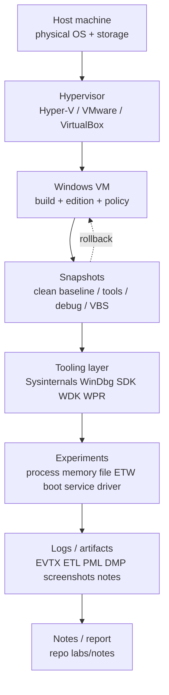

# Appendix E: Windows Research Lab Setup

> **Framing note:** Appendix này mô tả cách dựng một Windows research lab có thể lặp lại cho Windows Internals, EDR/AV architecture, reverse engineering, malware analysis, detection engineering, forensics, kernel debugging, driver research, ETW tracing, Sysinternals labs, và các appendix sau. Mục tiêu là tạo môi trường **ổn định, ghi chép được, rollback được, và so sánh được** — không phải môi trường chạy PoC tùy tiện.

---

## 0. Why this appendix exists

12 core chapters là theory + labs. Nhưng Windows internals không thể học chỉ bằng đọc. Bạn cần quan sát thật: process tree, handles, VADs, ETW events, Event Logs, driver/service state, file system artifacts, boot behavior, VBS/HVCI state, symbol output, dumps, và telemetry gaps.

Vấn đề: Windows behavior phụ thuộc vào nhiều biến:

- Windows build number, edition, patch level.
- x64/ARM64 architecture.
- VBS/HVCI/Credential Guard/Secure Boot state.
- Defender/security product state.
- Installed drivers/minifilters/services.
- Hypervisor and VM integration features.
- Symbol path and debugger version.
- WDK/SDK/tool versions.
- Group Policy/MDM/enterprise baseline.
- Snapshot/reboot/hibernate state.

Nếu lab không repeatable, observation trở thành unreliable anecdote. Một kết luận đúng trên Windows 10 22H2 non-HVCI VM có thể sai trên Windows 11 HVCI-enabled endpoint. Một Procmon trace trên polluted VM có thể phản ánh updater/indexer/EDR noise, không phải mechanism bạn đang nghiên cứu. Một WinDbg output không có symbols có thể dẫn đến field interpretation sai.

Appendix này cung cấp practical setup để:

- Validate claims trong 12 chapters.
- So sánh clean baseline vs modified state.
- Reproduce experiments sau snapshot restore.
- Ghi lại artifacts và tool versions.
- Tách lab/debug settings khỏi production-equivalent state.
- Hạn chế rủi ro khi làm kernel/driver/file/boot experiments.

---

## 1. Researcher Mindset

### 1.1 Ghi chép trước khi chạy tool

Mỗi experiment phải bắt đầu bằng context. Tối thiểu record:

- Windows build number (`winver`, `systeminfo`).
- Edition: Home/Pro/Enterprise/Server.
- Patch level / install date if relevant.
- Architecture: x64/ARM64.
- VM platform and version.
- Snapshot name.
- Secure Boot state.
- VBS/HVCI/Credential Guard state.
- Defender/security product state.
- Installed tool versions.
- Symbol path.
- Network mode.
- Admin vs standard user.
- Time zone and clock sync.

Không có context, log đẹp cũng yếu. “I saw X” phải đi kèm “on which build, under which policy, with which tools.”

### 1.2 Một observation không phải universal Windows truth

Windows internals có stable concepts nhưng implementation details thay đổi. Examples:

- `_EPROCESS`, `_ETHREAD`, VAD, PTE fields are symbol/build-dependent.
- ETW provider payloads can change by build.
- HVCI can alter driver behavior.
- Secure Boot/TPM availability depends on firmware/VM config.
- Sysinternals output changes by version.
- Event Log channels may be disabled or absent.
- Defender/EDR state changes telemetry.

Researcher nên nói: “trên build này, trong config này, observation này xảy ra.” Sau đó mới compare across builds.

### 1.3 Baseline trước, mutate sau

Mọi lab nên có ít nhất hai states:

1. **Clean baseline:** Windows fresh, tools installed minimally, no experimental changes.
2. **Modified state:** sau khi bật setting, chạy test program, enable boot logging, install tool, compile binary, hoặc change policy.

Nếu không có baseline, bạn không biết noise nào là mặc định. Nếu không có snapshot, bạn không rollback được.

### 1.4 Lab notebook là artifact quan trọng

Ghi notes như forensic chain-of-custody nhỏ:

- Date/time/timezone.
- Snapshot before/after.
- Commands run.
- Expected result.
- Actual result.
- Artifacts created.
- Cleanup performed.
- Screenshots saved.
- Conclusion and confidence.
- Open questions.

Lab notebook tốt giúp bạn tái hiện experiment sau 6 tháng và giúp người khác review kết luận.

### 1.5 Safety stance

- Prefer VM snapshots trước kernel/debug/boot/file-system experiments.
- Không chạy random tools từ internet trên baseline sạch.
- Không mix offensive PoC folders với clean Sysinternals/debug lab.
- Dumps/logs/traces có thể chứa secrets; treat as sensitive.
- Debug/test settings change runtime behavior; document them.
- Production-equivalent state khác debug state.

---

## 2. Big Picture

### 2.1 Lab architecture



### 2.2 Lab layers

| Layer | What it controls | Researcher concern |
|------|------------------|--------------------|
| Host | Physical hardware, disk, host OS, hypervisor install | Isolation, storage space, time sync, shared clipboard risk |
| Hypervisor | VM settings, snapshots, virtual TPM, Secure Boot, network mode | Reproducibility and security boundary |
| Windows VM | Guest OS build/configuration | Target behavior and artifacts |
| Snapshots | Rollback points | Baseline vs modified comparison |
| Tools | Sysinternals, WinDbg, SDK/WDK, WPR/WPA, compilers | Tool effects and version differences |
| Symbols | PDB path/cache | Debugger accuracy |
| Test programs | Harmless C/C++ utilities | Controlled stimuli |
| Logs/artifacts | EVTX, ETL, PML, dumps, screenshots | Evidence for claims |
| Documentation | Notebook, commands, conclusions | Reproducibility |

### 2.3 Recommended directory layout inside VM

```text
C:\Labs\
  Tools\
    Sysinternals\
    Debuggers\
    ETW\
  Code\
    HelloPid\
    MemoryMapDemo\
  Logs\
    EventLogs\
    ETL\
    Procmon\
    Screenshots\
  Dumps\
  Symbols\
  Notes\
```

Repo notes can live outside the VM under:

```text
labs/notes/
```

Keep generated artifacts out of the main source tree unless intentionally documenting a small sanitized example.

---

## 3. Key Terms

| Term | Vietnamese explanation | Researcher relevance |
|------|------------------------|----------------------|
| **VM** | Máy ảo chạy Windows guest | Safe rollback and isolated experiments |
| **Snapshot** | Trạng thái VM lưu lại để quay về | Essential before risky/debug/boot labs |
| **Baseline** | Trạng thái sạch đã ghi nhận | Comparison point for artifacts/noise |
| **Host** | Máy thật chạy hypervisor | Boundary and storage/security concern |
| **Guest** | Windows OS bên trong VM | Target of experiments |
| **Hypervisor** | Layer chạy/quản lý VM | Controls Secure Boot/vTPM/network/snapshots |
| **NAT network** | VM ra internet qua host NAT | Useful for updates/symbols; less exposed inbound |
| **Host-only network** | Network chỉ giữa host và guest | Safer for isolated labs |
| **Symbol server** | Server cung cấp PDB symbols | Required for useful WinDbg output |
| **PDB** | Program Database symbol file | Maps addresses to names/types when available |
| **WinDbg** | Windows debugger | User/kernel/dump debugging |
| **Sysinternals** | Microsoft tools suite | Procmon, Process Explorer, Autoruns, etc. |
| **Windows SDK** | Development kit with headers/tools | Build user-mode test programs and tools |
| **Windows WDK** | Driver Kit | Driver research/build/debug docs/tools |
| **ETW** | Event Tracing for Windows | Core tracing infrastructure |
| **WPR** | Windows Performance Recorder | Capture ETW traces/profiles |
| **WPA** | Windows Performance Analyzer | Analyze ETL traces |
| **Procmon PML** | Process Monitor log file | File/registry/process/network operation artifact |
| **Event Log** | Windows persistent event logs | Boot/service/security/app evidence |
| **Crash dump** | Dump from crash/bugcheck/process failure | Debug root cause and memory state |
| **Memory dump** | Captured memory snapshot | Runtime forensic/debug artifact |
| **VBS** | Virtualization-Based Security | Changes trust/memory model |
| **HVCI** | Hypervisor-Protected Code Integrity | Driver compatibility/security behavior |
| **Secure Boot** | UEFI verified boot | Boot trust boundary |
| **WDAC** | Windows Defender Application Control | Code execution policy research |
| **Test signing** | Driver/code signing test mode | Lab-only; changes trust posture |
| **Build number** | Windows build/revision | Required for internals interpretation |
| **Reproducibility** | Ability to repeat observation | Core quality standard for research |

---

## 4. Core Lab Design

### 4.1 Choose Windows 10/11 VM deliberately

Recommended baseline options:

| VM | Why useful | Caveat |
|----|------------|--------|
| Windows 10 22H2 x64 | Stable, common enterprise baseline | VBS defaults differ from Win11 |
| Windows 11 23H2/24H2 x64 | Modern VBS/HVCI/Secure Boot behavior | More security features enabled by default |
| Windows Server VM | Service/driver/storage scenarios | Different defaults and UI |

Minimum resources for comfortable labs:

- 2–4 vCPU.
- 8 GB RAM minimum, 16 GB better for WPR/WPA/WinDbg.
- 80–120 GB virtual disk.
- Snapshots enabled.
- Optional virtual TPM/Secure Boot if studying Ch.9/Ch.12.

### 4.2 Snapshot strategy

Create separate snapshots:

1. **Clean baseline:** fresh install, patched, no tools beyond defaults.
2. **Sysinternals tools installed:** Sysinternals accepted/available.
3. **Debugging tools installed:** WinDbg Preview or Debugging Tools configured.
4. **ETW/WPR/WPA configured:** Windows Performance Toolkit ready.
5. **Driver research snapshot:** WDK/test signing/lab-only debug config if needed.
6. **VBS/HVCI enabled snapshot:** for modern security-state comparison.
7. **VBS/HVCI disabled comparison snapshot:** if available and permitted.
8. **Pre-boot-logging snapshot:** before Procmon boot logging or BCD/debug experiments.

Name snapshots with date + purpose:

```text
2026-05-21_clean_win11_23h2_no_tools
2026-05-21_tools_sysinternals_windbg
2026-05-21_hvci_enabled_baseline
```

### 4.3 Directory discipline

Inside VM:

- Test files: `C:\Labs\TestFiles`
- Logs: `C:\Labs\Logs`
- Source code: `C:\Labs\Code`
- Dumps: `C:\Labs\Dumps`
- Symbols: `C:\Labs\Symbols`
- Tool downloads: `C:\Labs\Tools`
- Notes: `C:\Labs\Notes` and/or repo `labs/notes`

Do not scatter test binaries under Downloads/Desktop/System32. Clean layout reduces forensic noise.

### 4.4 Security-state comparison design

For Ch.9/Ch.12-style research, compare:

- Secure Boot enabled vs disabled if hypervisor supports it.
- HVCI enabled vs disabled.
- VBS running vs not running.
- Defender default vs third-party EDR if available.
- Standard user vs elevated admin.
- Full restart vs Fast Startup/power cycle.

Do not change all variables at once. Change one variable, snapshot, observe, restore.

### 4.5 Test programs

Use harmless C/C++ programs first:

- Print PID/TID and sleep.
- Open a test file and read/write known text.
- Create a named event/mutex.
- Allocate memory and print address.
- Map a file and modify test bytes.

Avoid suspicious behavior in baseline appendix labs. More advanced behavior belongs in controlled appendix-specific labs with explicit safety framing.

---

## 5. Important Tools / Components

| Tool/component | Role | Researcher angle | Notes |
|----------------|------|------------------|-------|
| Process Explorer | Process tree, handles, DLLs, tokens | Baseline process/security view | Run elevated for full details |
| Process Monitor | File/registry/process/network operations | Rich behavior trace | High volume; save PML carefully |
| Autoruns | Startup inventory | Persistence/config baseline | Export before changes |
| VMMap | Process memory layout | VAD/mapped/private/image memory | Useful for Ch.5/Ch.11 |
| RAMMap | System memory/cache view | File cache/standby/modified pages | Runtime state only |
| WinObj | Object Manager namespace | Object paths/symlinks/sessions | Ch.8 support |
| Handle | Handle enumeration | Open objects and lock holders | CLI; useful for scripts |
| Sigcheck | Signature/hash/file metadata | Trust and inventory | Use for tool/driver validation |
| Streams | ADS enumeration | NTFS stream visibility | Ch.11 support |
| TCPView | Network connections | Networking appendix prep | Optional for core chapters |
| ProcDump | Process dump capture | Crash/hang/memory artifacts | Dumps are sensitive |
| AccessChk | ACL/permission analysis | Ch.7 access boundary labs | Run read-only first |
| WinDbg Preview | Debugger | Dumps/live/user/kernel debug | Configure symbols |
| Windows SDK | User-mode build/tools | Compile harmless test programs | Version matters |
| Windows WDK | Driver research tools/docs | Driver labs and headers | Use driver snapshot |
| Visual Studio Build Tools | Compiler toolchain | Build C/C++ labs | Keep project folder clean |
| PowerShell | Automation/query | CIM/WMI/EventLog helpers | Record commands |
| Event Viewer | EVTX inspection | Boot/service/security logs | Provider/channel context |
| logman | ETW session control | Provider/session model | Use short traces |
| wevtutil | Event Log CLI | Export/query logs | Avoid clearing logs |
| WPR | ETW trace capture | Performance/behavior timelines | ETL may be large |
| WPA | ETL analysis | CPU/disk/thread/stack analysis | Symbols helpful |
| PerfMon | Performance counters | Baseline metrics | Good for long-running labs |
| fltmc | Minifilter inventory | AV/EDR/file-system stack | Requires admin for detail |
| driverquery | Driver inventory | Driver baseline | Compare snapshots |
| sc.exe | Service config/state | SCM labs | Config vs runtime distinction |
| bcdedit | Boot config inspection | Ch.12 labs | Do not modify casually |
| msinfo32 | System summary | Secure Boot/VBS overview | Summary view only |
| systeminfo | Build/boot summary | Quick environment record | Good notebook header |
| Get-CimInstance Win32_DeviceGuard | VBS/HVCI state | Ch.9 security-state check | Provider-mediated view |

---

## 6. Trust Boundaries

### 6.1 Host vs guest boundary

The VM is not magic containment. Shared folders, clipboard, drag/drop, network, USB passthrough, and guest additions cross host/guest boundary. Disable what you do not need for sensitive labs.

### 6.2 Snapshot boundary

Snapshot is a rollback boundary, not a forensic image. It preserves VM state for reproducibility but can be altered by later snapshots, consolidation, or hypervisor behavior. Record snapshot name before every experiment.

### 6.3 Admin vs standard user boundary

Many tools show more detail elevated. But testing only as admin hides real-world access boundaries. Keep standard-user and elevated-admin comparison notes.

### 6.4 User mode vs kernel mode lab boundary

User-mode programs are recoverable. Kernel drivers, boot debugging, test signing, verifier, and BCD changes can break boot. Use dedicated snapshots.

### 6.5 Debug settings vs production-equivalent state

GFlags, IFEO, page heap, test signing, kernel debugging, boot logging, Driver Verifier, and WPR profiles alter behavior. Never compare debug-configured VM directly with production-equivalent state without documenting the difference.

### 6.6 VBS/HVCI state boundary

HVCI can block drivers and alter kernel assumptions. VBS changes trust boundaries. Always record state before driver/memory/security observations.

### 6.7 Network isolation boundary

Use NAT for updates/symbols. Use host-only for isolated labs. Avoid bridged networking unless you need LAN interaction. Document DNS/proxy/VPN state.

### 6.8 Symbol/source trust boundary

Symbols come from Microsoft symbol server or trusted vendor symbols. Random PDBs/source packages can mislead or contain sensitive data. Symbol mismatch creates false conclusions.

### 6.9 Logs/dumps sensitivity boundary

Dumps, ETL, PML, EVTX, screenshots, PowerShell history, and compiler outputs may contain usernames, paths, command lines, credentials, file content fragments, and network metadata. Treat as sensitive.

---

## 7. Attack Surface Map

Attack surface here means lab-risk and research-control surface: places where lab configuration can alter observations, leak data, or create false conclusions.

| Surface | Examples | Boundary crossed | What to observe | Research value |
|---------|----------|------------------|-----------------|----------------|
| VM shared folders | Host↔guest file exchange | Host/guest | File writes, tool transfer | Convenience vs contamination risk |
| Clipboard sharing | Copy commands/data | Host/guest | Sensitive text leakage | Disable for sensitive labs |
| Network mode | NAT/host-only/bridged | Guest/network | Connections, firewall events | Isolation and symbol downloads |
| Admin tools | Procmon, WinDbg, Autoruns | Privilege boundary | UAC/elevation/token state | Tool visibility differences |
| Debug settings | GFlags, IFEO, kernel debug | Runtime behavior | Registry/BCD changes | Debug vs production comparison |
| Test drivers | WDK-built drivers | Kernel boundary | Load status, CI/HVCI | Driver research only |
| ETW sessions | WPR/logman/custom | Telemetry boundary | Provider/session/dropped events | Trace reproducibility |
| Event logs | EVTX | Historical evidence | Channel state/retention | Timeline source |
| Crash dumps | User/kernel dumps | Memory disclosure | Dump type/path/access | Debug and sensitivity |
| Memory dumps | Full/process dumps | Runtime state | Secrets/paths/modules | Forensics/reversing |
| Sysinternals EULA/tool behavior | First-run prompts, drivers | Tool state | EULA accepted, driver loaded | Baseline noise |
| Symbol downloads | MS symbol server | Network/source trust | Cache path, versions | Debug accuracy |
| Third-party tools | x64dbg, Ghidra, parsers | Tool trust | Source/hash/signature | Avoid polluted baseline |
| Security product exclusions | Defender exclusions | Policy boundary | Exclusion list/time | Can invalidate telemetry |
| Snapshots | Rollback state | Time/state boundary | Snapshot name/tree | Reproducibility |

---

## 8. Abuse Patterns — Concept Level

This section is about lab hygiene failures, not attacker playbooks.

### 8.1 Polluted VM → false conclusion

Installing many tools, PoCs, drivers, and agents into one VM makes every trace noisy. Baseline becomes meaningless. Use dedicated snapshots per research class.

### 8.2 Forgotten VBS/HVCI state

Driver or memory observation changes with HVCI/VBS. If state is missing from notes, conclusion is weak.

### 8.3 One telemetry source bias

Procmon is rich but not ground truth. Event Log is durable but incomplete. ETW depends on provider/session. EDR depends on sensor policy. Always correlate.

### 8.4 Debug settings contaminate comparison

Page heap, loader snaps, Driver Verifier, kernel debug, IFEO, and test signing alter behavior. Do not compare debug VM against production without caveat.

### 8.5 Mixing offensive PoC tools with clean baseline

Even if not executed, archives, source trees, and compiled binaries create file artifacts, Defender events, indexer activity, and reputation noise. Keep PoC research isolated from core baseline.

### 8.6 Dump/log oversharing

Dumps and traces may contain secrets. Public GitHub repos should not include raw dumps, PML, ETL, EVTX, or screenshots with usernames/paths unless sanitized.

### 8.7 Random tool trust

Unsigned tools from unknown sources can change lab state, install drivers, or produce misleading output. Prefer Microsoft/Sysinternals/official docs; hash and record third-party tools.

---

## 9. Defender / EDR Telemetry

Lab actions generate telemetry. That is useful if documented and confusing if forgotten.

| Lab action | Possible telemetry/artifacts | Research note |
|-----------|------------------------------|---------------|
| Run Sysinternals tool | Process creation, EULA registry keys, driver load sometimes | First run creates baseline noise |
| Start Procmon | Driver/service activity, PML output | High-volume events |
| Enable Procmon boot logging | Boot driver/log config | Must disable after lab |
| Run WinDbg/ProcDump | Dump creation, handle opens | Sensitive artifacts |
| Start WPR/logman | ETW session start, ETL file | Provider/session state matters |
| Compile C/C++ test program | Compiler process tree, object/exe files, Defender scan | Record source/build command |
| Load test driver | Service/driver key, CI/HVCI events | Driver snapshot only |
| Change BCD/debug settings | BCD file change, BitLocker risk | Lab-only unless authorized |
| Query WMI/CIM | WMI-Activity/PowerShell logs | Provider-mediated view |
| Download symbols | Network/file cache activity | Symbol cache can be large |
| Create dumps | DMP files, WER/procdump events | Treat as confidential |
| Change Defender settings | Security logs/config changes | Invalidates comparisons |

Telemetry interpretation note: ETW/Event Log/WMI/EDR are provider-generated or sensor-generated views, not universal ground truth. Telemetry must be interpreted with source layer, configuration, provider state, collection policy, and retention. Absence of an event is not proof of absence. High-signal anomaly still requires context and correlation.

---

## 10. Forensic Artifacts

Your lab creates artifacts even when experiments are harmless:

- Prefetch entries for tools and test programs.
- AmCache/ShimCache references.
- Event Logs.
- ETW traces (`.etl`).
- Procmon PML files.
- WPR/WPA outputs.
- Dumps (`.dmp`).
- Registry changes: EULA, IFEO/GFlags, services, Run keys, tool settings.
- Service/driver keys if drivers/tools installed.
- Scheduled tasks if created by tools/installers.
- Downloaded tools and archives.
- PowerShell history.
- Compiler outputs: `.exe`, `.obj`, `.pdb`.
- Test files under `C:\Labs`.
- Symbol cache under `C:\Labs\Symbols` or configured path.
- Screenshots with usernames/paths.
- VM snapshot metadata.

For public writeups, prefer sanitized screenshots and summarized outputs. Do not commit raw dumps/traces unless intentionally redacted and small.

---

## 11. Debugging and Reversing Notes

### 11.1 Symbol path setup

Recommended symbol path:

```text
srv*C:\Labs\Symbols*https://msdl.microsoft.com/download/symbols
```

WinDbg command:

```windbg
.symfix C:\Labs\Symbols
.reload
```

Record symbol path in notes. Bad symbols create bad conclusions.

### 11.2 WinDbg workspace

Keep separate workspaces for:

- User-mode dump debugging.
- Kernel dump debugging.
- Live kernel debugging.
- Driver research.

Do not mix experimental extension paths and production-equivalent analysis without notes.

### 11.3 Crash dump folder

Set lab dump output to `C:\Labs\Dumps` where possible. Keep dump naming convention:

```text
YYYYMMDD_case_process_build_snapshot.dmp
```

### 11.4 User-mode vs kernel-mode debugging

User-mode debugging observes one process. Kernel debugging observes system-wide kernel state and can change timing/behavior. Boot/kernel debugging requires dedicated snapshot and careful BCD settings.

### 11.5 Baselines

Capture baseline screenshots/exports:

- Process Explorer process tree.
- Process Explorer System Information.
- Procmon quiet baseline for 30–60 seconds.
- VMMap for a simple test process.
- RAMMap Use Counts/File Summary.
- `fltmc` output.
- `driverquery /v` output.
- `sc query` output.

### 11.6 x64dbg optional

x64dbg is useful for user-mode reversing. Keep it optional and separate from core baseline. Match bitness: 32-bit debugger for 32-bit process where needed, 64-bit for 64-bit.

### 11.7 Windows build matching

WinDbg commands, structure fields, Event Log fields, ETW payloads, and Sysinternals displays can vary by build. Always record build and tool version.

---

## 12. Practical Labs

### Lab E.1 — Build a clean Windows VM baseline

**Goal:** Create a rollback-safe clean Windows VM for all future labs.

**Requirements:** Hypervisor with snapshot support, Windows 10/11 ISO, 80+ GB disk, 8+ GB RAM.

**Steps:**

1. Create new VM.
2. Install Windows.
3. Apply updates or intentionally freeze patch level.
4. Create `C:\Labs` directory tree.
5. Record `winver`, `systeminfo`, time zone, VM settings.
6. Create snapshot: `clean_baseline_<date>_<build>`.

**Expected observations:** Clean VM boots, has minimal tools, and snapshot exists.

**Research notes:** Decide whether this baseline is internet-connected or isolated.

**Cleanup:** None. Do not install tools before taking clean snapshot.

### Lab E.2 — Install Sysinternals and verify tools

**Goal:** Prepare Sysinternals tooling snapshot.

**Requirements:** Clean baseline snapshot, Sysinternals Suite from Microsoft.

**Steps:**

1. Download Sysinternals Suite from Microsoft.
2. Extract to `C:\Labs\Tools\Sysinternals`.
3. Run `sigcheck` on selected tools.
4. Launch Process Explorer and Procmon once to handle EULA.
5. Record tool versions.
6. Snapshot: `tools_sysinternals_<date>`.

**Expected observations:** Tools run and EULA prompts no longer surprise later labs.

**Research notes:** First-run EULA registry artifacts are expected.

**Cleanup:** Remove downloaded zip if not needed; keep extracted tools.

### Lab E.3 — Configure symbols for WinDbg

**Goal:** Ensure debugger output is symbol-backed.

**Requirements:** WinDbg Preview or Debugging Tools for Windows.

**Steps:**

1. Create `C:\Labs\Symbols`.
2. Open WinDbg.
3. Run:

   ```windbg
   .symfix C:\Labs\Symbols
   .reload
   ```

4. Save workspace if desired.
5. Open a harmless dump or attach to a test process.
6. Verify symbols load.

**Expected observations:** Symbols download into cache; commands show meaningful names.

**Research notes:** Symbol downloads create network/file artifacts.

**Cleanup:** Keep symbol cache; document size/path.

### Lab E.4 — Capture baseline process/service/driver/minifilter inventory

**Goal:** Build baseline inventory for later comparison.

**Requirements:** Sysinternals tools installed; admin shell.

**Steps:**

1. Save Process Explorer process tree screenshot.
2. Run:

   ```cmd
   tasklist /svc > C:\Labs\Logs\tasklist-svc.txt
   sc query > C:\Labs\Logs\sc-query.txt
   driverquery /v > C:\Labs\Logs\driverquery-v.txt
   fltmc > C:\Labs\Logs\fltmc.txt
   ```

3. Export Autoruns inventory.
4. Record timestamp and snapshot name.

**Expected observations:** Baseline shows default services/drivers/minifilters.

**Research notes:** Repeat after installing tools to see deltas.

**Cleanup:** None; keep logs.

### Lab E.5 — Capture VBS/HVCI/Secure Boot state

**Goal:** Record platform security state before security/kernel labs.

**Requirements:** Admin PowerShell; msinfo32.

**Steps:**

1. Run `msinfo32`; record BIOS Mode, Secure Boot State, VBS state.
2. Run `systeminfo`; record OS/build/hypervisor hints.
3. Run:

   ```powershell
   Get-CimInstance Win32_DeviceGuard
   ```

4. Check Windows Security UI → Core isolation / Memory Integrity.
5. Save screenshots to `C:\Labs\Logs\Screenshots`.

**Expected observations:** Security state is explicit in notes.

**Research notes:** CIM/WMI output is provider-mediated; corroborate with UI/logs.

**Cleanup:** None; do not change settings in this lab.

### Lab E.6 — Create standard experiment notebook template

**Goal:** Standardize experiment notes.

**Requirements:** Text editor or markdown repo.

**Steps:** Create template with fields:

```markdown
# Experiment: <name>

- Date/time/time zone:
- Windows build/edition:
- Architecture:
- Snapshot name:
- VBS/HVCI/Secure Boot state:
- Defender/security product state:
- Tool versions:
- Symbol path:
- Network mode:
- Goal:
- Expected result:
- Commands run:
- Actual result:
- Artifacts created:
- Cleanup:
- Screenshots:
- Conclusion:
- Confidence:
- Open questions:
```

**Expected observations:** Every future lab has consistent metadata.

**Research notes:** This template is as important as the tools.

**Cleanup:** Store under `labs/notes/template.md` or `C:\Labs\Notes`.

### Lab E.7 — Compile and run harmless C/C++ test program

**Goal:** Validate compiler/toolchain with benign program.

**Requirements:** Visual Studio Build Tools or SDK compiler.

**Steps:**

1. Create `C:\Labs\Code\HelloPid\hello_pid.c`.
2. Use simple program that prints PID/TID and exits.
3. Compile with your chosen toolchain.
4. Run from standard user shell and elevated shell.
5. Observe in Process Explorer or Procmon.
6. Record compiler version and output path.

**Expected observations:** Test binary runs and produces predictable process creation.

**Research notes:** Avoid suspicious API behavior in setup appendix.

**Cleanup:** Keep source; remove binary if you want clean baseline.

### Lab E.8 — Restore snapshot and verify baseline

**Goal:** Prove rollback workflow works.

**Requirements:** At least one snapshot and baseline inventory.

**Steps:**

1. Create a harmless test file under `C:\Labs\TestFiles`.
2. Record it exists.
3. Restore clean/tools snapshot.
4. Verify test file is gone if snapshot predates it.
5. Re-run quick inventory: `fltmc`, `sc query`, Process Explorer.
6. Compare to baseline logs.

**Expected observations:** Snapshot restore returns VM to known state.

**Research notes:** Snapshot behavior differs between hypervisors; document it.

**Cleanup:** None after restore.

---

## 13. Common Researcher Mistakes

1. No snapshot before experiment.
2. No Windows build number in notes.
3. No VBS/HVCI state recorded.
4. Using polluted VM as baseline.
5. Relying only on Procmon.
6. Relying only on Event Log.
7. Forgetting symbol path.
8. Mixing 32-bit and 64-bit tools incorrectly.
9. Sharing dumps publicly.
10. Forgetting cleanup.
11. Changing security settings without documenting.
12. Testing as admin only.
13. Not comparing standard user vs admin.
14. Not recording tool versions.
15. Ignoring time zone.
16. Ignoring Defender/security product state.
17. Assuming VM equals physical endpoint.
18. Ignoring enterprise policy differences.
19. Ignoring hardware/firmware differences.
20. Treating one observation as universal truth.
21. Keeping PoC/offensive tools in clean baseline.
22. Forgetting Sysinternals first-run EULA artifacts.
23. Enabling Procmon boot logging and forgetting to disable it.
24. Assuming symbols loaded correctly without checking.
25. Comparing HVCI-enabled and disabled systems as if equivalent.

---

## 14. Windows Version Notes

- Windows 10 vs Windows 11 differ in VBS defaults, security UI, service defaults, and driver compatibility behavior.
- HVCI availability depends on hardware virtualization, driver compatibility, edition, and policy.
- Secure Boot/TPM state depends on hypervisor settings and virtual firmware.
- WDK/SDK compatibility should match target OS when possible.
- WinDbg command output and structure fields depend on symbols/build.
- Sysinternals output and features change by version.
- ETW/Event Log providers and payloads differ by build and configuration.
- Server editions differ from client editions in services, roles, and defaults.
- ARM64 labs require toolchain/debugger awareness.
- Enterprise policy/MDM/GPO can override local settings.

---

## 15. Summary

A good Windows research lab is not just a VM with tools. It is a controlled evidence environment:

- Snapshot-backed.
- Build/version documented.
- Security state recorded.
- Tools verified.
- Symbols configured.
- Artifacts organized.
- Experiments reproducible.
- Cleanup documented.
- Sensitive outputs protected.

The lab is the foundation for every claim in the 12 core chapters and future appendices.

---

## 16. Research Questions

1. Can you reproduce the same observation after snapshot restore?
2. Which Windows build and patch level produced your result?
3. Was VBS/HVCI enabled?
4. Was Secure Boot enabled in the VM firmware?
5. Did Defender or another security product influence the result?
6. Which tool version produced the output?
7. Were symbols correct and loaded?
8. Did you test as standard user and admin?
9. Which artifacts did the experiment create?
10. Can another researcher follow your notes and get the same result?
11. Does the observation change after full restart vs Fast Startup/resume?
12. Does the observation change on Windows 10 vs Windows 11?

---

## 17. References

- Microsoft Learn Sysinternals — https://learn.microsoft.com/en-us/sysinternals/
- Sysinternals Process Monitor — https://learn.microsoft.com/en-us/sysinternals/downloads/procmon
- Sysinternals Process Explorer — https://learn.microsoft.com/en-us/sysinternals/downloads/process-explorer
- Sysinternals Autoruns — https://learn.microsoft.com/en-us/sysinternals/downloads/autoruns
- Sysinternals VMMap — https://learn.microsoft.com/en-us/sysinternals/downloads/vmmap
- Sysinternals RAMMap — https://learn.microsoft.com/en-us/sysinternals/downloads/rammap
- Sysinternals Streams — https://learn.microsoft.com/en-us/sysinternals/downloads/streams
- WinDbg documentation — https://learn.microsoft.com/en-us/windows-hardware/drivers/debugger/
- Microsoft symbols documentation — https://learn.microsoft.com/en-us/windows-hardware/drivers/debugger/symbol-path
- Windows SDK — https://developer.microsoft.com/en-us/windows/downloads/windows-sdk/
- Windows WDK — https://learn.microsoft.com/en-us/windows-hardware/drivers/download-the-wdk
- Windows Performance Toolkit / WPR / WPA — https://learn.microsoft.com/en-us/windows-hardware/test/wpt/
- ETW/logman documentation — https://learn.microsoft.com/en-us/windows/win32/etw/about-event-tracing
- logman command — https://learn.microsoft.com/en-us/windows-server/administration/windows-commands/logman
- Windows Device Guard / VBS docs — https://learn.microsoft.com/en-us/windows/security/hardware-security/enable-virtualization-based-protection-of-code-integrity
- Get-CimInstance documentation — https://learn.microsoft.com/en-us/powershell/module/cimcmdlets/get-ciminstance

---

## 18. Illustration Plan

### Mermaid diagrams

1. **Lab architecture** — host → hypervisor → VM snapshots → tooling → experiments → artifacts → notes. Included in Section 2.
2. **Snapshot workflow** — proposed:

   ```mermaid
   graph LR
       BASE[Clean baseline]
       TOOLS[Tools snapshot]
       EXP[Experiment snapshot]
       ART[Artifacts saved]
       RESTORE[Restore baseline]
       BASE --> TOOLS --> EXP --> ART --> RESTORE --> BASE
   ```

3. **Tooling map** — proposed:

   ```mermaid
   graph TD
       LAB[C:\Labs]
       SYS[Sysinternals]
       DBG[WinDbg + Symbols]
       ETW[WPR/WPA/logman]
       DEV[SDK/WDK/Build Tools]
       ART[Logs Dumps ETL PML]
       LAB --> SYS
       LAB --> DBG
       LAB --> ETW
       LAB --> DEV
       SYS --> ART
       DBG --> ART
       ETW --> ART
       DEV --> ART
   ```

4. **Experiment documentation pipeline** — proposed:

   ```mermaid
   graph LR
       CONTEXT[Record context]
       RUN[Run commands]
       OBS[Observe output]
       SAVE[Save artifacts]
       CLEAN[Cleanup/restore]
       REPORT[Write conclusion]
       CONTEXT --> RUN --> OBS --> SAVE --> CLEAN --> REPORT
   ```

### Screenshot ideas

- VM snapshot manager.
- Sysinternals folder under `C:\Labs\Tools`.
- WinDbg symbol settings.
- `msinfo32` VBS/Secure Boot state.
- Process Explorer baseline.
- `fltmc` baseline.
- RAMMap/VMMap baseline views.
- WPR profile selection.
- Notebook template filled for one experiment.

### Search terms

- Windows research lab setup
- WinDbg symbols setup
- Sysinternals Suite tutorial
- Windows VBS HVCI state PowerShell
- WPR WPA tracing Windows
