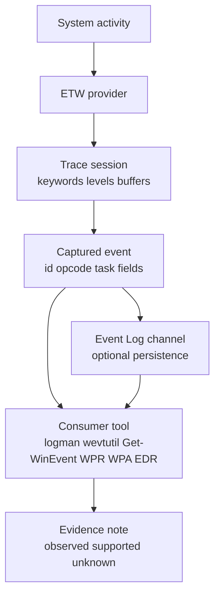

# Appendix F: ETW Provider Field Guide

> **Framing note:** Appendix này là field guide cho Event Tracing for Windows (ETW) từ góc nhìn Windows internals, detection engineering, diagnostics, và forensics. Mục tiêu là giúp researcher inventory provider, hiểu channel/session/event-field boundaries, capture evidence có kiểm soát, và tránh overclaim từ event telemetry. Đây không phải danh sách event ID tuyệt đối cho mọi build.

---

## Status

Draft implementation. Needs provider-by-provider verification records before publication-ready.

---

## 0. Why this appendix exists

Ch.10 nói về management, diagnostics, tracing; Ch.8 nói về system mechanisms; Ch.11/12 phụ thuộc nhiều vào event/log/trace artifacts. Nhưng ETW rất dễ bị hiểu sai:

- Provider tồn tại không có nghĩa event đang được capture.
- Event Log channel có event không đồng nghĩa toàn bộ ETW stream đã được lưu.
- Field name/payload có thể thay đổi theo provider, manifest, build, và collector.
- No event không có nghĩa no behavior.
- Stack capture, keyword, level, buffer, session, privilege, và dropped events đều ảnh hưởng evidence.

Appendix này cung cấp workflow để biến ETW từ "magic event source" thành evidence layer có caveat rõ.

---

## 1. Researcher Mindset

### 1.1 ETW là instrumentation fabric, không phải một log duy nhất

ETW có nhiều lớp:

| Layer | Câu hỏi đúng |
|---|---|
| Provider | Ai có thể emit event? |
| Session | Ai đang collect? buffer/drop/filter thế nào? |
| Event | Event nào được emit/captured? |
| Channel/Event Log | Event nào được persist vào log channel? |
| Consumer | Tool nào đọc và interpret event? |
| Schema/manifest | Field nghĩa là gì trên build này? |

Kết luận tốt phải nói rõ đang đứng ở layer nào.

### 1.2 Provider inventory không phải telemetry coverage

`logman query providers` hoặc `Get-WinEvent -ListProvider *` cho biết provider/channel metadata có thể thấy trên máy. Nó không chứng minh provider đã emit event, session đã capture, hay Event Log đã lưu.

### 1.3 Event field là contract có điều kiện

Một field có thể chỉ tồn tại trong provider version cụ thể, có nghĩa khác nhau theo opcode/task/keyword, bị tool render khác tên, hoặc absent khi collector không đủ quyền hay event bị dropped.

Do đó mọi field-sensitive claim cần verification record.

---

## 2. Big Picture



---

## 3. Key Terms

| Term | Vietnamese | Research meaning |
|---|---|---|
| Provider | Nguồn event | Component that emits ETW events |
| Session | Phiên trace | Collector context with buffers, filters, output |
| Keyword | Nhóm event bitmask | Enables subsets of provider events |
| Level | Mức detail/severity | Filters event verbosity/severity |
| Task | Nhóm hành động | Provider-defined operation group |
| Opcode | Pha hành động | Start/Stop/Info or provider-defined operation phase |
| Channel | Kênh Event Log | Persistence/routing layer for some events |
| Manifest | Schema provider | Defines event metadata and fields |
| Dropped events | Event mất | Buffer/session could not retain all events |

---

## 4. Provider Discovery Workflow

Use a three-pass model.

### 4.1 Inventory providers

```powershell
logman query providers
Get-WinEvent -ListProvider *
```

Record provider name, GUID, event log links, known channels, machine/build, and tool version.

### 4.2 Inspect one provider

```powershell
Get-WinEvent -ListProvider "Microsoft-Windows-Kernel-Process" | Format-List *
```

Record events, opcodes, tasks, keywords, levels, and templates/field hints if available.

### 4.3 Ask whether collection is active

```powershell
logman query -ets
```

This answers active trace sessions, not all possible providers.

---

## 5. Event Log vs ETW

| Question | Event Log | ETW trace session |
|---|---|---|
| Is it persisted by default? | Often yes for configured channels | No, unless session writes output |
| Is it complete provider output? | No | Depends on session/filter/drop |
| Is schema stable? | Relatively documented per channel but still versioned | Provider/version-specific |
| Good for | Durable system/security/admin logs | High-detail diagnostics and telemetry |
| Common mistake | Treating channel as whole ETW provider | Treating trace as historical record |

Correct wording:

> `Get-WinEvent` observed an event in a configured channel.

Different from:

> ETW provider emitted every possible event and all were captured.

---

## 6. Provider Field Checklist

For every provider/event claim, record:

| Field | Why |
|---|---|
| Windows build | Provider schema can change |
| Provider name/GUID | Avoid ambiguous names |
| Channel/session | Persistence vs trace collection |
| Event ID / task / opcode | Event identity |
| Keywords/level | Collection filter context |
| Field names and sample values | Claim depends on payload |
| Tool used | Rendering differences matter |
| Dropped/lost events | Completeness caveat |

---

## 7. Safe Local Labs

Use `labs/ch10-etw-provider-inventory/` first. It is intentionally inventory-focused:

- no permanent tracing;
- no boot logging;
- no provider-specific detection claim;
- produces provider/channel/session evidence records.

Future labs should add controlled `logman` trace session, WPR/WPA trace review, Event Log channel correlation, and provider-specific build verification.

---

## 8. Common Researcher Mistakes

| Mistake | Better model |
|---|---|
| Provider exists means coverage exists | Provider existence only proves potential event source |
| No event means no behavior | No event means this source did not record it under this config |
| Event ID stable forever | Verify per provider/build/channel |
| Event Log equals ETW | Event Log is a persistence/routing layer for some events |
| One collector sees all | Session keywords/levels/buffers/privileges shape visibility |
| Field name alone proves meaning | Check task/opcode/template/build and sample values |
| EDR event equals raw ETW event | EDR may enrich, normalize, drop, or rename fields |

---

## 9. Report Templates

### Provider inventory statement

```text
On <build/config>, <tool> listed provider <name/GUID> with <channels/events metadata>.
This supports provider availability/schema inventory.
It does not prove events were emitted or captured.
```

### Event observation statement

```text
During <session/channel/time>, <tool> observed event <provider/event/task/opcode> with fields <fields>.
This supports <bounded behavior claim>.
It does not prove <limits>.
```

### Detection engineering statement

```text
Signal: <provider/event/field>.
Required correlation: <process/user/file/network/time/build>.
False positives: <benign cases>.
Known gaps: <session/filter/provider/config limits>.
```

---

## 10. References

- Microsoft Learn — Event Tracing for Windows overview.
- Microsoft Learn — `logman` command reference.
- Microsoft Learn — `Get-WinEvent` PowerShell documentation.
- Microsoft Learn — Windows Performance Recorder / Windows Performance Analyzer documentation.
- Windows Internals, 7th Edition — diagnostics/tracing related sections.

References need URL verification before publication-ready.
