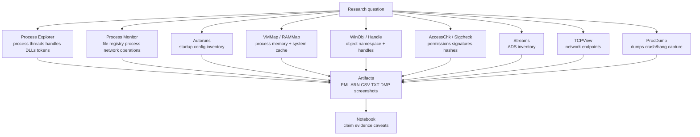
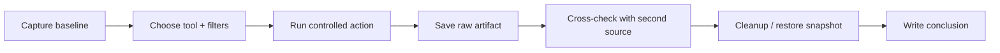

# Appendix I: Sysinternals Practical Lab Manual

> **Framing note:** Appendix này là practical lab manual cho Microsoft Sysinternals trong Windows Internals VN — Researcher Edition. Mục tiêu là dùng Sysinternals như một bộ kính hiển vi an toàn để quan sát process, thread, handle, DLL, registry, file I/O, network, startup, memory, cache, permissions, signatures, dumps, và forensic artifacts. Đây là read-only / low-risk research workflow; không phải hướng dẫn vô hiệu hóa bảo vệ, né telemetry, hay thao tác destructive trên production.

---

## 0. Why this appendix exists

12 core chapters dùng Sysinternals liên tục:

- Ch.1: Concepts and tools — Process Explorer, Procmon, WinObj.
- Ch.2: System architecture — system processes, service hosts, object namespace.
- Ch.3: Processes and jobs — process tree, handles, tokens, DLLs.
- Ch.4: Threads — thread stacks, wait states, start addresses.
- Ch.5: Memory — VMMap, RAMMap, working sets, mapped files.
- Ch.6: I/O system — Procmon, WinObj, Handle, device/file activity.
- Ch.7: Security — Process Explorer tokens, AccessChk, permissions.
- Ch.8: System mechanisms — WinObj, Handle, named objects, IPC.
- Ch.10: Diagnostics/tracing — Procmon boot logging, Autoruns, Event Logs correlation.
- Ch.11: Caching/file systems — RAMMap, VMMap, Streams, Procmon PML.
- Ch.12: Startup/shutdown — Autoruns, Procmon boot logging, service/driver baseline.
- Appendix E: lab setup — installing and versioning Sysinternals.
- Appendix C: WinDbg field guide — cross-check debugger output with Sysinternals.

Sysinternals tools are powerful because they expose practical Windows internals without writing kernel code. But they also create artifacts, load drivers, accept EULAs, generate logs, and can be misinterpreted if used without source-layer awareness.

This appendix consolidates repeatable labs for:

- Process and thread observation.
- Handle/object inspection.
- Registry/file/process telemetry with Procmon.
- Startup and persistence inventory with Autoruns.
- Memory and cache observation with VMMap/RAMMap.
- File system artifacts: ADS, signatures, paths, handles.
- Security/permissions review with AccessChk and Process Explorer.
- Dump capture with ProcDump.
- Network observation with TCPView.
- Documentation and cleanup discipline.

---

## 1. Researcher Mindset

### 1.1 Sysinternals output is a view, not universal truth

Sysinternals tools are high-quality Microsoft tools, but each tool observes a specific layer:

- Process Explorer: process/handle/module/token view at a point in time.
- Procmon: operation stream from instrumentation driver/filter path; high-volume and filter-shaped.
- Autoruns: configuration inventory, not proof of execution.
- VMMap: process memory layout, not complete historical memory behavior.
- RAMMap: system memory/cache state, not disk persistence.
- AccessChk: permission view at query time, not future access guarantee.
- Sigcheck: file signature/hash metadata, not behavior verdict.
- Streams: ADS inventory, not maliciousness verdict.
- TCPView: network endpoint snapshot, not full packet capture.
- ProcDump: dump collection, not root-cause analysis by itself.

Always ask: **which layer did this tool observe, and what layer did it not observe?**

### 1.2 Baseline first

Before any experiment:

- Capture clean Process Explorer tree.
- Capture Autoruns export.
- Capture `fltmc`, `driverquery`, `sc query`, and Sysinternals version list.
- Run Procmon briefly on idle system to understand background noise.
- Record Defender/EDR state.
- Record Windows build and snapshot.

Without baseline, you cannot tell whether a tool output is normal OS activity, lab tool noise, security product behavior, or experiment result.

### 1.3 Run elevated deliberately, not automatically

Many Sysinternals tools show more when elevated. But running as admin changes visibility and sometimes behavior. For research:

- Capture standard-user view when access boundaries matter.
- Capture elevated view when system-wide inventory matters.
- Record integrity level and admin state.
- Do not assume “access denied” means artifact absent.

### 1.4 Preserve raw artifacts

Useful Sysinternals artifacts:

- Procmon `.PML`.
- Autoruns `.ARN` or CSV export.
- Process Explorer screenshots/text exports.
- VMMap `.mmp`/exports if used.
- RAMMap screenshots/exports.
- ProcDump `.dmp`.
- Sigcheck CSV/hash output.
- AccessChk output.
- Handle output.

Raw output should be saved under `C:\Labs\Logs\Sysinternals` and summarized in notes. Do not commit raw sensitive artifacts to a public repo unless sanitized.

### 1.5 Tool artifacts matter

Sysinternals tools can create:

- EULA registry values.
- Temporary drivers/services.
- PML/log/dump files.
- Process creation telemetry.
- File/network activity.
- Symbol/signature/network lookups depending options.

Document tool execution as part of the experiment, not as invisible background.

---

## 2. Big Picture

### 2.1 Sysinternals tooling map



### 2.2 Tool-to-chapter mapping

| Chapter concept | Primary tools | Cross-check |
|-----------------|---------------|-------------|
| Process tree | Process Explorer, PsList | Event Logs, EDR, WinDbg `!process` |
| Threads/waits | Process Explorer | WinDbg `!thread`, WPA |
| Handles/objects | Handle, Process Explorer, WinObj | WinDbg `!handle`, `!object` |
| Memory/VADs | VMMap, RAMMap | WinDbg `!vad`, `!address` |
| File/registry I/O | Procmon | ETW/WPR, USN/MFT, Event Logs |
| Startup config | Autoruns | Registry, SCM, Task Scheduler, Event Logs |
| Permissions | AccessChk, Process Explorer | `icacls`, WinDbg `!token`, Security logs |
| Signatures/hashes | Sigcheck | Defender/EDR, PowerShell Authenticode |
| ADS | Streams | `dir /r`, forensic parser |
| Network endpoints | TCPView | netstat, ETW, packet capture |
| Dumps | ProcDump | WinDbg, WER |

### 2.3 Experiment pipeline



---

## 3. Key Terms

| Term | Vietnamese explanation | Researcher relevance |
|------|------------------------|----------------------|
| **Sysinternals Suite** | Bộ công cụ Microsoft để quan sát Windows internals | Practical toolbox for labs |
| **Process Explorer** | Process/task manager nâng cao | Process, DLL, handles, tokens, threads |
| **Process Monitor / Procmon** | Trace file/registry/process/network operations | High-volume operation evidence |
| **Autoruns** | Startup/autorun inventory | Configuration artifact review |
| **VMMap** | Process memory map viewer | Private/image/mapped/shareable memory |
| **RAMMap** | System memory and cache viewer | Standby/modified/file cache state |
| **WinObj** | Object Manager namespace browser | Object paths/symlinks/devices/sessions |
| **Handle** | CLI handle enumerator | Open handles and object references |
| **Sigcheck** | Signature/hash/file metadata tool | Trust and inventory review |
| **Streams** | Alternate Data Stream enumerator | NTFS ADS visibility |
| **TCPView** | TCP/UDP endpoint viewer | Network endpoint snapshot |
| **ProcDump** | Dump capture utility | Crash/hang/memory artifact creation |
| **AccessChk** | Permission and access checker | ACL/security review |
| **PML** | Procmon Log file | Raw Procmon trace artifact |
| **ARN** | Autoruns saved data file | Startup inventory artifact |
| **CSV export** | Structured text export | Diffing and documentation |
| **Filter** | Tool rule limiting displayed events | Reduces noise; creates blind spots |
| **Stack capture** | Call stack collection in Procmon | Attribution context; needs symbols |
| **EULA artifact** | First-run acceptance registry state | Expected Sysinternals noise |
| **Baseline** | Clean reference output | Diff against modified state |
| **Snapshot** | VM rollback state | Reproducibility and cleanup |
| **Elevated run** | Run as administrator | More visibility; different context |
| **PPL** | Protected Process Light | Can limit user-mode tool access |
| **VBS/HVCI** | Virtualization/code integrity features | Affect driver/tool/security state |
| **Symbol path** | Debug symbol location | Needed for stack interpretation |
| **Raw artifact** | Original PML/DMP/CSV/log | Preserve before summarizing |

---

## 4. Core Tooling Workflow

### 4.1 Install and verify Sysinternals

Recommended layout:

```text
C:\Labs\Tools\Sysinternals\
```

Verification:

```cmd
sigcheck.exe -nobanner -q -m C:\Labs\Tools\Sysinternals\procexp64.exe
sigcheck.exe -nobanner -q -m C:\Labs\Tools\Sysinternals\procmon64.exe
```

Record:

- Download source.
- Tool version.
- Hash/signature.
- First-run EULA accepted.
- Snapshot name.

### 4.2 Capture baseline set

Baseline command/output set:

```cmd
pslist.exe -accepteula > C:\Labs\Logs\Sysinternals\pslist-baseline.txt
handle.exe -accepteula -a > C:\Labs\Logs\Sysinternals\handle-baseline.txt
autorunsc.exe -accepteula -a * -ct > C:\Labs\Logs\Sysinternals\autoruns-baseline.csv
sigcheck.exe -accepteula -nobanner -e -s C:\Windows\System32 > C:\Labs\Logs\Sysinternals\sigcheck-system32.txt
```

Use GUI exports/screenshots where appropriate, but keep text/CSV for diffing.

### 4.3 Filter before capture, but preserve raw context

Procmon can generate enormous data. Good filters:

- Process Name.
- Path begins with `C:\Labs`.
- Operation is `CreateFile`, `WriteFile`, `RegSetValue`, etc.
- Result is not `SUCCESS` only when troubleshooting failures.
- Time window.

But filtering can hide context. For short experiments, consider saving raw PML and applying filters later.

### 4.4 Cross-check every strong claim

Examples:

- Process Explorer says process has handle → cross-check with Handle or WinDbg.
- Procmon says write event → cross-check file metadata/USN/hash if relevant.
- Autoruns shows startup entry → cross-check process creation after reboot/logon.
- VMMap shows mapped file → cross-check Process Explorer DLLs or WinDbg VAD.
- AccessChk says writable path → cross-check actual ACL inheritance and user context.

### 4.5 Artifact naming convention

```text
YYYYMMDD-HHMM_<tool>_<experiment>_<snapshot>.<ext>
```

Examples:

```text
20260522-0930_procmon_notepad-save_tools-baseline.pml
20260522-0945_autoruns_clean-baseline.csv
20260522-1010_vmmap_hello-pid.mmp
```

---

## 5. Important Tools / Components

| Tool | Role | Researcher angle | Main artifacts |
|------|------|------------------|----------------|
| Process Explorer | Process/thread/DLL/handle/token view | Runtime process model, security context | Screenshots, text exports |
| Process Monitor | Operation tracing | File/registry/process/network telemetry | `.PML`, CSV/XML exports |
| Autoruns | Startup inventory | Persistence/config baseline | `.ARN`, CSV |
| VMMap | Process memory map | VAD-like user-mode memory view | `.mmp`, screenshots |
| RAMMap | System memory/cache | File cache, standby, modified pages | Screenshots/exports |
| WinObj | Object namespace browser | Object Manager paths/devices/sessions | Screenshots/notes |
| Handle | CLI handle view | Handles, locks, object references | TXT/CSV output |
| Sigcheck | Signature/hash/version metadata | Trust and inventory | TXT/CSV output |
| Streams | ADS enumeration | Alternate stream visibility | TXT output |
| TCPView | Network endpoint view | Process-to-network mapping | Screenshots/CSV |
| ProcDump | Dump capture | Crash/hang/memory analysis | `.dmp` |
| AccessChk | ACL/access review | Permission boundary analysis | TXT output |
| PsList/PsKill/PsExec family | Process/admin utilities | Use cautiously; some alter state | TXT/logs |

Note: Prefer read-only tools/options in this appendix. Tools that terminate processes, execute remote commands, or change state belong in separate controlled admin labs, not baseline observation.

---

## 6. Trust Boundaries

### 6.1 Tool vs target boundary

Tools observe through Windows APIs, drivers, ETW, object queries, or filesystem access. Their output is layer-specific.

### 6.2 Elevated vs non-elevated boundary

Elevated tools can see more and access more. Standard user view is still valuable for real-world permission modeling.

### 6.3 GUI vs CLI boundary

GUI tools are good for exploration; CLI exports are better for reproducibility and diffing.

### 6.4 First-run EULA boundary

Sysinternals first run writes EULA acceptance artifacts. Accept EULA in tool snapshot before experiments to avoid noise.

### 6.5 Driver/tool behavior boundary

Procmon uses a driver. Some tools may open handles, query registry, scan files, or create dumps. Tool activity itself appears in telemetry.

### 6.6 Sensitive artifact boundary

PML, dumps, screenshots, Autoruns exports, and command outputs may contain paths, usernames, command lines, handles, tokens, network endpoints, and data fragments.

### 6.7 Security product boundary

Defender/EDR may scan tools, block some behavior, or generate alerts on dump capture. Record security product state.

---

## 7. Attack Surface Map

Lab-risk and research-control surfaces:

| Surface | Examples | Boundary crossed | What to observe | Research value |
|---------|----------|------------------|-----------------|----------------|
| Tool source | Downloaded Sysinternals ZIP | Tool trust | Signature/hash/version | Ensure tool integrity |
| EULA artifacts | Registry acceptance keys | Tool state | First-run registry writes | Baseline noise control |
| Procmon driver | Procmon capture driver | Kernel/tool boundary | Driver load/unload | Telemetry side effects |
| PML files | Saved traces | Sensitive artifact | File size, filters, time window | Evidence preservation |
| Autoruns output | Startup inventory | Config visibility | Disabled/missing/signed status | Persistence review |
| Dump files | ProcDump outputs | Memory disclosure | ACL, path, contents | Debug/forensics |
| Handle enumeration | System object visibility | Process/object boundary | Access denied vs visible | Permission model |
| Stack capture | Procmon stacks | Symbol/source boundary | Symbol path, modules | Attribution |
| Network endpoints | TCPView | Process/network boundary | Remote IP/port/process | Network correlation |
| ADS scan | Streams | File stream boundary | Stream name/size | Hidden artifact inventory |
| ACL scans | AccessChk | Security boundary | Writable paths/objects | Misconfig detection |
| Snapshots | VM rollback | State boundary | Snapshot name/time | Repeatability |

---

## 8. Abuse Patterns — Concept Level

This section covers misuse/analysis failure patterns.

### 8.1 Procmon tunnel vision

Procmon is rich but not complete truth. It shows observed operations, not necessarily physical disk persistence, kernel causality, or every telemetry source.

### 8.2 Autoruns equals execution mistake

Autoruns shows configuration. Execution requires process/logon/service/task evidence.

### 8.3 Process Explorer snapshot overclaim

Process Explorer is point-in-time. A process/thread/handle can appear/disappear between refreshes.

### 8.4 AccessChk overclaim

Writable permission does not prove exploitation or misuse. It identifies an access-boundary condition requiring context.

### 8.5 Dump mishandling

ProcDump can create sensitive memory artifacts. Treat dumps as confidential evidence.

### 8.6 Random filtering bias

Aggressive filters can hide relevant events. Save raw traces for short labs when possible.

### 8.7 Tool-induced artifacts

Sysinternals itself creates process, registry, file, driver, and network artifacts. Document tool execution.

---

## 9. Defender / EDR Telemetry

Sysinternals labs can trigger EDR/Defender telemetry.

| Event class | Examples | Source layer | Research notes | Limits |
|-------------|----------|--------------|----------------|--------|
| Tool execution | procexp64.exe, procmon64.exe, autoruns64.exe | Process telemetry | Legit admin/research tools | Tool name alone weak |
| Driver load | Procmon driver | Kernel/CI/System/EDR | Expected for Procmon | Product/version dependent |
| Handle access | Process Explorer/Handle queries | Object/EDR | Sensitive process opens may be logged | PPL/access limits |
| Dump creation | ProcDump `.dmp` | File/process/EDR | Sensitive artifact | Legit debugging common |
| Registry reads/writes | Autoruns/Procmon/EULA | Registry telemetry | EULA/config noise | Not target behavior alone |
| File scans | Sigcheck/Streams | File telemetry | Inventory activity | High volume |
| ETW/Event Log | Tool execution, crashes | Event Log/ETW | Correlate with lab notes | Not all actions logged |
| Network | Symbol/reputation/update checks | Network telemetry | Expected if online | Proxy/DNS may alter |

Telemetry interpretation note: ETW/Event Log/WMI/EDR are provider-generated or sensor-generated views, not universal ground truth. Telemetry must be interpreted with source layer, configuration, provider state, collection policy, and retention. Absence of an event is not proof of absence. High-signal anomaly still requires context and correlation.

---

## 10. Forensic Artifacts

Sysinternals usage may leave:

- Prefetch entries for tools.
- AmCache/ShimCache references.
- EULA registry values.
- Procmon PML files.
- Autoruns ARN/CSV exports.
- Process Explorer settings.
- ProcDump dumps.
- Sigcheck output and possible network activity.
- Streams output.
- AccessChk output.
- TCPView screenshots/exports.
- Event Logs for tool execution/crashes.
- Defender/EDR events.
- Downloaded ZIP and extracted tools.
- PowerShell/cmd history.
- Screenshots with usernames/paths.

For clean labs, accept EULA and install tools in a dedicated snapshot. For incident response, document that tooling itself can touch files/registry/processes.

---

## 11. Debugging and Reversing Notes

### 11.1 Process Explorer with WinDbg

Use Process Explorer for live context, WinDbg for deep dump/kernel context. Example correlation:

- Process Explorer: PID, image path, token, handles.
- WinDbg: `!process`, `!handle`, `!token`, VADs.

### 11.2 Procmon with WinDbg

Procmon answers “what operations occurred?” WinDbg answers “what state existed in memory/dump?” Combine for root cause.

### 11.3 VMMap with memory chapters

VMMap is a practical bridge to Ch.5: private memory, image mappings, mapped files, heap, stack, shareable regions.

### 11.4 RAMMap with caching chapters

RAMMap supports Ch.5/Ch.11: standby list, modified pages, mapped file cache, file summary.

### 11.5 Autoruns with startup chapters

Autoruns supports Ch.10/Ch.12: services, drivers, scheduled tasks, Winlogon, Run keys. It is configuration inventory, not execution proof.

### 11.6 AccessChk with security chapters

AccessChk supports Ch.7: ACLs, writable paths, service permissions. Treat findings as access-boundary signals.

### 11.7 ProcDump with Appendix C

ProcDump creates dumps; Appendix C explains how to inspect them in WinDbg. Dump creation is sensitive and should be logged.

---

## 12. Practical Labs

### Lab I.1 — Install Sysinternals and capture tool versions

**Goal:** Establish trusted Sysinternals toolset.

**Requirements:** Windows VM snapshot, internet or pre-downloaded Sysinternals Suite.

**Steps:**

1. Download Sysinternals Suite from Microsoft.
2. Extract to `C:\Labs\Tools\Sysinternals`.
3. Run `sigcheck` on key tools.
4. Record versions and hashes.
5. Accept EULA once in tools snapshot.

**Expected observations:** Tools are signed and versioned.

**Research notes:** First-run EULA artifacts are expected.

**Cleanup:** Keep extracted tools; remove zip if not needed.

### Lab I.2 — Process Explorer process/thread/token baseline

**Goal:** Capture process baseline.

**Requirements:** Process Explorer, admin and standard user sessions if possible.

**Steps:**

1. Run Process Explorer as standard user; screenshot tree.
2. Run elevated; compare visibility.
3. Inspect one process: Image, Threads, TCP/IP, Security, Handles, DLLs.
4. Save screenshots/notes.

**Expected observations:** Elevated view exposes more details.

**Research notes:** Process view is point-in-time.

**Cleanup:** Close Process Explorer.

### Lab I.3 — Procmon controlled file/registry trace

**Goal:** Learn controlled Procmon capture.

**Requirements:** Procmon, `C:\Labs\TestFiles`.

**Steps:**

1. Start Procmon elevated.
2. Clear events.
3. Filter Path begins with `C:\Labs`.
4. Create and modify a test file.
5. Create a harmless test registry key under HKCU.
6. Save PML.

**Expected observations:** File and registry operations appear with details/status.

**Research notes:** Procmon event is operation telemetry, not universal ground truth.

**Cleanup:** Delete test file/key; save or delete PML per policy.

### Lab I.4 — Autoruns startup inventory export

**Goal:** Create startup configuration baseline.

**Requirements:** Autoruns.

**Steps:**

1. Run Autoruns elevated.
2. Inspect Logon, Services, Drivers, Scheduled Tasks, Winlogon.
3. Export `.ARN` and CSV.
4. Record snapshot/build.

**Expected observations:** Many legitimate entries exist.

**Research notes:** Autoruns config does not prove execution.

**Cleanup:** Do not disable/delete entries in this lab.

### Lab I.5 — VMMap memory layout of harmless process

**Goal:** Connect process memory regions to Ch.5.

**Requirements:** VMMap and a harmless test process.

**Steps:**

1. Run Notepad or HelloPid test program.
2. Open VMMap for that process.
3. Identify Image, Heap, Stack, Private Data, Mapped File.
4. Save screenshot/export.

**Expected observations:** Memory is categorized by backing/type.

**Research notes:** VMMap is live point-in-time.

**Cleanup:** Close test process.

### Lab I.6 — RAMMap file cache observation

**Goal:** Observe system memory/cache state.

**Requirements:** RAMMap, large harmless file.

**Steps:**

1. Open RAMMap elevated.
2. Record Use Counts and File Summary.
3. Read a large file.
4. Refresh RAMMap.
5. Observe changes.

**Expected observations:** File cache/standby state changes.

**Research notes:** Cache state is volatile.

**Cleanup:** None.

### Lab I.7 — WinObj and Handle object namespace review

**Goal:** Connect Object Manager namespace and handles.

**Requirements:** WinObj, Handle.

**Steps:**

1. Open WinObj elevated.
2. Browse `\Device`, `\Sessions`, `\BaseNamedObjects`.
3. Run `handle.exe -a > handle-output.txt`.
4. Search for a known process/object name.

**Expected observations:** Object namespace and handle tables are related but distinct.

**Research notes:** Handle values are per-process.

**Cleanup:** Keep output if needed.

### Lab I.8 — AccessChk permission review

**Goal:** Inspect ACL/access-boundary conditions.

**Requirements:** AccessChk.

**Steps:**

1. Run AccessChk against a test directory.
2. Run AccessChk against a known service or registry path read-only.
3. Compare with `icacls` where appropriate.
4. Record current user/elevation state.

**Expected observations:** Permissions depend on user/admin context.

**Research notes:** Writable does not prove abuse.

**Cleanup:** None.

### Lab I.9 — Sigcheck and Streams file artifact review

**Goal:** Inspect signatures and ADS.

**Requirements:** Sigcheck, Streams, NTFS test file.

**Steps:**

1. Run Sigcheck on a known Microsoft binary.
2. Create a harmless ADS on a test file.
3. Run Streams and `dir /r`.
4. Delete test file.

**Expected observations:** Signatures/hashes and ADS are visible with proper tools.

**Research notes:** ADS is not automatically malicious.

**Cleanup:** Delete test file and ADS.

### Lab I.10 — TCPView network endpoint snapshot

**Goal:** Observe process-to-network mapping.

**Requirements:** TCPView.

**Steps:**

1. Open TCPView.
2. Start a browser or benign network command.
3. Observe process, local/remote address, state.
4. Save screenshot/export if needed.

**Expected observations:** Network endpoints are process-associated snapshots.

**Research notes:** TCPView is not packet capture.

**Cleanup:** Close test network application.

### Lab I.11 — ProcDump harmless dump capture

**Goal:** Create a dump for Appendix C practice.

**Requirements:** ProcDump, harmless test process.

**Steps:**

1. Run HelloPid or Notepad.
2. Create dump with ProcDump to `C:\Labs\Dumps`.
3. Open dump in WinDbg later.
4. Record dump path, time, process, command.

**Expected observations:** Dump file is created.

**Research notes:** Dumps are sensitive even for harmless processes.

**Cleanup:** Delete dump if not needed.

### Lab I.12 — Baseline diff after snapshot restore

**Goal:** Validate repeatability.

**Requirements:** Baseline exports and VM snapshot.

**Steps:**

1. Save baseline outputs from Process Explorer/Autoruns/Handle.
2. Make a harmless lab change.
3. Restore snapshot.
4. Re-run baseline outputs.
5. Diff outputs.

**Expected observations:** Snapshot restore returns outputs close to baseline.

**Research notes:** Time/update noise may still differ.

**Cleanup:** Keep diff notes.

---

## 13. Common Researcher Mistakes

1. Running Procmon for too long without filters.
2. Treating Autoruns entry as proof of execution.
3. Treating Process Explorer snapshot as historical truth.
4. Forgetting first-run EULA artifacts.
5. Not recording Sysinternals version.
6. Running everything elevated and missing standard-user boundary.
7. Saving screenshots but not raw output.
8. Sharing PML/dumps publicly.
9. Forgetting Procmon boot logging is enabled.
10. Not using VM snapshot before tool experiments.
11. Ignoring Defender/EDR reactions to tools.
12. Using random non-Microsoft builds of tools.
13. Ignoring 32-bit vs 64-bit tool variants.
14. Overtrusting AccessChk without context.
15. Treating Sigcheck signature as behavior verdict.
16. Treating ADS as automatically malicious.
17. Confusing TCPView snapshot with packet capture.
18. Not preserving filter settings with PML.
19. Comparing polluted VM to clean endpoint.
20. Forgetting cleanup of test files/keys/dumps.
21. Not correlating with Event Logs/ETW/WinDbg.
22. Ignoring time zone and collection time.
23. Assuming PPL-protected process details are fully visible.
24. Not documenting tool command lines.

---

## 14. Windows Version Notes

- Sysinternals tools update independently from Windows; record tool version.
- Windows 10 vs 11 changes process protection, VBS defaults, services, and security UI.
- PPL/VBS/HVCI can affect visibility and access.
- Procmon event details and stack quality depend on symbols and OS build.
- Autoruns categories may change over time.
- VMMap/RAMMap labels can change across versions.
- AccessChk results depend on policy, token, integrity level, and elevation.
- TCPView output depends on network stack and permissions.
- ProcDump behavior depends on OS dump APIs and target protection.

---

## 15. Summary

Sysinternals is the practical field kit for Windows internals research. Use it with discipline:

- Baseline first.
- Record tool versions.
- Preserve raw artifacts.
- Filter carefully.
- Cross-check with another source.
- Treat outputs as layer-specific views.
- Protect sensitive artifacts.
- Cleanup or restore snapshots.

Sysinternals does not replace WinDbg, ETW, Event Logs, or forensic parsers; it complements them.

---

## 16. Research Questions

1. Which Sysinternals tool best answers this question, and what layer does it observe?
2. What artifact does the tool create?
3. Was the tool run elevated or standard user?
4. Are first-run EULA artifacts already accounted for?
5. Does the output prove configuration, execution, or only visibility?
6. Can another tool cross-check the result?
7. Did filters hide relevant context?
8. Is the output point-in-time or historical?
9. Does PPL/VBS/HVCI affect visibility?
10. Are raw outputs saved and sanitized?
11. Does snapshot restore reproduce the baseline?
12. What false positives are normal on this VM?

---

## 17. References

- Microsoft Sysinternals — https://learn.microsoft.com/en-us/sysinternals/
- Sysinternals Suite — https://learn.microsoft.com/en-us/sysinternals/downloads/sysinternals-suite
- Process Explorer — https://learn.microsoft.com/en-us/sysinternals/downloads/process-explorer
- Process Monitor — https://learn.microsoft.com/en-us/sysinternals/downloads/procmon
- Autoruns — https://learn.microsoft.com/en-us/sysinternals/downloads/autoruns
- VMMap — https://learn.microsoft.com/en-us/sysinternals/downloads/vmmap
- RAMMap — https://learn.microsoft.com/en-us/sysinternals/downloads/rammap
- WinObj — https://learn.microsoft.com/en-us/sysinternals/downloads/winobj
- Handle — https://learn.microsoft.com/en-us/sysinternals/downloads/handle
- Sigcheck — https://learn.microsoft.com/en-us/sysinternals/downloads/sigcheck
- Streams — https://learn.microsoft.com/en-us/sysinternals/downloads/streams
- TCPView — https://learn.microsoft.com/en-us/sysinternals/downloads/tcpview
- ProcDump — https://learn.microsoft.com/en-us/sysinternals/downloads/procdump
- AccessChk — https://learn.microsoft.com/en-us/sysinternals/downloads/accesschk
- Windows Internals, Part 1 and Part 2 — relevant chapters.
- Appendix C — Kernel Debugging Field Guide.
- Appendix E — Windows Research Lab Setup.

---

## 18. Illustration Plan

### Mermaid diagrams

1. **Sysinternals tooling map** — research question → tools → artifacts → notebook. Included in Section 2.
2. **Experiment pipeline** — baseline → filters → controlled action → raw artifact → cross-check → cleanup → report. Included in Section 2.
3. **Tool-to-artifact map** — proposed:

   ```mermaid
   graph TD
       PE[Process Explorer] --> TXT[TXT/screenshots]
       PM[Procmon] --> PML[PML]
       AR[Autoruns] --> ARN[ARN/CSV]
       VM[VMMap] --> MMP[MMP/screenshots]
       PD[ProcDump] --> DMP[DMP]
       AC[AccessChk] --> OUT[TXT]
       SG[Sigcheck] --> CSV[CSV/TXT]
   ```

4. **Cross-validation map** — proposed:

   ```mermaid
   graph LR
       OBS[Sysinternals observation]
       ETW[ETW/WPR]
       EV[Event Logs]
       DBG[WinDbg]
       FS[Forensic artifacts]
       NOTE[Conclusion]
       OBS --> ETW --> NOTE
       OBS --> EV --> NOTE
       OBS --> DBG --> NOTE
       OBS --> FS --> NOTE
   ```

### Screenshot ideas

- Sysinternals folder with versions.
- Process Explorer baseline tree.
- Procmon filter dialog and event list.
- Autoruns Logon/Drivers tabs.
- VMMap memory categories.
- RAMMap Use Counts/File Summary.
- WinObj `\Device` namespace.
- Handle CLI output.
- AccessChk output.
- Streams ADS output.
- TCPView endpoint list.
- ProcDump dump creation.

### Search terms

- Sysinternals practical labs
- Process Monitor filters PML
- Process Explorer token handles DLLs
- Autoruns startup locations
- VMMap memory analysis
- RAMMap file cache standby list
- AccessChk Windows permissions
- Sigcheck file signature hash
- ProcDump WinDbg crash dump
