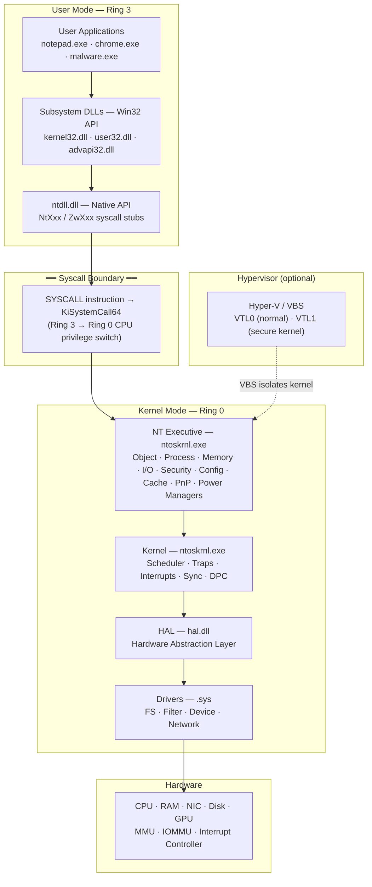
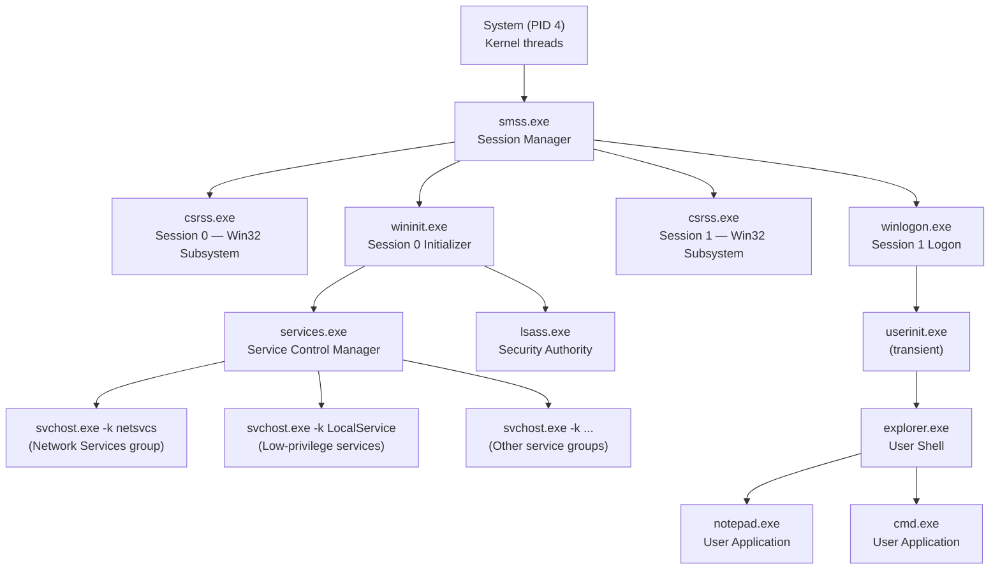
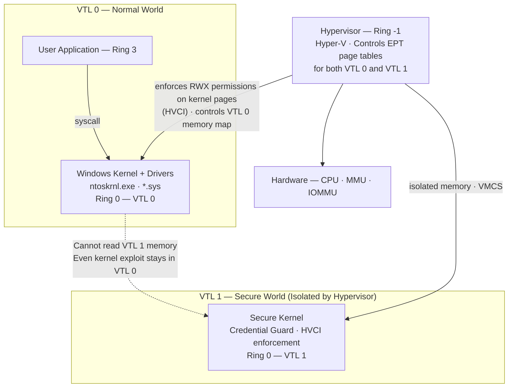
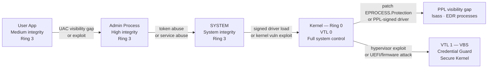
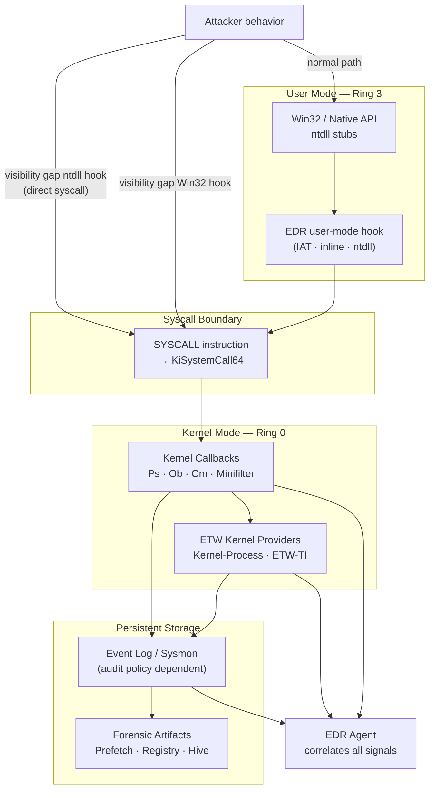
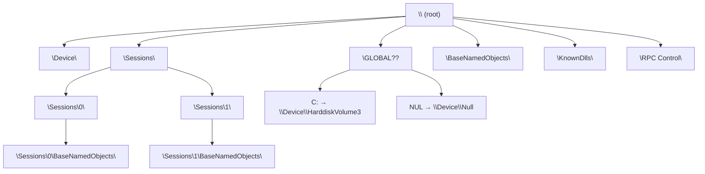
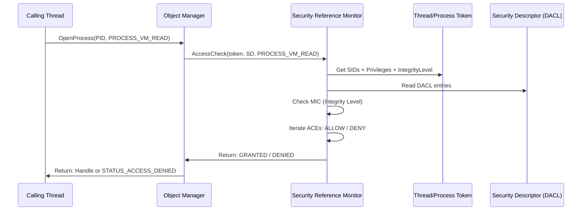

# Chapter 2: System Architecture (Kiến trúc Hệ thống)

---

## 0. Chapter Map

**Nguồn gốc**: Windows Internals 7th Edition, Part 1 — Chapter 2: *System Architecture*

Chapter 1 xây dựng từ vựng và làm quen với tool set. Chapter 2 xây dựng **bản đồ tổng thể của hệ điều hành** — một bản đồ mà researcher dùng để định hướng mọi thứ phía sau.

**Topics từ WI7 Ch.2:**
- Windows NT architecture layers
- User mode vs Kernel mode — đường ranh giới thực sự
- Windows Executive và các subsystem của nó
- Kernel, HAL, và drivers
- System processes quan trọng
- Session isolation
- System calls
- Protected Processes (PPL)
- Virtualization-Based Security (VBS) / HVCI — overview
- Object Manager namespace

**Tại sao chapter này quan trọng với researcher:**
Không hiểu kiến trúc = không biết mình đang nhìn vào đâu. Mỗi lần bạn mở Process Explorer, WinDbg, hoặc đọc một ETW event, bạn đang nhìn vào một phần của bản đồ này. Chapter 2 cho bạn tọa độ.

**Roadmap chương:**
```
User mode → Kernel mode → Executive managers → System processes
    → Sessions → Trust boundaries → Attack surface
    → EDR telemetry → Forensic artifacts → Labs
```

---

## 1. Researcher Mindset

Architecture không phải là một cái diagram để nhớ. Architecture là **bản đồ luồng control và data qua các ranh giới**.

Với researcher — red team, blue team, malware analyst, exploit developer — mỗi ranh giới kiến trúc là:

| Ý nghĩa của ranh giới | Cụ thể |
|---|---|
| **Telemetry point** | Nơi EDR/AV đặt callback, event, hook |
| **Attack surface** | Nơi input/trust/privilege gặp nhau |
| **Isolation layer** | Nơi một failure được chứa lại (hoặc không) |
| **Forensic artifact source** | Nơi OS ghi lại hành vi để phân tích sau |
| **Debugging breakpoint** | Nơi researcher dừng lại để quan sát |

**Câu hỏi đúng khi nhìn vào một component:**
> *"Component này nhận input từ đâu? Nó tin tưởng input đó ở mức độ nào? Khi nó tương tác với component khác, boundary nào bị vượt qua? Ai có thể quan sát điều đó?"*

**Ví dụ 1: `notepad.exe` launch**

Trên bề mặt: một process đơn giản. Dưới lớp bề mặt, một launch chạm vào:
- **Image loader**: xác minh PE, map vào memory, load DLLs
- **Registry**: đọc font, theme, recent files, app settings
- **File system**: mở executable, load DLLs từ disk
- **Object Manager**: cấp handle table, tạo section objects
- **Memory Manager**: cấp virtual address space, setup PTE
- **Process Manager**: tạo EPROCESS, ETHREAD
- **Security Reference Monitor**: kiểm tra token, integrity level
- **ETW providers**: emit process creation event, image load events

Mỗi điểm chạm là một telemetry opportunity. Mỗi điểm chạm là một điểm có thể bị tác động.

**Ví dụ 2: `lsass.exe`**

Không phải "một process tên lsass". Đây là:
- **Ranh giới xác thực** — xử lý credential tất cả user logon trên hệ thống
- **Kho credential** — giữ credential cache trong memory cho SSO/Kerberos
- **SAM/AD interface** — query database local và domain accounts
- **PPL target** (khi enabled) — được bảo vệ bởi kernel, admin thông thường không thể mở handle với debug rights
- **Primary forensic target** — memory dump của lsass chứa credential

Researcher không chỉ nhớ tên `lsass.exe`. Họ hiểu nó nằm ở ranh giới nào, nó giữ cái gì, cơ chế bảo vệ nó là gì, và cơ chế bảo vệ đó có thể bị tác động từ đâu.

**Ví dụ 3: `services.exe`**

Không phải "process quản lý service". Đây là:
- **SCM (Service Control Manager) trong user mode** — entity duy nhất được phép cài đặt, start, stop, configure services
- **Parent chính thức** của tất cả svchost.exe instances
- **Anchor của service configuration** — đọc từ registry, maintain state, phân tán service cho các svchost groups
- **Process tree reference point** — bất kỳ svchost.exe nào không phải con của services.exe là dấu hiệu bất thường

**Ví dụ 4: `System` (PID 4)**

Không phải "một process bình thường tên System". Đây là:
- Container cho **kernel threads**
- Không có executable image trên disk
- Không có PEB (Process Environment Block) đầy đủ trong user space như process thông thường
- Parent của `smss.exe` — process user-mode đầu tiên
- Chạy với đặc quyền kernel; mọi thứ trong đó đều ở Ring 0

Nếu bạn thấy một process tên "System" có image path trên disk → đó là dấu hiệu cần điều tra ngay.

---

## 2. Big Picture

Windows NT là hệ điều hành **layered** — mỗi lớp có đặc quyền, trách nhiệm, và trust assumption riêng.

**Stack từ trên xuống dưới:**

```
User Applications (notepad.exe, chrome.exe, malware.exe)
        ↓
Subsystem DLLs / Win32 API
(kernel32.dll, user32.dll, advapi32.dll, kernelbase.dll)
        ↓
ntdll.dll / Native API (NtXxx / ZwXxx stubs)
        ↓
━━━━━━━━ SYSCALL BOUNDARY (Ring 3 → Ring 0) ━━━━━━━━━
        ↓
NT Executive (ntoskrnl.exe — Object/Process/Memory/I/O/Security Managers)
        ↓
Kernel (scheduler, traps, interrupts, sync primitives)
        ↓
HAL (hal.dll — hardware abstraction)
        ↓
Drivers (.sys — FS drivers, filter drivers, device drivers)
        ↓
Hardware (CPU, RAM, NIC, Disk, GPU...)
```

Và ở dưới hoặc bên cạnh:
```
Hypervisor (Hyper-V / VBS nếu enabled) ─── isolate VTL0 vs VTL1
```

**Giải thích từng lớp:**

- **User Applications**: Code chạy với privilege thấp nhất. Không thể trực tiếp truy cập hardware. Lỗi trong code = process crash, không BSOD. Đây là nơi ứng dụng sống, service host, và malware user-mode hoạt động.

- **Subsystem DLLs / Win32 API**: Lớp abstraction được document công khai. `kernel32.dll`, `user32.dll`, `gdi32.dll`, `advapi32.dll` — đây là những gì developer thường gọi. Phần lớn implement thực sự nằm trong `kernelbase.dll` từ Win7+. Đây là lớp hay bị EDR hook.

- **ntdll.dll / Native API**: Lớp user-mode thấp nhất. Chứa syscall stubs (`NtReadFile`, `NtCreateProcess`...). Mọi thread Windows đều load ntdll. Không thể unload ntdll. Là last layer trước khi vào kernel.

- **Syscall Boundary**: Không phải code — đây là cơ chế CPU. `SYSCALL` instruction trên x64 chuyển CPU từ Ring 3 sang Ring 0 tại `KiSystemCall64`. Đây là điểm kiểm soát quan trọng nhất trong toàn bộ hệ thống.

- **NT Executive**: Code kernel-mode level cao — implement các manager như Object Manager, I/O Manager, Memory Manager, Process Manager, Security Reference Monitor, Configuration Manager, Cache Manager, Plug and Play Manager, Power Manager. Tất cả nằm trong `ntoskrnl.exe`.

- **Kernel**: Layer thấp hơn trong `ntoskrnl.exe` — scheduler, trap handlers, interrupt dispatch, low-level sync (spinlock, DPC). Kernel không phụ thuộc vào platform cụ thể (đó là nhiệm vụ của HAL).

- **HAL (Hardware Abstraction Layer)**: `hal.dll` — che giấu chi tiết hardware cụ thể. Interrupt controller, timers, multiprocessor bus. Đa số security researcher không cần dig vào HAL trừ khi nghiên cứu firmware/platform security.

- **Drivers**: `.sys` files — file system drivers (NTFS), filter drivers (minifilter), device drivers (network, storage, HID). Drivers chạy trong kernel mode và chia sẻ địa chỉ kernel với nhau. Bug trong driver = BSOD cho cả hệ thống.

- **Hardware**: Nơi mọi thứ thực sự xảy ra về mặt vật lý. CPU enforce ring separation. MMU enforce memory isolation. IOMMU (nếu có) isolate DMA.



---

## 3. Key Terms

| Term | Giải thích tiếng Việt | Researcher relevance |
|---|---|---|
| **User mode** | Môi trường thực thi có privilege hạn chế — Ring 3. Không thể trực tiếp access hardware hoặc kernel memory | Nơi hầu hết telemetry user-level được thu thập; dễ instrument nhưng dễ bị attacker visibility gap |
| **Kernel mode** | Môi trường thực thi với toàn quyền — Ring 0. Code có thể đọc ghi mọi RAM, access hardware trực tiếp | Bug = BSOD; kernel attacker có thể vô hiệu hoá mọi sensor user-mode |
| **Ring 3** | CPU privilege level cho user-mode code. x86/x64 thực tế dùng Ring 0 và Ring 3 | Hardware-enforced separation — không thể visibility gap mà không có syscall hoặc kernel exploit |
| **Ring 0** | CPU privilege level cho kernel-mode code. Toàn quyền với hardware | Kernel driver, exploit đạt Ring 0 = game over cho hệ thống |
| **Executive** | Tập hợp các OS service high-level trong ntoskrnl.exe (Object, Process, Memory, I/O, Security Managers...) | Mỗi manager là attack surface và telemetry source riêng biệt |
| **Kernel** | Layer thấp hơn trong ntoskrnl.exe — scheduler, traps, interrupts, sync primitives | Context switch, interrupt handling — không có user-mode analogue |
| **HAL** | Hardware Abstraction Layer (hal.dll) — abstract hoá chi tiết hardware cụ thể | Ít liên quan với application/security researcher; quan trọng với firmware/platform security |
| **Driver** | Kernel-mode module (.sys) mở rộng OS — device, file system, filter | Third-party driver = major kernel attack surface; driver signing là defense mechanism |
| **File system driver** | Driver implement file system logic (NTFS, FAT32, ReFS) | Minifilter API cho phép filter driver observe/modify mọi file I/O |
| **Filter driver** | Driver nằm trong stack trên driver chính — intercept IRP | EDR dùng minifilter để observe file I/O; attacker target để disable |
| **System call** | Cơ chế CPU-level để user-mode code yêu cầu kernel thực hiện tác vụ đặc quyền | Điểm ranh giới quan trọng nhất; kernel callback được gọi here |
| **ntdll.dll** | DLL user-mode duy nhất không thể unload — chứa syscall stubs và loader | EDR thường hook ntdll; direct syscall visibility gap lớp này |
| **Win32 API** | API public của Windows (kernel32, user32, advapi32...) | Documented, hay bị EDR instrument; không phải tất cả đều là syscall |
| **Native API** | NtXxx/ZwXxx — API thấp nhất user-mode trong ntdll.dll | Ít documented; direct syscall attacker target; cần cho threat modeling chính xác |
| **Subsystem DLL** | DLL implement một API subsystem cụ thể (Win32, POSIX...) | Win32 là subsystem chính; WSL là subsystem khác với translation layer riêng |
| **Service** | Process chạy trong background dưới SCM (services.exe) | Session 0, thường có privilege cao; cấu hình lưu trong registry |
| **Session** | Container isolation cho user session (Session 0 = services; Session 1+ = interactive) | Object namespace per-session; IPC qua session phải qua Global namespace |
| **Object Manager** | Executive component quản lý mọi kernel object và namespace | Namespace \Device, \Sessions, \BaseNamedObjects — quan trọng với forensics và attack |
| **I/O Manager** | Executive component quản lý I/O requests (IRP) và driver stack | IRP là data structure cốt lõi của mọi I/O; filter driver intercept IRP ở đây |
| **Memory Manager** | Executive component quản lý virtual address space, paging, sections, VAD | VAD tree = bản đồ bộ nhớ của process; page protection = defense; RWX region = red flag |
| **Process Manager** | Executive component tạo/destroy process, thread; maintain EPROCESS/ETHREAD | PsSetCreateProcessNotifyRoutine — primary telemetry hook cho EDR |
| **Configuration Manager** | Executive component implement registry (hive management, transaction) | Registry change callbacks; forensic artifact source |
| **Security Reference Monitor (SRM)** | Executive component thực thi access control — token vs security descriptor | Mọi access check đi qua SRM; privilege escalation attacks nhắm vào đây |
| **Cache Manager** | Executive component quản lý file cache để tối ưu I/O | Liên quan với forensics (cached data); ít liên quan với security research thông thường |
| **Plug and Play Manager** | Executive component quản lý device enumeration và driver loading | Driver load notification; PnP abuse cho driver installation |
| **Power Manager** | Executive component quản lý power state | Ít liên quan với security research thông thường |
| **PPL** | Protected Process Light — kernel mechanism bảo vệ process nhất định khỏi bị tamper dù attacker là admin | LSASS PPL, EDR PPL — visibility gap requires kernel exploit; quan trọng cho credential dumping understanding |
| **VBS** | Virtualization-Based Security — dùng hypervisor để tạo isolated execution environment | VTL1 chứa Credential Guard, HVCI, secure kernel; tấn công VBS cần vượt qua hypervisor |
| **HVCI** | Hypervisor-Protected Code Integrity — ngăn unsigned/tampered code chạy trong kernel nhờ VBS | Vô hiệu hoá nhiều kernel exploit technique; driver phải được signed và pass integrity check |

---

## 4. Core Internals

### 4.1 User Mode

User mode là nơi hầu hết code chạy — applications, services, subsystem servers. Ring 3 có nghĩa là hardware enforces rằng code không thể trực tiếp:
- Đọc kernel memory
- Ghi vào kernel memory
- Access hardware registers trực tiếp
- Thay đổi page table entries
- Disable interrupt

Thay vào đó, code phải đi qua syscall — và kernel sẽ kiểm tra trước khi làm.

**Các loại code chạy trong user mode:**

**Applications thông thường**: `notepad.exe`, `chrome.exe`, `cmd.exe` — chạy dưới user session với token của user. Có virtual address space riêng.

**Service processes**: Chạy dưới SCM, thường trong Session 0, với account đặc biệt (SYSTEM, LocalService, NetworkService, hoặc managed service account). Cũng là user-mode code, nhưng privilege thường cao hơn user thông thường.

**Subsystem DLLs**: Implement Win32 API. Chain thực tế:
```
kernel32.dll → kernelbase.dll → ntdll.dll → syscall
user32.dll → ntdll.dll → syscall (phần lớn)
gdi32.dll → win32k.sys (kernel GUI driver — qua syscall)
advapi32.dll → ntdll.dll → syscall (và đôi khi qua RPC đến lsass)
```

**Quan trọng**: Không phải mọi Win32 API call đều là syscall. Một số API là **purely user-mode wrappers**:
- `lstrlen()`, `lstrcpy()` — string ops trong user space
- `GetTickCount()` — đọc từ shared memory (KUSER_SHARED_DATA), không syscall
- `GetSystemTime()` — đọc KUSER_SHARED_DATA
- Nhiều `Get*Info*` APIs — từ process-local state trong PEB/TEB

Nhưng một số API trigger **chuỗi phức tạp cross-component**:
- `CreateProcess()` → `NtCreateUserProcess()` → process manager + memory manager + object manager + security check + ETW + image loader
- `RegOpenKey()` → `NtOpenKey()` → configuration manager + security check
- `OpenProcess()` → `NtOpenProcess()` → object manager + SRM access check + ObRegisterCallbacks trigger

> **Researcher note:** Khi EDR hook `CreateProcess` ở Win32 layer, attacker gọi `NtCreateUserProcess` trực tiếp qua ntdll — không visibility gap kernel callback `PsSetCreateProcessNotifyRoutineEx` nhưng visibility gap Win32-level hook. Đây là lý do kiến trúc multi-layer sensor tốt hơn single-layer hook.

**Tại sao user-mode visibility hữu ích nhưng không đủ:**
- Dễ instrument: IAT hook, inline hook trong ntdll, Frida, API Monitor
- Stack trace thường đầy đủ trong user mode
- Nhưng: attacker control code trong user space — hook có thể bị phát hiện và visibility gap
- Nhưng: direct syscall visibility gap hoàn toàn qua ntdll stubs
- Nhưng: không nhìn thấy kernel-mode activity

**ntdll.dll — special position:**
- Load đầu tiên vào mọi process (trước cả kernel32.dll)
- Không thể unload
- Chứa Native API stubs (NtXxx), runtime library (RtlXxx), loader (LdrXxx), exception handling
- EDR thường inject vào process và hook ntdll — vì đây là last layer trước syscall
- Một số EDR so sánh ntdll.dll trong memory với disk để phát hiện tampering

### 4.2 Kernel Mode

Kernel mode là nơi OS thực sự kiểm soát mọi thứ. `ntoskrnl.exe` là file chính chứa cả Executive lẫn Kernel layer. Ngoài ra:
- `hal.dll` — Hardware Abstraction Layer
- `win32k.sys` — kernel-mode GUI driver (desktop window manager, GDI)
- `*.sys` — driver files nói chung

**Đặc điểm quan trọng của kernel mode:**

**Shared address space**: Tất cả kernel-mode code chia sẻ cùng một địa chỉ kernel. Không có isolation giữa ntoskrnl, hal, và drivers theo mặc định. Driver X có thể đọc memory của driver Y nếu biết address.

**Fault = System fault**: Bug trong kernel-mode code = BSOD (Blue Screen of Death). Không có exception handler nào bắt được kernel fault (trừ khi driver tự setup structured exception handling — nhưng nếu IRQL sai, vẫn BSOD).

**IRQL (Interrupt Request Level)**: Kernel code chạy ở các IRQL khác nhau. PASSIVE_LEVEL (0) cho bình thường, DISPATCH_LEVEL (2) khi scheduler không thể preempt, DIRQL cao hơn cho interrupt handlers. Code ở IRQL cao không được page fault, không được block.

**Drivers là major attack surface**: Driver mở rộng kernel mode surface. Third-party driver không được signed đúng (hoặc có vulnerability) = attacker path vào kernel. Sau khi có kernel, attacker có thể tắt mọi security software.

**Kernel từ góc độ forensics**: Memory dump của system = snapshot kernel objects. Process list, handle table, driver list, network connections — tất cả sống trong kernel memory và có thể được phân tích từ memory image.

### 4.3 Executive vs Kernel — Ranh giới Nội bộ

Trong `ntoskrnl.exe`, có sự phân chia conceptual giữa **Executive** và **Kernel**:

**Kernel layer** (thấp hơn): scheduler, traps, interrupt dispatch, exception handling, low-level synchronization (spinlocks, DPCs, APCs). Kernel layer không phụ thuộc vào platform-specific — đó là công việc của HAL.

**Executive layer** (cao hơn): implement các OS services đầy đủ. Phụ thuộc vào kernel layer cho primitive.

> **Lưu ý quan trọng**: Đây là ranh giới conceptual từ góc độ thiết kế, không phải ranh giới binary cứng nhắc. Cả hai đều nằm trong một binary là `ntoskrnl.exe`. Ranh giới không hoàn toàn rõ ràng trong code thực tế.

**Ví dụ để thấy sự phân biệt:**

Khi tạo một process:
```
NtCreateUserProcess() [Executive — Process Manager]
  → Allocate EPROCESS structure [Executive — Object Manager]
  → Create initial virtual address space [Executive — Memory Manager]
  → Verify image signature [Executive — Code Integrity]
  → Assign token [Executive — Security Reference Monitor]
  → Initialize kernel process structure (KPROCESS) [Kernel layer]
  → Create initial thread [Executive — Process Manager + Kernel KTHREAD init]
  → Emit ETW process creation event [Executive — ETW]
```

Khi context switch xảy ra:
```
Timer interrupt → Interrupt Dispatch [Kernel — DPC]
  → Scheduler runs [Kernel — Dispatcher]
  → Select next thread [Kernel — Priority/quantum calculation]
  → Save register state of current thread [Kernel — KiSaveContext]
  → Load register state of next thread [Kernel — KiLoadContext]
  → Switch virtual address space if different process [Kernel — via CR3 update]
```

Opening a file:
```
NtCreateFile() [Executive — I/O Manager]
  → Parse path via Object Manager [Executive — Object Manager]
  → Security check [Executive — SRM]
  → Route IRP to appropriate driver stack [Executive — I/O Manager]
  → File system driver (NTFS) processes IRP [Driver]
  → Cache Manager interaction [Executive — Cache Manager]
  → Return handle [Executive — Object Manager]
```

### 4.4 HAL — Hardware Abstraction Layer

HAL (`hal.dll`) cung cấp interface giữa Kernel và hardware platform cụ thể. HAL abstract hoá:
- Interrupt controller (APIC, PIC)
- Timer và clock sources
- Multiprocessor bus topology
- ACPI platform interaction
- DMA và bus translation

**Từ góc độ security researcher thông thường**: HAL ít xuất hiện trực tiếp trong security research. Nếu bạn đang research cross-process memory tampering, privilege-boundary analysis, EDR visibility gap — bạn không cần biết sâu về HAL.

**Khi HAL quan trọng với researcher:**
- Firmware/UEFI security research
- Platform-specific vulnerabilities (BIOS SMM attack, DMA attack)
- Hypervisor research (hypervisor interact với hardware level mà HAL không abstract hết)
- Boot-time security research (Secure Boot chain)

**Một điểm quan trọng**: Có duy nhất một HAL trên hệ thống. HAL được load trước ntoskrnl trong boot sequence. Driver không gọi hardware trực tiếp — gọi qua HAL APIs hoặc kernel APIs mà wrap HAL.

---

## 5. Important Windows Components / Structures

### 5.1 Executive Managers

| Manager | Quản lý gì | Researcher angle | Công cụ quan sát |
|---|---|---|---|
| **Object Manager** | Mọi kernel object, object namespace, handle table, reference counting, security descriptor enforcement | Named objects (\Device, \Sessions, \BaseNamedObjects); handle squatting; object ACL misconfiguration; handle access telemetry | WinObj, WinDbg `!object`, `!handle`, `ObRegisterCallbacks` |
| **I/O Manager** | IRP lifecycle, driver stack routing, device objects, file I/O, IOCTL dispatch | IRP manipulation; device IOCTL attack surface; filter driver observe/modify behavior; driver stack confusion | WinDbg `!irp`, `!drvobj`, `!devobj`; Process Monitor (minifilter) |
| **Memory Manager** | Virtual address space, page tables, VAD tree, section objects, page protection, paging | VAD scan for injected code; RWX regions; section mapping abuse; heap spray forensics; page protection visibility gap | WinDbg `!vad`, `!address`, `!pte`; VMMap |
| **Process Manager** | EPROCESS/ETHREAD creation/destruction, job objects, process tree | Process tree integrity; PsSetCreateProcessNotifyRoutineEx callbacks; EPROCESS tamper; direct DKOM | WinDbg `!process`, `!thread`; Process Explorer |
| **Configuration Manager** | Registry hive management, key objects, transactions, notifications | Service/driver config; autorun keys; hive forensics; CmRegisterCallback; registry callback abuse | WinDbg `!reg`; Process Monitor registry; Regedit |
| **Security Reference Monitor (SRM)** | Token-based access control, privilege check, integrity level enforcement, audit | Token impersonation; privilege abuse; integrity level visibility gap; access denied audit events | WinDbg `!token`; `whoami /all`; Security Event Log 4663/4656 |
| **Cache Manager** | File data cache, mapped views, lazy writer, read-ahead | Cache-based file read visibility gap; forensic artifact in cache; less commonly manipulated directly | WinDbg `!filecache`; Performance Monitor cache counters |
| **Plug and Play Manager** | Device enumeration, driver loading, PnP notifications | Driver installation path; PnP notification abuse; BYOVD (Bring Your Own Vulnerable Driver) delivery | Device Manager; WinDbg `!devstack`; Event Log driver load |
| **Power Manager** | Power state transitions, sleep/wake, driver power management | Power notification callback; wake-on-event; persistence across sleep cycles | WinDbg `!poaction`; powercfg; Event Log |

**Object Manager — Deep Dive**

Object Manager là "kernel filesystem" — mọi resource được biểu diễn như object trong một namespace hierarchical. Namespace:

```
\                         ← root
├── Device\               ← device objects (HarddiskVolume1, Tcp, Null...)
├── GLOBAL??              ← drive letter symlinks (C: → \Device\HarddiskVolume3)
├── Sessions\             ← per-session namespace
│   ├── 0\               ← Session 0 (services)
│   │   └── BaseNamedObjects\  ← named objects for Session 0
│   └── 1\               ← Session 1 (first interactive user)
│       └── BaseNamedObjects\  ← named objects for Session 1
├── BaseNamedObjects\     ← legacy path, maps to current session
├── KnownDlls\            ← pre-loaded DLL sections
├── KnownDlls32\          ← 32-bit KnownDlls on 64-bit system
├── Windows\              ← window station objects
└── RPC Control\          ← ALPC port objects for RPC
```

Object Manager enforce:
- **Reference counting**: object bị free khi không còn reference
- **Security descriptor check**: mỗi open operation đi qua SRM
- **Handle table management**: handle = index trong per-process table
- **Object type enforcement**: không thể use File handle như Process handle

**I/O Manager — IRP**

IRP (I/O Request Packet) là data structure trung tâm của mọi I/O operation. Khi user-mode code gọi `ReadFile`:
```
I/O Manager tạo IRP
    → Gửi IRP xuống driver stack (top → bottom)
    → Mỗi filter driver trong stack có thể inspect/modify/complete IRP
    → File system driver xử lý IRP cuối cùng
    → IRP complete, result trả lên
```

Minifilter driver (EDR file protection) là filter driver trong stack này. Chúng có thể:
- Block một file access
- Redirect read/write
- Monitor operations
- Scan content trước khi trả về user-mode

**Memory Manager — VAD Tree**

Mỗi process có một **VAD tree** (Virtual Address Descriptor) — binary tree tracking mọi memory region trong address space:
```
Mỗi VAD node mô tả:
  - Start/End virtual address
  - Type: Private | Mapped | Image
  - Protection flags (RX, RW, RWX...)
  - Backing store (nếu mapped: file path hoặc pagefile)
```

> **Researcher note:** Private executable VAD nodes without file backing are high-signal memory-tamper artifacts. Memory forensics tools (Volatility) scan VAD trees for anomalies; section-based mappings can make attribution harder and require correlation.

**Security Reference Monitor — Access Check**

Mỗi lần bạn mở một handle (`OpenProcess`, `CreateFile`, `OpenKey`...), SRM thực hiện:
```
1. Lấy token của calling thread (hoặc process nếu không impersonation)
2. Lấy security descriptor của target object (DACL)
3. Iterate qua DACL entries
4. Kiểm tra integrity level (Mandatory Integrity Check)
5. Kiểm tra privilege nếu cần (SeDebugPrivilege visibility gap DACL cho process)
6. Return GRANTED hoặc DENIED với access mask
```

Nếu GRANTED, handle được cấp với access mask được requested (và được DACL cho phép). **Access check không xảy ra lại khi dùng handle** — chỉ xảy ra khi open.

### 5.2 System Processes — Backbone of Windows

| Process | Role | Quan hệ bình thường | Researcher notes | Red flags conceptually |
|---|---|---|---|---|
| **Idle** | Container cho CPU idle threads | Không có parent thực sự; PID = 0; một thread per CPU | Không có executable; chỉ thấy trong kernel view | Không có red flag — không nên thấy trong user-mode tools |
| **System** | Kernel threads container | PID = 4; parent của smss.exe | Không có image path; không có command line; session 0; token là SYSTEM | Image path trên disk; bất kỳ executable liên kết; session khác 0 |
| **Registry** (Win10+) | Accelerate registry access, pre-loaded hives | Con của System; xuất hiện sớm trong boot | Không có executable; kernel-managed; modern Windows only | Cùng tên nhưng có executable path; sai parent |
| **smss.exe** | Session Manager — khởi tạo sessions, load subsystems, set up paging file | Con của System; parent của csrss.exe và winlogon.exe; **1 instance master** tồn tại lâu dài + instance con tạm thời per session | Path phải là `%SystemRoot%\System32\smss.exe`; Session 0; instance con (tạo cho mỗi session) tự terminate sau khi spawn csrss và winlogon — chỉ master còn lại | Instance với path ngoài System32; instance tồn tại lâu mà không phải master; parent không phải System; Session khác 0 |
| **csrss.exe** | Client/Server Runtime Subsystem — Win32 subsystem | Con của smss.exe; một instance per session | Critical process — terminate = BSOD; path: `\Windows\System32\csrss.exe`; Session 0 và mỗi user session | Sai parent (không phải smss); sai path; interactive session có nhiều hơn 1 instance per session |
| **wininit.exe** | Windows Initialization — khởi động services.exe, lsass.exe, lsm.exe | Con của smss.exe; Session 0; chỉ 1 instance | Path: `\Windows\System32\wininit.exe`; parent của services.exe và lsass.exe | Multiple instances; sai parent; sai session; sai path |
| **services.exe** | Service Control Manager (SCM) | Con của wininit.exe; Session 0; SYSTEM; **chỉ đúng một instance**; parent của mọi svchost.exe | Path phải là `%SystemRoot%\System32\services.exe`; không có command line argument thông thường | Sai parent; sai path; multiple instances; Session khác 0; `svchost.exe` có parent không phải `services.exe` là signal quan trọng |
| **lsass.exe** | Local Security Authority — authentication, token generation, credential cache, Kerberos, NTLM | Con của wininit.exe; Session 0; SYSTEM; **chỉ đúng một instance** | Path phải là `%SystemRoot%\System32\lsass.exe`; PPL enabled nếu `RunAsPPL=1`; không bao giờ spawn child processes thông thường | Sai parent (không phải wininit.exe); path từ AppData/Temp/bất kỳ đâu ngoài System32; bất kỳ child process nào; hai instance trở lên; Session khác 0; không có PPL khi registry key đã set |
| **winlogon.exe** | Logon/logoff, SAS (Ctrl+Alt+Del), session lock | Con của smss.exe; interactive session; một instance per interactive session | Path: `\Windows\System32\winlogon.exe`; SYSTEM; load user profile khi login | Sai parent; sai path; session 0 thay vì interactive session |
| **explorer.exe** | Windows Shell — taskbar, file manager, desktop | Con của userinit.exe (temporary parent) → sau đó parent là session process; user session | Path: `\Windows\explorer.exe`; chạy với user token; medium integrity | Sai path; chạy với SYSTEM hoặc high integrity không giải thích được; sai session |

**Process tree bình thường — tổng thể:**



**lsass.exe — phân tích sâu hơn:**

lsass.exe host các **Authentication Packages** (DLL plugins):
- `msv1_0.dll` — NTLM authentication
- `kerberos.dll` — Kerberos authentication
- `wdigest.dll` — WDigest (deprecated, legacy)
- `tspkg.dll` — Terminal Services package
- `livessp.dll` / `cloudAP.dll` — cloud/live credentials

Mỗi authentication package có thể cache credential trong memory của lsass process. Đây là lý do tại sao lsass là target của credential dumping tools — không phải vì nó là process "đặc biệt" mà vì cách windows authentication hoạt động theo thiết kế.

PPL protection (RunAsPPL registry key) làm cho kernel từ chối cấp handle với `PROCESS_VM_READ` hoặc `PROCESS_ALL_ACCESS` đến lsass ngay cả với admin token — trừ khi requester cũng là PPL hoặc có kernel access.

**services.exe và svchost.exe — relationship:**

SCM (services.exe) đọc service configuration từ:
```
HKLM\SYSTEM\CurrentControlSet\Services\<ServiceName>
```

Services share svchost instance được nhóm theo `-k` parameter:
```
svchost.exe -k netsvcs              → NetworkService group
svchost.exe -k LocalService         → LocalService group  
svchost.exe -k DcomLaunch           → DCOM/PnP group
svchost.exe -k UnistackSvcGroup     → User services group
```

Từ Windows 10 1703+, nhiều services được tách thành instance riêng nếu đủ RAM — giảm blast radius khi một service crash.

> **Version note:** `lsm.exe` (Local Session Manager) không còn chạy như process riêng biệt từ Windows 8.1+. Chức năng của nó được tích hợp vào `wininit.exe`. Trên Windows 10/11, không tìm thấy `lsm.exe` trong process list khi hệ thống running ổn định.

### 5.3 Sessions — Namespace Isolation

Session là isolation container được quản lý bởi kernel. Mỗi session có:
- **Session ID** (integer)
- **Object namespace riêng** (`\Sessions\<id>\BaseNamedObjects\`)
- **Desktop và window station** (nếu interactive)
- **Logon session** (liên kết với credential)

**Session 0** — Service Isolation:
- Mọi Windows service chạy ở đây
- Không có desktop (từ Vista+)
- Interactive desktop display bị cấm — service không thể show GUI cho user
- Isolation này được gọi là **Session 0 Isolation** (Vista+)
- Tại sao: trước Vista, service có thể inject code vào user session qua shared window messages — security hole nghiêm trọng

**Session 1, 2, 3...** — Interactive User Sessions:
- Mỗi user logon (local, RDP) nhận một session ID
- Có desktop, window station
- User process chạy ở đây

**Object Namespace per Session:**
```
Named mutex "MyMutex" trong Session 1:
  → thực ra là \Sessions\1\BaseNamedObjects\MyMutex

Named mutex "Global\MyMutex" trong Session 1:
  → thực ra là \BaseNamedObjects\MyMutex (global namespace)

Named pipe \\.\pipe\MyPipe (từ Session 1):
  → visible cross-session vì pipes không session-scoped theo cách này
```

**Prefix Local\ và Global\:**
- `Local\ObjectName` → per-session namespace (default nếu không có prefix)
- `Global\ObjectName` → global namespace, accessible từ mọi session

**Tại sao session isolation quan trọng với researcher:**

**IPC design**: Nếu bạn muốn service (Session 0) communicate với user app (Session 1), không thể dùng Local named objects — phải dùng Global prefix, hoặc named pipe, hoặc ALPC, hoặc COM với appropriate activation.

**Forensic interpretation**: Khi phân tích memory dump hoặc process list, session ID giúp xác định context của process. lsass trong Session 1 không phải bình thường.

**Named object squatting cross-session**: Nếu attacker kiểm soát một process trong Session 0, họ không thể tự động squatt named object trong user session (Session 1) vì namespace khác nhau — trừ khi dùng Global prefix.

**GUI isolation**: Service không thể spawn GUI window trong user desktop (từ Vista+). Khi malware chạy dưới service account cố hiển thị GUI, hệ thống chặn.

---

## 6. Trust Boundaries

Đây là section quan trọng nhất trong chapter này cho researcher. Mỗi trust boundary là một câu hỏi: *"Ai tin tưởng ai ở đây? Trust đó có thể bị lạm dụng không? Và khi nó bị vượt qua, ai quan sát được?"*

### 6.1 User Mode ↔ Kernel Mode Boundary

Đây là ranh giới quan trọng nhất trong toàn bộ hệ thống.

**Cơ chế vật lý**: CPU hardware enforce. Khi chạy ở Ring 3, CPU từ chối thực thi privileged instructions (như write đến control registers, disable interrupt, modify page tables). Nếu code cố, CPU raise general protection fault → OS terminate process.

**Crossing boundary**: Chỉ qua `SYSCALL` instruction (x64) hoặc `SYSENTER` (x86). CPU save state, switch privilege level, jump đến kernel entry point (`KiSystemCall64`).

**User pointer validation**: Khi user-mode code truyền pointer vào kernel qua syscall, kernel phải validate rằng pointer thuộc về user-mode address range — không phải kernel space. Windows dùng `ProbeForRead`/`ProbeForWrite` APIs cho việc này. Nếu driver không probe, attacker có thể truyền kernel-space address → driver đọc/ghi kernel memory → privilege escalation.

Pattern lỗi quan trọng — **double-fetch / TOCTOU**: Kernel probe địa chỉ lần 1, sau đó đọc giá trị lần 2. Giữa hai lần đó, attacker thread thay đổi giá trị trong user-mode buffer. Kernel tin tưởng giá trị đã thay đổi, không probe lại → logic visibility gap. Đây là class vulnerability phổ biến trong Windows kernel và third-party drivers.

**`KUSER_SHARED_DATA`**: Kernel map một page đặc biệt tại địa chỉ cố định `0x7FFE0000` (user-mode, read-only). Kernel ghi vào đây các giá trị như timestamp, system time, version. User-mode code đọc trực tiếp mà không cần syscall (`GetTickCount()` dùng mechanism này). Đây là legitimate shared memory — không phải attack surface nhưng là ví dụ về cross-boundary data sharing được thiết kế có chủ ý.

**Kernel-mode trust risk**: Một khi code chạy trong kernel mode (driver, kernel exploit), nó có thể làm gần như mọi thứ:
- Đọc/ghi memory của mọi process
- Modify kernel structures (DKOM)
- Disable security callbacks
- Terminate protected processes
- Load unsigned code (nếu HVCI off)

**Drivers như major trust boundary**: Mỗi driver được load là code kernel-mode có toàn quyền. Third-party driver là major attack surface. Kỹ thuật BYOVD (Bring Your Own Vulnerable Driver) exploit driver có sẵn vulnerability để đạt kernel access.

### 6.2 Process Boundary

Mỗi process có virtual address space riêng — page table hoàn toàn khác nhau. Process A không thể đọc memory của process B chỉ bằng cách dereference pointer.

**Cross-process access cần**:
1. `OpenProcess()` với access rights phù hợp → kernel SRM kiểm tra
2. Sử dụng `ReadProcessMemory` / `WriteProcessMemory` → kernel thực hiện cross-process copy
3. `DuplicateHandle` → copy handle sang process khác (với permission)

**Boundary không tuyệt đối** trong trường hợp:
- Caller có `SeDebugPrivilege` → visibility gap DACL check khi open process handle
- Kernel-mode code → không có process boundary
- Shared memory (Section objects) → hai process cùng map section → chia sẻ memory có kiểm soát
- Handle inheritance → child process inherit handles từ parent

> **Researcher note:** Khi thấy một process mở handle đến process khác với quyền PROCESS_VM_READ hoặc PROCESS_ALL_ACCESS — đây là telemetry signal quan trọng. `ObRegisterCallbacks` cho phép EDR driver quan sát và optionally deny handle access này.

### 6.3 Token / Identity Boundary

Mỗi process có một **access token** — đây là "chứng minh thư" bảo mật:
- **SID (Security Identifier)**: Ai bạn là (user SID, group SIDs)
- **Privileges**: Những đặc quyền đặc biệt bạn có (SeDebugPrivilege, SeLoadDriverPrivilege...)
- **Integrity Level**: Mandatory integrity level (Low/Medium/High/System/Protected)
- **Session ID**: Session bạn thuộc về
- **Origin logon session**: Credential liên kết

**Thread impersonation**: Thread có thể tạm thời adopt token khác (impersonation token). LSASS, IIS, SQL Server dùng để handle requests từ nhiều users trong cùng process. Attacker có thể exploit nếu impersonation token bị leak hoặc service có điểm impersonation sai.

**Admin vs SYSTEM vs Kernel mode — phân biệt chính xác**:

Ba khái niệm này hay bị nhầm lẫn. Đây là so sánh cụ thể:

| Thuộc tính | Admin (elevated) | SYSTEM | Kernel mode (Ring 0) |
|---|---|---|---|
| **Là gì** | User account trong Administrators group | Service account đặc biệt của OS | CPU privilege level — không phải account |
| **Mode chạy** | User mode (Ring 3) | User mode (Ring 3) | Kernel mode (Ring 0) |
| **Integrity level** | High (0x3000) | System (0x4000) | Không áp dụng — không có token |
| **SeDebugPrivilege** | Có (khi enabled) | Có | Không cần — code có full access |
| **SeTcbPrivilege** | Không | Có | Không cần |
| **SeCreateTokenPrivilege** | Không | Có (một số contexts) | Không cần |
| **Đọc memory process khác** | Cần `OpenProcess` + `PROCESS_VM_READ` | Cần `OpenProcess` + `PROCESS_VM_READ` | Đọc thẳng — không cần handle |
| **Visibility gap PPL** | Không — kernel từ chối dù có SeDebugPrivilege | Không | Có — patch `EPROCESS.Protection` trực tiếp |
| **Load kernel driver** | Có (với SeLoadDriverPrivilege) | Có | Đã ở trong kernel rồi |
| **Disable kernel callbacks** | Không | Không | Có — ghi thẳng vào callback table |

> **Critical distinction**: SYSTEM account không phải kernel mode. Code chạy với SYSTEM token vẫn là user-mode code — vẫn bị giới hạn bởi virtual address space, vẫn phải đi qua syscall, vẫn bị kernel callbacks observe. Khi attacker nói "đã có SYSTEM", đó là privilege account, chưa phải kernel control. Muốn tắt EDR kernel callback, cần Ring 0 — không phải SYSTEM.

**Integrity Level enforcement**:
```
Untrusted (0) < Low (1000) < Medium (2000) < High (3000) < System (4000) < Protected (5000)
```
No-Write-Up policy: process không thể write vào object ở level cao hơn. Process không thể tự tăng integrity level của mình. UAC là user-space mechanism để request elevation (tạo process mới với High token).

### 6.4 Session Boundary

Như đã giải thích ở Section 5.3. Ranh giới quan trọng:
- Service (Session 0) không thể directly interact với user desktop (Session 1+)
- Named objects per-session (trừ Global\\ prefix)
- Cross-session communication phải qua explicitly cross-session mechanisms

**Researcher view**: Session boundary giải thích tại sao service-based malware cần IPC mechanism để nói chuyện với user-mode C2. Named pipes, COM objects, ALPC — những mechanism này phải được thiết kế để cross session boundary.

### 6.5 Object Access Boundary

Mỗi kernel object có **Security Descriptor** với:
- **DACL** (Discretionary ACL): ai được làm gì (Access Control Entries)
- **SACL** (System ACL): audit rules
- **Owner**: ai sở hữu object

Khi mở handle, Object Manager gọi SRM để check token vs DACL. Result: access mask được grant (intersection của requested và allowed).

**Handle table boundary**: Handle chỉ valid trong process đó. Không thể truyền raw handle number sang process khác và expect nó hoạt động — handle số 0x4 trong process A không cùng nghĩa với 0x4 trong process B. Phải dùng `DuplicateHandle`.

**Null DACL vs Empty DACL**:
- Null DACL: không có DACL → mọi người đều được access (misconfiguration)
- Empty DACL: DACL tồn tại nhưng không có entries → không ai được access

### 6.6 PPL Boundary — Protected Process Light

**Protected Process** là cơ chế Windows bảo vệ một số process critical (DRM, antimalware) khỏi bị tamper. **PPL** là phiên bản nhẹ hơn, được mở rộng cho security software.

**Cơ chế**: Kernel lưu **protection level** trong `EPROCESS.Protection` — một byte với hai field:

```c
typedef struct _PS_PROTECTION {
    UCHAR Type   : 3;   // PS_PROTECTED_TYPE
    UCHAR Audit  : 1;   // reserved
    UCHAR Signer : 4;   // PS_PROTECTED_SIGNER
} PS_PROTECTION;
```

`Type` values:
- `0` = None (không protected)
- `1` = ProtectedLight (PPL — Protected Process Light)
- `2` = Protected (PP — stricter, ít process hơn)

`Signer` levels — cao hơn có thể open thấp hơn:

| Signer value | Tên | Ví dụ process |
|---|---|---|
| 0 | None | Unprotected |
| 1 | Authenticode | Một số DRM processes |
| 2 | CodeGen | .NET native image generation |
| 3 | Antimalware | EDR/AV processes (PPL-Antimalware) |
| 4 | Lsa | lsass.exe khi RunAsPPL=1 |
| 5 | Windows | Một số Windows system processes |
| 6 | WinTcb | csrss.exe, smss.exe, wininit.exe |
| 7 | WinSystem | System process |

**Rule**: Để opener được cấp sensitive access rights đến target PPL process: `opener.Type >= target.Type` VÀ `opener.Signer >= target.Signer`. Không phải binary — là matrix so sánh hai field.

**Registry config cho lsass**:
```
HKLM\SYSTEM\CurrentControlSet\Control\Lsa\RunAsPPL
  = 1 → lsass chạy như PPL (Type=1, Signer=Lsa)
  = 2 → lsass chạy như PP  (Type=2, Signer=Lsa) — stricter, Win10 20H1+
```

**Admin không đủ**: `SeDebugPrivilege` visibility gap DACL check — nhưng PPL enforcement nằm trong kernel code path, không phải DACL. Kernel kiểm tra `EPROCESS.Protection` trước khi cấp handle — không quan tâm đến SeDebugPrivilege.

**Visibility gap PPL**: Cần kernel-mode code để write trực tiếp vào `EPROCESS.Protection` byte của target process. Đây là lý do PPL visibility gap đi kèm với kernel exploit hoặc BYOVD driver.

**WinDbg — đọc protection level**:
```windbg
!process 0 0 lsass.exe
← ghi lại EPROCESS address

dt nt!_EPROCESS <addr> Protection
← output: Protection : _PS_PROTECTION
←          Type   : 0y001 (= 1 = ProtectedLight)
←          Audit  : 0y0
←          Signer : 0y0100 (= 4 = Lsa)
```

**Forensic note**: Memory forensics có thể đọc `EPROCESS.Protection` từ dump — xác nhận process có PPL hay không, và ở signer level nào.

### 6.7 VBS / HVCI Boundary — Hypervisor Layer

**Virtualization-Based Security (VBS)** sử dụng Hyper-V hypervisor để tạo isolated execution environment ngay cả với OS đang chạy.

**Virtual Trust Levels (VTL)**:
- **VTL 0** (Normal World): Windows kernel (ntoskrnl), drivers, user-mode code — môi trường bình thường
- **VTL 1** (Secure World): Secure Kernel — Credential Guard, HVCI, secure enclaves

Hypervisor control page table cho cả VTL 0 và VTL 1. VTL 0 (Windows kernel) không thể đọc memory của VTL 1 — ngay cả kernel exploit không thể access credential trong Credential Guard.

**HVCI (Hypervisor-Protected Code Integrity)**: Hypervisor enforce rằng mọi page được mark executable trong kernel phải đã được code integrity checked và signed. Driver muốn run code phải pass WHQL signing. Kỹ thuật inject shellcode vào kernel memory sẽ fail vì page không thể được mark executable nếu không qua code signing check.

**Implications cho researcher**:
- Kernel exploit truyền thống (overwrite function pointer, inject shellcode) bị block bởi HVCI
- Attacker cần exploit hypervisor hoặc secure kernel (significantly harder)
- BYOVD driver phải pass signing — tuy nhiên signed vulnerable drivers vẫn là vector
- Credential dump qua memory read không thể steal Credential Guard-protected credentials



**Privilege escalation path và protection visibility gap — từ góc nhìn attacker:**



> **Lưu ý**: PPL không "cao hơn" Kernel về privilege — kernel đã có full access. PPL là hàng rào bảo vệ process trong user-mode khỏi kernel attacker phải tốn thêm bước. Từ kernel, attacker vẫn có thể visibility gap PPL bằng cách write thẳng vào `EPROCESS.Protection`. VTL 1 mới thực sự là boundary mà kernel exploit không thể vượt qua trực tiếp.

---

## 7. Attack Surface Map

Architecture attack surface không có nghĩa là exploit instructions. Nó có nghĩa là: **nơi input, trust, privilege, và telemetry gặp nhau**. Researcher cần hiểu bản đồ này để biết đặt sensor ở đâu và tìm kiếm gì.

| Surface | Ví dụ cụ thể | Boundary crossed | Cần quan sát gì | Research value |
|---|---|---|---|---|
| **Win32 APIs** | CreateProcess, VirtualAlloc, WriteProcessMemory | User-mode internal; eventually syscall | API arguments, caller stack, return value, target process | High — heavily documented, many abuse patterns |
| **Native APIs** | NtCreateUserProcess, NtAllocateVirtualMemory, NtWriteVirtualMemory | Approaching syscall boundary | Direct caller (visibility gap Win32 layer?), arguments | High — shows intent to avoid Win32 monitoring |
| **System calls** | SYSCALL instruction với EAX = syscall number | User → Kernel boundary | Kernel callbacks triggered; does call match API sequence? | Critical — only kernel callbacks see this reliably |
| **Process handles** | OpenProcess với VM_READ / ALL_ACCESS | Process boundary crossed | Handle access via ObRegisterCallbacks; audit event 4656 | High — telemetry cho cross-process access chain |
| **Thread handles** | OpenThread, CreateRemoteThread, NtCreateThreadEx | Process boundary (remote thread) | Thread creation callback; handle access; Sysmon Event 8 | High — cross-process execution signal |
| **Token handles** | OpenProcessToken, DuplicateTokenEx, ImpersonateLoggedOnUser | Identity/privilege boundary | Token manipulation; privilege escalation chain | High — lateral movement và privilege escalation |
| **Services** | Service install, modification, weak permission | User → privileged execution boundary | Registry 7045/7036 events; SCM callbacks; binary path integrity | High — persistence và privilege escalation |
| **Drivers** | Driver installation, IOCTL interface | User → Kernel boundary (massive) | Driver load notification; signed/unsigned; device object ACL | Critical — kernel attack surface |
| **Device objects** | \Device\PhysicalMemory, custom device in BYOVD | Kernel-exposed interface | Device ACL; which process opens which device | High — BYOVD, data exfiltration via kernel |
| **IOCTL interfaces** | DeviceIoControl với custom control code | User → Kernel (via I/O Manager) | IOCTL dispatch; input validation; kernel trust of user buffer | High — historically rich vuln class |
| **Named pipes** | \\.\pipe\PipeName | Process boundary / Session boundary | Pipe server identity; ACL; cross-session use | Medium — C2 channel, lateral movement |
| **ALPC endpoints** | Internal Windows IPC (RPC underneath) | Process boundary | Port object; connection; message; security descriptor | High — RPC attack surface, privilege escalation via ALPC |
| **RPC services** | COM, DCOM, WinRM, other services exposing RPC | Network / process boundary | RPC interface UUID; exposed methods; authentication | High — remote attack surface, lateral movement |
| **Named events/mutexes/sections** | Global\MutexName, Local\EventName | Process boundary / Session boundary | Object creation; ACL; session namespace | Medium — mutex-based C2 indicators, squatting |
| **Registry keys** | HKLM Run keys, service keys, Winlogon | Configuration boundary | Registry callback; write to sensitive keys; ACL | High — persistence mechanism, forensic artifact |
| **File system paths** | System32\, ProgramData\, AppData\, startup folders | Filesystem permission boundary | Minifilter file I/O; write to sensitive directories; DLL search path | High — DLL hijacking, persistence, dropper delivery |
| **Minifilter-visible I/O** | File create/write/read intercepted by filter driver | I/O Manager filter stack | Minifilter pre/post callbacks; content inspection | Critical — EDR primary file monitoring mechanism |
| **ETW providers** | Microsoft-Windows-Kernel-Process, ETW-TI | Kernel observability layer | ETW session; provider registration; tampering attempt | High — sensor integrity monitoring |
| **Event Log channels** | Security.evtx, System.evtx, Sysmon operational | Log pipeline boundary | Missing events; log clearing; policy gaps | High — forensic artifact, detection gap analysis |
| **WMI providers** | Win32_Process, ActiveScript, EventSubscription | COM/WMI boundary | WMI subscription; method invocation; namespace access | High — fileless persistence, lateral movement |
| **Scheduled tasks** | Task scheduler service, XML task definitions | Persistence configuration boundary | Task creation; task modification; trigger type | High — persistence mechanism |
| **Boot/startup config** | BCD, boot drivers, BootExecute registry | Boot boundary (pre-OS) | Persistent across reinstall (almost); hardest to detect | Very high — bootkits, persistence |

---

## 8. Abuse Patterns — Concept Level

Mục này không phải exploit guide. Đây là phân tích risk level của từng architectural pattern — cách thiết kế của Windows tạo ra opportunities mà attacker khai thác và defender cần understand.

### 8.1 Process Tree Deception

**Pattern**: Giả mạo process identity bằng cách dùng tên process hợp lệ hoặc manipulate process creation.

**Tại sao dễ bị lừa**: Process name (`EPROCESS.ImageFileName`) chỉ 15 ký tự. Name đơn giản dễ trùng. Parent PID có thể được set khi tạo process (via `PROC_THREAD_ATTRIBUTE_PARENT_PROCESS`).

**Cái gì thực sự định danh một process**:
- Full image path (không phải chỉ tên)
- Digital signature (valid, trusted issuer)
- Parent PID + parent path
- Session ID
- Token (user, integrity level)
- Command line arguments
- Load time

**Ví dụ pattern bất thường**:
- `svchost.exe` không phải con của `services.exe`
- `lsass.exe` spawning child processes (hiếm khi hợp lệ)
- `explorer.exe` chạy với SYSTEM token
- `notepad.exe` với command line chứa encoded payload
- Process có tên là system process nhưng path không phải `%SystemRoot%\System32\`

**Defender implication**: Process tree monitoring phải bao gồm path, signature, và parent verification — không chỉ tên.

### 8.2 User-Mode Visibility Gaps

**Pattern**: Thực hiện behavior ở layer mà sensor user-mode không quan sát được.

**Sensor layer và visibility gap tương ứng:**

| Sensor ở lớp | Visibility gap / sensor boundary | Research term thường gặp |
|---|---|---|
| Win32 API hook (kernel32/kernelbase) | Gọi native API ở layer thấp hơn Win32; Win32-only sensor không thấy đầy đủ | Direct Native API call |
| ntdll inline hook (stub level) | Syscall-level observation gap nếu chỉ dựa vào ntdll inline hook | Direct syscall research class |
| ntdll inline hook (stub tampered) | In-memory hook coverage limitation khi module view bị thay đổi | ntdll remapping/tamper research class |
| ntdll hook (anti-tamper by EDR) | Indirect syscall-style visibility gap; cần kernel/provider correlation | Indirect syscall research class |
| User-mode API call monitoring only | Kernel-mode operation nằm ngoài user-mode sensor layer | Kernel-mode operation |
| AMSI scan tại script host | AMSI memory-tamper visibility gap; cần integrity/behavior correlation | AMSI tamper research class |

**Counter-observation — kernel layer không bị visibility gap bởi user-mode technique:**
- `PsSetCreateProcessNotifyRoutineEx` fires bất kể process được tạo bằng Win32, Native API, hay direct syscall.
- `ObRegisterCallbacks` fires cho mọi handle open — kể cả từ direct syscall.
- Minifilter intercepts mọi I/O qua I/O Manager — kể cả từ `NtCreateFile` trực tiếp.
- Kernel callbacks chỉ có thể bị tắt bởi code đang chạy ở kernel mode.

**ETW-TI** (`Microsoft-Windows-Threat-Intelligence`): Provider kernel-level cho high-value events (memory alloc/exec, process memory read, handle access). Chỉ PPL process mới có thể subscribe. Attacker không thể disable từ user mode. Attacker với kernel access có thể tamper ETW provider table, nhưng đây là advanced và noisy operation.

**Implication**: Sensor placement quyết định blind spot. Sensor chỉ ở user mode = bị visibility gap bởi direct syscall. Sensor ở kernel callbacks = không bị visibility gap từ user mode nhưng bị visibility gap bởi kernel exploit. Sensor ở hypervisor (VBS) = không bị visibility gap bởi cả kernel exploit trong VTL 0.

### 8.3 Service Abuse Class

**Pattern**: Abuse service infrastructure để gain persistent privileged execution.

**Tại sao services là high-value target**:
- Chạy liên tục, kể cả khi không có user logged in
- Thường với elevated accounts (SYSTEM, NetworkService)
- Auto-start theo system boot
- Configuration lưu trong registry — audit trail nhưng cũng persistent mechanism

**Weak service permissions**: Nếu service binary path writable, service DLL path writable, hoặc service registry key writable bởi low-privilege user → privilege escalation opportunity.

**Service configuration visibility**: Registry path `HKLM\SYSTEM\CurrentControlSet\Services\` là audit trail đầy đủ cho mọi service. Event 7045 (new service install) là detection opportunity. Forensic artifact survive reboot.

### 8.4 Driver Attack Surface Class

**Pattern**: Load vulnerable hoặc malicious driver để gain kernel code execution.

**Tại sao drivers là high-value target**:
- Drivers chạy với kernel privilege
- Bug trong driver = full kernel control
- Device object ACL sai = user-mode code access kernel functionality không được phép

**BYOVD (Bring Your Own Vulnerable Driver)**: Attacker mang theo một driver đã signed nhưng có vulnerability. Load driver (cần admin), exploit vulnerability trong driver để gain kernel code execution. Signed driver pass HVCI check — nhưng vulnerability trong driver là vector.

**IOCTL interface design**: Driver tạo device object và expose IOCTL interface. Nếu device ACL quá permissive (user có thể access) và IOCTL handler không validate input → privilege escalation từ user mode.

**Detection**: Driver load event (ETW kernel provider, Event Log, Sysmon), driver file signature verification, device object ACL audit.

### 8.5 IPC Confusion Class

**Pattern**: Exploit IPC mechanism design để gain unauthorized cross-process or cross-session communication.

**IPC mechanisms và boundaries chúng cross**:
- Named pipes: process boundary, session boundary (with explicit handling)
- ALPC: process boundary; internal Windows RPC mechanism
- RPC: network boundary, process boundary
- Named sections: process boundary (shared memory)
- COM/DCOM: process boundary, network boundary

**Security design issues**:
- Null DACL trên named object → anyone can access
- Wrong namespace (Global vs Local) → unintended cross-session visibility
- Named object squatting — tạo object với tên victim expects trước khi victim tạo

**Forensic value**: Named pipe connections, ALPC connections, section object sharing — tất cả visible trong memory forensics như xác định communication channels giữa processes.

### 8.6 Sensitive Process Access Class

**Pattern**: Attempt to access LSASS hoặc security-sensitive processes để dump credential hoặc tamper security state.

**High-value process targets**:
- `lsass.exe` — credential cache, authentication packages
- AV/EDR processes — disable security software
- `winlogon.exe` — session/logon control
- `services.exe` / `wininit.exe` — service/system control

**PPL protection changes assumptions**: Admin có `SeDebugPrivilege` thường có thể open any process. PPL break này — kernel từ chối cấp sensitive access rights ngay cả với SeDebugPrivilege.

**Handle access telemetry**: `ObRegisterCallbacks` notification cho mọi handle open attempt đến sensitive processes — kể cả khi bị denied. Event 4656 trong Security log với Object Access audit enabled. Sysmon Event 10 (ProcessAccess).

### 8.7 Object Namespace Confusion Class

**Pattern**: Exploit object namespace design để confuse identity hoặc gain unauthorized access.

**Relevant mechanisms**:
- **Global vs Local objects**: Tạo `Global\MutexName` thay vì `Local\MutexName` → accessible cross-session (có thể là unintended)
- **Symbolic links**: Object Manager symbolic links trong namespace; path traversal via symlink; device symlink manipulation
- **Session namespace differences**: Object trong một session không visible từ session khác (trừ Global)

**Security implication**: Service (Session 0) tạo object với Local namespace → user (Session 1) không thể access. Service với Global namespace → user access — có thể là intended API hoặc security hole tùy design.

**Forensic value**: WinObj (hoặc memory forensics) reveal toàn bộ object namespace — tên, type, security descriptor, reference count. Unusual named objects (base64 encoded names, GUID names, random strings) là indicator.

---

## 9. Defender / EDR Telemetry


> Telemetry interpretation note:
> ETW/Event Log/WMI/EDR are provider-generated or sensor-generated views, not universal ground truth. Telemetry must be interpreted with source layer, configuration, provider state, collection policy, and retention. Absence of an event is not proof of absence. High-signal anomaly still requires context and correlation.

### 9.1 User-Mode Telemetry

| Telemetry | Cơ chế đặt sensor | Cung cấp gì | Visibility gap / sensor boundary |
|---|---|---|---|
| **Process creation (Win32 layer)** | IAT hook hoặc inline hook `CreateProcessW` trong kernel32 | Command line, parent PID, image path | Gọi `NtCreateUserProcess` trực tiếp qua ntdll → outside Win32 hook coverage |
| **Process creation (ntdll layer)** | Inline hook `NtCreateUserProcess` stub trong ntdll | Gần syscall hơn; khó visibility gap hơn Win32 hook | syscall/remapping research classes; verify with kernel telemetry |
| **Module / image load** | Hook `LdrLoadDll` hoặc `LdrpLoadDll` trong ntdll | DLL name, path, load address tại thời điểm load | manual mapping research class; module-list visibility gap |
| **Registry operations** | Hook `RegOpenKeyExW` hoặc `NtOpenKey` trong ntdll | Key path, value name, data type | Native/kernel registry operation may be outside Win32-only coverage |
| **File operations** | Hook `CreateFileW` / `NtCreateFile` | File path, access mode, creation disposition | Native/kernel file operation may be outside Win32-only coverage; validate at I/O/minifilter layer |
| **Network API activity** | Hook `WSAConnect`, `connect`, `WinHTTP` APIs | Socket endpoints, URLs, HTTP headers | Raw socket qua Winsock2 level thấp hơn; IOCTL trực tiếp đến network driver; encrypted traffic nội dung opaque |
| **AMSI (script content scanning)** | User-mode COM hook vào script hosts (PowerShell, wscript) | Script source code trước khi execute | Patch AMSI provider functions trong memory của process; load script qua non-AMSI-aware path; encode/encrypt payload rồi decode in-memory sau khi AMSI scan |

### 9.2 Kernel Telemetry

| Telemetry | Kernel API | Kích hoạt khi | Reliability | Blind spot |
|---|---|---|---|---|
| **Process create callback** | `PsSetCreateProcessNotifyRoutineEx` | Bất kỳ process nào được tạo, kể cả qua direct syscall | **Rất cao** — kernel-enforced, không visibility gap từ user mode | Process hollowing (process đã create nhưng image bị replace sau đó); DKOM ẩn process khỏi linked list |
| **Thread create callback** | `PsSetCreateThreadNotifyRoutine` | Bất kỳ thread nào được tạo (kể cả `CreateRemoteThread`) | **Cao** — gọi khi thread đầu tiên start | No-new-thread execution classes / delayed execution classes |
| **Image load callback** | `PsSetLoadImageNotifyRoutine` | Bất kỳ PE image nào được map qua OS loader — exe, DLL, **và kernel driver** | **Cao** — bao gồm cả driver load; không bao gồm manual PE map không qua OS loader | Manual mapping research class; not visible as normal loader event |
| **Registry callback** | `CmRegisterCallback` | Mọi registry operation (pre và post) | **Cao** — không visibility gap từ user mode | Direct binary edit của hive file trên disk; kernel-mode registry write bởi attacker đã ở kernel |
| **Object handle callback** | `ObRegisterCallbacks` | `OpenProcess`, `OpenThread` — mỗi handle open attempt | **Cao** — có thể deny hoặc strip access mask; fires kể cả khi denied | Attacker đã có handle từ trước khi EDR load callback; handle duplication từ process có handle hợp lệ |
| **Minifilter file I/O** | `FltRegisterFilter` + callbacks | Mọi file I/O qua I/O Manager (create, read, write, rename, delete) | **Cao** — intercept trước và sau operation | Direct disk write bỏ qua file system stack (cần kernel access); encrypted volume (minifilter thấy ciphertext) |
| **Driver/Image load (kernal)** | `PsSetLoadImageNotifyRoutine` | PE image bất kỳ được map bởi OS — bao gồm `.sys` driver được load | **Cao** — đây là cách đúng để monitor driver load từ bên ngoài | Manual driver load không qua `MmLoadSystemImage` (kỹ thuật advanced); callback table itself có thể bị patch nếu attacker có kernel |
| **ETW kernel providers** | ETW infrastructure (session-based) | Configurable per provider; Microsoft-Windows-Kernel-Process, ETW-TI, v.v. | **Trung bình** — phụ thuộc consumer session; ETW-TI cần PPL process | ETW session bị terminate; provider bị tamper nếu attacker có kernel access; không tự persist |

### 9.3 Event Log / ETW / Sysmon-style Telemetry

| Event | Source | EventID | Cung cấp gì |
|---|---|---|---|
| **Process creation** | Security.evtx (audit policy on) | 4688 | Image path, command line, parent, user, token elevation |
| **Process termination** | Security.evtx | 4689 | Process ID, exit code |
| **Handle request to object** | Security.evtx (object audit on) | 4656 | Object type, process, access requested |
| **Object access** | Security.evtx | 4663 | Actual access performed |
| **Registry value modified** | Security.evtx | 4657 | Key path, value name, old/new data |
| **New service installed** | System.evtx | 7045 | Service name, binary path, account — covers cả driver (type=1) lẫn service (type=32) |
| **Service state change** | System.evtx | 7036 | Service name, new state |
| **Sysmon driver loaded** | Sysmon/Operational | **6** | Driver file path, hash (MD5/SHA256), signature status — đây là Sysmon EventID, không phải Windows native EventID |
| **Sysmon process create** | Sysmon/Operational | 1 | Full command line, hashes, parent, GUID |
| **Sysmon network connection** | Sysmon/Operational | 3 | IP, port, process, protocol |
| **Sysmon image load** | Sysmon/Operational | 7 | DLL path, hash, signature |
| **Sysmon remote thread** | Sysmon/Operational | 8 | Source/target process, start address |
| **Sysmon process access** | Sysmon/Operational | 10 | Source process, target process, access mask |
| **Sysmon registry** | Sysmon/Operational | 12, 13, 14 | Key/value operations |
| **Sysmon file create** | Sysmon/Operational | 11 | File path, creation time |
| **WMI event subscription** | WMI-Activity/Operational | - | Consumer, filter, binding |
| **Scheduled task create/modify** | TaskScheduler/Operational | 106, 140 | Task path, action, trigger |

### 9.4 Telemetry Limits

**Không có lớp sensor nào là toàn năng.** Mỗi telemetry source có blind spots:

- **User-mode hook (ntdll)**: Blind khi code dùng direct syscall, blind với kernel-mode activity, blind khi hook bị tamper
- **Kernel process/thread callbacks**: Limited for post-creation image/memory mismatch and no-new-thread execution classes
- **Image load callback**: Blind với manually mapped PE không dùng OS loader
- **Minifilter**: Blind với kernel-mode direct file write (visibility gap I/O Manager); blind với encrypted volume content (sees ciphertext)
- **ETW providers**: Phụ thuộc vào ETW session configuration; có thể bị tamper nếu attacker có kernel access; ETW-TI cần PPL process để consume
- **Event Log**: Phụ thuộc vào audit policy configuration; log clearing xóa history; real-time không guaranteed; command line logging off by default
- **Sysmon**: Phụ thuộc vào deployment và filter configuration; không có trên mọi endpoint

**Coverage model thực tế — sensor placement và visibility gap path:**



> `BH → SC` thẳng (mũi tên visibility gap): Attacker dùng direct syscall hoặc indirect syscall — bỏ qua toàn bộ user-mode hook. Kernel callbacks vẫn fire. `HOOK` là lớp EDR user-mode dễ bị visibility gap nhất. `KC` (kernel callbacks) là lớp tin cậy nhất từ user-mode attacker perspective.

Mỗi edge trong diagram có thể bị cắt nếu attacker đủ privilege. Defense cần **depth** — nhiều lớp, khác nhau về placement và mechanism.

---

## 10. Forensic Artifacts

### Process Execution Artifacts

**Prefetch** (`C:\Windows\Prefetch\*.pf`):
- Windows ghi prefetch data khi process chạy lần đầu
- Chứa: tên process, số lần chạy, last run time, files và DLLs được access trong 10 giây đầu
- Survive reboot
- Có thể bị disable (trên server, SSD-optimized systems)
- Tool: WinPrefetchView, Volatility prefetch plugin

**AmCache** (`C:\Windows\AppCompat\Programs\Amcache.hve`):
- SHA-1 hash của executable đã được executed
- File path, size, last write time
- Survive reboot
- Ghi dù file bị xóa sau khi chạy
- Tool: RegRipper amcache plugin, AmcacheParser

**ShimCache / AppCompatCache** (`HKLM\SYSTEM\CurrentControlSet\Control\Session Manager\AppCompatCache`):
- Ghi lại executable đã được executed hoặc touched
- Không ghi hash; chỉ path và last modified time
- Survive reboot
- Update khi OS shutdown (thông thường) — memory-resident khi running
- Tool: ShimCacheParser, RegRipper

**UserAssist** (`HKCU\SOFTWARE\Microsoft\Windows\CurrentVersion\Explorer\UserAssist`):
- GUI applications launched từ Explorer
- ROT13-encoded path
- Last run time, run count
- Per-user artifact

**SRUM (System Resource Usage Monitor)** (`C:\Windows\System32\sru\SRUDB.dat`):
- Network usage, energy usage per process, app usage
- Covers 30-60 days
- Survive reboot
- Tool: SrumECmd

### Service / Driver Artifacts

**Registry service keys**:
```
HKLM\SYSTEM\CurrentControlSet\Services\<ServiceName>
  └── ImagePath: binary path
  └── ObjectName: account
  └── Start: start type (0=Boot, 1=System, 2=Auto, 3=Manual, 4=Disabled)
  └── Type: driver (1) or service (32) etc.
```
Last write timestamp của key = last modification time.

**Event Log service artifacts**:
- Event 7045 (System.evtx): New service installed — name, path, type, account
- Event 7036 (System.evtx): Service state change
- Event 4697 (Security.evtx): Service install với audit policy

**Driver load traces**:
- ETW Kernel-Process provider: Driver load events
- Sysmon Event 6: Driver loaded (với hash và signature)
- `System\CurrentControlSet\Services\` — Boot/System start drivers persist here

### Registry Artifacts

**Hive files** (`C:\Windows\System32\config\`, `%UserProfile%\NTUSER.DAT`):
- Chứa toàn bộ registry data cho hive đó
- Binary format (không phải text)
- Tool: RegRipper, Registry Explorer

**Transaction logs** (`*.LOG1`, `*.LOG2`):
- Journal cho registry hive operations
- Giúp recover changes ngay cả sau khi key bị xóa (nếu log chưa bị flush/overwritten)

**Last write timestamps**:
- Mỗi registry key có last write timestamp
- Hữu ích để timeline analysis — khi service key được tạo, khi value được set

### Object / Session Artifacts

**Memory forensics** có thể reveal:
- Toàn bộ process list từ EPROCESS linked list
- Handle table của từng process
- Object namespace trong kernel memory
- Named objects còn sống
- Session list và session properties
- Token của mỗi process
- Driver list (LDR_DATA_TABLE_ENTRY)

Tool: Volatility framework, WinDbg `.kdfiles` + memory image

### Memory Forensics

| Artifact | Location trong memory | Tool |
|---|---|---|
| Process list | EPROCESS ActiveProcessLinks | `!process`, vol2 `pslist` |
| VAD tree | EPROCESS VadRoot | `!vad`, vol2 `vadinfo` |
| Handle table | EPROCESS ObjectTable | `!handle`, vol2 `handles` |
| Token | EPROCESS Token | `!token`, vol2 `tokens` |
| Loaded modules | EPROCESS Peb.Ldr | `lm`, vol2 `dlllist` |
| Driver list | PsLoadedModuleList | `lm`, vol2 `modules` |
| Network connections | TCP/IP kernel tables | vol2 `netscan` |

### ETW / Event Log

Phụ thuộc vào collection policy. Nếu không có policy hoặc log bị clear, artifact không có. Đây là limitation quan trọng:
- Windows không log command line của process creation by default (Event 4688) — cần audit policy
- Sysmon không được deploy everywhere
- Log rotation có thể xóa old events
- ETW session cần consumer để lưu — không tự persist

---

## 11. Debugging and Reversing Notes

### Process Explorer

Là primary tool để hiểu process landscape trên system đang chạy.

**Columns quan trọng cần enable:**
- PID / Parent PID
- Command Line
- User Name
- Session
- Integrity Level (cần View → Show Lower Pane và Security tab)
- Verified Signer
- Company Name
- CPU / Memory

**Thao tác quan trọng:**
- Right-click process → Properties → Image tab: verified signer, path, command line
- Right-click process → Properties → Threads: thread list với call stacks
- Ctrl+D: DLL view — list tất cả DLLs của process với path và signature
- Ctrl+H: Handle view — tất cả handles của process
- View → Show Lower Pane với DLLs: tìm DLL load từ path bất thường
- Color coding: Purple = packed; Pink = service; Blue = own process; Red = terminated
- Options → Verify Image Signatures: verify tất cả một lần — image path sai sẽ fail verify

**Tip**: Tìm process có VirusTotal tab (Options → VirusTotal.com check) — quick check hash trực tiếp từ Process Explorer.

### Process Monitor

Tool trace file/registry/process/network events theo real-time.

**Filter strategy** — không capture mọi thứ rồi tìm — filter trước:
```
Process Name is <target>.exe
Operation is CreateFile
Path begins with C:\Users\<user>\AppData\Roaming
Result is ACCESS DENIED
```

**Event types quan trọng:**
- **Process Create / Thread Create**: process/thread lifecycle
- **Load Image**: DLL/EXE được load (kể cả location)
- **RegOpenKey / RegQueryValue / RegSetValue**: registry operations
- **CreateFile / WriteFile / ReadFile**: file I/O operations
- **Network Connect**: network connections

**Boot logging**: Procmon hỗ trợ capture events từ boot (Options → Enable Boot Logging). Capture driver load, service start, boot-time operations mà normally missed.

**Analysis**: File → Save để export PML hoặc CSV. Sử dụng Process Tree (Tools → Process Tree) để xem process hierarchy correlate với events.

### WinObj

Browse Object Manager namespace. Run as Administrator để thấy đầy đủ.

**Paths quan trọng để explore:**
- `\Device\` — device objects, physical và logical
- `\GLOBAL??` — drive letter symlinks (C: → \Device\HarddiskVolume3)
- `\Sessions\` — session-specific namespaces
- `\Sessions\0\BaseNamedObjects\` — Session 0 named objects
- `\Sessions\1\BaseNamedObjects\` — Session 1 named objects
- `\BaseNamedObjects\` — legacy path, maps to current session's BaseNamedObjects
- `\KnownDlls\` — pre-loaded DLL section objects
- `\RPC Control\` — ALPC port objects
- `\Windows\WindowStations\` — window station objects

**Tip**: Tìm named mutex của malware — thường là string lạ, base64, GUID-like. Enumerate `\BaseNamedObjects\` và cross-reference với running processes.

### WinDbg — Kernel Debugging

WinDbg là primary tool cho kernel-level inspection. Cần kernel debugging session (KD via network, COM, USB, hoặc local kernel debugging với livekd/`windbg -kl`).

**Commands quan trọng cho Chapter 2:**

```windbg
!process 0 0                    ← list tất cả processes (brief)
!process 0 7                    ← list tất cả với threads và modules
!process <EPROCESS addr> 0      ← detail một process
!process 0 0 lsass.exe          ← find process by name

dt nt!_EPROCESS <addr>          ← dump EPROCESS structure
dt nt!_KPROCESS <addr>          ← dump KPROCESS (scheduling info)
dt nt!_TOKEN <addr>             ← dump token structure

!thread <ETHREAD addr>          ← dump thread info
!handle 0 0 0 Process           ← list process handles of current process

lm                              ← list loaded modules (drivers + kernel)
lm m nt*                        ← list ntoskrnl
lmf                             ← show file paths

!object \Device                 ← dump Object Manager directory
!object \Sessions               ← dump Sessions directory
!handle <handle value>          ← dump specific handle

!drvobj <driver name>           ← dump driver object
!devobj <device name>           ← dump device object
!devstack <device addr>         ← show driver stack for device

!token                          ← dump token of current process context
!token -n                       ← with privilege names

.reload /f                      ← reload symbols
x nt!Ps*                        ← list all Ps* exported symbols
x nt!Ob*                        ← Object Manager exports
```

**Xem protection level (PPL) của process:**
```windbg
dt nt!_PS_PROTECTION <addr của Protection field trong EPROCESS>
```

**Walk EPROCESS linked list:**
```windbg
!process 0 0
← ghi lại một EPROCESS address
dt nt!_EPROCESS <addr> ActiveProcessLinks
← ActiveProcessLinks.Flink trỏ đến ActiveProcessLinks của EPROCESS tiếp theo
← offset của ActiveProcessLinks trong EPROCESS để tính base của EPROCESS tiếp theo
```

### x64dbg / User-Mode Reversing

Trong context Chapter 2, user-mode debugging hữu ích để:

**Quan sát API layering**:
1. Load target trong x64dbg
2. View → Modules → xem imported DLLs
3. Tìm import từ ntdll.dll — đây là Native API calls
4. Break on NtCreateFile (hoặc bất kỳ Nt/Zw function) → trace vào SYSCALL instruction
5. Observe rằng sau SYSCALL, code jump sang kernel — x64dbg không thể follow (user-mode debugger)

**Trace API calls**:
```
bp kernel32.CreateFileW — break khi API được gọi
bp ntdll.NtCreateFile — break khi native API được gọi
```

**Distinguish user-mode wrapper từ syscall**:
- `GetTickCount()`: không có SYSCALL — đọc thẳng từ KUSER_SHARED_DATA
- `CreateFile()`: eventually đến `NtCreateFile` → SYSCALL
- `HeapAlloc()` (small alloc): không syscall — manipulate heap trong user-mode memory
- `VirtualAlloc()`: syscall via `NtAllocateVirtualMemory`

---

## 12. Safe Local Labs


> Lab format note:
> Mỗi lab nên được đọc theo checklist: **Goal**, **Requirements**, **Steps**, **Expected observations**, **Research notes**, và **Cleanup**. Nếu một lab cũ chưa ghi đủ từng nhãn này, áp dụng checklist này trước khi chạy: dùng Windows VM/snapshot, ghi tool version/build, chỉ thao tác trên test artifact, dừng collector/debug setting sau lab, và xóa test files/keys/processes do lab tạo.

### Lab 2.1 — Map System Processes với Process Explorer

**Goal**: Hiểu process tree thực tế — ai là parent của ai, ở session nào, với token nào.

**Requirements**:
- Windows 10/11 VM
- Process Explorer (Sysinternals) — run as Administrator

**Steps**:

1. Mở Process Explorer với quyền Administrator.

2. Enable các columns sau (right-click vào column header → Select Columns):
   - PID
   - Parent PID
   - Command Line
   - User Name
   - Integrity Level
   - Verified Signer
   - Session

3. Đảm bảo đang ở tree view (View → Show Process Tree).

4. Locate và record thông tin của các process sau:
   - `System` (PID 4)
   - `smss.exe`
   - `csrss.exe` (có thể có nhiều instance — ghi lại session của mỗi cái)
   - `wininit.exe`
   - `services.exe`
   - `lsass.exe`
   - `winlogon.exe`
   - `explorer.exe`

5. Với mỗi process, ghi lại:
   - PID
   - Parent PID
   - Full path (Properties → Image tab)
   - Verified Signer
   - User account
   - Session ID
   - Integrity Level

6. Vẽ lại cây process theo tay — không nhìn diagram trong chapter. Sau đó so sánh.

**Expected observations**:
- `System` không có image path trên disk; PID = 4.
- `smss.exe` là con của System; xuất hiện sớm trong boot.
- `wininit.exe` là parent của `services.exe` và `lsass.exe`.
- `csrss.exe` chạy trong Session 0 và mỗi interactive session.
- `services.exe` và `lsass.exe` chạy trong Session 0 với SYSTEM account.
- `explorer.exe` chạy trong user session với user account, Medium integrity.

**Câu hỏi thực hành**:
- `svchost.exe` nào là parent của process X đang chạy?
- Có `svchost.exe` nào có parent không phải `services.exe` không?
- Integrity level của `services.exe` là gì?

**Cleanup**: Không cần — chỉ đọc.

---

### Lab 2.2 — Inspect Object Namespace với WinObj

**Goal**: Kết nối architecture diagram với Object Namespace thực tế trong kernel.

**Requirements**:
- WinObj (Sysinternals) — run as Administrator

**Steps**:

1. Mở WinObj với quyền Administrator.

2. Browse `\Device\`:
   - Quan sát device objects (HarddiskVolume1, HarddiskVolume2..., Null, Zero, Tcp, Udp, RawIp...)
   - Double-click một device để xem properties (type, security descriptor)

3. Browse `\GLOBAL??`:
   - Tìm `C:` — đây là symlink trỏ đến `\Device\HarddiskVolume<n>`
   - Tìm `NUL` — trỏ đến `\Device\Null`
   - Tìm `PIPE` — trỏ đến named pipe device

4. Browse `\Sessions\`:
   - Quan sát các session con directory
   - Browse `\Sessions\0\` → `BaseNamedObjects\`
   - Browse `\Sessions\1\` (hoặc session ID hiện tại của bạn) → `BaseNamedObjects\`
   - So sánh objects trong Session 0 vs Session 1

5. Open một application (ví dụ: Notepad hoặc Chrome) trong khi WinObj mở.
   - Refresh WinObj (F5)
   - Tìm named objects mới trong `\Sessions\<current>\BaseNamedObjects\`
   - Tìm mutex hoặc event tương ứng với application vừa mở

6. Browse `\KnownDlls\`:
   - Quan sát DLL section objects pre-loaded
   - Compare với `C:\Windows\System32\` — đây là same DLLs

**Expected observations**:
- Device objects tồn tại ngoài C:\-style filesystem view — đây là "filesystem" kernel.
- Drive letters là symlinks đến device objects.
- Session 0 và Session 1 có BaseNamedObjects riêng biệt.
- Applications tạo named objects (mutex, event) khi chạy.
- KnownDlls là optimization — pre-load DLLs để tiết kiệm time.

**Câu hỏi thực hành**:
- Path của symlink `C:` trỏ đến device nào?
- Session 0 và Session 1 có cùng named objects không?
- Có named object nào trong `\BaseNamedObjects\` có tên trông suspicious không (random characters, encoded names)?

**Cleanup**: Không cần.

---

### Lab 2.3 — Observe App Launch Across Components với Procmon

**Goal**: Cho thấy một app launch đơn giản chạm vào nhiều OS component.

**Requirements**:
- Process Monitor (Sysinternals) — run as Administrator
- Notepad.exe (built-in)

**Steps**:

1. Mở Process Monitor với quyền Administrator.

2. Ngừng capture (Ctrl+E để toggle off).

3. Xóa tất cả events hiện tại (Ctrl+X).

4. Thêm filter:
   - Filter → Filter...
   - Process Name | is | notepad.exe | Include
   - Apply

5. Bắt đầu capture (Ctrl+E để toggle on).

6. Mở Notepad (Start → Notepad, hoặc Win+R → notepad).

7. Đợi 10-15 giây, sau đó dừng capture (Ctrl+E off).

8. Phân tích events theo category:
   - **Process**: Quan sát Process Create event đầu tiên
   - **Image**: Load Image events — exe và DLLs được load theo thứ tự nào?
   - **Registry**: RegOpenKey, RegQueryValue — Notepad đọc những settings nào?
   - **File**: CreateFile, ReadFile — những files nào được access?

9. Click vào Load Image event cho `ntdll.dll` — kiểm tra path và sequence.

10. Click vào Load Image event cho `kernel32.dll` — đến sau `ntdll.dll` không?

11. Tìm registry reads liên quan đến `Notepad` key — Notepad đọc settings từ đâu?

**Expected observations**:
- Launching một app không phải một event — là một chuỗi nhiều events.
- ntdll.dll load trước kernel32.dll (loader sequence).
- Registry được đọc để load font, theme, app settings.
- File system được access để open DLLs, read PE headers.
- Process Create là event đầu tiên — rồi image loads, rồi DLL loads.

**Câu hỏi thực hành**:
- DLL nào được load đầu tiên sau executable?
- Notepad đọc registry key nào để load settings?
- Có CreateFile nào mở file không tồn tại (NOT FOUND result) không? Đây là DLL search behavior.

**Cleanup**: Không cần (không có file nào được tạo).

---

### Lab 2.4 — User-Mode API to ntdll Observation Concept

**Goal**: Hiểu API layering bằng cách quan sát imports và ntdll position.

**Requirements**:
- x64dbg (hoặc WinDbg user-mode) — bất kỳ tool nào có thể xem module list và imports
- Một process đơn giản (Notepad)

**Steps**:

1. Mở x64dbg.

2. File → Open → Browse đến `C:\Windows\notepad.exe`. x64dbg sẽ suspend process tại entry point.

3. Mở View → Modules (Alt+E):
   - Tìm `ntdll.dll` trong danh sách — đây là module user-mode thấp nhất
   - Ghi lại address range của ntdll
   - Tìm `kernel32.dll` và `kernelbase.dll`

4. Right-click vào `notepad.exe` trong module list → Follow in Dump:
   - Quan sát PE header structure (MZ magic, imports section)
   - Hoặc: Right-click → View Imports → xem list of imported DLLs và functions

5. Quan sát import list của notepad.exe:
   - Import từ `kernel32.dll`: `CreateFileW`, `ReadFile`, `WriteFile`, `GetFileSize`...
   - Import từ `user32.dll`: `MessageBoxW`, window management APIs
   - Import từ `ntdll.dll`: có thể có hoặc không — notepad thường không trực tiếp import ntdll

6. Đặt breakpoint trên `ntdll.NtCreateFile`:
   - Command bar: `bp ntdll.NtCreateFile`
   - Run (F9)
   - Observe khi breakpoint hit — call stack sẽ show chain: caller → kernelbase → ntdll → đây

7. Single-step (F7) sau khi ở ntdll stub — quan sát:
   - `mov eax, <syscall number>` instruction
   - `syscall` instruction — sau instruction này, user-mode debugger không thể follow vào kernel

**Expected observations**:
- ntdll.dll luôn có mặt, load đầu tiên, không thể unload.
- Không phải function nào trong kernel32 đều là syscall — trace vào `GetTickCount()` để thấy khác biệt.
- ntdll stub đặt syscall number trong EAX rồi execute SYSCALL.
- x64dbg không thể follow vào kernel sau SYSCALL (user-mode boundary).

**Câu hỏi thực hành**:
- Syscall number của `NtCreateFile` trên Windows build của bạn là bao nhiêu? (Xem giá trị EAX trước SYSCALL)
- `GetTickCount()` có SYSCALL instruction không? (Trace vào để xem)
- Bao nhiêu DLL được load bởi notepad.exe khi khởi động?

**Cleanup**: Close x64dbg.

---

## 13. Common Researcher Mistakes

| Sai lầm | Thực tế | Hệ quả nghiên cứu |
|---|---|---|
| "ntoskrnl.exe là toàn bộ Windows kernel" | ntoskrnl.exe chứa cả Executive lẫn Kernel layer, nhưng drivers, HAL, win32k.sys — đều là kernel-mode components không kém phần quan trọng | Bỏ qua attack surface từ third-party drivers và win32k |
| "HAL là một driver thông thường" | HAL là architecture layer riêng, được load đặc biệt, abstract hardware trực tiếp — không phải driver theo nghĩa thông thường | Confusion khi đọc boot sequence và driver stack |
| "Mọi Windows API call đều là syscall" | Nhiều APIs là user-mode wrappers, không touch kernel (GetTickCount, HeapAlloc small, string functions) | Over-estimate syscall volume; incorrect behavioral analysis |
| "Tin tưởng process name là đủ để verify identity" | Name dễ fake, 15-char truncation trong EPROCESS. Full path, signature, parent, session, token mới là identity đầy đủ | Bị deceived bởi basic process masquerade |
| "Parent PID là reliable identity indicator" | Parent PID có thể được set tùy ý khi tạo process via PROC_THREAD_ATTRIBUTE_PARENT_PROCESS | Process tree spoofing không được detect |
| "Admin có thể access mọi process" | PPL bảo vệ lsass và EDR processes ngay cả khỏi admin. SeDebugPrivilege visibility gap DACL nhưng không visibility gap PPL | Assume dump lsass là trivial với admin — không đúng khi PPL enabled |
| "SYSTEM account = kernel mode" | SYSTEM là user-mode service account với privilege cao — không phải kernel code. Kernel mode là Ring 0 code, không phải account | Confusion giữa privilege và mode; incorrect threat model |
| "Service và user application là giống nhau" | Service chạy trong Session 0, thường với elevated account, configured qua registry, managed bởi SCM — hoàn toàn khác context | Bỏ qua session isolation, service-specific attack surface |
| "Session isolation là optional detail" | Session isolation ảnh hưởng trực tiếp đến IPC, GUI access, named object namespace, forensic interpretation | Design IPC sai hoặc misinterpret forensic evidence |
| "Object namespace là không quan trọng" | Object namespace expose device, session, named objects — là telemetry và attack surface quan trọng | Bỏ qua entire class of attack (squatting, symlink abuse) |
| "PPL là một ACL bình thường" | PPL là kernel enforcement, không phải DACL. Visibility gap cần kernel-mode code hoặc driver exploit — không phải DACL manipulation | Under-estimate PPL, over-estimate attacker capability |
| "Windows 10 và Windows 11 internals giống nhau" | Syscall numbers thay đổi per build; VBS/HVCI default state khác; process tree có thể khác; ETW providers evolve | Direct syscall code break; incorrect baseline; missed detection |
| "Telemetry source = ground truth" | Mỗi sensor có blind spots, delay, policy dependency. Event Log có thể bị clear. ETW session có thể bị stop. User-mode hook có thể bị visibility gaped | Over-confidence trong detection; missed attack patterns |
| "Sensor visibility = attack impossibility" | Attacker có thể work around sensor — bằng cách avoid monitored code paths, operate below sensor layer, disable sensor với kernel access | Detection gap không được acknowledge và plugged |

---

## 14. Windows Version Notes

**Windows 10 builds (1903–22H2)**:
- Process tree và session structure cơ bản giống nhau nhưng một số services được tách/merge theo build
- VBS/HVCI không enabled by default trên tất cả hardware — phụ thuộc OEM và firmware support
- Syscall numbers thay đổi mỗi major version (và đôi khi minor update)
- PPL cho lsass configurable qua `HKLM\SYSTEM\CurrentControlSet\Control\Lsa\RunAsPPL`
- `svchost.exe` từ 1703+: services có thể được isolated thành instance riêng nếu đủ RAM

**Windows 11 (21H2+)**:
- TPM 2.0 required → hardware-backed Secure Boot, BitLocker, Credential Guard baseline mạnh hơn
- HVCI enabled by default trên nhiều OEM machines — ảnh hưởng lớn đến kernel exploit feasibility
- Smart App Control (application allow-listing dựa trên reputation và signature)
- Enhanced phishing protection
- Pluton security processor trên supported hardware: keys không accessible qua DMA attack

**Syscall number instability**: `NtCreateFile` trên Windows 10 1903 có thể có syscall number khác với Windows 10 22H2. Direct syscall code phải hardcode hoặc dynamically resolve per-build. Đây là lý do ntdll stub vẫn là preferred approach cho legitimate code — ntdll resolve per-build automatically.

**ETW coverage differences**: ETW providers, event IDs, và fields có thể thay đổi. ETW-TI được cải thiện trong Win10 2004+. Detection rules viết dựa trên ETW cần testing trên nhiều Windows versions.

**PPL behavior**: PPL signing level requirement thay đổi theo thời gian. EDR vendors phải maintain WHQL-level signing để qualify cho PPL. Không phải mọi EDR đều implement PPL — và nếu không, EDR process là soft target.

**Object namespace**: Về cơ bản ổn định giữa Win10/11, nhưng một số path và object mới được thêm theo feature releases (WSL2, container support, sandbox mode...).

---

## 15. Summary

Windows NT architecture là một hệ thống **layers và trust boundaries**. Chapter 2 xây dựng bản đồ tổng thể:

- **User mode (Ring 3)** — Applications, services, subsystem DLLs, ntdll: nơi phần lớn code chạy; dễ instrument nhưng không đủ để observe toàn bộ behavior.

- **Kernel mode (Ring 0)** — NT Executive (process/memory/I/O/security/object managers), Kernel layer, HAL, drivers: toàn quyền với hệ thống; bug = BSOD; driver = major attack surface.

- **Syscall boundary** — điểm kiểm soát quan trọng nhất giữa user và kernel; kernel callbacks được trigger here.

- **Executive managers** — mỗi manager có attack surface, telemetry, và forensic artifacts riêng: Object Manager cho namespace và handle, I/O Manager cho file I/O và IRP, Memory Manager cho VAD và page protection, SRM cho access control.

- **System processes** — `System`, `smss`, `csrss`, `wininit`, `services`, `lsass`, `winlogon`, `explorer` tạo thành backbone của Windows. Process tree relationship là baseline quan trọng.

- **Sessions** — Session 0 cho services, Session 1+ cho interactive users. Object namespace per-session. Cross-session communication cần explicit mechanism.

- **Trust boundaries** — User↔Kernel, Process boundary, Token/identity, Session, Object access, PPL, VBS/HVCI — mỗi boundary là attack surface và telemetry opportunity.

- **Researcher mindset**: Architecture không phải diagram để nhớ — là bản đồ nơi data/control cross boundaries. Mỗi boundary là nơi đặt sensor, tìm vulnerability, hoặc thu thập forensic artifact.

**Chapter tiếp theo sẽ zoom vào từng layer**:
- Chapter 3/4: Processes và Threads — internals của EPROCESS/ETHREAD
- Chapter 5: Memory Management — virtual memory sâu hơn
- Chapter 6: I/O System — IRP và driver stack
- Chapter 7: Security — access control, token, PPL deep dive

---

## 16. Research Questions

1. **Architecture boundary và telemetry reliability**: Ranh giới kiến trúc nào produce telemetry đáng tin cậy nhất — không thể bị visibility gap từ user mode? Tại sao? Trả lời theo cả offensive và defensive perspective.

2. **System process baseline**: Những system process nào nên có parent/session relationship ổn định và không thay đổi qua Windows versions? Process nào có relationship có thể thay đổi hợp lệ?

3. **Session isolation và IPC**: Session isolation ngăn service (Session 0) và user app (Session 1) communicate qua window messages và Local named objects. Những mechanism IPC nào vẫn hoạt động cross-session? Mechanism nào trong số đó không visible bằng Process Monitor?

4. **PPL và handle access assumption**: Khi lsass.exe chạy dưới PPL, những access rights nào bị block đối với admin process? `SeDebugPrivilege` có override PPL không? Điều này thay đổi credential dumping attack chain như thế nào?

5. **I/O Manager và driver attack surface**: Trong số các Executive manager, manager nào có attack surface rộng nhất liên quan đến third-party code? Tại sao?

6. **VBS/HVCI và kernel research assumptions**: Khi HVCI enabled, những kỹ thuật kernel research nào trở nên không khả thi? Researcher cần adjust approach như thế nào khi research kernel trên HVCI-enabled system?

7. **User-mode telemetry và visibility gaps**: Những events nào visible từ user-mode instrumentation nhưng không reliable đủ để dùng làm detection signal duy nhất? Kernel-mode telemetry nào bổ sung cho gaps đó?

8. **Forensic artifact survival**: Forensic artifacts nào survive reboot và có thể được collected sau khi malware cleanup? Artifacts nào chỉ available khi system running (volatile)?

9. **Baseline system process relationships**: Nếu phải baseline normal process relationships cho một Windows deployment, bạn sẽ capture những attributes nào cho mỗi system process? Làm thế nào để detect deviation?

10. **Object namespace inspection cho architecture mistakes**: Object namespace inspection có thể reveal architecture mistakes hoặc misconfiguration như thế nào? Cho 2 ví dụ cụ thể về namespace configuration dẫn đến security issue.

11. **Executive manager và forensic artifact**: Mỗi Executive manager để lại loại forensic artifact nào? Match từng manager với artifact type và tool để collect nó.

12. **Direct syscall và kernel callback interaction**: Code dùng direct syscall (không qua ntdll stubs) có bị observe bởi `PsSetCreateProcessNotifyRoutineEx` không? Bởi `ObRegisterCallbacks`? Bởi minifilter? Giải thích từng trường hợp.

---

## 17. References

### Windows Internals Book
- Windows Internals 7th Edition, Part 1, Chapter 2: *System Architecture* — Pavel Yosifovich, Alex Ionescu, Mark E. Russinovich, David A. Solomon

### Microsoft Learn — Architecture
- [Windows Driver Kit: Kernel-Mode Drivers](https://learn.microsoft.com/en-us/windows-hardware/drivers/kernel/) — TODO: verify URL
- [Windows architecture overview](https://learn.microsoft.com/en-us/windows-hardware/drivers/kernel/windows-kernel-mode-object-manager) — TODO: verify URL

### Microsoft Learn — Sysinternals Tools
- [Process Explorer](https://learn.microsoft.com/en-us/sysinternals/downloads/process-explorer)
- [Process Monitor](https://learn.microsoft.com/en-us/sysinternals/downloads/procmon)
- [WinObj](https://learn.microsoft.com/en-us/sysinternals/downloads/winobj)
- [Autoruns](https://learn.microsoft.com/en-us/sysinternals/downloads/autoruns)

### Microsoft Learn — Security Model
- [Protected Process Light](https://learn.microsoft.com/en-us/windows/win32/services/protecting-anti-malware-services-) — TODO: verify URL
- [Virtualization-Based Security](https://learn.microsoft.com/en-us/windows-hardware/design/device-experiences/oem-vbs) — TODO: verify URL
- [Windows services](https://learn.microsoft.com/en-us/windows/win32/services/services)
- [Windows drivers overview](https://learn.microsoft.com/en-us/windows-hardware/drivers/gettingstarted/what-is-a-driver-)
- [ETW overview](https://learn.microsoft.com/en-us/windows/win32/etw/about-event-tracing)
- [Access Control Model](https://learn.microsoft.com/en-us/windows/win32/secauthz/access-control-model)
- [Mandatory Integrity Control](https://learn.microsoft.com/en-us/windows/win32/secauthz/mandatory-integrity-control)

### Microsoft Learn — Internals Structures
- [EPROCESS (partial)](https://learn.microsoft.com/en-us/windows-hardware/drivers/kernel/eprocess) — TODO: verify URL
- [Session 0 Isolation](https://learn.microsoft.com/en-us/previous-versions/dotnet/articles/bb756986(v=msdn.10)) — TODO: verify URL

### WinDbg Reference
- [WinDbg command reference](https://learn.microsoft.com/en-us/windows-hardware/drivers/debugger/debugger-commands)
- [!process extension](https://learn.microsoft.com/en-us/windows-hardware/drivers/debugger/-process)
- [!object extension](https://learn.microsoft.com/en-us/windows-hardware/drivers/debugger/-object)
- [!handle extension](https://learn.microsoft.com/en-us/windows-hardware/drivers/debugger/-handle)
- [!drvobj extension](https://learn.microsoft.com/en-us/windows-hardware/drivers/debugger/-drvobj)

### Research Resources
- [windows-internals.com](https://windows-internals.com) — Blog từ tác giả WI7; deep technical posts
- [j00ru syscall table](https://j00ru.vexillium.org/syscalls/nt/64/) — Syscall numbers cho mọi Windows build
- [tiraniddo.dev](https://www.tiraniddo.dev) — James Forshaw, Windows security research (sandbox, COM, object namespace)
- [Alex Ionescu's blog](http://www.alex-ionescu.com) — Windows internals cực sâu (boot, PPL, VBS)

---

## 18. Illustration Plan

### Mermaid Diagrams (đã có trong chapter)

- [x] **Diagram 1** — Windows architecture stack: User/Kernel/HAL/Driver/Hardware layers với VBS overlay (Section 2)
- [x] **Diagram 2** — System process relationship tree: System → smss → wininit → services/lsass; smss → csrss/winlogon → explorer chain (Section 5.2)
- [x] **Diagram 3** — Telemetry pipeline: Behavior → User-mode API → Syscall → Kernel callbacks/ETW → EDR/event log/forensics (Section 9.4)
- [x] **Diagram 4** — VBS/Hypervisor isolation: VTL0 vs VTL1 với hypervisor layer (Section 6.7)
- [x] **Diagram 5** — Trust boundary ladder: User app → Admin → SYSTEM → Kernel → PPL → VBS (Section 6.7)

### Screenshots cần chụp trong Windows VM

1. **Process Explorer — System process tree**:
   - Full tree với `wininit.exe → services.exe → lsass.exe` và `smss.exe → csrss.exe` rõ ràng
   - Alt text: "Process Explorer showing Windows system process hierarchy with correct parent-child relationships"

2. **Process Explorer — Columns đầy đủ**:
   - Columns: PID, Parent PID, Command Line, User Name, Session, Integrity Level, Verified Signer
   - Focus vào system processes ở top của tree
   - Alt text: "Process Explorer with security-relevant columns showing session, integrity, and signer for system processes"

3. **WinObj — \Device và \Sessions**:
   - Screenshot `\Device\` directory với device objects visible
   - Screenshot `\Sessions\` với session subdirectories
   - Alt text: "WinObj showing Object Manager namespace with Device directory and per-session BaseNamedObjects"

4. **Procmon — Notepad launch trace**:
   - Filter: notepad.exe
   - Show events: Process Create, Load Image (ntdll, kernel32, dll chain), Registry reads, File operations
   - Alt text: "Process Monitor trace showing multiple OS components touched during a simple Notepad launch"

5. **Process Explorer — lsass Properties**:
   - Right-click lsass → Properties → Image tab: path, verified signer
   - Security tab nếu có: integrity level
   - Alt text: "Process Explorer properties for lsass.exe showing verified Microsoft signer and protection status"

### Diagrams cần tạo thêm (future)

**Diagram: Object Namespace hierarchy**:


**Diagram: SRM access check flow**:


### Image search terms

- "Windows NT architecture layers ring 0 ring 3 diagram"
- "Windows system process tree smss wininit services lsass"
- "Windows Object Manager namespace WinObj screenshot"
- "Windows user mode kernel mode syscall boundary"
- "Windows Protected Process Light PPL lsass"
- "Windows VBS HVCI architecture VTL0 VTL1"
- "Windows Session 0 isolation service desktop"
- "Windows ETW telemetry pipeline EDR"
- "Process Monitor notepad launch trace Sysinternals"
- "WinDbg !process EPROCESS kernel debugging"

---

*Chapter 2 hoàn thành. Tiếp theo: [Chapter 3 — Processes and Jobs](ch03-processes-and-jobs.md)*
