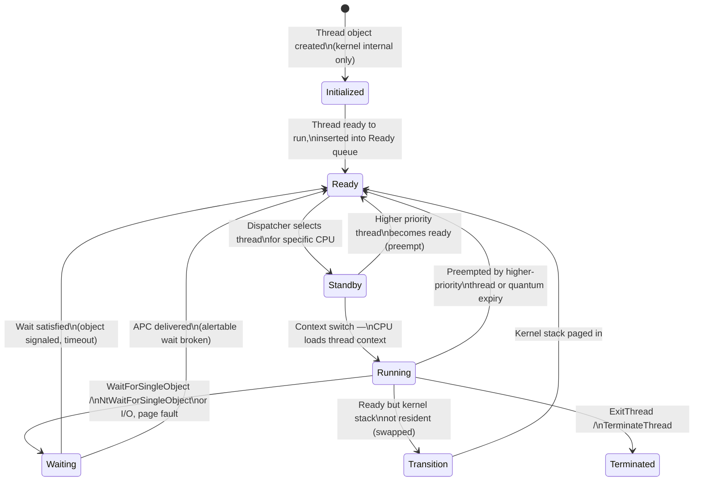
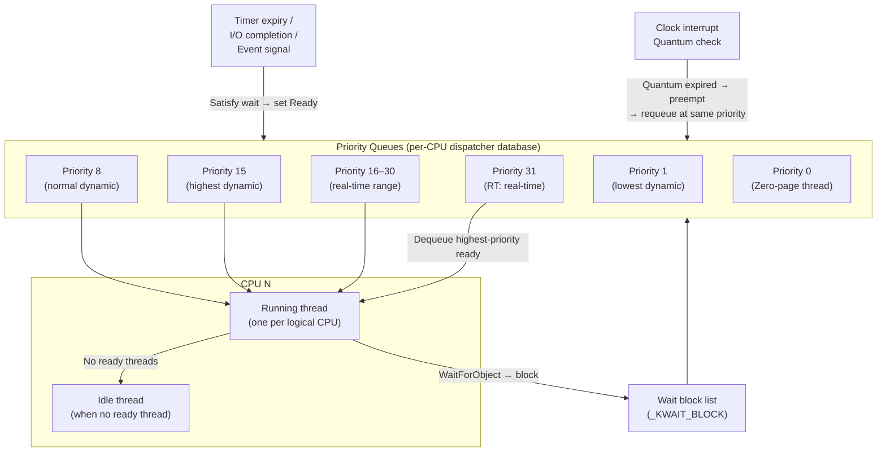
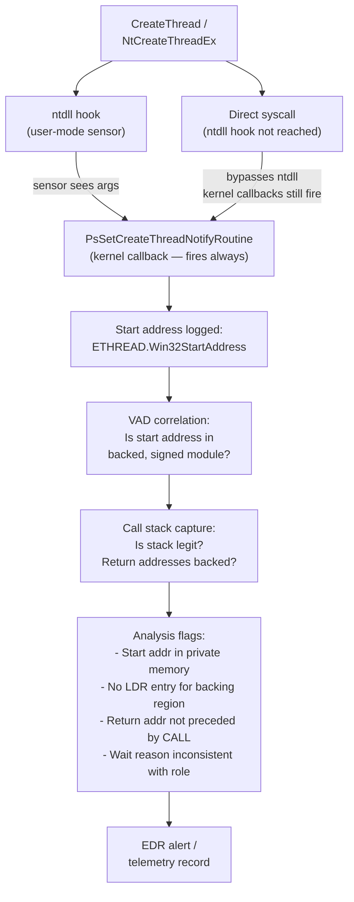
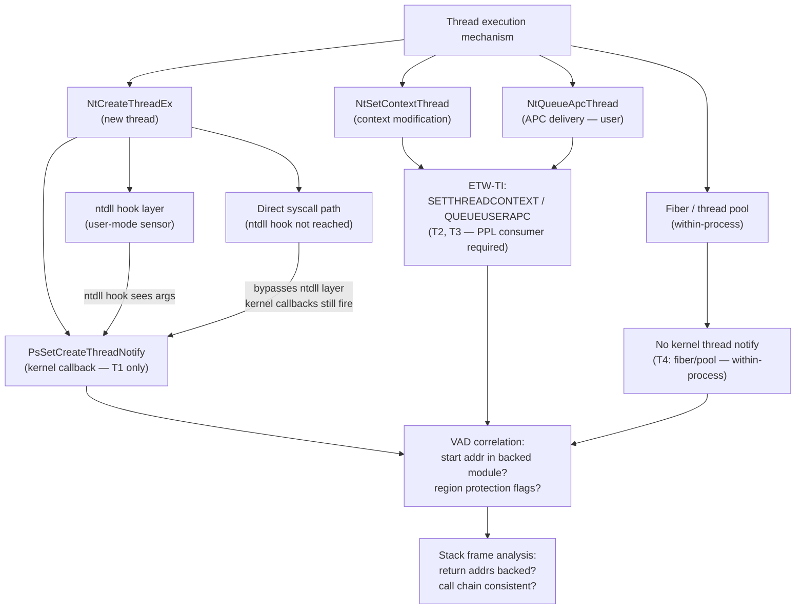

# Chương 4 — Threads

> **Researcher note:** CPU không schedule process — CPU schedule **thread**. Mọi thứ về execution: instruction pointer, register state, stack, wait state, priority đều thuộc về thread, không phải process. Hiểu thread internals là điều kiện tiên quyết để phân tích APC delivery model, context modification detection, call stack integrity verification, context switch timing, và toàn bộ vùng telemetry visibility gaps trong execution flow.

> **Public repo wording note:** Chương này dùng thuật ngữ adversarial-aware — mô tả cơ chế Windows từ góc nhìn detection engineering, reverse engineering, memory forensics, và EDR architecture. Mục đích là giúp researcher hiểu *tại sao* các mechanism này tồn tại, *telemetry nào* capture được, và *giới hạn nào* cần lưu ý — không phải cung cấp playbook tấn công.

---

## 0. Chapter Map

| Mục | Nội dung | Tại sao quan trọng |
|-----|----------|--------------------|
| 0 | Chapter Map | Điều hướng |
| 1 | Researcher Mindset | Đặt khung tư duy bảo mật |
| 2 | Big Picture | 4 sơ đồ: state machine, scheduler, wait flow, telemetry |
| 3 | Key Terms | Từ điển thuật ngữ |
| 4 | Core Internals | ETHREAD, KTHREAD, TEB, stacks, context, states, scheduler, priority, quantum |
| 5 | Important Components | Dispatcher objects, APC, thread pool, fibers |
| 6 | Trust Boundaries | 5 ranh giới bảo mật của thread |
| 7 | Attack Surface Map | Bảng 16 attack surface |
| 8 | Abuse Patterns | 7 kỹ thuật tấn công qua thread |
| 9 | EDR Telemetry | User-mode, kernel, Event Log / ETW, giới hạn |
| 10 | Forensic Artifacts | Memory forensics, stack forensics, wait reason |
| 11 | Debugging Notes | WinDbg, x64dbg, Process Explorer, stack walking |
| 12 | Labs | 6 bài thực hành |
| 13 | Researcher Mistakes | Bảng ≥12 sai lầm phổ biến |
| 14 | Version Notes | Thay đổi qua các phiên bản Windows |
| 15 | Summary | Tổng hợp |
| 16 | Research Questions | 12 câu hỏi mở |
| 17 | References | Tài liệu tham khảo |
| 18 | Illustration Plan | Kế hoạch vẽ diagram |

---

## 1. Researcher Mindset

**Thread là gì theo góc nhìn bảo mật?**

Thread là đơn vị thực thi thực sự. Mỗi thread có:

- **Register context riêng** — RIP (instruction pointer), RSP (stack pointer), RFLAGS, và toàn bộ general-purpose registers. Khi context switch xảy ra, context này được lưu vào `KTHREAD.TrapFrame` và `KTHREAD.KernelStack`.
- **Stack riêng** — user stack (trong address space của process) và kernel stack (trong nonpaged pool, không swap ra disk).
- **Trạng thái wait riêng** — thread có thể đang chờ event, mutex, semaphore, timer, I/O — và EDR/analyst có thể đọc wait reason này để hiểu thread đang làm gì.
- **APC queue riêng** — cơ chế kernel deliver execution vào thread cụ thể; dùng bởi I/O subsystem, loader, và nhiều Windows component. Analyst cần hiểu APC delivery model để interpret wait state và telemetry đúng.

**Ba câu hỏi cần đặt với mọi thread:**

1. **Start address của thread là gì?** — Trỏ vào module hợp lệ hay vào anonymous private memory (cần VAD correlation)?
2. **Call stack hiện tại trông như thế nào?** — Call chain có consistent với module backing của mỗi return address không?
3. **Thread đang ở trạng thái wait nào?** — WaitReason và wait object type tiết lộ thread đang block trên resource gì — hữu ích cho performance debugging và behavioral analysis.

**Tại sao start address quan trọng hơn process image?**

Một process với image `svchost.exe` hợp lệ vẫn có thể execute unauthorized code nếu một thread được tạo với start address trỏ vào private memory không có backing module. EDR correlation: start address có nằm trong vùng nhớ thuộc một DLL có chữ ký số không? Start address trỏ vào anonymous private memory với PAGE_EXECUTE là anomaly đáng điều tra — cần verify bằng VAD node type, protection flags, và module list.

**Tại sao call stack quan trọng?**

Call stack là fingerprint của execution path. Một số kỹ thuật thực thi ẩn call chain thật bằng **call stack manipulation** — return addresses bị overwrite để stack trông giống legitimate code. Detection cần kết hợp VAD correlation: mỗi return address có thuộc vùng nhớ backed bởi signed module không? Và return address đó có được preceded bởi instruction CALL hợp lệ không?

---

## 2. Big Picture

### 2.1 Thread state machine



> **Researcher note:** **Transition** state là trạng thái ít biết đến nhất — thread sẵn sàng chạy nhưng kernel stack của nó đang bị paged out. Trên system với ít RAM, threads chuyển qua Transition thường xuyên hơn. Forensics: thread trong Transition state có nghĩa kernel stack hiện không readable trong memory dump.

### 2.2 Scheduler mental model



**Key scheduler rules:**

- Windows dùng **preemptive priority-based** scheduler — thread priority cao hơn luôn được run trước.
- Priority 16–31 là **real-time** — không bị boost tự động, không bị quantum-based priority decay.
- Priority 0–15 là **dynamic** — kernel có thể boost/decay priority tự động (foreground boost, I/O completion boost).
- Mỗi logical CPU có dispatcher database riêng — scheduler quyết định thread chạy trên CPU nào.

### 2.3 Wait và dispatcher object flow

```mermaid
flowchart LR
    THREAD["Waiting thread\n(_KTHREAD)"]

    subgraph WB["_KWAIT_BLOCK (per wait)"]
        WBN["WaitType: WaitAny / WaitAll"]
        WBOBJ["Object: pointer to\ndispatcher object"]
        WBTHREAD["Thread: back-pointer"]
    end

    subgraph DISPOBJ["Dispatcher Object\n(_DISPATCHER_HEADER)"]
        TYPE["Type: EventNotification /\nEventSynchronization /\nMutant / Semaphore / Timer /\nProcess / Thread"]
        SIG["SignalState: 0=nonsignaled\n1+=signaled"]
        WL["WaitListHead:\nList of waiting _KWAIT_BLOCK"]
    end

    SIGNAL["Signal source:\nSetEvent / ReleaseMutex /\nI/O completion / Timer /\nProcess exit / Thread exit"]

    THREAD -->|"KiWaitForSingleObject\nLink KWAIT_BLOCK"| WB
    WB --> DISPOBJ
    SIGNAL -->|"KeSetEvent / KeReleaseMutex\n→ scan WaitListHead\n→ wake waiters"| DISPOBJ
    DISPOBJ -->|"Wake matching threads\n→ set Ready state"| THREAD
```



### 2.4 Thread telemetry flow



---

## 3. Key Terms

| Thuật ngữ | Định nghĩa ngắn | Relevance cho researcher |
|-----------|-----------------|--------------------------|
| **Thread** | Đơn vị execution được schedule bởi kernel | CPU chạy thread, không phải process |
| **ETHREAD** | Executive Thread Object — kernel struct chứa toàn bộ metadata của thread | Source of truth trong memory forensics |
| **KTHREAD** | Kernel Thread — scheduler portion của ETHREAD (offset 0) | Priority, state, wait blocks, kernel stack pointer |
| **TEB** | Thread Environment Block — user-mode struct per thread | Stack base/limit, TLS slots, SEH frame chain |
| **User stack** | Stack trong address space của process | RBP/RSP point here in user mode |
| **Kernel stack** | Stack trong nonpaged pool (kernel space) | Không swap ra disk; chứa trap frame khi syscall |
| **Thread context** | Snapshot của CPU register state tại một thời điểm | GetThreadContext / SetThreadContext |
| **Trap frame** | Kernel-side record của user-mode register state khi syscall/interrupt | Đọc bằng WinDbg: `.frame`, `!thread` |
| **Thread state** | Initialized/Ready/Standby/Running/Waiting/Transition/Terminated | Wait state analysis |
| **Priority** | Số 0–31 xác định thứ tự schedule | Real-time (16–31) vs dynamic (0–15) |
| **Quantum** | Thời gian tối đa thread chạy liên tục trước khi bị preempt | Client vs Server Windows khác nhau |
| **Context switch** | Kernel lưu context cũ, load context mới → CPU tiếp tục với thread khác | Overhead measurement |
| **Wait block** | _KWAIT_BLOCK — link giữa waiting thread và dispatcher object | Memory forensics: trace wait chain |
| **Dispatcher object** | Kernel synchronization primitive có thể được waited on | Event, Mutex, Semaphore, Timer, Process, Thread |
| **Event** | Dispatcher object: Notification (manual-reset) hoặc Synchronization (auto-reset) | SetEvent / WaitForSingleObject |
| **Mutex / Mutant** | Dispatcher object: ownership-based, recursive, abandoned detection | Ownership tracking |
| **Semaphore** | Dispatcher object: count-based, no ownership | Producer-consumer |
| **Critical Section** | User-mode spin-then-wait lock (wraps kernel mutex) | Faster than kernel mutex, non-waitable |
| **SRW Lock** | Slim Reader/Writer lock — user-mode, ultra-lightweight | No kernel object, không waitable externally |
| **APC** | Asynchronous Procedure Call — kernel-queued execution delivered vào thread cụ thể | Windows execution scheduling mechanism; dùng bởi I/O subsystem, loader, COM/RPC; alertable wait delivery model |
| **Alertable wait** | Wait function với bAlertable=TRUE — cho phép user APC deliver khi waiting | Standard delivery condition cho user-mode APC; sensor phải biết alertable state để interpret APC telemetry đúng |
| **Thread pool** | Managed pool of threads phục vụ work items, I/O callbacks, timers | Thread pool dispatch indirection — worker start address không phản ánh callback thật; cần stack walk |
| **Fiber** | User-mode cooperative execution unit — không được schedule bởi OS kernel | Không tạo kernel thread; observability limited từ kernel; dùng bởi game engine, SQL Server, coroutine frameworks |
| **Win32StartAddress** | ETHREAD field: user-mode start address của thread như được set bởi caller | Key field cho module correlation và memory-region analysis; cần VAD cross-reference để interpret |
| **Wait reason** | Enum: WrExecutive, WrFreePage, WrEventPair, WrAlertByThreadId... | Debug/forensic clue về thread behavior |

---

## 4. Core Internals

### 4.1 Process vs thread — phân chia trách nhiệm

| Thuộc tính | Thuộc Process | Thuộc Thread |
|-----------|---------------|-------------|
| Address space | ✓ | — |
| Handle table | ✓ | — |
| Access token (primary) | ✓ | — (thread có thể có impersonation token) |
| PEB | ✓ | — |
| Loaded DLLs | ✓ (PEB.Ldr) | — |
| EPROCESS | ✓ | — |
| CPU registers | — | ✓ |
| Instruction pointer (RIP) | — | ✓ |
| Stack (user + kernel) | — | ✓ |
| Thread priority | — | ✓ |
| Wait state | — | ✓ |
| APC queue | — | ✓ |
| TEB | — | ✓ |
| ETHREAD | — | ✓ |

**Implication cho detection và analysis:** Bất kỳ execution nào trong process cũng cần **một thread** để chạy. Không có thread → không có execution. Đây là lý do tại sao thread-level telemetry (start address, stack, wait state, APC queue) là nguồn thông tin quan trọng: mọi unauthorized code execution đều phải manifest qua một thread — hoặc là thread mới, hoặc là existing thread bị redirect, hoặc là APC delivery vào existing thread.

### 4.2 ETHREAD — executive thread object

> Research caveat:
> ETHREAD/KTHREAD fields, offsets, wait reasons, and Win32StartAddress interpretation are build-, symbol-, and configuration-dependent. Treat them as a research model, then verify on the target build with public symbols, WinDbg, Microsoft documentation, and controlled lab observations.

`_ETHREAD` là kernel object quản lý mọi metadata của thread. KTHREAD nằm ở offset 0 (inline, không phải pointer).

**Fields quan trọng (tóm tắt, offset thay đổi theo version):**

```c
struct _ETHREAD {
    _KTHREAD Tcb;                       // offset 0x000 — scheduler data (KTHREAD)

    // Timing
    LARGE_INTEGER CreateTime;           // Thread creation time
    LARGE_INTEGER ExitTime;

    // Identity
    CLIENT_ID Cid;                      // {UniqueProcess (PID), UniqueThread (TID)}

    // Exit
    LONG ExitStatus;

    // Addresses
    PVOID StartAddress;                 // Kernel start address (e.g., RtlUserThreadStart)
    PVOID Win32StartAddress;            // User-mode start address — EDR focus point

    // Process back-link
    _EPROCESS *ThreadsProcess;          // owning process

    // Impersonation token
    _PS_IMPERSONATION_INFORMATION *ImpersonationInfo;

    // Cross-thread flags
    ULONG CrossThreadFlags;             // includes Terminated, HideFromDebugger, etc.

    // APC state
    // (inside KTHREAD)
};
```

**Win32StartAddress là trường quan trọng nhất cho EDR:**

- Thread tạo bởi `CreateThread` → `Win32StartAddress` = user-supplied `lpStartAddress`
- Thread tạo với start address trong anonymous private memory (cross-process) → `Win32StartAddress` trỏ vào region không có backing module — cần VAD correlation
- Thread tạo bởi thread pool → `Win32StartAddress` = thường là `ntdll!TppWorkerThread`
- Thread tạo bởi RPC → `Win32StartAddress` thường là `ntdll!TppWorkerThread` hoặc `RPCRT4!...`

**CrossThreadFlags (bitmask):**

| Bit | Flag | Ý nghĩa |
|-----|------|---------|
| 0 | Terminated | Thread đã terminate |
| 1 | DeadThread | Thread đang chờ reap |
| 2 | HideFromDebugger | Ẩn thread khỏi debugger — anti-debug trick |
| 3 | ActiveImpersonationInfo | Thread đang impersonate |
| 4 | RanProcess | Thread đã chạy xong |

**WinDbg:**

```windbg
!thread <ethread_addr>                ; dump full thread info
dt nt!_ETHREAD <addr>
dt nt!_ETHREAD <addr> Win32StartAddress
dt nt!_ETHREAD <addr> Cid             ; PID + TID
dt nt!_ETHREAD <addr> CrossThreadFlags
```

### 4.3 KTHREAD — kernel thread (scheduler portion)

`_KTHREAD` chứa tất cả data mà kernel scheduler cần. Nằm ở offset 0 của ETHREAD.

**Fields quan trọng:**

```c
struct _KTHREAD {
    _DISPATCHER_HEADER Header;  // offset 0x000 — thread là dispatcher object (waitable)
    PVOID SListFaultAddress;
    ULONG64 QuantumTarget;

    PVOID InitialStack;         // Top of kernel stack
    PVOID StackLimit;           // Bottom of kernel stack (guard page below)
    PVOID StackBase;
    PVOID KernelStack;          // Current kernel RSP

    // Scheduling
    UCHAR State;                // Thread state: 0=Init, 1=Ready, 2=Running, 3=Standby,
                                //               4=Terminated, 5=Waiting, 6=Transition, 7=DeferredReady
    SCHAR Priority;             // Current priority (0-31)
    SCHAR BasePriority;         // Base priority
    UCHAR PriorityDecrement;    // Dynamic decay amount

    // Wait
    UCHAR WaitMode;             // KernelMode / UserMode
    UCHAR Alertable;            // TRUE if alertable wait
    UCHAR WaitReason;           // Why thread is waiting
    ULONG WaitTime;             // Ticks in current wait

    // APC
    _KAPC_STATE ApcState;       // Normal, attached, saved APC state
    BOOLEAN ApcQueueable;
    BOOLEAN KernelApcPending;

    // CPU affinity
    ULONG64 Affinity;           // CPU mask

    // Context switch counter
    ULONG ContextSwitches;

    // Trap frame (saved from last kernel entry)
    _KTRAP_FRAME *TrapFrame;

    // TEB pointer (user-mode)
    _NT_TIB *Teb;               // points to TEB (in user address space)
};
```

**WinDbg:**

```windbg
dt nt!_KTHREAD <addr>
dt nt!_KTHREAD <addr> State
dt nt!_KTHREAD <addr> WaitReason
dt nt!_KTHREAD <addr> Priority
dt nt!_KTHREAD <addr> ContextSwitches
dt nt!_KTHREAD <addr> ApcState
```

### 4.4 TEB — Thread Environment Block

Mỗi thread có một TEB trong user-mode address space của process. Pointer đến TEB được truy cập qua:
- x64: `GS` segment register (`GS:[0]` = TEB, hoặc `GS:[0x30]` = self-pointer)
- x86: `FS` segment register (`FS:[0]` = TEB, `FS:[0x18]` = self-pointer)

**Fields quan trọng:**

```c
struct _TEB {
    _NT_TIB NtTib;              // offset 0x000
        // NtTib.ExceptionList  — SEH frame chain (x86 only)
        // NtTib.StackBase      — top of user stack
        // NtTib.StackLimit     — current guard page boundary
        // NtTib.Self           — pointer to TEB itself (= GS:[0x30])

    PVOID EnvironmentPointer;
    CLIENT_ID ClientId;         // offset 0x040 — {PID, TID}
    HANDLE ActiveRpcHandle;
    PVOID ThreadLocalStoragePointer;  // TLS array
    PPEB ProcessEnvironmentBlock;     // offset 0x060 — pointer to PEB

    ULONG LastErrorValue;       // GetLastError() reads here
    ULONG CountOfOwnedCriticalSections;

    // GDI / Win32 subsystem
    PVOID Win32ThreadInfo;      // NULL if not GUI thread

    // ...
    ULONG HardErrorMode;
    PVOID InstrumentationCallbackSp;  // ETW / CFG instrumentation
    PVOID InstrumentationCallbackPreviousPc;
    PVOID InstrumentationCallbackPreviousSp;

    // WoW64
    PVOID WowTebOffset;         // For 32-bit threads in 64-bit process

    // Activation context stack (side-by-side)
    _ACTIVATION_CONTEXT_STACK *ActivationContextStackPointer;
};
```

**Anti-debug relevance:** `NtTib.ExceptionList` (x86) là head của SEH frame chain. Debugger presence affects SEH behavior. x64 dùng table-based exception handling — không có linked list trong TEB.

**WinDbg:**

```windbg
!teb                            ; dump TEB của thread hiện tại
dt ntdll!_TEB @$teb
dt ntdll!_TEB @$teb NtTib
dt ntdll!_TEB @$teb ClientId   ; {PID, TID}
```

### 4.5 User stack và kernel stack

**User stack:**

- Nằm trong address space của process (user-mode virtual memory)
- Base address trong `TEB.NtTib.StackBase`, limit trong `TEB.NtTib.StackLimit`
- Default size: 1 MB reserved, 4 KB initial commit + guard page
- Grow downward: RSP giảm khi push/call
- **Guard page** ở bottom — khi thread touch guard page, kernel mở rộng stack tự động (stack growth)

**Kernel stack:**

- Nằm trong nonpaged pool (kernel virtual address, không swap)
- Default size: 12 KB (x86) hoặc 24 KB (x64) — rất nhỏ
- Mỗi thread có kernel stack riêng — switch vào kernel mode không dùng user stack
- `KTHREAD.InitialStack` / `KernelStack` / `StackLimit` trỏ đến kernel stack range
- **Stack overflow trong kernel** → immediate BSOD (KERNEL_STACK_OVERFLOW)

**Transition từ user → kernel stack:**

```
User-mode code calls syscall (SYSCALL instruction)
→ CPU loads RSP từ TSS.RSP0 (= top of kernel stack)
→ CPU saves user RSP, RIP, RFLAGS vào kernel stack
→ KiSystemCall64 saves toàn bộ registers → _KTRAP_FRAME
→ Syscall handler runs on kernel stack
→ SYSRET restores user RSP, RIP, RFLAGS → back to user stack
```

**Stack forensics:** Khi walk call stack của thread trong WinDbg, user portion dùng user-mode symbols (`lm u`), kernel portion dùng kernel symbols. Breakpoint trên kernel stack khi tracing syscall argument flow.

### 4.6 Thread context

**Thread context** (`_CONTEXT`) là snapshot CPU register state: RIP, RSP, RBP, RAX–R15, RFLAGS, segment registers, floating point state, debug registers.

```c
// Key fields trong _CONTEXT (x64)
typedef struct _CONTEXT {
    DWORD64 P1Home, P2Home, P3Home, P4Home, P5Home, P6Home;
    DWORD ContextFlags;         // CONTEXT_CONTROL | CONTEXT_INTEGER | CONTEXT_FLOATING_POINT

    // Segment + control registers
    DWORD SegCs, SegDs, SegEs, SegFs, SegGs, SegSs;
    DWORD EFlags;               // RFLAGS
    DWORD64 Dr0, Dr1, Dr2, Dr3, Dr6, Dr7;   // Debug registers

    // Integer registers
    DWORD64 Rax, Rcx, Rdx, Rbx;
    DWORD64 Rsp, Rbp, Rsi, Rdi;
    DWORD64 R8, R9, R10, R11, R12, R13, R14, R15;

    // Program counter
    DWORD64 Rip;                // Instruction pointer

    // Floating point / SSE state
    _M128A Xmm0–Xmm15;
    // ...
} CONTEXT;
```

**GetThreadContext / SetThreadContext (Win32 API):**

`GetThreadContext` capture snapshot của toàn bộ register state (RIP, RSP, general registers, debug registers). Thread phải ở suspended state trước khi gọi — nếu không, kết quả không reliable.

```c
HANDLE hThread = OpenThread(THREAD_GET_CONTEXT | THREAD_SUSPEND_RESUME, FALSE, tid);
SuspendThread(hThread);

CONTEXT ctx = { .ContextFlags = CONTEXT_FULL };
GetThreadContext(hThread, &ctx);
// ctx.Rip = current instruction pointer
// ctx.Rsp = current stack pointer
// Toàn bộ register state tại thời điểm suspension
ResumeThread(hThread);
```

`SetThreadContext` ngược lại — replace register state của suspended thread. Đây là API hợp lệ dùng bởi debuggers, profilers, và exception handlers. Yêu cầu `THREAD_SET_CONTEXT` access mask.

**Detection relevance:** Cross-process sequence `NtSuspendThread` → `NtGetContextThread` → `NtSetContextThread` → `NtResumeThread` trên thread handle không phải của process mình là pattern được EDR và ETW-TI ghi nhận. Sysmon EventID 10 capture cross-process thread handle access với access mask này.

> **Researcher note:** Debug registers trong CONTEXT (`Dr0–Dr3`, `Dr6`, `Dr7`) là hardware breakpoints. Một số anti-analysis technique kiểm tra debug registers để detect debugger presence — điều này không reliable vì hardware breakpoints có thể được set bởi nhiều tool, không chỉ debuggers.

### 4.7 Thread states và wait reason

**8 thread states:**

| State | Giá trị | Mô tả |
|-------|---------|-------|
| Initialized | 0 | Vừa được allocate, chưa ready |
| Ready | 1 | Có thể run, đang trong ready queue |
| Running | 2 | Đang execute trên CPU |
| Standby | 3 | Được chọn cho CPU cụ thể, chờ context switch |
| Terminated | 4 | Đã exit, chờ reap |
| Waiting | 5 | Đang chờ dispatcher object hoặc sleep |
| Transition | 6 | Ready nhưng kernel stack paged out |
| DeferredReady | 7 | Sẵn sàng nhưng chưa được inserted vào ready queue (per-CPU deferred) |

**Wait reasons quan trọng (WrXxx enum):**

| WaitReason | Giá trị | Ý nghĩa thực tế |
|-----------|---------|-----------------|
| Executive | 0 | Chờ bởi kernel executive (I/O, IRP completion) |
| FreePage | 1 | Đang chờ free memory page |
| PageIn | 2 | Đang chờ page fault resolve (paging in) |
| PoolAllocation | 3 | Chờ pool memory |
| DelayExecution | 4 | Sleep (NtDelayExecution / Sleep) |
| Suspended | 5 | Bị suspend bởi SuspendThread |
| UserRequest | 6 | WaitForSingleObject / WaitForMultipleObjects |
| WrExecutive | 7 | Kernel-mode executive wait |
| WrQueue | 0xF | Thread pool — thread đang chờ work item |
| WrAlertByThreadId | 0x1A | NtAlertThreadByThreadId (fast usermode wait) |
| WrCalloutStack | 0x1B | Callout |

**Forensic relevance:**

- Threads với `WaitReason = WrQueue` → thread pool workers đang idle, chờ work item
- Threads với `WaitReason = DelayExecution` → sleeping; correlate với sleep interval và network activity để profile behavior
- Threads với `WaitReason = UserRequest` → waiting on explicit kernel object (mutex, event, semaphore); kiểm tra object type và wait duration
- Threads với `WaitReason = Suspended` → bị suspend externally; extended suspension đáng điều tra thêm — kiểm tra ai suspend và tại sao

### 4.8 Scheduler — priority và quantum

**Priority system:**

- **0–15**: Dynamic range. Kernel tự động boost/decay:
  - I/O completion boost: thread nhận I/O được boost tạm thời
  - Foreground boost: thread của foreground window được boost
  - Starvation prevention: thread ở low priority quá lâu được boost lên 15 tạm thời
- **16–31**: Real-time range. Không boost, không decay. Chỉ process có `REALTIME_PRIORITY_CLASS` mới set được.
- **Priority 0**: Chỉ Zero-page thread (zero out free pages khi idle).

**Quantum:**

Quantum là số lượng **clock ticks** thread được chạy trước khi scheduler cân nhắc preempt. Không phải thời gian thực — clock tick interval phụ thuộc hardware timer resolution (thường 15.6ms trên desktop).

| Cấu hình | Quantum | Thực tế |
|----------|---------|---------|
| Client Windows (short) | 2 ticks | ~31ms per quantum unit |
| Server Windows (long) | 12 ticks | ~180ms — giảm context switch overhead |

**Priority Boost registry:**

```
HKLM\SYSTEM\CurrentControlSet\Control\PriorityControl
  Win32PrioritySeparation = 2  (default on client)
  ; Bits [0:1] = quantum length (short=1, long=2)
  ; Bits [2:3] = quantum variability
  ; Bits [4:5] = foreground boost magnitude
```

**Context switch cost:**

Context switch không miễn phí: save toàn bộ registers + load new registers + TLB flush (nếu khác process). Trên modern CPU: ~1–5 µs per switch. System với nhiều sleeping threads wake/sleep thường xuyên → context switch overhead đáng kể (dùng `xperf` / WPA để measure).

---

## 5. Important Windows Components / Structures

### 5.1 Dispatcher objects — synchronization primitives

Tất cả dispatcher objects đều embed `_DISPATCHER_HEADER` ở offset 0, cho phép thread wait trên bất kỳ loại nào.

```c
struct _DISPATCHER_HEADER {
    union {
        ULONG Lock;
        struct {
            UCHAR Type;         // event, mutex, semaphore, timer, thread, process...
            UCHAR Signalling;
            UCHAR Size;
            UCHAR Reserved;
        };
    };
    LONG SignalState;           // 0 = nonsignaled, >= 1 = signaled
    LIST_ENTRY WaitListHead;    // list of _KWAIT_BLOCK for waiting threads
};
```

**Event — hai loại:**

| Loại | Type field | Behavior |
|------|-----------|---------|
| Notification Event (manual-reset) | 0 | Khi set, TẤT CẢ waiters được wake. Phải reset thủ công. |
| Synchronization Event (auto-reset) | 1 | Khi signaled, CHỈ MỘT waiter được wake, sau đó tự reset về nonsignaled. |

```c
HANDLE hEvent = CreateEvent(NULL, TRUE, FALSE, NULL);   // manual-reset
HANDLE hEvent = CreateEvent(NULL, FALSE, FALSE, NULL);  // auto-reset (synchronization)
SetEvent(hEvent);        // signal
ResetEvent(hEvent);      // reset (manual-reset only)
PulseEvent(hEvent);      // signal then immediate reset (DEPRECATED — racy)
```

**Mutex (Mutant trong kernel):**

- Ownership-based: thread giữ mutex phải release (không thể release từ thread khác)
- **Recursive**: cùng một thread có thể acquire nhiều lần (phải release cùng số lần)
- **Abandoned detection**: nếu thread giữ mutex exit mà không release, mutex trở thành "abandoned" — waiter nhận `WAIT_ABANDONED` (0x80 + offset) thay vì `WAIT_OBJECT_0`

```c
HANDLE hMutex = CreateMutex(NULL, FALSE, NULL);
WaitForSingleObject(hMutex, INFINITE);   // acquire
ReleaseMutex(hMutex);                    // release
```

**Semaphore:**

- Count-based: không có ownership — bất kỳ thread nào cũng có thể release
- `ReleaseCount` tăng `SignalState`; wait giảm `SignalState`
- Dùng cho producer-consumer, resource pools

**Timer (`_KTIMER`):**

- Waitable timer — thread có thể wait trên timer object
- Fired bởi `KeSetTimer` / `SetWaitableTimer`
- Hai loại: manual-reset timer và synchronization timer

**Process và Thread object là dispatcher objects:**

- `WaitForSingleObject(hProcess, INFINITE)` — wait cho process exit → process object trở thành signaled khi terminate
- `WaitForSingleObject(hThread, INFINITE)` — tương tự cho thread

### 5.2 Critical Section và SRW Lock

**Critical Section (`_RTL_CRITICAL_SECTION`):**

- **User-mode only** — không phải kernel object, không thể WaitForSingleObject
- Spin trước khi wait: `SpinCount` lần spin check trước khi gọi kernel
- Fallback: tạo kernel event (mutex) chỉ khi thực sự cần block
- **Owned**: thread giữ CS được ghi vào `OwningThread` — có thể deadlock detect
- **Recursive**: cùng thread có thể Enter nhiều lần (`RecursionCount`)

```c
CRITICAL_SECTION cs;
InitializeCriticalSectionAndSpinCount(&cs, 4000);  // spin 4000 times before blocking
EnterCriticalSection(&cs);
// ... critical work ...
LeaveCriticalSection(&cs);
DeleteCriticalSection(&cs);
```

**Deadlock detect:** WinDbg `!locks` hiển thị tất cả critical sections trong process và thread đang giữ/đang chờ.

**SRW Lock (`SRWLOCK`):**

- Slim Reader/Writer — siêu lightweight, chỉ là một `PVOID` (8 bytes)
- **Không có kernel object** — purely user-mode, không waitable externally
- Shared mode: nhiều readers đồng thời
- Exclusive mode: một writer, chặn tất cả readers/writers

```c
SRWLOCK srw = SRWLOCK_INIT;

// Reader:
AcquireSRWLockShared(&srw);
// ... read ...
ReleaseSRWLockShared(&srw);

// Writer:
AcquireSRWLockExclusive(&srw);
// ... write ...
ReleaseSRWLockExclusive(&srw);
```

> **Researcher note:** SRW lock không thể detect deadlock vì không track owner. Forensically invisible — không có kernel object để dump. Nếu process hangs trong SRW wait → stack walk là cách duy nhất để diagnose.

### 5.3 APC — Asynchronous Procedure Calls

APC là cơ chế Windows để queue một hàm để execute trong context của một thread cụ thể. Được sử dụng rộng rãi bởi kernel I/O subsystem, loader, COM infrastructure, và nhiều Windows component — không phải cơ chế đặc thù của một loại code cụ thể. Hiểu APC delivery model giúp analyst interpret wait state, telemetry events, và execution flow chính xác hơn.

**Hai loại APC:**

| Loại | Queue | Delivery condition |
|------|-------|-------------------|
| Kernel APC (`KAPC`) | `KTHREAD.ApcState.ApcListHead[KernelMode]` | Delivered khi thread về user mode hoặc tại PASSIVE_LEVEL (preemptable) |
| User APC | `KTHREAD.ApcState.ApcListHead[UserMode]` | Chỉ delivered khi thread ở **alertable wait** |

**Alertable wait:** Thread phải call wait function với `bAlertable = TRUE`:

```c
WaitForSingleObjectEx(hObject, INFINITE, TRUE);   // alertable
SleepEx(0, TRUE);                                  // alertable sleep
WaitForMultipleObjectsEx(..., TRUE);               // alertable
```

**User-mode APC qua `QueueUserAPC` / `NtQueueApcThread`:**

`QueueUserAPC` wrap `NtQueueApcThread` — queue một user-mode APC vào thread với `THREAD_SET_CONTEXT` access. APC chỉ được deliver khi target thread ở **alertable wait** (xem bên dưới).

```c
// API signature — standard user APC
DWORD QueueUserAPC(PAPCFUNC pfnAPC, HANDLE hThread, ULONG_PTR dwData);
// Cần: THREAD_SET_CONTEXT trên hThread
// APC routine sẽ execute trong context của hThread khi thread alertable
```

**Kernel APC — special kernel APC:**

Kernel APC (`KAPC`) không cần alertable wait — được deliver tại IRQL APC_LEVEL khi thread chuyển về user mode. Đây là cơ chế dùng bởi I/O subsystem để complete I/O operations trong thread context: khi I/O complete, kernel queue KAPC vào thread đã issue I/O, APC deliver kết quả khi thread về user mode hoặc khi IRQL thấp đủ.

```c
// Kernel-mode only: KeInitializeApc + KeInsertQueueApc
// Special kernel APC: không cần alertable, delivered tại IRQL APC_LEVEL
// Dùng bởi I/O subsystem, DPC completion, và kernel components khác
```

**Early-execution APC timing pattern:**

Một pattern quan trọng cần hiểu cho forensics: khi một process được tạo với `CREATE_SUSPENDED`, initial thread suspended trước khi loader chạy. Nếu APC được queue vào suspended thread rồi thread được resume, APC có thể fire sớm trong `LdrInitializeThunk` — trước khi entry point thực thi.

**Telemetry implication:** Pattern này (process tạo với SUSPENDED + APC queue + resume) được ghi nhận bởi `PsSetCreateProcessNotifyRoutineEx` tại thời điểm tạo process, và `PsSetCreateThreadNotifyRoutine` khi thread được create. ETW-TI `QUEUEUSERAPC` event capture APC queue operation. EDR correlate các events này để identify execution timing anomalies.

**NtQueueApcThread vs NtQueueApcThreadEx — APC delivery model differences:**

```
NtQueueApcThread    — standard user APC: deliver khi thread ở alertable wait
NtQueueApcThreadEx  — extended: có thể specify APC queue type (Win10+)
                       QueueSpecialUserApc — APC delivery không yêu cầu alertable state (Win10 2004+)
```

**`QueueSpecialUserApc` (Win10 2004+):** Thay đổi delivery model — APC có thể fire khi thread ở user mode mà không cần alertable wait. Điều này có nghĩa sensors phải account for APC delivery không phụ thuộc vào alertable state, khác với standard user APC model. ETW-TI `QUEUEUSERAPC` vẫn fire, nhưng correlation logic cần phân biệt hai delivery model.

### 5.4 Thread pool

Windows Thread Pool (`TP_POOL`) là managed pool of threads, tối ưu cho I/O-heavy workloads.

**Thành phần:**

| Object | API | Mô tả |
|--------|-----|-------|
| `TP_POOL` | `CreateThreadpool` | Pool object |
| `TP_WORK` | `CreateThreadpoolWork` | Work item (callback + context) |
| `TP_TIMER` | `CreateThreadpoolTimer` | Timer-based callback |
| `TP_IO` | `CreateThreadpoolIo` | I/O completion callback |
| `TP_CALLBACK_ENVIRON` | `InitializeThreadpoolEnvironment` | Env: pool, cleanup group, priority |

**Thread pool dispatch indirection — tại sao start address không đủ:**

Worker thread start address luôn là `ntdll!TppWorkerThread` bất kể callback làm gì. Đây là **dispatch indirection**: pool dispatch worker → worker gọi callback. Start address chỉ phản ánh pool machinery, không phản ánh workload thực sự.

```
Win32StartAddress của mọi pool worker = ntdll!TppWorkerThread

Khi callback đang execute, call stack có dạng:
  [actual callback]         ← thực sự đang chạy gì
  TppWorkpExecuteCallback
  TppWorkerThread           ← Win32StartAddress (EDR thấy ở đây)
  BaseThreadInitThunk
  RtlUserThreadStart
```

**Implication cho telemetry:** EDR nhận `PsSetCreateThreadNotifyRoutine` event với `Win32StartAddress = TppWorkerThread` — không có thông tin về callback. Để biết callback là gì, cần: (1) stack capture tại runtime, hoặc (2) `TP_WORK` object inspection. Legitimate pool usage (COM servers, RPC handlers, async I/O) đều trông giống nhau từ góc nhìn start address.

**Reverse engineering approach:** Khi phân tích process dùng nhiều pool workers, attach debugger hoặc dùng ETW stack sampling để capture call stack khi callback đang active — đây là cách duy nhất để attribute callback address với certainty.

### 5.5 Fibers

Fiber là **cooperative user-mode execution unit** — không được schedule bởi OS kernel. Thread phải explicit switch sang fiber bằng `SwitchToFiber`. OS chỉ thấy thread — fiber là abstraction ở user-mode.

- Mỗi fiber có stack riêng (user-allocated, size configurable)
- OS scheduler không biết về fiber — chỉ thấy thread parent đang chạy
- Dùng bởi: game engine coroutines, SQL Server async infrastructure, cooperative multitasking frameworks

**Fiber execution model:**

```c
// Fiber API — cooperative user-mode scheduling
LPVOID fiber1 = CreateFiber(0, fiberCallback, context);
ConvertThreadToFiber(NULL);   // convert current thread → fiber (required before SwitchToFiber)
SwitchToFiber(fiber1);        // cooperative switch: current fiber suspends, fiber1 runs
// fiber1's stack và register state restored; thread Win32StartAddress không đổi
```

**Fiber execution và callback visibility limits:**

- Fiber creation không trigger kernel thread creation callback — `PsSetCreateThreadNotifyRoutine` không fire
- Thread `Win32StartAddress` không thay đổi khi switch to fiber — telemetry thấy original thread start address
- Fiber stack là user-allocated region — có VAD entry, nhưng không có backing module nếu stack là private memory
- `Fiber Local Storage (FLS)` có cleanup callbacks (FLS callback on fiber delete) — đây là một execution path có thể trigger code khi fiber is freed

**Observability từ kernel side:** Kernel không có visibility trực tiếp vào fiber execution — chỉ thấy thread. Stack walk khi fiber đang active sẽ reflect fiber's stack, không phải original thread stack. Đây là lý do tại sao fiber là execution model thú vị để phân tích: call stack snapshot phụ thuộc vào fiber context tại thời điểm capture.

---

## 6. Trust Boundaries

### 6.1 Thread identity và token boundary

Mỗi thread **thừa hưởng** primary token của process. Nhưng thread có thể được set **impersonation token** riêng — cho phép thread tạm thời chạy với identity khác.

**Enforcement:** Khi kernel thực hiện access check cho operation của thread (file access, registry, network), nó check:
1. Impersonation token của thread (nếu có)
2. Primary token của process (fallback)

**Security relevance:** Thread impersonation là cơ chế hợp lệ (e.g., RPC server impersonate client). Tuy nhiên, impersonation token với elevated privilege trên thread là signal quan trọng trong forensics — cần xác định token nguồn gốc và liệu việc impersonate có expected với role của process không.

### 6.2 Thread suspension boundary

`SuspendThread` / `NtSuspendThread` yêu cầu `THREAD_SUSPEND_RESUME` access mask trên thread handle.

**Detection relevance:** Cross-process sequence suspend → memory write → resume là pattern được ghi nhận bởi ETW-TI và ObRegisterCallbacks. `PROCESS_VM_WRITE` trên process handle kết hợp với `THREAD_SUSPEND_RESUME` trên thread handle của process đó là access mask combination quan trọng để monitor.

### 6.3 APC delivery boundary

User APC chỉ deliver vào thread của process có đủ access. Cần `THREAD_SET_CONTEXT` để `NtQueueApcThread`.

**Special APC (Win10 2004+):** `QueueSpecialUserApc` thay đổi delivery model — APC có thể fire mà không yêu cầu alertable wait. Sensor coverage phải account cho cả hai delivery models khi phân tích APC-related telemetry trên Win10 2004+.

**Kernel APC:** Chỉ kernel code (driver, kernel routine) có thể queue kernel APC qua `KeInsertQueueApc`. Không có user-mode API để queue kernel APC trực tiếp.

### 6.4 Context modification boundary

`SetThreadContext` (→ `NtSetContextThread`) yêu cầu:
- Thread handle với `THREAD_SET_CONTEXT`
- Thread phải suspended trước khi set context (undocumented requirement)

**Kernel enforcement:** Nếu thread không suspend, `NtSetContextThread` có thể fail hoặc produce undefined behavior. EDR theo dõi cross-process suspend + set context pattern.

### 6.5 Stack và kernel stack boundary

User stack: trong user address space, writable bởi thread owner.
Kernel stack: trong kernel address space — **hoàn toàn không accessible từ user mode**. Không có API để read kernel stack của thread khác từ user mode (ngoại trừ kernel driver hoặc live kernel debugger).

---

## 7. Attack Surface Map

| # | Execution / Security Surface | Mechanism | Required Access | Sensor Coverage |
|---|------------------------------|-----------|-----------------|-----------------|
| 1 | Remote thread creation | CreateRemoteThread / NtCreateThreadEx | PROCESS_CREATE_THREAD | PsSetCreateThreadNotify + Sysmon 8 |
| 2 | Cross-process thread context modification | NtSuspendThread + NtSetContextThread + NtResumeThread | THREAD_SUSPEND_RESUME + THREAD_SET_CONTEXT | ETW-TI SETTHREADCONTEXT + cross-process suspend pattern |
| 3 | User APC delivery (standard model) | NtQueueApcThread — delivery requires alertable wait | THREAD_SET_CONTEXT | ETW-TI QUEUEUSERAPC + ObRegisterCallbacks |
| 4 | User APC delivery (special model, Win10 2004+) | NtQueueApcThreadEx + QueueSpecialUserApc | THREAD_SET_CONTEXT | ETW-TI QUEUEUSERAPC — sensor must handle both delivery models |
| 5 | Early-execution APC timing pattern | APC queue before thread resume during process init | PROCESS_ALL_ACCESS (at create) | PsSetCreateProcessNotify + PsSetCreateThreadNotify |
| 6 | Thread pool dispatch indirection | SubmitThreadpoolWork — callback not reflected in start address | Within-process | Start address = TppWorkerThread; callback only visible via stack capture |
| 7 | Fiber execution (no kernel thread) | CreateFiber + SwitchToFiber | Within-process | No thread creation callback; VAD entry for fiber stack only |
| 8 | Call stack integrity manipulation | Return address overwrite on calling thread stack | Within-process | Stack frame backing check; CET shadow stack (hardware) |
| 9 | Kernel APC delivery (kernel driver) | KeInsertQueueApc from driver | Kernel (Ring 0) | Kernel driver load monitoring; HVCI enforcement |
| 10 | Thread handle duplication | DuplicateHandle on thread handle | PROCESS_DUP_HANDLE on holder | ObRegisterCallbacks |
| 11 | DKOM-based thread concealment | Unlink ETHREAD from process thread list | Kernel (Ring 0) | Pool tag scan (`Thre`); list walk vs pool scan discrepancy |
| 12 | Alertable state dependency | User APC delivery depends on alertable wait in target thread | None (scheduling condition) | Alertable wait state visible in KTHREAD.Alertable |
| 13 | HideFromDebugger thread flag | CrossThreadFlags bit 2 set via kernel | Kernel access | Kernel driver monitoring; manual ETHREAD inspection |
| 14 | Thread description metadata | SetThreadDescription (Win10 1607+) | Thread handle | Thread description in ETW / debugger — forensic artifact |
| 15 | ROP-based control flow manipulation | Corrupt stack return addresses | Within-process | CET hardware shadow stack mitigation; stack scan |
| 16 | SRW lock contention / deadlock | SRW exclusive lock hold without release | Within-process | No kernel object; stack walk only diagnostic path |

---

## 8. Abuse Patterns — Concept Level

> **Note:** Section này mô tả các Windows execution mechanism từ góc nhìn researcher: cách chúng hoạt động, tại sao chúng tạo ra telemetry gaps, và cách detection/forensics approach chúng. Không phải operational guide.

### 8.1 Remote thread creation — telemetry và detection model

Remote thread creation qua `CreateRemoteThread` / `NtCreateThreadEx` vào process khác tạo ra nhiều observable events nhất trong tất cả thread execution techniques — đây là lý do tại sao nó dễ detect nhất.

```c
// Cross-process thread creation — requires PROCESS_CREATE_THREAD access
HANDLE hThread = CreateRemoteThread(hProc, NULL, 0,
    (LPTHREAD_START_ROUTINE)startAddr, NULL, 0, NULL);
// Win32StartAddress của thread mới = startAddr như đã set bởi caller
```

**Detection chain:**
1. `PsSetCreateThreadNotifyRoutine` fires → EDR đọc `ETHREAD.Win32StartAddress`
2. EDR correlate start address với VAD: nếu không thuộc backed module → anomaly
3. Sysmon EventID 8: `StartModule = "-"` khi start address không map đến module
4. ObRegisterCallbacks: `PROCESS_CREATE_THREAD` access mask observable khi handle opened

**Key analysis question:** Start address trỏ vào memory region có backing file không? Protection flags của region là gì? VAD entry có `PrivateMemory = 1` không?

### 8.2 Cross-process thread context modification — sensor visibility

Context modification (suspend → get context → set context → resume) không tạo thread mới → `PsSetCreateThreadNotifyRoutine` không fire. Đây là telemetry gap quan trọng cần hiểu.

**Access requirements (để phân tích detection coverage):**
- `THREAD_SUSPEND_RESUME` — NtSuspendThread / NtResumeThread
- `THREAD_GET_CONTEXT` — NtGetContextThread
- `THREAD_SET_CONTEXT` — NtSetContextThread

**What sensors see:**
- ObRegisterCallbacks: cross-process thread handle open với các access mask trên
- ETW-TI `SETTHREADCONTEXT` event: fires khi NtSetContextThread called (PPL consumer required)
- ETW-TI cũng capture process handle open với `PROCESS_VM_WRITE` — correlation với thread suspend

**Forensic signature:** Thread với RIP đột ngột thay đổi giữa two consecutive stack captures (nếu có snapshot data) — hoặc thread bắt đầu execute từ address không consistent với wait history.

### 8.3 APC delivery — alertable wait dependency và sensor coverage

Standard user APC delivery phụ thuộc vào alertable wait. Điều này tạo ra một observable dependency: nếu target thread không alertable, APC sẽ queue nhưng không deliver. Để APC deliver, thread phải call một alertable wait variant.

**Sensor coverage:**
- ETW-TI `QUEUEUSERAPC`: fires khi APC queued — nhưng không biết khi nào deliver
- Alertable state visible qua `KTHREAD.Alertable` field — forensics có thể read this
- User-mode hook trên `NtQueueApcThread`: captures handle + routine address (nếu không bị bypass)

**Special APC (Win10 2004+):** Delivery không cần alertable wait. Sensor coverage gap: ETW-TI vẫn fires, nhưng correlation logic dựa trên "thread phải alertable để APC deliver" không còn đúng — cần differentiate `QueueUserAPC` vs `QueueSpecialUserApc` path.

**What to look for in forensics:** APC queue không empty trên thread không ở alertable wait — trong memory dump, `KTHREAD.ApcState.ApcListHead[UserMode]` có entries có nghĩa APC queued đang chờ delivery.

### 8.4 Early-execution timing — forensic signature

Process created với `CREATE_SUSPENDED` + APC queued before resume là timing pattern có forensic signature riêng:

**Observable sequence:**
1. `PsSetCreateProcessNotifyRoutineEx` fires → process created, suspended (CreateTime recorded)
2. `PsSetCreateThreadNotifyRoutine` fires → initial thread created
3. ETW-TI `QUEUEUSERAPC` fires → APC queued vào suspended thread
4. Thread resumed → APC deliver sớm trong init path, trước entry point

**Detection timing advantage:** Kernel callbacks (1, 2, 3) đều fire trước khi bất kỳ code nào chạy trong new process — EDR có opportunity để inspect tại thời điểm này. Sensor gap: nếu EDR inject DLL vào process muộn hơn (sau resume), user-mode hooks chưa active khi APC fires.

### 8.5 Call stack integrity — detection model

Call stack manipulation nhằm làm cho stack snapshot trông legitimate khi captured bởi EDR hoặc analyst.

**Legitimate call stack signature:**
```
[thread executing function X]
→ return to caller Y         (return addr must be preceded by CALL X)
→ return to caller Z         (return addr must be preceded by CALL Y)
→ BaseThreadInitThunk
→ RtlUserThreadStart
```

**Detection heuristic:**
1. Mỗi return address trong stack phải nằm trong vùng nhớ có backing executable module
2. Instruction ngay trước return address phải là `CALL <something>` (opcode E8, FF D0/D1/D2, v.v.)
3. Return address phải consistent với calling convention (RSP alignment, shadow space)

**CET Shadow Stack (Win10 20H1+, hardware):** Hardware maintain parallel shadow stack chứa return addresses. CPU verify tại RETN: nếu return address không match shadow stack → control flow violation exception. Điều này hardware-enforce property 1 ở trên — không thể spoof mà không có kernel-level access để corrupt shadow stack page.

**Forensic note:** `RtlCaptureContext` + `NtContinue` pattern được dùng bởi exception handling, APCs, và coroutine-like patterns. Context này hợp lệ — không inherently malicious. Phân tích cần xem xét toàn bộ context, không chỉ presence của API calls.

### 8.6 Fiber execution — observability limitations

Fiber là cooperative scheduling abstraction không visible ở kernel level. Từ kernel perspective, chỉ có thread — fiber là user-mode state machine.

**Observability analysis:**
- Kernel thread creation callback: không fire khi `CreateFiber` called
- Thread `Win32StartAddress`: không thay đổi khi switch to fiber
- Stack walk khi fiber active: phản ánh fiber's stack, không phải original thread stack
- VAD entry: fiber stack là user-allocated region với backing type = private

**Visibility path:** User-mode hooks trên `CreateFiber` / `ConvertThreadToFiber` capture creation. Memory scan (VAD + content analysis) có thể identify fiber stacks. FLS cleanup callbacks là execution path khi fiber freed — có thể capture bằng image load monitoring nếu callback triggers DLL load.

### 8.7 Thread pool dispatch indirection — attribution gap

Thread pool dispatch creates an indirection layer between `Win32StartAddress` và actual executing code. Đây là fundamental architectural property của thread pool, không phải bypass technique.

**Attribution gap analysis:**

| Observable | Value | Interpretation |
|-----------|-------|----------------|
| `ETHREAD.Win32StartAddress` | `ntdll!TppWorkerThread` | Pool worker — callback unknown from this field alone |
| Sysmon 8 start address | TppWorkerThread address | Not an anomaly — expected for all pool workers |
| ETW-TI events | None (within-process) | No cross-process boundary crossed |
| Stack capture at runtime | Full callback chain visible | Only reliable attribution method |

**Analysis approach:** ETW stack sampling (`xperf -on PROC_THREAD+LOADER -stackwalk ThreadCreate`) hoặc attach debugger và capture stack khi callback executing. WinDbg `~*k` khi pool callback active shows full chain including callback address.

---

## 9. Defender / EDR Telemetry


> Telemetry interpretation note:
> ETW/Event Log/WMI/EDR are provider-generated or sensor-generated views, not universal ground truth. Telemetry must be interpreted with source layer, configuration, provider state, collection policy, and retention. Absence of an event is not proof of absence. High-signal anomaly still requires context and correlation.

### 9.1 User-mode hooks (ntdll)

| API được hook | Thông tin capture | Visibility gap |
|--------------|-------------------|----------------|
| `NtCreateThreadEx` | Target PID, start address, flags | Direct syscall không đi qua ntdll hook |
| `NtQueueApcThread` | Thread handle, APC routine address | Direct syscall không đi qua ntdll hook |
| `NtQueueApcThreadEx` | Thread handle, APC type, routine | Direct syscall không đi qua ntdll hook |
| `NtSuspendThread` | Thread handle | Direct syscall không đi qua ntdll hook |
| `NtSetContextThread` | Thread handle, CONTEXT struct | Direct syscall không đi qua ntdll hook |
| `NtResumeThread` | Thread handle | Direct syscall không đi qua ntdll hook |
| `QueueUserAPC` | (wraps NtQueueApcThread) | Wraps NtQueueApcThread — same visibility gap |

> **Researcher note:** User-mode ntdll hooks là convenience layer, không phải enforcement boundary. Kernel callbacks (`PsSetCreateThreadNotifyRoutine`, ETW-TI) không phụ thuộc vào ntdll và fire bất kể caller có đi qua ntdll hay không — đây là lý do kernel-level telemetry đáng tin hơn user-mode hooks.

### 9.2 Kernel callbacks

| Callback | Khi nào fire | Thông tin | Blind spot |
|----------|-------------|-----------|------------|
| `PsSetCreateThreadNotifyRoutine` | Thread create/exit | PID, TID | Không fire cho fibers; không có start address trực tiếp |
| `PsSetLoadImageNotifyRoutine` | Image load vào thread context | Image name, base | Reflective load không fire |
| `ObRegisterCallbacks` (Thread) | OpenThread với access mask | Access mask, caller | Kernel driver bypass |
| ETW-TI `ALLOCVM` / `PROTECTVM` | Alloc/protect virtual memory | PID, base, size, protection | Cần PPL consumer |
| ETW-TI `SETTHREADCONTEXT` | `NtSetContextThread` call | Thread ID, context | Cần PPL consumer |
| ETW-TI `QUEUEUSERAPC` | APC queue | Thread ID, routine | Cần PPL consumer |

**Lấy Win32StartAddress từ kernel callback:**

`PsSetCreateThreadNotifyRoutine` callback nhận `PID`, `TID`, `Create` flag — nhưng **không nhận start address trực tiếp**. EDR phải:

```c
// Trong callback:
PETHREAD pThread;
PsLookupThreadByThreadId(TID, &pThread);
// Đọc Win32StartAddress từ ETHREAD
PVOID startAddr = *(PVOID*)((BYTE*)pThread + WIN32STARTADDRESS_OFFSET);
// Correlate với VAD của process để check module backing
```

### 9.3 Event Log / ETW / Sysmon

| Event | Source | EventID | Thông tin |
|-------|--------|---------|-----------|
| Thread create | Sysmon | 1 (process) | Không có per-thread event trong default Sysmon |
| Remote thread | Sysmon | 8 | SourceImage, TargetImage, StartAddress, StartModule, StartFunction |
| Thread access | Sysmon | 10 | SourcePID, TargetPID, GrantedAccess (cho thread handle) |
| CreateRemoteThread | Security.evtx | 4688 (indirect) | Chỉ log process, không log thread explicitly |
| ETW Kernel-Thread | `Microsoft-Windows-Kernel-Thread` | 1 (start) / 2 (stop) | PID, TID, start address, stack |
| ETW-TI | `Microsoft-Windows-Threat-Intelligence` | nhiều | SetThreadContext, QueueAPC |

**Thread creation và exit telemetry summary:**

| Event | Source | EventID | Key fields | Analyst notes |
|-------|--------|---------|------------|---------------|
| Thread create (same-process) | ETW `Microsoft-Windows-Kernel-Thread` | 1 | PID, TID, StartAddr, StackBase | Stack-walk profile at creation time |
| Thread create (cross-process) | Sysmon | 8 | SourcePID, TargetPID, StartAddr, StartModule, StartFunction | StartModule = "-" nếu not in any module |
| Thread exit | ETW `Microsoft-Windows-Kernel-Thread` | 2 | PID, TID, ExitStatus | ExitStatus anomaly = crash or forced terminate |
| Thread handle access | Sysmon | 10 | SourcePID, TargetPID, GrantedAccess | Monitor THREAD_SET_CONTEXT + SUSPEND access mask |
| APC queued | ETW-TI `Microsoft-Windows-Threat-Intelligence` | QUEUEUSERAPC | TID, APC routine address | PPL consumer required |
| Thread context set | ETW-TI | SETTHREADCONTEXT | TID, new RIP value | PPL consumer required; cross-process is anomalous |

**Sysmon EventID 8 — phân tích StartModule field:**

```xml
<EventData>
  <Data Name="SourceProcessId">1234</Data>
  <Data Name="SourceImage">C:\path\to\caller.exe</Data>
  <Data Name="TargetProcessId">5678</Data>
  <Data Name="TargetImage">C:\Windows\System32\svchost.exe</Data>
  <Data Name="NewThreadId">9012</Data>
  <Data Name="StartAddress">0x00007FF6AABBCCDD</Data>
  <Data Name="StartModule">-</Data>      <!-- "-" = start address not in any loaded module -->
  <Data Name="StartFunction">-</Data>    <!-- "-" = module unknown → function unknown -->
</EventData>
```

**StartModule = "-"** là anomaly signal: start address không map đến bất kỳ module nào trong process's loaded module list. Cần VAD correlation để determine memory region type — legitimate JIT-compiled code (e.g., CLR, V8) cũng có thể xuất hiện tương tự. False positive analysis quan trọng.

### 9.4 Sensor coverage map — per execution mechanism



---

## 10. Forensic Artifacts

### 10.1 Live memory — thread forensics

| Artifact | Cách tìm | Công cụ |
|----------|---------|---------|
| Tất cả threads của process | Walk `EPROCESS.ThreadListHead` | Volatility `thrdscan`, `pstree` |
| Win32StartAddress | `ETHREAD.Win32StartAddress` | Volatility `threads`, WinDbg `!thread` |
| Wait reason | `KTHREAD.WaitReason` | WinDbg `!thread`, Volatility |
| Thread state | `KTHREAD.State` | WinDbg |
| Call stack | Unwind từ `KTHREAD.KernelStack` (kernel) + RSP trên trap frame (user) | WinDbg `kb`, `!thread` |
| APC queue | `KTHREAD.ApcState.ApcListHead[0/1]` | WinDbg `dt nt!_KAPC` |
| Impersonation token | `ETHREAD.ImpersonationInfo` | Volatility `tokens` |
| Thread hidden via DKOM | Pool tag scan cho `Thre` tag | Volatility `thrdscan` |
| CrossThreadFlags | `ETHREAD.CrossThreadFlags` | WinDbg — HideFromDebugger bit |

**Volatility:**

```bash
vol -f memory.raw windows.threads --pid <pid>          # thread list
vol -f memory.raw windows.thrdscan                     # pool scan (find DKOM-hidden threads)
vol -f memory.raw windows.callbacks                    # list registered notify routines
```

**Forensic artifact map — thread-related:**

| Artifact | Kernel struct / location | Volatility plugin | WinDbg command |
|----------|--------------------------|-------------------|----------------|
| Thread list (linked) | `EPROCESS.ThreadListHead` → `ETHREAD.ThreadListEntry` | `windows.threads` | `!process <addr> 4` |
| Thread list (pool scan) | Pool tag `Thre` in nonpaged pool | `windows.thrdscan` | Manual pool walk |
| Win32StartAddress | `ETHREAD.Win32StartAddress` | `windows.threads` | `dt nt!_ETHREAD <addr> Win32StartAddress` |
| Thread state | `KTHREAD.State` | `windows.threads` | `dt nt!_KTHREAD <addr> State` |
| Wait reason | `KTHREAD.WaitReason` | `windows.threads` | `dt nt!_KTHREAD <addr> WaitReason` |
| Alertable flag | `KTHREAD.Alertable` | — | `dt nt!_KTHREAD <addr> Alertable` |
| APC queue | `KTHREAD.ApcState.ApcListHead[0/1]` | — | `dt nt!_KTHREAD <addr> ApcState` |
| Kernel stack | `KTHREAD.KernelStack`, `InitialStack`, `StackLimit` | — | `!thread <addr>` → kernel frames |
| User stack base/limit | `TEB.NtTib.StackBase/StackLimit` | `windows.stacks` | `.thread /r /p` then `dt ntdll!_TEB` |
| Impersonation token | `ETHREAD.ImpersonationInfo` | `windows.tokens` | `dt nt!_ETHREAD <addr> ImpersonationInfo` |
| Thread context | `KTHREAD.TrapFrame` | — | `!thread <addr>` user-mode context |
| Priority | `KTHREAD.Priority`, `BasePriority` | — | `dt nt!_KTHREAD <addr> Priority` |
| Context switches | `KTHREAD.ContextSwitches` | — | Useful for "is this thread active?" |
| Hidden threads | Not in `ThreadListHead` but `Thre` pool tag exists | `windows.thrdscan` + compare | Pool scan vs list walk diff |
| Thread description | `ETHREAD.ThreadName` (Win10 1607+) | — | `!thread <addr>` or ETW |

**WinDbg — thread dump:**

```windbg
!process 0 7 svchost.exe      ; list all threads of svchost.exe
; 0x7 = flags: 1=images, 2=verbose, 4=threads
```

### 10.2 Call stack forensics

**User-mode stack walk:**

```windbg
; Trong user-mode debugger hoặc kernel mode với process context switched
k                              ; stack trace (current thread)
kp                             ; stack trace với parameters
kv                             ; stack trace với frame validity
kb 30                          ; stack trace với 30 frames

; Nếu symbols không có:
.reload /user                  ; reload user-mode symbols
~*k                            ; stack trace ALL threads
~<tid>s                        ; switch to specific thread
```

**Kernel stack walk:**

```windbg
; Kernel mode WinDbg
!thread <ethread_addr>
; hiển thị kernel stack frames + user mode stack (nếu trong user mode)
```

**Call stack integrity analysis:**

```windbg
; For each return address in call stack:
; 1. Is it within a loaded module?
lm a <return_addr>             ; if no module found → return addr in private/anonymous memory

; 2. Is it in executable section of that module?
; .shell -ci "lm a <addr>" findstr /i "exec"

; 3. Is the instruction at (return_addr - 5) a CALL opcode?
u <return_addr>-5 L1          ; should show CALL instruction
; If not preceded by CALL → stack frame may not be genuine

; Note: JIT-compiled code (CLR, V8) legitimately generates frames without module backing
; Always correlate with process type before concluding anomaly
```

### 10.3 Wait reason forensics

Phân tích wait reason của tất cả threads để hiểu behavioral profile của process. Wait reason không inherently malicious — cần correlate với context.

| Wait pattern | Analyst interpretation |
|--------------|------------------------|
| Nhiều threads trong `DelayExecution` với interval đều đặn | Profile sleep behavior — correlate với network activity để assess timing pattern |
| Thread trong `UserRequest` waiting trên object không identify được | Tìm object address trong wait block → identify object type và owner; unnamed objects đáng trace thêm |
| Thread trong `WrQueue` nhưng queue callback address không thuộc module | Stack capture khi callback active để attribute — anomaly nếu callback trong private memory |
| Thread trong `Suspended` quá lâu mà không có debugger attached | Kiểm tra ai issued suspend (cross-process?) và tại sao — correlate với process handle access logs |
| Thread start address không thuộc bất kỳ loaded module nào | VAD cross-reference: kiểm tra protection flags, backing file, LDR entry; false positive nếu JIT-compiled code |
| Thread với `WaitReason = WrAlertByThreadId` | Fast alert primitive — identify who called NtAlertThreadByThreadId và tại sao |

---

## 11. Debugging and Reversing Notes

### 11.1 Process Explorer

- **Threads tab** (double-click process → Threads): list tất cả threads với TID, CPU usage, start address, wait reason
- **Start Address column** → click "Module" để resolve to DLL name — NULL = anonymous memory
- **Stack** button → show user-mode call stack của thread đó

### 11.2 WinDbg — user mode

```windbg
; Attach hoặc open dump
.attach <pid>
; hoặc
windbg -p <pid>

; List all threads
~*                             ; list all threads
~0                             ; thread 0
~.                             ; current thread

; Switch thread
~<n>s                          ; switch to thread n

; Thread stack traces
~*k                            ; stack trace all threads
~0kb 30                        ; 30 frames of thread 0

; Thread context
.thread                        ; show current ETHREAD address
dt ntdll!_TEB @$teb            ; dump TEB

; Find thread by TID
!thread                        ; dump current thread
```

### 11.3 WinDbg — kernel mode

```windbg
; List all threads of a process
!process 0 7 notepad.exe       ; flags 0x7 = images + verbose + threads

; Dump specific ETHREAD
!thread <ethread_addr>

; All threads system-wide
!thread 0 7                    ; all threads (slow on busy system)

; Switch to thread context for user stack
.thread /r /p <ethread_addr>   ; switch process + thread context
.reload /user                  ; reload user symbols
k                              ; now shows user stack

; Wait block analysis
dt nt!_KTHREAD <kthread_addr> WaitBlockList
dt nt!_KWAIT_BLOCK <waitblock_addr>

; APC queue
dt nt!_KTHREAD <addr> ApcState
dt nt!_KAPC_STATE <apcstate_addr>

; Priority and scheduling
dt nt!_KTHREAD <addr> Priority
dt nt!_KTHREAD <addr> BasePriority
dt nt!_KTHREAD <addr> WaitReason
dt nt!_KTHREAD <addr> State
dt nt!_KTHREAD <addr> ContextSwitches
```

### 11.4 WinDbg — synchronization

```windbg
!locks                          ; all critical sections in current process
                                ; shows owner thread + waiting threads

; Find blocking thread for critical section at addr:
dt ntdll!_RTL_CRITICAL_SECTION <addr>
dt ntdll!_RTL_CRITICAL_SECTION <addr> OwningThread

; Mutex / event:
!handle 0 0f                    ; all handles in process, verbose type

; Deadlock detection:
!deadlock                       ; (if using Application Verifier's deadlock detection)
```

### 11.5 x64dbg — thread analysis

```
; Thread view
View → Threads → double-click thread để highlight

; TEB access
mov rax, gs:[0x30]              ; RDX = TEB self-pointer
; Manually read fields

; Thread start address
; Check Entry column in Thread view — address hiển thị → right-click → Follow in Disassembler

; APC interception
Breakpoint on ntdll!NtQueueApcThread
→ check rcx (thread handle), rdx (APC routine), r8 (APC arg)
```

---

## 12. Safe Local Labs


> Lab format note:
> Mỗi lab nên được đọc theo checklist: **Goal**, **Requirements**, **Steps**, **Expected observations**, **Research notes**, và **Cleanup**. Nếu một lab cũ chưa ghi đủ từng nhãn này, áp dụng checklist này trước khi chạy: dùng Windows VM/snapshot, ghi tool version/build, chỉ thao tác trên test artifact, dừng collector/debug setting sau lab, và xóa test files/keys/processes do lab tạo.

### Lab 1 — Tạo multi-threaded program và observe với Process Explorer

**Mục tiêu:** Quan sát start address, wait reason, CPU usage của nhiều threads.

```c
#include <windows.h>
#include <stdio.h>

DWORD WINAPI WorkerThread(LPVOID arg) {
    int id = (int)(DWORD_PTR)arg;
    while (TRUE) {
        printf("Thread %d working...\n", id);
        Sleep(1000 * id);   // thread i sleeps i seconds
    }
    return 0;
}

int main() {
    for (int i = 1; i <= 4; i++) {
        CreateThread(NULL, 0, WorkerThread, (LPVOID)(DWORD_PTR)i, 0, NULL);
    }
    printf("PID: %d — open Process Explorer\n", GetCurrentProcessId());
    getchar();
    return 0;
}
```

**Quan sát trong Process Explorer:**
- Threads tab: 5 threads (4 worker + 1 main)
- Start address của worker threads: nên hiển thị module name và `WorkerThread`
- Wait reason: `DelayExecution` (sleeping)
- CPU%: ~0% khi sleeping

**Câu hỏi:** Thread pool threads (nếu có) có start address gì? Start address của main thread là gì?

### Lab 2 — Quan sát wait reason

**Mục tiêu:** Thấy wait reason thay đổi theo operation.

```c
#include <windows.h>
HANDLE hEvent;
DWORD WINAPI EventWaiter(LPVOID arg) {
    WaitForSingleObject(hEvent, INFINITE);       // WaitReason = UserRequest
    return 0;
}
DWORD WINAPI AlertableWaiter(LPVOID arg) {
    SleepEx(INFINITE, TRUE);                     // WaitReason = UserRequest + alertable
    return 0;
}
DWORD WINAPI Sleeper(LPVOID arg) {
    Sleep(INFINITE);                             // WaitReason = DelayExecution
    return 0;
}
int main() {
    hEvent = CreateEvent(NULL, TRUE, FALSE, NULL);
    CreateThread(NULL, 0, EventWaiter, NULL, 0, NULL);
    CreateThread(NULL, 0, AlertableWaiter, NULL, 0, NULL);
    CreateThread(NULL, 0, Sleeper, NULL, 0, NULL);
    printf("PID: %d\n", GetCurrentProcessId());
    getchar();
    return 0;
}
```

**Process Explorer:** Quan sát WaitReason column cho từng thread.

**WinDbg (nếu attach):**

```windbg
~*                    ; list threads
~<n>s                 ; switch to thread n
dt ntdll!_TEB @$teb   ; check alertable flag via KTHREAD
```

### Lab 3 — Deadlock demonstration

**Mục tiêu:** Tạo deadlock hai mutex, observe với WinDbg `!locks`.

```c
#include <windows.h>
#include <stdio.h>

CRITICAL_SECTION cs1, cs2;

DWORD WINAPI Thread1(LPVOID arg) {
    EnterCriticalSection(&cs1);
    printf("Thread1: acquired cs1, waiting for cs2...\n");
    Sleep(100);                     // ensure Thread2 gets cs2 first
    EnterCriticalSection(&cs2);     // DEADLOCK — Thread2 holds cs2, waiting cs1
    LeaveCriticalSection(&cs2);
    LeaveCriticalSection(&cs1);
    return 0;
}

DWORD WINAPI Thread2(LPVOID arg) {
    EnterCriticalSection(&cs2);
    printf("Thread2: acquired cs2, waiting for cs1...\n");
    Sleep(100);
    EnterCriticalSection(&cs1);     // DEADLOCK — Thread1 holds cs1, waiting cs2
    LeaveCriticalSection(&cs1);
    LeaveCriticalSection(&cs2);
    return 0;
}

int main() {
    InitializeCriticalSection(&cs1);
    InitializeCriticalSection(&cs2);
    CreateThread(NULL, 0, Thread1, NULL, 0, NULL);
    CreateThread(NULL, 0, Thread2, NULL, 0, NULL);
    printf("PID: %d — program will deadlock\n", GetCurrentProcessId());
    Sleep(1000);
    printf("Deadlock confirmed — attach WinDbg\n");
    getchar();
    return 0;
}
```

**WinDbg:**

```windbg
!locks              ; hiển thị cs1 và cs2, ai giữ và ai đang chờ
~*k                 ; stack trace thấy Thread1 blocked ở cs2, Thread2 blocked ở cs1
```

**Câu hỏi:** `!locks` cho thấy OwningThread của cs1 là TID bao nhiêu? Thread đó đang blocked chờ gì?

### Lab 4 — Read-only ETHREAD/KTHREAD inspection với WinDbg kernel debugger

**Mục tiêu:** Sử dụng WinDbg kernel debugger để read và interpret ETHREAD/KTHREAD structure của một process — hiểu mối quan hệ giữa ETHREAD, KTHREAD, TEB, và thread state.

**Setup:** Kernel-mode WinDbg attached to live VM (local kernel debug hoặc VM với serial/KDNET). Thao tác hoàn toàn read-only — không modify bất kỳ memory nào.

```windbg
; 1. Locate target process
!process 0 0 notepad.exe
; Output: PROCESS <eprocess_addr> ...

; 2. List threads của process (flags 0x4 = thread detail)
!process <eprocess_addr> 4
; Output: list ETHREAD addresses + PID/TID + start address + state

; 3. Inspect một ETHREAD (read-only)
!thread <ethread_addr>
; Output: full thread summary — state, priority, wait reason, stack, APC state

; 4. Parse ETHREAD fields manually
dt nt!_ETHREAD <ethread_addr>               ; full structure
dt nt!_ETHREAD <ethread_addr> Win32StartAddress  ; user-mode start address
dt nt!_ETHREAD <ethread_addr> Cid               ; {PID, TID} pair
dt nt!_ETHREAD <ethread_addr> CrossThreadFlags  ; bitmask — check HideFromDebugger bit

; 5. KTHREAD là offset 0 của ETHREAD — cùng địa chỉ
dt nt!_KTHREAD <ethread_addr>               ; scheduler-facing portion
dt nt!_KTHREAD <ethread_addr> State         ; 0=Init 1=Ready 2=Running 5=Waiting...
dt nt!_KTHREAD <ethread_addr> WaitReason    ; why thread is waiting
dt nt!_KTHREAD <ethread_addr> Priority      ; current priority (0-31)
dt nt!_KTHREAD <ethread_addr> Alertable     ; TRUE = in alertable wait
dt nt!_KTHREAD <ethread_addr> ContextSwitches  ; how many times thread has been scheduled
dt nt!_KTHREAD <ethread_addr> ApcState          ; APC queue state

; 6. Read TEB (switch process context first)
dt nt!_KTHREAD <ethread_addr> Teb           ; get TEB address (user-mode pointer)
.process /r /p <eprocess_addr>              ; switch to process context
dt ntdll!_TEB <teb_addr>                    ; read TEB
dt ntdll!_TEB <teb_addr> NtTib             ; stack base/limit, SEH chain head
dt ntdll!_TEB <teb_addr> ClientId          ; {PID, TID} — verify against ETHREAD.Cid
```

**Quan sát và phân tích:**
- Win32StartAddress trỏ vào đâu? Dùng `lm a <addr>` để resolve to module
- Thread state và wait reason nhất quán với nhau không? (e.g., State=5=Waiting phải có WaitReason)
- ApcState có pending APCs không?
- ContextSwitches tăng hay ổn định? (ổn định = thread đang wait)

**Câu hỏi:** Win32StartAddress của main thread notepad trỏ vào function gì trong module nào? KTHREAD.State và KTHREAD.WaitReason là gì? Có pending APC nào trong ApcState không?

### Lab 5 — Thread start address to memory-region correlation

**Mục tiêu:** Correlate `Win32StartAddress` của các thread với memory region characteristics — hiểu pháp y process để phân biệt module-backed vs private-memory start addresses, và false positive considerations.

**Setup:** WinDbg kernel mode (read-only). Target: svchost.exe hoặc bất kỳ process có nhiều threads.

**Bước 1 — Enumerate threads và record start addresses:**

```windbg
!process 0 4 svchost.exe       ; list all threads với start addresses
; Ghi lại một số Win32StartAddress khác nhau để phân tích
```

**Bước 2 — Resolve start address to module:**

```windbg
; Với mỗi Win32StartAddress:
lm a <startAddr>               ; output: module name nếu address trong module range
; Ví dụ:
lm a 0x00007FFB12345678
; → ntdll.dll or sechost.dll or similar
```

**Bước 3 — Kiểm tra VAD entry của region chứa start address:**

```windbg
; Nếu lm a không tìm thấy module (anonymous memory):
!vad <eprocess_addr> 4        ; dump VAD tree với file names
; Tìm VAD node chứa startAddr:
; - Có Subsection → backed by file (map DLL / image)
; - Không có Subsection → private memory (anonymous)

; Đọc protection flags của VAD node:
; MEM_IMAGE + execute = normal DLL section
; MEM_PRIVATE + EXECUTE_READWRITE = potential anomaly
```

**Bước 4 — False positive considerations:**

| Start address type | `lm a` result | VAD type | Interpretation |
|--------------------|--------------|---------|----------------|
| Trong loaded DLL | Module name | MEM_IMAGE | Normal |
| Trong .NET CLR JIT code | No module | MEM_PRIVATE, EXECUTE | JIT-compiled — normal for managed process |
| Trong V8 / JavaScript engine | No module | MEM_PRIVATE, EXECUTE | JIT — normal for browser/Node |
| Trong legit reflective DLL | No module | MEM_PRIVATE, EXECUTE | Needs further investigation |
| Trong anonymous region | No module | MEM_PRIVATE, EXECUTE_READWRITE | Higher concern — check content |

**Bước 5 — Module list cross-reference:**

```windbg
; So sánh VAD-backed regions với PEB.Ldr:
!dlls                          ; DLLs theo PEB.Ldr
; Nếu region có backing file nhưng không trong PEB.Ldr → DLL loaded không qua loader
; (reflective load, manual map)
```

**Câu hỏi:** Trong svchost.exe có thread nào có start address không thuộc module không? Nếu có, đó là memory region type gì theo VAD? Có thể resolve được anomaly không (JIT? pool worker?)?

### Lab 6 — Thread pool behavior

**Mục tiêu:** Quan sát thread pool worker threads.

```c
#include <windows.h>
#include <stdio.h>

void CALLBACK WorkCallback(PTP_CALLBACK_INSTANCE inst, PVOID ctx, PTP_WORK work) {
    printf("Work item executing on TID: %lu\n", GetCurrentThreadId());
    Sleep(2000);
}

int main() {
    TP_CALLBACK_ENVIRON env;
    InitializeThreadpoolEnvironment(&env);

    PTP_POOL pool = CreateThreadpool(NULL);
    SetThreadpoolThreadMinimum(pool, 2);
    SetThreadpoolThreadMaximum(pool, 4);
    SetThreadpoolCallbackPool(&env, pool);

    // Submit 8 work items
    for (int i = 0; i < 8; i++) {
        PTP_WORK work = CreateThreadpoolWork(WorkCallback, NULL, &env);
        SubmitThreadpoolWork(work);
    }

    printf("PID: %d — observe threads in Process Explorer\n", GetCurrentProcessId());
    Sleep(10000);
    return 0;
}
```

**Quan sát:**
- Process Explorer Threads tab: pool workers có start address = `ntdll!TppWorkerThread`
- CPU usage tăng khi work items execute
- Thread count scale theo pool settings

**WinDbg stack walk:**

```windbg
; Attach khi work items đang execute
~*k
; Worker thread stack:
; ntdll!TppWorkerThread
; kernel32!BaseThreadInitThunk
; ntdll!RtlUserThreadStart
; ... (callback xếp ở trên khi active)
```

---

## 13. Common Researcher Mistakes

| # | Sai lầm | Tại sao sai | Cách đúng |
|---|---------|------------|-----------|
| 1 | Tin start address trên Process Explorer là "safe" nếu có module name | Thread pool và RPC dùng `TppWorkerThread` làm start address — callback thật ở sâu hơn trong stack | Walk toàn bộ call stack, không chỉ nhìn start address |
| 2 | Nghĩ APC-based execution không detect được vì không tạo thread mới | ETW-TI `QUEUEUSERAPC` event và ObRegisterCallbacks vẫn fire; APC queue visible trong KTHREAD.ApcState | EDR với ETW-TI consumer (PPL level) có APC telemetry |
| 3 | Assume fiber execution hoàn toàn invisible từ kernel | Fiber stack là VAD entry; `ConvertThreadToFiber` có thể hook ở user mode; FLS callbacks trigger code | Không có kernel thread callback, nhưng các telemetry path khác vẫn tồn tại |
| 4 | Nhầm KTHREAD với ETHREAD | KTHREAD là phần đầu (offset 0) của ETHREAD — cùng địa chỉ | `dt nt!_ETHREAD` và `dt nt!_KTHREAD` tại cùng addr đều hợp lệ |
| 5 | Nghĩ `SetThreadContext` không cần suspend thread | Documented: thread phải suspend; unsuspended set context undefined behavior | Luôn SuspendThread trước SetThreadContext |
| 6 | Dùng `PulseEvent` trong production code | PulseEvent là racy — nếu không có waiter tại thời điểm pulse, signal bị mất | Dùng SetEvent thay thế |
| 7 | Nhầm Notification Event với Synchronization Event | Manual-reset (Notification): tất cả waiters wake. Auto-reset (Synchronization): chỉ một. | Chọn đúng loại event theo use case |
| 8 | Nghĩ deadlock chỉ xảy ra với mutex | Critical section, SRW write lock, condition variable misuse đều có thể deadlock | `!locks` + stack trace để diagnose |
| 9 | Assume `THREAD_SUSPEND_RESUME` không cần để modify thread context | Context modification cần thread ở suspended state; thiếu THREAD_SUSPEND_RESUME → NtSetContextThread fail hoặc undefined behavior | Access mask requirements documented — model chính xác trước khi phân tích detection coverage |
| 10 | Để TID cố định khi debug cross-thread | TID thay đổi nếu process restart. ThreadId chỉ unique trong lifetime | Cache TID với process start time hoặc dùng ETHREAD address |
| 11 | Nghĩ thread trong Waiting state không chạy gì | Thread có thể wake bởi APC kể cả khi "waiting" — đặc biệt alertable wait | Monitor APC delivery, không chỉ wait state |
| 12 | Đọc WaitReason từ Volatility thay vì raw KTHREAD | Volatility có thể misparse nếu offsets sai cho version đang phân tích | Verify offset manually với `dt nt!_KTHREAD` + PDB |
| 13 | Nhầm kernel stack với user stack khi walk | Kernel stack ở kernel VA range; user stack ở user VA range. Debugger tự phân biệt nếu context đúng | Dùng `.thread /r /p` để switch context trước khi walk user stack |
| 14 | Coi `QueueSpecialUserApc` giống standard APC | Special APC (Win10 2004+) không cần alertable wait — nhiều EDR chưa có signature | Check Windows version trước khi assume standard APC requirements |

---

## 14. Windows Version Notes

| Feature | Version | Thay đổi | Researcher impact |
|---------|---------|---------|-------------------|
| Kernel stack size x64 | Vista | 24 KB (tăng từ 12 KB x86) | Ít KERNEL_STACK_OVERFLOW hơn |
| Thread pool API v2 | Vista | TP_WORK, TP_TIMER, TP_IO | Replaces QueueUserWorkItem |
| Fiber local storage (FLS) | Vista | FLS callbacks on fiber delete | FLS deletion callbacks là user-mode execution path; dùng bởi coroutine frameworks |
| SetThreadDescription | Win10 1607 | Name thread (visible in debugger/ETW) | Forensic artifact: thread description persists in ETW; có thể set tùy ý — verify independently |
| QueueSpecialUserApc | Win10 2004 | APC delivery model thay đổi — không cần alertable wait | Sensor coverage phải account for cả hai APC delivery models trên Win10 2004+ |
| Thread stack guarantee | Vista+ | SetThreadStackGuarantee | Custom guard page size |
| CET Shadow Stack per-thread | Win10 20H1 | Hardware shadow stack per thread | ROP mitigation, return address protected |
| Thread affinity mask | All | SetThreadAffinityMask | NUMA-aware threading |
| Priority boost removal | Win11 | Some automatic boosts changed | Scheduling behavior changes |
| ETW-TI SETTHREADCONTEXT | Win10 | Thread context set event | Context hijack visibility |
| ETW-TI QUEUEUSERAPC | Win10 | APC queue event | APC injection visibility |
| Kernel APC virtualization (VBS) | Win10+ | HVCI restricts unsigned kernel code | Unsigned kernel code (including unsigned drivers) blocked by HVCI — changes kernel APC delivery landscape |
| Thread wait chain API | Vista | WaitChainTraversal (WCT) | Deadlock analysis tool |
| CreateThreadpoolWork replaces | Vista | Old API: QueueUserWorkItem (still works) | Both still valid |

---

## 15. Summary

Thread là đơn vị thực thi duy nhất mà CPU schedule. Mọi process cần ít nhất một thread để code chạy được.

**Từ góc nhìn kernel:**
- ETHREAD chứa toàn bộ metadata; KTHREAD (ở offset 0) là scheduler-facing portion
- Scheduler dùng priority queue, preemptive — thread cao priority luôn chạy trước
- Context switch lưu/restore toàn bộ register state (CONTEXT struct)
- Thread có kernel stack riêng (nonpaged, không swap) và user stack riêng

**Từ góc nhìn detection engineering:**
- **Win32StartAddress**: field quan trọng nhất để correlate với memory region; cần VAD cross-reference để interpret đúng (JIT code có thể có start address không thuộc module)
- **Call stack**: fingerprint execution path; stack frame integrity check (return address backing + CALL precedence) là heuristic mạnh
- **APC delivery model**: user APC cần alertable wait (standard) hoặc không cần (special APC, Win10 2004+); kernel APC cần kernel code; cả hai đều tạo ra telemetry nếu sensor đúng layer
- **Thread pool và fibers**: dispatch indirection / kernel invisibility — stack capture tại runtime là attribution path duy nhất

**Từ góc nhìn EDR sensor architecture:**
- Kernel callbacks (`PsSetCreateThreadNotifyRoutine`, `ObRegisterCallbacks`): không phụ thuộc vào ntdll — fire bất kể direct syscall hay không
- ETW-TI (`QUEUEUSERAPC`, `SETTHREADCONTEXT`): mạnh nhất nhưng yêu cầu PPL consumer
- User-mode ntdll hooks: layer tiện lợi nhưng có visibility gap khi caller không đi qua ntdll
- VAD correlation + stack integrity: compensating controls cho các gap trên

---

## 16. Research Questions

1. `PsSetCreateThreadNotifyRoutine` không trả về start address trực tiếp — EDR phải tự đọc từ ETHREAD. Offset của `Win32StartAddress` trong ETHREAD thay đổi theo build. EDR làm thế nào để maintain offset chính xác qua Windows updates?

2. `QueueSpecialUserApc` (Win10 2004+) không cần alertable wait. Kernel mechanism nào khác biệt với standard user APC? APC có được deliver ngay lập tức không, hay vẫn cần thread ở user mode?

3. Call stack spoofing ngày càng tinh vi. Có detection technique nào hoàn toàn reliable không? Hardware CET shadow stack có giúp detect spoofed call stacks từ EDR perspective không?

4. Fiber execution không trigger thread creation callback. Windows có kernel-level visibility nào vào fiber creation/switch không? Có thể hook `ConvertThreadToFiber` ở kernel level không?

5. Thread pool worker threads share `ntdll!TppWorkerThread` start address. Làm thế nào để phân biệt legitimate pool callback từ unexpected callback address, chỉ dựa trên kernel-level telemetry — không dùng runtime stack capture?

6. Kernel APC injection (từ kernel driver) không có visibility point nào ở user mode. Nếu attacker có BYOVD primitive, họ có thể queue KAPC không cần alertable wait. Cơ chế deliver KAPC vào user thread context là gì?

7. Thread trong `HideFromDebugger` state (`CrossThreadFlags` bit 2) — cơ chế kernel hide thread này khỏi `NtQuerySystemInformation` như thế nào? DKOM hay có mechanism riêng?

8. Context switch overhead thực tế là bao nhiêu trên modern CPU? TLB flush xảy ra khi nào trong context switch (same process vs cross-process)?

9. `NtAlertThreadByThreadId` (WaitReason = WrAlertByThreadId) là user-mode fast wait primitive mới. Security implication: attacker có thể dùng để wake thread mà không cần kernel event handle không?

10. CET shadow stack bảo vệ return addresses. Nhưng nếu attacker có kernel write primitive, họ có thể corrupt shadow stack không? Shadow stack page được bảo vệ thế nào trong PTEs?

11. Thread affinity mask (`KTHREAD.Affinity`) — nếu malware set affinity thread chỉ chạy trên CPU core cụ thể, có gây ra scheduling anomaly mà EDR có thể detect không?

12. Scheduler priority boost tự động — I/O completion boost và foreground boost — có thể bị abuse bởi malware để làm thread chạy nhanh hơn tránh EDR time window không?

---

## 17. References

| Tài liệu | Relevance |
|----------|-----------|
| Windows Internals, Part 1, 7th Ed — Chapter 4 (Threads) | Nguồn gốc — ETHREAD, KTHREAD, scheduler, APC, dispatcher |
| Windows Internals, Part 1, 7th Ed — Chapter 8 (Synchronization) | Dispatcher objects, critical section, SRW lock |
| Mark Russinovich — "Inside the Windows Vista Kernel" (TechNet) | Scheduler, priority boost, quantum |
| Alex Ionescu — "Windows 8 Heap Internals" và "Windows Kernel Security" (talks) | Kernel thread internals |
| ired.team — "APC Injection" | APC injection techniques with code |
| ParsecLabs — "Thread Hijacking" | Context hijack detailed walkthrough |
| Elastic — "Hunting for Cobalt Strike" | Call stack spoofing detection |
| modexp — "NtQueueApcThreadEx and SpecialUserApc" | Special APC mechanism analysis |
| Kyle Avery — "Stack Spoofing" (blog) | Synthetic call stack techniques |
| Hunt Sleeping Beacons — MDSec blog | Thread wait reason analysis for C2 detection |
| Hexacorn — "Fibers and ShellCode Loaders" | Fiber-based shellcode execution |
| Microsoft — "Thread Pool API" (MSDN) | Official TP_WORK / TP_TIMER / TP_IO documentation |
| Microsoft — "Asynchronous Procedure Calls" (MSDN) | APC official documentation |
| TODO: WinDbg `!thread` command reference | Kernel debugging |
| TODO: ReactOS ntoskrnl/ke/thrdobj.c | Open-source thread object reference |
| TODO: Windows Thread Pool Internals (blog) | In-depth TppWorkerThread analysis |

---

## 18. Illustration Plan

| Diagram | Mô tả | Priority |
|---------|-------|---------|
| **Thread state machine** | Đã có ở Section 2.1 | Done |
| **Scheduler mental model** | Đã có ở Section 2.2 | Done |
| **Wait và dispatcher object flow** | Đã có ở Section 2.3 | Done |
| **Thread telemetry / sensor coverage flow** | Đã có ở Section 2.4 | Done |
| Thread creation flow detail | User API → NtCreateThreadEx → PspCreateThread → TEB alloc → kernel stack alloc → callback notify | High |
| APC delivery model diagram | Standard APC: queue → alertable wait → deliver. Special APC: queue → deliver without alertable. Kernel APC: IRQL-based. | High |
| Call stack integrity check diagram | Legitimate stack vs manipulated stack, return address backing check, CALL instruction precedence | High |
| Thread vs process resource map | Side-by-side: shared (address space, handles) vs per-thread (context, stack, TEB) | Medium |
| Priority queue visualization | 32 priority levels, ready queue insertion/removal, boost/decay arrows | Medium |
| KTHREAD APC state detail | `KAPC_STATE.ApcListHead[0/1]`, delivery conditions, special vs standard APC model | Medium |
| Context switch sequence | CPU save registers → load new registers → TLB flush → new thread runs | Medium |
| Fiber vs thread diagram | OS view (one kernel thread) vs user view (multiple fibers), SwitchToFiber mechanism, stack swap | Medium |
| Sensor coverage map | Per-mechanism: new thread / context mod / APC / fiber+pool — which sensors fire, which don't | High |
