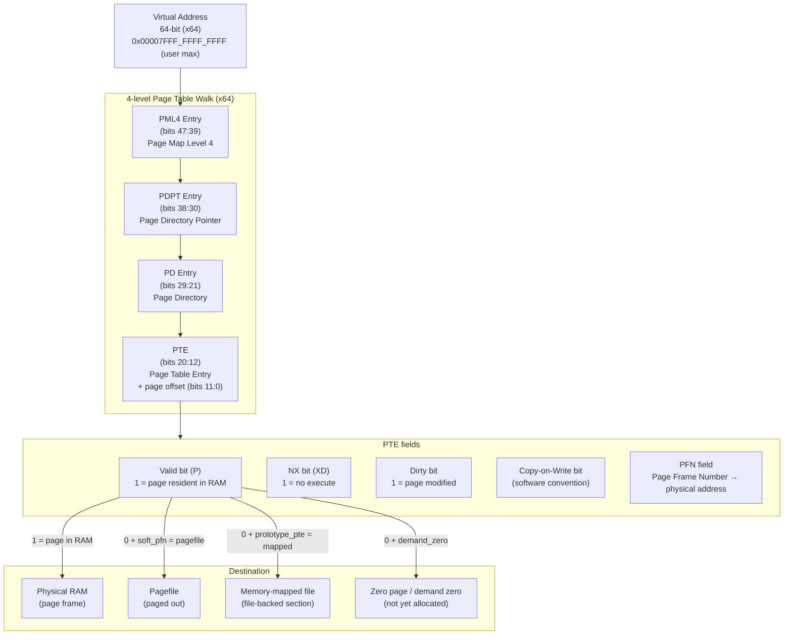
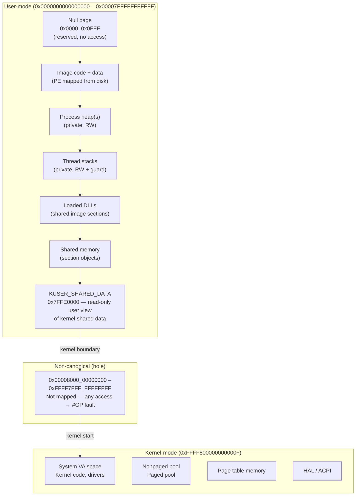
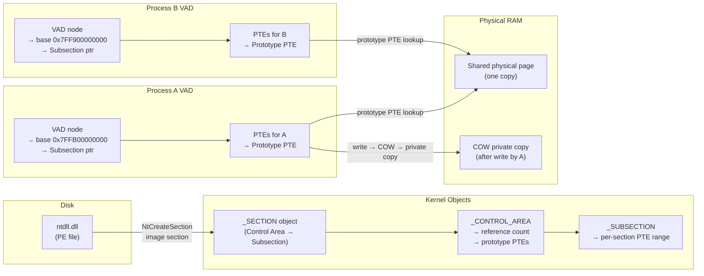
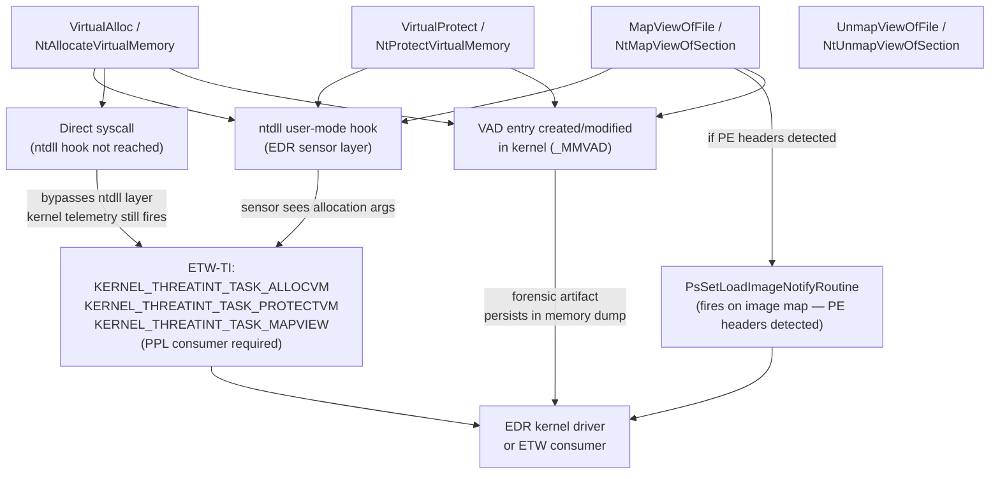

# Chương 5 — Memory Management

> **Researcher note:** Memory management là nền tảng của mọi phân tích Windows — từ exploit development đến memory forensics, từ EDR sensor design đến malware analysis. VAD tree, PTE flags, section objects, COW semantics, và protection transitions không phải chi tiết academic: chúng là surface mà analyst đọc để hiểu process behavior, phân biệt legitimate từ anomalous, và đánh giá sensor coverage limits.

> **Public repo wording note:** Chương này mô tả Windows memory management từ góc nhìn researcher: cơ chế hoạt động, telemetry footprint, forensic surface, và visibility limits. Mục đích là xây dựng mental model chính xác để phân tích, debug, và detect — không phải operational guide.

---

## 0. Chapter Map

| Mục | Nội dung | Tại sao quan trọng |
|-----|----------|--------------------|
| 0 | Chapter Map | Điều hướng |
| 1 | Researcher Mindset | Đặt khung tư duy bảo mật |
| 2 | Big Picture | 4 sơ đồ: VA→PA, address space layout, section sharing, telemetry flow |
| 3 | Key Terms | Từ điển thuật ngữ |
| 4 | Core Internals | Pages, PTEs, fault types, reserve/commit, VAD, working set |
| 5 | Important Components | Section objects, COW, heap, stack, ASLR, DEP, CFG, large pages, compression |
| 6 | Trust Boundaries | 5 ranh giới bảo mật của memory |
| 7 | Attack Surface Map | Bảng 18 attack surface |
| 8 | Execution / Memory Patterns | Researcher analysis của memory-based execution patterns |
| 9 | EDR Telemetry | VirtualAlloc, protection change, image load, ETW-TI |
| 10 | Forensic Artifacts | VAD, memory dump types, working set, private bytes |
| 11 | Debugging Notes | VMMap, WinDbg, Process Explorer, Volatility |
| 12 | Labs | 6 bài thực hành |
| 13 | Researcher Mistakes | Bảng ≥12 sai lầm phổ biến |
| 14 | Version Notes | Thay đổi qua các phiên bản Windows |
| 15 | Summary | Tổng hợp |
| 16 | Research Questions | 12 câu hỏi mở |
| 17 | References | Tài liệu tham khảo |
| 18 | Illustration Plan | Kế hoạch vẽ diagram |

---

## 1. Researcher Mindset

**Memory management là surface gì?**

Toàn bộ execution của Windows process xảy ra trong virtual address space. Memory manager là lớp trung gian giữa virtual addresses và physical RAM — nó quyết định:
- Trang nào được load vào RAM (working set management)
- Trang nào được ghi ra pagefile hoặc discarded (trimming)
- Trang nào được share giữa processes (section objects, COW)
- Trang nào được protect khỏi execution (DEP/NX), modification, hoặc access

Từ góc nhìn researcher, memory management tạo ra ba loại signal:

1. **Allocation signal** — `VirtualAlloc` / `NtAllocateVirtualMemory` với protection flags là event được EDR ghi nhận. Combination type (private vs mapped) × protection (RWX, RX, RW) × caller context là fingerprint.
2. **Protection transition signal** — `VirtualProtect` / `NtProtectVirtualMemory` thay đổi protection của existing region, đặc biệt transition từ RW → RX hoặc ngược lại — là pattern quan trọng.
3. **VAD forensics** — toàn bộ address space của process được mô tả bởi VAD tree trong kernel. Memory dump cho phép reconstruct address space hoàn toàn, kể cả regions mà process cố ý ẩn.

**Ba câu hỏi cần đặt với mọi memory region:**

1. **Type là gì?** — Private (anonymous) hay mapped (backed by file/section)?
2. **Protection flags là gì?** — Execute? Write? Read-only? Nếu private + executable → cần giải thích (JIT legitimate hay không?)
3. **Content match backing source không?** — Nếu region mapped từ DLL, hash của resident pages có match hash của file trên disk không?

---

## 2. Big Picture

### 2.1 Virtual address → page table → physical / pagefile / mapped file



> **Researcher note:** Khi PTE.Valid = 0 (page not present), CPU raise **page fault** (exception 0xE). Memory manager intercepts và quyết định: (1) load từ pagefile, (2) map từ backing file, (3) allocate zero page, hoặc (4) raise access violation nếu region không valid. Loại fault này quyết định fault handling path và có thể trace bằng ETW.

### 2.2 Process address space layout (x64 Windows)



**Address space numbers (x64 Windows 11):**

| Region | Range | Size |
|--------|-------|------|
| Null region | 0x00000000 – 0x0000FFFF | 64 KB |
| User-mode | 0x00010000 – 0x00007FFFFFFFFFFF | ~128 TB |
| Non-canonical hole | 0x00008000_00000000 – 0xFFFF7FFF_FFFFFFFF | — |
| Kernel-mode | 0xFFFF8000_00000000 – 0xFFFFFFFF_FFFFFFFF | ~128 TB |
| KUSER_SHARED_DATA (user) | 0x7FFE0000 | 4 KB (read-only) |

### 2.3 Section object sharing between processes



> **Researcher note:** Tất cả processes load cùng `ntdll.dll` dùng chung **một** physical copy của code pages (prototype PTE mechanism). Khi code page không cần thay đổi (RO/RX), không có private copy. Đây là tại sao ntdll unmap+remap từ disk (để bypass hooked ntdll) tạo ra private copy: private copy sẽ xuất hiện trong VAD như `MEM_PRIVATE` thay vì `MEM_IMAGE` — detectable signal.

### 2.4 Memory telemetry flow



---

## 3. Key Terms

| Thuật ngữ | Định nghĩa ngắn | Relevance cho researcher |
|-----------|-----------------|--------------------------|
| **Virtual address (VA)** | 64-bit địa chỉ trong address space của process | Mọi pointer trong user code là VA |
| **Physical address (PA)** | Địa chỉ thực trong RAM hardware | CPU translate VA→PA qua page table walk |
| **Page** | Đơn vị memory cơ bản, thường 4 KB | Allocation, protection, và paging xảy ra theo page |
| **PTE** | Page Table Entry — ánh xạ một VA page đến PA page | Valid, NX, Dirty, COW, PFN bits — rich forensic info |
| **Page fault** | CPU exception khi VA access trên page not-present | Normal OS mechanism — loại fault xác định handling path |
| **Hard fault** | Page fault requiring disk I/O (pagefile hoặc mapped file) | Performance metric; forensics: indicates paging activity |
| **Soft fault** | Page fault resolved without disk I/O (zero page, COW, transition) | Common, low cost |
| **Demand paging** | Pages không load vào RAM cho đến khi first access | Reserve không dùng RAM cho đến khi commit + touch |
| **Reserve** | Claim VA range không allocate physical backing | MEM_RESERVE — chưa có RAM usage |
| **Commit** | Allocate physical backing (RAM hoặc pagefile space) | MEM_COMMIT — counted against commit charge |
| **Commit charge** | Tổng committed memory trong system (RAM + pagefile) | Commit charge limit = RAM + pagefile total size |
| **Working set** | Resident pages của process hiện tại trong RAM | Bị trim bởi Working Set Manager dưới memory pressure |
| **Private bytes** | Committed private memory của process | Metric quan trọng: grow liên tục có thể là memory leak hoặc allocation pattern |
| **Pagefile** | Virtual memory backing store trên disk | Pages swapped here khi RAM pressure; forensic: pagefile có thể chứa memory artifacts |
| **Private memory** | Memory backed bởi pagefile, không share | MEM_PRIVATE trong VAD — không share với other processes |
| **Shared memory** | Memory backed bởi section object, có thể share | Multiple processes map same physical pages |
| **Section object** | Kernel object đại diện shared memory / mapped file | `_SECTION` → `_CONTROL_AREA` → prototype PTEs |
| **Image section** | Section object tạo từ PE file — executable | MEM_IMAGE trong VAD — DLL/EXE mapping |
| **Data section** | Section object cho data / anonymous shared memory | Named section, shared between processes |
| **Memory-mapped file** | File access thông qua address space | MapViewOfFile — OS handle paging automatically |
| **Copy-on-write (COW)** | Shared page becomes private khi written | Lazy copying — DLL data sections typically COW |
| **VAD** | Virtual Address Descriptor — kernel binary tree mô tả address space | Primary forensic surface: type, protection, backing source |
| **Working Set Manager** | Kernel component trim working sets under pressure | Periodically removes pages from process working set |
| **ASLR** | Address Space Layout Randomization | Randomize base addresses — mitigate fixed-address exploits |
| **DEP / NX** | Data Execution Prevention / No-eXecute | Mark data pages non-executable in PTE.NX bit |
| **CFG** | Control Flow Guard — validate indirect call targets | Compiler + OS: bitmap of valid call targets |
| **PFN database** | Page Frame Number database — kernel tracks every physical page | `_MMPFN` struct per physical page — forensic gold |
| **Prototype PTE** | PTE in control area used by multiple processes for shared page | Mechanism behind shared DLL pages |
| **Large page** | 2 MB page (instead of 4 KB) — requires SeLockMemoryPrivilege | Reduces TLB pressure; no page-level NX on individual pages |
| **Memory compression** | Compressed memory store in RAM (Windows 10+) | Reduces pagefile usage; forensics: compressed pages harder to read |
| **Kernel stack** | Per-thread stack in nonpaged pool — không swap | Covered Ch04; từ memory perspective: always resident |

---

## 4. Core Internals

### 4.1 Virtual memory vs physical memory

Windows dùng **virtual memory** để cung cấp cho mỗi process illusion rằng nó có toàn bộ address space riêng. Ánh xạ VA→PA được thực hiện bởi CPU MMU (Memory Management Unit) dựa trên page tables.

**Tại sao virtual memory quan trọng cho security:**

- **Isolation:** Process A không thể trực tiếp access physical memory của Process B — CPU enforce via page table ownership (mỗi process có CR3 riêng = page table root)
- **Protection:** Mỗi page có protection bits trong PTE — Read/Write/Execute được control ở hardware level
- **Flexibility:** Không cần contiguous physical memory; pages scattered in RAM có thể mapped thành contiguous VA range
- **Overcommit:** Tổng committed memory của tất cả processes có thể lớn hơn RAM — backed by pagefile

**Virtual vs committed vs resident:**

| Khái niệm | Ý nghĩa | Kích thước điển hình |
|-----------|---------|---------------------|
| Virtual size | Tổng VA range reserved (kể cả uncommitted) | Có thể lớn — e.g., 1 MB stack reserved nhưng 4 KB committed |
| Committed | Backed by RAM or pagefile | Counted against commit charge |
| Resident (working set) | Hiện có trong RAM | Bị trim khi memory pressure |

### 4.2 Pages và page tables (x64)

> Research caveat:
> VAD/PTE/PFN details, PTE bit layout, large-page behavior, and VBS/HVCI memory assumptions are build-, symbol-, hardware-, and configuration-dependent. Treat them as a research model, then verify on the target build with public symbols, WinDbg, Microsoft documentation, and controlled lab observations.

**Page size:** 4 KB (standard), 2 MB (large page), 1 GB (huge page — ít dùng).

**4-level page table walk (x64):**

```
Virtual address: [63:48] sign extend | [47:39] PML4 | [38:30] PDPT | [29:21] PD | [20:12] PT | [11:0] offset

CR3 → PML4 table → PDPT → PD → PT → PTE → PFN → Physical Page + offset
```

Mỗi level là một 4 KB page chứa 512 entries (64-bit each). Total depth: 4 levels × 512 entries = 512^4 addressable pages = 256 TB VA per process (capped at 128 TB user + 128 TB kernel).

**PTE structure (x64):**

```c
// 64-bit PTE fields (x64 — simplified)
[0]     P   : Present bit (1 = page in RAM; 0 = not present → page fault)
[1]     RW  : Read/Write (0 = read-only; 1 = writable)
[2]     US  : User/Supervisor (0 = kernel only; 1 = user accessible)
[3]     PWT : Write-through caching
[4]     PCD : Cache disable
[5]     A   : Accessed (set by hardware on any access)
[6]     D   : Dirty (set by hardware on write)
[7]     PS  : Page size (0 = 4KB; 1 = 2MB at PD level)
[11:8]  AVL : Available for OS use (Windows uses for software flags)
[51:12] PFN : Page Frame Number (physical address >> 12)
[58:52] AVL2: Available for OS use
[62:59]     : Reserved
[63]    XD  : Execute-Disable / NX bit (1 = no execute)
```

**Windows software bits in AVL fields:**

| Bit | Windows use |
|-----|-------------|
| AVL[0] | Copy-on-write (COW) marker |
| AVL[1] | Prototype PTE (shared page) |
| AVL[2] | Write-watch |

### 4.3 Page faults — loại và handling

Page fault (hardware exception #14 = 0xE) xảy ra khi CPU cố access VA mà PTE.Present = 0. Kernel page fault handler (`MmAccessFault`) phân loại:

| Fault type | Trigger | Handling |
|------------|---------|---------|
| **Demand zero** | First access to committed-but-not-touched page | Allocate zero-filled physical page, install PTE |
| **Transition fault** | Page đã bị removed từ working set nhưng vẫn trong RAM (transition list) | Re-insert into working set, update PTE — fast, no I/O |
| **Page-in (hard fault)** | Page bị paged out to pagefile | Disk I/O: read pagefile → install PTE — expensive |
| **File map fault** | Access to mapped file page not loaded | Disk I/O: read from backing file → install PTE |
| **Copy-on-write** | Write to shared COW page | Allocate private copy, copy content, update PTE — private copy |
| **Access violation** | Access to invalid/protected VA | Raise STATUS_ACCESS_VIOLATION (0xC0000005) to process |

**Performance monitoring:**

```
Process Explorer → Process properties → Performance tab:
  Hard Faults/sec  = disk page faults (expensive)
  Soft Faults/sec  = demand zero + transition (cheap)

WPA (Windows Performance Analyzer): xperf -on PROC_THREAD+VIRT_ALLOC+DISK_IO
```

> **Researcher note:** Hard fault rate bất thường (process không làm disk I/O nhưng nhiều hard faults) có thể indicate: (1) memory pressure forcing pages out, (2) process accessing many mapped file regions, (3) large working set không fit trong RAM. Không inherently malicious — nhưng useful context khi correlate với other signals.

### 4.4 Reserve vs Commit — allocation model

**Hai bước cần phân biệt:**

```
Reserve  = claim VA range
Commit   = allocate physical backing (RAM or pagefile space)
Touch    = trigger demand-zero page fault → actual RAM allocated
```

**VirtualAlloc API:**

```c
// Reserve only — no RAM used, no pagefile space
LPVOID p = VirtualAlloc(NULL, 1*1024*1024,  // 1 MB
    MEM_RESERVE, PAGE_NOACCESS);

// Commit within reserved range — pagefile space reserved, RAM on first access
VirtualAlloc(p, 4096, MEM_COMMIT, PAGE_READWRITE);

// Reserve + commit in one call
LPVOID buf = VirtualAlloc(NULL, 4096,
    MEM_RESERVE | MEM_COMMIT, PAGE_READWRITE);

// Free — decommit + release
VirtualFree(buf, 0, MEM_RELEASE);
```

**Protection flags:**

| Flag | Hex | Bits | Researcher note |
|------|-----|------|-----------------|
| `PAGE_NOACCESS` | 0x01 | --- | Reserved regions default |
| `PAGE_READONLY` | 0x02 | R-- | |
| `PAGE_READWRITE` | 0x04 | RW- | Standard data pages |
| `PAGE_WRITECOPY` | 0x08 | RWC | COW semantics |
| `PAGE_EXECUTE` | 0x10 | --X | Execute only — rare |
| `PAGE_EXECUTE_READ` | 0x20 | R-X | Standard code pages |
| `PAGE_EXECUTE_READWRITE` | 0x40 | RWX | All permissions — analysis signal |
| `PAGE_EXECUTE_WRITECOPY` | 0x80 | RWXC | |
| `PAGE_GUARD` | 0x100 modifier | | Guard page — stack growth; one-shot access trap |
| `PAGE_NOCACHE` | 0x200 modifier | | |
| `PAGE_WRITECOMBINE` | 0x400 modifier | | |

**RWX (PAGE_EXECUTE_READWRITE) relevance:** Executable + writable simultaneously means code can be modified and executed. Legitimate JIT compilers allocate RWX transiently (or R+X after write). Long-lived RWX private regions are higher-interest during analysis — need context (JIT? packed PE? shellcode?).

### 4.5 VAD — Virtual Address Descriptor tree

VAD tree là cấu trúc quan trọng nhất để hiểu address space của process từ kernel perspective.

**`_MMVAD` structure (key fields):**

```c
struct _MMVAD {
    _MMVAD_SHORT Core;           // contains StartingVpn, EndingVpn, VadFlags
        // VadFlags:
        //   CommitCharge      — pages committed in this range
        //   PrivateMemory     — 1 = private (pagefile-backed); 0 = mapped
        //   Protection        — protection bits (encoded)
        //   MemCommit         — committed flag
        //   NoChange          — VirtualProtect locked
        //   ImageMap          — 1 = mapped as image (PE)

    _SUBSECTION *Subsection;     // → backing file info (if mapped)
    _MMPTE *FirstPrototypePte;
    _MMPTE *LastContiguousPte;
    _LIST_ENTRY ViewLinks;       // links to section views
    _EPROCESS *VadsProcess;      // owning process
};
```

**VAD types và forensic interpretation:**

| VAD type | PrivateMemory | Subsection | Protection | Interpretation |
|----------|--------------|------------|-----------|----------------|
| Private anonymous | 1 | NULL | RW | Stack, heap, anonymous alloc |
| Private executable | 1 | NULL | RX hoặc RWX | JIT code, packed binary, needs investigation |
| Image-mapped | 0 | present + ImageMap | RX/R | DLL/EXE loaded via loader |
| File-mapped | 0 | present, no image flag | RW | Memory-mapped file (data) |
| Shared section | 0 | present | varies | Named section, shared memory |

**WinDbg VAD inspection:**

```windbg
; Dump VAD tree của process:
!process 0 0 notepad.exe
!vad <eprocess_addr>            ; summary tree
!vad <eprocess_addr> 4          ; verbose — include file names

; Parse individual VAD node:
dt nt!_MMVAD <vad_addr>
dt nt!_MMVAD_SHORT <addr>       ; flags: PrivateMemory, Protection, ImageMap
```

**Volatility VAD:**

```bash
vol -f memory.raw windows.vadinfo --pid <pid>   # full VAD with protections and types
vol -f memory.raw windows.malfind --pid <pid>   # filter: private + executable + no image
```

### 4.6 Working set và private bytes

**Working set** = set of pages currently resident in RAM cho một process.

- Quản lý bởi **Working Set Manager** (kernel) — trim pages dưới memory pressure
- `EPROCESS.Vm.WorkingSetSize` — current working set page count
- `SetProcessWorkingSetSize` API — set min/max working set (privileged)

**Private bytes** = tổng committed private memory (không share với process khác):

```
Private bytes = heap + stacks + VirtualAlloc(MEM_PRIVATE) regions
```

**Relationship:**

```
Virtual size ≥ Private bytes (committed) ≥ Working set (resident subset)
```

**Practical numbers để calibrate:**

| Process | Private bytes điển hình | Ý nghĩa |
|---------|------------------------|---------|
| notepad.exe | 5–15 MB | Lightweight |
| chrome.exe (renderer) | 100–400 MB | Heavy JIT, large heap |
| svchost.exe | 10–50 MB | Depends on hosted service |
| lsass.exe | 20–100 MB | Credential caching |

**Sustained growth in private bytes** = potential memory leak or accumulating private allocations. Forensically interesting nếu correlated với suspicious behavior.

---

## 5. Important Windows Components / Structures

### 5.1 Section objects và shared memory

Section objects (`_SECTION`) là kernel mechanism để share memory giữa processes và để map files vào address space.

**Control Area → Subsection → Prototype PTE chain:**

```
_SECTION
  └→ _CONTROL_AREA
        ├→ FilePointer (→ FILE_OBJECT nếu file-backed)
        ├→ NumberOfSectionReferences (ref count)
        └→ _SUBSECTION[]
               ├→ SubsectionBase (prototype PTE array)
               └→ SectorOffset, PtesInSubsection
```

**Prototype PTEs** là PTEs shared bởi tất cả processes mapping cùng section. Khi một process map section, process-level PTEs trỏ đến prototype PTEs thay vì trực tiếp đến physical pages.

**Tạo và sử dụng:**

```c
// Create named shared section (256 MB)
HANDLE hSection = CreateFileMapping(INVALID_HANDLE_VALUE,   // pagefile-backed
    NULL, PAGE_READWRITE, 0, 256*1024*1024, L"Global\\MySharedSection");

// Map into current process address space
LPVOID pView = MapViewOfFile(hSection, FILE_MAP_ALL_ACCESS,
    0, 0, 0);  // map entire section

// Another process maps same section:
HANDLE hSection2 = OpenFileMapping(FILE_MAP_READ, FALSE, L"Global\\MySharedSection");
LPVOID pView2 = MapViewOfFile(hSection2, FILE_MAP_READ, 0, 0, 0);
// pView2 in Process B → same physical pages as pView in Process A
```

**Object namespace:** Named sections ở `\Sessions\<N>\BaseNamedObjects\` (session-local) hoặc `\BaseNamedObjects\` (global). `Global\` prefix → `\BaseNamedObjects\` namespace. Từ Process A trong Session 1, `Global\Foo` → `\BaseNamedObjects\Foo` accessible từ Session 0 services.

**WinObj** (Sysinternals) để navigate section objects trong Object Manager namespace.

### 5.2 Image sections — PE file mapping

Khi Windows load một PE file, nó tạo **image section** — section object backed by the PE file. Điều này cho phép:
- Multiple processes share code pages (single physical copy)
- Lazy loading: pages chỉ loaded khi accessed (demand paging)
- File locking: OS có thể detect modification của running executable

**Image vs data section:**

| Property | Image section (PE) | Data section (anonymous/file) |
|----------|-------------------|-------------------------------|
| VAD flag | `ImageMap = 1` | `ImageMap = 0` |
| Backing source | PE file on disk | Pagefile hoặc data file |
| Protection | Per-section from PE header | As specified by caller |
| Content integrity | Pages should match file | No inherent integrity |
| COW behavior | Write → private copy | Private (already private) |

### 5.3 Memory-mapped files

Memory-mapped files cho phép file I/O thông qua memory access thay vì ReadFile/WriteFile:

```c
// Open file
HANDLE hFile = CreateFile(L"data.bin", GENERIC_READ | GENERIC_WRITE,
    0, NULL, OPEN_EXISTING, FILE_ATTRIBUTE_NORMAL, NULL);

// Create section backed by file
HANDLE hMap = CreateFileMapping(hFile, NULL, PAGE_READWRITE, 0, 0, NULL);

// Map into address space
LPVOID pData = MapViewOfFile(hMap, FILE_MAP_ALL_ACCESS, 0, 0, 0);

// Read/write directly — OS handles paging to/from file
((char*)pData)[100] = 'X';   // writes to file at offset 100
FlushViewOfFile(pData, 0);   // flush to disk
UnmapViewOfFile(pData);
```

**OS handles I/O:** Khi access mapped page not in RAM, page fault → OS reads from file → installs PTE. Khi process writes → PTE.Dirty = 1 → eventually flushed to file.

**Forensics:** VAD node có `Subsection != NULL` với file path → memory-mapped file. File path visible trong `!vad` output hoặc `windows.vadinfo`.

### 5.4 Copy-on-write (COW)

COW là lazy copying mechanism: nhiều processes share physical page (read-only) cho đến khi một process write → kernel allocate private copy cho process đó.

**Mechanism:**

```
1. DLL data section loaded as COW (PTE.COW = 1, physically shared)
2. Process A writes to COW page:
   → Page fault (write to read-only shared page)
   → MmCopyOnWrite: allocate new physical page for Process A
   → Copy content of shared page → new page
   → Update Process A's PTE: present, writable, PFN = new page, COW = 0
   → Process B still sees original shared page
```

**Implication cho security analysis:**

- ntdll.dll code pages: shared (RX) — no COW unless patched
- ntdll.dll **data** pages: initially shared COW — writing to .data triggers private copy
- If a DLL's code pages become private → code was modified in memory (patching, hook removal)
- Detection: MEM_IMAGE region với private pages (VAD shows image, but prototype PTE chain broken)

**WinDbg COW check:**

```windbg
; Xem prototype PTE status:
!pte <virtual_address>
; Output shows: prototype PTE pointer vs direct PFN
; If PTE.proto = 0 and PrivateMemory = 1 → private copy (COW happened)
```

### 5.5 Heap internals (high-level)

Heap là managed allocator trên VirtualAlloc. Windows có ba heap implementations:

| Heap type | Backend | Usage |
|-----------|---------|-------|
| NT Heap (legacy) | VirtualAlloc-backed linked lists | Older code, backward compat |
| Segment Heap (default Win10+) | Backend + segment allocator | New default for most processes |
| Custom heap | Application-defined | SQLite, TCMalloc, jemalloc |

**Process default heap:**
- `PEB.ProcessHeap` → default heap handle
- `HeapAlloc(GetProcessHeap(), 0, size)` → allocate from default heap
- Multiple private heaps possible via `HeapCreate`

**Heap metadata — security relevance:**

- Heap header chunks contain size, flags, previous chunk pointer
- **Heap overflow** exploit: corrupt adjacent chunk header → control allocation → arbitrary write
- Application Verifier enable **page heap** mode: each allocation on its own page with guard page → immediate detect overflow but large memory overhead

**Segment heap (Win10+):**

```
SegmentHeap → {
  LFH (Low-fragmentation heap) — small allocations via segment
  VS (Variable-size segment)   — medium allocations
  Large allocation             — > 508 KB → directly VirtualAlloc
  Huge allocation              — > 64 KB from NT heap backend
}
```

**WinDbg heap commands:**

```windbg
!heap                          ; list all heaps in process
!heap -a                       ; detailed all heaps
!heap -s                       ; heap statistics
!heap -p -a <addr>             ; find allocation containing address
dt ntdll!_HEAP <heap_addr>     ; parse heap header
```

### 5.6 ASLR — Address Space Layout Randomization

ASLR randomize base addresses của executable, DLLs, stack, và heap mỗi khi load.

**Per-component entropy (x64 Windows 11):**

| Component | Entropy bits | Notes |
|-----------|-------------|-------|
| Executable (ASLR-enabled) | 8 bits (256 positions) | System-wide randomization per boot |
| DLLs (ASLR-enabled) | 8 bits per boot | Shared base across all processes using same DLL |
| Stack | ~17 bits | Per-thread randomization |
| Heap | ~5 bits | Per-process |
| High-entropy ASLR (`HEASLR`) | Up to 24 bits for image | Requires PE opt-in + 64-bit process |

**ASLR requirements:**
- PE must have `IMAGE_DLLCHARACTERISTICS_DYNAMIC_BASE` flag (0x0040)
- `Force ASLR` mitigation: force-relocate DLLs even without DYNAMIC_BASE flag

**ASLR limitations for analysis:**
- DLL base addresses randomized **once per boot** — same base across all processes loading same DLL in same boot session
- Info leak (type confusion, OOB read exposing a pointer) can bypass ASLR by leaking a valid address
- Brute force feasible against 32-bit processes (~256 or ~512 positions)

**WinDbg:**

```windbg
lm                             ; list modules with base addresses
!address <addr>                ; show region info at address
```

### 5.7 DEP / NX

DEP (Data Execution Prevention) marks data pages non-executable via PTE.XD (Execute-Disable) bit.

- Hardware requirement: CPU must support NX bit (all modern x64 CPUs do)
- Enforced per-page by CPU MMU — attempting to execute page with XD=1 → #PF fault → STATUS_ACCESS_VIOLATION
- `EPROCESS.MitigationFlags.EnableExecuteDisable` — per-process DEP flag
- **Opt-out possible (legacy compat):** `SetProcessDEPPolicy(PROCESS_DEP_DISABLE)` — but restricted on modern Windows

**Bypass primitive concept:** DEP prevents execute-data-directly; ROP (Return Oriented Programming) chains existing executable code gadgets to achieve computation without injecting new executable code.

### 5.8 CFG — Control Flow Guard

CFG validates indirect call targets at runtime to prevent exploitation via corrupted function pointers.

**Components:**
1. **Compiler**: annotate all indirect call sites with `__guard_check_icall_nop` + mark valid targets in `.gfids` table
2. **Linker**: generate CFG bitmap from valid call targets
3. **OS**: maintain CFG bitmap in process — `ntdll!LdrpValidateUserCallTarget` checks each indirect call target

**CFG bitmap location:**
- `PEB.pShimData` → actually `CFGBitMap` pointer on CFG-enabled processes
- Or `NtQueryVirtualMemory(ProcessCFGEnabled)` to check

**Limitation:** CFG validates entry points of functions, not arbitrary gadgets. ROP gadgets (mid-function gadgets) are not in CFG bitmap → CFG does not prevent all ROP.

### 5.9 Large pages

Large pages = 2 MB pages (instead of 4 KB). Require `SeLockMemoryPrivilege`.

**Benefits:** Fewer TLB entries needed (512 × reduction for same memory), reduced page table overhead.

**Security implication:** Large pages không support individual page protection — all 2 MB have same protection. Cannot mix NX and executable within same large page. SQL Server và other high-performance workloads dùng large pages; memory forensics scanner phải handle 2 MB granularity.

```c
LPVOID p = VirtualAlloc(NULL, GetLargePageMinimum(),
    MEM_RESERVE | MEM_COMMIT | MEM_LARGE_PAGES,
    PAGE_EXECUTE_READWRITE);
```

### 5.10 Memory compression (Windows 10+)

Windows 10 introduced **memory compression** via `System` process compression store. Pages trimmed from working sets can be compressed in RAM instead of being written to pagefile.

- Compressed pages stored in `System` process working set
- `MemCompression` process in Task Manager (internal name of System's compression store)
- Reduces pagefile I/O — helps on systems with slow storage
- **Forensics impact:** Pages in compression store may not be accessible in standard memory dump — they appear as "compressed" and require decompression to analyze

```windbg
!vm                            ; show memory statistics including compression
```

### 5.11 Crash dumps và memory dumps

Windows supports multiple dump formats:

| Dump type | Content | Size | Use case |
|-----------|---------|------|---------|
| **Minidump** | Stack, registers, loaded modules | < 100 MB | Quick crash analysis |
| **Kernel dump** | Kernel address space + page tables | RAM-dependent | Kernel debugging |
| **Complete dump** | Entire RAM content | = RAM size | Full forensics |
| **Active memory dump** | RAM minus hypervisor pages | < complete | Hyper-V environments |
| **Automatic (Small)** | Minidump + kernel pool | System32\Minidump | Default on BSOD |

**Forensics dump collection:**

```
; Live system — user mode dump:
Task Manager → process → Create dump file

; Live system — full dump via NotMyFault or WinPmem:
NotMyFault.exe /crash       ; triggers BSOD + complete dump (destructive)
WinPmem → reads physical RAM directly (non-destructive)

; Post-mortem:
%WinDir%\MEMORY.DMP         ; kernel dump after BSOD
%WinDir%\Minidump\*.dmp     ; minidumps
```

**WinDbg dump analysis:**

```windbg
; Open dump:
windbg -z memory.dmp

; Or attach:
.opendump memory.dmp

; Check dump type:
.dumpdebug            ; dump header info

; Virtual memory info:
!vm                   ; virtual memory stats
!memusage             ; memory usage by category
```

---

## 6. Trust Boundaries

### 6.1 User / kernel address space boundary

Kernel address space (0xFFFF8000... và trên) không accessible từ user mode — CPU enforce via PTE.US (User/Supervisor) bit. Bất kỳ access từ Ring 3 vào kernel VA → immediate #PF → STATUS_ACCESS_VIOLATION.

**Kernel reads from user mode:** `MmCopyVirtualMemory`, `ProbeForRead/Write` — kernel explicitly validates user pointer trước khi access. Validation gap (TOCTOU) là source of kernel vulnerabilities: validate pointer, then user code changes mapping before kernel reads.

### 6.2 Process address space isolation

Mỗi process có CR3 riêng (page table root) — hardware isolate. Cross-process memory access requires kernel mediation (`NtReadVirtualMemory` / `NtWriteVirtualMemory`) với proper handle và access mask.

**KPTI (Kernel Page Table Isolation):** Post-Meltdown mitigation — kernel pages không mapped vào user-mode page table (separate CR3 per privilege level). Slightly reduces cross-privilege info leak surface.

### 6.3 DEP / NX boundary

PTE.XD enforced by CPU. User-mode code không thể clear NX bit directly — only kernel (`NtProtectVirtualMemory`) can change page protection. Changing protection is logged via VAD update + ETW-TI.

### 6.4 Section access control

Named sections có security descriptor (DACL). `OpenFileMapping` → `NtOpenSection` → `ObpCheckObjectAccess` verify DACL. Default-created sections inherit DACL from creating process token — potentially too permissive for cross-session communication.

### 6.5 Commit charge boundary

System commit charge limit = total RAM + pagefile size. If commit charge exhausted, `VirtualAlloc(MEM_COMMIT)` fails with `ERROR_COMMITMENT_LIMIT`. Used-as-DoS: exhaust commit charge to deny service to other processes.

---

## 7. Attack Surface Map

| # | Surface | Mechanism | Required Access | Sensor Coverage |
|---|---------|-----------|-----------------|-----------------|
| 1 | Private executable allocation | VirtualAlloc(RWX) — private + executable | Within-process | ETW-TI ALLOCVM; protection flags in VAD |
| 2 | Protection transition RW→RX | VirtualProtect: write payload, then make executable | Within-process | ETW-TI PROTECTVM; old+new protection logged |
| 3 | Cross-process memory write | NtWriteVirtualMemory into another process | PROCESS_VM_WRITE | ETW-TI; ObRegisterCallbacks on handle |
| 4 | Section object misuse | Named section accessible cross-session | Creator privilege | Section DACL audit; WinObj |
| 5 | ntdll code page COW | Map clean ntdll from disk, replacing hooked pages | Within-process | Code page → MEM_PRIVATE transition |
| 6 | VAD manipulation (DKOM) | Modify VAD tree to hide memory region | Kernel (Ring 0) | Memory dump diff; pool scan |
| 7 | Heap overflow | Corrupt adjacent heap chunk metadata | Within-process | Page heap, Application Verifier |
| 8 | Stack overflow / stack pivot | Corrupt stack return address | Within-process | CET shadow stack; stack canary |
| 9 | Pagefile forensic recovery | Recover artifacts from pagefile.sys | Physical access to disk | Pagefile parsing in forensics tools |
| 10 | Memory-mapped file abuse | Map file into address space for covert I/O | File access rights | MapViewOfSection event; file path in VAD |
| 11 | Large page RWX | 2 MB RWX region — cannot be split to enforce NX at sub-page | SeLockMemoryPrivilege | Large page allocation logged; ETW-TI |
| 12 | Working set manipulation | SetProcessWorkingSetSize to force paging | Within-process, some privilege | Working set size events |
| 13 | Commit exhaustion | Allocate until commit limit reached (DoS) | Low — within-process | Commit charge monitoring |
| 14 | ASLR info leak | OOB read exposing pointer leaks valid address | Vulnerability-dependent | Not directly sensor-visible |
| 15 | CFG bypass via non-CFG target | Indirect call to code not in CFG bitmap | Within-process (exploit) | CFG bitmap check failure generates exception |
| 16 | Dump credential extraction | Read lsass dump — LSAISO or process snapshot | PROCESS_ALL_ACCESS on lsass | PPL on lsass; Credential Guard |
| 17 | Memory compression store access | Read compressed pages in System process | Kernel | Specialized forensics tools |
| 18 | Kernel pool overflow | Corrupt kernel pool metadata → privilege escalation | Kernel vulnerability | Kernel patch guard; HVCI |

---

## 8. Abuse Patterns — Concept Level

> **Note:** Section này phân tích các memory-related execution patterns từ góc nhìn detection engineering và forensics. Mục đích là giúp researcher hiểu cơ chế và telemetry footprint — không phải hướng dẫn thực hiện.

### 8.1 Private executable memory — analysis model

**Private + executable memory** là một trong những signals quan trọng nhất trong memory forensics. JIT compilers (CLR, V8, LuaJIT) hợp lệ tạo private executable regions — đây là false positive surface quan trọng nhất.

**Analysis decision tree:**

```
Private memory + Executable?
  ├── Is process a known JIT host? (chrome, dotnet, node, java)
  │     ├── Yes → likely JIT code; verify via module list (CLR/V8 DLL loaded?)
  │     └── No → higher concern; proceed to content analysis
  ├── Does region have PE header at start? (MZ signature, PE signature)
  │     ├── Yes → reflective load candidate; check LDR list discrepancy
  │     └── No → likely shellcode or packed data
  └── What does content look like? (entropy, strings, opcodes)
        ├── High entropy → possibly packed/encrypted
        └── Identifiable code patterns → analyze structure
```

**Volatility `malfind`** implements a version of this decision tree — flag private+executable regions, show content, flag PE headers.

### 8.2 Protection transition — telemetry signature

**VirtualProtect** changing protection of an existing region is a key telemetry event. Common legitimate patterns:

| Sequence | Legitimate use | Analysis note |
|----------|---------------|---------------|
| RW → RX | JIT compiler write code, then make executable | Common and expected |
| RX → RW → RX | Self-modifying code, patcher | Less common; note which process |
| NA → RW → RX | Stage-by-stage allocation pattern | Sequence timing matters |
| RX (image) → RW | Patching code page | COW triggers; probe for hook installation |

**ETW-TI `KERNEL_THREATINT_TASK_PROTECTVM`** captures: process, base address, size, old protection, new protection. Sequence analysis across multiple events reveals patterns.

### 8.3 ntdll code page integrity — COW signature

ntdll.dll code pages are MEM_IMAGE (shared, RX). If a process remaps ntdll from disk:
1. `NtUnmapViewOfSection` on ntdll region → VAD node removed
2. `NtCreateSection` + `NtMapViewOfSection` from disk file → new VAD node, new private pages
3. New VAD: still looks like MEM_IMAGE at first glance, but new private pages (no shared prototype PTEs)

**Detection signal:** Process with ntdll.dll showing private committed pages in the image region (MEM_PRIVATE where MEM_IMAGE expected). Compare:
- `!vad` to see VAD node type
- `!pte <ntdll_code_addr>` to see if PTE.proto = 1 (shared) or 0 (private)
- Prototype PTE chain intact for legitimate shared load

### 8.4 Mapped region vs private — forensic differentiation

| Check | Private (anonymous) | Mapped (image/file) |
|-------|--------------------|--------------------|
| `VadFlags.PrivateMemory` | 1 | 0 |
| `Subsection` pointer | NULL | Non-NULL (→ file object) |
| Content from pagefile | Yes (if paged) | No (reload from file) |
| Appears in `malfind` | Yes (if executable) | No (by default) |
| Hash matches disk file | N/A | Should match if unmodified |

### 8.5 Heap and stack for reversing

**Heap analysis during debugging:**

```windbg
; Find heap allocations containing specific pattern:
!heap -s                       ; heap stats — spot large allocations
!heap -p -a <suspicious_addr>  ; find which heap allocation contains addr

; Application Verifier page heap:
; Enable: appverif.exe → select process → enable heap checks
; Each allocation gets its own 4KB page + guard page immediately after
; Buffer overflow → immediate access violation at guard page boundary
```

**Stack analysis:**

```windbg
; User stack base/limit from TEB:
dt ntdll!_TEB @$teb NtTib  ; StackBase + StackLimit
; Walk user stack:
k 30                         ; 30 frames
; Check each frame: is return addr preceded by CALL instruction?
```

**Stack pivot forensics:** In ROP exploitation, RSP is redirected to attacker-controlled data (fake stack). Key signal: stack pointer (RSP) points to a non-stack region (i.e., not in `[StackLimit, StackBase]` range from TEB). CET shadow stack hardware enforcement mitigates this by maintaining parallel shadow stack with hardware-checked return addresses.

---

## 9. Defender / EDR Telemetry


> Telemetry interpretation note:
> ETW/Event Log/WMI/EDR are provider-generated or sensor-generated views, not universal ground truth. Telemetry must be interpreted with source layer, configuration, provider state, collection policy, and retention. Absence of an event is not proof of absence. High-signal anomaly still requires context and correlation.

### 9.1 User-mode hooks (ntdll)

| API | Information captured | Visibility gap |
|-----|---------------------|----------------|
| `NtAllocateVirtualMemory` | Process, base, size, allocation type, protection | Direct syscall bypasses ntdll hook |
| `NtFreeVirtualMemory` | Process, base, size, free type | Direct syscall |
| `NtProtectVirtualMemory` | Process, base, size, new protection, old protection | Direct syscall |
| `NtMapViewOfSection` | Section handle, process, offset, size, protection | Direct syscall |
| `NtUnmapViewOfSection` | Process, base | Direct syscall |
| `NtReadVirtualMemory` | Source process, address, size | Direct syscall |
| `NtWriteVirtualMemory` | Target process, address, size, data | Direct syscall |
| `NtCreateSection` | File handle, max size, protection, section attr | Direct syscall |

### 9.2 Kernel callbacks và ETW-TI

| Sensor | Event | Information | Limitation |
|--------|-------|-------------|-----------|
| `PsSetLoadImageNotifyRoutine` | PE image mapped (load) | Image name, base, process | Reflective loads not detected |
| ETW-TI `ALLOCVM` | `NtAllocateVirtualMemory` | PID, base, size, type, protection | PPL consumer required |
| ETW-TI `PROTECTVM` | `NtProtectVirtualMemory` | PID, base, size, old+new protection | PPL consumer required |
| ETW-TI `MAPVIEW` | `NtMapViewOfSection` | PID, section, base, size, protection | PPL consumer required |
| ETW-TI `UNMAPVIEW` | `NtUnmapViewOfSection` | PID, base | PPL consumer required |
| ETW-TI `READVM` | `NtReadVirtualMemory` | Source/target PID, address | PPL consumer required |
| ETW-TI `WRITEVM` | `NtWriteVirtualMemory` | Source/target PID, address, size | PPL consumer required |
| `ObRegisterCallbacks` (Process) | OpenProcess with VM access | Caller, target, access mask | Kernel driver bypass |
| Microsoft-Windows-Kernel-Memory ETW | Working set events | PID, address, page count | May generate high volume |

### 9.3 Event Log / Sysmon-style telemetry

| Event | Source | EventID | Key data |
|-------|--------|---------|---------|
| Image/DLL load | Sysmon | 7 | Image path, hash, signed status, process |
| Process memory access | Sysmon | 10 | Source/target PID, access mask |
| Remote thread (memory write + thread) | Sysmon | 8 | Source, target, start address, module |
| CreateRemoteThread (implies VM write) | Sysmon | 8 | Cross-reference with 10 |
| Driver load | Sysmon | 6 | Driver path, hash — kernel memory allocations |

**Sysmon EventID 7 (Image Load) — DLL/image load tracking:**

```xml
<EventData>
  <Data Name="Image">C:\Windows\System32\ntdll.dll</Data>
  <Data Name="ImageLoaded">C:\Windows\System32\ntdll.dll</Data>
  <Data Name="Hashes">SHA256=...</Data>
  <Data Name="Signed">true</Data>
  <Data Name="Signature">Microsoft Windows</Data>
</EventData>
```

**Hash mismatch on Signed=true** (e.g., in-memory modification of signed DLL) — EDR compares on-disk hash vs computed hash of memory pages. Discrepancy indicates in-memory modification.

### 9.4 Sensor coverage gaps

| Scenario | Coverage | Gap |
|----------|---------|-----|
| VirtualAlloc private RWX — same process | ETW-TI ALLOCVM (PPL required) | No direct alert without PPL consumer |
| VirtualProtect RW→RX sequence | ETW-TI PROTECTVM, both events | Timing window between write and protect |
| Reflective DLL load | No PsSetLoadImageNotify | VAD shows private, no image notify fired |
| Fiber execution in private memory | No thread creation event | VAD scan + stack capture only |
| Memory-mapped I/O avoiding ReadFile | ETW-TI MAPVIEW | File path in VAD; actual reads uncounted |
| Heap corruption (within-process) | No kernel event | Application Verifier (AppVerifier) only |
| Large page allocation | ETW-TI ALLOCVM with MEM_LARGE_PAGES flag | Flag distinguishable in event |

---

## 10. Forensic Artifacts

### 10.1 VAD tree — primary forensic surface

VAD tree (`windows.vadinfo` in Volatility, `!vad` in WinDbg) is the primary source for reconstructing process address space from a memory dump.

**Per-VAD node data:**

| Field | Source | Value |
|-------|--------|-------|
| Base + size | StartingVpn, EndingVpn | Address range |
| Protection | VadFlags.Protection | Encoded protection flags |
| Type | VadFlags.PrivateMemory, ImageMap | Private / file / image |
| Backing file | Subsection → ControlArea → FileObject → FileName | File path if mapped |
| Commit | VadFlags.CommitCharge | Pages committed |

**Volatility `malfind` heuristics:**

```bash
vol -f memory.raw windows.malfind --pid <pid>
# Filters: PrivateMemory=1 AND protection contains Execute
# Shows: base address, size, protection, hexdump (first 64 bytes)
# Note: JIT code from CLR/V8 will also appear — requires context
```

**False positive handling:**

```bash
# Check if process has JIT DLLs loaded:
vol -f memory.raw windows.dlllist --pid <pid> | grep -i "clr\|v8\|jvm\|lua"
# If yes → malfind hits in JIT-compiled address ranges are expected
```

### 10.2 Physical memory dump artifacts

| Artifact | Where in dump | Volatility plugin |
|----------|--------------|-------------------|
| EPROCESS list | `PsActiveProcessHead` linked list | `windows.pslist` |
| Hidden processes | Pool tag `Proc` scan | `windows.psscan` |
| ETHREAD list | `EPROCESS.ThreadListHead` | `windows.threads` |
| VAD tree (all processes) | EPROCESS.VadRoot | `windows.vadinfo` |
| Loaded DLLs | PEB.Ldr + LDR_DATA_TABLE_ENTRY | `windows.dlllist` |
| DLL discrepancy | Compare VAD vs PEB.Ldr vs pool scan | `windows.ldrmodules` |
| Module hashes | Compute from memory pages | `windows.dumpfiles` |
| Private executable regions | VAD + protection filter | `windows.malfind` |
| Strings in dump | All printable strings | `strings` tool + `vol windows.strings` |
| Registry hives | In-memory registry | `windows.registry.*` |
| Network connections | TCP endpoint objects | `windows.netstat` |
| Handles | HANDLE_TABLE walk | `windows.handles` |

### 10.3 Pagefile forensics

`pagefile.sys` chứa pages paged out từ RAM. Có thể chứa:
- Process memory từ trước khi process exit
- Decrypted content (nếu process decrypted data in memory rồi bị paged out)
- Fragments của credentials, keys, plaintext

**Analysis:** Tool như Volatility `windows.pagefile` hoặc custom parser có thể correlate pagefile với memory dump để reconstruct full address space.

### 10.4 Memory dump acquisition methods và forensic implications

| Method | What's captured | Limitations |
|--------|----------------|-------------|
| WinPmem (read physical RAM) | Full physical RAM | Compressed pages in System process may appear compressed |
| Task Manager dump | Process user-mode virtual memory | Kernel objects not included; file-backed pages reference file |
| ProcDump.exe (Sysinternals) | User-mode memory of target process | MiniDump or full dump |
| BSOD MEMORY.DMP | Kernel dump (pages active at crash) | May miss paged-out content |
| Crash dump from `NotMyFault` | Complete dump (triggers BSOD) | Destructive — system restarts |
| Hypervisor snapshot | Full VM memory including host-visible kernel | Best for VMs; compressed pages accessible |

### 10.5 Working set và private bytes trends

**Live system forensics:**

```
Process Explorer → lower pane → Process → Performance tab:
  - Working Set Peak (max resident pages ever)
  - Private Bytes (committed private — heap + stack + VirtualAlloc)
  - Virtual Size (total reserved VA)
  - Page Faults (hard + soft total)
  - I/O Read/Write bytes

Anomaly patterns:
  - Private bytes growing continuously (> 10 MB/min) → allocation accumulation or leak
  - High page fault rate without corresponding disk I/O → transition faults (working set trim)
  - Working set much smaller than private bytes → significant amount paged to pagefile
```

---

## 11. Debugging and Reversing Notes

### 11.1 VMMap (Sysinternals)

VMMap visualizes the full virtual address space of a process:

- **Color coding:** Yellow = image (DLL), Blue = heap, Orange = stack, Green = mapped file, Gray = private data, Red = private executable
- **View → Details** → per-region: type, protection, private/shared pages, committed/reserved
- **File → Save** → CSV for scripted analysis
- **Key analysis:** Red regions (private + executable) need explanation — JIT or anomaly?

### 11.2 WinDbg — memory analysis

**Virtual memory inspection:**

```windbg
; Address space summary:
!address -summary

; Specific region info:
!address <virtual_address>
; Output: region type, state (commit/reserve/free), protection, owner

; Page table entry:
!pte <virtual_address>
; Output: PTE content — valid/invalid, PFN, protection bits, dirty/accessed

; Virtual to physical translation:
!vtop 0 <virtual_address>      ; translate using current process CR3

; Memory content:
db <addr> L40                  ; dump bytes
du <addr>                      ; dump Unicode string
da <addr>                      ; dump ASCII string
dps <addr>                     ; dump pointer-sized values with symbol resolve

; Search for pattern in region:
s -b <start> L<len> <bytes>    ; byte search
s -d <start> L<len> <dword>    ; dword search
```

**VAD and section inspection:**

```windbg
!vad <eprocess_addr>            ; VAD tree summary
!vad <eprocess_addr> 4          ; verbose with file names and protection

; Section object:
!section <section_addr>         ; section object details
dt nt!_CONTROL_AREA <addr>      ; control area
dt nt!_SUBSECTION <addr>        ; subsection details
```

**Working set inspection:**

```windbg
!vm                             ; virtual memory statistics
!memusage                       ; memory usage by type (code, data, stack, etc.)
!working_set                    ; working set details (kernel debugging)
```

### 11.3 Process Explorer — memory view

- **View → Lower Pane → Memory** (double-click process) → VMMap-like view integrated
- **Properties → Performance** → private bytes, working set, page faults per second
- **Properties → Threads** → per-thread stack size (from TEB.NtTib.StackBase/StackLimit)
- **DLL tab** → loaded modules with base addresses, file paths, image size

### 11.4 Volatility — memory forensics

```bash
# Environment setup:
vol -f memory.raw windows.info          # OS version, build, dump type

# Process address space:
vol -f memory.raw windows.vadinfo --pid <pid>          # full VAD with file backing
vol -f memory.raw windows.malfind --pid <pid>          # private+executable regions
vol -f memory.raw windows.ldrmodules --pid <pid>       # DLL discrepancy analysis

# Module dumps:
vol -f memory.raw windows.dumpfiles --pid <pid> -o /output/  # dump all mapped files

# Memory search:
vol -f memory.raw windows.strings       # extract printable strings
vol -f memory.raw windows.memmap --pid <pid>  # memory map

# Pagefile correlation:
# (Requires pagefile.sys in addition to memory dump)
```

### 11.5 x64dbg / user-mode debugging — memory view

```
View → Memory Map → shows all virtual regions with type and protection
Right-click region → Dump → inspect content
Address bar → go to specific address

; TEB/PEB access:
GS:[0x60] = PEB address (x64)
GS:[0x30] = TEB address (x64)

; Heap inspection:
Breakpoint on HeapAlloc → watch eax/rax for return address
Memory map shows heap regions as private RW

; VirtualProtect monitoring:
Breakpoint on NtProtectVirtualMemory → log base, size, new protection
```

---

## 12. Safe Local Labs


> Lab format note:
> Mỗi lab nên được đọc theo checklist: **Goal**, **Requirements**, **Steps**, **Expected observations**, **Research notes**, và **Cleanup**. Nếu một lab cũ chưa ghi đủ từng nhãn này, áp dụng checklist này trước khi chạy: dùng Windows VM/snapshot, ghi tool version/build, chỉ thao tác trên test artifact, dừng collector/debug setting sau lab, và xóa test files/keys/processes do lab tạo.

### Lab 1 — VirtualAlloc với VMMap và WinDbg

**Mục tiêu:** Quan sát lifecycle của VirtualAlloc allocation — từ reserve đến commit đến use — và verify trong VMMap và WinDbg.

```c
#include <windows.h>
#include <stdio.h>

int main() {
    // Step 1: Reserve only
    LPVOID pReserved = VirtualAlloc(NULL, 64 * 1024,
        MEM_RESERVE, PAGE_NOACCESS);
    printf("Reserved at: %p (no RAM yet)\n", pReserved);
    printf("PID: %d — check VMMap now (reserved region)\n", GetCurrentProcessId());
    getchar();

    // Step 2: Commit first page
    LPVOID pCommit = VirtualAlloc(pReserved, 4096,
        MEM_COMMIT, PAGE_READWRITE);
    printf("Committed 4KB at: %p\n", pCommit);
    getchar();

    // Step 3: Touch (demand-zero fault)
    memset(pCommit, 0xAA, 4096);
    printf("Touched — now resident\n");
    getchar();

    // Step 4: Change protection
    DWORD oldProt;
    VirtualProtect(pCommit, 4096, PAGE_EXECUTE_READ, &oldProt);
    printf("Changed protection to RX (old: 0x%X)\n", oldProt);
    printf("Check VMMap — should show red (private executable)\n");
    getchar();

    VirtualFree(pReserved, 0, MEM_RELEASE);
    printf("Freed\n");
    return 0;
}
```

**VMMap observations:**
- Sau Reserve: region xuất hiện màu gray, State = Reserved, không có Committed pages
- Sau Commit: State = Committed, Private pages = 4 KB
- Sau Touch: Working Set tăng 4 KB
- Sau VirtualProtect: Protection column thay đổi → màu red (private + executable)
- Sau Free: region biến mất

**WinDbg (attach sau bước 4):**

```windbg
!address <pCommit_address>
; → Type: Private, State: Commit, Protect: PAGE_EXECUTE_READ
!pte <pCommit_address>
; → PTE: Present, User, NX=0 (execute allowed), Dirty
```

**Câu hỏi:** Sau Reserve, `!address` cho State gì? Sau VirtualProtect, NX bit trong PTE thay đổi như thế nào?

### Lab 2 — Memory-mapped file demo

**Mục tiêu:** Tạo memory-mapped file, đọc/ghi thông qua address space, quan sát trong VMMap.

```c
#include <windows.h>
#include <stdio.h>

int main() {
    // Create or open a file
    HANDLE hFile = CreateFile(L"test_mapped.bin",
        GENERIC_READ | GENERIC_WRITE,
        FILE_SHARE_READ, NULL, CREATE_ALWAYS,
        FILE_ATTRIBUTE_NORMAL, NULL);

    // Create file mapping (1 MB)
    HANDLE hMap = CreateFileMapping(hFile, NULL,
        PAGE_READWRITE, 0, 1024 * 1024, L"Local\\TestMapping");

    // Map into address space
    LPVOID pView = MapViewOfFile(hMap, FILE_MAP_ALL_ACCESS, 0, 0, 0);
    printf("Mapped at: %p\n", pView);
    printf("PID: %d — check VMMap (green region = mapped file)\n", GetCurrentProcessId());
    getchar();

    // Write via mapped memory
    sprintf((char*)pView, "Hello from mapped memory!");
    FlushViewOfFile(pView, 0);
    printf("Written and flushed to file\n");
    getchar();

    UnmapViewOfFile(pView);
    CloseHandle(hMap);
    CloseHandle(hFile);
    printf("Unmapped\n");
    return 0;
}
```

**Observations:**
- VMMap: region màu green với file path "test_mapped.bin" visible
- Type: Mapped File, not Private
- WinDbg: `!address <pView>` → Type: Mapped, backing file visible

**Câu hỏi:** Trong VMMap, mapped file region có "Private" pages không? Tại sao?

### Lab 3 — DLL image memory vs private heap trong VMMap

**Mục tiêu:** Phân biệt image-mapped DLL regions từ private heap regions bằng VMMap.

```c
#include <windows.h>
#include <stdio.h>

int main() {
    // Heap allocation (private)
    void* heapData = HeapAlloc(GetProcessHeap(), 0, 1024 * 1024); // 1 MB heap
    printf("Heap allocation at: %p\n", heapData);

    // Load additional DLL (image mapped)
    HMODULE hDll = LoadLibrary(L"wininet.dll");
    printf("wininet.dll base: %p\n", (void*)hDll);

    printf("PID: %d — open VMMap and compare regions\n", GetCurrentProcessId());
    getchar();

    HeapFree(GetProcessHeap(), 0, heapData);
    FreeLibrary(hDll);
    return 0;
}
```

**VMMap analysis:**
- Heap allocation: Private, blue, RW — type = Heap
- wininet.dll: Image, yellow, multiple sections with different protections (.text = RX, .data = RW)
- Key difference: Image regions have multiple sections; heap is single private region

**Note:** Identify the .text section (RX), .data section (RW), .rdata section (R) of wininet.dll. Compare with process heap (private, RW only).

### Lab 4 — Working set vs private bytes trong Process Explorer

**Mục tiêu:** Quan sát sự khác biệt giữa working set (resident) và private bytes (committed) khi memory pressure thay đổi.

```c
#include <windows.h>
#include <stdio.h>

int main() {
    const size_t SIZE = 100 * 1024 * 1024; // 100 MB

    // Commit 100 MB but don't touch
    LPVOID p = VirtualAlloc(NULL, SIZE, MEM_COMMIT | MEM_RESERVE, PAGE_READWRITE);
    printf("Committed 100 MB — check Process Explorer (Private Bytes ↑, WS unchanged)\n");
    getchar();

    // Touch all pages (trigger demand-zero faults)
    memset(p, 0x55, SIZE);
    printf("Touched all — check Process Explorer (Private Bytes = WS = ~100 MB)\n");
    getchar();

    // Trim working set (forces pages out of RAM without decommitting)
    SetProcessWorkingSetSize(GetCurrentProcess(),
        (SIZE_T)-1, (SIZE_T)-1);   // signal to trim
    EmptyWorkingSet(GetCurrentProcess());
    printf("Trimmed — check (Private Bytes still ~100 MB, WS should drop)\n");
    getchar();

    VirtualFree(p, 0, MEM_RELEASE);
    printf("Released — Private Bytes drops\n");
    return 0;
}
```

**Process Explorer observations:**
- After commit: Private Bytes +100 MB; Working Set minimal (demand-zero not yet triggered)
- After touch: Working Set ≈ Private Bytes ≈ 100 MB
- After EmptyWorkingSet: Private Bytes unchanged (still committed), Working Set drops significantly
- After release: Private Bytes drops ~100 MB

**Câu hỏi:** Nếu Private Bytes lớn nhưng Working Set nhỏ, điều đó có nghĩa gì về trạng thái của process?

### Lab 5 — Read-only VAD inspection với WinDbg kernel debugger

**Mục tiêu:** Sử dụng WinDbg kernel debugger để read VAD tree của một process và phân tích memory region types — hoàn toàn read-only.

**Setup:** Kernel-mode WinDbg attached to VM.

```windbg
; 1. Find target process
!process 0 0 notepad.exe
; Record EPROCESS address

; 2. VAD tree overview
!vad <eprocess_addr>
; Output: tree of VAD nodes with base/size/type

; 3. Verbose VAD with file names
!vad <eprocess_addr> 4
; Each node: base, end, commit, type (Private/Mapped/Image), protection, filename

; 4. Parse a specific VAD node manually (read-only)
; Note one VAD address from !vad output
dt nt!_MMVAD <vad_addr>
dt nt!_MMVAD_SHORT <vad_addr>   ; flags field: PrivateMemory, ImageMap, Protection

; 5. Check PTE for a specific address within a region
; Switch process context:
.process /r /p <eprocess_addr>
.reload /user

; Check PTE:
!pte <notepad_code_address>
; Output: VA → PTE → PA; NX bit, Present, Dirty, Prototype (shared)

; 6. Verify image section pages are shared (prototype PTE):
!pte <ntdll_code_address>
; Should show: Proto=1 (prototype PTE — shared page)
!pte <heap_address>
; Should show: Proto=0, Private (private page)

; 7. Address summary for process:
!address -summary
; Output: breakdown by type (Image, Private, Mapped, Free)
```

**Analysis questions:**
- Notepad's .text (code) region — what protection does VAD show? Is PTE.NX = 0?
- ntdll.dll code pages — Proto=1 (shared) or Proto=0 (private)?
- Heap region — PrivateMemory = 1 in VAD flags?
- Stack region — PrivateMemory = 1? PAGE_GUARD flag on lowest committed page?

### Lab 6 — Page fault observation concept

**Mục tiêu:** Quan sát page fault events bằng performance counters và ETW — hiểu normal paging behavior.

**Method A — Performance Monitor:**

```
perfmon.exe → Add counters:
  Process → Page Faults/sec → select process
  Memory → Page Faults/sec → system-wide
  Memory → Pages Input/sec → hard faults from pagefile
  Memory → Pages/sec → total pages moved

Run program from Lab 1 (memset triggers demand-zero faults)
Observe: Page Faults/sec spike khi memset runs
         Pages Input/sec = 0 (demand-zero, not from pagefile)
```

**Method B — ETW (xperf):**

```
; Capture page fault events:
xperf -on PROC_THREAD+VIRT_ALLOC -f trace.etl
; Run test program
xperf -stop
; Analyze:
xperf -i trace.etl -o report.txt -a pagefault
; Output: per-process fault count, fault types (hard/soft)
```

**Method C — WinDbg ba analysis:**

```windbg
; In kernel debugger, monitor page fault count:
dt nt!_EPROCESS <notepad_addr> Vm
; Vm.HardFaultCount — count of hard faults
; Vm.ReadOperationCount — disk reads due to paging
```

**Câu hỏi:** memset trên freshly committed memory tạo loại page fault nào (hard hay soft)? Tại sao không phải hard fault?

---

## 13. Common Researcher Mistakes

| # | Sai lầm | Tại sao sai | Cách đúng |
|---|---------|------------|-----------|
| 1 | Nhầm "private executable" luôn là malicious | JIT compilers (CLR, V8, LuaJIT, Java JIT) tạo private executable regions hợp lệ | Check nếu process có JIT DLL loaded; correlate region address với JIT work area |
| 2 | Tin memory dump là snapshot hoàn chỉnh | Pages có thể đã paged out (chưa trong RAM); compressed pages cần decompression; mapped file pages có thể reloaded from file | Kết hợp dump + pagefile + on-disk files để reconstruct |
| 3 | Nhầm Virtual Size với Private Bytes | Virtual size bao gồm reserved (uncommitted) ranges; private bytes chỉ bao gồm committed private memory | Dùng Private Bytes để estimate actual RAM usage; Virtual Size có thể rất lớn do stack reservation |
| 4 | Assume RWX = always suspicious | Self-modifying code, JIT, certain protection scheme unpackers có thể dùng RWX transiently | Evaluate duration (transient vs persistent) và content; long-lived RWX with non-JIT process cần investigation |
| 5 | Nhầm MEM_RESERVE và MEM_COMMIT | Reserve claim VA space mà không dùng RAM; Commit allocate physical backing | `VirtualQuery` trả về State: MEM_RESERVE vs MEM_COMMIT; chỉ committed pages có RAM backing |
| 6 | Expect hash của image pages match disk khi COW xảy ra | COW creates private copy — hash của private copy không match original file | Check prototype PTE chain: Proto=0 + PrivateMemory=1 trong image region = COW triggered |
| 7 | Ignore pagefile trong forensics | Pagefile có thể chứa decrypted content, process artifacts từ trước khi process exit | Parse pagefile.sys cùng với memory dump để reconstruct paged-out content |
| 8 | Assume `!vad` luôn accurate trong live kernel debugging | VAD tree có thể bị DKOM modified để remove/hide entries | Correlate VAD với PFN database và page table walk — discrepancy = tampering |
| 9 | Nhầm prototype PTE với direct PTE | Shared pages (DLLs) dùng prototype PTEs; process PTE trỏ đến prototype, không phải trực tiếp PFN | `!pte` output: Proto=1 = shared via prototype; Proto=0 = direct physical mapping (private) |
| 10 | Cho rằng ASLR là unbypassable | Info leak exposing any pointer + known module offsets = ASLR defeated. Low-entropy ASLR (8 bits) brute-forceable với 32-bit target | ASLR là obstacle, không phải barrier — defense-in-depth with other mitigations |
| 11 | Confuse working set size với memory leak indicator | Working set fluctuates based on memory pressure — OS trim working set automatically | Memory leak = sustained growth in Private Bytes (committed), not just working set |
| 12 | Assume mapped file = memory-mapped I/O bypass detection | NtMapViewOfSection creates ETW-TI MAPVIEW event; VAD entry has file path | Mapped files are detectable — but content access (reads) via memory are not logged as I/O events |
| 13 | Nhầm KUSER_SHARED_DATA là writable từ user mode | Mapped read-only vào user address space tại 0x7FFE0000 — write → access violation | Kernel has writable mapping ở kernel address; user-mode view is strict read-only |
| 14 | Analyze heap without considering Segment Heap vs NT Heap | Win10+ default = Segment Heap with different internal layout — old NT Heap tools/structs may not parse correctly | Check `PEB.SegmentHeap` flag; use appropriate WinDbg extension or symbol set for heap version |

---

## 14. Windows Version Notes

| Feature | Version | Thay đổi | Researcher impact |
|---------|---------|---------|-------------------|
| DEP / NX | XP SP2 (2004) | Hardware NX enforcement enabled | PTE.XD = 1 for data pages |
| ASLR | Vista (2007) | Image + stack + heap randomization | 8-bit entropy for image per boot |
| Large page support | Vista | `MEM_LARGE_PAGES` flag | 2 MB pages; forensics needs large-page-aware scan |
| KPTI | Win10 (2018, Meltdown) | Kernel pages removed from user CR3 | User→kernel info leak reduced |
| High-entropy ASLR | Win8 | Up to 24-bit image entropy (64-bit process) | Harder info leak exploitation |
| CFG | Win10 1507 | CFG bitmap per process | Indirect call validation |
| Memory compression | Win10 1507 | Compressed memory store in System process | Forensics: pages in compression store appear compressed |
| Segment heap | Win10 1703 | New heap backend by default | Different internal layout; old NT Heap parsers may misinterpret |
| HEASLR opt-in | Win8+ | Extra entropy for image via PE flag | Requires IMAGE_DLLCHARACTERISTICS_HIGH_ENTROPY_VA |
| VBS / HVCI | Win10 1703 (opt-in) | Kernel pages verified by hypervisor | Driver code integrity; kernel pool changes restricted |
| Shadow stacks (CET) | Win10 20H1 | Hardware shadow stack per thread | ROP mitigation; return addresses in shadow stack |
| Large page TLB coverage | All | 2 MB pages → fewer TLB entries | Performance benefit; memory forensics granularity |
| Memory compression for pagefile | Win10+ | Compression reduces pagefile writes | pagefile.sys may be smaller; compressed pages in RAM |
| Active memory dump | Win10 | Dump excludes hypervisor pages | Hyper-V environments — guest pages only |
| MEM_REPLACE_PLACEHOLDER | Win10 1803 | Virtual memory placeholder for AWE | Advanced memory management patterns |
| ETW-TI memory events | Win10 | ALLOCVM, PROTECTVM, MAPVIEW, WRITEVM | Available to PPL consumers for process monitoring |

---

## 15. Summary

Memory management là cơ sở hạ tầng mà mọi Windows execution phụ thuộc. Từ góc nhìn researcher:

**Từ góc nhìn kernel architecture:**
- 4-level page table walk translate VA → PA; PTE flags (NX, COW, Prototype, Dirty) rich với information
- VAD tree là canonical description của address space — source of truth trong forensics
- Section objects + prototype PTEs cho phép efficient sharing của DLL pages giữa processes
- COW semantics: shared pages remain shared until write — private copy detectable via PTE analysis

**Từ góc nhìn detection engineering:**
- ETW-TI (PPL required) capture: ALLOCVM, PROTECTVM, MAPVIEW, WRITEVM — most comprehensive
- PsSetLoadImageNotifyRoutine: PE image loads — reflective loads không fire this
- Private + executable regions: key VAD-based anomaly signal; JIT processes create legitimate false positives
- Protection transitions (RW→RX) captured by PROTECTVM with old+new protection

**Từ góc nhìn memory forensics:**
- `windows.malfind`: private + executable filter — primary tool for anomalous memory detection
- `windows.ldrmodules`: discrepancy between VAD vs PEB.Ldr vs pool scan → reflective loads
- PTE analysis: Proto=0 in image region → COW private copy (code modification indicator)
- Pagefile + memory dump correlation: full address space reconstruction including paged-out content
- Compressed pages in System process may not be immediately readable — specialized tools needed

---

## 16. Research Questions

1. PTE.Prototype bit phân biệt shared (prototype PTE path) vs private mapping. Nếu attacker DKOM-modify prototype PTE chain, có thể redirect physical page mapping mà không thay đổi VAD tree không? Forensics có thể detect discrepancy này không?

2. Memory compression store (`MemCompression` process) lưu compressed pages trong System process working set. Forensic tools như Volatility có thể decompress và analyze những pages này không? Attacker có thể cố tình trigger compression của sensitive pages để complicate forensics không?

3. KPTI tách biệt kernel/user page tables. Performance overhead của CR3 switch trong syscall là bao nhiêu trên modern CPU? Và PCID (Process Context Identifier) giảm overhead này như thế nào?

4. Large pages (2 MB) không support individual page NX enforcement — toàn bộ 2 MB phải cùng protection. Điều này có tạo ra exploitable gap trong DEP enforcement không? Memory allocator nào thường dùng large pages và có thể bị coerced vào large-page allocation không?

5. COW mechanism trigger khi write to shared page. Nếu EDR monitor `NtProtectVirtualMemory` để detect protection changes, COW-triggered private copy creation có tạo ra detectable ETW-TI event không? Attacker có thể abuse COW để create private copy của DLL code mà không gọi VirtualProtect không?

6. Pagefile.sys có thể parse offline để extract process artifacts. Windows pagefile format — có public documentation không? Và encrypted pagefile (BitLocker-protected system drive) — forensics implication cho cold-boot analysis?

7. Section objects với `SEC_NO_CHANGE` flag ngăn protection changes sau khi mapped. Nếu attacker muốn modify code in a section-mapped region, họ phải unmap + remap. Unmap + remap pattern có được ETW-TI capture đủ để detect không?

8. Working Set Manager trim pages dưới memory pressure. Nếu attacker gây ra artificial memory pressure (commit large anonymous regions), có thể force sensitive process pages (e.g., cryptographic keys in lsass working set) ra pagefile không? Credential Guard (LSAISO isolation) prevent này như thế nào?

9. PFN database (`_MMPFN` per physical page) track page state (Active, Standby, Modified, Free...). Memory forensics tool có thể use PFN database để find pages belonging to terminated process không? Modified page list trong PFN database có giá trị gì sau process exit?

10. CFG bitmap được allocated trong process address space. Nếu attacker có arbitrary write trong process, có thể extend CFG bitmap để add new valid targets không? Kernel enforce CFG bitmap integrity không?

11. Segment heap (Win10 1703+) vs NT heap — heap spray techniques được design cho NT heap có còn hiệu quả với Segment heap không? Segment heap có cùng metadata corruption vulnerabilities không?

12. Memory-mapped I/O (MapViewOfFile) bypass traditional I/O event logging (ReadFile/WriteFile ETW events). EDR muốn monitor file content access phải dùng filesystem minifilter (IRP_MJ_READ) hoặc page fault handler hook. Có mechanism nào để log memory-mapped file reads không bằng ETW-TI không?

---

## 17. References

| Tài liệu | Relevance |
|----------|-----------|
| Windows Internals, Part 1, 7th Ed — Chapter 5 (Memory Management) | Nguồn gốc — VAD, PTEs, section objects, working set, pagefile |
| Windows Internals, Part 2, 7th Ed — Chapter 7 (Networking), Chapter 8 (I/O) | Memory-mapped I/O context |
| Mark Russinovich — "Pushing the Limits of Windows: Virtual Memory" (blog) | Practical memory limits, commit charge |
| Mark Russinovich — "Pushing the Limits: Paged and Nonpaged Pool" (blog) | Kernel pool details |
| Andrea Allievi — "Windows 10 Segment Heap" (presentation) | Segment heap internals |
| Alex Ionescu — "Windows Heap Internals" (REcon 2012) | NT Heap internals |
| Ange Albertini — "PE101" | PE file format — basis for image section understanding |
| Rekall/Volatility documentation — `windows.vadinfo`, `windows.malfind` | Memory forensics plugins |
| Microsoft — "Virtual Memory in Win32" (MSDN) | Reserve/commit/VirtualAlloc documentation |
| Microsoft — "CreateFileMapping / MapViewOfFile" (MSDN) | Section/mapping API documentation |
| Microsoft — "Control Flow Guard" (MSDN) | CFG architecture documentation |
| Microsoft — "Data Execution Prevention" (MSDN) | DEP policy and API |
| Connor McGarr — "Exploit Development: Windows Kernel Exploitation" | Kernel pool and memory exploitation context |
| Hex-Rays — "IDA Pro: Memory analysis" | IDA memory view for reversing |
| Hunt Sleeping Beacons — MDSec | Memory forensics + working set for C2 detection |
| TODO: Windows Internals — Page Frame Number database chapter | PFN database internals |
| TODO: ReactOS mm/ directory | Memory manager open-source reference |
| TODO: WinDbg `!address`, `!pte`, `!vad` references | Kernel debugging documentation |

---

## 18. Illustration Plan

| Diagram | Mô tả | Priority |
|---------|-------|---------|
| **VA → page table → physical / pagefile / mapped** | Đã có ở Section 2.1 | Done |
| **Process address space layout** | Đã có ở Section 2.2 | Done |
| **Section object sharing** | Đã có ở Section 2.3 | Done |
| **Memory telemetry flow** | Đã có ở Section 2.4 | Done |
| PTE bit field diagram | 64-bit PTE with all named bits: P, RW, US, A, D, PFN, XD, Proto, COW | High |
| Reserve → Commit → Touch lifecycle | Three-state diagram with RAM and pagefile state at each step | High |
| VAD tree visualization | Binary tree with nodes color-coded by type (private/image/mapped) | High |
| COW mechanism | Shared page → write → private copy; process A vs B view | High |
| Memory forensics workflow | memory.raw + pagefile.sys → Volatility → malfind → ldrmodules → analysis | Medium |
| Heap internals (Segment vs NT) | NT Heap linked list vs Segment Heap backend structure | Medium |
| ASLR entropy diagram | Per-component entropy: image/DLL/stack/heap with bit counts | Medium |
| CFG validation flow | Indirect call → CFG check → bitmap lookup → allow/fault | Medium |
| Working set lifecycle | Allocate → touch → working set → trim → page in again | Medium |
| Page fault handling flowchart | page fault → demand zero / transition / hard fault / COW / access violation | Medium |
