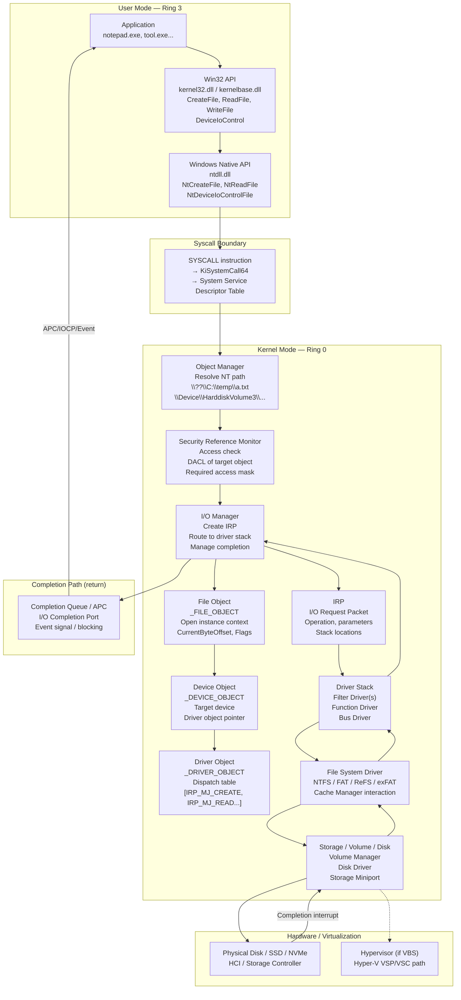
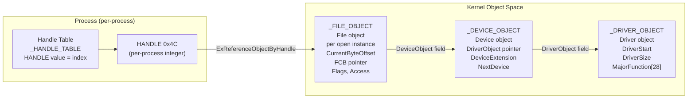
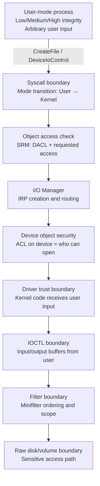
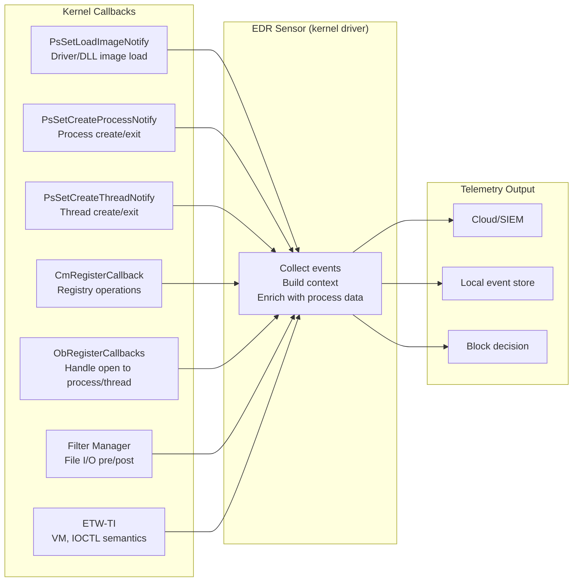
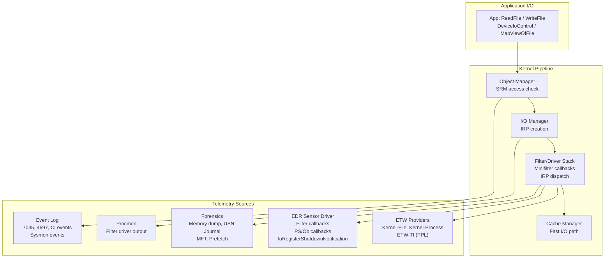

# Chương 6 — I/O System

> **Researcher note:** I/O system là cầu nối giữa user-mode API và kernel-mode driver operations. Mọi lần bạn gọi `CreateFile`, `ReadFile`, `WriteFile`, hay `DeviceIoControl` — bạn đang inject một request vào một pipeline chạy từ Win32 API xuống Object Manager, qua Security Reference Monitor, qua I/O Manager, xuống driver stack, rồi trả kết quả ngược lên. Hiểu pipeline này là điều kiện tiên quyết để phân tích file monitoring, IOCTL security, minifilter architecture, driver attack surface, và toàn bộ vùng kernel-mode interaction trong EDR design.

> **Public repo wording note:** Chương này mô tả Windows I/O system từ góc nhìn researcher: cơ chế hoạt động, telemetry footprint, forensic surface, và visibility limits. Mục đích là xây dựng mental model chính xác để phân tích, debug, và detect — không phải operational guide hay exploitation playbook.

---

## 0. Chapter Map

| Mục | Nội dung | Tại sao quan trọng |
|-----|----------|--------------------|
| 0 | Chapter Map | Điều hướng và kết nối các chương |
| 1 | Researcher Mindset | I/O không chỉ là đọc/ghi file |
| 2 | Big Picture | Toàn bộ pipeline từ app đến hardware |
| 3 | Key Terms | Từ điển thuật ngữ I/O system |
| 4 | Core Internals | CreateFile, objects, IRP, driver stack, IOCTL, async I/O, Fast I/O, PnP |
| 5 | Important Components | Bảng component + Object namespace + dispatch table + minifilter |
| 6 | Trust Boundaries | 7 ranh giới bảo mật của I/O system |
| 7 | Attack Surface Map | Bảng attack surface |
| 8 | Abuse Patterns | 8 bug class / threat model |
| 9 | EDR Telemetry | File I/O, driver/device, minifilter, ETW, limits |
| 10 | Forensic Artifacts | File system, service/driver, object namespace, memory |
| 11 | Debugging Notes | Procmon, WinObj, fltmc, driverquery, WinDbg, reversing |
| 12 | Labs | 6 bài thực hành |
| 13 | Researcher Mistakes | Bảng ≥16 sai lầm phổ biến |
| 14 | Version Notes | Thay đổi qua các phiên bản Windows |
| 15 | Summary | Tổng hợp |
| 16 | Research Questions | 12 câu hỏi mở |
| 17 | References | Tài liệu tham khảo |
| 18 | Illustration Plan | Kế hoạch diagram và screenshot |

**Kết nối với các chương khác:**

- **Chapter 2** (System Architecture): giới thiệu I/O Manager, Object Manager, driver model ở level overview. Chapter 6 đi sâu vào internals.
- **Chapter 3** (Processes and Jobs): process handles và object access là tiền đề. Mọi `HANDLE` trả về từ `CreateFile` đều đi qua handle table của process.
- **Chapter 4** (Threads): async I/O completion dùng APC, waiting thread, và I/O Completion Port — tất cả là thread-level mechanisms. `WrExecutive` wait reason thường là thread đang chờ I/O complete.
- **Chapter 5** (Memory Management): memory-mapped files là I/O qua `MapViewOfFile`; Cache Manager dùng section objects; MDL (Memory Descriptor List) lock pages trong RAM khi transfer data giữa driver và user buffer.
- **Chapter 7** (Security): object security descriptors, access checks, privileges — tất cả đều apply khi `CreateFile` và `DeviceIoControl` mở device handle.

Chapter 6 là nơi **API, objects, kernel drivers, file systems, filters, và telemetry gặp nhau**. Không có chapter nào phía sau không liên quan đến I/O system theo cách nào đó.

---

## 1. Researcher Mindset

**I/O system không chỉ là đọc và ghi file.**

Đây là misconception phổ biến nhất khi bắt đầu nghiên cứu Windows I/O. Trên thực tế, I/O system là **generic communication framework** giữa user-mode code và kernel-mode drivers. Nó phục vụ:

| Loại resource | Mở bằng | Backed bởi |
|---------------|---------|------------|
| Regular file | `CreateFile("C:\\temp\\a.txt", ...)` | File system driver (NTFS, FAT32) |
| Directory | `CreateFile(..., FILE_FLAG_BACKUP_SEMANTICS)` | File system driver |
| Volume | `CreateFile("\\\\.\\C:", ...)` | Volume driver + file system |
| Physical disk | `CreateFile("\\\\.\\PhysicalDrive0", ...)` | Disk/storage driver |
| Named pipe | `CreateFile("\\\\.\\pipe\\name", ...)` | Named pipe driver |
| Mailslot | `CreateFile("\\\\.\\mailslot\\name", ...)` | Mailslot driver |
| Device interface | `CreateFile("\\\\.\\SomeDevice", ...)` | Third-party kernel driver |
| Console | Internal | Console driver |
| Socket (Winsock) | Abstracted | AFD driver (Ancillary Function Driver) |

`CreateFile` là **generic entry point vào thế giới Object Manager + I/O Manager**. Tên hàm misleading — nó không create hay open "files" theo nghĩa thông thường. Nó resolve một object path, kiểm tra access, và trả về handle.

**Ba câu hỏi cần đặt ra với mọi I/O operation:**

1. **Ai là target driver?** — Object Manager resolve path → device object → driver object. Driver code là kernel code.
2. **Access mask là gì?** — Handle permissions restrict subsequent operations. `GENERIC_READ` vs `FILE_WRITE_DATA` vs `FILE_ALL_ACCESS` khác nhau hoàn toàn.
3. **Telemetry nào được tạo ra?** — Procmon, ETW, minifilter callbacks, Event Log tất cả có ngưỡng visibility riêng.

**Tại sao I/O system quan trọng cho researcher:**

**Defender perspective:**
- File operations (create, write, rename, delete) là primary telemetry surface cho malware detection
- Driver load/unload events là kernel-level threat signal
- IOCTL traffic đến third-party drivers là privileged communication channel thường bị undermonitored
- Minifilters là cơ chế chính mà AV/EDR sử dụng để intercept file I/O
- Raw disk/volume access là indicator cho bootkit, forensic tools, và data staging

**Attacker perspective:**
- I/O là nơi user input crosses into kernel — driver interfaces là kernel attack surface
- Device object ACLs determine who can reach kernel code via IOCTL
- Driver stacks có thể bị abused thông qua vulnerable signed drivers
- Named pipes và device interfaces là inter-process communication channels có thể bị impersonate/abuse

**Ví dụ cụ thể:**

```
Scenario 1 — File open:
  notepad.exe opens C:\temp\a.txt
  → CreateFileW() in kernel32.dll
  → NtCreateFile() in ntdll.dll
  → syscall → KiSystemCall64
  → Object Manager resolves "\??\C:\temp\a.txt"
  → Security Reference Monitor checks DACL of a.txt + volume
  → I/O Manager creates IRP_MJ_CREATE
  → NTFS file system driver handles request
  → Cache Manager involved if cached access
  → File object returned → handle in process handle table

Scenario 2 — Device IOCTL:
  tool.exe calls DeviceIoControl on \\.\SomeDriver
  → Device object ACL checked — can this process open?
  → IRP_MJ_DEVICE_CONTROL sent down driver stack
  → Driver dispatch routine receives IRP
  → Driver validates input, performs operation
  → Completes IRP, returns result to user mode

Scenario 3 — AV/EDR file scan:
  malware.exe writes to C:\temp\payload.bin
  → IRP_MJ_WRITE travels through filter stack
  → AV minifilter pre-operation callback fires
  → AV scans buffer content
  → AV allows or blocks the write
  → Operation completes or returns error to malware.exe
```

> **Researcher note:** Procmon là cửa sổ nhìn vào I/O system, nhưng không phải ground truth. Procmon thấy file system operations thông qua filter driver; nó không thấy mọi IRP đến mọi device, không thấy IOCTL detail của third-party drivers, và không thấy operations dưới một số cache/fast paths. Hiểu giới hạn này trước khi dùng Procmon để phân tích.

---

## 2. Big Picture

### 2.1 Toàn bộ I/O pipeline



### 2.2 Handle → object relationship



> **Researcher note:** `HANDLE` là per-process integer index vào process handle table — không phải kernel pointer. Hai processes có thể có cùng HANDLE value nhưng refer đến khác nhau object. Khi researcher nói "HANDLE 0x4", họ nói về index trong handle table của một process cụ thể.

---

## 3. Key Terms

| Thuật ngữ | Định nghĩa ngắn (Vietnamese) | Relevance cho researcher |
|-----------|-------------------------------|--------------------------|
| **I/O Manager** | Kernel component điều phối I/O requests — tạo IRP, route đến driver stack, quản lý completion | Entry point mọi I/O request kernel-mode |
| **Object Manager** | Kernel component quản lý named objects và namespace — resolve paths, track handles, manage lifetimes | Mọi `CreateFile` path đi qua đây trước |
| **File object** (`_FILE_OBJECT`) | Kernel struct đại diện một open instance — context per-handle, không phải per-file | Source of truth cho "một handle đang open gì" |
| **Device object** (`_DEVICE_OBJECT`) | Kernel struct đại diện một thiết bị/target được driver quản lý | Target cuối cùng của I/O request |
| **Driver object** (`_DRIVER_OBJECT`) | Kernel struct đại diện loaded driver — chứa dispatch table (array of function pointers) | Code entry points của driver |
| **Driver stack** | Chuỗi device objects xếp chồng lên nhau — request đi từ top xuống bottom | Filters live ở đây; giải thích tại sao nhiều driver xử lý một request |
| **IRP** | I/O Request Packet — kernel struct mô tả một I/O operation | Unit of work trong kernel I/O |
| **Major function code** | Index vào dispatch table của driver (IRP_MJ_CREATE, IRP_MJ_READ...) | Xác định loại operation |
| **Minor function code** | Sub-operation trong một major code | Ví dụ: IRP_MN_QUERY_DIRECTORY trong IRP_MJ_DIRECTORY_CONTROL |
| **Dispatch routine** | Function pointer trong driver object được gọi khi IRP đến | Entry point thực sự của driver cho một operation type |
| **Completion routine** | Callback đăng ký bởi driver higher in stack — gọi khi IRP complete từ bên dưới | Filter drivers dùng completion routines để post-process results |
| **CreateFile** | Win32 API mở handle đến file/device/pipe/volume — generic I/O entry point | Misleading name — opens anything backed by I/O Manager |
| **ReadFile / WriteFile** | Win32 API read/write data qua handle | Translates to NtReadFile / NtWriteFile → IRP_MJ_READ / IRP_MJ_WRITE |
| **DeviceIoControl** | Win32 API gửi control request đến device driver | Translates to NtDeviceIoControlFile → IRP_MJ_DEVICE_CONTROL |
| **IOCTL** | I/O Control Code — 32-bit value encoding operation + device type + method + access | Protocol identifier cho driver communication |
| **Buffering method** | Cách data transfer giữa user buffer và driver: BUFFERED, IN/OUT DIRECT, NEITHER | Security-critical — ảnh hưởng validation burden của driver |
| **Synchronous I/O** | Calling thread blocks cho đến khi operation hoàn thành | Default mode — thread wait reason = WrExecutive |
| **Asynchronous I/O** | Operation initiated, thread tiếp tục — notified khi complete | Overlapped I/O — cần OVERLAPPED struct |
| **Overlapped I/O** | Win32 mechanism cho async I/O dùng OVERLAPPED struct + Event hoặc IOCP | Server apps, high-throughput scenarios |
| **I/O Completion Port** (IOCP) | Kernel object queue nhận completion notifications — scalable async I/O | Thread pool + IOCP là pattern của mọi high-perf Windows server |
| **APC completion** | I/O hoàn thành bằng cách queue APC vào calling thread | Thread phải vào alertable wait; Chapter 4 APC mechanism |
| **File system driver** | Kernel driver implement file system semantics (NTFS, FAT, ReFS) | Cuối chuỗi xử lý file I/O operations |
| **Filter driver** | Driver insert vào stack để observe/modify/block requests | Legacy model — replaced by minifilters for most cases |
| **Minifilter driver** | Filter driver theo Filter Manager framework — altitude-based ordering | AV/EDR/DLP/encryption tools dùng minifilters để intercept file I/O |
| **Function driver** | Primary driver cho device — implement thiết bị chính | Actual "owner" của device |
| **Bus driver** | Driver quản lý bus (PCI, USB, ACPI) và enumerate child devices | Bottom of device stack |
| **Volume** | Logical storage partition với file system | `\\.\C:` hay `\\.\HarddiskVolume3` |
| **Device namespace** | NT object namespace chứa device objects (`\Device\...`) | Invisible to Explorer; visible in WinObj |
| **Symbolic link** | Object Manager symbolic link kết nối Win32 path với NT device path | `C:` → `\Device\HarddiskVolume3` |
| **`\Device`** | Root namespace directory chứa device objects | `\Device\Harddisk0\DR0`, `\Device\NamedPipe`, etc. |
| **`\GLOBAL??`** | Namespace chứa DOS device symbolic links (drive letters, `\\.\` targets) | `C:` → `\Device\...`; `PhysicalDrive0` → `\Device\...` |
| **`\\.\` path** | Win32 device path prefix — bypass normal file path parsing → device namespace | Researcher: direct bridge đến device objects |
| **Fast I/O** | Shortcut path không tạo IRP — cho cached file access | Performance optimization; filter callbacks phải handle Fast I/O separately |
| **Cache Manager** | Kernel component quản lý file cache dùng section objects | Liên kết với Chapter 5 — file reads thường served từ cache |
| **PnP Manager** | Plug and Play — discover, configure, start/stop devices | Device lifecycle management |
| **Power Manager** | Quản lý power states (S0–S5) và per-device D-states | Reliability/security issues trong power transition paths |
| **IRQL** | Interrupt Request Level — hardware priority context của code running | Driver code thường chạy ở IRQL DISPATCH_LEVEL (2) — nhiều restrictions |
| **MDL** | Memory Descriptor List — mô tả locked physical pages cho DMA/transfer | METHOD_IN_DIRECT / METHOD_OUT_DIRECT dùng MDLs |
| **User buffer** | Buffer trong user-mode address space — driver nhận từ user | Phải validate: address, length, alignment, accessibility |
| **Kernel buffer** | Buffer trong kernel address space — safe to access at IRQL ≥ 0 | METHOD_BUFFERED tạo kernel copy của user buffer |

---

## 4. Core Internals

### 4.1 CreateFile là generic I/O entry point

`CreateFileW` (trong `kernel32.dll`) không chỉ tạo hay mở files — nó là **generic handle-creation function** cho mọi thứ được expose qua I/O Manager.

**Call chain:**

```
CreateFileW (kernel32.dll)
  → NtCreateFile (ntdll.dll)
  → SYSCALL → KiSystemCall64
  → NtCreateFile (ntoskrnl.exe)
  → Object Manager: ObOpenObjectByName / ObpLookupObjectName
  → Path parsed: Win32 → NT namespace
  → Security Reference Monitor: access check
  → I/O Manager: IRP_MJ_CREATE → target driver
  → Handle inserted into process handle table
  → HANDLE returned to caller
```

**Win32 path → NT path conversion:**

| Win32 path | NT path sau conversion |
|------------|----------------------|
| `C:\temp\a.txt` | `\??\C:\temp\a.txt` → `\Device\HarddiskVolume3\temp\a.txt` |
| `\\.\C:` | `\??\C:` → `\Device\HarddiskVolume3` |
| `\\.\PhysicalDrive0` | `\??\PhysicalDrive0` → `\Device\Harddisk0\DR0` |
| `\\.\pipe\MyPipe` | `\??\pipe\MyPipe` → `\Device\NamedPipe\MyPipe` |
| `\\.\SomeDevice` | `\??\SomeDevice` → `\Device\SomeDevice` (if symlink exists) |
| `\\server\share\file` | UNC path → network redirector |

Prefix `\\.\` là **Win32 shortcut để bypass file path normalization và reach device namespace trực tiếp**. Researcher dùng đây để open raw volumes, devices, và driver interfaces.

**Researcher angle — HANDLE là access grant, không phải ownership:**

Khi `CreateFile` thành công, returned HANDLE đại diện một **granted access mask** — permission đã được checked tại thời điểm open. Operations sau đó (ReadFile, WriteFile, DeviceIoControl) sẽ kiểm tra xem handle có access tương ứng không, nhưng không recheck object security descriptor. Đây là lý do tại sao:

1. Việc duplicate handle (`DuplicateHandle`) không tự động inherit tất cả permissions của source — caller có thể specify subset.
2. Changing object DACL sau khi handle đã open không ảnh hưởng handle đó.
3. Attacker duplicate handle từ process khác (qua `OpenProcess` + `DuplicateHandle`) có thể access object mà họ không thể mở trực tiếp nếu họ có handle với PROCESS_DUP_HANDLE access.

**Key parameters của CreateFile:**

```c
HANDLE CreateFileW(
    LPCWSTR lpFileName,           // Path — Win32 hoặc device path
    DWORD dwDesiredAccess,        // GENERIC_READ|WRITE, FILE_READ_DATA, etc.
    DWORD dwShareMode,            // FILE_SHARE_READ|WRITE|DELETE — hay 0 (exclusive)
    LPSECURITY_ATTRIBUTES lpSA,   // Security attributes — thường NULL
    DWORD dwCreationDisposition,  // OPEN_EXISTING, CREATE_NEW, CREATE_ALWAYS, etc.
    DWORD dwFlagsAndAttributes,   // FILE_FLAG_OVERLAPPED, FILE_FLAG_NO_BUFFERING, etc.
    HANDLE hTemplateFile          // Template — thường NULL
);
```

**Flags quan trọng cho researcher:**

| Flag | Ý nghĩa | Relevance |
|------|---------|-----------|
| `FILE_FLAG_OVERLAPPED` | Async I/O — không block | Pattern của I/O Completion Ports |
| `FILE_FLAG_NO_BUFFERING` | Bypass cache — sector-aligned access required | Raw disk tools; disk forensics |
| `FILE_FLAG_BACKUP_SEMANTICS` | Cho phép open directory; bypass some access checks with SeBackupPrivilege | Backup tools; directory traversal |
| `FILE_FLAG_DELETE_ON_CLOSE` | File deleted khi last handle closed | Temp file patterns |
| `FILE_FLAG_OPEN_REPARSE_POINT` | Open reparse point trực tiếp, không follow | Junction/symlink analysis |
| `SECURITY_SQOS_PRESENT` | Security Quality of Service — impersonation level | Pipe server impersonation control |

### 4.2 File object, Device object, Driver object

Ba kernel structs này tạo thành **object chain** từ user handle đến driver code.

**`_FILE_OBJECT` — per open instance:**

```c
// _FILE_OBJECT key fields (simplified — WDK-specific, version-sensitive)
struct _FILE_OBJECT {
    // Identification
    PDEVICE_OBJECT DeviceObject;      // Target device
    PVPB           Vpb;               // Volume parameter block (if file system volume)
    PVOID          FsContext;         // File system specific — e.g., FCB (File Control Block)
    PVOID          FsContext2;        // File system specific — e.g., CCB (Context Control Block)

    // State
    LARGE_INTEGER  CurrentByteOffset; // File position pointer
    ULONG          Flags;             // FO_SYNCHRONOUS_IO, FO_ALERTABLE_IO, FO_NO_INTERMEDIATE_BUFFERING...
    BOOLEAN        ReadAccess;
    BOOLEAN        WriteAccess;
    BOOLEAN        DeleteAccess;

    // Completion
    KEVENT         Event;             // Signaled on synchronous I/O completion
    NTSTATUS       FinalStatus;       // Last I/O status

    // Name
    UNICODE_STRING FileName;          // Relative name used at open time
};
```

> **Researcher note:** `FsContext` và `FsContext2` là opaque cho I/O Manager — file system driver dùng chúng để store per-file-object context. NTFS dùng FCB (File Control Block) và CCB (Context Control Block). Khi forensics tìm file objects, traversal qua `FsContext` có thể reveal file system state không visible qua normal API.

**`_DEVICE_OBJECT` — per device:**

Driver có thể tạo multiple device objects. Mỗi device object có một security descriptor (DACL) kiểm soát ai có thể open handle đến nó. Device objects được linked thành danh sách qua `NextDevice` field trong `_DRIVER_OBJECT`.

**`_DRIVER_OBJECT` — per loaded driver:**

```c
// _DRIVER_OBJECT key fields (simplified)
struct _DRIVER_OBJECT {
    PVOID   DriverStart;              // Base address của driver image
    ULONG   DriverSize;               // Size of driver image
    PUNICODE_STRING DriverName;       // \Driver\<name>
    PDRIVER_EXTENSION DriverExtension;

    // Dispatch table — 28 entries indexed by IRP_MJ_*
    PDRIVER_DISPATCH MajorFunction[IRP_MJ_MAXIMUM_FUNCTION + 1];

    PDRIVER_UNLOAD  DriverUnload;     // Called when driver unloaded
    PDRIVER_ADD_DEVICE AddDevice;     // PnP — called when new device found
};
```

**Mental model: handle → object chain**

```
Process Handle Table
  HANDLE 0x4C → [Object Header] → _FILE_OBJECT
                                        │
                                        └─ DeviceObject → _DEVICE_OBJECT
                                                                │
                                                                └─ DriverObject → _DRIVER_OBJECT
                                                                                        │
                                                                                        └─ MajorFunction[IRP_MJ_READ]
                                                                                               │
                                                                                               └─ ntfs!NtfsRead (function pointer)
```

### 4.3 IRP — I/O Request Packet

**IRP là unit of work** trong kernel I/O system. Mỗi I/O operation được represented bởi một IRP struct được I/O Manager allocate và route qua driver stack.

**Conceptual IRP structure:**

```
IRP (I/O Request Packet)
├── Type và Size
├── MdlAddress          → MDL cho data buffer (Direct I/O)
├── Flags               → IRP_NOCACHE, IRP_SYNCHRONOUS_API...
├── AssociatedIrp
│   └── SystemBuffer    → Kernel buffer copy (Buffered I/O)
├── IoStatus
│   ├── Status          → NTSTATUS completion code
│   └── Information     → Bytes transferred
├── RequestorMode       → KernelMode hoặc UserMode — IMPORTANT
├── PendingReturned     → Driver called IoMarkIrpPending
├── Cancel              → TRUE nếu IRP đã bị cancelled
├── CancelRoutine       → Function to call if cancelled
│
└── Stack locations [N] (one per driver in stack)
    └── IO_STACK_LOCATION
        ├── MajorFunction  → IRP_MJ_CREATE / READ / WRITE / etc.
        ├── MinorFunction  → Sub-operation
        ├── DeviceObject   → This driver's device object
        ├── FileObject     → Associated file object
        ├── CompletionRoutine → Called when IRP completed from below
        ├── Parameters     → Operation-specific parameters
        │   ├── Create: desired access, share access, options
        │   ├── Read: length, byte offset, key
        │   ├── Write: length, byte offset, key
        │   └── DeviceIoControl: output buffer length, input buffer length, type3 input buffer, IOCTL code
        └── ...
```

> **Researcher note:** `RequestorMode` là field quan trọng nhất từ góc nhìn driver security. Khi IRP originates từ user mode, `RequestorMode = UserMode`. Driver phải treat tất cả parameters trong UserMode IRPs là untrusted — probe và validate trước khi dereference. Nếu IRP từ kernel mode (`KernelMode`), trust model khác. Race conditions xung quanh `RequestorMode` là source của một số bug classes.

**Major function codes quan trọng:**

| Code | Value | Ý nghĩa | Ai xử lý chủ yếu |
|------|-------|---------|-------------------|
| `IRP_MJ_CREATE` | 0x00 | Open/create file hoặc device | File system driver, device driver |
| `IRP_MJ_CLOSE` | 0x02 | Last handle closed | File system, device driver |
| `IRP_MJ_READ` | 0x03 | Read data | File system, device driver |
| `IRP_MJ_WRITE` | 0x04 | Write data | File system, device driver |
| `IRP_MJ_QUERY_INFORMATION` | 0x05 | Query file attributes/metadata | File system |
| `IRP_MJ_SET_INFORMATION` | 0x06 | Set file attributes/rename/delete | File system |
| `IRP_MJ_DIRECTORY_CONTROL` | 0x0C | Directory listing, notify | File system |
| `IRP_MJ_FILE_SYSTEM_CONTROL` | 0x0D | FSCTL — file system control codes | File system |
| `IRP_MJ_DEVICE_CONTROL` | 0x0E | IOCTL from user mode | Device driver |
| `IRP_MJ_INTERNAL_DEVICE_CONTROL` | 0x0F | IOCTL from kernel mode | Device driver |
| `IRP_MJ_CLEANUP` | 0x12 | Last handle closed (cleanup phase) | File system, device driver |
| `IRP_MJ_FLUSH_BUFFERS` | 0x09 | Flush cached data | File system, Cache Manager |
| `IRP_MJ_PNP` | 0x1B | Plug and Play operations | All drivers |
| `IRP_MJ_POWER` | 0x16 | Power management | All drivers |

**Sự khác biệt CLEANUP vs CLOSE:**
- `IRP_MJ_CLEANUP`: fired khi **last handle** đến file object được closed — nhưng có thể còn kernel references. File system flush pending writes tại đây.
- `IRP_MJ_CLOSE`: fired khi **object reference count drops to 0** — truly last reference gone. Cleanup có thể xảy ra trước close; close là final teardown.

### 4.4 Driver stack

Requests không đi thẳng đến một driver — chúng đi qua **chuỗi device objects xếp chồng**. Mỗi driver trong stack có thể:
- **Pass through** IRP xuống stack bên dưới (gọi `IoCallDriver`)
- **Complete** IRP ngay tại đây (gọi `IoCompleteRequest`)
- **Hold/pend** IRP và complete sau (async)
- **Modify** parameters trước khi pass down
- **Monitor** result via completion routine

**NTFS file access với AV minifilter — ví dụ stack:**

```
User: ReadFile(hFile, buf, 4096, ...)
  ↓
[IRP_MJ_READ]
  ↓
  ┌─────────────────────────────────────────┐
  │  Filter Manager (fltmgr.sys)            │  ← Intercept ở đây trước
  │  Pre-operation callbacks:               │
  │    AV Minifilter (altitude 320000)      │  ← AV scan
  │    Encryption filter (altitude 140000)  │  ← Decrypt on read
  └─────────────────────────────────────────┘
  ↓
  ┌─────────────────────────────────────────┐
  │  NTFS (ntfs.sys) — Function Driver      │  ← Actual file system logic
  │  Cache Manager interaction              │
  └─────────────────────────────────────────┘
  ↓
  ┌─────────────────────────────────────────┐
  │  Volume Manager (volmgr.sys)            │
  └─────────────────────────────────────────┘
  ↓
  ┌─────────────────────────────────────────┐
  │  Disk Driver (disk.sys)                 │
  └─────────────────────────────────────────┘
  ↓
  ┌─────────────────────────────────────────┐
  │  Storage Miniport (e.g., storport.sys)  │
  └─────────────────────────────────────────┘
  ↓
  Hardware / NVMe controller
```

**USB device request — ví dụ stack khác:**

```
[IRP_MJ_READ / WRITE / DEVICE_CONTROL]
  ↓
  Function driver: usbstor.sys (USB storage)
  ↓
  Bus driver: usbhub.sys (USB hub)
  ↓
  USB host controller driver (usbxhci.sys / usbehci.sys)
  ↓
  ACPI / PCI bus driver
  ↓
  USB hardware
```

> **Researcher note:** `IoAttachDevice` / `IoAttachDeviceToDeviceStack` là API mà legacy filter drivers dùng để insert vào stack. Minifilters dùng Filter Manager framework thay thế, tránh nhiều complexity của manual stack attachment. Khi reverse engineering một third-party driver, kiểm tra nó có gọi attach APIs không để hiểu loại driver.

### 4.5 IOCTL và DeviceIoControl

**DeviceIoControl** là cơ chế cho phép user-mode gửi custom control requests đến kernel driver.

```c
BOOL DeviceIoControl(
    HANDLE hDevice,           // Handle đến device (từ CreateFile)
    DWORD dwIoControlCode,    // IOCTL code — 32-bit identifier
    LPVOID lpInBuffer,        // Input data buffer
    DWORD nInBufferSize,      // Input buffer size
    LPVOID lpOutBuffer,       // Output data buffer
    DWORD nOutBufferSize,     // Output buffer size
    LPDWORD lpBytesReturned,  // Bytes actually written to output buffer
    LPOVERLAPPED lpOverlapped // NULL = synchronous; non-NULL = async
);
```

**IOCTL code structure — CTL_CODE macro:**

```c
// CTL_CODE(DeviceType, Function, Method, Access)
// Resulting 32-bit IOCTL code layout:
//
// Bits [31:16] — Device type (0x0000–0xFFFF; 0x8000+ = vendor-defined)
// Bits [15:14] — Required access (FILE_ANY_ACCESS, FILE_READ_ACCESS, FILE_WRITE_ACCESS)
// Bits [13:2]  — Function code (0x000–0x7FF = Microsoft; 0x800–0xFFF = vendor-defined)
// Bits [1:0]   — Transfer method (METHOD_BUFFERED=0, METHOD_IN_DIRECT=1,
//                                 METHOD_OUT_DIRECT=2, METHOD_NEITHER=3)
//
// Example:
#define IOCTL_DISK_GET_DRIVE_GEOMETRY  CTL_CODE(FILE_DEVICE_DISK, 0x0000, METHOD_BUFFERED, FILE_ANY_ACCESS)
// = 0x00070000
```

**Buffering methods — đây là security-critical:**

| Method | Cách data transfer | Driver nhận gì | Validation burden |
|--------|-------------------|-----------------|-------------------|
| `METHOD_BUFFERED` | I/O Manager copy user buffers → kernel buffer trước khi gọi driver | Kernel buffer pointer — safe to access | Thấp nhất — kernel buffer luôn valid |
| `METHOD_IN_DIRECT` | Input buffer: kernel copy; Output buffer: MDL của user pages (locked) | `Irp->MdlAddress` cho output | Medium — MDL được kernel validate khi lock |
| `METHOD_OUT_DIRECT` | Ngược lại với IN_DIRECT | `Irp->MdlAddress` cho output | Medium |
| `METHOD_NEITHER` | Driver nhận raw user pointers trực tiếp | `Parameters.DeviceIoControl.Type3InputBuffer` = raw user pointer | **Nhất cao** — driver phải tự probe/validate |

**Researcher angle — IOCTL là protocol boundary:**

IOCTL là một trong những attack surfaces rõ ràng nhất trong Windows kernel research vì:

1. **User-controlled input crosses privilege boundary** — input buffer đến từ user mode, được processed bởi kernel code
2. **Method = METHOD_NEITHER** đặt toàn bộ responsibility validation lên driver — missing `ProbeForRead`/`ProbeForWrite` → user pointer dereference bug classes
3. **Access bits trong CTL_CODE không thay thế authorization logic** — chúng là hints cho I/O Manager để kiểm tra handle access, nhưng driver phải verify caller intent riêng
4. **Device object ACL controls who can open the device** — không phải ai cũng có thể reach IOCTL handler; weak ACL = exposed attack surface to low-privileged callers

**Bug class taxonomy (conceptual — không phải exploitation guide):**

| Bug class | Cơ chế | Detection approach |
|-----------|--------|-------------------|
| Length check missing | Driver dereference `input[0]` mà không check `nInBufferSize >= sizeof(...)` | Fuzz input size; check arithmetic before access |
| Untrusted user pointer (METHOD_NEITHER) | Driver dereference Type3InputBuffer mà không `ProbeForRead` | Check `RequestorMode`; trace pointer use |
| Integer overflow | `size * count` overflow trước allocation | Boundary analysis; large value fuzzing |
| Confused deputy | Driver thực hiện privileged action thay caller mà không check caller authorization | Identify privilege escalation potential |
| TOCTOU | Check condition, then use data — user can modify between | Capture data into kernel buffer before check |
| Object lifetime | Object freed between check and use | Reference counting analysis |

> **Researcher note:** Khi phân tích IOCTL interface của third-party driver, không nhảy thẳng vào "có exploit không?". Đầu tiên map interface: device name → symbolic link → IOCTL codes → buffering methods → input/output structure. Một interface được design well với METHOD_BUFFERED và proper validation có bug surface rất khác với interface dùng METHOD_NEITHER và trust user pointers.

### 4.6 Synchronous vs Asynchronous I/O

**Synchronous I/O (default):**

```
Thread calls ReadFile(...)
→ NtReadFile → IRP_MJ_READ created
→ Thread enters WAIT state (WrExecutive wait reason)
→ Driver processes IRP
→ IoCompleteRequest fires
→ Kernel signals file object event
→ Thread wakes up
→ ReadFile returns với data
```

Calling thread bị block suốt quá trình. Thích hợp cho interactive apps nhưng không scale tốt.

**Overlapped (Asynchronous) I/O:**

```c
// Setup
OVERLAPPED ov = {0};
ov.hEvent = CreateEvent(NULL, TRUE, FALSE, NULL);

// Initiate — không block
ReadFile(hFile, buf, 4096, NULL, &ov);  // Returns FALSE + ERROR_IO_PENDING

// Do other work...

// Wait for completion
WaitForSingleObject(ov.hEvent, INFINITE);
DWORD bytesRead;
GetOverlappedResult(hFile, &ov, &bytesRead, TRUE);
```

**Hai completion mechanisms:**

| Mechanism | Cách notify | Pattern |
|-----------|------------|---------|
| Event | `hEvent` trong OVERLAPPED signaled | Đơn giản; one event per operation |
| APC | Callback queued vào calling thread | Thread phải trong alertable wait (`SleepEx`, `WaitForSingleObjectEx`) |
| I/O Completion Port | Completion packet queued vào IOCP | Scalable; thread pool dequeue completions |

**I/O Completion Port (IOCP) — high-performance pattern:**

```
Server dùng IOCP:
  ├── CreateIoCompletionPort → create IOCP kernel object
  ├── CreateFile + AssociateWithIOCP → link file handles
  ├── Post ReadFile/WriteFile (overlapped) → không block
  ├── Worker threads: GetQueuedCompletionStatus → block until completion arrives
  └── On completion: process data, post next I/O

Windows HTTP.sys, named pipe servers, database engines dùng IOCP.
```

**Connection với Chapter 4 (Threads):**

- Synchronous I/O: thread wait reason = `Executive` (0) hoặc `WrExecutive` — waiting on I/O completion
- Alertable wait dùng APCs: thread phải call `SleepEx(..., TRUE)` hay `WaitForSingleObjectEx(..., TRUE, TRUE)`
- IOCP: thread pool threads blocked trên `GetQueuedCompletionStatus` — wait reason = `WrQueue`

### 4.7 Fast I/O và Cache Manager

**Fast I/O** là shortcut path cho cached file access — **không tạo IRP**.

Khi file system driver support Fast I/O và điều kiện thỏa mãn (data in cache, no locks, etc.), I/O Manager gọi `FAST_IO_DISPATCH` function pointer thay vì tạo IRP.

**Quyết định Fast I/O vs IRP:**

```
ReadFile called
  → I/O Manager checks: does driver have Fast I/O dispatch table?
  → I/O Manager calls FastIoRead
  → Driver (NTFS) checks: is data in cache? no locks? aligned?
  → If YES → serve from cache directly → return TRUE
  → If NO → return FALSE → I/O Manager falls back to IRP path
```

**Tác động với minifilters:**

Filter Manager expose Fast I/O callbacks riêng cho minifilters. Minifilters phải register cả IRP callbacks **và** Fast I/O callbacks nếu muốn intercept tất cả file operations. Một minifilter chỉ register IRP path sẽ miss Fast I/O operations.

**Cache Manager và Chapter 5 connection:**

Cache Manager quản lý file cache dùng **section objects** (Chapter 5). Khi file đọc vào cache, nó là một memory-mapped view của file. Subsequent reads có thể served từ memory (page fault resolves từ mapped section) mà không cần disk I/O.

```
File read path qua cache:
  NTFS Fast I/O / CcCopyRead
  → Cache Manager: có data trong cache không?
    → YES: copy từ cached section → user buffer
    → NO: trigger page fault → Section object → disk read → cache populated
```

> **Researcher note:** Memory-mapped file reads (qua `MapViewOfFile` + memory access) bypass traditional `ReadFile`/`WriteFile` telemetry. EDR muốn monitor file content read/write phải intercept ở minifilter level (IRP_MJ_READ callbacks) hoặc track memory mapping events (ETW-TI MAPVIEW). Đây là một trong những visibility gaps quan trọng nhất trong file I/O monitoring.

### 4.8 PnP và Power Manager

**Plug and Play (PnP) Manager:**

PnP Manager phát hiện, configure, và quản lý lifecycle của devices. Khi hardware xuất hiện (USB insert, PCIe device at boot), PnP:

1. Discovers device via bus driver (enumerate child devices)
2. Finds appropriate function driver (driver matching via INF)
3. Builds device stack: bus driver → function driver → (optional filters)
4. Sends IRP_MJ_PNP with minor codes:
   - `IRP_MN_START_DEVICE` — start device
   - `IRP_MN_STOP_DEVICE` — stop (resource rebalance)
   - `IRP_MN_REMOVE_DEVICE` — remove
   - `IRP_MN_SURPRISE_REMOVAL` — unexpected removal (USB pull)

**Research relevance:** PnP devices có thể load driver code dynamically. Driver loaded qua PnP vẫn phải pass Code Integrity checks (nếu HVCI enabled). PnP device interfaces (exposed via `IoRegisterDeviceInterface`) tạo nên các `\\.\` paths mà user mode có thể open.

**Power Manager:**

Quản lý system power states (S0 = running, S1–S3 = sleep, S4 = hibernate, S5 = off) và per-device power states (D0 = fully on, D1–D3 = sleeping).

Drivers nhận `IRP_MJ_POWER` với minor codes như `IRP_MN_SET_POWER`, `IRP_MN_QUERY_POWER`. Bugs trong power transition code (suspended state → resume) là source của nhiều reliability issues và occasionally security issues (state restored incorrectly after sleep).

---

## 5. Important Windows Components / Structures

| Component | Role | Researcher angle | Useful tools |
|-----------|------|------------------|--------------|
| **I/O Manager** | Tạo IRPs, route đến driver stack, quản lý completion | Trung tâm của mọi I/O pipeline | WinDbg `!irp`, `!fileobj` |
| **Object Manager** | Resolve NT paths, quản lý object lifetime, handle tables | Mọi CreateFile path đi qua đây | WinObj, WinDbg `!object` |
| **Security Reference Monitor** | Access check DACL của target object | Gate trước khi I/O request được tạo | WinDbg `!token`, `!sd` |
| **File object** (`_FILE_OBJECT`) | Per-open-instance context — current offset, flags, access | Source of truth cho "handle đang point đến gì" | WinDbg `!fileobj` |
| **Device object** (`_DEVICE_OBJECT`) | Represents target device; has security descriptor; linked in stack | Object với ACL — attack surface entry point | WinDbg `!devobj`, WinObj |
| **Driver object** (`_DRIVER_OBJECT`) | Loaded driver; chứa dispatch table | Kernel code; mọi IRP dispatch qua đây | WinDbg `!drvobj`, `lm` |
| **IRP** | I/O Request Packet — operation descriptor | Unit of work — forensics/debug: inspect in-flight operations | WinDbg `!irp` |
| **I/O stack location** | Per-driver slice của IRP — parameters, completion routine | Trace how each driver processes IRP | WinDbg `!irp` detail |
| **Dispatch routine** | Function pointer called when IRP arrives at driver | Kernel code entry — reverse engineering target | WinDbg `!drvobj` |
| **Completion routine** | Called when IRP completes from below | Filter driver post-processing; set per stack location | WinDbg `!irp` stack |
| **MDL** | Memory Descriptor List — describes locked physical pages | Direct I/O — driver access user pages via MDL | WinDbg `!mdl` |
| **Section object / Cache** | File cache backed by section objects | Memory-mapped reads bypass I/O event logging | WinDbg `!ca`, VMMap |
| **Cache Manager** | Manages file cache via sections | File read may not hit disk — cache state matters | Process Explorer, VMMap |
| **File system driver** | NTFS, FAT32, ReFS, exFAT — implement file semantics | Final processor of file I/O operations | WinDbg, fltmc |
| **Minifilter manager** (`fltmgr.sys`) | Framework for filter drivers — altitude-based ordering | AV/EDR intercept file I/O here | `fltmc`, WinDbg `!fltkd` |
| **PnP Manager** | Device discovery, configuration, driver loading | Dynamic driver loading — device interface exposure | devmgmt.msc, WinDbg |
| **Power Manager** | System and device power state transitions | Power IRPs — reliability bugs, state confusion | WinDbg power extensions |
| **Volume manager** (`volmgr.sys`) | Abstract physical disks into logical volumes | Sits between file system and disk drivers | WinDbg `!devstack` |
| **Storage stack** | `disk.sys`, `storport.sys`, miniport drivers | Bottom of file I/O stack; raw disk access path | WinDbg, driverquery |
| **Device interface** | Published device access path via `IoRegisterDeviceInterface` | Creates `\\.\` accessible paths | devcon, WinObj, driverquery |
| **Symbolic link** | Object Manager name mapping | Drive letters, `\\.\` device paths | WinObj `\GLOBAL??` |

### 5.1 Object namespace và devices

Windows có một **object namespace** mà kernel quản lý, hoàn toàn khác với file system namespace mà Explorer hiển thị.

```
Object Manager Namespace (partial):
\
├── Device\                   ← Device objects
│   ├── HarddiskVolume1       ← Volume (= C: partition)
│   ├── HarddiskVolume2
│   ├── Harddisk0\
│   │   └── DR0               ← Physical disk 0
│   ├── NamedPipe\            ← Named pipe directory
│   ├── Mup\                  ← Multiple UNC provider
│   ├── Tcp                   ← TCP device (Winsock backend)
│   ├── Nsi                   ← Network Store Interface
│   └── <third-party drivers>
│
├── GLOBAL??\                 ← DOS device symbolic links
│   ├── C:         → \Device\HarddiskVolume1
│   ├── D:         → \Device\CdRom0
│   ├── PhysicalDrive0 → \Device\Harddisk0\DR0
│   ├── pipe\      → \Device\NamedPipe
│   └── <device interfaces>
│
├── Driver\                   ← Driver objects
│   ├── ntfs
│   ├── disk
│   ├── fltmgr
│   └── ...
│
├── FileSystem\               ← File system registrations
├── KnownDlls\                ← Pre-loaded system DLLs
├── Sessions\                 ← Per-session objects
│   └── <session_id>\
│       └── DosDevices\       ← Per-session device mappings
└── ...
```

**Win32 path conversion:**

Khi user mode gọi `CreateFile("C:\\temp\\a.txt")`:
1. `kernel32.dll` converts thành `\??\C:\temp\a.txt`
2. `\??\` là symbolic link trỏ đến `\GLOBAL??` (hoặc per-session `\Sessions\N\DosDevices\`)
3. Object Manager resolve `C:` trong `\GLOBAL??` → `\Device\HarddiskVolume1`
4. Final path: `\Device\HarddiskVolume1\temp\a.txt`

Khi user mode gọi `CreateFile("\\\\.\\PhysicalDrive0")`:
1. `\\.\` converts thành `\??\`
2. `\??\PhysicalDrive0` → `\GLOBAL??\PhysicalDrive0` → `\Device\Harddisk0\DR0`
3. Access check trên device object

> **Researcher note:** WinObj (Sysinternals) cho phép inspect toàn bộ object namespace. Đây là tool không thể thiếu khi nghiên cứu driver interfaces — tìm device objects trong `\Device`, tìm symbolic links trong `\GLOBAL??`, xác nhận path mapping từ Win32 đến NT. Explorer không hiển thị gì về namespace này.

**Per-session DosDevices:**

`\Sessions\N\DosDevices\` là per-session device mapping. Service chạy trong session 0 thấy `\GLOBAL??`. User processes trong interactive session có thể có device mappings riêng (e.g., mapped network drives). Named pipe servers trong session 0 và clients trong session 1 cần careful về namespace paths.

### 5.2 Driver object và dispatch table

Driver object chứa **dispatch table** — array of 28 function pointers, một cho mỗi IRP major function code.

```
_DRIVER_OBJECT.MajorFunction[] = {
    [0x00] IRP_MJ_CREATE         → ntfs!NtfsCreate
    [0x02] IRP_MJ_CLOSE          → ntfs!NtfsClose
    [0x03] IRP_MJ_READ           → ntfs!NtfsRead
    [0x04] IRP_MJ_WRITE          → ntfs!NtfsWrite
    [0x05] IRP_MJ_QUERY_INFO     → ntfs!NtfsQueryInformation
    [0x06] IRP_MJ_SET_INFO       → ntfs!NtfsSetInformation
    [0x0C] IRP_MJ_DIR_CTRL       → ntfs!NtfsDirectoryControl
    [0x0E] IRP_MJ_DEVICE_CTRL    → ntfs!NtfsDeviceControl
    [0x12] IRP_MJ_CLEANUP        → ntfs!NtfsCleanup
    ...
    [unsupported major codes]    → nt!IopInvalidDeviceRequest
}
```

Khi driver không implement một major function, I/O Manager registers `IopInvalidDeviceRequest` — returns `STATUS_INVALID_DEVICE_REQUEST`. Researcher không nên assume mọi IRP major code đều supported bởi mọi driver.

**Version sensitivity:** Dispatch table offset và structure layout là WDK/Windows-version specific. Khi reverse engineering a driver, verify offsets bằng symbols hoặc known pattern matching thay vì hardcode struct offsets.

### 5.3 Minifilter manager và altitudes

**Filter Manager (`fltmgr.sys`)** là framework cho minifilter drivers. Nó giải quyết nhiều complexity của legacy filter drivers:

- Altitude-based ordering (không cần manual stack attachment)
- Callbacks cho pre/post operations
- Proper handle context management
- Volume attach/detach lifecycle
- Unload support

**Altitude:** Mỗi minifilter registered với một altitude number (string dạng "320000"). Altitude xác định thứ tự trong filter stack:

```
Altitude ranges (Microsoft-assigned):
  420000–429999  — Anti-malware (FSFilter Anti-Virus)
  320000–329999  — Encryption (FSFilter Encryption)
  260000–269999  — Compression (FSFilter Compression)
  180000–189999  — Quota management (FSFilter Quota Management)
  140000–149999  — Continuous Backup (FSFilter Continuous Backup)
  080000–089999  — Copy protection (FSFilter Copy Protection)
  020000–029999  — System (FSFilter System)
  ...

Higher altitude number = closer to user (first to see operation)
Lower altitude number = closer to storage (last before file system)
```

**Minifilter callbacks:**

```c
// Minifilter registration (simplified)
FLT_OPERATION_REGISTRATION callbacks[] = {
    { IRP_MJ_CREATE,    0,  PreCreate,  PostCreate  },
    { IRP_MJ_READ,      0,  PreRead,    PostRead    },
    { IRP_MJ_WRITE,     0,  PreWrite,   PostWrite   },
    { IRP_MJ_SET_INFO,  0,  PreSetInfo, PostSetInfo },
    { IRP_MJ_CLEANUP,   0,  PreCleanup, NULL        },
    FLT_OPERATION_REGISTRATION_END
};
```

- **Pre-operation callback**: fires trước khi operation xuống dưới. Filter có thể: allow (return `FLT_PREOP_SUCCESS_WITH_CALLBACK`), block (complete IRP), modify parameters, hoặc pend request.
- **Post-operation callback**: fires sau khi operation complete từ bên dưới. Filter có thể inspect/modify result.

**Tại sao minifilters không phải "thấy tất cả":**

1. **Fast I/O** phải được handled riêng — không qua IRP path
2. **Memory-mapped file access** không tạo IRP_MJ_READ — không trigger minifilter read callbacks
3. **Kernel-originated I/O** (từ driver khác, `IRP_MJ_INTERNAL_DEVICE_CONTROL`) có thể bypass user-mode-facing filter setup
4. **Altitude gaps**: một filter ở altitude 320000 không thấy operations giữa altitude 140000 và file system
5. **Reparse points và junctions** có thể redirect operations theo cách không linear

> **Researcher note:** `fltmc` (command line) là quick inventory tool. `fltmc filters` liệt kê loaded minifilters và altitudes. `fltmc instances` liệt kê instances của mỗi filter trên mỗi volume. Khi phân tích EDR coverage, đây là first step để hiểu filter landscape trên machine.

---

## 6. Trust Boundaries



### 6.1 User mode ↔ Kernel driver boundary

Đây là ranh giới quan trọng nhất. Khi user-mode code gọi `DeviceIoControl` hoặc thực hiện I/O, request crosses từ unprivileged Ring 3 vào privileged Ring 0 kernel code.

**Kernel phải treat toàn bộ user-mode input là untrusted:**

- **Buffer address**: có thể không valid, có thể null, có thể point đến kernel space
- **Buffer length**: có thể 0, có thể cực lớn (overflow), có thể không match actual content
- **Embedded pointers**: user buffer có thể chứa pointers — kernel không được dereference mà không validate
- **Object names/handles**: user-provided handle có thể bị closed hoặc reused giữa validation và use
- **Caller mode**: `RequestorMode` phải checked — same code path có thể nhận cả user và kernel mode requests

**Hậu quả của bug trong driver:**

Một bug trong kernel driver không gây crash process — nó gây BSOD (Blue Screen of Death) cho toàn bộ system. Privilege escalation bugs cho phép low-privileged user execute code tại Ring 0.

### 6.2 Handle / access boundary

Khi `CreateFile` succeed, returned HANDLE có một **access mask** được granted tại thời điểm open. Subsequent operations check handle access mask, không recheck object DACL.

**Access mask examples:**

| Access requested | Cho phép |
|----------------|---------|
| `GENERIC_READ` | ReadFile, QueryInformation |
| `GENERIC_WRITE` | WriteFile, SetInformation |
| `FILE_READ_DATA \| FILE_WRITE_DATA` | Read và write data, không meta |
| `FILE_ALL_ACCESS` | Tất cả — full access |
| `FILE_WRITE_ATTRIBUTES` | Thay đổi timestamps |

**Handle duplication attack surface:**

```
1. Process A: OpenProcess(PROCESS_DUP_HANDLE, ...) → handle to Process B
2. DuplicateHandle(Process B handle → own handle of device X)
3. Now có handle đến device X với specified access — bypass device ACL check
   (ACL was checked when Process B opened it, not now)
```

Đây là lý do tại sao `PROCESS_DUP_HANDLE` access là sensitive — caller có thể inherit handles từ processes với higher privilege.

### 6.3 Device object ACL boundary

Mỗi device object có **security descriptor** với DACL. Khi user mode gọi `CreateFile("\\\\.\\SomeDevice")`, SRM check DACL của device object trước khi cho phép open.

**Vấn đề với weak device ACL:**

```
Device object ACL: Everyone: GENERIC_READ | GENERIC_WRITE
→ Any user on the system có thể open handle
→ Any user có thể send IOCTLs
→ If IOCTLs perform privileged operations → privilege escalation
```

Nhiều third-party drivers (và đôi khi legacy Microsoft drivers) expose device với `Everyone` (hoặc `World`) access — nghĩa là bất kỳ low-privileged user nào cũng có thể open handle và gửi IOCTLs.

**Phân biệt:** device namespace visibility (thấy trong WinObj) không equal open permission. Object có thể exist trong namespace nhưng chỉ SYSTEM hoặc Administrators mới có thể open nó.

### 6.4 IOCTL boundary

IOCTL là **protocol boundary** — driver phải validate tất cả parameters như một network service validate input:

| Cần validate | Lý do |
|-------------|-------|
| Input buffer length ≥ expected size | Buffer underread → access beyond end |
| Output buffer length ≥ minimum needed | Buffer overflow into user space nếu driver write quá nhiều |
| Input buffer content range checks | Embedded offsets, lengths, indices phải trong bounds |
| Pointer values (METHOD_NEITHER) | User pointer có thể point bất cứ đâu |
| Caller mode (RequestorMode) | Kernel-originated IOCTL có thể bypass user input assumptions |
| Caller identity/privilege | Không phải mọi caller nên có same capabilities |
| Object handle validity | Handles embedded in IOCTL input có thể be invalid |
| Object lifetime | Object referenced by IOCTL phải không bị freed trong operation |

**CTL_CODE access bits — không phải replacement cho authorization:**

Access bits trong CTL_CODE cho I/O Manager biết handle phải có `FILE_READ_ACCESS` hay `FILE_WRITE_ACCESS`. Nhưng đây chỉ là pre-check ở I/O Manager level. Driver vẫn phải implement proper authorization logic cho từng IOCTL — "caller có handle với write access" không đồng nghĩa với "caller được phép thực hiện IOCTL này với these parameters".

### 6.5 File system filter boundary

Minifilter ordering tạo ra **implicit trust relationships**:

- Filter ở altitude cao hơn có thể modify parameters trước khi filter thấp hơn thấy chúng
- Filter ở altitude thấp hơn thấy "sanitized" version của operation — có thể bị fed modified context
- **Altitude confusion**: nếu malicious driver ở altitude phù hợp, nó có thể see requests trước AV filter (altitude cao hơn là higher priority)

**Reentrancy hazard:** Minifilter callbacks không được tạo new I/O operations đến cùng volume mà không handle reentrancy — deadlock risk. Filter Manager có mechanisms cho "pageable file I/O from filter context" nhưng phải được dùng correctly.

### 6.6 PnP / Power boundary

PnP device state transitions tạo ra complex state machines trong drivers. Bugs xuất hiện tại:

- **Surprise removal** (USB pulled): driver phải handle in-flight IRPs gracefully — cancel, wait, không crash
- **Suspend/resume**: device state phải restore correctly — nếu không, device có thể be in undefined state
- **Resource rebalance**: stop device → release resources → restart — resource leak bugs ở đây

Security relevance: power state transitions có thể affect security-critical devices (smart card readers, crypto hardware, biometric sensors). State confusion sau resume có thể lead to security validation bypass in edge cases.

### 6.7 Raw disk / volume boundary

Raw disk/volume access là sensitive access path:

- `\\.\PhysicalDrive0` → raw bytes of physical disk, bypassing file system
- `\\.\C:` → volume access (may or may not allow raw sector read depending on privilege)
- Direct I/O: file system metadata, partition table, boot sector đều accessible

**Access control:** Windows kiểm tra process token và volume state trước khi allow raw access. Administrator privilege thường required cho physical drive raw access. Volume locks required cho exclusive access.

**Context matters:** Forensic tools, disk imaging software, backup tools, và disk editors dùng raw disk access legitimately. Malware dùng raw disk access để bypass file system locks, access deleted data, hoặc manipulate boot sectors. Context của process (signer, path, parent, timing, volume) phải được consider khi evaluating raw access telemetry.

---

## 7. Attack Surface Map

> **Note:** Section này là threat model / attack surface taxonomy. Mục đích là giúp researcher hiểu surface để analyze, detect, và design better defenses — không phải exploitation guide.

| Surface | Examples | Boundary crossed | What to observe | Research value |
|---------|----------|-----------------|-----------------|----------------|
| **CreateFile file paths** | `C:\...\payload.exe`, ADS paths, reparse | Object Manager path resolution | IRP_MJ_CREATE, file create events, path components | File create/open telemetry |
| **NT object paths** | `\Device\...`, `\??\...` | Object Manager namespace | Object open, handle creation | Device open tracking |
| **Device symbolic links** | `\\.\PhysicalDrive0`, `\\.\pipe\name` | `\GLOBAL??` symlink resolution | Handle to device objects | Device access patterns |
| **File handles (data)** | `ReadFile`, `WriteFile` to opened file | File system driver | IRP_MJ_READ/WRITE, file object | Content access telemetry |
| **Device handles (control)** | `DeviceIoControl` to driver device | IOCTL boundary, driver code | IOCTL code, input size, caller | Driver communication audit |
| **Named pipes** | `CreateNamedPipe`, `ConnectNamedPipe`, client `CreateFile("\\\\.\\pipe\\...")` | Inter-process boundary, session boundary | Pipe create, connect, read/write | IPC and lateral movement paths |
| **Mailslots** | `CreateMailslot`, `CreateFile("\\\\.\\mailslot\\...")` | Inter-process, network | Mailslot open/use | Legacy IPC paths |
| **Volumes** | `\\.\C:`, `\\.\HarddiskVolume3` | Volume driver, file system lock | Volume open handle, admin context | Volume manipulation |
| **Raw disk paths** | `\\.\PhysicalDrive0` | Disk driver, no file system | Physical disk open, IOCTL_DISK_* | Bootkit, forensic, staging |
| **IOCTLs (first-party)** | `IOCTL_DISK_GET_DRIVE_GEOMETRY`, `FSCTL_GET_RETRIEVAL_POINTERS` | Device driver boundary | IOCTL codes, frequency, result | Disk/FS information gathering |
| **IOCTLs (third-party)** | Vendor driver IOCTL interfaces | Third-party kernel code | IOCTL to unknown devices, unusual drivers | BYOVD surface, privilege escalation |
| **Driver service registry keys** | `HKLM\SYSTEM\CurrentControlSet\Services\<driver>` | Registry → driver load | Service ImagePath change, Start value | Persistence, driver substitution |
| **Loaded drivers** | Kernel modules mapped into ntoskrnl.exe address space | Kernel code integrity | New driver loads, lm in WinDbg | Kernel-level implants |
| **Minifilter callbacks** | Pre/post IRP_MJ_CREATE, WRITE, SET_INFO | Filter boundary | Filter registration, altitude, instances | EDR/AV filter presence |
| **Fast I/O callbacks** | Fast I/O read/write paths | Fast I/O dispatch table | Fast I/O vs IRP path split | Visibility gaps in monitoring |
| **File system paths** | NTFS, ReFS operations | File system driver | File system events, FSCTLs | Specialized FS operations |
| **Reparse points** | Junctions, symlinks, mount points | Object Manager, file system | IRP with reparse; path redirection | Path confusion, TOCTOU |
| **Alternate Data Streams** | `file.exe:stream` | NTFS layer | ADS create/open in Procmon | Data hiding surface |
| **PnP device interfaces** | `IoRegisterDeviceInterface` exposed paths | PnP + device object ACL | New device interface appearance | Driver exposure changes |
| **ETW providers** | Microsoft-Windows-Kernel-File, etc. | ETW subsystem | Provider enable/disable, session tampering | Telemetry integrity |
| **Event Log driver/service events** | Event IDs 7045, 4697, 6 | Windows Event Log | Service create, driver install | Persistence detection |
| **Procmon-visible operations** | File, registry, network, process ops | Filter driver + ETW | Procmon output + stack traces | Interactive investigation |
| **WinDbg driver/device objects** | `!drvobj`, `!devobj`, `!devstack` | Kernel debugger | Object graph, dispatch table | Driver structure analysis |

---

## 8. Abuse Patterns — Concept Level

> **Note:** Section này mô tả các bug classes và threat model scenarios từ góc nhìn researcher để hiểu detection và defense. Không có exploit chain hoặc weaponized code.

### 8.1 Weak device ACL class

**Cơ chế:**

Driver tạo device object với security descriptor quá rộng — ví dụ `Everyone: GENERIC_READ | GENERIC_WRITE` hoặc `Authenticated Users: FILE_ALL_ACCESS`. Low-privileged user (Medium integrity, non-admin) có thể open handle đến device.

**Consequence chain:**

```
Low-privileged user
  → CreateFile("\\\\.\\VulnerableDriver") — SUCCEED (ACL allows)
  → DeviceIoControl(hDevice, IOCTL_DO_PRIVILEGED_THING, ...)
  → Driver executes privileged kernel operation without authorization check
  → Privilege escalation
```

**Detection:**

- Audit device object ACLs: WinObj → `\Device\<name>` → Properties → Security
- Monitor handle creation to `\Device\` namespace objects từ low-privileged processes
- Correlate: which processes open which device paths, with what access

**Key question khi phân tích driver:** Default device security descriptor là gì? Nếu `IoCreateDevice` được gọi mà không explicitly set DACL sau đó, default security thường là World-accessible.

### 8.2 Dangerous IOCTL design class

**Cơ chế:**

IOCTL handler trong driver accept input và thực hiện powerful kernel operation (write arbitrary physical memory, map kernel memory to user, execute code as SYSTEM, etc.) với poor validation.

**Design failures:**

1. **Driver quá powerful**: một IOCTL code cho phép map arbitrary kernel memory vào user space — không có legitimate use case cần tất cả users có capability này
2. **No caller check**: driver không check nếu caller có appropriate privilege hay là expected caller process
3. **Buffer validation missing**: driver trust input length, embedded offsets, hoặc embedded pointers

**Detection approach:**

- `driverquery /v` → identify third-party drivers
- Map IOCTL codes exposed bởi driver (reverse engineering dispatch routine)
- Cross-reference driver với known vulnerable driver databases
- Monitor unusual IOCTL traffic from non-vendor processes

### 8.3 METHOD_NEITHER misuse class

**Cơ chế:**

Driver khai báo IOCTL với `METHOD_NEITHER`. I/O Manager không copy hay lock user buffers — driver nhận raw user-mode pointers trong `Parameters.DeviceIoControl.Type3InputBuffer`.

**Validation requirements (often missing):**

```c
// Driver phải do tất cả những điều này:
if (irpSp->Parameters.DeviceIoControl.InputBufferLength < sizeof(MY_INPUT)) {
    status = STATUS_BUFFER_TOO_SMALL;
    goto done;
}

__try {
    // ProbeForRead validates: accessible, aligned, right size
    ProbeForRead(
        irpSp->Parameters.DeviceIoControl.Type3InputBuffer,
        irpSp->Parameters.DeviceIoControl.InputBufferLength,
        __alignof(MY_INPUT)
    );

    // Copy to kernel buffer BEFORE validation — prevent TOCTOU
    RtlCopyMemory(&localCopy, 
        irpSp->Parameters.DeviceIoControl.Type3InputBuffer,
        sizeof(MY_INPUT));
} __except(EXCEPTION_EXECUTE_HANDLER) {
    status = GetExceptionCode();
    goto done;
}

// Now validate localCopy — user cannot modify it anymore
```

**Missing any of these steps** tạo exploitable conditions:
- Missing `ProbeForRead` → driver dereferences unvalidated user pointer → kernel read from arbitrary address
- No `__try/__except` → access violation in kernel → BSOD or worse
- Check-then-use without copy → TOCTOU: user thread modifies buffer between `ProbeForRead` and use

### 8.4 Confused deputy driver class

**Cơ chế:**

User-mode caller asks driver to perform privileged action on their behalf — opening a file, accessing a device, impersonating a token — but driver không verify caller's authorization to request that specific action.

**Example pattern:**

```
User calls: IOCTL_OPEN_FILE_AS_SYSTEM(path = "C:\sensitive\secret.txt")
Driver: opens file using driver's own SYSTEM token, returns handle to user
Result: user reads file they cannot access directly
```

**Correct approach:** driver should impersonate caller's token trước khi performing operations on caller's behalf, hoặc explicitly check caller's access to target object. `IoGetCurrentIrpStackLocation → FileObject → ... caller token` path để verify.

### 8.5 Minifilter blind spot / ordering class

**Detection engineering caveat — không phải abuse pattern thuần túy:**

Minifilter architecture tạo visibility gaps:

| Scenario | What filter sees | What filter misses |
|----------|------------------|---------------------|
| Memory-mapped write to file | Không thấy gì | File content changed via VirtualAlloc + MapViewOfFile |
| Fast I/O read | Thấy nếu Fast I/O callback registered | Miss nếu chỉ IRP callbacks |
| Kernel-originated I/O | Có thể thấy | Depends on flag IRP_NOCACHE + requestor mode |
| Write via lower-altitude filter | Thấy ở higher altitude | Lower altitude filter write not seen by higher |
| Reparse point traversal | Initial IRP | Redirected path resolution |

**Practical implication:** EDR không nên assume minifilter callback = comprehensive file activity log. Must combine with memory monitoring (ETW-TI MAPVIEW, WRITEVM), process behavior, and network telemetry.

### 8.6 Raw disk / volume access class

**Context-dependent assessment:**

Raw disk/volume access is legitimate for many tools:

| Tool type | Expected raw access | Volume/path |
|-----------|---------------------|-------------|
| Disk imaging (dd, FTK) | Yes — full sector read | PhysicalDrive* |
| Backup software (VSS-based) | Yes — volume snapshot read | HarddiskVolume* |
| Disk partitioning tools | Yes — partition table write | PhysicalDrive* |
| AV/EDR boot protection | Yes — boot sector integrity | PhysicalDrive* |
| Memory forensics tool | Yes — pagefile.sys access | Volume |

**Suspicious indicators (need context):**

- Process không expected: svchost, explorer, wscript, powershell opening `\\.\PhysicalDrive0`
- Unsigned binary / unknown signer
- Unusual timing (midnight, post-reboot)
- Write access to boot sectors
- Cross-correlate with other suspicious signals (network, child processes, LOLBins)

### 8.7 Named pipe / device namespace confusion class

**Named pipe security:**

Named pipes có security descriptor như mọi object. Pipe server có thể `ImpersonateNamedPipeClient()` để execute operations as client — đây là intentional feature cho Windows services nhưng cũng là attack vector nếu:

- Server trong high-privileged context impersonate attacker-controlled client
- Client có thể manipulate impersonation level (`SECURITY_SQOS_PRESENT` + impersonation level flags)
- Session boundary: `\\.\pipe\name` trong different sessions

**Device namespace path confusion:**

Object Manager symlinks có thể create mapping từ Win32-looking path đến arbitrary device:

```
\GLOBAL??\MyHarmlessLookingName → \Device\SomePrivilegedDevice
```

If application open `\\.\MyHarmlessLookingName` mà assume it's a normal device — nó thực ra nhận handle đến privileged device. Researchers phải verify actual target của symlink, không trust link name.

**Per-session device mapping:** Services trong session 0 và user processes trong session 1+ có different `\??\` resolution. Named objects explicitly created in global namespace (`Global\\name`) vs session namespace là separate.

### 8.8 Driver load / inventory risk class

**Third-party drivers expand kernel attack surface:**

Mỗi driver được load là kernel code — bug trong driver = kernel bug. Drivers không có same address space isolation as processes.

**Risk categories:**

| Category | Description | Detection |
|----------|-------------|-----------|
| Vulnerable signed drivers | Old drivers với known kernel bugs; still valid signature | Driver inventory vs CVE/BYOVD databases |
| Unsigned drivers (pre-HVCI) | Drivers without Microsoft signature — less common on modern Windows | Code integrity event logs |
| Leaked/stolen certificate drivers | Signed với compromised cert | Certificate chain analysis |
| Persistence via driver services | Malware registers driver service for persistence | Service creation events (7045, 4697) |
| Driver confusion | Legitimate driver name used by malicious driver | ImagePath vs expected path |

**BYOVD (Bring Your Own Vulnerable Driver):**

Attacker drop known-vulnerable driver, load it, use its IOCTL interface to achieve kernel-level capability (disable AV, elevate privilege, etc.). Defense: block known vulnerable driver hashes (Microsoft vulnerable driver blocklist, WDAC policy).

**Detection signal:** `Event ID 7045` (Service Control Manager — service installed), `Event ID 6` (kernel-mode driver installed — from Microsoft-Windows-CodeIntegrity source), `Event ID 4697` (Security log — service installed with SeLoadDriverPrivilege). Combine: driver install + unsigned/unknown signer + unusual ImagePath = high-priority investigation.

---

## 9. Defender / EDR Telemetry


> Telemetry interpretation note:
> ETW/Event Log/WMI/EDR are provider-generated or sensor-generated views, not universal ground truth. Telemetry must be interpreted with source layer, configuration, provider state, collection policy, and retention. Absence of an event is not proof of absence. High-signal anomaly still requires context and correlation.

### 9.1 File I/O telemetry

| Event class | Examples | Source layer | Research notes | Limits |
|-------------|----------|-------------|----------------|--------|
| **File create / open** | `CreateFile` → IRP_MJ_CREATE | Minifilter pre-create callback | Filename, process, desired access, share mode, disposition | Fast I/O create path (rare for initial opens) |
| **File read** | `ReadFile` → IRP_MJ_READ | Minifilter pre/post read | Offset, length — content access | Memory-mapped reads NOT captured here |
| **File write** | `WriteFile` → IRP_MJ_WRITE | Minifilter pre/post write | Offset, length — content may be inspectable in pre-write | Memory-mapped writes NOT captured |
| **File rename** | `MoveFile` → IRP_MJ_SET_INFORMATION (rename info class) | Minifilter pre-setinfo | Source name → destination name | Critical for double-extension renames |
| **File delete** | `DeleteFile` / delete-on-close → IRP_MJ_SET_INFORMATION (delete class) + CLEANUP | Minifilter | File marked for delete; not necessarily gone until handle closed | |
| **Set information** | Timestamp change, attribute change | IRP_MJ_SET_INFORMATION | Timestomping detection via unusual timestamp modifications | |
| **Directory query** | `FindFirstFile` → IRP_MJ_DIRECTORY_CONTROL | Minifilter | What directory was listed, by which process | High volume — filtering needed |
| **Attribute change** | `SetFileAttributes` → IRP_MJ_SET_INFORMATION | Minifilter | Hidden/system attribute set | Malware hiding files |
| **Reparse point interaction** | Junction/symlink create, follow | IRP_MJ_FILE_SYSTEM_CONTROL (FSCTL_SET_REPARSE_POINT) | Reparse point creation by unexpected process | |
| **ADS interaction** | Open `file.exe:zone.identifier` or custom ADS | IRP_MJ_CREATE with ADS path | Zone.Identifier read/write for mark-of-web; custom ADS for data hiding | |
| **Memory-mapped file** | `MapViewOfFile` + memory access | ETW-TI MAPVIEW event + fault handler | Map event captured; individual memory accesses are NOT — see 9.4 | Significant gap |

### 9.2 Driver / device telemetry

| Event class | Source | Key information | Research notes |
|-------------|--------|-----------------|----------------|
| **Driver load** | PsSetLoadImageNotifyRoutine + Event Log | Driver name, ImagePath, signer, base address | `Event ID 7045` (service install) + Code Integrity events |
| **Driver unload** | `DriverUnload` callback visibility | Module removed from lm list | Less commonly logged; WinDbg `lm` shows current state |
| **Device object open** | Minifilter (for named pipe/file-backed devices) or kernel callbacks | Device path, process, access mask | Third-party device opens harder to capture universally |
| **IOCTL request** | ETW kernel providers (if enabled) or minifilter for FS IOCTLs | IOCTL code, input/output size | Non-file IOCTLs to device drivers often not in standard telemetry |
| **Raw disk/volume open** | Handle-based monitoring + minifilter volume operations | `\\.\PhysicalDrive*` or `\\.\HarddiskVolume*` open | Combine: signer, process, time, volume |
| **Named pipe create/connect** | Minifilter + ETW | Pipe name, server process, client process, impersonation level | Sysmon Event IDs 17 (pipe created), 18 (pipe connected) |
| **Service driver create** | Windows Event Log 7045 | ServiceName, ImagePath, ServiceType, StartType, AccountName | Critical for driver persistence detection |
| **Service driver change** | Windows Event Log 7040 / Registry monitoring | ImagePath change | Driver substitution |
| **Minifilter load** | Filter Manager callback + Event Log | Filter name, altitude, volume attachment | `fltmc` output; new filter appearing unexpectedly = investigation |

### 9.3 Kernel callback / minifilter view

Windows kernel expose nhiều callback registration points để EDR/AV drivers intercept:

| Callback API | Events captured | Chapter context |
|--------------|-----------------|-----------------|
| `FltRegisterFilter` / Filter Manager | File system pre/post operations | This chapter — minifilter |
| `PsSetCreateProcessNotifyRoutineEx` | Process create/exit | Chapter 3 |
| `PsSetCreateThreadNotifyRoutine` | Thread create/exit | Chapter 4 |
| `PsSetLoadImageNotifyRoutine` | PE image mapped into any process | Chapter 5, this chapter |
| `CmRegisterCallback` | Registry operations | Chapter 6 adjacent — registry |
| `ObRegisterCallbacks` | Object handle open (process, thread, desktop) | Chapters 3, 4 |
| ETW-TI (Threat Intelligence) | VirtualAlloc/Protect/Map/Write, IOCTL semantics | Chapter 5, this chapter |

**ETW-TI (Threat Intelligence ETW provider):** `Microsoft-Windows-Threat-Intelligence`. Yêu cầu PPL (Protected Process Light) consumer — không phải mọi EDR có thể subscribe. Provides deep I/O, memory, và process telemetry.

**Callback interaction diagram:**



### 9.4 ETW / Event Log / Sysmon-style telemetry

| Event | Source | Event ID / Provider | Key fields |
|-------|--------|--------------------|-|
| Service installed | System Event Log | `7045` (Service Control Manager) | ServiceName, ImagePath, ServiceType, StartType, AccountName |
| Driver installed | System Event Log | `7045` với ServiceType=Kernel Driver | Same + signer (from Code Integrity) |
| Code Integrity — unsigned driver | Microsoft-Windows-CodeIntegrity | `3001`, `3002`, `3003`, `3010` | File path, hash, policy action |
| File created | Microsoft-Windows-Kernel-File ETW | Variable | Process, filename, disposition |
| File deleted | Microsoft-Windows-Kernel-File ETW | Variable | Process, filename |
| Named pipe created | Sysmon (if deployed) | `Event ID 17` | PipeName, process |
| Named pipe connected | Sysmon | `Event ID 18` | PipeName, process |
| Raw volume access read | ETW (provider-dependent) | Varies | Limited standard coverage |
| Image loaded (PE) | Sysmon | `Event ID 7` | ImagePath, Hashes, Signed, Signature |
| Registry service key | Sysmon / Security Log | Sysmon `12/13/14`; `4657` security | TargetObject, Details |
| Device setup/PnP events | Microsoft-Windows-Kernel-PnP | Various | Device class, instance ID, driver |
| Driver power events | Microsoft-Windows-Kernel-Power | Various | Device state transitions |

### 9.5 Telemetry limits

**Key gaps mà researcher phải hiểu:**

1. **Procmon không phải ground truth.** Procmon dùng filter driver để capture file/registry/network/process events. Nó không thấy: raw IOCTL traffic đến non-file devices, kernel-to-kernel I/O, operations dưới filter altitude của Procmon driver, hay operations trong các paths Procmon driver không attach.

2. **Minifilter thấy file system operations, không phải tất cả device-specific IOCTLs.** Một driver expose IOCTL interface qua `\Device\SomeDevice` — Procmon và file system minifilters sẽ không log đó trừ khi có specific IOCTL monitoring.

3. **Memory-mapped file access không tạo IRP_MJ_READ events.** Write qua `MapViewOfFile` + memory pointer không trigger IRP_MJ_WRITE. EDR phải combine file map events (ETW-TI MAPVIEW) với page fault-level tracking.

4. **ETW coverage depends on provider và session configuration.** Provider phải enabled; session phải running với sufficient buffer. `logman query providers` liệt kê available providers. Không phải mọi provider enabled mặc định.

5. **High-volume I/O requires filtering và context.** File system trên busy server tạo millions of I/O events per second. Raw capture impractical — sensor phải filter, sample, hoặc aggregate. Filtering tạo blind spots.

6. **Some driver operations không produce friendly high-level logs.** IOCTL đến third-party driver thường không trong Event Log. Raw kernel debugging (`!irp`) hoặc ETW-TI là cần thiết.

7. **EDR visibility depends on sensor placement.** Sensor phải be loaded và have registered callbacks. If attacker manages to disable/unload sensor driver, coverage disappears. Sensor self-protection là critical EDR design consideration.

**Telemetry pipeline diagram:**



---

## 10. Forensic Artifacts

### 10.1 File system artifacts

**File timestamps (NTFS):**

NTFS maintains two sets of timestamps per file:
- `$STANDARD_INFORMATION`: accessed by normal APIs — often modified by tools; timestomping target
- `$FILE_NAME`: updated by file system — harder to modify via user-mode APIs

| Timestamp | Field | Forensic use |
|-----------|-------|-------------|
| Created | `$SI.CreationTime` | When file first appeared (modifiable by `SetFileTime`) |
| Modified | `$SI.LastWriteTime` | Last data write (modifiable) |
| Changed | `$SI.ChangeTime` | Last metadata change |
| Accessed | `$SI.LastAccessTime` | Last access (often disabled for perf on modern Windows) |
| FN Create | `$FN.CreationTime` | Original creation time — MFT-level; harder to modify from user mode |

**Timestomping detection:** Compare `$STANDARD_INFORMATION` vs `$FILE_NAME` timestamps. Discrepancy (especially `$SI.Created` > `$FN.Created` — meaning SI newer than FN) is a strong indicator of timestomping.

**USN Journal (`$UsnJrnl:$J`):**

NTFS maintains a change journal. Key fields per record:

```
USN record:
  RecordLength, MajorVersion, MinorVersion
  FileReferenceNumber    ← MFT entry number
  ParentFileReferenceNumber
  Usn                    ← Journal sequence number
  TimeStamp
  Reason                 ← USN_REASON_FILE_CREATE, DATA_OVERWRITE, RENAME_*, DELETE, etc.
  FileName
```

**USN Journal is forensic gold:** Records file create, modify, rename, delete across entire volume. Persists beyond file deletion. Useful for reconstructing file system activity even after file deleted.

**MFT ($MFT):**

Master File Table — every file and directory is one or more MFT entries. Key attributes per entry:

| Attribute | Content | Forensic use |
|-----------|---------|-------------|
| `$STANDARD_INFORMATION` | Timestamps, flags | Timestamps, hidden/system flags |
| `$FILE_NAME` | Filename, parent reference, FN timestamps | True timestamps, directory parent |
| `$DATA` | File content (resident if small; data runs if large) | File content recovery |
| `$REPARSE_POINT` | Reparse data (junction/symlink target) | Path redirection analysis |
| `$OBJECT_ID` | File object identifier | Cross-reference with LNK files |
| `$INDEX_ALLOCATION` | Directory index | File listing |

**Prefetch và execution evidence:**

Prefetch (`C:\Windows\Prefetch\<EXENAME>-<HASH>.pf`) records: executable path, run count, timestamps, referenced files/DLLs. Key for proving execution of deleted binaries.

**AmCache / ShimCache:**

- `AmCache.hve`: records program execution, file hashes, install timestamps — `C:\Windows\appcompat\Programs\Amcache.hve`
- ShimCache (AppCompatCache) in registry: execution records for compatibility

**Link files và Jump Lists:**

`.lnk` files và jump lists trong user profile record recent file access including paths to files on network shares, removable media — even if those files are deleted.

### 10.2 Service / driver artifacts

```
Registry path: HKLM\SYSTEM\CurrentControlSet\Services\<DriverName>

Key values:
  ImagePath    = \SystemRoot\System32\Drivers\example.sys (or full NT path)
  Type         = 1 (Kernel Driver), 2 (File System Driver), 4 (Adapter), 16 (Win32 Service)...
  Start        = 0 (Boot), 1 (System), 2 (Auto), 3 (Manual/Demand), 4 (Disabled)
  ErrorControl = 0 (Ignore), 1 (Normal), 2 (Severe), 3 (Critical)
  ObjectName   = LocalSystem (for kernel drivers typically)
  DisplayName  = Human-readable name
```

**Forensic interpretation:**

| Start value | Meaning | Load point |
|-------------|---------|-----------|
| 0 (Boot) | Loaded by boot loader before OS | Very early — disk/storage drivers |
| 1 (System) | Loaded during kernel initialization | Early OS boot |
| 2 (Auto) | Loaded by Service Control Manager at startup | Normal Windows startup |
| 3 (Manual) | Must be explicitly started | On-demand |
| 4 (Disabled) | Not loaded | Never (unless changed) |

**Event Log driver artifacts:**

- `Event ID 7045` — "A new service was installed in the system" (System log, Service Control Manager)
- `Event ID 7040` — "The start type of the [service] service was changed"
- `Event ID 4697` — "A service was installed in the system" (Security log — requires audit policy)
- Code Integrity: `Event ID 3001` — Driver blocked by CI policy; `3002` — unverified integrity; `3010` — file failed CI check

**Loaded driver list (runtime):**

WinDbg `lm m *sys*` or `lm` shows all modules. Drivers loaded at runtime may differ from registry — a driver could have been loaded via `NtLoadDriver` without standard SCM registration (possible with SeLoadDriverPrivilege).

### 10.3 Object namespace artifacts

Object namespace không persistent — reinitializes each boot. Namespaced artifacts csak exist trong live system memory.

**Memory forensics kann reveal:**

```
Volatility: windows.handles --pid <PID>  → all handles in process
Volatility: windows.driverirp            → driver dispatch table
Volatility: windows.devicetree          → device object hierarchy
Volatility: windows.dlllist              → loaded modules (includes kernel drivers)
```

**Device objects in memory:**

Each device object in `\Device\` namespace is a `_DEVICE_OBJECT` struct in nonpaged pool. WinDbg `!object \Device` lists all device objects in that directory. Forensics: unexpected device objects with suspicious names = driver loaded without proper registration.

**Named pipes in memory:**

Named pipes visible in `\Device\NamedPipe\` namespace. Enumerate với WinDbg `!object \Device\NamedPipe` hoặc Procmon pipe operations. Malware C2 channels via named pipes have characteristic naming patterns.

**Named sections, events, mutexes:**

Shared memory (`CreateFileMapping` with non-NULL name) creates section objects in `\Sessions\N\BaseNamedObjects\` hoặc `\BaseNamedObjects\`. Malware often uses named mutexes as single-instance markers — these are visible in WinObj and via `!object \BaseNamedObjects`.

### 10.4 Procmon / ETW traces

Procmon traces (`.PML` files) là point-in-time evidence của system activity:

- Captures: file, registry, network, process/thread operations
- Includes: call stack (with symbols), timing, result codes, process context
- Limitation: what Procmon sees depends on filter driver attachment, driver altitude, and whether filter driver was loaded at time of event

**ETW session artifacts:**

ETW sessions can be saved to `.etl` files. Key providers for I/O:

```
Microsoft-Windows-Kernel-File     — file I/O events
Microsoft-Windows-Kernel-Process  — process/thread events
Microsoft-Windows-Kernel-Registry — registry events
Microsoft-Windows-Kernel-Network  — network events
Microsoft-Windows-Threat-Intelligence — deep kernel I/O (PPL required)
```

**Provider enumeration:**

```
logman query providers | findstr -i kernel
wevtutil ep | findstr -i "kernel\|file\|driver"
```

### 10.5 Memory artifacts

**Driver objects:** `_DRIVER_OBJECT` structs in kernel pool. Pool tag for driver objects: `Driv`. WinDbg `!poolfind Driv 0` (if pool scanning is viable). More reliable: `lm` for loaded modules.

**Device objects:** `_DEVICE_OBJECT` in nonpaged pool. Tag: `Devi`. Object Manager namespace traversal là reliable method.

**IRPs in flight:** At crash time (BSOD), WinDbg `!analyze -v` shows in-flight IRPs. `!irp` on specific IRP address shows full operation details. Not available in forensic dump (operations complete/flush before dump in most dump types).

**File objects:** File objects represent open handles. Every open file handle = one file object in kernel pool. `!fileobj <addr>` shows: device object, current offset, flags, FileName. Valuable for: what files were open at crash time, what handles a suspicious process held.

**Handles in memory dump:**

```windbg
; All handles for a process:
!handle 0 0f <eprocess_addr>

; Find all file objects in pool:
!poolfind FILE 0
```

---

## 11. Debugging and Reversing Notes

### Process Monitor (Procmon)

**Procmon** (Sysinternals) là công cụ quan sát I/O quan trọng nhất cho Windows researcher. Nó hoạt động thông qua filter driver (`procmon.sys`) và ETW.

**Operation classes:**

| Class | Operations captured |
|-------|-------------------|
| File System | CreateFile, ReadFile, WriteFile, SetInfo, QueryInfo, Directory, CloseFile... |
| Registry | RegOpenKey, RegQueryValue, RegSetValue, RegDeleteKey... |
| Network | TCP/UDP connect, send, receive |
| Process | Process/thread start, load image, exit |

**Effective filtering để tránh noise:**

```
Filter → Add filter:
  Process Name → is → target.exe  (focus on one process)
  Path → contains → C:\sensitive\  (focus on path)
  Operation → is → CreateFile       (focus on creates)
  Result → is not → SUCCESS         (failures often interesting)

Exclude noise:
  Process Name → is → Procmon.exe → Exclude
  Path → contains → C:\Windows\Prefetch → Exclude
```

**Stack traces:** Enable `Options → Enable Stack Traces`. With symbols configured (`_NT_SYMBOL_PATH`), stack cho mỗi event shows call path từ user code xuống kernel. Cực kỳ valuable để map API call đến driver behavior.

**Boot logging:** `Options → Enable Boot Logging` capture events from boot before Procmon UI starts. Saved to `%SystemRoot%\Procmon.pml` — must be loaded manually.

**Quan trọng:** Procmon view là một **interpretation** qua filter driver — không phải raw kernel trace. Events có thể miss nếu operation xảy ra ở lower level (Fast I/O bypass, kernel-to-kernel I/O, operations trước filter driver loaded).

### WinObj

**WinObj** (Sysinternals) inspect Object Manager namespace — invisible to Explorer.

**Navigation:**

```
\Device\                → all device objects
  HarddiskVolume1       → volume device (= C:)
  NamedPipe\            → all named pipes
  Harddisk0\DR0         → physical disk

\GLOBAL??\             → DOS device symbolic links
  C:                   → → \Device\HarddiskVolume1
  PhysicalDrive0       → → \Device\Harddisk0\DR0
  pipe\                → → \Device\NamedPipe

\Driver\               → driver objects
  ntfs                 → NTFS driver object
  disk                 → Disk driver object

\BaseNamedObjects\     → named synchronization objects, sections
  → look for suspicious mutex/event names (malware markers)
```

**Path verification workflow:**

```
1. Find what \\.\SomeDevice resolves to:
   WinObj → \GLOBAL?? → SomeDevice → target path shown in Properties

2. Find all pipes:
   WinObj → \Device\NamedPipe\ → enumerate children

3. Verify ACL on device:
   Right-click device object → Properties → Security tab
```

**Run as Administrator** — many namespace objects không visible mà không có elevation.

### fltmc

```cmd
:: List all loaded minifilters with altitude
fltmc filters

:: List instances (per volume attachment)
fltmc instances

:: List volumes
fltmc volumes

:: Specific filter details
fltmc filters | findstr /i "wcifs\|bindflt\|storqosflt"
```

**Interpreting output:**

```
Minifilter Name        Num Instances    Altitude    Frame
---------------------  -------------  ----------  -----
bindflt                            1    409800      0
wcifs                              0    189900      0
CldFlt                             1    180451      0
FileCrypt                          0    141300      0
luafv                              1    135000      0
npsvctrig                          1     46000      0
Wof                                2     40700      0
FileInfo                           5     40500      0
```

- **Higher altitude** = closer to user, sees operations first
- **Num Instances** = number of volumes this filter is attached to
- **0 instances** = filter registered but not attached to any volume

**Limitations:** `fltmc` shows registered + attached filters. Filter registered but not attached = present in kernel but not intercepting operations on that volume. Filter unloaded = not shown.

### driverquery / sc.exe

**driverquery** — liệt kê drivers từ SCM:

```cmd
:: Basic driver list
driverquery

:: Verbose — includes path, start type, state
driverquery /v

:: CSV output for analysis
driverquery /v /fo CSV > drivers.csv

:: Remote machine
driverquery /s \\RemotePC /v
```

**sc.exe** — query service config:

```cmd
:: List all running kernel drivers
sc query type= driver state= running

:: List all kernel drivers (any state)
sc query type= driver state= all

:: Query specific driver
sc qc <driver_name>
:: Shows: ServiceName, Type, StartType, ErrorControl, BinaryPathName, LoadOrderGroup, ...

:: Query runtime status
sc query <driver_name>
```

**Distinguish service types:**

| Type value | Meaning |
|------------|---------|
| 1 | Kernel Driver |
| 2 | File System Driver |
| 4 | Adapter |
| 8 | Recognizer |
| 16 | Win32 Own Process |
| 32 | Win32 Share Process |

**Registry cross-reference:**

```
sc qc <driver_name> → shows BinaryPathName
Cross-reference với:
  HKLM\SYSTEM\CurrentControlSet\Services\<driver_name>
  → ImagePath (should match)
  → Start (0=Boot, 1=System, 2=Auto, 3=Manual)
  → Type (1=Kernel)
```

### WinDbg — driver / device inspection

**Loaded modules:**

```windbg
; List all loaded kernel modules
lm

; Filter by pattern
lm m ntfs
lm m *flt*

; Show detailed: timestamps, exports
lm v m ntfs

; Module with its size and path
lm f
```

**Driver objects:**

```windbg
; Inspect driver object by name
!drvobj ntfs
!drvobj \Driver\ntfs 7    ; verbose — shows dispatch table

; Output includes:
;   Driver object address
;   DriverSection (LDR entry)
;   DriverExtension
;   DriverName: \Driver\Ntfs
;   MajorFunction dispatch table (28 entries)
```

**Device objects:**

```windbg
; Inspect device object by address (from !drvobj output or !object)
!devobj <addr>

; Shows:
;   Device name (if named)
;   Device type
;   DeviceExtension pointer
;   DriverObject pointer
;   Vpb (if file system volume)
;   AttachedDevice (next in stack)
;   DeviceObjectExtension
```

**Device stack:**

```windbg
; Show full device stack from a device object
!devstack <dev_obj_addr>

; Output shows entire chain from top to bottom:
; !DevObj           !DrvObj            DevExt  DevObjFlags  ...
; ffffca80`1234abcd \Driver\luafv      ...
; ffffca80`5678efab \Driver\ntfs       ...
; ffffca80`9abc1234 \Driver\volmgr     ...
; ffffca80`def01234 \Driver\disk       ...
; ffffca80`23456789 \Driver\ACPI       ...
```

**IRP inspection:**

```windbg
; Inspect IRP structure
!irp <irp_addr>

; Shows: MdlAddress, Flags, AssociatedIrp, IoStatus
; And for each stack location:
;   MajorFunction, MinorFunction
;   DeviceObject, FileObject
;   CompletionRoutine
;   Parameters (operation-specific)
```

**File object:**

```windbg
; Inspect file object
!fileobj <file_obj_addr>

; Shows: DeviceObject, Vpb, FsContext, FsContext2,
;         CurrentByteOffset, FileName, Flags, ReadAccess, WriteAccess...
```

**Object namespace:**

```windbg
; Inspect named object or directory
!object \Device
!object \Device\HarddiskVolume1
!object \GLOBAL??

; Find object by name
!object \Device\NamedPipe\MyPipe

; Handle table inspection
!handle 0 0f     ; all handles in current process
!handle 0 0f <eprocess_address>   ; handles in specific process
```

**Filter Manager extension (if available):**

```windbg
; Load filter manager extension
.load fltlib.dll    ; if available

; Or use !fltkd extension from WDK
!fltkd.filters      ; list minifilters
!fltkd.filter <addr>
!fltkd.frames
```

### Reverse engineering driver interfaces

**Step 1: Identify device name / symbolic link:**

```
driverquery /v → BinaryPathName → load in IDA/Ghidra
Search for: IoCreateDevice, IoCreateSymbolicLink calls
→ Extract device name string and symbolic link string
Cross-reference with WinObj to verify
```

**Step 2: Identify IOCTL dispatch:**

```
In IDA/Ghidra: find DriverEntry → follow to MajorFunction setup
→ MajorFunction[0x0E] (IRP_MJ_DEVICE_CONTROL) → dispatch function
→ Inside dispatch: find switch/if-else on IoControlCode
→ Extract IOCTL codes
```

**Step 3: Decode IOCTL codes:**

```python
# CTL_CODE decode
ioctl = 0xAB0000CD
device_type = (ioctl >> 16) & 0xFFFF  # bits 31:16
access       = (ioctl >> 14) & 0x3     # bits 15:14
function     = (ioctl >>  2) & 0xFFF   # bits 13:2
method       = (ioctl >>  0) & 0x3     # bits 1:0

methods = {0: "BUFFERED", 1: "IN_DIRECT", 2: "OUT_DIRECT", 3: "NEITHER"}
print(f"DeviceType: 0x{device_type:04X}, Function: 0x{function:03X}, "
      f"Method: {methods[method]}, Access: {access}")
```

**Step 4: Understand input/output structure:**

Look at how driver parses `SystemBuffer` (BUFFERED) or `MdlAddress` (DIRECT) — what struct layout does it expect? What bounds checks exist? What operations does it perform?

**Goal:** Build accurate interface model. Do not jump to "is it exploitable?" — first understand what the interface does and who should be calling it.

---

## 12. Safe Local Labs

### Lab 6.1 — Trace Notepad file I/O với Procmon

**Goal:** Quan sát I/O pipeline thực tế của một file save operation.

**Requirements:** Process Monitor (Sysinternals), Notepad.

**Steps:**

1. Tải và chạy **Process Monitor** với quyền Administrator.
2. Xóa existing events: **Edit → Clear Display** (Ctrl+X).
3. Thêm filter: **Filter → Filter...** → Add:
   - `Process Name → is → notepad.exe → Include`
4. Mở Notepad (`notepad.exe`).
5. Gõ một ít text, chọn **File → Save As** → lưu vào `C:\temp\test_procmon.txt`.
6. Quan sát events trong Procmon:
   - `CreateFile` — open hoặc create file
   - `WriteFile` — ghi data
   - `QueryBasicInformationFile` / `SetBasicInformationFile` — timestamps
   - `CloseFile` — đóng handle
   - `RegOpenKey` / `RegQueryValue` — registry reads (MRU, settings)
7. Click một event → Details tab để xem parameters.
8. Enable stack traces: **Options → Enable Stack Traces**, repeat save operation.
9. Click một WriteFile event → Stack tab → observe call stack từ user mode xuống kernel.

**Expected observations:**

- Một save action tạo nhiều file operations: create, write, query info, set info, close.
- Registry operations xen kẽ với file operations.
- Stack trace cho thấy path: `notepad.exe` → `kernel32.dll WriteFile` → `ntdll NtWriteFile` → kernel.
- File object state (read/write access) visible trong Detail.

**Research notes:**

- Procmon event là interpretation qua filter driver — không phải mọi low-level operation đều visible.
- "Success" result không guarantee physical disk write — write có thể trong cache.
- Compare stack trace khi writing cached vs non-cached file.

**Cleanup:** Xóa `C:\temp\test_procmon.txt`. Clear Procmon filters.

---

### Lab 6.2 — Inspect Object Manager device namespace với WinObj

**Goal:** Kết nối Win32 device paths với NT object namespace.

**Requirements:** WinObj (Sysinternals). Chạy **Run as Administrator**.

**Steps:**

1. Mở WinObj.
2. Navigate đến `\Device`:
   - Identify: `HarddiskVolume1`, `HarddiskVolume2`, etc.
   - Identify: `NamedPipe` directory
   - Identify: `Harddisk0\DR0` (physical disk)
3. Navigate đến `\GLOBAL??`:
   - Find `C:` → click → Properties → Target shows `\Device\HarddiskVolumeX`
   - Find `PhysicalDrive0` → target = `\Device\Harddisk0\DR0`
   - Find `pipe\` → target = `\Device\NamedPipe`
4. Expand `\Device\NamedPipe` nếu có named pipes active — list child objects.
5. Navigate `\BaseNamedObjects` — observe named mutexes, events, sections.

**Expected observations:**

- Drive letters như `C:` là symbolic links — không phải actual storage.
- Device namespace là kernel-managed, hoàn toàn invisible từ Explorer.
- Many devices exist: `Tcp`, `Udp`, `Nsi`, `KsecDD`, etc. — Windows system components exposed as devices.
- Some devices có "(unnamed)" entries.

**Questions to consider:**

- Nếu third-party driver tạo `\Device\MyDriver` với weak ACL, ai có thể open nó?
- Tại sao `\\.\` paths trong Win32 map đến objects trong `\GLOBAL??`?

---

### Lab 6.3 — List minifilters với fltmc

**Goal:** Hiểu file system filter landscape trên machine.

**Requirements:** Elevated command prompt.

**Steps:**

1. Mở Command Prompt as Administrator.
2. Run: `fltmc`
3. Run: `fltmc filters`
4. Run: `fltmc instances`
5. Run: `fltmc volumes`
6. Ghi lại:
   - Tên mỗi filter
   - Altitude
   - Số instances
   - Volume attachments

**Sample output interpretation:**

```
Filter Name            Num Instances    Altitude    Frame
--------------------   -------------  ----------  -----
bindflt                            1    409800      0   ← Container isolation filter
wcifs                              0    189900      0   ← Windows Container Isolation
CldFlt                             1    180451      0   ← OneDrive cloud files
luafv                              1    135000      0   ← UAC file virtualization
npsvctrig                          1     46000      0   ← Named pipe trigger
Wof                                2     40700      0   ← Windows Overlay Filesystem (compressed)
FileInfo                           5     40500      0   ← File information cache
```

**Note what's missing:** If third-party AV/EDR installed, its filter will appear here with altitude in 320000–420000 range. If you see an unexpected filter at unusual altitude, investigate its driver binary.

**Research notes:**

- Filter với 0 instances = registered but không attached đến any volume.
- Altitude thứ tự xác định ai thấy operations trước.
- FileInfo ở altitude 40500 là Microsoft base filter — present on all modern Windows.

---

### Lab 6.4 — List drivers và driver services

**Goal:** Connect drivers đến SCM/registry configuration.

**Steps:**

1. Mở Command Prompt (không cần admin cho query).
2. Run: `driverquery /v | more`
3. Identify một Microsoft driver, ví dụ `disk` hoặc `ntfs`.
4. Run: `sc qc disk`
5. Observe: `BINARY_PATH_NAME`, `TYPE`, `START_TYPE`.
6. Run: `sc query type= driver state= running | more`
7. Cross-reference một driver với registry:
   ```
   reg query "HKLM\SYSTEM\CurrentControlSet\Services\disk"
   ```

**Expected output (sc qc disk):**

```
SERVICE_NAME: disk
        TYPE               : 1  KERNEL_DRIVER
        START_TYPE         : 0  BOOT_START
        ERROR_CONTROL      : 1  NORMAL
        BINARY_PATH_NAME   : \SystemRoot\System32\drivers\disk.sys
        LOAD_ORDER_GROUP   : SCSI miniport
        DISPLAY_NAME       : Disk Driver
        DEPENDENCIES       :
        SERVICE_START_NAME :
```

**Questions to consider:**

- Tại sao `disk.sys` phải START_TYPE = BOOT_START?
- Gì sẽ xảy ra nếu ImagePath trong registry bị thay bằng malicious driver?
- `driverquery /v` output và `sc query` khác nhau ở điểm nào?

---

### Lab 6.5 — Read-only driver / device inspection với WinDbg

**Goal:** Quan sát driver object và device stack trong kernel debugger.

**Requirements:** WinDbg, local kernel debugging (requires test signing mode, Hyper-V VM, hoặc kernel memory dump).

> **Safety note:** Chỉ read/inspect. Không patch hay modify memory trong lab này.

**Steps (using kernel memory dump hoặc live kernel debug):**

1. Mở WinDbg → File → Open Kernel Dump (hoặc Kernel Debug → Local).
2. List loaded modules: `lm`
3. Pick Microsoft driver, ví dụ NTFS: `lm m ntfs`
4. Inspect driver object:
   ```windbg
   !drvobj ntfs 7
   ```
5. Observe dispatch table entries — note function pointers.
6. Find a device object address từ `!drvobj` output, then:
   ```windbg
   !devobj <addr>
   !devstack <addr>
   ```
7. Inspect object namespace:
   ```windbg
   !object \Device
   !object \Device\HarddiskVolume1
   ```

**Expected observations:**

- `!drvobj ntfs 7` shows 28 MajorFunction dispatch entries — most pointing to `ntfs!Ntfs*` functions.
- `!devstack` shows volume filter stack above NTFS.
- `!object` navigates object manager namespace live — same view as WinObj but from kernel perspective.

---

### Lab 6.6 — DeviceIoControl mental model với harmless target

**Goal:** Hiểu API shape và security implications mà không fuzzing hay exploitation.

**Steps:**

1. Đọc Microsoft Learn: `DeviceIoControl` documentation.
2. Identify parameters:
   - `hDevice` — who can open? what access was granted?
   - `dwIoControlCode` — what IOCTL code? decode: device type, function, method, access bits
   - `lpInBuffer` / `nInBufferSize` — what does driver expect? is there a minimum size?
   - `lpOutBuffer` / `nOutBufferSize` — what does driver return?
3. Xem ví dụ IOCTL: `IOCTL_DISK_GET_DRIVE_GEOMETRY_EX` (documented, safe to call):
   - Device: `\\.\PhysicalDrive0` (requires admin)
   - IOCTL: `0x000700A0`
   - Method: `METHOD_BUFFERED`
   - Output: `DISK_GEOMETRY_EX` struct — disk geometry info
4. Map parameters đến security questions:
   - Ai có thể open `\\.\PhysicalDrive0`? (Administrators only)
   - Method BUFFERED means: I/O Manager copy buffer — safe
   - Driver cần validate output buffer size ≥ `sizeof(DISK_GEOMETRY_EX)`
5. Không gửi IOCTLs đến random third-party drivers.

**Expected observations:**

- IOCTL là typed protocol — cả client và driver phải agree trên structure
- Security depends on: object ACL + handle access + driver validation
- METHOD_BUFFERED là safest method — tất cả copy đi qua kernel

---

## 13. Common Researcher Mistakes

| # | Sai lầm | Tại sao sai | Cách đúng |
|---|---------|------------|-----------|
| 1 | Nghĩ `CreateFile` chỉ mở files thông thường | CreateFile là generic entry point cho files, volumes, devices, pipes, mailslots, và mọi thứ I/O Manager expose | Check target: `\\.\` prefix? path có trong `\GLOBAL??` không? |
| 2 | Nghĩ HANDLE là kernel pointer | HANDLE là per-process integer index vào handle table | Hai process khác nhau có thể có HANDLE 0x4 referring đến khác objects |
| 3 | Nghĩ thấy device trong WinObj = có thể open nó | Device object visibility ≠ access permission. Object có thể exist nhưng chỉ SYSTEM mới open được | Check security descriptor của device object (WinObj Properties → Security) |
| 4 | Nghĩ "driver" chỉ là hardware driver | Driver là bất kỳ kernel module nào — file systems, filters, virtual devices, interceptors đều là "drivers" | Phân biệt bằng Type field trong SCM: Kernel Driver vs File System Driver vs Service |
| 5 | Nghĩ mọi I/O trở thành physical disk write | Phần lớn file reads/writes served từ Cache Manager (in-memory) — không touch disk | Distinguish: cached I/O vs non-cached; hard faults = disk I/O |
| 6 | Nghĩ Procmon là complete ground truth | Procmon là filter driver với visibility gaps: Fast I/O misses, kernel-kernel I/O, pre-filter operations, memory-mapped access | Use Procmon as starting point; cross-reference với ETW, WinDbg khi cần |
| 7 | Nghĩ minifilter thấy tất cả file behavior | Memory-mapped reads/writes, Fast I/O (nếu không register), kernel-originated I/O có thể bypass minifilter | Combine minifilter với ETW-TI MAPVIEW, memory monitoring |
| 8 | Nghĩ IOCTL = vulnerability | IOCTL là normal driver communication mechanism — hầu hết hoàn toàn benign | IOCTL chỉ security-relevant khi crosses privilege boundary với poor validation |
| 9 | Nghĩ CTL_CODE access bits thay thế authorization logic | Access bits là pre-check cho I/O Manager — driver phải implement own authorization | Driver phải explicitly verify caller intent và privilege per IOCTL |
| 10 | Nghĩ METHOD_NEITHER là tự động evil | METHOD_NEITHER là high-risk nếu handled incorrectly, nhưng valid design nếu driver properly probe/copy | Analyze cụ thể driver có validate hay không — không assume từ method choice |
| 11 | Nhầm lẫn driver object, device object, và file object | Ba structs khác nhau với roles khác nhau: driver = code; device = target; file = per-open instance | Driver creates devices; device receives IRPs; file object represents open session |
| 12 | Assume IRP fields stable across tất cả Windows versions | IRP struct layout và field offsets là WDK-specific và version-sensitive | Cross-reference với WDK symbols của correct Windows version |
| 13 | Nghĩ altitude là absolute priority/control trong mọi tình huống | Altitude xác định order trong filter stack — nhưng Fast I/O, reparse, và kernel-originated I/O tạo exceptions | Map cả IRP path và Fast I/O path separately |
| 14 | Nghĩ raw disk access luôn là malicious | Forensic tools, disk imagers, backup software, hardware diagnostics dùng raw disk access legitimately | Evaluate: process identity, signer, parent, time, access type, volume |
| 15 | Nghĩ Event Log captures mọi driver/device operation | Event Log ghi service install (7045), CI violations — không ghi IOCTL traffic, most device opens, cached file operations | Combine Event Log + ETW + Procmon + WinDbg cho full picture |
| 16 | Nghĩ service name = driver file identity | Service name là SCM label — `ImagePath` trỏ đến actual .sys file. Attacker có thể change ImagePath | Always verify: `sc qc <name>` → ImagePath → check file hash và signer |
| 17 | Bỏ qua symbolic links trong `\GLOBAL??` | Symbolic link redirect path đến real device — link name không reliable về security | Verify actual target bằng WinObj Properties hoặc `!object \GLOBAL??\<name>` |
| 18 | Bỏ qua handle access masks | Handle permissions được set tại open time — subsequent ops check handle, không recheck object DACL | `!handle` trong WinDbg hiển thị access mask; Procmon shows DesiredAccess on CreateFile |
| 19 | Bỏ qua caller mode và buffer lifetime trong driver research | `RequestorMode` determines trust model; user buffers must be copied before validation; race conditions exist | Trace code path: is buffer copied to kernel before validation? Is RequestorMode checked? |

---

## 14. Windows Version Notes

| Feature | Windows Version | Thay đổi | Researcher impact |
|---------|----------------|----------|------------------|
| Filter Manager (fltmgr.sys) | Windows XP SP2 / 2003 | Minifilter framework introduced | Replaced legacy filter driver model for most use cases |
| Driver Signing requirement | Vista x64 (2007) | All kernel drivers must be signed | Unsigned driver → not loaded (unless test signing enabled) |
| Kernel Patch Protection (PatchGuard) | Vista x64 | Protects critical kernel structures | Modifying dispatch tables, SSDT, etc. causes BSOD |
| UAC + file virtualization (luafv) | Vista | Redirects writes to protected paths | luafv minifilter at altitude 135000 — shows in fltmc |
| WDF (Windows Driver Framework) | Vista+ | Kernel-Mode Driver Framework (KMDF) and UMDF | Modern driver development model; different internal patterns vs WDM |
| Secure Boot | Windows 8 (2012) | Boot process integrity validated | Boot drivers must be signed; bootkit detection improved |
| HVCI (Hypervisor-Protected Code Integrity) | Windows 10 1703+ | Hypervisor enforces driver code integrity | Drivers must have EV certificate + meet WHQL requirements; unsigned code cannot be injected into kernel |
| Device Guard / WDAC | Windows 10 1507+ | Configurable Code Integrity policy | Can block specific driver hashes or entire driver classes |
| Filter altitude updates | Ongoing | Microsoft adds/adjusts altitude ranges | fltmc output changes with each major update |
| Storage Stack changes | Windows 10 | StorNVMe, StorAHCI replace older miniports | Storage driver model evolution |
| ETW-TI provider | Windows 10 | Threat Intelligence ETW events | Deep I/O telemetry available to PPL consumers |
| Container isolation (bindflt, wcifs) | Windows 10 1709+ | Container file system virtualization | New filters in fltmc output; container-specific I/O paths |
| Volume Shadow Copy updates | Various | VSS provider model | Backup/forensic tools interaction with VSS |
| Named pipe handle duplication across sessions | Historical | Session boundary enforcement tightened | Service/user pipe confusion harder to exploit |
| CET / Shadow Stack | Windows 10 20H1+ | Hardware shadow stack prevents ROP | Stack pivot-based driver exploitation harder; affects kernel shellcode techniques |
| Memory integrity (Core Isolation) | Windows 10 | HVCI default on for new PCs (2022+) | Significantly changes driver research assumptions — kernel pool protections |

---

## 15. Summary

**I/O system là cầu nối giữa user-mode requests và kernel-mode driver operations.** Không có chương nào trong Windows Internals research không liên quan đến I/O system theo cách nào đó.

**Từ góc nhìn kernel architecture:**

- `CreateFile` là generic I/O entry point — không chỉ cho files mà cho volumes, devices, pipes, interfaces
- **Object Manager** resolve paths trong NT namespace; symbolic links trong `\GLOBAL??` connect Win32 paths đến device objects
- **Security Reference Monitor** check DACL trước khi I/O request được tạo — device ACL determines who can reach kernel code
- **I/O Manager** tạo IRPs và route chúng qua driver stacks; `RequestorMode` field là critical security parameter
- **IRPs** travel through layered driver stacks — filter drivers can observe, modify, block, or complete at any layer
- **IOCTLs** are the structured protocol between user-mode callers and device drivers — attack surface defined by device ACL + buffer method + driver validation quality
- **Minifilters** are the primary mechanism for file security tooling (AV/EDR/DLP) — altitude-based ordering với specific visibility boundaries

**Từ góc nhìn detection engineering:**

- File I/O telemetry (create/write/rename/delete) từ minifilter callbacks là primary file monitoring signal
- Memory-mapped file access và Fast I/O paths tạo significant visibility gaps — phải combine với ETW-TI
- Driver load events (Event ID 7045, Code Integrity events) là critical kernel-level threat signals
- Minifilter inventory (`fltmc`) và driver inventory (`driverquery`, `sc query`) là baseline requirements
- Device object ACLs define who can communicate with kernel drivers — weak ACLs = broad attack surface

**Từ góc nhìn forensics:**

- NTFS timestamps (dual sets: `$STANDARD_INFORMATION` vs `$FILE_NAME`) → timestomping detection
- USN Journal (`$UsnJrnl:$J`) → file activity reconstruction including deleted files
- Service registry keys (`HKLM\...\Services\`) → driver configuration persistence
- Event Log IDs 7045, 4697, Code Integrity events → driver install history
- Memory: driver objects, device objects, file objects, IRPs in live kernel or dump → structural state
- Object namespace (WinObj / WinDbg `!object`) → runtime device and pipe landscape

---

## 16. Research Questions

1. **Object Manager path resolution:** Khi caller gọi `CreateFile("\\\\.\\SomeDevice")`, Object Manager traverse `\??\` → `\GLOBAL??` → symlink target. Nếu symlink trỏ đến một device object trong `\Device\SomeDriver`, nhưng device object không có explicit DACL (chỉ có inherited default), security descriptor mặc định của device object là gì? Ai có thể open nó?

2. **File object vs Device object distinction:** Hai processes mở cùng một file `C:\data.bin` với `CreateFile`. Mỗi process có file object riêng, nhưng share cùng NTFS FCB (File Control Block). Nếu một process close handle và file được deleted, điều gì xảy ra với handle của process kia? IRP_MJ_CLEANUP vs IRP_MJ_CLOSE semantics là gì?

3. **Device ACL and privilege escalation:** Một kernel driver tạo device object với `Everyone: GENERIC_READ | GENERIC_WRITE` ACL và expose một IOCTL thực hiện privileged kernel memory operation. Attacker từ non-admin account có thể exploit điều này không? Tại sao access bits trong CTL_CODE không ngăn được điều này nếu device ACL là World-writable?

4. **METHOD_NEITHER validation burden:** Một driver dùng METHOD_NEITHER nhưng gọi `ProbeForRead` và copy buffer vào kernel local. Nếu copy xảy ra **sau** initial validation của một field trong user buffer, TOCTOU race là possible không? Cách đúng để prevent?

5. **Minifilter visibility gaps:** AV minifilter registers IRP_MJ_WRITE callback nhưng không register Fast I/O WRITE callback. Process A mở file, write qua normal `WriteFile` — AV sees it. Process B write cùng file qua memory-mapped `MapViewOfFile` + memory store. AV sees việc này không? Nếu không, đây là detection gap hay acceptable design?

6. **Symbolic link và path trust:** Object Manager có thể có attacker-controlled symbolic link trong per-session namespace. Nếu service trong session 0 và attacker trong session 1, có thể attacker create symlink trong `\Sessions\1\DosDevices\` để trick service không? Tại sao `\GLOBAL??` và per-session namespaces tồn tại riêng?

7. **Driver telemetry source comparison:** Để detect một kernel driver được load và unload trong vòng 30 giây, telemetry nào tốt nhất? Event ID 7045 (service install)? PsSetLoadImageNotifyRoutine? ETW Microsoft-Windows-Kernel-Process? Mỗi source có trade-offs gì về latency và completeness?

8. **Procmon stack traces và driver mapping:** Khi Procmon capture một WriteFile event với stack trace, stack shows userspace frames + kernel frames. Nếu third-party driver intercept write tại altitude 320000 nhưng không appear trong Procmon stack, điều này có nghĩa gì về driver's implementation? (Hint: completion routine không always show in stack)

9. **Cache Manager và I/O interpretation:** Một process calls `WriteFile` 1000 times trong 1 second, mỗi lần 4KB. Physical disk throughput shows only 1MB written total, không phải 4MB. Cache Manager, Lazy Writer, và Write-back caching hoạt động như thế nào để explain này? Forensic implication: nếu process crash sau writes nhưng trước flush, data trên disk là gì?

10. **Baseline methodology:** Trên một fresh Windows 11 VM, không có third-party software, `fltmc` shows 7-8 filters. Một machine với corporate EDR có thể show 12+. Describe một methodology để baseline "normal" filter và driver inventory cho an enterprise environment, identify deviations, và prioritize investigation without false positive fatigue.

11. **Forensic artifact distinction — configuration vs runtime:** Registry key `HKLM\SYSTEM\CurrentControlSet\Services\malicious_driver` (Start=3, Type=1) versus `lm` in WinDbg showing malicious_driver NOT loaded. Hai artifacts này mâu thuẫn nhau — explain possible states và forensic implication. Có thể driver được remove từ running state nhưng registry persists không?

12. **HVCI và driver research assumptions:** Trên machine với HVCI enabled, attacker muốn load unsigned driver hoặc patch kernel code in memory. HVCI tạo những barriers nào? BYOVD (Bring Your Own Vulnerable Driver) với properly-signed vulnerable driver còn possible không under HVCI? Tại sao hoặc tại sao không?

---

## 17. References

| Tài liệu | Relevance |
|----------|-----------|
| Windows Internals, Part 1, 7th Ed — Chapter 6 (I/O System) | Nguồn gốc — I/O Manager, IRPs, driver objects, Fast I/O, file system, filter drivers |
| Windows Internals, Part 2, 7th Ed — Chapter 8 (File Systems) | File system internals, NTFS structures, Cache Manager detail |
| Microsoft Learn — I/O Manager (WDK) | https://learn.microsoft.com/en-us/windows-hardware/drivers/kernel/introduction-to-i-o-concepts — IRP, dispatch routines, I/O stack location documentation |
| Microsoft Learn — I/O Request Packets | https://learn.microsoft.com/en-us/windows-hardware/drivers/kernel/irp-major-function-codes |
| Microsoft Learn — Driver Objects and Device Objects | https://learn.microsoft.com/en-us/windows-hardware/drivers/kernel/introduction-to-device-objects |
| Microsoft Learn — DeviceIoControl | https://learn.microsoft.com/en-us/windows/win32/api/ioapiset/nf-ioapiset-deviceiocontrol |
| Microsoft Learn — Defining I/O Control Codes | https://learn.microsoft.com/en-us/windows-hardware/drivers/kernel/defining-i-o-control-codes |
| Microsoft Learn — Buffer Descriptions for I/O Control Codes | https://learn.microsoft.com/en-us/windows-hardware/drivers/kernel/buffer-descriptions-for-i-o-control-codes |
| Microsoft Learn — File System Minifilter Drivers | https://learn.microsoft.com/en-us/windows-hardware/drivers/ifs/file-system-minifilter-drivers |
| Microsoft Learn — Filter Manager Concepts | https://learn.microsoft.com/en-us/windows-hardware/drivers/ifs/filter-manager-concepts |
| Microsoft Learn — WDF Overview | https://learn.microsoft.com/en-us/windows-hardware/drivers/wdf/ |
| Microsoft — Driver Altitude Ranges | https://learn.microsoft.com/en-us/windows-hardware/drivers/ifs/allocated-altitudes |
| Sysinternals Process Monitor | https://learn.microsoft.com/en-us/sysinternals/downloads/procmon |
| Sysinternals WinObj | https://learn.microsoft.com/en-us/sysinternals/downloads/winobj |
| Microsoft Learn — fltmc | https://learn.microsoft.com/en-us/windows-server/administration/windows-commands/fltmc |
| WinDbg driver debugging commands | https://learn.microsoft.com/en-us/windows-hardware/drivers/debugger/ — !drvobj, !devobj, !irp |
| Microsoft — Vulnerable Driver Blocklist | https://learn.microsoft.com/en-us/windows/security/application-security/application-control/windows-defender-application-control/design/microsoft-recommended-driver-block-rules |
| OSR Online — Windows Driver Development | https://www.osr.com — WDK techniques, filter driver patterns |
| Pavel Yosifovich — "Windows Kernel Programming" | Driver development fundamentals — IOCTL patterns, device objects |
| Mark Russinovich — "Windows Sysinternals Administrator's Reference" | Procmon, WinObj practical usage |
| Alex Ionescu — "Windows Kernel Internals" series | Deep driver model and kernel structures |

---

## 18. Illustration Plan

### Diagrams đã included (Mermaid)

**Diagram 1 — Application to I/O Manager to driver stack** (Section 2.1):
- User-mode API → syscall boundary → Object Manager → SRM → I/O Manager → driver stack → hardware → completion
- Covers full pipeline từ `CreateFile` đến disk và back

**Diagram 2 — Handle → file object → device object → driver object** (Section 2.2):
- Per-process handle table → `_FILE_OBJECT` → `_DEVICE_OBJECT` → `_DRIVER_OBJECT`
- Shows object chain for HANDLE resolution

**Diagram 3 — Trust boundary flowchart** (Section 6):
- User mode → syscall → object access check → I/O Manager → driver trust boundary → device security → IOCTL boundary → filter boundary

**Diagram 4 — Kernel callbacks and telemetry pipeline** (Section 9.3 + 9.5):
- Kernel callbacks feeding into EDR sensor → cloud/local store/block decision
- App I/O → Object Manager/SRM → I/O Manager → filter/driver stack → ETW/EDR/Forensics

### Screenshots để capture (field notes)

**Screenshot 1 — Procmon file save trace:**
- Notepad `File → Save` to temp file
- Procmon filter: `Process Name is notepad.exe`
- Capture: CreateFile, WriteFile, QueryBasicInformationFile, CloseFile events
- With stack trace enabled: show kernel call path

**Screenshot 2 — WinObj `\Device` and `\GLOBAL??`:**
- WinObj navigated to `\Device` showing HarddiskVolume*, NamedPipe, Harddisk0 etc.
- WinObj `\GLOBAL??` showing C: symlink with Properties showing target
- Demonstrates invisible-from-Explorer namespace

**Screenshot 3 — fltmc output:**
- `fltmc filters` output on a machine with AV/EDR installed
- Highlight: AV filter at altitude 320000+, Microsoft filters at lower altitudes
- Annotate: altitude order = intercept order

**Screenshot 4 — driverquery / sc query driver output:**
- `sc qc disk` showing BOOT_START, Type=1, BinaryPathName
- `driverquery /v` showing several kernel drivers
- Annotate: service type vs driver type

**Screenshot 5 — WinDbg `!drvobj` / `!devstack` output:**
- `!drvobj ntfs 7` showing dispatch table with function names
- `!devstack` showing layered device stack from volume to disk
- Annotate: driver order = IRP routing order

### Search terms for further research

```
Windows I/O Manager IRP internals
Windows driver stack device object attach
Windows DeviceIoControl IOCTL CTL_CODE
Windows minifilter altitude FSFilter
Windows Object Manager Device namespace
Windows file system filter manager architecture
WinDbg !drvobj !devobj !devstack analysis
Windows driver BYOVD vulnerable driver
Windows kernel driver trust boundary IOCTL validation
Windows Procmon filter driver stack trace
```
