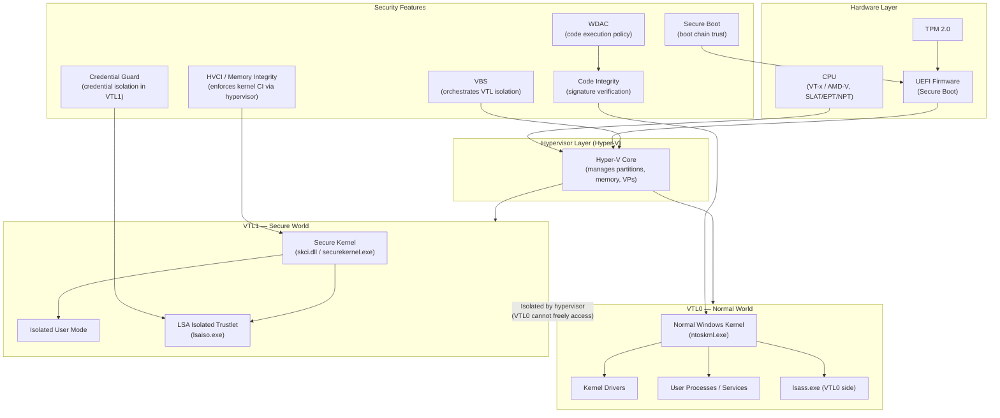
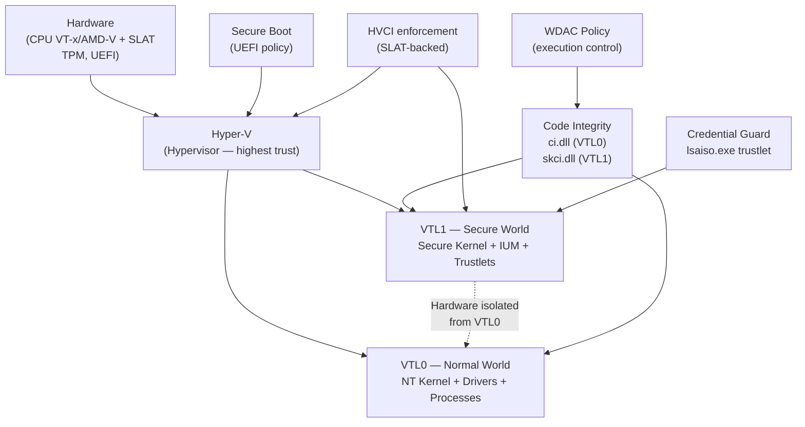
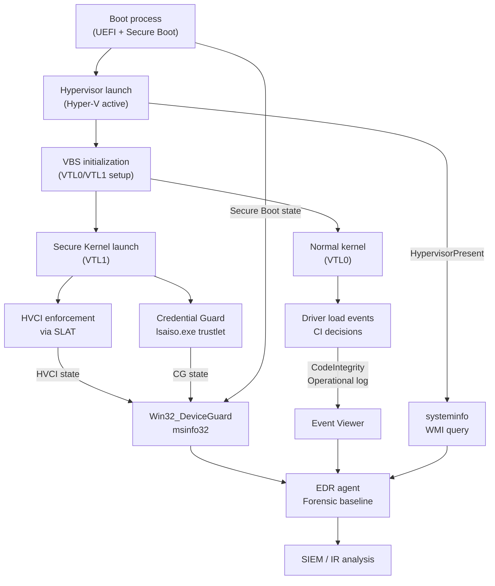

# Chương 9 — Virtualization Technologies

---

## 0. Chapter Map

**Theo:** Windows Internals, Part 2, Chapter 9.

Chương này là bước ngoặt trong series: từ đây, các chương trước phải được re-read với một câu hỏi bổ sung — *"Assumption này có còn đúng khi VBS được enable không?"*

**Kết nối với các chương trước:**

| Chương | Assumption được re-evaluate trong Ch.9 |
|--------|----------------------------------------|
| Ch.2 | Architecture: kernel là highest privilege — **sai khi VBS/hypervisor active** |
| Ch.5 | Memory protections: page tables được quản lý bởi kernel — **hypervisor có thể enforce thêm một lớp** |
| Ch.6 | Driver loading: driver được load nếu signed — **HVCI thêm requirements; behavior khác nhau** |
| Ch.7 | Security: LSASS PPL bảo vệ credentials — **Credential Guard tạo isolation mạnh hơn PPL** |
| Ch.8 | System mechanisms: kernel debugging thấy tất cả — **VTL1 không visible từ normal kernel debugger** |

**Thông điệp cốt lõi của Ch.9:**
Modern Windows không chỉ chạy VMs. Windows dùng virtualization technology **để bảo vệ chính nó** — tạo isolation boundaries ngay bên trong một máy duy nhất. Một hệ thống có thể có hypervisor active mà người dùng không biết, không có visible VM nào. Researcher không hiểu điều này sẽ đưa ra kết luận sai về trust model, tool behavior, và artifact interpretation.

| Mục | Nội dung | Tại sao quan trọng |
|-----|----------|--------------------|
| 0 | Chapter Map | Kết nối và điều hướng |
| 1 | Researcher Mindset | Virtualization đã trở thành security primitive |
| 2 | Big Picture | Hardware → Hypervisor → VTL0/VTL1 → Features |
| 3 | Key Terms | 36 thuật ngữ cốt lõi |
| 4 | Core Internals | 14 cơ chế từ hypervisor đến System Guard |
| 5 | Important Components | Bảng components + hypervisor layer + secure world + CI |
| 6 | Trust Boundaries | 8 ranh giới của virtualization security |
| 7 | Attack Surface Map | Bảng attack surface |
| 8 | Abuse Patterns | 7 class phân tích khái niệm |
| 9 | EDR Telemetry | VBS/HVCI/CI/driver/forensics/limits |
| 10 | Forensic Artifacts | Config/registry/event log/driver/memory |
| 11 | Debugging Notes | msinfo32/systeminfo/PowerShell/WinDbg/EventViewer |
| 12 | Labs | 6 bài thực hành safe |
| 13 | Researcher Mistakes | 22 sai lầm phổ biến |
| 14 | Version Notes | Thay đổi qua các phiên bản |
| 15 | Summary | Tổng hợp |
| 16 | Research Questions | 14 câu hỏi nghiên cứu |
| 17 | References | Tài liệu tham khảo |
| 18 | Illustration Plan | Sơ đồ và screenshots |

---

## 1. Researcher Mindset

### 1.1 Virtualization không còn chỉ là "chạy VM"

Trong nhiều năm, "virtualization" đối với Windows researcher nghĩa là: VMware, VirtualBox, Hyper-V Manager — một cái gì đó chạy một Windows instance khác bên trong. Assumption đó đã lỗi thời.

Modern Windows sử dụng hypervisor technology như một **security primitive** — không phải để host VMs, mà để tạo isolation boundaries ngay bên trong chính hệ thống đang chạy. Điều này có nghĩa:

- Một laptop thông thường chạy Windows 11 Home có thể có Hyper-V active
- Không có VM Manager, không có visible VM, không có snapshot
- Nhưng hypervisor đang chạy bên dưới kernel, và nó enforcing constraints mà kernel không thể simply override

### 1.2 Các assumptions phải thay đổi

Researcher quen với Windows 7/8/10 (pre-VBS) đã học một model:

> *Kernel mode = highest privilege. Nếu có kernel execution, bạn có full control. LSASS memory có credentials nếu PPL không block. Driver signature yêu cầu WHQL hoặc test mode.*

Model đó cần update:

| Old assumption | VBS reality |
|---------------|-------------|
| Kernel mode là highest privilege | Hypervisor và Secure Kernel có higher trust |
| Kernel có thể read/write bất kỳ memory | VTL1 memory isolated from VTL0 by hardware |
| LSASS PPL bảo vệ credentials | Credential Guard isolates tốt hơn — ngay cả kernel không thể extract nếu enabled |
| Driver chạy nếu signed | HVCI require additional compatibility; some valid-signed drivers fail |
| Kernel debugger thấy tất cả | VTL1 không visible từ normal kernel debug session |
| Tool hành xử như nhau trên mọi machine | VBS/HVCI state thay đổi behavior của cùng một tool |

### 1.3 Phân biệt bảy khái niệm

Researcher phải distinguish clearly:

1. **Hypervisor** — software layer bên dưới OS, manage VMs và VTL isolation
2. **Normal kernel (VTL0)** — Windows kernel chạy trong Virtual Trust Level 0
3. **Secure Kernel (VTL1)** — isolated kernel thành phần chạy ở higher trust level
4. **VTL0 / VTL1** — Trust level separation enforced by hypervisor
5. **Code integrity policy** — policy quyết định code nào được phép chạy
6. **Credential isolation** — Credential Guard bảo vệ credential material
7. **Driver compatibility constraints** — HVCI requirements không phải tất cả drivers đều đáp ứng

Nhầm lẫn những khái niệm này dẫn đến kết luận sai về gì đang bị bảo vệ, bởi cơ chế nào, và với guarantee gì.

### 1.4 Ba ví dụ cụ thể

**Ví dụ 1 — Hyper-V active mà không có visible VM:**
Một Windows 11 machine với VBS enabled có Hyper-V running. Bật Task Manager → không thấy VM. Bật Hyper-V Manager → không có VMs được tạo. Nhưng `msinfo32` báo "Virtualization-based security: Running." Researcher cần biết điều này là expected và normal — không phải indicator của compromise.

**Ví dụ 2 — Driver load failure không phải là lỗi code:**
Driver X signed với valid Authenticode certificate từ reputable vendor. Load tốt trên Windows 10 không có HVCI. Load fail trên Windows 11 với Memory Integrity enabled — vì driver dùng một memory pattern (ví dụ: executable non-paged pool allocation) mà HVCI không cho phép. Đây là **compatibility issue**, không phải malware. Researcher phải check HVCI state trước khi interpret driver load failure.

**Ví dụ 3 — LSASS analysis trên Credential Guard system:**
Researcher mở WinDbg, attach đến lsass.exe, scan memory for credential material. Trên old system: tìm thấy. Trên Credential Guard enabled system: không tìm thấy — vì credential material lives trong isolated VTL1 trustlet, không phải trong VTL0 lsass.exe memory. Absence không có nghĩa là credentials không tồn tại — có nghĩa là chúng bị isolated bởi VBS.

---

## 2. Big Picture

### 2.1 Layered virtualization model



### 2.2 Giải thích layered model

**Hardware (bottom):**
CPU với hardware virtualization extensions (Intel VT-x / AMD-V) là foundation. SLAT (Second Level Address Translation, Intel EPT / AMD NPT) cho phép hypervisor enforce memory isolation với minimal performance overhead. TPM và UEFI/Secure Boot cung cấp platform trust root.

**Hypervisor:**
Hyper-V core chạy tại highest privilege (ring -1 metaphor). Quản lý partitions, virtual processors, memory mappings. Enforce VTL separation bằng hardware-backed memory access controls. Root partition (running Windows) không phải "above" hypervisor — nó chạy dưới hypervisor control.

**VTL0 — Normal World:**
Normal Windows kernel, drivers, và user processes. Đây là "traditional Windows" layer. Powerful — nhưng không phải highest trust on VBS-enabled system.

**VTL1 — Secure World:**
Secure Kernel và Isolated User Mode. Isolated từ VTL0 bởi hypervisor-enforced memory boundaries. Trustlets (như `lsaiso.exe` cho Credential Guard) chạy ở đây — không thể inspected từ VTL0.

**Security features (right):**
VBS orchestrates toàn bộ VTL isolation. HVCI enforce kernel code integrity via Secure Kernel/hypervisor. Credential Guard isolates credential secrets trong trustlet. WDAC enforces code execution policy. Secure Boot verifies boot chain.

---

## 3. Key Terms

| Term | Giải thích tiếng Việt | Researcher relevance |
|------|-----------------------|---------------------|
| **Virtualization** | Công nghệ tạo isolated execution environments từ shared hardware | Foundation cho cả VM hosting và VBS security |
| **Hypervisor** | Software layer quản lý virtualization — controls CPU, memory, interrupts | Sits below OS; can enforce constraints kernel cannot bypass |
| **Type 1 hypervisor** | Hypervisor chạy trực tiếp trên hardware — "bare metal" | Hyper-V là Type 1; higher performance và trust than Type 2 |
| **Type 2 hypervisor** | Hypervisor chạy trên top of existing OS | VMware Workstation, VirtualBox — less trusted, more portable |
| **Hyper-V** | Microsoft's Type 1 hypervisor — ships với Windows | Active ngay cả khi không có visible VMs nếu VBS enabled |
| **Root partition** | Privileged partition chạy management OS (Windows) | Powerful nhưng vẫn runs under hypervisor control |
| **Child partition** | VM partition chạy guest OS | Typical VM guest; isolated from root |
| **Partition** | Isolated execution domain managed bởi hypervisor | Both VMs và VBS use partition model |
| **Virtual processor** | Virtualized CPU core exposed đến partition | Hypervisor schedules virtual processors on physical CPUs |
| **VMBus** | High-speed virtual bus kết nối root và child partitions | Used for virtual device communication (disk, net) |
| **VSP** | Virtualization Service Provider — server side ở root partition | Provides virtual device services đến child partitions |
| **VSC** | Virtualization Service Client — client side ở child partition | Consumes virtual device services từ root via VMBus |
| **SLAT** | Second Level Address Translation — hardware guest-to-host memory mapping | Allows hypervisor enforce memory isolation efficiently |
| **EPT** | Extended Page Tables — Intel's SLAT implementation | Hypervisor memory protection enforcement mechanism |
| **NPT** | Nested Page Tables — AMD's SLAT implementation | AMD equivalent of Intel EPT |
| **IOMMU** | I/O Memory Management Unit — controls DMA access | Prevents malicious DMA attacks from physical devices |
| **DMA protection** | Blocks unauthorized DMA access to physical memory | Prevents PCIe/Thunderbolt-based physical memory attacks |
| **VBS** | Virtualization-Based Security — uses Hyper-V to create isolated security boundaries | Umbrella cho HVCI, Credential Guard, và VTL isolation |
| **VTL** | Virtual Trust Level — hypervisor-enforced privilege level | 0 = normal, 1 = secure; hardware-enforced separation |
| **VTL0** | Normal Windows world — kernel, drivers, user processes | "Traditional" Windows; powerful but not highest trust under VBS |
| **VTL1** | Secure world — higher trust, isolated from VTL0 | Secure Kernel, trustlets, isolated secrets live here |
| **Secure Kernel** | Kernel component managing VTL1 secure world | Makes security decisions; isolated from normal kernel compromise |
| **Isolated User Mode (IUM)** | User-mode execution environment within VTL1 | Hosts trustlets; not inspectable from VTL0 |
| **Trustlet** | Protected user-mode component trong IUM | E.g., `lsaiso.exe` for Credential Guard; isolated từ VTL0 |
| **HVCI** | Hypervisor-Protected Code Integrity — enforces kernel code integrity via hypervisor | Driver compatibility changes; incompatible patterns blocked |
| **Memory Integrity** | Windows Security UI name cho HVCI | "Core Isolation > Memory Integrity" toggle |
| **Code Integrity (CI)** | System component verifying code signatures and policy | Lives in both VTL0 (`ci.dll`) và VTL1 (`skci.dll`) |
| **KMCI** | Kernel Mode Code Integrity — CI for kernel-mode code (drivers) | HVCI strengthens this with hypervisor enforcement |
| **UMCI** | User Mode Code Integrity — CI for user-mode executables | WDAC can enforce UMCI policies |
| **WDAC** | Windows Defender Application Control — policy-based code execution control | Can restrict what executables/scripts/drivers run |
| **Device Guard** | Older umbrella branding for WDAC + HVCI combination | Term still appears in docs, APIs, Event Logs |
| **Credential Guard** | VBS feature isolating credential secrets trong VTL1 trustlet | Changes LSASS analysis; credential material not in VTL0 memory |
| **LSA isolation** | Isolating LSA/LSASS functions related to credentials | Credential Guard specific — `lsaiso.exe` in IUM |
| **Secure Boot** | UEFI feature verifying bootloader và early boot components | Foundation of platform trust chain; prevents boot-level tampering |
| **Measured Boot** | Records boot component hashes into TPM | Enables remote attestation; logs boot-time integrity state |
| **TPM** | Trusted Platform Module — hardware security chip | Stores secrets, measurements; required for certain VBS features |
| **Kernel debugging under VBS** | Normal KD attach may not see VTL1 — requires secure kernel debug | Research and tool behavior changes; must document state |
| **Driver compatibility** | HVCI constraints on driver memory/code patterns | Key practical impact of HVCI for kernel researchers |
| **Hypervisor-enforced boundary** | Memory/execution isolation enforced by hypervisor hardware | Cannot be bypassed by kernel code alone |

---

## 4. Core Internals

### 4.1 Virtualization Basics

**Tại sao virtualization hoạt động được hiệu quả:**

Hardware virtualization extensions (Intel VT-x, AMD-V) cho phép CPU hỗ trợ virtualization trực tiếp:
- **VMX root mode** (Intel): hypervisor runs tại highest privilege
- **VMX non-root mode**: guest OS runs với hardware-enforced restrictions
- **VM exit**: guest triggers CPU event, control passes to hypervisor
- **VM entry**: hypervisor resumes guest execution

Không có hardware support, mọi privileged instruction của guest cần emulation — chậm và phức tạp. Với hardware support, guest chạy native phần lớn thời gian; hypervisor only intervenes khi cần.

**Type 1 vs Type 2:**

| | Type 1 (Bare metal) | Type 2 (Hosted) |
|--|---------------------|----------------|
| Chạy trên | Hardware directly | Host OS |
| Ví dụ | Hyper-V, VMware ESXi | VMware Workstation, VirtualBox |
| Trust position | Highest | Below host OS |
| Windows VBS | Dùng Type 1 Hyper-V | Không áp dụng |
| Research implication | Below kernel; cannot be bypassed by kernel code | Host OS can inspect |

**Researcher angle:**
Hypervisor không phải là "một OS chạy bên trong". Nó là software layer **bên dưới** OS, có khả năng enforce constraints mà OS code không thể simply override. Đây là tại sao VBS có thể make guarantees mà kernel-level mitigations không thể.

### 4.2 Hyper-V Architecture

**Hyper-V trên Windows:**

```
Physical Hardware
      │
   Hyper-V Core (hypervisor.exe — ring -1 metaphor)
      │
      ├── Root Partition (management partition)
      │     ├── Windows Kernel (ntoskrnl)
      │     ├── Drivers (including VmBus driver)
      │     ├── VSPs (Virtualization Service Providers)
      │     └── User-mode (Hyper-V Manager, vmms.exe)
      │
      └── Child Partitions (VMs)
            ├── Guest OS Kernel
            ├── VSCs (Virtualization Service Clients)
            └── Virtual devices via VMBus
```

**Root partition:**
Root partition chạy "the real Windows" — kernel, drivers, services, user processes. Root partition là **privileged** trong quản lý VMs (có thể create/manage child partitions). Nhưng root partition vẫn runs **under** hypervisor control. Không có code trong root partition có thể arbitrarily override hypervisor's memory protections.

**VMBus:**
VMBus là virtual bus kết nối root và child partitions cho high-speed data transfer. Virtual disk, virtual NIC, video — tất cả đều communicate qua VMBus. VSP (trong root) provides service; VSC (trong child) consumes service.

**VBS và Hyper-V:**
Khi VBS được enable, Windows tự activate Hyper-V kể cả khi không có VM nào được tạo. Root partition trở thành "VTL0 world" chạy dưới hypervisor. Secure Kernel component được launched trong VTL1 context. Đây là tại sao `msinfo32` có thể show "Virtualization-based security: Running" trên machine không có VMs.

> **Researcher note:** Kiểm tra Hyper-V active status bằng: `systeminfo | findstr /i "hyper"` hoặc `Get-CimInstance Win32_ComputerSystem | Select HypervisorPresent`. Kết quả TRUE không có nghĩa là có VM running — có nghĩa là hypervisor layer đang active.

### 4.3 SLAT / EPT / NPT

**Second Level Address Translation:**

Trong normal OS, virtual address translation:
```
Virtual Address → (Page Table Walk) → Physical Address
```

Trong virtualized environment với SLAT:
```
Guest Virtual Address
  → (Guest Page Tables, managed by guest OS)
  → Guest Physical Address
  → (SLAT tables: EPT/NPT, managed by hypervisor)
  → Host Physical Address
```

Guest OS quản lý bước đầu tiên. Hypervisor quản lý bước thứ hai. Guest OS không thể bypass SLAT — CPU hardware enforces two-level translation.

**Security implication:**
SLAT cho phép hypervisor enforce memory permissions mà guest OS (ngay cả kernel) không thể override:
- Mark memory regions as non-executable for VTL0 kernel
- Prevent VTL0 from reading VTL1 memory
- Enforce code integrity: kernel executable pages must be signed/approved

**HVCI sử dụng SLAT:**
HVCI configure SLAT tables để:
- Kernel code pages: read-only + executable (cannot be modified after load)
- Data pages: read-write + non-executable (cannot be made executable)
- Dynamic code restrictions: new executable kernel pages require CI approval

Điều này là tại sao HVCI có thể stop kernel-mode exploits — attacker có thể overwrite data nhưng không thể make it executable mà không going through CI gate.

### 4.4 VBS — Virtualization-Based Security

> Research caveat:
> VTL/Secure Kernel/trustlet implementation details and HVCI/WDAC behavior are build-, hardware-, policy-, and configuration-dependent. Treat them as a research model, then verify on the target build with Microsoft documentation, public symbols where available, platform security state, and controlled lab observations.

**VBS không phải là "Windows inside a VM":**

Phổ biến nhất misconception: "VBS chạy Windows bên trong một VM." Sai. VBS:
- Dùng Hyper-V để tạo VTL separation **bên trong chính Windows runtime**
- Windows kernel tiếp tục chạy như bình thường trong VTL0
- Secure components được isolated trong VTL1 trên cùng một machine
- Không có "host OS" và "guest OS" — đây là cùng một Windows, split theo trust level

**Gì VBS enable:**

| Feature | Phụ thuộc VBS | Chức năng |
|---------|--------------|-----------|
| HVCI / Memory Integrity | Có | Hypervisor-enforced kernel code integrity |
| Credential Guard | Có | LSA trustlet trong VTL1 |
| System Guard / Secure Launch | Có | Boot security measurements |
| KCFG (Kernel CFG) | Partial | Control flow integrity cho kernel |
| Application Guard | Có | Browser isolation (Edge) |

**Requirements cho VBS:**
- CPU với hardware virtualization (VT-x/AMD-V) và SLAT (EPT/NPT)
- UEFI firmware (không legacy BIOS)
- Secure Boot enabled
- 64-bit Windows 10/11 (Enterprise/Pro/Education cho full feature set)
- Compatible drivers (cho HVCI)

**VBS enabled vs running:**
VBS có thể configured (policy set) nhưng không running nếu hardware requirements không met. `Win32_DeviceGuard.VirtualizationBasedSecurityStatus` phân biệt: `0` = off, `1` = configured not running, `2` = running.

### 4.5 Virtual Trust Levels

**VTL là hypervisor-enforced privilege tiers:**

```
VTL1 (Secure World)
  │   Higher trust
  │   Secure Kernel, IUM trustlets
  │   Memory: isolated from VTL0 by hardware
  │   Can make security decisions VTL0 cannot override
  │
  ↕   Communication: controlled, via VMCALL / secure channel
  │
VTL0 (Normal World)
      Lower trust (relative to VTL1)
      Normal Windows kernel, drivers, user processes
      Memory: cannot read VTL1 pages
      Even SYSTEM processes cannot freely access VTL1
```

**VTL rule enforcement:**
- Lower VTL không thể access higher VTL memory — enforced by SLAT
- Communication VTL0 → VTL1 qua defined channels (VMCALL hypercalls hoặc shared structures)
- VTL1 code được cryptographically verified trước launch

**Researcher implication:**
Ngay cả với kernel debugging session, researcher chỉ thấy VTL0 memory và code. Secure Kernel và trustlets trong VTL1 không visible từ normal KD session. Không phải vì debug permissions — mà vì physical memory isolation enforced bởi hardware (SLAT).

### 4.6 Secure Kernel

**Secure Kernel là gì:**

Secure Kernel (`securekernel.exe` concept, backed by `skci.dll`) là nhỏ, minimal kernel thành phần chạy trong VTL1. Nó là "co-pilot" security decision maker:

- Verifies normal kernel code trước khi cho phép execution (HVCI enforcement)
- Manages VTL1 memory và secure trustlets
- Communicates với normal kernel qua defined VMCALL interface
- Cannot be inspected hoặc modified từ VTL0

**Secure Kernel responsibilities:**

| Function | Details |
|----------|---------|
| HVCI enforcement | Validates driver/kernel code pages trước khi mark executable |
| VTL1 memory management | Manages memory visible only to VTL1 |
| Trustlet hosting | Supports IUM trustlets trong VTL1 |
| Secure channel | Communicates với VTL0 kernel theo defined protocol |
| Key sealing | Protects secrets sealed to platform state |

**Relationship với normal kernel:**
Normal kernel và Secure Kernel communicate bởi vì nhiều VBS features require coordination. Ví dụ: khi driver được loaded, VTL0 CI component (`ci.dll`) performs initial check, sau đó coordinates với Secure Kernel (`skci.dll`) trong VTL1 cho final HVCI enforcement decision.

**Researcher angle:**
Normal kernel debugging tools không expose Secure Kernel internals. Research vào Secure Kernel requires specialized approach — documented Microsoft research exists (Alex Ionescu và others). For most researchers: treat Secure Kernel as a trusted security co-processor đưa ra decisions VTL0 cannot override.

### 4.7 Isolated User Mode và Trustlets

**IUM — Isolated User Mode:**

IUM là user-mode execution environment trong VTL1. Components chạy trong IUM được gọi là **trustlets** (`*iso.exe` pattern, ví dụ `lsaiso.exe`).

**Trustlet characteristics:**
- Runs trong VTL1 user-mode context
- Cannot be `OpenProcess`-ed từ VTL0 — access denied bởi hypervisor
- Cannot be debugged từ VTL0 debugger
- Memory không visible trong VTL0 kernel memory
- Communicate với VTL0 counterpart qua ALPC (controlled channel)

**Credential Guard trustlet model:**

```
VTL0:                         VTL1 (IUM):
  lsass.exe                     lsaiso.exe (trustlet)
  │                             │
  │ ALPC controlled channel     │
  └──────────────────────────── ┘
  
  lsass.exe handles:            lsaiso.exe handles:
  - logon UI/flow               - credential secret storage
  - token creation              - key derivation
  - normal auth                 - protected operations
                                - secrets never return to VTL0
```

**Process list visibility:**
`lsaiso.exe` visible trong process list (Task Manager) nhưng không có handle access. `OpenProcess` fails với ACCESS_DENIED. Memory không readable từ VTL0 — không phải bởi PPL flag, mà bởi VTL isolation.

### 4.8 HVCI / Memory Integrity

**HVCI = Hypervisor-Protected Code Integrity:**

HVCI enforce rằng mọi kernel-mode code page phải:
1. Được cryptographically verified bởi CI trước khi becoming executable
2. Không thể bị modified sau khi marked executable
3. Originated từ signed source

**Mechanism:**

```
Driver load attempt
  ↓
VTL0: ci.dll — initial signature check
  ↓ (pass to VTL1 for enforcement)
VTL1: skci.dll — HVCI validation
  ↓ (approve → configure SLAT)
Hypervisor configures SLAT:
  - Driver code pages: RX (read + execute, not writable)
  - Driver data pages: RW (read + write, not executable)
  ↓
Driver runs under enforced constraints
```

**Điều HVCI block:**
- Unsigned drivers (cũng blocked bởi standard driver signing, nhưng HVCI enforces harder)
- Drivers allocate executable non-paged pool (`MmAllocateNonCachedMemory` + make executable) — older pattern
- Drivers modify their own code at runtime
- Dynamic code generation in kernel without CI approval
- Kernel shellcode patterns that require writable+executable memory

**Incompatible driver patterns (compatibility issues):**

| Pattern | Pre-HVCI | Under HVCI |
|---------|----------|-----------|
| Executable NP pool allocation | Allowed | Blocked |
| Kernel code hot-patching | Allowed | Blocked |
| Dynamic kernel code generation | Common in some tools | Blocked without CI approval |
| Self-modifying driver code | Worked | Blocked |
| Some anti-cheat/DRM kernel drivers | Worked | May fail |
| Legacy security product kernel components | Worked | May need update |

**Windows Security UI:**
"Device Security → Core Isolation → Memory Integrity" toggle là UI cho HVCI. When turned on, Windows check drivers for compatibility. Incompatible drivers are listed — but listed ≠ malicious.

**Performance impact:**
HVCI có một performance overhead — VM exits tại driver load time, SLAT maintenance. Modern hardware (MBEC support — Mode-Based Execute Control) significantly reduces this overhead. On modern CPUs, overhead thường không perceptible trong normal workloads.

### 4.9 Credential Guard

**Credential Guard protects credential material using VBS isolation:**

Without Credential Guard:
```
lsass.exe (VTL0)
  └── Holds: NTLM hashes, Kerberos tickets, cleartext passwords
      └── Accessible via: memory read with PROCESS_VM_READ
          (blocked by PPL, but kernel can bypass PPL)
```

With Credential Guard:
```
lsass.exe (VTL0)
  └── Holds: public handles, references only
      └── Secret material stored in: lsaiso.exe (VTL1 trustlet)
          └── Not accessible from VTL0 by any means
              (enforced by hardware SLAT isolation)
```

**Gì Credential Guard protects:**
- Derived credential material (Kerberos TGTs và service tickets)
- NTLM hash representations (protected from pass-the-hash)
- Long-term credentials không exposed to VTL0 memory

**Gì Credential Guard KHÔNG protect:**
- Plaintext password typed at login — briefly in VTL0 memory at authentication time
- Network authentication hashes từ outbound connections (PtH on outbound)
- Application credentials cached outside LSASS (browser passwords, credential manager)
- Pass-the-ticket attacks nếu attacker already has valid tickets exported before Credential Guard enable
- Local account hashes (SAM database)

**Credential Guard vs LSASS PPL:**

| | LSASS PPL | Credential Guard |
|--|-----------|-----------------|
| Mechanism | Code integrity + process protection | VTL1 isolation |
| Protection target | LSASS process | Credential secrets |
| Bypass risk | Kernel code can bypass | Requires VTL1 compromise |
| Memory dump | Blocked from user-mode | Material not in VTL0 memory |
| Attacker với kernel | Can bypass PPL | Cannot access VTL1 |

> **Researcher note:** Khi analyzing credential exposure on a target system, always check: Is Credential Guard enabled? Without checking, analysis results may not reflect actual attack surface.

### 4.10 WDAC / Device Guard / Code Integrity

**Code Integrity hierarchy:**

```
Secure Boot
  └── ensures early boot components trusted
      └── Code Integrity (CI)
          ├── KMCI — kernel mode: drivers, kernel code
          │   └── HVCI — strengthened by hypervisor enforcement
          └── UMCI — user mode: executables, scripts, DLLs
              └── WDAC — policy-based UMCI enforcement
```

**WDAC (Windows Defender Application Control):**
- Policy-based system cho controlling what code can run
- Can restrict executables, scripts, DLLs, drivers, installers
- Policies defined in XML, compiled to `.p7b` binary
- Deployed via MDM, GPO, hoặc registry
- Enterprise feature but available on all editions
- Replaces older AppLocker for kernel and system code scenarios

**Device Guard — legacy branding:**
Device Guard là umbrella term từ Windows 10 initial release bao gồm: HVCI (hardware requirement) + WDAC (policy requirement). Term vẫn appears trong:
- `Win32_DeviceGuard` CIM class
- Some event log sources
- Older documentation

Researcher phải biết "Device Guard" thường được mention khi talking về HVCI + WDAC combination.

**WDAC vs AppLocker:**

| | WDAC | AppLocker |
|--|------|-----------|
| Kernel code? | Yes — can restrict drivers | No |
| Enforcement | Kernel CI | User-mode (can be bypassed by kernel) |
| Granularity | File, hash, publisher, path | File, hash, publisher, path |
| Managed via | MDM/GPO/PowerShell | GPO/PowerShell |
| HVCI relationship | WDAC policy helps HVCI | None |

### 4.11 Secure Boot, Measured Boot, TPM

**Secure Boot:**
UEFI feature verifying that boot components (bootloader, Windows boot manager, kernel) are signed với trusted certificates.

- Chain: UEFI firmware → Boot Manager → bootmgr.efi → winload.efi → ntoskrnl.exe
- Each component verified bởi previous component
- Unsigned hoặc tampered components rejected
- Không trực tiếp protect runtime — bảo vệ boot chain

**Measured Boot:**
Records SHA-256 hashes of each boot component vào TPM Platform Configuration Registers (PCRs):
- Firmware, boot manager, bootloader, kernel, drivers
- Log (`TCG log`) accessible sau boot
- Enables remote attestation — prove to remote party what boot components were loaded
- Forensically: can detect boot-level tampering if measurement differs from expected

**TPM:**
Hardware security chip (dedicated chip hoặc firmware TPM — fTPM in CPU):
- Store Measured Boot measurements in PCRs
- Seal secrets to platform state (decrypt only if measurements match)
- Protect Credential Guard keys (credential material only accessible if boot chain intact)
- BitLocker key storage

**Relationship:**
```
Secure Boot: did we boot with trusted components?
  → YES → Measured Boot: record what we booted with
      → TPM: seal secrets to this known-good state
          → VBS: trusted boot chain → can launch Secure Kernel
              → HVCI/Credential Guard: full protection active
```

Nếu bất kỳ bước nào bị compromised, chain breaks. TPM-sealed secrets không giải mã được nếu measurements change (boot-level rootkit changes measurements → Credential Guard keys inaccessible).

**Researcher angle:**
Secure Boot không có nghĩa là runtime tamper-proof. Secure Boot bảo vệ **boot chain**; HVCI/VBS bảo vệ **runtime kernel**. Cần cả hai cho complete protection. Một system với Secure Boot on nhưng VBS off vẫn có vulnerable runtime kernel.

### 4.12 Debugging và Compatibility Impact

**Kernel debugging under VBS:**

Normal kernel debugging (WinDbg kernel mode) có access đến VTL0 kernel memory và state. Nhưng:
- VTL1 memory không visible từ normal KD session
- Secure Kernel internals không inspectable
- Trustlet memory (lsaiso.exe) không accessible
- Kernel debugging **must be enabled** (via BCD settings), và enabling debug mode có thể affect VBS/HVCI state trên some configurations

**Secure kernel debugging:** Microsoft engineers có secure kernel debug capability — requires special setup, not a standard WinDbg attach. For most researchers, treat VTL1 as black box.

**HVCI và research tools:**
Nhiều kernel research tools và drivers require patterns HVCI không allow:
- Manual mapper tools (allocate executable kernel memory)
- Some rootkit detection/research drivers
- Legacy anti-cheat kernel components
- Research instrumentation drivers dùng older patterns

Researcher phải test tools on HVCI-disabled VM trước, sau đó account cho HVCI compatibility khi running on hardened systems.

**Virtualization timing artifacts:**
Hypervisor presence changes timing behavior:
- `RDTSC` timing affected bởi VM exits và virtualization overhead
- Timer resolution có thể differ
- CPU performance counters may not reflect true hardware state
- Anti-analysis techniques checking for VM presence (CPUID checks, timing) có thể trigger

**Documentation requirement:**
Mọi kernel/driver/security research lab note phải include:

```
System state at time of experiment:
- Windows build: [build number]
- Secure Boot: [Enabled/Disabled/Unknown]
- VBS: [Off / Configured / Running]
- HVCI/Memory Integrity: [Enabled/Disabled]
- Credential Guard: [Enabled/Disabled/Unknown]
- WDAC policy: [None / Audit / Enforced]
- Hypervisor present: [Yes/No]
- Debug mode (BCD): [Enabled/Disabled]
- Driver signing: [Normal / Test Mode / Disabled]
```

Không có context này, kết quả không reproducible và không interpretable trên different systems.

### 4.13 Application Guard (MDAG)

**Microsoft Defender Application Guard** sử dụng lightweight Hyper-V container để isolate browser sessions và Office documents khỏi host OS. Đây là ví dụ rõ nhất về dùng virtualization như security primitive thay vì "chạy VM."

**Architecture:**

```
Host (VTL0)                    MDAG Container (Hyper-V VM)
  Windows kernel                  Minimal Windows instance
  │                               │
  │  VMBus (controlled channel)   │
  └──────────────────────────────►│
       Clipboard: policy-based    │  Edge/IE process
       File access: none/policy   │  (malicious content lands here)
       Network: policy-filtered   │  Container destroyed on close
       Token: isolated            │
```

**Cơ chế hoạt động:**
- Khi user mở "Untrusted site" trong Edge MDAG mode, Edge launch trong isolated Hyper-V container
- Container không có access đến host credentials, tokens, local files (theo policy)
- Network access có thể bị filtered hoặc redirected
- Khi user đóng MDAG session, container bị destroyed — malicious persistence không survive
- "Trusted" sites chạy trong host browser như thường; "untrusted" sites forward vào container

**Gì MDAG bảo vệ:**
- Browser zero-day exploit landing in container không escalate đến host
- Credential không accessible từ container (VTL0 isolation + container boundary)
- Downloaded malware trong container bị destroyed khi session ends
- Host filesystem không writable từ container (theo default policy)

**Windows version history:**
- Windows 10 1709: MDAG for Edge released (Enterprise/Pro)
- Windows 10 1803: MDAG for Office documents (preview)
- Windows 11 22H2: Microsoft removed standalone MDAG feature — Edge now integrates "Application Guard" mode natively trong Edge browser engine
- Kiểm tra availability: `Get-WindowsCapability -online -Name Windows.Defender.ApplicationGuard`

**Requirements:**
- Hyper-V capable hardware (same as VBS)
- Windows 10 Enterprise/Pro, hoặc Windows 11 Pro+
- Feature must be enabled: `Enable-WindowsOptionalFeature -online -FeatureName Windows-Defender-ApplicationGuard`

**Researcher angle:**
MDAG demonstrates that containers (lightweight Hyper-V VMs) are another virtualization-as-security primitive pattern alongside VTL isolation. Browser vulnerability research results on host Edge ≠ behavior in MDAG-sandboxed Edge. Escape research from MDAG container targets VMBus/container boundary, not VTL boundary.

> **Lab note:** Install MDAG feature (Enterprise/Pro), open Edge with MDAG mode, observe extra `vmwp.exe` process spin up for container. `Get-WindowsCapability -online -Name Windows.Defender.ApplicationGuard` shows installation state.

---

### 4.14 System Guard và Secure Launch

**System Guard** là framework bảo vệ tính toàn vẹn của hypervisor và VBS từ thời điểm launch — extending trust chain từ boot (Secure Boot/Measured Boot) vào runtime hypervisor execution. Đây là lớp cuối cùng trong modern Windows trust hierarchy.

**Vấn đề System Guard giải quyết:**

Secure Boot bảo vệ bootloader chain. Nhưng: một firmware rootkit hoặc compromised hypervisor launch có thể bypass Secure Boot chain verification. System Guard / Secure Launch dùng **DRTM (Dynamic Root of Trust for Measurement)** để address điều này.

**DRTM — Dynamic Root of Trust for Measurement:**

```
Secure Boot (Static RTM):
  UEFI → bootmgr → winload → kernel
  ↑ trusted because verified at each step from firmware
  ↑ static chain: trust established at power-on

DRTM (Dynamic RTM — Secure Launch):
  At hypervisor launch time:
    CPU special instruction (Intel SENTER / AMD SKINIT)
    → CPU resets to known state
    → Launches "Secure Launch" (skinit/senter code)
    → Measures hypervisor code into TPM PCRs
    → TPM records: "this exact hypervisor code was launched"
  Result: hypervisor integrity verifiable, independent of firmware trust
```

**Intel TXT / AMD SKINIT:**

| | Intel | AMD |
|--|-------|-----|
| Instruction | `SENTER` (Intel TXT) | `SKINIT` |
| Mechanism | Measured Launch Environment (MLE) | Secure Loader (SL) |
| CPU state reset | Full reset before measured launch | Full reset |
| TPM measurement | Yes — into PCR 17-22 | Yes — into PCR 17 |
| Hyper-V Secure Launch uses | SENTER với ACM (Authenticated Code Module) | SKINIT với SL |

**Secure Launch flow:**

```
1. UEFI/Secure Boot loads bootloader (static RTM)
2. Bootloader loads hypervisor
3. Hypervisor triggers DRTM: SENTER/SKINIT
4. CPU resets, measures hypervisor ACM/SL code
5. TPM records measurement (PCR 17)
6. Hypervisor launches VTL1 with measurement attestation
7. VBS now has: hypervisor verified by hardware, not just trusted from chain
```

**System Guard Runtime Monitor:**

Ngoài Secure Launch, System Guard còn có runtime component kiểm tra:
- Hypervisor code integrity at runtime (detect post-launch tampering)
- SMM (System Management Mode) isolation — prevent SMM firmware code từ accessing VBS memory
- Platform state attestation — attestation reports từ VTL1 dựa trên TPM measurements

**SMM Isolation (quan trọng):**
SMM là firmware mode có highest CPU privilege — higher than hypervisor. Một SMM rootkit có thể theoretically undermine VBS. System Guard SMM Isolation:
- Implements SMM Supervisor: restricts SMM code từ accessing non-SMM memory
- Requires firmware cooperation (UEFI firmware support required)
- Measured: SMM supervisor state measured into TPM

**Gì System Guard bảo vệ:**

| Threat | Protection |
|--------|-----------|
| Compromised firmware attacking hypervisor post-boot | DRTM measures hypervisor, detects divergence |
| SMM firmware rootkit attacking VBS | SMM Isolation restricts SMM memory access |
| Hypervisor tampered after launch | Runtime Monitor detects |
| Attestation fraud | TPM measurements not spoofable from software |

**Requirements:**
- Intel TXT (SENTER) hoặc AMD SKINIT capable CPU
- TPM 2.0 (not just fTPM — may require discrete TPM on some configs)
- UEFI Secure Boot
- VBS enabled
- Firmware support cho SMM Supervisor

**Kiểm tra System Guard state:**
```powershell
# System Guard state in Win32_DeviceGuard:
$dg = Get-CimInstance -ClassName Win32_DeviceGuard `
    -Namespace root\Microsoft\Windows\DeviceGuard

# SecurityServicesRunning bitmask:
# Bit 2 (value 4) = System Guard Secure Launch running
if ($dg.SecurityServicesRunning -band 4) {
    "System Guard Secure Launch: Running"
}

# msinfo32 also shows:
# "Device Guard: System Guard Secure Launch" field
```

**Researcher angle:**
System Guard Secure Launch là lý do tại sao modern Windows security không chỉ phụ thuộc vào software trust chain. DRTM-based measurement cho phép attestation của hypervisor state — proof that "the hypervisor running right now is the expected code." Research targeting VBS increasingly needs to account for this layer: bypass not just kernel + hypervisor + VTL1, but also defeat DRTM attestation or SMM isolation.

**Phân biệt rõ bốn layers:**

```
Layer 1 — Secure Boot (Static RTM):
  Verifies: bootloader → kernel chain from UEFI
  When: At each boot component load
  Attacker must: compromise signing cert or UEFI DB

Layer 2 — Measured Boot:
  Records: hashes of what booted into TPM PCRs
  When: At boot time
  Attacker must: prevent measurements or forge PCR values

Layer 3 — System Guard Secure Launch (DRTM):
  Verifies: hypervisor code itself via hardware CPU reset
  When: At hypervisor launch
  Attacker must: exploit DRTM implementation or compromise hardware

Layer 4 — System Guard Runtime Monitor:
  Verifies: hypervisor integrity at runtime
  When: Periodically during operation
  Attacker must: compromise VTL1 attestation mechanism
```

---

## 5. Important Windows Components / Structures

**Bảng tổng quan components:**

| Component | Vai trò | Researcher angle | Công cụ hữu ích |
|-----------|---------|-----------------|-----------------|
| Hypervisor (Hyper-V core) | Manages partitions, memory, VTL isolation | Below kernel; enforces constraints kernel cannot override | `msinfo32`, `systeminfo`, `Get-CimInstance Win32_ComputerSystem` |
| Hyper-V | Microsoft Type 1 hypervisor platform | Active khi VBS enabled — không cần visible VMs | `systeminfo`, Event Viewer Hyper-V logs |
| Root partition | Privileged management partition (running Windows) | Powerful nhưng not above hypervisor | OS itself |
| Child partition | Guest VM partition | Isolated from root; typical VM scenario | Hyper-V Manager, vmms.exe |
| VMBus | Virtual bus root ↔ child communication | Virtual device communication; not relevant for VBS-only setup | Device Manager, vmbus driver |
| Virtual processor | Virtualized CPU core | Scheduler maps VPs to physical CPUs | WinDbg (`!vp`) if available |
| SLAT/EPT/NPT | Hardware memory address translation layer 2 | Hypervisor enforces memory isolation via SLAT | CPU spec, `msinfo32` |
| VBS | Orchestrates VTL isolation on local machine | Umbrella feature; check running state before assuming protections | `msinfo32`, `Win32_DeviceGuard` |
| VTL0 | Normal Windows execution environment | Traditional kernel/drivers/processes | All standard tools |
| VTL1 | Secure execution environment | Isolated from VTL0; limited tooling | WinDbg secure debug (specialized) |
| Secure Kernel | VTL1 kernel component; security decisions | Trust boundary; not inspectable from VTL0 | None (black box from VTL0) |
| IUM trustlet | Protected user-mode component in VTL1 | lsaiso.exe, wlsaiso.exe; not accessible from VTL0 | Process list visibility only |
| HVCI | Hypervisor-enforced kernel code integrity | Driver compatibility; SLAT-based enforcement | Windows Security UI, CI Event Log |
| Code Integrity (CI) | Signature verification for kernel/user code | `ci.dll` (VTL0), `skci.dll` (VTL1) | CodeIntegrity Event Log |
| WDAC policy | Application execution control policy | Enterprise enforcement; changes code execution assumptions | `wldp.dll`, event log, MDM |
| Credential Guard | VTL1 trustlet protecting credential secrets | LSASS analysis changes; VTL1 material not readable | `msinfo32`, `Win32_DeviceGuard` |
| LSASS/LSA isolation | Credential Guard relationship to lsass.exe | lsaiso.exe is trustlet; lsass.exe is VTL0 stub | Process list, `msinfo32` |
| Secure Boot | UEFI boot chain verification | Foundation trust; check state before assuming protections | `msinfo32`, `Confirm-SecureBootUEFI` |
| TPM | Hardware security chip for measurements/keys | Credential Guard requires TPM; Measured Boot uses PCRs | `Get-Tpm`, `tpm.msc` |
| BCD configuration | Boot configuration data — VBS/debug/hypervisor settings | Lab setup vs production; debug mode changes security posture | `bcdedit /enum all` |
| msinfo32 | System Information — shows VBS/security state | First stop for platform security state | `msinfo32.exe` |
| Windows Security Core Isolation | UI for HVCI state | End-user view; incompatible driver list | Windows Security app |
| PowerShell DeviceGuard CIM | Programmatic security state query | More detail than UI | `Get-CimInstance Win32_DeviceGuard` |
| CodeIntegrity Event Logs | Driver allow/block decisions | Telemetry for CI decisions | Event Viewer → Microsoft-Windows-CodeIntegrity |
| WinDbg kernel debugging | Deep kernel inspection | VTL0 only; VTL1 requires specialized access | WinDbg |
| Application Guard (MDAG) | Lightweight Hyper-V container for browser/Office isolation | Demonstrates container-as-security-primitive; separate escape surface from VTL | `Get-WindowsCapability`, `vmwp.exe` process |
| System Guard / Secure Launch | DRTM-based hypervisor integrity measurement | Requires Intel TXT / AMD SKINIT; verifies hypervisor code into TPM | `Win32_DeviceGuard` SecurityServicesRunning bit 4 |
| SMM Isolation | System Management Mode restriction under System Guard | Prevents firmware-level attacks on VBS; requires firmware support | `msinfo32` System Guard field |
| DRTM measurements | TPM PCR 17-22 Secure Launch measurements | Allows attestation of hypervisor integrity state | `Get-TpmMeasurementLog`, PCR values |

### 5.1 Hypervisor as a Security Layer

**Hypervisor không chỉ là VM host:**

Khi Hyper-V active (kể cả VBS-only, không có VMs), hypervisor:
1. Sits below NT kernel — cả kernel và drivers run under hypervisor supervision
2. Manages SLAT tables — can make any memory region non-executable for VTL0, regardless of what kernel code requests
3. Enforces VTL boundaries — hardware prevents VTL0 từ accessing VTL1 memory pages
4. Validates code pages — HVCI uses hypervisor để ensure kernel code pages cannot be written after verification

**"Kernel is God" assumption breaks:**
Traditional Windows internals: kernel-mode code có toàn quyền — có thể write bất kỳ memory, tạo executable pages, patch kernel. Với hypervisor enforcement, kernel code còn phải satisfy:
- SLAT permissions set bởi hypervisor/Secure Kernel
- Code integrity gate cho executable pages
- No self-modifying kernel code

Driver or kernel exploit có thể gain execution in kernel (VTL0) nhưng vẫn encounter hypervisor-enforced constraints.

### 5.2 Secure World vs Normal World

**VTL0 vs VTL1 comparison:**

| Dimension | VTL0 (Normal World) | VTL1 (Secure World) |
|-----------|--------------------|--------------------|
| Contents | NT kernel, all drivers, all user processes | Secure Kernel, IUM trustlets |
| Trust assumption | Lower (relative to VTL1) | Higher |
| Memory visibility | Can see its own memory | Cannot be seen from VTL0 |
| Debug access | Standard kernel debug tools | Requires specialized access |
| Compromise impact | Attacker controls VTL0 | VTL1 secrets still protected |
| Communication | Via VMCALL / defined channels | Responds to controlled requests |

**Communication VTL0 → VTL1:**
Not arbitrary. Defined channels (VMCALL hypercalls) với specific semantics. VTL0 kernel can request VTL1 to perform an operation (ví dụ: decrypt a credential-related structure) — VTL1 returns result without exposing secret material to VTL0.

### 5.3 Code Integrity Components

**CI decision flow:**

```
Driver load request
  ↓
ci.dll (VTL0) — signature check
  ├── No signature? → Block immediately
  └── Has signature? → Check certificate chain
      └── Valid chain? → Verify policy (WDAC, etc.)
          └── Policy allows? → Request HVCI approval from Secure Kernel
              ↓
          skci.dll (VTL1) — HVCI enforcement decision
              ├── Code integrity satisfied? → Configure SLAT pages as RX
              └── Fail? → Driver load blocked, CI event logged
```

**Four distinct components:**

| Component | Location | Role |
|-----------|----------|------|
| `ci.dll` | VTL0 kernel | Initial CI validation |
| `skci.dll` | VTL1 Secure Kernel | HVCI enforcement |
| WDAC policy | Deployed policy files | What code is allowed by policy |
| Secure Boot | UEFI | Boot chain integrity |

---

## 6. Trust Boundaries

### 6.1 Hardware ↔ Hypervisor Boundary

Hardware virtualization extensions (VT-x/AMD-V) enable hypervisor control. Hypervisor operates at highest privilege level (SLAT/EPT configuration, VM entry/exit control). No software can bypass hardware-enforced virtualization constraints without hardware modification or CPU vulnerability.

**Researcher must know:** Is hypervisor active? `systeminfo | findstr /i "hyper"` hoặc `Get-CimInstance Win32_ComputerSystem | Select HypervisorPresent`. If YES — additional trust layers exist below kernel.

**IOMMU / DMA protection:**
IOMMU (Intel VT-d, AMD-Vi) extends protection đến DMA operations. Physical PCIe devices cannot DMA-read arbitrary physical memory if IOMMU protected. Thunderbolt attacks, PCIe implants constrained. Windows 11 enables Kernel DMA protection by default on supported hardware.

### 6.2 Hypervisor ↔ VTL0 Boundary

Normal kernel (VTL0) runs under hypervisor control. Hypervisor can:
- Intercept privileged instructions (VM exits)
- Enforce SLAT-based memory permissions
- Validate code pages for HVCI

VTL0 kernel **cannot**:
- Disable SLAT protections set by hypervisor
- Read VTL1 memory
- Execute code in kernel-mode that hasn't passed CI validation (when HVCI enabled)
- Override hypervisor-set memory attributes

> **Research implication:** Kernel-mode code under HVCI has real constraints. Privilege escalation to kernel (VTL0) is not sufficient to bypass VTL1 protections.

### 6.3 VTL0 ↔ VTL1 Boundary

Hardest boundary enforced by hardware SLAT:
- VTL1 pages marked in SLAT as inaccessible from VTL0 context
- Even System-level VTL0 code cannot read VTL1 memory
- Communication only through defined VMCALL channels
- Secrets in VTL1 trustlets: unreachable from VTL0

**Credential Guard implication:**
Attacker compromises VTL0 completely (kernel level) — still cannot access credential material in lsaiso.exe trustlet (VTL1). This is fundamental security improvement over PPL — PPL still in VTL0, theoretically bypassable from VTL0 kernel.

### 6.4 Kernel Driver ↔ HVCI Boundary

Driver loading under HVCI:
- Must have valid signature
- Cannot use patterns that require executable writable memory
- Once loaded, code pages are read-only and execute-only (not writable)
- Cannot hot-patch or modify own code
- Cannot allocate and execute dynamic code without CI approval

**This affects:**
- Security products with kernel components (must be HVCI-compatible)
- Anti-cheat systems (major rework needed for HVCI)
- Research/instrumentation drivers (may need redesign)
- Legacy enterprise software với kernel drivers

**Signal interpretation:** Driver load blocked due to HVCI incompatibility is **not** evidence of malice. It may be old code, pre-HVCI design, or missing update. Context is necessary.

### 6.5 Credential Isolation Boundary

Credential Guard creates VTL1 isolation:
- `lsaiso.exe` trong IUM không thể OpenProcess-ed
- Memory không readable từ VTL0
- Even SYSTEM with `SeDebugPrivilege` cannot attach debugger
- Credential material (derived credentials, Kerberos material) not in VTL0 lsass.exe memory

**Forensic implication:**
- Memory dump of lsass.exe trên Credential Guard system không contain same data as non-Credential Guard system
- Absence of credential material in dump không mean "nothing there" — may mean "protected by VTL1"
- Must check Credential Guard state before interpreting LSASS memory forensics

### 6.6 Boot Trust Boundary

Secure Boot verifies: bootloader → kernel → early drivers. Measured Boot records: what was loaded at boot time. TPM seals: Credential Guard keys to known-good measurement state.

**Attacker implication:** If bootloader or kernel modified (boot-level rootkit), Measured Boot measurements change → TPM-sealed Credential Guard keys inaccessible → credential protection maintained even in boot-compromise scenario.

**Research implication:** Kernel debug mode (`/debug` in BCD) changes boot measurements on some configurations. This is why production VBS state should not be confused with debug-mode lab state.

### 6.7 Enterprise Policy Boundary

WDAC, Group Policy, MDM can enforce dramatically different execution environments:
- Enforced WDAC policy: only signed, whitelisted code runs
- Audit WDAC policy: violations logged but allowed
- No policy: normal behavior

Same binary may:
- Run on home machine
- Be blocked on enterprise workstation with enforced WDAC
- Generate audit event on another system
- Be specifically allowed by hash/signature on another

**Research implication:** Results on lab machine with no policy không necessarily represent what happens on enterprise endpoint. Always check policy state.

### 6.8 Debugging Boundary

Enabling kernel debugging (BCD `/debug` flag) has security implications:
- May affect Secure Boot chain measurements
- Can change VBS/HVCI behavior in some configurations
- Some VBS features may operate differently in debug mode
- Production security posture ≠ debug-mode lab posture



---

## 7. Attack Surface Map

| Surface | Ví dụ cụ thể | Boundary crossed | Cần observe gì | Research value |
|---------|-------------|-----------------|----------------|---------------|
| Hyper-V presence detection | CPUID, timing, HYPERV_ENLIGHTENMENTS | User space → hypervisor detection | `systeminfo`, `Win32_ComputerSystem` | High — affects all assumptions |
| VBS state | Running/configured/off | Policy ↔ runtime | `msinfo32`, `Win32_DeviceGuard` | Very high — trust model |
| HVCI state | Memory Integrity on/off | Driver trust boundary | Windows Security UI, CI event log | Very high — driver behavior |
| WDAC policy | Audit/enforce/none | Code execution policy | Event Log, `wldp`, WDAC cmdlets | High — execution environment |
| Secure Boot state | Enabled/disabled, DB | Boot chain trust | `msinfo32`, `Confirm-SecureBootUEFI` | High — platform integrity |
| Credential Guard state | Running/not running | Credential isolation | `msinfo32`, `Win32_DeviceGuard` | Very high — LSASS analysis |
| BCD configuration | Debug mode, hypervisor settings | Debug ↔ production posture | `bcdedit /enum all` | High — lab vs prod |
| Driver load attempts | Service install + load | Driver signing + HVCI boundary | Event Log 7045, CI log | High — code integrity signal |
| Blocked driver events | CI log blocked drivers | HVCI / WDAC enforcement | CodeIntegrity Operational log | High — blocked code |
| Signature validation failure | Certificate expired, revoked, untrusted | Code trust chain | CI event log, 0x800B events | High — tamper signal |
| WDAC policy block | Unsigned binary, policy violation | Policy enforcement | WDAC block events in CI log | High — policy enforcement |
| HVCI compatibility block | Incompatible driver pattern | HVCI pattern enforcement | Windows Security incompatible drivers | Medium — compat research |
| CI Event Logs | CodeIntegrity Operational | VTL1 CI decision visibility (partial) | Event Viewer CI log | High — decisions visible |
| DeviceGuard CIM class | `Win32_DeviceGuard` properties | Feature state query | PowerShell CIM query | High — programmatic state |
| Root partition services | vmms, vmwp, vmbus | Hyper-V management boundary | Service list, process list | Medium — Hyper-V research |
| VM worker processes | `vmwp.exe` per-VM | VM isolation boundary | Process list, handles | Medium — VM research |
| VMBus devices | Virtual disk, NIC, video | Root ↔ child device boundary | Device Manager | Medium — VM device research |
| Virtual device stack | Virtual NIC, virtual disk | Root service ↔ guest boundary | VMBus driver events | Low-medium |
| Memory integrity policy | SLAT enforcement state | Kernel memory execution | No direct query; inferred from HVCI | Very high — exploitation assumptions |
| DMA protection state | IOMMU/DMA policy | Physical device ↔ memory | `msinfo32`, `Win32_DeviceGuard` | Medium — physical attack surface |
| TPM / Measured Boot | PCR values, boot log | Platform integrity chain | `Get-TpmSupportedFeature`, `tcg.sys` | Medium — boot forensics |
| System Guard Secure Launch | DRTM active / not active | Hypervisor integrity chain | `Win32_DeviceGuard` bit 4, `msinfo32` | High — modern trust anchor |
| MDAG container boundary | Edge/Office container escape | Hyper-V container isolation | `vmwp.exe` per session, container VMBus | Medium — browser security |
| SMM isolation state | SMM Supervisor active/inactive | Firmware ↔ VBS boundary | `msinfo32` System Guard detail | Medium — firmware attacks |

---

## 8. Abuse Techniques

> **Scope note:** Phần này phân tích các classes of concern ở mức khái niệm cho researcher. Không có bypass guide, không có exploit chain, không có instructions để disable protections.

### 8.1 Legacy Driver Compatibility Class

**Khái niệm:** Nhiều legitimate drivers — security products, enterprise software, research tools — dùng kernel memory patterns không compatible với HVCI. Khi HVCI enabled, những drivers này fail to load hoặc generate CI errors.

**Research implications:**
- "Driver failed to load" không automatically mean malicious — check HVCI state first
- CI event log shows blocked driver details (hash, signer, reason)
- Inventory of incompatible drivers là security-relevant: each incompatible driver may require disabling HVCI or updating driver
- Adversaries aware of incompatible driver lists may try to exploit devices with HVCI disabled for compatibility

**Detection focus:** Track which drivers are blocked by HVCI vs which fail for other reasons. Legitimate compatibility issues have vendor-traceable hashes and signers. Unknown/unsigned/suspicious signers warrant closer inspection regardless.

### 8.2 Code Integrity Policy Gap Class

**Khái niệm:** VBS/HVCI/WDAC state varies significantly across organizations, hardware, and Windows editions. Same research không reproducible across different policy states.

**Research implications:**
- Lab result on unprotected VM không represent enterprise endpoint with enforced WDAC
- "This technique works" statement needs policy context qualifier
- Policy audit mode vs enforcement mode produce different outcomes even for same binary
- Enterprise deployment: WDAC policy is organizational artifact; different orgs have different policies

**For researcher:** Always state policy state. Findings that don't specify CI/WDAC/HVCI state are incomplete.

### 8.3 Kernel Trust Assumption Class

**Khái niệm:** Old mental model — kernel is ultimate trust — breaks under VBS. Researcher thiết kế tools, write research, hoặc analyze behavior based on old model sẽ miss real trust architecture.

**Examples of outdated assumptions:**
- "If I control kernel, I control everything" → VTL1 still isolated
- "I can make any memory executable in kernel" → HVCI prevents this
- "LSASS memory contains the credentials" → Not if Credential Guard enabled
- "Kernel debugger can see all memory" → Not VTL1 memory

**Research design implication:** Assumptions must be explicitly stated and checked against current platform state. Security tools designed before VBS need architectural review for VBS-enabled environments.

### 8.4 Credential Exposure Assumption Class

**Khái niệm:** Quá nhiều tools và techniques assume credential material accessible từ VTL0 LSASS memory. Credential Guard invalidates this assumption.

**Sub-patterns:**
- *Wrong negative:* Researcher scans LSASS, finds nothing, concludes "no credentials" — actually credentials in VTL1, inaccessible
- *Wrong positive:* Tool reports "Credential Guard protecting" based on process name without checking VTL state
- *Partial protection confusion:* Credential Guard protects specific credential types; local SAM hashes still potentially accessible

**Detection angle:** Forensic reports must note Credential Guard state. "LSASS examined, no credentials found" statement incomplete without platform security context.

### 8.5 Debug-mode vs Production-mode Confusion Class

**Khái niệm:** Enabling kernel debug mode for research changes system security posture. Debug mode system không behave identically đến production system.

**What changes in debug mode:**
- BCD settings (`/debug`, `/hypervisordebug`) can affect measurements
- Some VBS features may operate differently
- HVCI behavior may change
- Timing và performance characteristics differ
- Some test-mode drivers that fail HVCI might load differently

**Best practice:** Maintain separate: (1) hardened reference VM mirroring production, (2) debug-mode research VM. Document which environment produced which results. Never assume debug-mode behavior equals production behavior.

### 8.6 Virtualization Artifact Confusion Class

**Khái niệm:** Hypervisor presence creates artifacts that tools may misinterpret.

**Common artifacts:**
- CPUID returns Hyper-V hypervisor flags — some anti-analysis tools flag this as "sandbox"
- Timing differences due to VM exits — timing-based checks behave differently
- VMBus devices appear in Device Manager — can confuse device enumeration
- Hyper-V-specific processes (`vmwp.exe`, `vmms.exe`) in process list even without visible VMs

**Research implication:** Behavior that appears "anti-VM" or "sandbox-evading" may be reacting to legitimate Hyper-V/VBS presence. Context matters: is this a lab VM, VBS-enabled host, or VBS-disabled host?

### 8.7 Driver Block Telemetry Class

**Khái niệm:** CodeIntegrity event logs record driver load decisions — allow, block, and failure reasons. This telemetry is high-value for both security monitoring and research.

**Telemetry value:**
- Blocked unsigned driver → possible malicious driver load attempt or unsigned research tool
- Blocked due to HVCI incompatibility → legitimate compatibility issue, known vendor
- Blocked due to revoked certificate → certificate revoked (often for good reason)
- Allowed with audit-only policy → WDAC audit mode shows what would be blocked in enforce mode

**Context necessity:** Driver block event alone insufficient. Need: hash, signer, source process, time correlation. A blocked legitimate driver during system update is different from blocked unknown driver at odd hours.

---

## 9. Defender / EDR Telemetry


> Telemetry interpretation note:
> ETW/Event Log/WMI/EDR are provider-generated or sensor-generated views, not universal ground truth. Telemetry must be interpreted with source layer, configuration, provider state, collection policy, and retention. Absence of an event is not proof of absence. High-signal anomaly still requires context and correlation.

### 9.1 VBS/HVCI State Telemetry

| Event/State | Ví dụ | Source | Research notes | Giới hạn |
|-------------|-------|--------|----------------|---------|
| VBS enabled/disabled | Virtualization-based security: Running | msinfo32 | UI summary; correlate with CIM | UI may lag runtime state |
| HVCI enabled/disabled | Memory Integrity: On/Off | Windows Security UI | User-visible HVCI toggle | May not reflect policy source |
| Secure Boot state | Secure Boot State: On | msinfo32 | UEFI state | Does not guarantee runtime integrity |
| Credential Guard state | Credential Guard: Running | msinfo32 | Running vs configured | May require deeper check |
| Win32_DeviceGuard props | SecurityServicesRunning | PowerShell CIM | Programmatic — most detailed | Field meanings build-specific |
| Memory Integrity UI state | Core Isolation page | Windows Security | Shows incompatible drivers | End-user view only |
| Hypervisor detected | HypervisorPresent: True | WMI/CIM/systeminfo | Active hypervisor layer | Does not specify which hypervisor |
| Core Isolation state | Available/Enabled/Running | Win32_DeviceGuard | AvailableSecurityProperties list | Numeric codes need decoding |

**Win32_DeviceGuard key fields:**

| Field | Meaning | Values |
|-------|---------|--------|
| `VirtualizationBasedSecurityStatus` | VBS runtime state | 0=off, 1=configured, 2=running |
| `SecurityServicesConfigured` | Which services configured | Bitmask — see docs |
| `SecurityServicesRunning` | Which services actively running | Bitmask — see docs |
| `AvailableSecurityProperties` | What hardware supports | Bitmask — hardware capabilities |
| `RequiredSecurityProperties` | What policy requires | Bitmask — policy requirement |

### 9.2 Code Integrity Telemetry

| Event | Source | Details |
|-------|--------|---------|
| Driver allowed (WHQL) | CI Operational log Event 3076 | Audit-mode allowed with policy |
| Driver blocked (CI) | CI Operational log Event 3077 | Enforced block |
| Signature validation failure | CI Operational log 3033, 3034 | Invalid signature chain |
| HVCI compatibility block | CI Operational log | Pattern not compatible with HVCI |
| WDAC policy block | CI Operational log 3076/3077 | Policy-based block |
| Kernel module info | CI Operational log 3089 | Module details for investigation |
| File hash failure | CI Operational log 3004 | Hash mismatch |
| Revoked cert | CI Operational log | Certificate revocation |

**CodeIntegrity Operational log location:**
```
Event Viewer → Applications and Services Logs
  → Microsoft → Windows → CodeIntegrity → Operational
```

### 9.3 Driver và Security Telemetry

| Event | Log | Event ID | Content |
|-------|-----|---------|---------|
| Service installed | System | 7045 | Service name, binary path, account |
| Service state change | System | 7036 | Service start/stop |
| Driver load | System | 7045 + Kernel-PnP 400 | Driver details |
| Blocked CI | CodeIntegrity Operational | 3077 | Blocked file hash + signer |
| PPL process start | Security | 4688 | Protected process creation |
| LSASS start | Security | 4688 | lsass.exe với protection level |
| Policy change | Security | 4719 | Audit policy modification |
| Service reg modification | Security | 4657 | Registry key modification (if SACL) |

### 9.4 Virtualization Platform Telemetry

| Source | Content | Notes |
|--------|---------|-------|
| Hyper-V Admin log | VM operations, errors | Only present if Hyper-V role installed |
| Hyper-V Operational logs | Worker process, VMBus | Multiple sub-logs under Hyper-V |
| `systeminfo` output | HypervisorPresent, Hyper-V requirements | CLI accessible |
| BCD entries | `hypervisorlaunchtype`, `hypervisordebugtype` | `bcdedit /enum all` |
| Win32_ComputerSystem | HypervisorPresent property | CIM/WMI query |
| Service list | vmms, vmwp, hvhostsvc | Task Manager / Services |
| Device Manager | VMBus devices, Hyper-V-related adapters | Visible if VMs present |

### 9.5 Forensics / Incident Response View

**msinfo32 VBS-related fields:**
```
System Summary:
  Virtualization-based security: Running / Not enabled / ...
  Virtualization-based security Services Running: [Credential Guard, HVCI, ...]
  Virtualization-based security Services Configured: [...]
  Virtualization-based security Features Required for Base Virtualization: [...]
  Secure Boot State: On/Off/Unsupported
  Device Guard: [...]
  Device Guard Virtualization based security: [...]
```

**systeminfo hypervisor line:**
```
> systeminfo
Hyper-V Requirements: A hypervisor has been detected. Features required for Hyper-V will not be displayed.
```
Dòng này xuất hiện khi hypervisor active (Hyper-V, WHP, hoặc third-party). Không phải indicator của compromise.

**Registry policy artifacts (high-level):**
```
HKLM\SYSTEM\CurrentControlSet\Control\DeviceGuard\
  EnableVirtualizationBasedSecurity
  RequirePlatformSecurityFeatures
  HypervisorEnforcedCodeIntegrity

HKLM\SYSTEM\CurrentControlSet\Control\Lsa\
  LsaCfgFlags  (Credential Guard config)

HKLM\SYSTEM\CurrentControlSet\Control\CI\Policy\
  (WDAC policy binaries)
```

**Memory dump limitations under VBS:**
- Full memory dump (`.dmp`) captures VTL0 kernel memory
- VTL1 memory NOT included in standard dump
- lsaiso.exe process memory không in dump
- Credential material trong VTL1 trustlet không recoverable from standard dump
- Specialized Secure Kernel dump requires privileged tools không publicly available

**Baseline comparison:** Enterprise IR teams should establish baselines:
- Expected `Win32_DeviceGuard` values for fleet
- Expected CI event log volume and event types
- Expected Secure Boot state
- Expected driver compatibility status

### 9.6 Telemetry Limits

**Feature state confirmation requires multiple sources:**
Windows Security UI có thể show "Memory Integrity: On" nhưng policy source (MDM vs manual), runtime state (confirmed running vs configured), và hardware support status khác nhau. `Win32_DeviceGuard` provides more detail nhưng field meanings cần documentation lookup.

**Event Log coverage conditional:**
CodeIntegrity Operational log không enabled by default on all configurations. May need to check log properties and enable if missing. Hyper-V logs only present if Hyper-V role installed. Event volume trong CI log có thể high on active systems.

**Enterprise MDM/GPO may override local state:**
Local machine registry policies, Group Policy settings, và MDM enrollment can change VBS/HVCI/Credential Guard state. Local admin có thể see different state than IT admin sees in MDM console. Both views needed for complete picture.

**VTL1 telemetry limited:**
No standard public API to directly query VTL1 state from VTL0. Infer từ: CI event log, Win32_DeviceGuard, msinfo32, and trustlet process list visibility.

**Hardware/firmware compatibility:**
VBS features may be "configured" but not "running" due to hardware incompatibility (no SLAT, old firmware, no TPM). Always check both configured and running state.



---

## 10. Forensic Artifacts

### 10.1 System Configuration Artifacts

**msinfo32 export:**
```
# Save full system info report:
msinfo32 /report C:\output\sysinfo.txt

# Key fields to extract:
grep -i "virtualization" sysinfo.txt
grep -i "secure boot" sysinfo.txt
grep -i "device guard" sysinfo.txt
grep -i "credential guard" sysinfo.txt
grep -i "hyper-v" sysinfo.txt
```

**systeminfo:**
```
systeminfo | findstr /i "hyper\|virtual\|secure"
```

**BCD settings:**
```
bcdedit /enum all
# Look for:
#   hypervisorlaunchtype Auto|Off
#   hypervisordebugtype (if debug mode)
#   loadoptions (VBS related)
#   nx (NX policy)
```

**Win32_DeviceGuard:**
```powershell
Get-CimInstance -ClassName Win32_DeviceGuard -Namespace root\Microsoft\Windows\DeviceGuard |
    Select-Object -Property *
```

**Secure Boot state:**
```powershell
Confirm-SecureBootUEFI  # Returns True/False or throws on non-UEFI
Get-SecureBootPolicy    # If available
```

**Core Isolation UI state:**
Windows Security → Device Security → Core isolation details → Memory Integrity: On/Off

### 10.2 Registry/Policy Artifacts

**VBS configuration:**
```
# HVCI state:
HKLM\SYSTEM\CurrentControlSet\Control\DeviceGuard\
  EnableVirtualizationBasedSecurity  (DWORD: 0/1)
  RequirePlatformSecurityFeatures    (DWORD: bitmask)
  Locked                             (if MDM-locked)

# HVCI enforcement level:
HKLM\SYSTEM\CurrentControlSet\Control\DeviceGuard\Scenarios\HypervisorEnforcedCodeIntegrity\
  Enabled
  Locked

# Credential Guard:
HKLM\SYSTEM\CurrentControlSet\Control\Lsa\
  LsaCfgFlags  (0=off, 1=with UEFI lock, 2=without lock)
```

**WDAC policy artifacts:**
```
# Policy binary:
C:\Windows\System32\CodeIntegrity\SIPolicy.p7b

# Policy audit log:
Event Viewer → CodeIntegrity Operational

# Supplemental policies:
C:\Windows\System32\CodeIntegrity\CiPolicies\Active\
```

**Group Policy / MDM:**
```
HKLM\SOFTWARE\Policies\Microsoft\Windows\DeviceGuard\
  EnableVirtualizationBasedSecurity
  RequirePlatformSecurityFeatures
  HypervisorEnforcedCodeIntegrity
  LsaCfgFlags
```

### 10.3 Event Log Artifacts

| Log path | Events | Content |
|---------|--------|---------|
| Microsoft-Windows-CodeIntegrity/Operational | 3076, 3077, 3089 | CI decisions: allowed, blocked, module info |
| Microsoft-Windows-CodeIntegrity/Verbose | High volume | Detailed CI trace |
| Microsoft-Windows-DeviceGuard/Operational | Various | Device Guard events |
| System | 7045, 7036 | Driver/service install and state |
| Microsoft-Windows-Hyper-V-* | Various | Hyper-V operational events |
| Security | 4688, 4689 | Process create/exit — note lsaiso.exe |
| System | Kernel-PnP 400 | Driver load events |

**Key CI events:**

| Event ID | Meaning |
|---------|---------|
| 3033 | Code Integrity determined unsigned DLL loaded |
| 3034 | Attempted load of unsigned DLL blocked |
| 3076 | WDAC audit block (would block in enforce mode) |
| 3077 | WDAC enforce block |
| 3089 | Code Integrity origin information |
| 3099 | Policy active notification |

### 10.4 Driver Artifacts

**Loaded driver list:**
```powershell
# Current loaded drivers:
Get-CimInstance Win32_SystemDriver | Select Name, PathName, State, StartMode

# Service-based drivers in registry:
Get-ItemProperty "HKLM:\SYSTEM\CurrentControlSet\Services\*" |
    Where-Object { $_.Type -in 1,2,4,8 } |  # Type 1/2/4/8 = kernel/filesystem/adapter drivers
    Select PSChildName, ImagePath, Start, Type
```

**Blocked/incompatible drivers:**
```
# Windows Security UI:
Windows Security → Device Security → Core isolation → Memory Integrity
→ Review incompatible drivers

# Event Log:
Get-WinEvent -LogName Microsoft-Windows-CodeIntegrity/Operational |
    Where { $_.Id -in 3077, 3034 }
```

**Driver signatures:**
```powershell
# Check signature of specific driver:
Get-AuthenticodeSignature "C:\Windows\System32\drivers\<driver.sys>"

# Bulk check:
Get-ChildItem C:\Windows\System32\drivers\*.sys |
    Get-AuthenticodeSignature |
    Where { $_.Status -ne 'Valid' }
```

### 10.5 Memory/Dump Artifacts

**What standard crash dump contains:**
- VTL0 kernel memory (paged + nonpaged pools)
- VTL0 user-mode memory if full dump
- Process list including lsaiso.exe (visible by name)
- Handle tables (lsaiso.exe handle table unreadable via standard tools)

**What standard crash dump DOES NOT contain:**
- VTL1 Secure Kernel memory
- VTL1 IUM trustlet memory (lsaiso.exe actual memory)
- Credential Guard protected credential material
- Secure Kernel code and data

**Memory forensics adjustment for VBS systems:**
```
Traditional LSASS dump analysis:
  lsass.exe memory → credential material extraction

VBS/Credential Guard system:
  lsass.exe memory → partial credential data only
  lsaiso.exe → not in standard dump
  Protected material → inaccessible

Forensic conclusion: absence of credentials in lsass dump
  ≠ no credentials
  = credentials in VTL1 protection
```

---

## 11. Debugging and Reversing Notes

### msinfo32

`msinfo32.exe` adalah fastest tool cho checking platform security state. Run as standard user (shows most fields); Elevation reveals full Device Guard info.

```
Fields to check:
  System Summary:
  ├── Virtualization-based security
  │     Running / Enabled but not running / Not enabled
  ├── Virtualization-based security Services Running
  │     Credential Guard, Hypervisor-Protected Code Integrity, ...
  ├── Virtualization-based security Services Configured
  │     (May differ from Running — shows policy intent vs actual state)
  ├── Secure Boot State
  │     On / Off / Unsupported
  └── Device Guard
        Virtualization based security / Kernel DMA Protection / ...

Save full report: msinfo32 /report output.txt
```

**Limitations:** UI state may lag actual runtime. Not all fields present on all Windows editions. Some fields require specific hardware features.

### systeminfo

```
> systeminfo | findstr /i "hyper\|virtual\|secure\|requirement"

Hyper-V Requirements: A hypervisor has been detected.
                      Features required for Hyper-V will not be displayed.
# ↑ This line: hypervisor is active (VBS or VMs)

# Or on non-hypervisor machine:
Hyper-V Requirements: VM Monitor Mode Extensions: Yes
                      Virtualization Enabled In Firmware: Yes
                      Second Level Address Translation: Yes
                      Data Execution Prevention Available: Yes
```

**Limitations:** Does not directly show HVCI/Credential Guard state. Less detail than `Win32_DeviceGuard`. Hypervisor line does not distinguish VBS vs VM scenario.

### PowerShell

```powershell
# === Full Device Guard state ===
$dg = Get-CimInstance -ClassName Win32_DeviceGuard `
    -Namespace root\Microsoft\Windows\DeviceGuard
$dg | Select-Object -Property *

# Key fields interpretation:
# VirtualizationBasedSecurityStatus:
#   0 = Off, 1 = Configured but not running, 2 = Running
# SecurityServicesRunning (bitmask):
#   1 = Credential Guard
#   2 = Hypervisor-Protected Code Integrity
#   4 = System Guard Secure Launch
# AvailableSecurityProperties:
#   2 = Secure Boot
#   4 = DMA protection
#   8 = Secure Memory Overwrite
#   16 = NX Protections
#   32 = SMM Security Mitigations
#   64 = MBEC (HVCI hardware assist)

# === Secure Boot ===
try { Confirm-SecureBootUEFI } catch { "Non-UEFI system" }

# === TPM ===
Get-Tpm
Get-TpmSupportedFeature -FeatureName "KeyAttestation"

# === Hypervisor presence ===
(Get-CimInstance Win32_ComputerSystem).HypervisorPresent

# === Computer info summary ===
Get-ComputerInfo | Select *Hyper*, *Secure*, *Virtualization*, *Guard*

# === Credential Guard (from LSA) ===
(Get-ItemProperty HKLM:\SYSTEM\CurrentControlSet\Control\Lsa).LsaCfgFlags
# 0 = disabled, 1 = enabled with UEFI lock, 2 = enabled without lock

# === CodeIntegrity recent blocks ===
Get-WinEvent -LogName Microsoft-Windows-CodeIntegrity/Operational -MaxEvents 50 |
    Where { $_.Id -in 3077, 3034 } |
    Select TimeCreated, Id, Message
```

### Windows Security UI

```
Navigation path:
  Windows Security app (Start → Windows Security)
  → Device Security (shield icon in left nav)
  → Core isolation details

Fields:
  Memory Integrity: [On/Off toggle]
    - If Off: shows why (driver incompatibility, policy, hardware)
    - If On: HVCI active

  Core isolation: [on/off summary]

  Incompatible drivers:
    - Listed if HVCI detects incompatible loaded drivers
    - Lists driver name, version, provider
    - Incompatible ≠ malicious

  Firmware protection: [if supported]
    - System Guard / Secure Launch state
```

**Use case:** Fastest UI check for HVCI state and incompatible driver inventory. Not authoritative for policy source — use `Win32_DeviceGuard` for programmatic confirmation.

### Event Viewer

```
Paths for VBS/HVCI/CI events:
  Applications and Services Logs
  └── Microsoft
      └── Windows
          ├── CodeIntegrity
          │   └── Operational   ← Most important for CI research
          ├── DeviceGuard
          │   └── Operational   ← Device Guard events if present
          └── Hyper-V-*
              └── (multiple sub-logs if Hyper-V role)

System log:
  Source: Service Control Manager
  Event ID: 7045 — new service installed (watch for suspicious drivers)
  Event ID: 7036 — service state change

Security log:
  Event ID: 4688 — process creation (watch for lsaiso.exe, vmwp.exe)
```

**Querying CI events:**
```powershell
# Recent WDAC blocks:
Get-WinEvent -LogName "Microsoft-Windows-CodeIntegrity/Operational" |
    Where { $_.Id -eq 3077 } |
    Select TimeCreated, @{N='Message';E={$_.Message.Substring(0,200)}}

# All CI events in last 24 hours:
Get-WinEvent -LogName "Microsoft-Windows-CodeIntegrity/Operational" `
    -FilterXPath "*[System[TimeCreated[timediff(@SystemTime) <= 86400000]]]"
```

### WinDbg — Considerations under VBS

```
Standard kernel debugging setup:
  - Requires /debug in BCD or kernel debug mode
  - windbg -k [transport] or attach to VM via pipe/net

VBS-specific limitations:
  - Normal KD session: VTL0 only
  - lkd> !process 0 0   → shows lsaiso.exe but cannot inspect its memory
  - lkd> .process lsaiso_addr → can set process context but memory reads fail
  - VTL1 memory: access denied by hardware SLAT

What is visible from normal KD:
  - Full VTL0 kernel memory
  - Normal process list
  - VTL0 driver modules
  - Code Integrity structures in VTL0 (ci.dll exports)
  - lsaiso.exe in process list (name only)

Build/symbol importance:
  - VBS-related structures change between builds
  - Always load correct symbols: .sympath SRV*...*https://msdl.microsoft.com/download/symbols
  - Structures like _EPROCESS, protection fields, VTL fields vary by build

# Check if VBS structures present in symbols:
lkd> dt nt!_EPROCESS | findstr -i vtl
# May show VtlSecureContext or similar on VBS builds
```

### Reverse Engineering Notes

**HVCI changes driver analysis assumptions:**

| Without HVCI | With HVCI |
|-------------|----------|
| Can allocate exec kernel memory | Cannot (SLAT blocks) |
| Can patch kernel code pages | Cannot (RO after load) |
| Dynamic code generation in kernel | Blocked without CI approval |
| Can make data page executable | Cannot (data = NX enforced) |
| Driver self-modification | Blocked |

**Minimum environment documentation:**
Every kernel/driver research note must record:
```
Windows build:          [e.g., 22H2, Build 22621.xxxx]
Secure Boot:            [On / Off]
VBS status:             [Off / Configured / Running]
HVCI (Memory Integrity):[On / Off]
Credential Guard:       [Running / Off / Unknown]
WDAC policy:            [None / Audit / Enforced]
Debug mode (BCD):       [Enabled / Disabled]
Driver signing:         [Normal / Test signing / Disabled]
Hypervisor:             [Present / Absent]
Lab type:               [VM / Physical / Cloud]
```

**Binary analysis across policy environments:**
Same `.sys` file may:
- Load without issue on HVCI-off VM
- Trigger CI event 3076 on HVCI audit system
- Block completely on HVCI enforce system

Report analysis results with system state. "This driver blocks on HVCI systems" is actionable. "This driver loads" without HVCI context is ambiguous.

---

## 12. Safe Local Labs

### Lab 9.1 — VBS và HVCI State kiểm tra với msinfo32

**Mục tiêu:** Xác định VBS/Memory Integrity state trên machine đang dùng.

**Requirements:** Windows 10/11, msinfo32, Windows Security app

**Bước thực hiện:**
```
1. Open msinfo32 (Start → msinfo32 or Win+R → msinfo32)
2. In System Summary, find and record:
   - Virtualization-based security: [value]
   - Virtualization-based security Services Running: [list]
   - Virtualization-based security Services Configured: [list]
   - Secure Boot State: [value]
3. Open Windows Security → Device Security → Core isolation details
   Record: Memory Integrity On/Off
4. Compare msinfo32 values with UI values
5. If incompatible drivers listed in Core Isolation page, record names

Expected outcomes:
  - Windows 11 Home/Pro: likely Memory Integrity On if modern hardware
  - Windows 10: depends on hardware, edition, and configuration
  - VM: depends on VM configuration and nested virtualization settings
  - Values may differ from msinfo32 "configured" vs "running"
```

**Cleanup:** No changes.

---

### Lab 9.2 — PowerShell Win32_DeviceGuard Query

**Mục tiêu:** Programmatically inspect platform security state.

**Requirements:** PowerShell, any Windows 10/11

**Bước thực hiện:**
```powershell
# Run in PowerShell (elevation may improve detail):

# 1. Query Device Guard state:
$dg = Get-CimInstance -ClassName Win32_DeviceGuard `
    -Namespace root\Microsoft\Windows\DeviceGuard
$dg | Format-List *

# 2. Record key values:
Write-Host "VBS Status: $($dg.VirtualizationBasedSecurityStatus)"
Write-Host "Services Running: $($dg.SecurityServicesRunning)"
Write-Host "Services Configured: $($dg.SecurityServicesConfigured)"
Write-Host "Available Properties: $($dg.AvailableSecurityProperties)"

# 3. Decode SecurityServicesRunning bitmask:
$running = $dg.SecurityServicesRunning
if ($running -band 1) { Write-Host "  → Credential Guard: Running" }
if ($running -band 2) { Write-Host "  → HVCI: Running" }

# 4. Check hypervisor:
$cs = Get-CimInstance Win32_ComputerSystem
Write-Host "Hypervisor Present: $($cs.HypervisorPresent)"

# 5. Secure Boot:
try {
    $sb = Confirm-SecureBootUEFI
    Write-Host "Secure Boot: $sb"
} catch {
    Write-Host "Secure Boot: Cannot determine (possibly non-UEFI)"
}
```

**Expected observations:**
- Configured vs Running can differ
- Numeric bitmask fields require documentation to decode
- HypervisorPresent true on VBS machines even without VMs

---

### Lab 9.3 — Core Isolation / Memory Integrity UI

**Mục tiêu:** Kết nối UI state với platform security reality và check incompatible drivers.

**Requirements:** Windows 10/11, Windows Security app

**Bước thực hiện:**
```
1. Open Windows Security app
2. Navigate: Device Security → Core isolation (details)
3. Observe Memory Integrity toggle state: On or Off
4. If Off, observe reason (if shown):
   - Hardware not supported
   - Incompatible drivers
   - Policy set to off
5. If incompatible drivers listed:
   a. Record driver names and publishers (for informational purposes only)
   b. DO NOT disable Memory Integrity to accommodate drivers without documented reason
6. Cross-reference with msinfo32 and Win32_DeviceGuard
7. Record findings and reconcile any discrepancies between UI and PowerShell output
```

**Expected observations:**
- Modern Windows 11 on capable hardware: Memory Integrity On by default
- Some systems show incompatible drivers even from reputable vendors
- UI toggle and PowerShell CIM value should agree
- VM environment may show different state depending on VM configuration

---

### Lab 9.4 — CodeIntegrity Event Log Inspection

**Mục tiêu:** Observe CI/HVCI-related evidence từ Event Viewer.

**Requirements:** Windows 10/11, Event Viewer, optionally elevated PowerShell

**Bước thực hiện:**
```
1. Open Event Viewer
2. Navigate: Applications and Services Logs
   → Microsoft → Windows → CodeIntegrity → Operational
3. Note: Is the log enabled? (Right-click → Properties → log size/enabled)
4. Review events present — note:
   - Event IDs present (3076, 3077, 3033, 3034, 3089)
   - Any recent blocks
   - Any audit events
5. PowerShell alternative:
   Get-WinEvent -LogName "Microsoft-Windows-CodeIntegrity/Operational" `
       -MaxEvents 30 | Select TimeCreated, Id, Message
6. Record event types and count — do not change policy
7. If no events: log may not be configured to generate events on this system
```

**Expected observations:**
- CI log may be empty or sparse on quiet system
- Any blocked drivers appear in log with hash and signer
- Event 3099: Policy loaded notification — useful for confirming WDAC state
- Systems with HVCI on may show more frequent CI events during driver loads

---

### Lab 9.5 — Compare Systems With and Without VBS

**Mục tiêu:** Understand reproducibility requirements for security research.

**Requirements:** Two Windows instances — one with VBS (e.g., Windows 11 with Memory Integrity), one without (e.g., Windows 10 VM without VBS), or two snapshots

**Bước thực hiện:**
```
1. On each system, record in a table:
   ┌─────────────────────────────────┬────────────┬────────────┐
   │ Property                        │ System A   │ System B   │
   ├─────────────────────────────────┼────────────┼────────────┤
   │ Windows Build                   │            │            │
   │ Secure Boot                     │            │            │
   │ VBS Status                      │            │            │
   │ Memory Integrity (HVCI)         │            │            │
   │ Credential Guard                │            │            │
   │ HypervisorPresent               │            │            │
   │ Debug Mode (bcdedit)            │            │            │
   │ WDAC Policy                     │            │            │
   └─────────────────────────────────┴────────────┴────────────┘

2. Install same safe kernel driver (any signed vendor driver) on both
3. Record load behavior difference if any
4. Compare CI event log activity
5. Document: same driver, different result?
```

**Expected observations:**
- HVCI system may reject drivers that load fine on non-HVCI system
- CI event log shows more activity on HVCI system
- msinfo32 differences are clear
- Platform security state is necessary context for any kernel/driver research result

---

### Lab 9.6 — Driver Compatibility Research Checklist

**Mục tiêu:** Build a non-invasive checklist for documenting driver research context.

**Use case:** Before reporting "this driver does X" — ensure you have captured all relevant context.

```
DRIVER RESEARCH DOCUMENTATION CHECKLIST
=========================================

Driver under study:
  Name:
  File:
  Hash (SHA256):
  Version:
  Signer:
  Certificate issuer:
  Certificate validity:

System context:
  Windows build number:
  Secure Boot: On / Off
  VBS status: Off / Configured / Running
  HVCI (Memory Integrity): On / Off
  Credential Guard: On / Off
  WDAC policy: None / Audit / Enforced
  BCD debug mode: On / Off
  Driver signing: Normal / TestSigning / Off

Load result:
  Loaded: Yes / No
  Error code (if fail):
  CI event generated: Yes / No (Event ID, reason)
  Service registry created: Yes / No

Behavioral observations:
  [Notes]

Tools used:
  [List of tools and their version/bitness]

Lab type:
  Physical / VM / Cloud
  If VM: Nested virtualization: On / Off
```

**Expected observations:**
- Filling this checklist catches most "missing context" errors
- Reproducibility improves dramatically with complete documentation

---

## 13. Common Researcher Mistakes

1. **Thinking Hyper-V only matters when a visible VM is running** — VBS requires Hyper-V. A system with Memory Integrity enabled has Hyper-V active với không có visible VMs. `systeminfo` "A hypervisor has been detected" is expected and normal in this scenario.

2. **Thinking VBS means Windows is inside a normal VM** — VBS sử dụng hypervisor technology để tạo isolation bên trong một Windows instance. Windows vẫn là "the real OS" — nhưng có VTL split. Không có "host OS" vs "guest OS" trong VBS model.

3. **Thinking kernel mode is always the highest privilege** — Trên VBS systems, hypervisor và Secure Kernel (VTL1) có higher trust than VTL0 kernel. Kernel-level compromise (VTL0) không automatically compromise VTL1 secrets.

4. **Confusing Secure Boot, VBS, HVCI, WDAC, và Credential Guard** — Năm cơ chế riêng biệt với different scopes, requirements, và protections. Secure Boot = boot chain. VBS = VTL isolation framework. HVCI = kernel code integrity. WDAC = code execution policy. Credential Guard = credential secrets isolation. Có thể enabled/disabled independently (with constraints).

5. **Thinking HVCI only blocks unsigned drivers** — HVCI cũng blocks drivers dùng incompatible memory patterns — executable writable allocations, runtime code modification, dynamic kernel code generation. Signed WHQL driver từ reputable vendor có thể fail under HVCI vì of code patterns, không phải signature.

6. **Thinking driver signing alone guarantees safe behavior** — Driver signing means "Microsoft accepted this driver into catalog" or "vendor signed with valid cert." Không có nghĩa là HVCI-compatible, không có nghĩa là không có vulnerabilities, không có nghĩa là không abusable.

7. **Thinking incompatible driver = malicious driver** — Incompatible driver listed in Windows Security Core Isolation page often là legitimate vendor product written before HVCI requirements. Needs updating, not necessarily suspicious.

8. **Confusing LSASS PPL và Credential Guard** — PPL = Protected Process Light; prevents user-mode attach to lsass. Credential Guard = VTL1 isolation of credential secrets; prevents even kernel from accessing material. Different mechanisms, different guarantees, different bypass implications.

9. **Thinking msinfo32 UI state is sufficient without policy verification** — msinfo32 shows runtime state. Policy may be: locally configured, MDM-enforced, GPO-enforced, locked with UEFI. "Configured" and "Running" are different. Always supplement with `Win32_DeviceGuard` and registry check for full picture.

10. **Assuming lab VM results match enterprise endpoint** — Lab VM: often no Secure Boot, no VBS, no HVCI, no WDAC. Enterprise endpoint: possibly all four enabled and MDM-enforced. Same tool/driver/technique may have completely different behavior. Document and qualify findings.

11. **Enabling debug mode in lab and assuming production equivalence** — BCD debug mode changes boot measurements, may affect VBS behavior, and changes security posture. Lab-debug results ≠ production results. Maintain separate hardened reference environment.

12. **Thinking VTL1 memory is visible like normal kernel memory** — VTL1 memory is hardware-isolated via SLAT. Standard kernel debugger cannot read VTL1 pages. Normal memory forensics (crash dump) does not include VTL1 content. Absence of data in dump ≠ absence of data in system.

13. **Thinking Code Integrity logs always exist and are complete** — CI Operational log may not be enabled, may have been cleared, may have retention limit, or may not generate events in certain configurations. Absence of CI events does not mean "no CI activity."

14. **Thinking WDAC policy is only an enterprise concern** — WDAC can be deployed on any Windows edition. Some Windows S Mode configurations use strict WDAC. Some OEM configurations include WDAC. Do not assume clean environment without checking.

15. **Thinking Secure Boot prevents all boot/kernel attacks** — Secure Boot prevents loading unsigned boot components. Does not prevent: runtime kernel exploits, physical memory attacks (if no DMA protection), side-channel attacks, or vulnerabilities in signed components. Secure Boot is one layer.

16. **Thinking VBS has no performance or compatibility impact** — HVCI has measurable performance impact on older hardware (without MBEC). Driver compatibility issues can force disabling HVCI for incompatible software. These are real engineering trade-offs, not theoretical.

17. **Thinking hypervisor presence always means malware sandbox** — Hyper-V/hypervisor presence is normal and expected on VBS-enabled systems. Anti-analysis checks for VM/hypervisor presence will false-positive on legitimate VBS machines. Context determines interpretation.

18. **Thinking driver load failure is self-explanatory** — Driver fail may be: signature issue, HVCI incompatibility, WDAC policy, system compatibility, or version mismatch. Error code + CI event log + system state context needed for correct interpretation.

19. **Ignoring Windows build and hardware requirements** — VBS feature availability varies by: CPU (need VT-x/AMD-V + SLAT), firmware (UEFI + Secure Boot), Windows edition, and build number. "HVCI not working" may be hardware limitation, not configuration error.

20. **Ignoring TPM/Secure Boot/UEFI state** — Credential Guard với UEFI lock stores VBS config in UEFI — harder to disable. TPM seals Credential Guard keys to measurement state. If TPM or Secure Boot state not recorded, forensic analysis lacks critical context about credential protection strength.

21. **Confusing Secure Boot và System Guard Secure Launch** — Secure Boot verifies boot chain from firmware forward (static RTM). System Guard Secure Launch dùng DRTM để re-verify hypervisor code independently at launch time. Một system có Secure Boot enabled nhưng không có TXT/SKINIT hardware không có DRTM protection. Hai cơ chế bổ sung nhau — không phải equivalent.

22. **Thinking `vmwp.exe` only appears when a user creates a VM** — `vmwp.exe` (Virtual Machine Worker Process) xuất hiện cho mọi lightweight Hyper-V container, bao gồm MDAG application guard sessions. Trên VBS-only system (không có visible VMs, không có MDAG active), `vmwp.exe` không xuất hiện thường xuyên nhưng có thể appear briefly. Presence of `vmwp.exe` warrants context check: MDAG session, nested VM, hay unexpected VM container?

---

## 14. Windows Version Notes

**Windows 10 vs Windows 11 VBS defaults:**
- Windows 10: VBS optional; disabled by default trên most configurations; hardware requirements same
- Windows 11: Memory Integrity (HVCI) enabled by default on new OEM installations with capable hardware; HVCI a stated baseline security requirement
- Some Windows 10 2019+ LTSC builds: VBS available but not default-enabled

**Hardware requirements affect availability:**
HVCI requires:
- SLAT (EPT/NPT): Intel Ivy Bridge+ hoặc AMD Bulldozer+ (2012+)
- VT-x or AMD-V (standard on modern CPUs)
- UEFI (không BIOS), Secure Boot capable
- 64-bit Windows
- MBEC (Mode-Based Execute Control): Skylake+ / AMD Zen+; greatly reduces HVCI overhead

Systems không đáp ứng hardware requirements: VBS configured nhưng không running.

**Credential Guard editions:**
- Enterprise, Education: full Credential Guard
- Pro: available from Windows 10 1703+
- Home: không supported
- Different editions → different default policy → different forensic baseline

**WDAC deployment:**
- All editions: can consume WDAC policies
- Enterprise management: MDM / SCCM / GPO deployment
- Home users: typically no WDAC policy
- Windows S Mode: uses strict WDAC-based execution policy

**Event Log changes across builds:**
- CodeIntegrity Operational log: present from Windows 10, schema additions in 11
- DeviceGuard Operational: introduced in Windows 10 1511
- Hyper-V logs: present only when Hyper-V role/feature installed
- Event IDs and field meanings: check build-specific documentation

**Hyper-V/VBS debugging:**
- Windows 10/11: kernel debug mode + VBS = some features may behave differently
- Secure Kernel debug: not publicly documented standard capability
- Nested virtualization (VM-in-VM): support for VBS varies by hypervisor and VM config

**Microsoft defaults over time:**
- Windows 10 initial: HVCI opt-in, minimal defaults
- Windows 10 1903+: HVCI enabled by default on new OEM hardware meeting requirements
- Windows 11 22H2+: Memory Integrity default on with hardware support
- Enterprise baselines (Microsoft Security Baseline): recommend enabling VBS/HVCI

**System Guard / Secure Launch version history:**
- Windows 10 1809: System Guard Secure Launch initial support (Intel TXT)
- Windows 10 1903: AMD SKINIT support added
- Windows 10 2004+: SMM Isolation improvements
- Windows 11: System Guard Runtime Monitor enhanced; SMM Supervisor improvements
- Requirement: Intel TXT (Ivy Bridge+ nhưng practical từ Skylake+) hoặc AMD SKINIT; discrete TPM 2.0 preferred

**Application Guard version history:**
- Windows 10 1709: MDAG for Microsoft Edge (Enterprise)
- Windows 10 1803: MDAG for Office (preview → GA)
- Windows 10 2004: MDAG for Microsoft Edge standalone (Pro/Enterprise)
- Windows 11 22H2: Standalone MDAG feature deprecated; Edge integrates isolation natively
- **Researcher note:** On Windows 11 22H2+, `Get-WindowsCapability -Name Windows.Defender.ApplicationGuard` may show "NotPresent" — Microsoft shifted architecture

**Always record build number:**
`winver` hoặc `[System.Environment]::OSVersion.Version` — exact build number required for reproducing results and interpreting struct offsets.

---

## 15. Summary

Virtualization technologies đã trở thành **security primitives** trong modern Windows — không phải optional features chỉ dành cho server virtualization.

**Core architectural shift:**
- Hyper-V active trên consumer machines không chạy visible VMs — VBS dùng Hyper-V như nền tảng
- VTL0/VTL1 split: normal kernel (VTL0) không còn là highest trust — Secure Kernel và hypervisor (VTL1) có higher authority
- Hardware-enforced isolation (SLAT/EPT) tạo boundaries mà kernel code không thể simply bypass

**HVCI thay đổi driver research:**
- Kernel code pages read-only và execute-only sau load — không thể modify
- Data pages không executable — dynamic kernel code patterns blocked
- Incompatible drivers fail regardless of signature — compatibility is separate from signature validity
- Research environment must explicitly document HVCI state

**Credential Guard thay đổi credential forensics:**
- Credential material sống trong VTL1 trustlet (lsaiso.exe) — không phải trong VTL0 lsass.exe memory
- Standard memory dump không contain VTL1 content
- LSASS memory dump analysis results không comparable across Credential Guard vs non-Credential Guard systems

**WDAC, Secure Boot, CI — ba tầng defense:**
- Secure Boot: boot chain trusted? (pre-runtime)
- WDAC/CI: allowed code policy? (load time)
- HVCI: execution constraint enforcement? (runtime, hypervisor-backed)
- Cả ba độc lập — tất cả enabled đồng thời là strongest posture

**Research implication:**
Mọi kernel/driver/security research phải document: Windows build, Secure Boot state, VBS state, HVCI state, Credential Guard state, WDAC policy, debug mode, và hypervisor presence. Thiếu context này, kết quả không interpretable và không reproducible trên different machines.

---

## 16. Research Questions

1. Làm thế nào VBS thay đổi assumption rằng kernel mode là highest privilege? Trong scenario nào VTL0 kernel compromise KHÔNG lead đến credential exposure?

2. Làm thế nào prove rằng HVCI actually running — không chỉ configured? Sự khác biệt giữa "configured" và "running" trong `Win32_DeviceGuard` có forensic significance gì?

3. Khi driver bị blocked — evidence nào trong CodeIntegrity Operational log phân biệt: (a) HVCI incompatibility, (b) signature issue, (c) WDAC policy block, và (d) revoked certificate?

4. Credential Guard thay đổi LSASS forensics như thế nào? Trên system với Credential Guard running, researcher nên expect gì khi examining lsass.exe memory — và absence của credential material nên được interpreted như thế nào?

5. Researcher cần artifacts nào để prove Secure Boot, VBS, HVCI, và WDAC state trên một machine? Mỗi artifact có thể bị spoofed hoặc outdated không?

6. Cùng một driver load tốt trên System A nhưng fail trên System B. Checklist nào để diagnose: (a) HVCI state, (b) WDAC policy, (c) Secure Boot, (d) signature validity, (e) Windows build, (f) debug mode?

7. VTL1 memory không visible trong standard kernel dump. Khi forensically analyzing system với Credential Guard, làm thế nào researcher account cho material không present trong dump?

8. Source telemetry nào most reliable để track Code Integrity decisions? CodeIntegrity Operational log, Security Audit, hay EDR callback? Trade-offs về coverage, completeness, và reliability là gì?

9. Enterprise WDAC policy có thể significantly thay đổi execution environment. Làm thế nào researcher xác định policy state trên target machine — và làm thế nào distinguish: no policy, audit mode, enforce mode?

10. Mọi kernel/driver research lab note nên record gì? Tạo minimal template đủ để make results interpretable trên different machines và at different points in time.

11. Hypervisor presence (VBS-only, không có VMs) thay đổi timing behavior, CPUID output, và tool behavior như thế nào? Làm thế nào researcher distinguish legitimate VBS artifacts từ "environment is a sandbox" indicators?

12. `systeminfo` trên VBS machine báo "A hypervisor has been detected." Researcher mới interpret điều này như security incident. Làm thế nào verify whether hypervisor presence là legitimate Windows VBS vs unexpected third-party hypervisor?

13. System Guard Secure Launch (DRTM) mở rộng trust chain như thế nào so với Secure Boot đơn thuần? Trên system có DRTM support, tại sao compromise của bootloader chain không nhất thiết compromise VBS hypervisor integrity — và researcher verify điều này như thế nào qua TPM PCR measurements?

14. Microsoft Defender Application Guard (MDAG) trên Windows 10 Enterprise tạo Hyper-V container cho browser. Container escape attack surface khác với VTL boundary escape như thế nào? Khi `vmwp.exe` process xuất hiện trong process list mà không có visible VM Manager session, researcher nên distinguish: legitimate MDAG session, VBS-only Hyper-V, hay unexpected VM từ unknown source?

---

## 17. References

### Sách Chính

- **Windows Internals, Part 2, 7th Edition, Chapter 9** — Allievi, Ionescu, Solomon, Russinovich — *Virtualization Technologies* — nguồn chính cho chương này

### Microsoft Learn — Architecture

- **Hyper-V architecture overview** — https://learn.microsoft.com/en-us/virtualization/hyper-v-on-windows/reference/hyper-v-architecture
- **Virtualization-based Security (VBS)** — https://learn.microsoft.com/en-us/windows-hardware/design/device-experiences/oem-vbs
- **Hypervisor-Protected Code Integrity (HVCI)** — https://learn.microsoft.com/en-us/windows/security/hardware-security/enable-virtualization-based-protection-of-code-integrity
- **Memory Integrity** — https://learn.microsoft.com/en-us/windows/security/hardware-security/enable-virtualization-based-protection-of-code-integrity

### Microsoft Learn — Security Features

- **Credential Guard** — https://learn.microsoft.com/en-us/windows/security/identity-protection/credential-guard/
- **Windows Defender Application Control (WDAC)** — https://learn.microsoft.com/en-us/windows/security/application-security/application-control/windows-defender-application-control/wdac
- **Secure Boot** — https://learn.microsoft.com/en-us/windows-hardware/design/device-experiences/oem-secure-boot
- **Measured Boot** — https://learn.microsoft.com/en-us/windows/security/threat-protection/secure-the-windows-10-boot-process
- **Device Guard / DeviceGuard CSP** — https://learn.microsoft.com/en-us/windows/client-management/mdm/policy-csp-deviceguard
- **Code Integrity event logs** — https://learn.microsoft.com/en-us/windows/security/application-security/application-control/windows-defender-application-control/operations/event-id-explanations
- **Win32_DeviceGuard class** — https://learn.microsoft.com/en-us/windows/win32/wmisdk/win32-deviceguard
- **TPM and Measured Boot** — https://learn.microsoft.com/en-us/windows/security/hardware-security/tpm/tpm-overview

### Windows Security Documentation

- **Windows security baseline** — https://learn.microsoft.com/en-us/windows/security/operating-system-security/device-management/windows-security-baselines
- **Core isolation** — https://learn.microsoft.com/en-us/windows/security/hardware-security/enable-virtualization-based-protection-of-code-integrity

### Microsoft Learn — System Guard và Application Guard

- **System Guard Secure Launch** — https://learn.microsoft.com/en-us/windows/security/hardware-security/system-guard/system-guard-secure-launch-and-smm-protection
- **System Guard Runtime Monitor** — https://learn.microsoft.com/en-us/windows/security/hardware-security/system-guard/how-hardware-based-root-of-trust-helps-protect-windows
- **Microsoft Defender Application Guard overview** — https://learn.microsoft.com/en-us/windows/security/application-security/application-isolation/microsoft-defender-application-guard/md-app-guard-overview
- **DRTM and Intel TXT** — https://learn.microsoft.com/en-us/windows/security/hardware-security/system-guard/system-guard-secure-launch-and-smm-protection
- **Kernel DMA Protection** — https://learn.microsoft.com/en-us/windows/security/hardware-security/kernel-dma-protection-for-thunderbolt

### Research References

- **Alex Ionescu — VBS/Secure Kernel research** — various conference presentations (Recon, OffensiveCon)
- **Andrea Allievi et al. — Windows Internals, Part 2** — Chapter 9 foundational reference
- **Microsoft MSRC** — https://msrc.microsoft.com — advisories mentioning VBS/HVCI/Credential Guard
- **Intel Trusted Execution Technology (TXT)** — Intel SDM, Software Developer Guide for TXT — DRTM mechanism reference
- **Jared Folkins / Microsoft Engineering** — System Guard Secure Launch blog posts (Microsoft Tech Community)

---

## 18. Illustration Plan

### Diagram 1 — Hypervisor / VTL0 / VTL1 Architecture (có trong Section 2)

Đã included trong Section 2.1 — hardware → Hyper-V → VTL0/VTL1 → security features.

### Diagram 2 — Code Integrity Decision Flow

```
Driver load request
  ↓
ci.dll (VTL0)
  ├── Signature present? → No → Block (Event 3034)
  └── Yes: Certificate chain valid?
      ├── No → Block (Event 3033)
      └── Yes: WDAC policy allows?
          ├── No → Block (Event 3077) [Enforce] / Log (Event 3076) [Audit]
          └── Yes: HVCI enabled?
              ├── No → Load driver
              └── Yes: skci.dll (VTL1) validates memory patterns
                  ├── Incompatible patterns? → Block (CI Event)
                  └── Compatible → Configure SLAT RX pages → Driver loads
```

**Format đề xuất:** Flowchart với decision diamonds, Event ID annotations at each block point.

### Diagram 3 — Credential Guard Isolation Model (có trong Section 4.9)

```
VTL0:                    VTL1 (IUM):
  lsass.exe                lsaiso.exe (trustlet)
  │                        │
  │ ALPC controlled ───────┘
  │ channel
  │
  ▼
  Handles/tokens only     Secret material:
  No derived secrets      - Kerberos TGTs
  in VTL0 memory          - NTLM representations
                          - Key material
                          NOT accessible from VTL0
```

**Format đề xuất:** Two-column swimlane — VTL0 | VTL1, showing what each side holds.

### Diagram 4 — VBS/HVCI Telemetry Pipeline (có trong Section 9.6)

Đã included trong Section 9.6 — boot → hypervisor → VBS → CI → event sources → analysis.

### Screenshot Ideas

- **msinfo32 VBS state:** Show "Virtualization-based security: Running" and associated fields
- **Windows Security Core Isolation:** Memory Integrity toggle On, với incompatible drivers list
- **PowerShell Win32_DeviceGuard output:** Full property list với numeric values
- **Event Viewer CodeIntegrity log:** Event 3077 (blocked) hoặc 3076 (audit) với details
- **systeminfo hypervisor line:** "A hypervisor has been detected" line
- **bcdedit /enum output:** hypervisorlaunchtype entry

### Diagram 5 — System Guard / DRTM Trust Chain

```
Static RTM (Secure Boot):
  UEFI Firmware
    └── Boot Manager (signed)
        └── Windows Loader (signed)
            └── NT Kernel (signed)
                └── VBS/Hyper-V launch
                    ↑ trusted because each link verified previous link

Dynamic RTM (System Guard Secure Launch):
  At Hyper-V launch point:
    CPU SENTER/SKINIT instruction
      └── CPU resets to clean state
          └── ACM/SL code measured into TPM PCR 17
              └── Hyper-V code measured into TPM PCR 18-22
                  └── Hypervisor launches with TPM attestation record
                      ↑ trusted because hardware measured — independent of firmware chain

Combined guarantee:
  Secure Boot: known-good firmware chain
  DRTM: known-good hypervisor code
  TPM: sealed record of what ran
  VTL1 + HVCI: runtime enforcement by verified hypervisor
```

**Format đề xuất:** Two parallel chains (Static RTM | Dynamic RTM) converging at "Hypervisor running with attestation."

### Diagram 6 — MDAG Container vs VTL Isolation

```
System trust hierarchy:
  Hyper-V (ring -1)
  │
  ├── VTL1 (Secure World)          ← VBS isolation
  │     Secure Kernel, lsaiso
  │     Isolated by SLAT hardware
  │
  ├── VTL0 (Normal World)          ← Main Windows
  │     NT Kernel, drivers
  │     User processes
  │     │
  │     └── Hyper-V Container      ← MDAG isolation
  │           Lightweight VM
  │           MDAG Edge process
  │           (separate from host, destroyed on close)
```

**Key difference:** VTL separation = within same Windows instance, hardware SLAT boundary.
MDAG container = separate Hyper-V VM, different Windows instance, VMBus boundary.

### Search Terms

- Windows VBS architecture Virtualization-Based Security
- Windows VTL0 VTL1 Secure Kernel isolation
- Windows HVCI Memory Integrity hypervisor protected code integrity
- Windows Credential Guard architecture VTL1 trustlet
- Windows WDAC application control code integrity
- Windows Secure Boot Measured Boot TPM attestation
- Hyper-V root partition architecture Windows
- Win32_DeviceGuard PowerShell query fields
- Windows System Guard Secure Launch DRTM Intel TXT AMD SKINIT
- Windows System Guard Runtime Monitor SMM isolation
- Microsoft Defender Application Guard MDAG architecture Hyper-V container
- Windows SMM Supervisor firmware isolation VBS
- Windows CodeIntegrity event log 3076 3077
