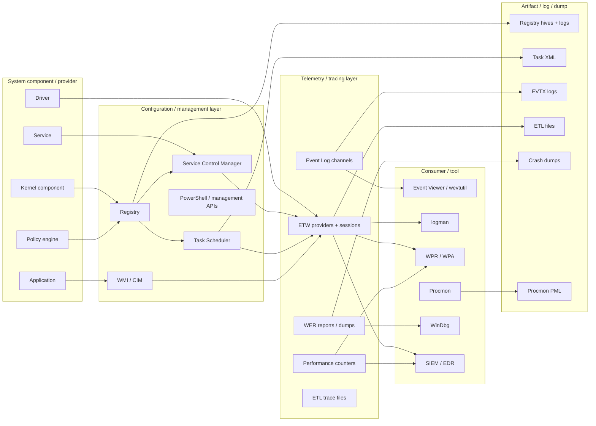
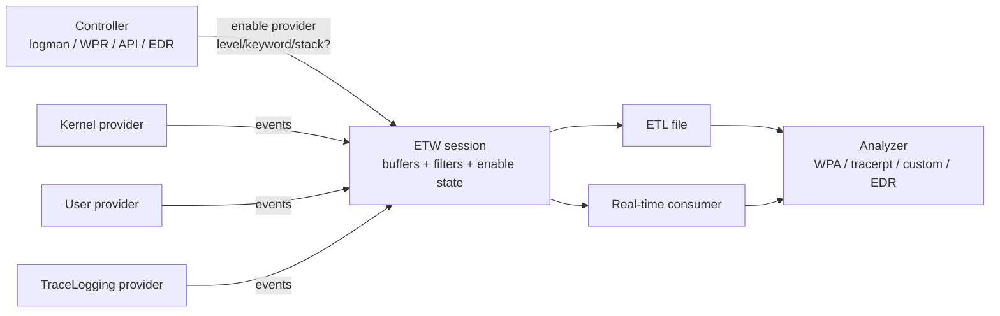
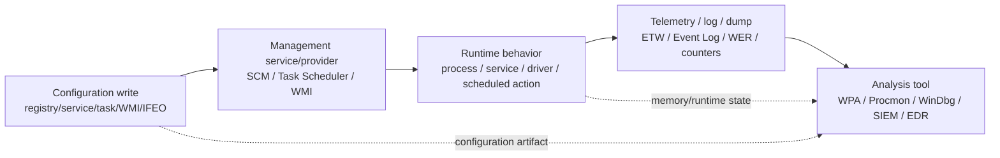
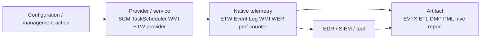

# Chapter 10: Management, Diagnostics, and Tracing

> **Framing note:** Chương này mô tả Windows management, diagnostics, và tracing từ góc nhìn researcher: registry-backed configuration, service control, scheduled execution, WMI/CIM, ETW, Event Log, WER, performance tracing, GFlags/IFEO, AppCompat/shims, WPR/WPA, và Procmon boot logging. Mục tiêu là xây dựng mental model chính xác về **Windows observability layer** — không phải bypass guide, không phải exploit chain.

---

## 0. Chapter Map

**Theo:** Windows Internals, Part 2, Chapter 10.

Chương này nối các primitive ở Ch.1–9 vào một lớp thực dụng hơn: Windows expose state, configuration, diagnostics, và telemetry như thế nào cho administrator, developer, defender, malware analyst, incident responder, reverse engineer, và platform researcher.

**Kết nối với các chương trước:**

| Chương | Liên hệ với Ch.10 |
|--------|-------------------|
| Ch.2 | `services.exe`, system processes, executive managers, Configuration Manager, Service Control Manager |
| Ch.3 | Process creation telemetry, service process hosting, scheduled task action launching, WMI process views |
| Ch.4 | Thread waits, scheduling, CPU analysis, performance traces, WPA timeline |
| Ch.5 | Memory dumps, crash dump interpretation, performance counters, memory pressure telemetry |
| Ch.6 | File/driver/service artifacts, driver services under `HKLM\SYSTEM\CurrentControlSet\Services`, boot-time I/O traces |
| Ch.7 | Audit policy, Security Event Log, privileges, service/task/WMI namespace permissions |
| Ch.8 | ETW, object/debugging mechanisms, handle/object visibility, user/kernel provider boundaries |
| Ch.9 | Code Integrity, VBS/HVCI logs, policy state, virtualization/security telemetry |

**Thông điệp cốt lõi của Ch.10:**
Windows có thể rất observable — nhưng chỉ khi researcher biết **subsystem nào đang ghi lại truth nào**. Registry mô tả configuration; SCM mô tả managed service state; WMI/CIM expose provider-mediated management views; ETW expose provider-generated telemetry; Event Log persist selected events; WER/dumps preserve failure state; performance tools capture high-volume runtime traces. Không có nguồn nào là universal ground truth.

| Mục | Nội dung | Tại sao quan trọng |
|-----|----------|--------------------|
| 0 | Chapter Map | Điều hướng và kết nối với Ch.1–9 |
| 1 | Researcher Mindset | Phân biệt configuration, runtime, telemetry, artifact |
| 2 | Big Picture | Stack configuration → management → telemetry → analysis |
| 3 | Key Terms | Từ điển thuật ngữ registry, SCM, WMI, ETW, Event Log, diagnostics |
| 4 | Core Internals | 11 cơ chế chính từ registry đến Procmon boot logging |
| 5 | Important Components | Bảng components + state/provider/trace context |
| 6 | Trust Boundaries | 8 ranh giới quản trị, logging, diagnostic, dump |
| 7 | Attack Surface Map | Bề mặt configuration/management/telemetry/diagnostics |
| 8 | Abuse Patterns | Các class misuse ở mức khái niệm, detection-focused |
| 9 | Defender / EDR Telemetry | Registry, service, task, WMI, ETW, Event Log, diagnostics |
| 10 | Forensic Artifacts | Hives, task XML, WMI repository, ETL, EVTX, dumps, PML |
| 11 | Debugging and Reversing Notes | reg/sc/schtasks/CIM/logman/WPR/Procmon/WinDbg/x64dbg |
| 12 | Safe Local Labs | 8 lab an toàn để quan sát cơ chế |
| 13 | Common Researcher Mistakes | Các sai lầm phổ biến khi interpret telemetry |
| 14 | Windows Version Notes | Version/build/edition/policy caveats |
| 15 | Summary | Tổng hợp mental model |
| 16 | Research Questions | Câu hỏi tự kiểm tra và mở rộng nghiên cứu |
| 17 | References | Tài liệu tham khảo |
| 18 | Illustration Plan | Sơ đồ, screenshot, search terms |

---

## 1. Researcher Mindset

### 1.1 Windows observable nếu biết nơi nào ghi truth nào

Windows không phải là một black box. Nhưng Windows cũng không phải là một hệ thống có một log duy nhất ghi lại mọi thứ. Mỗi subsystem expose một **loại truth khác nhau**:

- Registry cho biết **configuration**: intent, policy, installed component state, persistence of settings.
- SCM cho biết **managed service model**: service nào được đăng ký, start type nào, binary path nào, account nào, dependency nào, trạng thái running/stopped hiện tại.
- Task Scheduler cho biết **scheduled automation**: trigger, action, principal, condition, history nếu bật.
- WMI/CIM cho biết **provider-mediated management view**: class data được provider translate từ system state hoặc configuration.
- ETW cho biết **provider-generated runtime telemetry**: event chỉ tồn tại nếu provider emit và session enable đúng keyword/level.
- Event Log cho biết **persistent selected events**: đã được provider/channel/logging policy ghi lại và chưa bị rotate/clear.
- WER/crash dumps cho biết **failure-time runtime state**: stack, modules, exception, memory subset hoặc full memory tùy dump type.
- Performance counters/WPR/WPA cho biết **metric/trace behavior over time**: CPU, disk, memory, scheduling, stacks, latency.
- EDR/SIEM cho biết **sensor-enriched interpretation**: native telemetry + callbacks + memory + cloud/context + proprietary logic.

Researcher giỏi không hỏi “Windows có log việc này không?” trước tiên. Họ hỏi:

1. Đây là **configuration** hay **runtime state**?
2. Đây là event **real-time** hay artifact **historical**?
3. Provider/channel/session nào generated dữ liệu?
4. Logging/tracing/audit có được enable tại thời điểm đó không?
5. Source này complete, filtered, sampled, dropped, hay post-processed?
6. Artifact có thể bị clear, rotate, disabled, overwritten, stale, hay missing không?
7. Layer nào observed behavior: kernel, user provider, service, WMI provider, Event Log, Sysmon, EDR sensor?
8. Cần source thứ hai nào để corroborate?

### 1.2 Configuration không phải execution

Registry key tồn tại không đồng nghĩa behavior đang xảy ra. Service key tồn tại không đồng nghĩa service đang running. Scheduled task tồn tại không đồng nghĩa task đã executed. IFEO/GFlags setting tồn tại không đồng nghĩa process đã launched dưới setting đó.

Ví dụ cụ thể:

- `HKLM\SYSTEM\CurrentControlSet\Services\ExampleSvc` có thể còn lại sau khi phần mềm bị uninstall lỗi. `sc query ExampleSvc` có thể báo stopped hoặc service không hoạt động.
- `Start=2` trong service registry key nghĩa là automatic start configuration; không chứng minh service đã start thành công trong boot gần nhất.
- Task XML có trigger logon; nhưng user đó chưa logon sau khi task được tạo, hoặc condition battery/idle không thỏa.
- IFEO debugger value tồn tại; nhưng image target chưa được launch từ khi setting được tạo.

### 1.3 Event Log không phải camera toàn cảnh

Event Log là persistent logging infrastructure, không phải omniscient recorder.

- Security log phụ thuộc audit policy, SACL, privileges, và channel state.
- Object access log không xuất hiện nếu audit policy không bật hoặc object không có SACL phù hợp.
- Một Event ID không meaningful nếu thiếu provider + channel + version context.
- Logs có retention policy; old events có thể rollover.
- Log clearing là một event quan trọng, nhưng absence của old logs không tự động chứng minh malicious clearing.

### 1.4 ETW mạnh nhưng không phải universal truth

ETW là xương sống telemetry của Windows: performance, diagnostics, many Event Log providers, WPR, WPA, và nhiều sensor pipeline đều dựa vào ETW. Nhưng ETW vẫn là provider/session model:

- Provider phải tồn tại.
- Session phải enable provider với keyword/level phù hợp.
- Payload phụ thuộc provider implementation.
- High-volume sessions có thể drop events nếu buffers không đủ hoặc consumer chậm.
- Stack capture phải được cấu hình; không phải event nào cũng có stack.
- ETW không thay thế kernel debugger, memory dump, hay forensic acquisition.

Ví dụ: một provider xuất hiện trong `logman query providers` nhưng không có session nào enable provider đó, thì event không được collect vào trace cụ thể. Provider “available” khác với provider “enabled and captured.”

### 1.5 WMI là management view, không phải raw kernel truth

WMI/CIM rất tiện: `Win32_Process`, `Win32_Service`, `Win32_OperatingSystem`, `Win32_DeviceGuard`, namespace `root\cimv2`. Nhưng WMI data là provider-mediated:

- Provider quyết định class nào expose property nào.
- Provider có thể translate từ registry, API, service, driver, hoặc cached repository data.
- Query performance và completeness phụ thuộc provider.
- Namespace ACL và provider trust matter.
- WMI permanent event subscriptions là management automation surface cần audit.

Một WMI query returning process list không equivalent với kernel memory walk qua `EPROCESS`. Nó là management view đủ tốt cho nhiều mục đích, nhưng không phải raw truth.

### 1.6 Tool không định nghĩa ground truth

Procmon có thể show registry/file/process/network operations rất giàu context, có stack traces, filters, boot logging. Nhưng Procmon không phải kernel debugger, không phải full ETW trace, không phải memory forensics. WinDbg có thể xem dump state rất sâu, nhưng dump là snapshot at failure/acquisition time. WPA có thể timeline scheduling/cpu/disk tốt hơn Procmon, nhưng trace profile quyết định captured data. EDR console có thể enrich behavior, nhưng cũng có sensor coverage và policy limits.

Researcher phải dùng tool như **lens**, không dùng tool như **truth oracle**.

### 1.7 Failure artifacts có giá trị đặc biệt

WER và crash dumps thường bị xem là “dev-only.” Với malware analysis, EDR engineering, và incident response, chúng rất quan trọng:

- Exception code cho biết failure class.
- Call stack cho biết path đến crash/hang.
- Module list cho biết loaded DLLs, injection context, symbols.
- Dump memory có thể chứa config, strings, keys, tokens, network indicators, user data.
- Timeline của report/dump giúp correlate với service/task/process events.

Nhưng dumps cũng là sensitive artifacts. Chia sẻ dump như chia sẻ memory của process hoặc system tại thời điểm đó.

---

## 2. Big Picture

### 2.1 Management / diagnostics stack

Windows management and diagnostics có thể nghĩ như bốn lớp:

1. **Configuration:** registry, services, scheduled tasks, policy, app compatibility, IFEO/GFlags.
2. **Management:** SCM, WMI/CIM, PowerShell, Task Scheduler, management APIs.
3. **Telemetry:** ETW providers, Event Log channels, performance counters, WER, tracing sessions.
4. **Analysis:** Event Viewer, `logman`, `wevtutil`, WPR/WPA, Procmon, PerfMon, WinDbg, SIEM/EDR.



### 2.2 Configuration layer

**Registry** là hierarchical configuration database. Nó lưu system policy, service config, driver config, COM registrations, application settings, autoruns, IFEO, GFlags-related settings, AppCompat entries, audit-related settings, và nhiều state khác.

**Services** expose long-running managed behavior. Service definitions nằm trong registry, nhưng runtime control đi qua SCM trong `services.exe`.

**Scheduled tasks** define automation: trigger + action + principal + conditions. Task definition được register, backed bởi XML/artifacts, và chạy qua Task Scheduler service.

**Policy** có thể đến từ local settings, Group Policy, MDM, enterprise management. Policy keys có thể override local observation.

### 2.3 Management layer

**SCM** quản lý service lifecycle: create, configure, start, stop, dependency, failure actions. Nó là boundary vì service operations require specific access rights.

**WMI/CIM** expose management classes qua provider model. PowerShell thường dùng CIM/WMI để query và automate.

**Task Scheduler** là management surface cho scheduled execution; UI, `schtasks`, COM API, PowerShell ScheduledTasks module đều là clients.

### 2.4 Telemetry layer

**ETW** là runtime tracing fabric. Providers emit events; sessions collect; consumers read. WPR/WPA, logman, many diagnostics stacks rely on ETW.

**Event Log** là persistent event store organized by channels. Providers write selected events. Event Viewer/wevtutil query EVTX logs.

**Performance counters** expose metrics. PerfMon và collectors record time-series data.

**WER** records crashes/hangs, reports, minidumps/full dumps tùy policy.

### 2.5 Analysis layer

Tools không interchangeable:

| Tool | Best at | Limits |
|------|---------|--------|
| Event Viewer / `wevtutil` | Persistent EVTX event review | Depends on channels/audit/retention |
| `logman` | ETW provider/session control, data collector sets | Requires provider/session knowledge |
| WPR/WPA | High-volume ETW performance trace and timeline analysis | Profile/filtering matters; ETL can be large |
| Procmon | File/registry/process/network activity with filters/stacks | High volume; not full kernel debug or full ETW coverage |
| PerfMon | Performance counters over time | Metric-level, not full event semantics |
| WinDbg | Dumps, exceptions, stacks, memory | Snapshot; symbol quality matters |
| SIEM/EDR | Correlation, enrichment, fleet-scale detection | Sensor/policy/proprietary logic limits |

---

## 3. Key Terms

| Term | Vietnamese explanation | Researcher relevance |
|------|------------------------|----------------------|
| **Registry** | Cơ sở dữ liệu hierarchical lưu configuration/state của Windows và applications | Nguồn artifact cấu hình trung tâm; không tự chứng minh runtime execution |
| **Hive** | File/database unit chứa một phần registry tree, được load vào registry namespace | Forensic acquisition: SYSTEM, SOFTWARE, SAM, SECURITY, NTUSER.DAT |
| **Key** | Node trong registry tree, có subkeys, values, security descriptor, timestamp | Path + ACL + last write là context quan trọng |
| **Value** | Named data item dưới key; có type như REG_SZ, REG_DWORD, REG_MULTI_SZ | Chứa config cụ thể: image path, start type, policy flag |
| **HKLM** | HKEY_LOCAL_MACHINE, machine-wide configuration view | Services, drivers, policy, software install state |
| **HKCU** | HKEY_CURRENT_USER, current user's registry view | User-specific settings, autoruns, app config |
| **HKCR** | HKEY_CLASSES_ROOT, merged view cho COM/file associations | COM/AppID/CLSID analysis; WoW64 redirection matters |
| **HKU** | HKEY_USERS, loaded user hives by SID | Multi-user artifact analysis |
| **Transaction log** | Registry hive log files dùng cho consistency/recovery | Có thể hỗ trợ forensic timeline/recovery, nhưng interpretation cần thận trọng |
| **Configuration Manager** | Kernel component quản lý registry | Registry không chỉ là text config; có kernel-managed data structures/security |
| **Service** | Managed component chạy dưới SCM; có thể user-mode hoặc driver service | Long-running behavior and persistence/config surface |
| **Service Control Manager** | Subsystem quản lý service database và lifecycle | Boundary cho create/config/start/stop service operations |
| **services.exe** | Process chứa SCM và host nhiều service-control logic | Ch.2 system process; key process for service behavior |
| **Service type** | Loại service: own process, shared process, kernel driver, file system driver, etc. | Xác định user/kernel implications và hosting model |
| **Start type** | Boot/system/auto/demand/disabled/delayed semantics | Configuration intent; cần verify actual runtime |
| **Service account** | Identity mà service chạy dưới: LocalSystem, NetworkService, user account, gMSA, etc. | Determines privileges, network identity, credential exposure |
| **Service SID** | SID riêng cho service để ACL resources | Important for least privilege and resource access analysis |
| **Scheduled task** | Registered automation object trong Task Scheduler | Triggered execution/persistence/administration artifact |
| **Trigger** | Điều kiện kích hoạt task: time, logon, boot, event, idle, etc. | Không hiểu trigger sẽ interpret sai execution likelihood |
| **Action** | Việc task thực hiện: program/script/COM handler/email legacy | Action + principal = actual behavior surface |
| **WMI** | Windows Management Instrumentation, management infrastructure/provider model | Query/automation/telemetry surface; provider-mediated truth |
| **CIM** | Common Information Model, schema/model chuẩn cho managed entities | Modern PowerShell CIM cmdlets map vào management classes |
| **WMI provider** | Component cung cấp data/methods cho WMI classes | Trust and implementation boundary |
| **WMI consumer** | Client hoặc permanent consumer nhận/query WMI data/events | Important for automation and persistence auditing |
| **WQL** | WMI Query Language, SQL-like query language | Used to query classes/events; syntax appears in logs/scripts |
| **ETW** | Event Tracing for Windows, high-performance tracing framework | Core Windows telemetry and performance infrastructure |
| **ETW provider** | Component emit events with provider name/GUID | Provider context is mandatory for interpretation |
| **ETW session** | Collection context that enables providers and buffers events | Provider available ≠ events captured; session config matters |
| **ETW consumer** | Tool/process reading trace data real-time or from ETL | EDR/WPR/logman/custom tools may consume events |
| **TraceLogging** | Self-describing ETW provider model | Common in modern components; manifest may not be external |
| **Manifest provider** | ETW provider described by XML manifest metadata | Event IDs/payloads can be decoded via manifest |
| **MOF provider** | Older ETW provider metadata model using MOF | Legacy/kernel providers may use MOF-style metadata |
| **Event Log** | Persistent logging infrastructure using channels/providers | EVTX artifact; selected events only |
| **Channel** | Event Log stream: System, Application, Security, Operational, Admin, Debug | Channel state/retention affects visibility |
| **Event ID** | Numeric identifier scoped to provider/channel/version | Weak without provider/channel context |
| **Provider GUID** | GUID identifying ETW/Event Log provider | Needed for robust correlation/trace config |
| **Sysmon-style telemetry** | High-fidelity security telemetry generated by Sysmon-like agent/config | Not built-in default Windows; depends on install/config |
| **WER** | Windows Error Reporting for crashes/hangs/reports/dumps | Failure-time artifact source; sensitive data risk |
| **Crash dump** | Memory snapshot at crash/hang/manual collection | Deep debugging/reversing artifact; may contain secrets |
| **Performance counter** | Metric exposed by OS/component for performance monitoring | Baseline, anomaly, bottleneck, capacity analysis |
| **PerfMon** | Performance Monitor UI/tooling for counters/data collector sets | Practical metric collection and visualization |
| **WPR** | Windows Performance Recorder, records ETW trace profiles | Field-grade trace collection for performance/behavior |
| **WPA** | Windows Performance Analyzer, analyzes ETL traces | Timeline, stacks, CPU/disk/memory/scheduling analysis |
| **logman** | Command-line controller for ETW trace sessions and data collectors | Lists providers, starts/stops sessions, collects ETL |
| **wevtutil** | Command-line Event Log utility | Enumerate/query/export/clear logs; handle carefully |
| **GFlags** | Global Flags tool/settings controlling diagnostic behavior | Page heap, loader snaps, UST; changes runtime behavior |
| **IFEO** | Image File Execution Options registry keys | Debugger/diagnostic per-image settings; audit-sensitive |
| **Application Compatibility** | Windows layer applying compatibility fixes/shims | Can alter app behavior and confuse reversing |
| **Shim** | Compatibility fix applied to an application | Forensic/reversing context; not always malicious |
| **Procmon boot logging** | Process Monitor mode capturing early boot activity | Connect startup config to boot/runtime behavior; high volume |

---

## 4. Core Internals

### 4.1 Registry and Configuration Manager

Registry là hierarchical configuration database của Windows. Nó không phải “một file text lớn.” Nó gồm hives, cells, keys, values, security descriptors, transaction/recovery logs, loaded/unloaded views, symbolic links, virtualization/redirection behavior, và kernel-managed object/security semantics.

**Các root/view phổ biến:**

- `HKLM` — machine-wide configuration: `SYSTEM`, `SOFTWARE`, `SECURITY`, `SAM`, hardware/system policy.
- `HKCU` — current user's loaded hive view, thường map tới một SID dưới `HKU`.
- `HKU` — all loaded user hives, including `.DEFAULT` và user SIDs.
- `HKCR` — merged view từ machine/user class registrations; quan trọng cho COM, file associations, shell extensions.

**Configuration Manager** là kernel component quản lý registry. Khi user-mode gọi Win32 Registry API (`RegOpenKeyEx`, `RegSetValueEx`) hoặc Native API (`NtOpenKey`, `NtSetValueKey`), request đi qua Object Manager/security checks rồi tới Configuration Manager. Registry keys có security descriptors; access rights như query, set value, create subkey, enumerate, notify, write DAC/owner đều matter.

Registry có thể represent:

- Services/drivers: `HKLM\SYSTEM\CurrentControlSet\Services`
- Policies: local/GPO/MDM-backed settings
- COM registrations: CLSID/AppID/TypeLib
- Autoruns/application startup settings
- IFEO/GFlags/app debugging configuration
- AppCompat/shim settings
- Audit/security-related configuration
- Application-specific settings under `HKLM\SOFTWARE` và `HKCU\Software`

**Researcher angle:**

- Registry keys là configuration artifacts. Chúng giúp trả lời “system được cấu hình để làm gì?” không phải luôn trả lời “đã làm gì?”
- Last write timestamp trên key hữu ích nhưng có giới hạn: timestamp ở key level, không per-value; có thể bị updated bởi benign maintenance; timezone/correlation cần cẩn thận.
- Transaction logs (`.LOG`, `.LOG1`, `.LOG2`, etc.) có thể hỗ trợ recovery/forensics nhưng không nên overclaim nếu không dùng parser phù hợp.
- WoW64 redirection/virtualization làm 32-bit và 64-bit views khác nhau (`Wow6432Node`, `SysWOW64` path confusion).
- Runtime state và registry state có thể diverge: service config changed nhưng process vẫn chạy old binary until restart; policy changed nhưng chưa applied; key stale after uninstall.
- Registry permissions là security boundary. Weak ACL trên sensitive keys có thể thay đổi service behavior, COM activation, policy, diagnostic/debug settings.

### 4.2 Services and Service Control Manager

SCM chạy trong `services.exe`. Nó quản lý service database, control requests, dependency ordering, start/stop/pause/continue semantics, service status reporting, và interaction với driver service loading.

**Service có thể là:**

- User-mode service chạy trong own process (`SERVICE_WIN32_OWN_PROCESS`)
- User-mode service chạy shared process, thường `svchost.exe`
- Kernel driver service (`SERVICE_KERNEL_DRIVER`)
- File system driver service
- Adapter/recognizer legacy types

Service configuration được backed bởi registry under:

```text
HKLM\SYSTEM\CurrentControlSet\Services\<ServiceName>
```

Các fields quan trọng:

- `ImagePath` — binary/driver path hoặc service host command line
- `Type` — own/shared/user/driver semantics
- `Start` — boot/system/auto/demand/disabled
- `DelayedAutoStart` — delayed auto-start semantics
- `ObjectName` — service account
- `DependOnService`, `DependOnGroup` — ordering and dependency
- `FailureActions` — restart/run command/reboot behavior
- `Description`, `DisplayName`, `ServiceSidType`, privileges-related configuration

**Shared `svchost.exe`:**
Nhiều services chạy trong một shared host. Nhìn thấy `svchost.exe` trong process list không đủ. Cần map service-to-process bằng Process Explorer, `tasklist /svc`, `sc queryex`, ETW, hoặc service tag analysis. Trên modern Windows, service host splitting thay đổi theo memory/OS version/policy.

**Driver services:**
Driver loading ở Ch.6 liên quan trực tiếp SCM: driver services cũng có keys trong `Services`. `Start=0/1` boot/system start có boot-time implications; `Type` quyết định kernel/file system driver semantics; Code Integrity/HVCI ở Ch.9 ảnh hưởng load outcome.

**Researcher angle:**

- Service creation/change/start/stop là high-value telemetry cho IR/EDR.
- Binary path, signer, ACL, account, required privileges, dependencies, failure actions đều quan trọng.
- Service key tồn tại không chứng minh service running.
- Service running không chứng minh current registry config exactly matched launch config nếu config changed after start.
- `svchost.exe` grouping có thể che service responsible nếu không inspect deeper.
- Service permissions (DACL on service object) quyết định ai có thể change config/start/stop/delete.

### 4.3 Task Scheduler

Task Scheduler chạy actions dựa trên triggers và conditions. Task không chỉ là “cron của Windows”; nó là management automation framework với security context, COM API, XML schema, event triggers, idle/boot/logon/session triggers, và history logging.

**Task definition gồm:**

- **Trigger:** time, daily/weekly, logon, startup/boot, idle, event-based, session state change, registration, custom trigger.
- **Action:** execute program/script, COM handler, legacy actions.
- **Principal:** user/group/service account, logon type, run level, highest privileges.
- **Conditions:** idle, AC power, network availability, wake to run.
- **Settings:** retry, stop if running too long, multiple instances policy, hidden, compatibility.

Definitions are XML-backed and registered into Task Scheduler. Artifacts appear in task files/cache and Event Log channels when history is enabled.

**Researcher angle:**

- Tasks are both management automation and forensic artifacts.
- Analyze trigger + action + principal together. A benign action under a high-privilege principal can be critical; a suspicious action with impossible trigger may be stale.
- Task history may be disabled by default or not retained long enough.
- Inventory scheduled tasks for baseline. Enterprise agents and Windows components create many tasks; context matters.
- Task action launching produces process creation telemetry if your telemetry source collects it.

### 4.4 WMI / CIM

WMI exposes management data through providers. CIM provides a common model/schema for managed entities. In practice, PowerShell, management consoles, scripts, inventory agents, EDRs, and admin tools query WMI/CIM frequently.

Important concepts:

- **Namespace:** logical container, e.g. `root\cimv2`, `root\Microsoft\Windows\...`
- **Class:** model of entity, e.g. `Win32_Process`, `Win32_Service`, `Win32_OperatingSystem`, `Win32_DeviceGuard`
- **Provider:** implementation that supplies class instances/methods/events.
- **WQL:** SQL-like query language for WMI classes/events.
- **Consumer:** client consuming data or permanent event consumer reacting to events.

Common classes:

- `Win32_Process` — process management view; can query process properties and sometimes invoke methods.
- `Win32_Service` — service configuration/status view.
- `Win32_OperatingSystem` — OS version, boot time, architecture, memory values.
- `Win32_DeviceGuard` — Device Guard/VBS/HVCI-related state on supported systems.
- Namespace `root\cimv2` — common default namespace for many Win32 classes.

**Provider trust caveats:**
WMI results depend on provider implementation. A provider may read registry, call Win32 APIs, query kernel/user services, or return cached data. Provider bugs, permission failures, repository issues, namespace ACLs, and OS version differences affect output.

**Permanent event subscriptions:**
At a high level, WMI supports event filters, consumers, and bindings so actions can occur when events match. This is powerful for administration and important for defensive auditing. Discussion here stays detection-focused: inventory filters/consumers/bindings, correlate with authorship/time, and inspect namespace/security context.

**Researcher angle:**

- WMI is management interface, telemetry source, and automation surface.
- WMI results are provider-mediated, not raw kernel truth.
- Permanent event subscriptions matter for persistence/automation audit.
- PowerShell `Get-CimInstance` / `Get-WmiObject` usage often appears in admin and attacker tooling; interpret with command line, script block logs, WMI-Activity logs, and process context.

### 4.5 ETW

ETW — Event Tracing for Windows — is the central tracing infrastructure in Windows. It is designed for high-performance, low-overhead event emission from kernel and user-mode components.

**ETW model:**



**Roles:**

- **Provider:** component emitting events. Identified by name/GUID. Events have IDs, levels, keywords, tasks/opcodes, payload.
- **Session:** collection context with buffers, enabled providers, filtering, optional stack walking, output mode.
- **Controller:** starts/stops/configures sessions and enables providers.
- **Consumer:** reads real-time events or saved ETL files.
- **ETL file:** saved trace data.

**Event fields often important:**

- Provider name/GUID
- Event ID/version
- Keyword/level
- Timestamp and CPU/thread/process context
- Payload fields
- Activity ID/related activity ID when present
- Stack trace if enabled and captured

**Provider families:**

- **Kernel providers:** scheduling, disk, file, network, process/thread/image load, memory, etc. Often used by WPR/WPA.
- **User providers:** application/service/component-specific instrumentation.
- **Manifest providers:** metadata described by manifest.
- **MOF providers:** older metadata model, common in legacy/kernel tracing.
- **TraceLogging providers:** self-describing modern provider style.

**Researcher angle:**

- ETW powers performance, diagnostics, security tools, and parts of EDR telemetry pipelines.
- Provider enabled state matters. Provider available does not mean captured.
- Stack capture is extremely valuable for attributing “who caused this I/O/registry/event,” but requires configuration and symbol support.
- ETW is powerful but not universal ground truth. It records what providers emit into enabled sessions, subject to filtering/drops.
- ETL files are artifacts. They may contain sensitive process paths, command lines, stack/module info, file paths, registry paths, network metadata, and sometimes payload-like data.

### 4.6 Event Log

Event Log is persistent logging infrastructure. Events are organized into channels and written by providers. Event Viewer and `wevtutil` query them; SIEM agents and EDRs often collect selected channels.

Common channels:

- **Application** — app/service events.
- **System** — driver/service/system component events.
- **Security** — audit events, subject to audit policy and SACLs.
- **Setup** — setup/installation/servicing events.
- **Operational/Admin channels** — component-specific logs under Applications and Services Logs.
- **Debug/Analytic channels** — often disabled by default, high-volume diagnostic logs.

Event IDs are provider-specific. “Event ID 1” means different things for different providers. Always record:

- Provider name/GUID
- Channel
- Event ID and version
- TimeCreated
- Computer/user/security context when present
- Payload fields
- Log retention/cleared/rollover context

**Security log caveats:**
Audit policy controls which categories/subcategories are logged. Object access requires relevant audit policy and SACL on the object. Privilege use, process creation, logon, policy changes all depend on configuration.

**Researcher angle:**

- Event ID without provider/channel context is weak.
- Missing event does not mean missing behavior.
- Log retention, rollover, and clearing matter.
- Event Logs are forensic artifacts; they are selected persistent telemetry, not complete telemetry.

### 4.7 WER and crash diagnostics

Windows Error Reporting records crashes and hangs, can create reports, and can generate dumps depending on policy/local dump configuration.

Crash diagnostic artifacts may include:

- Report metadata: application, version, fault module, exception code, bucket.
- Minidump/full dump/local dump.
- Call stack and exception context.
- Loaded modules and versions.
- Memory around exception or full process/system memory depending dump type.

Local dump configuration can affect whether dumps are created, where they are stored, dump type, and retention count. Enterprise policy can redirect or suppress reporting.

**Researcher angle:**

- WER helps root cause analysis and crash triage.
- Dumps reveal runtime state after failure: stack, heap fragments, modules, handles, strings, sometimes secrets.
- Dumps are sensitive. Treat as confidential memory artifacts.
- Crash artifacts help timeline: when did binary fail, under which module, with which exception, after which service/task/process event?

### 4.8 Performance counters, WPR, WPA

Performance counters expose metric streams: CPU, memory, disk, network, process, thread, .NET, SQL, IIS, and component-specific counters. PerfMon can view/log counters and create Data Collector Sets.

WPR records ETW traces based on profiles. WPA analyzes ETL traces with timeline-oriented views:

- CPU Usage (Sampled/Precise)
- Disk I/O
- File I/O
- Memory/heap/page faults
- Generic Events
- Thread scheduling / ready time / wait analysis
- Stack traces and flame-like call tree exploration

**Researcher angle:**

- Performance trace is not only for performance. It can reveal execution patterns, boot behavior, service startup sequence, CPU spikes, disk storms, thread waits, and stack attribution.
- High-volume traces require careful filtering and short collection windows.
- WPR/WPA complement Procmon and WinDbg: Procmon gives operation stream, WPA gives timeline/scheduling/ETW correlation, WinDbg gives memory/exception depth.

### 4.9 GFlags / IFEO / diagnostics flags

Global Flags change diagnostic behavior system-wide or per-image. GFlags is the tool/UI commonly used to configure them. IFEO — Image File Execution Options — is a registry area for per-image execution/debug options.

Common diagnostic concepts:

- **Page heap:** detects heap corruption by placing guard pages/metadata around allocations; high overhead.
- **User Stack Trace Database (UST):** records allocation stack traces for heap analysis.
- **Loader snaps:** verbose loader diagnostics for DLL loading/binding.
- **IFEO debugger:** configure a debugger for an image launch.
- **Per-image flags:** diagnostic behavior scoped to a target executable.

**Researcher angle:**

- Diagnostics settings can alter runtime behavior. A process under page heap may be slower and crash earlier/more deterministically.
- IFEO/GFlags are useful for debugging and also important to audit because they affect process launch and behavior.
- Distinguish lab/debug configuration from production state. Do not assume IFEO/GFlags settings are malicious; do not ignore them either.

### 4.10 Application Compatibility / Shims

Windows Application Compatibility layer can apply shims to modify application behavior for compatibility with newer OS versions. Shims may intercept/adjust API behavior, version checks, file/registry behavior, and application assumptions.

Compatibility databases and appcompat mechanisms influence how specific applications run. For reverse engineers, this means the same binary can behave differently depending on compatibility context.

**Researcher angle:**

- Shims can affect execution behavior without changing the binary.
- AppCompat artifacts matter in forensics and timeline analysis.
- Compatibility layer can confuse reversing: observed API behavior may be shimmed, not original program logic.
- Enterprise environments may deploy compatibility fixes deliberately.

### 4.11 Procmon boot logging

Process Monitor can capture boot-time activity by installing a boot logging component and collecting early file/registry/process/thread/network-ish operation data until Procmon saves the PML after reboot.

**Useful for:**

- Services/drivers/startup investigation.
- Mapping registry/service/task configuration to actual boot behavior.
- Seeing early file/registry access patterns that normal live capture misses.
- Correlating boot delays or failures with components.

**Researcher angle:**

- Boot logging is high volume. Filtering is mandatory.
- It is not equivalent to a full kernel trace or kernel debugger.
- Use VM/snapshot for experimentation. Disable boot logging after test.
- PML files are evidence/analysis artifacts and may contain sensitive paths/metadata.

---

## 5. Important Windows Components / Structures

| Component | Role | Researcher angle | Useful tools |
|-----------|------|------------------|--------------|
| Configuration Manager | Kernel registry manager | Registry semantics, security, hive state | WinDbg, reg.exe, Procmon |
| Registry hive | Persistent registry database unit | Offline forensics and config recovery | regedit, reg save/load, forensic parsers |
| Registry key/value | Hierarchical config node/data | Last write, ACL, value semantics | reg.exe, regedit, Procmon |
| Registry transaction log | Hive recovery/logging data | Potential timeline/recovery context | Offline parsers, forensic tools |
| SCM | Service lifecycle/control manager | Create/change/start/stop boundary | sc.exe, services.msc, PowerShell |
| services.exe | Process hosting SCM | System process for service control | Process Explorer, WinDbg, ETW |
| Service registry key | Backing config for service/driver | ImagePath/Start/Type/account/deps | reg.exe, sc qc, Autoruns |
| Task Scheduler service | Runs registered tasks | Scheduled execution boundary | Task Scheduler UI, schtasks |
| Task XML definition | Task trigger/action/principal config | Forensic artifact and baseline item | schtasks, Task Scheduler UI |
| WMI service | Hosts WMI infrastructure | Management/query/automation hub | wbemtest, PowerShell, Event Viewer |
| WMI provider | Supplies class data/events | Provider-mediated truth boundary | Get-CimClass, WMI-Activity logs |
| WMI repository high-level | Stores WMI class/provider metadata | Artifact for provider/subscription state | wbem tools, forensic parsers |
| ETW provider | Emits trace events | Provider context essential | logman, wevtutil gp, WPA |
| ETW session | Collects ETW events | Enable state/filter/drop boundary | logman, xperf, WPR |
| ETW consumer | Reads real-time or ETL events | Tool/EDR interpretation layer | WPA, tracerpt, custom consumers |
| Event Log service | Persistent event logging service | Channel retention/clearing/state | Event Viewer, wevtutil |
| Event Log channel | Persistent event stream | Provider/channel context | Event Viewer, wevtutil el/qe |
| WER | Crash/hang reporting | Failure-time artifacts | Reliability Monitor, Event Viewer |
| Crash dump | Memory snapshot for debugging | Sensitive runtime state | WinDbg, dumpchk |
| Performance counter | Time-series metric source | Baseline/anomaly/bottleneck | PerfMon, typeperf |
| WPR/WPA | ETW recording/analysis suite | Deep behavior/performance timeline | WPR, WPA |
| GFlags | Diagnostic flags tool/settings | Runtime behavior changes | gflags.exe, registry, WinDbg |
| IFEO registry keys | Per-image execution/debug settings | Launch redirection/diagnostics audit | reg.exe, Autoruns, Procmon |
| AppCompat/shim database | Compatibility behavior database | Runtime behavior may be modified | Compatibility Administrator, Procmon |
| Procmon boot log | Boot-time operation capture | Startup behavior artifact | Procmon, PML filters |

### 5.1 Configuration vs runtime state

Registry/services/tasks define intended or configured behavior. Runtime state must be confirmed separately:

- Service config says `Auto`; runtime process may not exist due to start failure.
- Task exists; trigger may never fire.
- Registry policy key exists; effective policy may require refresh/reboot or be overridden by higher-precedence policy.
- IFEO/GFlags exists; target process may not have launched since setting was applied.
- Driver service key exists; Code Integrity/HVCI may block load.

Stale config remains common after uninstall, failed updates, interrupted installers, or enterprise policy churn. Good analysis correlates config artifact with execution telemetry: process creation, service control events, ETW, Event Log, prefetch/amcache/shimcache where appropriate, WER/dumps, and memory/runtime inspection.

### 5.2 Provider-mediated truth

WMI, ETW, and Event Log are provider-generated. Provider implementation and enabled state matter:

- WMI provider may be stale, buggy, permission-limited, or version-specific.
- ETW provider emits only selected events; session must enable it.
- Event Log provider writes selected persistent events; channel may be disabled or rolled.
- Security audit provider depends on audit policy and SACL.

No single provider equals complete ground truth. Treat each source as a witness with scope and bias.

### 5.3 Trace volume and context

Diagnostic systems can produce huge data. Volume without context is noise.

- Use short capture windows around hypothesis-driven actions.
- Record start/stop time, timezone, system clock accuracy, profile/settings used.
- Capture stack traces when possible for attribution.
- Preserve raw ETL/PML/EVTX/dump artifacts separately from exported summaries.
- Correlate timestamps across Event Log, ETW, Procmon, WER, and EDR.

---

## 6. Trust Boundaries

### 6.1 Registry configuration boundary

Write access to sensitive keys changes system behavior. Registry keys have security descriptors; access is not simply “admin can edit everything” in a meaningful security analysis.

Important points:

- Service, driver, policy, COM, IFEO, AppCompat, autorun, and security configuration keys are high-value.
- Key DACLs determine who can set values/create subkeys/change permissions.
- Policy keys may override local UI/settings and may come from GPO/MDM.
- Registry redirection/virtualization affects which view a process sees.
- Audit registry writes with path, value name/type/data, process, user, integrity level, and call stack if available.

### 6.2 Service control boundary

SCM mediates service operations. Service objects have security descriptors separate from file ACLs and registry ACLs.

- Creating/changing/deleting service config requires service control access rights.
- Starting/stopping service requires appropriate rights.
- Service account determines runtime security context.
- Binary path file ACL and signer matter: a protected service config pointing to weakly writable binary path is dangerous.
- Dependencies and failure actions can change runtime behavior.

### 6.3 Scheduled task boundary

Scheduled tasks combine trigger, action, principal, and folder ACL.

- Principal defines execution identity and run level.
- Trigger/action define behavior; conditions influence whether behavior occurs.
- Task folder ACLs matter for who can create/update/delete tasks.
- Task history may be disabled; absence of history is not absence of execution.
- Task action may spawn process under a different security context than the creating user.

### 6.4 WMI provider boundary

WMI clients trust provider output. Providers may execute with privileges and access system internals not directly available to the caller.

- Namespace ACLs define who can query/execute methods/subscribe.
- Provider implementation can hide complexity or fail silently.
- Permanent event filters/consumers/bindings need periodic auditing.
- WMI repository/provider registration is configuration state; runtime execution still needs corroboration.

### 6.5 ETW provider/session boundary

ETW visibility depends on provider and session configuration.

- Providers emit only when enabled or when internally logging to a channel/session.
- Sessions are controlled by privileged/authorized users or services.
- Consumers may miss events if not subscribed at the right time.
- High-volume events can be dropped, filtered, or overwritten depending buffer/session settings.
- Stack walking and payload decoding require profile/metadata/symbols.

### 6.6 Event Log boundary

Event Logs depend on provider, audit policy, channel state, retention, and permissions.

- Security log requires audit policy; object events require SACL.
- Operational/Admin channels may be disabled or low retention.
- Logs can roll over under volume.
- Clearing logs is itself important telemetry, but retention gaps need context.
- Absence of log is not absence of activity.

### 6.7 Diagnostic dump boundary

Dumps expose sensitive memory. Dump creation policy and location matter.

- LocalDumps/WER config controls dump type/path/count.
- Full dumps may contain credentials, tokens, document contents, secrets, private keys, malware config, user data.
- Dump collection can affect disk space and privacy obligations.
- Debug settings may change runtime behavior before failure.

### 6.8 GFlags/IFEO boundary

Diagnostic configuration can change process behavior.

- IFEO debugger settings can redirect process launch for debugging.
- Page heap/loader snaps/UST can affect performance and crash behavior.
- Audit IFEO/GFlags keys carefully; distinguish legitimate lab/debug settings from unexpected production state.



---

## 7. Attack Surface Map

Attack surface ở đây nghĩa là nơi configuration, management authority, telemetry, hoặc diagnostic state có thể **alter** hoặc **reveal** system behavior. Đây là map cho defensive research, not a guide to abuse.

| Surface | Examples | Boundary crossed | What to observe | Research value |
|---------|----------|------------------|-----------------|----------------|
| Registry keys | Services, Run keys, policy, COM, IFEO | Config write → system behavior | Key/value create/set/delete, ACL, process/user | Configuration timeline and intent |
| Registry ACLs | Weak DACL on service/policy/app keys | Authorization boundary | DACL changes, inherited permissions | Misconfiguration and privilege boundary analysis |
| Service configuration | ImagePath, Start, Type, FailureActions | SCM config → managed execution | Create/change/delete, signer, binary path | Long-running behavior baseline |
| Service permissions | Service DACL | Service control rights | Who can start/stop/change/delete | Least privilege and lateral admin risk |
| Service account | LocalSystem, NetworkService, domain account | Identity boundary | Account, privileges, credential exposure | Runtime security context |
| Driver service keys | Kernel/file system driver configs | User config → kernel load path | Type/Start/ImagePath, CI/HVCI logs | Kernel attack surface and boot artifacts |
| Scheduled tasks | Trigger/action/principal | Scheduled automation boundary | XML, registration, history, launched process | Persistence/admin automation analysis |
| Task XML | Task definition files/cache | Config artifact | Diff trigger/action/principal/settings | Baseline and forensic comparison |
| WMI namespaces | `root\cimv2`, vendor namespaces | Management access boundary | ACLs, class/provider enumeration | Query/method access control |
| WMI providers | Win32 providers, vendor providers | Provider trust boundary | Provider registration/activity/errors | Provider-mediated truth and attack surface |
| WMI permanent subscriptions | Filters/consumers/bindings | Event automation boundary | Creation/modification, author, namespace | Persistence/automation auditing |
| ETW providers | Kernel/user/TraceLogging providers | Telemetry generation boundary | Enable state, metadata, payloads | Visibility mapping |
| ETW sessions | NT Kernel Logger, WPR sessions, EDR sessions | Trace collection boundary | Start/stop/config/buffers/drops | Telemetry coverage validation |
| Event Log channels | Security/System/Application/Operational | Persistent logging boundary | Enabled state, retention, clear events | Historical artifact review |
| Audit policy | Advanced audit policy, SACLs | Security telemetry boundary | Policy changes, category/subcategory | Explains Security log presence/absence |
| WER dump settings | LocalDumps, corporate WER policy | Failure artifact boundary | Dump type/path/count, report events | Crash triage and sensitive data handling |
| Crash dump files | `.dmp`, minidumps | Memory disclosure boundary | Creation time, process, exception, modules | Root cause and memory forensics |
| Performance counters | CPU/disk/memory/process counters | Metrics exposure boundary | Baseline deviations, counter availability | Anomaly and capacity analysis |
| WPR profiles | CPU/disk/file/network/memory profiles | Trace scope boundary | Providers, stack walking, duration | Deep behavior timeline |
| GFlags | Global/per-image diagnostic flags | Debug behavior boundary | Flag changes, target image | Lab/prod behavior differences |
| IFEO keys | Debugger, verifier, silent process exit | Process launch behavior boundary | Key/value changes, target image | Launch redirection/debug audit |
| AppCompat shims | Compatibility database entries | Runtime behavior modification | Shim DB/appcompat events/artifacts | Reversing context and timeline |
| Procmon boot logs | PML boot captures | Early boot observation boundary | Enabled state, PML artifact, filters | Startup config-to-runtime correlation |
| PowerShell/WMI/CIM queries | `Get-CimInstance`, WQL queries | Management query boundary | Command line, script block, WMI logs | Admin vs suspicious automation context |
| Policy/MDM/GPO configuration | Policy registry keys, device management | Enterprise authority boundary | Source, precedence, refresh time | Explains local state changes |

---

## 8. Abuse Patterns — Concept Level

Phần này mô tả misuse classes ở mức phân tích/detection. Không có exploit chain, không có bypass guide, không có weaponized instructions.

### 8.1 Registry configuration misuse class

Sensitive registry keys influence system behavior. Unexpected writes to service, driver, policy, COM, autorun, IFEO, AppCompat, shell, and security configuration paths deserve attention.

Research focus:

- Which process/user wrote the key/value?
- Was the key protected as expected?
- Was the data type/path/account/policy value normal for this environment?
- Did runtime behavior follow later?
- Do transaction logs/last write/EDR registry events support a timeline?

Last-write timestamps and transaction logs help investigation, but they are not full event logs. Correlate with process telemetry and Event Log/ETW.

### 8.2 Service configuration misuse class

Services are long-running managed execution points. They run under configured accounts, often with elevated privileges, and may start at boot.

Research focus:

- Service binary path: path quoting, writable directories, signer, hash, version.
- Service account: LocalSystem vs service account vs domain account.
- Permissions: service DACL, registry DACL, file ACL.
- Dependencies and failure actions.
- Driver service type and Code Integrity/HVCI outcomes.
- Start/stop/change telemetry.

### 8.3 Scheduled task misuse class

Tasks combine trigger, action, and principal. A task is meaningful only when all three are interpreted together.

Research focus:

- Trigger: boot/logon/time/event/idle; realistic firing conditions.
- Action: executable/script/COM handler; arguments; working directory.
- Principal: user/service account, run level, stored credentials/logon type.
- Task history: enabled? retained? cleared?
- XML/cache/Event Log/process creation correlation.

### 8.4 WMI persistence/automation class

WMI can automate and react to events. Permanent subscriptions are legitimate for management but important to audit.

Research focus:

- Enumerate filters, consumers, and bindings.
- Identify namespace and creator context.
- Inspect WQL event query conceptually: what condition triggers?
- Inspect consumer action at a defensive level: what would run or notify?
- Correlate with WMI-Activity logs and PowerShell logs if applicable.

Keep analysis detection-focused. Avoid turning subscription mechanics into an operational abuse recipe.

### 8.5 ETW visibility gap class

ETW coverage varies by provider and session.

Research focus:

- Provider exists? Which GUID/name/version?
- Was it enabled during the behavior?
- Which keywords/levels were enabled?
- Were stacks captured?
- Were events dropped due to buffer pressure?
- Is the provider user-mode, kernel-mode, manifest, MOF, or TraceLogging?

A visibility gap is not automatically evasion; it may be normal collection scope.

### 8.6 Event Log blind spot class

Event Log blind spots often come from configuration:

- Audit policy not enabled.
- Object lacks SACL.
- Channel disabled.
- Log retention too small.
- Events rolled over under volume.
- Provider not writing the event expected on that OS build.

Research focus: explain why a log is missing before concluding behavior did not happen.

### 8.7 Diagnostic setting abuse class

IFEO/GFlags/debug settings can change process launch and runtime behavior. They are legitimate debugging tools but should be baselined.

Research focus:

- Which image is targeted?
- Which diagnostic/debug setting is configured?
- Who changed it and when?
- Is this lab/dev machine or production endpoint?
- Did process behavior/crash/performance change after setting?

### 8.8 AppCompat/shim confusion class

Shims can alter runtime behavior without binary modification. Reverse engineers may see API behavior that comes from compatibility layer rather than program logic.

Research focus:

- Is compatibility mode set for the target?
- Are appcompat artifacts present?
- Does behavior reproduce on a clean machine/profile?
- Do Procmon/WPA/WinDbg observations show shim DLLs or compatibility paths?

### 8.9 Crash dump / WER exposure class

Dumps may contain sensitive memory. WER settings can create artifacts useful for debugging and risky for data handling.

Research focus:

- Dump type and location.
- Process identity and data sensitivity.
- Exception code, fault module, call stack.
- Retention and access permissions.
- Whether dump creation was expected by policy.

---

## 9. Defender / EDR Telemetry


> Telemetry interpretation note:
> ETW/Event Log/WMI/EDR are provider-generated or sensor-generated views, not universal ground truth. Telemetry must be interpreted with source layer, configuration, provider state, collection policy, and retention. Absence of an event is not proof of absence. High-signal anomaly still requires context and correlation.

### 9.1 Registry telemetry

| Event class | Examples | Source layer | Research notes | Limits |
|-------------|----------|--------------|----------------|--------|
| Key create/delete | New service key, IFEO key, policy subkey | Kernel callbacks, ETW, Sysmon/EDR, audit if configured | Capture process/user/path/integrity; path normalization matters | Native Event Log coverage limited unless auditing/sensor configured |
| Value set/delete | `ImagePath`, `Start`, `Debugger`, policy DWORD | Registry APIs/callbacks/EDR | Value name/type/data are essential; redact secrets | Last-write timestamp is key-level, not per-value proof |
| Security descriptor changes | DACL/SACL change on service/policy key | Security audit/EDR | High-value for configuration boundary changes | Requires auditing/sensor; inherited ACLs complicate interpretation |
| Policy changes | GPO/MDM/local policy keys | Registry + policy engine logs | Need source/precedence; effective policy may lag | Local key may not identify enterprise source alone |
| Service key changes | `Services\<name>` values | Registry + SCM/Event Log/EDR | Correlate with service control events and process start | Config change may not affect already-running service |
| IFEO/GFlags changes | `Image File Execution Options`, global flags | Registry/EDR/Autoruns | Distinguish debugging from suspicious production drift | Legitimate dev/test noise common |
| AppCompat/shim changes | Compatibility settings/database | Registry/file/appcompat logs | Helps explain altered runtime behavior | Artifacts vary by OS/version/tooling |
| Transaction/log caveats | Hive `.LOG*` recovery data | Offline forensics | Can support reconstruction with proper tools | Not a friendly chronological event log |

### 9.2 Service and task telemetry

| Event class | Examples | Source layer | Research notes | Limits |
|-------------|----------|--------------|----------------|--------|
| Service installed | New service database entry | SCM/System log/EDR/registry | Record service name, type, path, account, creator | Event retention and provider specifics vary |
| Service config changed | ImagePath/start/account/failure action update | SCM + registry telemetry | Diff old/new config; correlate with writes | May not restart immediately |
| Service started/stopped | Start/stop/control events | SCM/System log/ETW/EDR | Map PID to service, especially svchost | Shared hosts obscure attribution without service mapping |
| Driver service changed | Kernel driver service key/type/start | Registry/SCM/CI logs | Include signer, HVCI/CI result | Load failure may be compatibility, not malicious |
| Scheduled task created | New registered task/XML | Task Scheduler operational log/EDR/file/registry | Analyze trigger/action/principal | History may be disabled; file/cache internals vary |
| Scheduled task updated/deleted | XML/action/principal changed | Task Scheduler logs/EDR | Diff task definition; preserve old XML if possible | Deletion can remove definition artifact |
| Task started/completed | Action launched, result code | Task history/process telemetry | Correlate with process creation and exit code | Task history not always enabled/retained |
| Task history caveats | Disabled channel/limited retention | Channel state | Always record whether history was enabled | Missing task event is not proof task did not run |

### 9.3 WMI telemetry

| Event class | Examples | Source layer | Research notes | Limits |
|-------------|----------|--------------|----------------|--------|
| WMI query | `SELECT * FROM Win32_Process`, CIM cmdlets | WMI-Activity, PowerShell, EDR | Query text + client process + namespace matter | Not all queries logged by default at desired detail |
| Provider activity | Provider load/errors | WMI logs/ETW/Event Log | Provider failure explains missing/misleading data | Provider internals may be opaque |
| Permanent subscription creation | Filter/consumer/binding creation | WMI repository/WMI logs/EDR | High-value audit event; inspect namespace/principal | Requires collection; artifacts may need offline parsing |
| Namespace/security changes | WMI namespace ACL modifications | WMI/security telemetry | Management boundary change | Logging often limited without EDR/audit |
| WMI service events | Service start/errors/repository issues | Event Log/System/WMI channels | Helps explain query behavior | Not full query audit |
| PowerShell CIM/WMI usage | `Get-CimInstance`, `Get-WmiObject`, remoting | PowerShell logs/EDR/process telemetry | Correlate script block/module/process context | PowerShell logging policy-dependent |
| Limitations | Provider-mediated data | Analytical caveat | Validate with native tools where needed | WMI output may not be raw truth |

### 9.4 ETW telemetry

| Event class | Examples | Source layer | Research notes | Limits |
|-------------|----------|--------------|----------------|--------|
| Provider enable/disable | Session enables provider keywords/level | ETW controller/session metadata | Useful to understand collection scope | Not always persistently logged in friendly form |
| Session start/stop | WPR/logman/EDR trace session | ETW/session state | Identify controller, output path, provider set | Some sessions are transient/protected |
| Event emission | Provider events captured | ETW buffers/ETL/consumer | Provider/event/payload/timestamp context required | Only captured if session active and configured |
| Stack trace capture | Stack walking for selected events | ETW profile/session | High attribution value | Overhead; not all events/stacks captured/symbolized |
| ETL file creation | Trace saved to disk | File system + ETW tools | Artifact may contain sensitive metadata | ETL parsing requires metadata/symbols |
| Kernel/user provider coverage | Kernel process/thread/disk/file vs app providers | ETW provider model | Helps choose trace profile | Coverage varies by OS/build/provider |
| Dropped events | Buffer loss under load | ETW session stats | Must check lost event counts | Absence may be collection loss |

### 9.5 Event Log telemetry

| Event class | Examples | Source layer | Research notes | Limits |
|-------------|----------|--------------|----------------|--------|
| Security/System/Application | Logon, service events, app errors | Event Log providers | Persistent baseline channels | Policy/retention/provider dependent |
| Operational/Admin channels | TaskScheduler, WMI-Activity, CodeIntegrity, PowerShell | Component providers | Often more actionable than generic logs | Some channels disabled/low retention |
| Audit policy changes | Advanced audit policy modification | Security log/policy | Explains visibility shifts | Requires prior logging to see change |
| Log clear/rollover | Log cleared, old events overwritten | Event Log service | Important timeline event | Rollover may be normal under volume |
| Event provider context | Provider name/GUID/channel/version | Event metadata | Required for correct Event ID interpretation | Messages may fail if manifest missing offline |
| Retention limitations | Max log size, overwrite policy | Channel config | Must document before interpreting gaps | Old events may be unrecoverable |

### 9.6 Diagnostic/performance telemetry

| Event class | Examples | Source layer | Research notes | Limits |
|-------------|----------|--------------|----------------|--------|
| WER report | Crash/hang report created | WER/Event Log/files | Timeline + fault module/exception | Reporting may be disabled/redirected |
| Crash dump | `.dmp` local/minidump/full dump | WER/local dump config/manual | Deep runtime state | Sensitive, large, point-in-time |
| Performance anomaly | CPU/disk/memory/counter spike | Perf counters/EDR/WPA | Useful for behavior detection | Metrics are not causality alone |
| WPR traces | ETL profiles | ETW/WPR | High-quality timeline and stacks | Requires planned collection; large data |
| WPA analysis | CPU/disk/thread/memory views | ETL analysis | Root cause/perf/reversing aid | Symbol/profile quality matters |
| GFlags/IFEO changes | Page heap/debugger/loader snaps | Registry/EDR | Runtime behavior modifiers | Legitimate debugging common |
| Procmon boot logs | PML boot capture | Procmon driver/log | Startup artifact with operation detail | High volume; not full kernel truth |

### 9.7 Telemetry limits

- Configuration state does not prove execution.
- Runtime state may not leave durable artifact.
- Provider disabled means no event for that provider/session.
- Event Log depends on policy, channel state, retention, provider behavior.
- ETW events may be dropped under load.
- WMI output is provider-mediated.
- Sysmon-style telemetry is not Windows default unless installed/configured.
- EDR may enrich data beyond Windows native logs: kernel callbacks, minifilters, memory scanners, cloud reputation, proprietary sensors.
- Time synchronization matters. Clock skew breaks correlation across EVTX, ETL, EDR, SIEM, WER, and filesystem timestamps.



---

## 10. Forensic Artifacts

### 10.1 Registry artifacts

- Registry hives: `SYSTEM`, `SOFTWARE`, `SECURITY`, `SAM`, `NTUSER.DAT`, `UsrClass.dat`.
- Transaction/recovery logs: hive `.LOG*` files.
- Last write timestamps on keys.
- Service keys: `HKLM\SYSTEM\CurrentControlSet\Services\...`.
- Driver service keys with `Type`, `Start`, `ImagePath`.
- IFEO keys: image-specific execution/debug settings.
- GFlags-related settings: global/per-image diagnostic flags.
- AppCompat keys/settings and compatibility artifacts.
- Policy keys: local/GPO/MDM effective configuration.
- Run/autorun locations as administrative/forensic configuration.
- COM/CLSID/AppID registrations relevant to service/task/script behavior.

### 10.2 Service/task artifacts

- `HKLM\SYSTEM\CurrentControlSet\Services` service database.
- Service binary path, account, start type, dependencies, failure actions.
- Service DACL/security descriptor where available.
- Task XML definitions and registered task metadata.
- Task cache high-level artifacts.
- Task history logs under TaskScheduler operational channels when enabled.
- Service control events in System log/SCM provider.
- Process creation telemetry for service/task actions.

### 10.3 WMI artifacts

- WMI repository high-level metadata.
- Namespaces and namespace ACLs.
- Provider registrations.
- Permanent event filters, consumers, bindings.
- WMI-Activity logs.
- WMI service/provider error logs.
- PowerShell logs if WMI used through PowerShell: script block/module/transcription depending policy.
- Process/network telemetry for WMI clients/remoting context.

### 10.4 ETW/Event Log artifacts

- ETL files from WPR/logman/xperf/custom/EDR sessions.
- EVTX Event Logs.
- Provider/channel metadata.
- Security logs and audit policy state.
- Operational logs: TaskScheduler, WMI-Activity, PowerShell, CodeIntegrity, AppLocker/WDAC-related, etc.
- Event Log clear events and channel configuration.
- Trace session metadata where available.

### 10.5 WER/dump artifacts

- WER reports and report queues/archives.
- Local dumps configured by policy/registry.
- Application minidumps/full dumps.
- System crash dumps.
- Exception codes and exception context.
- Faulting module list and loaded module list.
- Call stacks and thread context.
- Bucketing metadata.

### 10.6 Performance/diagnostic artifacts

- WPR ETL traces.
- PerfMon logs / Data Collector Set outputs.
- Procmon PML files.
- Procmon boot logs.
- GFlags/IFEO state in registry.
- Compatibility/shim artifacts and databases.
- WPA analysis projects/exports if saved.
- Symbol/cache metadata used during analysis.

---

## 11. Debugging and Reversing Notes

### reg.exe / regedit

Use `reg.exe` and regedit to inspect keys/values, export small subtrees, and compare configuration. For research:

- Prefer read-only inspection first.
- Export before modifying test keys.
- Inspect permissions, not just values.
- Remember 32-bit vs 64-bit registry views.
- Avoid modifying system keys without backup/snapshot.

### sc.exe / services.msc

`sc.exe` queries SCM and service configuration; `services.msc` gives UI view.

- `sc query` shows service state.
- `sc qc <service>` shows config: type, start, binary path, account, dependencies.
- `sc queryex` can show PID for running service.
- Distinguish service config from running process.
- For shared `svchost.exe`, map service-to-PID with additional tools.

### schtasks / Task Scheduler UI

Use `schtasks /query /fo LIST /v` and Task Scheduler UI to inspect tasks.

- Analyze triggers, actions, principals, run level, conditions.
- Check whether task history is enabled.
- Export XML for diffing/baseline.
- Correlate task start with process creation and Event Log.

### PowerShell CIM/WMI

Modern PowerShell prefers CIM cmdlets:

- `Get-CimInstance Win32_Process`
- `Get-CimInstance Win32_Service`
- `Get-CimInstance Win32_OperatingSystem`
- `Get-CimClass -Namespace root\cimv2`

`Get-WmiObject` is legacy but still appears in older scripts. Treat output as provider-mediated data. Compare with Process Explorer/services.msc/SCM/Event Log when accuracy matters.

### logman / wevtutil

`logman` controls ETW sessions and data collector sets:

- List providers.
- Start/stop trace sessions.
- Save ETL files.
- Inspect collection properties.

`wevtutil` queries Event Logs:

- Enumerate channels.
- Query recent events.
- Export logs.
- Inspect provider/channel metadata.

Provider/channel context matters. Do not interpret Event ID alone.

### WPR/WPA

WPR records ETW performance traces; WPA analyzes them.

- Choose profile based on question: CPU, disk, file I/O, networking, memory, boot, general.
- Keep trace windows short.
- Enable stack walking when attribution matters and overhead is acceptable.
- Use symbols carefully; bad symbols produce shallow conclusions.
- WPA views are excellent for CPU/disk/thread scheduling timelines.

### Procmon

Procmon observes file, registry, process/thread, and network-related operations with filters and optional stacks.

- Filter carefully: process name, path, operation, result, time window.
- Capture stacks with symbols when root cause matters.
- Save PML as evidence/analysis artifact.
- Boot logging is powerful for startup problems; use VM/snapshot.
- Procmon complements ETW/WPA/WinDbg; it is not a full kernel debugger.

### WinDbg

WinDbg is the primary tool for crash dumps and deep Windows debugging.

Use it for:

- Exception context.
- Call stacks.
- Module list.
- Threads and waits.
- Heap/memory state.
- Handle/object inspection in dumps where available.
- Driver/system crash analysis.

WinDbg complements WER/WPA/Procmon: WER gives dump/report, WPA gives timeline/perf trace, Procmon gives operation stream, WinDbg gives memory/control-flow depth.

### x64dbg

x64dbg is useful for user-mode reversing:

- API calls and breakpoints.
- Exceptions and control flow.
- Module loading.
- Registry/file API observation at user-mode boundary.
- Correlate with Procmon to confirm external operations.

Remember: x64dbg sees target process user-mode behavior, not all kernel/provider/system truth.

---

## 12. Safe Local Labs


> Lab format note:
> Mỗi lab nên được đọc theo checklist: **Goal**, **Requirements**, **Steps**, **Expected observations**, **Research notes**, và **Cleanup**. Nếu một lab cũ chưa ghi đủ từng nhãn này, áp dụng checklist này trước khi chạy: dùng Windows VM/snapshot, ghi tool version/build, chỉ thao tác trên test artifact, dừng collector/debug setting sau lab, và xóa test files/keys/processes do lab tạo.

### Lab 10.1 — Registry configuration observation

**Goal:** Understand registry as configuration database.

**Steps:**

1. Use regedit to inspect `HKLM\SOFTWARE` and `HKCU\Software`.
2. Use `reg query` on a harmless key.
3. Export a small harmless key.
4. Compare key/value format and value types.
5. Inspect permissions on a test key if created.

**Cleanup:**

- Delete only test keys created for the lab.
- Do not modify system/service/policy keys.

### Lab 10.2 — Service configuration inspection

**Goal:** Connect SCM to registry-backed service config.

**Steps:**

1. Run `sc query`.
2. Pick a harmless Microsoft service.
3. Run `sc qc <service>`.
4. Inspect the same service in `services.msc`.
5. Locate service process in Process Explorer if running.
6. Compare account, binary path, start type, and running PID.

**Cleanup:**

- No changes required if only querying.

### Lab 10.3 — Scheduled task inspection

**Goal:** Understand trigger/action/principal.

**Steps:**

1. Run `schtasks /query /fo LIST /v`.
2. Open Task Scheduler.
3. Pick a Microsoft task.
4. Inspect triggers, actions, conditions, principal, and run level.
5. Check task history state.

**Cleanup:**

- Do not edit task definitions.

### Lab 10.4 — WMI/CIM query lab

**Goal:** Understand provider-mediated management data.

**Steps:**

1. Run:

   ```powershell
   Get-CimInstance Win32_Process | Select-Object -First 5
   ```

2. Run:

   ```powershell
   Get-CimInstance Win32_Service | Select-Object -First 5
   ```

3. Run:

   ```powershell
   Get-CimInstance Win32_OperatingSystem
   ```

4. Compare results with Process Explorer and `services.msc`.

**Cleanup:**

- No changes required.

### Lab 10.5 — Basic ETW trace with logman

**Goal:** Understand provider/session/consumer model.

**Steps:**

1. List providers:

   ```cmd
   logman query providers
   ```

2. Create a short trace with a safe provider if available.
3. Start session.
4. Perform a small benign action.
5. Stop session.
6. Locate ETL file.
7. Open with WPA if available.

**Explain:**

- Provider emits events.
- Session collects events.
- Consumer/tool reads ETL or real-time stream.
- Event volume and permissions affect collection.

**Cleanup:**

- Stop the trace session.
- Remove test ETL if no longer needed.

### Lab 10.6 — Event Log query with wevtutil

**Goal:** Understand channel/provider/event context.

**Steps:**

1. Run:

   ```cmd
   wevtutil el
   ```

2. Query recent System events.
3. Query a specific channel if available.
4. Compare with Event Viewer.
5. Record provider, event ID, time, channel, and message.

**Cleanup:**

- No changes required. Do not clear logs.

### Lab 10.7 — WER/crash dump orientation

**Goal:** Understand crash diagnostic artifacts.

**Steps:**

1. Inspect WER report locations conceptually.
2. Review local dump configuration documentation.
3. Open an existing harmless dump if available.
4. Use WinDbg to view exception and stack.
5. Do not force crash system processes.

**Cleanup:**

- Protect or delete test dumps according to data sensitivity.

### Lab 10.8 — Procmon boot logging orientation

**Goal:** Understand boot-time tracing.

**Steps:**

1. Read Procmon boot logging option.
2. Enable only in a VM/snapshot if testing.
3. Reboot.
4. Save PML.
5. Filter for services/drivers/startup paths.
6. Disable boot logging after test.

**Cleanup:**

- Disable boot logging.
- Store/delete PML according to sensitivity.

---

## 13. Common Researcher Mistakes

1. Thinking registry configuration proves runtime execution.
2. Thinking Event Log captures everything.
3. Thinking ETW provider exists means it is enabled.
4. Thinking Event ID is meaningful without provider/channel.
5. Thinking WMI output is raw kernel truth.
6. Thinking service key means service is running.
7. Thinking `svchost.exe` alone identifies a service.
8. Thinking task presence means task executed.
9. Thinking task history is always enabled.
10. Thinking audit policy is always configured.
11. Thinking object access logs happen without SACL.
12. Thinking Procmon equals ground truth.
13. Thinking ETW traces cannot drop events.
14. Thinking WER dumps are safe to share.
15. Thinking IFEO/GFlags are only attacker artifacts.
16. Thinking appcompat/shims are irrelevant to reversing.
17. Thinking performance trace is only for performance.
18. Thinking log absence proves absence of behavior.
19. Thinking timestamps are always easy to interpret.
20. Thinking one telemetry source is enough.
21. Ignoring time zone and time synchronization.
22. Ignoring policy/GPO/MDM context.
23. Ignoring WoW64 registry redirection.
24. Ignoring service/task account identity.
25. Ignoring retention/rollover settings before interpreting gaps.
26. Treating EDR-enriched telemetry as identical to native Windows logs.
27. Forgetting that diagnostic settings can change behavior under test.
28. Sharing ETL/PML/dump artifacts without sensitivity review.

---

## 14. Windows Version Notes

- Registry structure is stable conceptually, but specific keys/policies vary by Windows version, SKU, installed roles, and enterprise management.
- WMI classes/providers vary by version/edition. Some classes exist but return partial data depending feature state.
- ETW provider coverage changes by build. Provider names/GUIDs may remain while event payload/version changes.
- Event Log channels differ by component/configuration. Operational channels may be disabled by default.
- Windows 10/11 service/task defaults differ; service host grouping behavior also changed across builds.
- Sysmon-style telemetry is not built-in Windows default unless Sysmon or similar tooling is installed and configured.
- WPR/WPA versions matter; newer WPA can decode/analyze traces better and support newer providers/views.
- GFlags/IFEO behavior and available flags depend on OS and Debugging Tools for Windows version.
- VBS/HVCI/Code Integrity state from Ch.9 can change driver/service load outcomes and logs.
- Enterprise policy can override local observations: GPO, MDM, Defender for Endpoint settings, audit policy, WER policy, telemetry policy.
- Event Log retention sizes and audit policy defaults vary across client/server/enterprise baselines.

---

## 15. Summary

Management, diagnostics, and tracing are how Windows exposes state and behavior.

- Registry is central because Windows stores durable configuration in hierarchical hives with security descriptors and kernel-managed semantics.
- Services and SCM expose long-running managed behavior: service config, identity, start type, lifecycle, dependencies, and driver service integration.
- Task Scheduler adds scheduled/event-triggered automation with trigger/action/principal semantics.
- WMI/CIM provides provider-mediated management views and automation surfaces.
- ETW is the core tracing infrastructure: providers emit, sessions collect, consumers analyze.
- Event Log is persistent provider/channel-based logging, not complete telemetry.
- WER, crash dumps, performance counters, WPR/WPA, GFlags/IFEO, AppCompat, and Procmon boot logging support debugging, reversing, IR, and performance research.
- No single source is ground truth. Strong analysis correlates configuration, runtime state, telemetry, artifacts, and tool-specific limits.

---

## 16. Research Questions

1. Which artifacts prove configuration vs execution?
2. How can you confirm whether a service key corresponds to a running service?
3. What is the difference between ETW provider, session, and consumer?
4. When does Event Log miss behavior?
5. How does audit policy affect Security log telemetry?
6. How can WMI provider behavior mislead analysis?
7. Which artifacts survive reboot?
8. How do WER dumps help reverse engineering?
9. How can Procmon boot logging connect startup configuration to runtime behavior?
10. How do GFlags/IFEO change runtime behavior?
11. Why should ETW traces include stack capture when possible?
12. How do EDRs combine native telemetry sources?
13. How do registry redirection and WoW64 affect artifact interpretation?
14. How can you validate whether a missing event is a true absence or a collection gap?
15. Which telemetry source would you trust for timeline, and which for causality?

---

## 17. References

- Windows Internals, Part 2, Chapter 10.
- Microsoft Learn: Registry — https://learn.microsoft.com/en-us/windows/win32/sysinfo/registry.
- Microsoft Learn: Registry hives — https://learn.microsoft.com/en-us/windows/win32/sysinfo/registry-hives.
- Microsoft Learn: Windows services — https://learn.microsoft.com/en-us/windows/win32/services/services.
- Microsoft Learn: Service Control Manager — https://learn.microsoft.com/en-us/windows/win32/services/service-control-manager.
- Microsoft Learn: Task Scheduler — https://learn.microsoft.com/en-us/windows/win32/taskschd/task-scheduler-start-page.
- Microsoft Learn: WMI — https://learn.microsoft.com/en-us/windows/win32/wmisdk/wmi-start-page.
- Microsoft Learn: CIM — https://learn.microsoft.com/en-us/windows/win32/wmisdk/common-information-model.
- Microsoft Learn: ETW — https://learn.microsoft.com/en-us/windows/win32/etw/about-event-tracing.
- Microsoft Learn: Event Tracing — https://learn.microsoft.com/en-us/windows/win32/etw/event-tracing-portal.
- Microsoft Learn: Event Log — https://learn.microsoft.com/en-us/windows/win32/wes/windows-event-log.
- Microsoft Learn: Windows Error Reporting — https://learn.microsoft.com/en-us/windows/win32/wer/windows-error-reporting.
- Microsoft Learn: Performance Counters — https://learn.microsoft.com/en-us/windows/win32/perfctrs/performance-counters-portal.
- Microsoft Learn: WPR/WPA — https://learn.microsoft.com/en-us/windows-hardware/test/wpt/.
- Microsoft Learn: GFlags — https://learn.microsoft.com/en-us/windows-hardware/drivers/debugger/gflags.
- Microsoft Learn: IFEO — https://learn.microsoft.com/en-us/windows-hardware/drivers/debugger/gflags-and-image-file-execution-options.
- Microsoft Learn: Application Compatibility Toolkit / shims — https://learn.microsoft.com/en-us/windows/deployment/planning/compatibility-fixes-for-windows-8-windows-7-and-windows-vista.
- Sysinternals Process Monitor — https://learn.microsoft.com/en-us/sysinternals/downloads/procmon.
- WinDbg crash dump documentation — https://learn.microsoft.com/en-us/windows-hardware/drivers/debugger/crash-dump-files.
- Sysinternals Autoruns documentation — https://learn.microsoft.com/en-us/sysinternals/downloads/autoruns.
- Microsoft Learn: PowerShell CIM cmdlets — https://learn.microsoft.com/en-us/powershell/module/cimcmdlets/.

---

## 18. Illustration Plan

### Mermaid diagrams

1. **Configuration / management / telemetry stack** — system component/provider → configuration/management layer → telemetry/tracing layer → consumer/tool → artifact/log/dump. Included in Section 2.
2. **ETW provider/session/consumer model** — providers, controller, session, real-time consumer, ETL file, analyzer. Included in Section 4.5.
3. **Service configuration to runtime process relationship** — proposed diagram:

   ```mermaid
   graph LR
       R[Service registry key\nImagePath Type Start Account]
       SCM[SCM in services.exe]
       P[Runtime process\nown exe or svchost]
       D[Driver load path\nfor driver services]
       T[Telemetry\nSystem log ETW EDR]
       R --> SCM
       SCM --> P
       SCM --> D
       P --> T
       D --> T
   ```

4. **Forensic artifact map** — proposed diagram:

   ```mermaid
   graph TD
       CFG[Configuration action]
       REG[Registry hives/logs]
       SVC[Service keys/events]
       TASK[Task XML/history]
       WMI[WMI repository/activity]
       ETW[ETL traces]
       EVTX[Event Logs]
       WER[WER reports/dumps]
       PM[Procmon PML]
       CFG --> REG
       CFG --> SVC
       CFG --> TASK
       CFG --> WMI
       CFG --> ETW
       CFG --> EVTX
       CFG --> WER
       CFG --> PM
   ```

### Screenshot ideas

- regedit service key under `HKLM\SYSTEM\CurrentControlSet\Services\<ServiceName>`.
- `sc qc <service>` output.
- Task Scheduler task details showing triggers/actions/principal.
- `Get-CimInstance Win32_Service` or `Get-CimInstance Win32_Process` output.
- `logman query providers` output.
- Event Viewer channel with provider/Event ID highlighted.
- WPR/WPA trace showing CPU/disk/thread timeline.
- Procmon boot log filtered to service/driver/startup paths.

### Search terms

- Windows ETW provider session consumer
- Windows Service Control Manager architecture
- Windows Registry hive transaction log
- Windows WMI provider consumer
- Windows Event Log provider channel
- Windows Error Reporting crash dump
- Windows GFlags IFEO
- Windows Procmon boot logging
