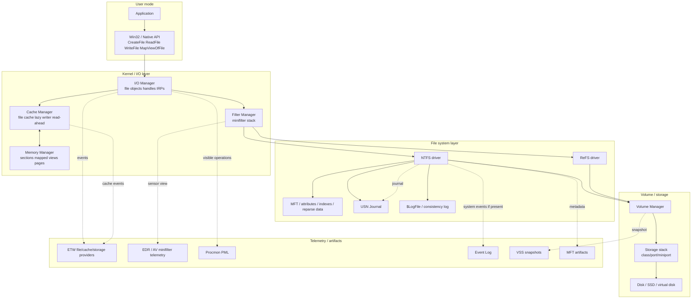
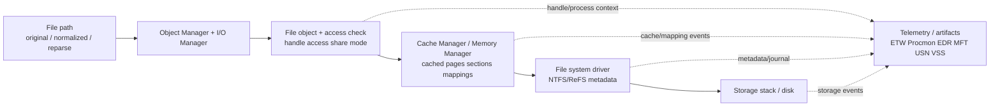
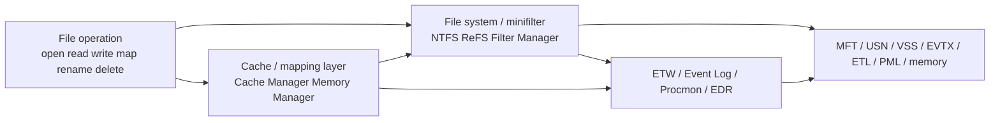

# Chapter 11: Caching and File Systems

> **Framing note:** Chương này mô tả Windows caching và file systems từ góc nhìn researcher: Cache Manager, Memory Manager, mapped files, file system drivers, NTFS/ReFS, MFT, attributes, reparse points, hard links, symbolic links, alternate data streams, journaling, USN Journal, VSS, EFS, minifilters, file telemetry, và forensic artifacts. Mục tiêu là xây dựng mental model chính xác về **file I/O as cached, filtered, metadata-rich behavior** — không phải bypass guide, không phải exploit chain.

---

## 0. Chapter Map

**Theo:** Windows Internals, Part 2, Chapter 11.

Chương này là nơi file I/O, memory mapping, caching, file system metadata, và forensic evidence gặp nhau. Nếu Ch.6 mô tả I/O path và file system drivers, thì Ch.11 giải thích tại sao “process ghi file” không đơn giản là “bytes đi thẳng xuống disk.” Windows có cache, section objects, memory-backed views, file system metadata, filters, journals, snapshots, encryption, và nhiều lớp telemetry nằm giữa application và physical media.

**Kết nối với các chương trước:**

| Chương | Liên hệ với Ch.11 |
|--------|-------------------|
| Ch.5 | Memory Manager, section objects, mapped files, working set, page faults, modified pages |
| Ch.6 | I/O Manager, IRP, file objects, device objects, file system drivers, minifilters, storage stack |
| Ch.7 | File ACLs, security descriptors, object access checks, SACL/audit policy |
| Ch.8 | Object Manager paths, symbolic links, named objects, handle semantics, namespace confusion |
| Ch.10 | Registry/services/ETW/Event Log/Procmon diagnostics, WPR/WPA, Event Log/ETW artifact reasoning |

**Thông điệp cốt lõi của Ch.11:**
Một file trên Windows không chỉ là path + bytes. Nó là metadata + attributes + security + one or more data streams + cache state + mapped views + file system record + journal history + telemetry state. Researcher phải tách riêng: path, handle, file object, file record, stream, cache, disk state, journal, snapshot, và tool observation.

| Mục | Nội dung | Tại sao quan trọng |
|-----|----------|--------------------|
| 0 | Chapter Map | Điều hướng và kết nối với memory/I/O/security/diagnostics |
| 1 | Researcher Mindset | File system là metadata-rich và cache-aware |
| 2 | Big Picture | Application → I/O → cache/memory → filters → FS → storage → disk |
| 3 | Key Terms | Thuật ngữ cache, NTFS, metadata, streams, minifilters |
| 4 | Core Internals | Cache Manager, cached/noncached I/O, mapped files, NTFS, USN, VSS |
| 5 | Important Components | Bảng components + cache/MM/NTFS/minifilter context |
| 6 | Trust Boundaries | File object, cache/disk, path identity, streams, reparse, filters |
| 7 | Attack Surface Map | Path/metadata/cache/ACL/filter/telemetry surfaces |
| 8 | Abuse Patterns | Path confusion, ADS, timestamps, cache timing, snapshots |
| 9 | Defender / EDR Telemetry | File operation, cache/mapping, NTFS, minifilter, ETW/Procmon |
| 10 | Forensic Artifacts | MFT, USN, $LogFile, ADS, VSS, runtime objects |
| 11 | Debugging and Reversing Notes | Procmon, VMMap, RAMMap, fltmc, fsutil, Streams, WinDbg |
| 12 | Safe Local Labs | 8 bài lab an toàn để quan sát file/cache/metadata |
| 13 | Common Researcher Mistakes | Các lỗi phổ biến khi interpret file evidence |
| 14 | Windows Version Notes | NTFS/ReFS/VSS/USN/cache/tool caveats |
| 15 | Summary | Tổng hợp mental model |
| 16 | Research Questions | Câu hỏi tự kiểm tra và research mở rộng |
| 17 | References | Tài liệu tham khảo |
| 18 | Illustration Plan | Diagrams, screenshots, search terms |

---

## 1. Researcher Mindset

### 1.1 File systems không chỉ là “folders and files”

Windows Explorer làm file system trông đơn giản: folders, files, sizes, modified dates. Nhưng researcher không được dừng ở view đó. Một file trên Windows có thể bao gồm:

- Một hoặc nhiều **directory entries / names**.
- Một **file record** trong file system metadata.
- Nhiều **attributes**: names, timestamps, data, security, object ID, reparse data.
- Một hoặc nhiều **data streams**.
- Một **security descriptor** controlling access.
- Một hoặc nhiều **open file objects/handles** trong runtime.
- **Cache state** trong memory.
- **Mapped views** trong process address spaces.
- **Journal entries** recording changes.
- **Snapshot copies** trong VSS.
- **Telemetry records** từ minifilter/ETW/Procmon/EDR nếu collection existed.

Vì vậy câu “file X đã được ghi” chưa đủ. Researcher cần hỏi: ghi vào stream nào, qua handle nào, cached hay noncached, mapped hay WriteFile, flush chưa, journal ghi gì, path có đi qua reparse point không, file ID là gì, có hard links không, security descriptor thay đổi không, minifilter nào nhìn thấy gì?

### 1.2 Phân biệt các lớp state

Một investigation tốt luôn tách các khái niệm sau:

| Lớp | Ý nghĩa | Câu hỏi research |
|-----|---------|------------------|
| File path | String path user/tool dùng | Path có normalized không? Có reparse/symlink/mount point không? |
| File object | Runtime kernel object cho một open instance | Handle access/share/options là gì? Process nào giữ handle? |
| File record | File system identity/metadata record | MFT record/file ID nào? Còn active không? |
| Data stream | Named stream chứa data | Default stream hay ADS? Tool có show stream không? |
| Cached state | Pages trong file cache/standby/modified lists | Data đang ở memory cache hay đã flushed? |
| Disk state | Persistent media state | Bytes đã persist chưa? Volume/storage layer có caching không? |
| Journal state | USN/$LogFile/change history | Change nào được ghi? Journal có rollover không? |
| Telemetry state | EDR/ETW/Procmon/Event Log observation | Source nào thấy event? Có gaps/filters không? |
| Forensic artifact | MFT, USN, EVTX, ETL, PML, VSS, memory | Artifact survive deletion/reboot không? |

### 1.3 File read/write không luôn là physical disk I/O

`ReadFile` có thể được satisfied từ memory cache. `WriteFile` có thể dirty cached pages rồi return trước khi bytes được physically persisted. Memory-mapped writes có thể nhìn như memory stores chứ không phải normal `WriteFile` calls. Storage devices/controllers cũng có caching riêng. File system journaling ghi metadata consistency information, không đồng nghĩa full file content đã được persisted theo cách analyst tưởng tượng.

Ví dụ cụ thể:

- Một process đọc file lần đầu: disk I/O xảy ra. Đọc lại ngay sau đó: có thể hit file cache, disk không bị touch.
- `WriteFile` return success: data được accepted by system, nhưng lazy flush có thể persist later nếu không có explicit flush/write-through semantics.
- Một memory-mapped file được sửa bằng `memcpy` vào mapped view: telemetry API-level chỉ nhìn memory writes nếu instrumented; file flush xảy ra sau qua Memory Manager/Cache Manager.
- Procmon có thể show `WriteFile`, nhưng event đó không tự chứng minh physical platter/NVMe write tại timestamp đó.

### 1.4 Path không phải identity

Path là cách reference file, không phải bản thân file.

- Hard links: hai paths có thể trỏ tới cùng một file record.
- Symbolic links/junctions/mount points/reparse points: path traversal có thể chuyển sang target khác.
- Volume GUID paths có thể bypass drive-letter assumptions.
- Short names có thể tạo alternate path representation.
- Case-insensitivity và normalization có thể làm string comparison naïve bị sai.

Forensics và EDR nên preserve normalized path + original path + file ID + volume ID + stream name + reparse context nếu có thể.

### 1.5 File system artifacts survive process lifetime

Process exit không xóa hết evidence. MFT entries, USN records, timestamps, prefetch references, AmCache/ShimCache relation, LNK/Jump Lists, VSS snapshots, Event Logs, ETL/PML captures, EDR backend records, and memory dumps can outlive the process. Deletion không instantly erase all metadata. Nhưng artifact retention varies: USN rolls, MFT records reuse, VSS disabled/trimmed, logs rotate, caches evict.

### 1.6 AV/EDR/minifilter view là layer-specific

AV/EDR/DLP/encryption products often use minifilters. A minifilter can observe and mediate file system operations before they reach NTFS or after lower layers respond. But one filter sees a view shaped by altitude, callback operation, normalized path availability, cache/fast I/O behavior, reparse traversal, stream names, and process context.

A researcher should never reduce file telemetry to “EDR saw file write, so disk changed exactly then.” Better phrasing: “A file-system-layer observer recorded a write-like operation against this file object/path/stream at this time; persistence and final metadata require correlation.”


### 1.7 Field checklist: hỏi đúng câu trước khi kết luận

Khi thấy một file event trong Procmon, EDR, Sysmon-style telemetry, ETW, hoặc forensic timeline, đừng vội gán ý nghĩa. Đi theo checklist:

| Câu hỏi | Vì sao quan trọng |
|---------|-------------------|
| Path này là original path hay normalized/final path? | Reparse/hard link/mount point có thể đổi target thực tế |
| Có stream name không? | `file.txt` khác `file.txt:ads` |
| Operation là create/open hay actual write/read? | Open with write access không chứng minh write occurred |
| Operation thành công hay fail? | Pre-operation telemetry có thể ghi intent trước khi fail |
| Handle có granted access gì? | Later operation bị giới hạn bởi granted access, không chỉ desired access |
| Share mode thế nào? | Share violations và delete semantics phụ thuộc share mode |
| Cached/noncached/write-through/mapped? | Persistence timing và telemetry shape khác nhau |
| Có flush/close không? | Dirty cache và delete-on-close semantics thường resolve ở close/flush |
| File ID/volume ID là gì? | Rename/hard link làm path thay đổi nhưng identity còn |
| Metadata nào thay đổi? | MFT/USN/timestamps/security/reparse/ADS mỗi thứ nói một phần |
| Sensor nào quan sát? | Minifilter, ETW, Event Log, memory, disk parser có scope khác nhau |
| Artifact retention thế nào? | USN/logs/traces/snapshots có thể roll hoặc không tồn tại |

### 1.8 Ba mental models cần giữ cùng lúc

**Model 1 — File as object:**
File được open thành file object, được reference bằng handle, có access mask, share access, flags, current byte offset, và lifetime độc lập với path string. Một file có thể bị unlinked/renamed trong khi handle vẫn còn.

**Model 2 — File as metadata:**
NTFS file là MFT record + attributes. Path chỉ là một tên trong directory index. `$DATA` chỉ là một attribute; ADS là named `$DATA`; security, timestamps, reparse data, object ID đều là metadata có đời sống riêng.

**Model 3 — File as cached memory:**
File data có thể đang ở standby list, modified list, system cache, mapped view, image section, hoặc private copy-on-write page. Disk bytes là một state khác với memory-resident view.

Researcher phải chuyển qua lại giữa ba model này. Malware analyst thường bắt đầu từ path/process. Forensic analyst thường bắt đầu từ MFT/USN. Kernel debugger bắt đầu từ file object/section/VAD. EDR engineer bắt đầu từ sensor event. Kết luận tốt cần map các view đó vào nhau.

### 1.9 Ví dụ field-note: một “save file” không đơn giản

Khi Notepad hoặc editor save một file, bạn có thể thấy:

1. Query attributes của target.
2. Create temp file trong cùng directory.
3. Write content vào temp file.
4. Flush hoặc close temp file.
5. Rename original thành backup hoặc delete original.
6. Rename temp thành final name.
7. Update timestamps/basic information.
8. Trigger USN records: create, data extend, close, rename old/new, delete.
9. Trigger minifilter callbacks ở nhiều bước.
10. Trigger EDR/Sysmon-style events nếu configured.

Một analyst chỉ nhìn “final file modified time” sẽ bỏ lỡ save strategy. Một analyst chỉ nhìn `WriteFile` vào temp path có thể không hiểu final target. Một analyst chỉ nhìn USN rename records có thể không biết process. Correlation là bắt buộc.

---

## 2. Big Picture

### 2.1 File and caching path

High-level file path:

```text
Application
  ↓
Win32 / Native API
  ↓
I/O Manager
  ↓
Cache Manager + Memory Manager
  ↓
Filter / Minifilter stack
  ↓
File System Driver
  ↓
Volume Manager / Storage Stack
  ↓
Disk / backing media
```

This is not always strictly linear. Cached reads may be satisfied before lower storage. Mapped files interact through page faults and section objects. Fast I/O may bypass full IRP setup for eligible operations. Filters can observe pre/post operations. File system metadata updates can be journaled. Storage stack and disk firmware can cache again.

### 2.2 Metadata path

File metadata path:

```text
File path
  ↓
Directory lookup
  ↓
File record / MFT metadata
  ↓
Attributes
  ↓
Data stream / security / timestamps / reparse data / journal changes
```

The user sees `C:\Temp\x.txt`. NTFS sees directory entries, file record references, attributes, stream names, security descriptors, allocation runs, update sequence numbers, indexes, and journal entries.

### 2.3 Unified diagram



### 2.4 Interpretation model

When analyzing file behavior, split the question:

1. **Who requested the operation?** Process, thread, token, integrity level, call stack.
2. **What object was opened?** Path, volume, file ID, stream, attributes, reparse context.
3. **What access was granted?** Desired access, share mode, create disposition, create options.
4. **Which path was used?** Original, normalized, final target, volume GUID, device path.
5. **Was it cached, noncached, mapped, or image-backed?** API and memory behavior differ.
6. **What metadata changed?** MFT, timestamps, link count, attributes, USN, security descriptor.
7. **What telemetry exists?** Procmon, ETW, EDR, Event Log, Security audit, Sysmon-style events.
8. **What persisted?** Disk bytes, metadata, journal entries, VSS copy, dump/trace/log.

---

## 3. Key Terms

| Term | Vietnamese explanation | Researcher relevance |
|------|------------------------|----------------------|
| **Cache Manager** | Kernel component quản lý file cache và cached file I/O | Giải thích vì sao read/write không luôn là physical disk I/O |
| **File cache** | Memory-backed cache chứa data từ files | Runtime state; affects timing/performance/forensics |
| **System cache** | Virtual address region/kernel mechanisms used for cached file data | Bridges Memory Manager and file data |
| **Cached I/O** | I/O đi qua normal file cache | Reads may hit memory; writes may be delayed |
| **Noncached I/O** | I/O bypass normal file cache | Common for databases/backup/disk tools; alignment constraints |
| **Write-through** | Request stronger write persistence semantics | Still interpret with file system/storage layers in mind |
| **Read-ahead** | Cache Manager prefetches likely future file data | Can produce reads not directly requested by app at that moment |
| **Write-behind** | Cached writes flushed later | Timeline caveat: API success ≠ immediate media persistence |
| **Lazy Writer** | System worker flushing dirty cached pages later | Important for dirty pages and delayed persistence |
| **Memory-mapped file** | File mapped into process virtual address space | File I/O can occur via page faults/memory writes |
| **Section object** | Kernel object backing mapped files/images/shared memory | Connects Ch.5 memory manager to Ch.6 file objects |
| **Shared Cache Map high-level** | Cache Manager structure representing shared cached state for a file stream | Useful conceptually; implementation details are version-sensitive |
| **Fast I/O** | Optimized path for eligible file operations without full IRP path | Filters/telemetry must account for fast path and fallback |
| **File system driver** | Driver implementing a file system such as NTFS/ReFS | Translates file operations into metadata/storage operations |
| **File object** | Runtime kernel object representing an open file instance | Holds current byte offset, flags, relation to handle/access |
| **NTFS** | New Technology File System, primary Windows file system | Rich metadata, MFT, ADS, reparse points, USN Journal |
| **ReFS** | Resilient File System, designed for integrity/resiliency | Different features/artifacts from NTFS; server/storage scenarios |
| **MFT** | Master File Table, central NTFS metadata table | Core forensic source for file records and attributes |
| **File record** | MFT record representing file/directory metadata | File identity stronger than path alone |
| **Attribute** | NTFS metadata/data element within file record | Files are sets of attributes, not just byte blobs |
| **Resident attribute** | Attribute stored inside MFT record | Small data/metadata may not allocate external clusters |
| **Nonresident attribute** | Attribute stored in clusters referenced by runs | Large data stream allocation mapping |
| **Data stream** | Stream of bytes associated with file | Default unnamed stream plus possible named streams |
| **Alternate Data Stream** | Named NTFS data stream beyond default stream | Often hidden from simple tools; not automatically malicious |
| **Standard Information attribute** | NTFS attribute containing standard timestamps/flags high-level | Timestamp source; compare carefully |
| **File Name attribute** | NTFS attribute containing filename/parent reference/timestamps high-level | Can differ from Standard Information timestamps |
| **Object ID attribute high-level** | Optional identifier metadata for tracking objects | Artifact when present; not universal |
| **Security descriptor** | ACL/owner/audit security metadata | Access control and audit relevance |
| **Hard link** | Multiple directory entries pointing to same file record | Path is not identity; link count matters |
| **Reparse point** | File/directory metadata causing special path processing | Junctions, symlinks, mount points, cloud files; path interpretation risk |
| **Junction** | Directory reparse point redirecting to another directory | Scanning/backup/traversal caveat |
| **Symbolic link** | File-system link redirecting path to another target | Related to but distinct from Object Manager symlinks |
| **Mount point** | Directory path where another volume is mounted | Drive letter is not complete volume identity |
| **USN Journal** | NTFS change journal recording file system changes | High-value forensic timeline; not file content |
| **Transaction log / $LogFile high-level** | NTFS consistency log for metadata transactions | Recovery/consistency artifact; not a friendly audit log |
| **Timestamps** | Creation/modified/access/MFT-change times in multiple metadata locations | Powerful but easy to misinterpret |
| **EFS** | Encrypting File System, per-file encryption using user cert/key material | File-level encryption affects access/forensics |
| **BitLocker distinction high-level** | Volume-level encryption, different from EFS per-file encryption | Affects acquisition; once volume unlocked file system sees normal files |
| **VSS** | Volume Shadow Copy Service snapshots | Prior versions and point-in-time evidence |
| **Storage Spaces** | Pool/virtual disk abstraction over physical storage | Logical-to-physical mapping changes |
| **Minifilter** | File system filter driver registered through Filter Manager | AV/EDR/DLP/encryption observation/mediation point |
| **Oplock high-level** | Opportunistic lock allowing clients to cache/coherency optimize file access | Affects sharing/caching semantics, network/file coordination |
| **File ID** | File-system identifier for a file record/object on a volume | Stronger correlation than path only |
| **Volume GUID path** | Stable volume path like `\\?\Volume{GUID}\` | Avoids drive-letter ambiguity; important for forensics |

---

## 4. Core Internals

### 4.1 Cache Manager

Cache Manager caches file data in memory. Its purpose is performance, but its side effect for researchers is that file I/O becomes **memory-aware**.

At a high level:

- Cached reads can be served from memory-resident pages.
- Read-ahead may bring data into cache before explicit future reads.
- Cached writes dirty memory pages and may flush later.
- Lazy Writer writes dirty cached pages back asynchronously.
- Cache Manager works closely with Memory Manager; file cache is backed by virtual memory mechanisms and section-like mappings.
- File cache state is runtime state, not necessarily persistent disk state at every instant.

Cache Manager maintains internal state per cached file stream. Terms like Shared Cache Map and VACB are useful high-level markers: they reflect that cached file data is mapped and managed in memory. Exact layouts are kernel-version dependent and not something to overfit in field notes.

**Researcher angle:**

- Procmon `WriteFile` does not always equal immediate physical disk write.
- Timing can be affected by cache hits, lazy flush, read-ahead, write-behind, and storage-layer caching.
- If investigating data persistence, ask whether `FlushFileBuffers`, write-through, transaction/log flush, or close semantics occurred — and still consider storage stack behavior.
- Cache state matters for performance analysis and forensic timing, but volatile cache can disappear after shutdown/crash unless captured in memory dump.

### 4.2 Cached vs noncached I/O

**Cached I/O** uses normal file cache. It is common for ordinary applications. Benefits include fewer disk hits, read-ahead, write-behind, and memory sharing between processes reading the same file.

**Noncached I/O** bypasses the normal file cache path. It is used by some databases, backup tools, disk imaging tools, storage utilities, and applications needing direct control over caching behavior. It often has alignment requirements: buffer alignment, length, and file offset alignment may need to match sector/device constraints.

**Write-through** asks for stronger persistence semantics by pushing writes through cache layers more aggressively. It is not the same as “all physical media and every controller cache has irrevocably persisted in the way an investigator imagines.” Interpret carefully.

**Researcher angle:**

- Different tools leave different performance/telemetry patterns. A database doing noncached I/O can look unlike Notepad saving a file.
- Raw disk/volume access differs from normal file I/O: it may target `\\.\PhysicalDriveN` or volume device paths instead of files.
- Noncached I/O can evade assumptions based on file cache observation, but not necessarily minifilter/storage/ETW/EDR observation depending layer.
- Context matters: signer, process role, token, command line, target device/path, timing, and volume state.

### 4.3 Memory-mapped files

A file can be mapped into a process address space. The application creates or opens a section object (`CreateFileMapping` at Win32 level) and maps a view (`MapViewOfFile`). After that, reading/writing file-backed data can look like normal memory access from the process perspective.

Mechanically:

- File object backs a section object.
- Section object backs mapped views in one or more processes.
- Page faults bring file data into memory.
- Modified pages may flush back later depending mapping type and flush/close behavior.
- Image sections for executable modules are a specialized mapping pattern.

This directly connects Ch.5 and Ch.6: Memory Manager maps and faults pages; I/O/File System layers provide backing data; Cache Manager coordinates cached file data.

**Researcher angle:**

- API-based file telemetry focused only on `ReadFile`/`WriteFile` can miss semantic writes through mapped views.
- VADs can reveal mapped files in process memory.
- VMMap shows mapped file regions and distinguishes image/private/mapped memory.
- Modified mapped views may flush later; timeline requires caution.
- Malware/reversing analysis should check both file operations and memory mappings.

### 4.4 Fast I/O

Fast I/O is an optimized path for some file operations when conditions allow. Instead of building and sending a full IRP through the entire stack, Windows can call file system fast I/O routines for operations that can be satisfied quickly, often cache-related reads/writes or queries.

If conditions fail — locks, cache state, alignment, file system decision, filter requirements — Windows falls back to the IRP path.

**Researcher angle:**

- Not all file system behavior looks like a simple IRP path.
- File system filters/minifilters must account for fast I/O and fallback behavior.
- Telemetry designs that assume “every operation is an IRP with identical shape” are incomplete.
- Fast I/O is a performance optimization, not a bypass concept in this chapter; analyze it as an observability and implementation nuance.

### 4.5 NTFS overview

NTFS stores files as records and attributes. The MFT — Master File Table — is the central metadata table. Each file and directory is represented by a file record. A file record contains attributes describing names, timestamps, security, data streams, allocation, reparse data, object ID, and more.

Key model:

- File path resolves through directory indexes to a file record.
- File record contains attributes.
- `$DATA` attribute represents stream content.
- Small attributes/data may be resident inside the MFT record.
- Large data is nonresident and points to clusters through data runs.
- Security descriptors, timestamps, names, link count, and streams are metadata.

**Researcher angle:**

- NTFS metadata is a major forensic source.
- File name/path is not full identity; file record reference/file ID matters.
- A file can have multiple names via hard links.
- A file can have multiple named data streams.
- Metadata and content can have different lifetimes after deletion.

### 4.6 MFT and attributes

MFT file records contain attributes. Important attributes for research include:

- `$STANDARD_INFORMATION` — standard timestamps/flags and metadata high-level.
- `$FILE_NAME` — filename, parent reference, namespace, and separate timestamps high-level.
- `$DATA` — default unnamed stream or named streams (ADS conceptually).
- `$SECURITY_DESCRIPTOR` high-level / security descriptor references — access control metadata.
- `$OBJECT_ID` high-level — optional object identifier metadata.
- `$REPARSE_POINT` — reparse tag/data for symlinks/junctions/mount points/cloud/etc.

**Timestamp caution:**
NTFS has multiple timestamp sources. `$STANDARD_INFORMATION` and `$FILE_NAME` timestamps can differ. Tools may show one source, merge sources, or label them differently. Some timestamps update for normal file system reasons; some are copied during rename/link operations; some can be affected by file system behavior, backup/restore, timezone display, or tool interpretation.

**ADS as named `$DATA`:**
An Alternate Data Stream is conceptually a named `$DATA` attribute. The default stream is unnamed; named streams use syntax like `file.txt:streamname` at Win32 path level.

**Researcher angle:**

- Timestamp interpretation requires caution and correlation.
- Multiple names/links can exist.
- MFT record state, sequence number, and reuse matter for deleted/reallocated artifacts.
- Attribute details are forensic-sensitive and tool-dependent. Do not overclaim from one parser.

### 4.7 Hard links, symbolic links, junctions, mount points

**Hard link:** multiple directory entries point to the same file record on the same volume. Deleting one name decrements link count; file content persists until all links and open references are gone.

**Symbolic link:** file system object that redirects path resolution to another target. Requires reparse processing. Can target files or directories depending type and privileges/policy.

**Junction:** directory reparse point commonly used to redirect one directory path to another local path.

**Mount point:** directory path where another volume is mounted. A path can cross volume boundaries without a drive-letter change being obvious in casual inspection.

**Reparse point:** metadata that tells the file system/I/O path to invoke special processing. Symlinks, junctions, mount points, OneDrive/cloud placeholders, and other technologies can use reparse points with different tags.

**Researcher angle:**

- Path-based assumptions can be wrong.
- Forensic timeline must account for multiple names.
- Reparse points can affect scanning, backup, deletion, and monitoring behavior.
- Object Manager symbolic links and file system symbolic links are conceptually related — path redirection — but not identical mechanisms/layers.
- Use file ID/volume ID and reparse inspection when identity matters.

### 4.8 Alternate Data Streams

NTFS files can have named streams. The default data stream is unnamed. ADS is a normal NTFS feature, historically used for metadata and application-specific data.

Example syntax:

```cmd
echo hello > C:\Temp\ads-lab.txt:note
```

Many tools show only the default stream by default. `dir /r`, Sysinternals Streams, forensic tools, and EDRs that track stream names can reveal ADS.

**Researcher angle:**

- ADS is important for forensics and inventory completeness.
- ADS existence is not automatically malicious.
- Suspiciousness depends on stream name, content, creator process, path, execution relation, zone identifiers, and environment baseline.
- Telemetry and scanning must include stream names, not just base file path.

### 4.9 Journaling and USN Journal

NTFS uses internal logging for consistency and exposes a change journal known as the USN Journal.

**$LogFile high-level:**
NTFS transaction/redo-undo style logging helps maintain file system metadata consistency after crashes. It is not designed as a friendly audit log of user actions.

**USN Journal:**
Records file system change notifications: create, delete, rename, data overwrite/extend/truncation, basic info change, security change, stream change, close, and other reason flags. It records metadata about changes, not full file content.

**Researcher angle:**

- USN Journal is a valuable forensic artifact for timelines and change tracking.
- Absence of file content does not reduce metadata value.
- Journal retention/rollover matters; old records may be gone.
- USN can show that a file changed even after the responsible process exited, but attribution to process usually requires correlation with telemetry.

### 4.10 ReFS

ReFS is designed for resiliency and integrity, especially server/storage scenarios. It differs from NTFS in feature set, metadata structures, integrity streams, and operational assumptions. It is commonly associated with Storage Spaces and workloads needing resilient storage.

Research caveats:

- Not all NTFS features exist or behave the same way.
- NTFS-specific artifacts such as MFT/USN expectations should not be blindly applied to ReFS volumes.
- Tooling support may differ.
- ReFS use cases and defaults vary by Windows edition/version.

### 4.11 EFS, BitLocker, VSS, Storage Spaces

**EFS** encrypts individual files using user certificate/key material. File metadata remains partly visible while file content requires proper keys/context. EFS is file-level.

**BitLocker** encrypts the volume. Once the volume is unlocked and mounted, NTFS/ReFS sees normal file system structures. Offline acquisition without keys is different. BitLocker is volume-level, not per-file in the EFS sense.

**VSS** creates point-in-time volume snapshots. Snapshots can preserve previous versions of files and metadata, useful for IR and recovery. Live view and snapshot view may differ.

**Storage Spaces** abstracts physical disks into pools and virtual disks. Logical volume evidence may not map trivially to one physical disk.

**Researcher angle:**

- Encryption and snapshots affect evidence access.
- VSS can preserve previous file versions after live deletion/modification.
- Storage Spaces changes physical-to-logical mapping.
- Do not confuse EFS file encryption with BitLocker volume encryption.

### 4.12 Minifilters and file system monitoring

Minifilters register callbacks with Filter Manager around file system operations. AV, EDR, DLP, encryption, backup, cloud sync, and virtualization products often use minifilters. Each filter has an altitude controlling relative ordering. Instances attach to volumes.

Minifilters can observe pre-operation and post-operation contexts conceptually: create/open, read, write, set information, rename, delete, cleanup, close, query directory, security changes, and more depending registration.

**Researcher angle:**

- File monitoring sits in the file system path, often before NTFS finalizes an operation.
- Cache/mapping/reparse/fast I/O can complicate interpretation.
- A minifilter sees operation context, not every semantic truth in isolation.
- Correlate minifilter telemetry with process, token, file ID, stream name, normalized path, USN/MFT artifacts, and ETW/Procmon.
- `fltmc` shows loaded filters and altitudes, useful for environment awareness.


### 4.13 File create/open lifecycle

File I/O usually starts with create/open. In Windows terminology, `CreateFile` covers many operations: open existing file, create new file, overwrite, open directory, open volume/device, open stream, open with delete intent, and more.

Important fields to preserve:

- **DesiredAccess:** requested capabilities, e.g. read data, write data, append, delete, read attributes, write attributes, read control, write DAC.
- **ShareAccess:** whether later opens can share read/write/delete access.
- **CreateDisposition:** open existing, create new, open always, overwrite, etc.
- **CreateOptions:** directory/non-directory, synchronous/asynchronous, delete-on-close, noncached, write-through, backup intent, open reparse point.
- **FileAttributes:** normal/hidden/system/temporary/archive/etc.
- **EaBuffer / extended attributes high-level:** rarely central for modern Windows user workflows but still part of file system semantics.

A successful open creates a file object. Later reads/writes/queries operate through that object. This means the initial create/open details can matter long after the first event. For example, a handle opened with `DELETE` access and delete sharing can later mark a file delete-pending even if the later telemetry only shows set-disposition.

**Researcher angle:**

- Open with write access is not proof of write.
- Open with delete access is not proof of deletion.
- CreateDisposition explains whether a file was newly created or existing.
- CreateOptions can reveal backup tools, directory opens, noncached I/O, reparse handling, delete-on-close patterns.
- Process context at open time matters because handle can be inherited or duplicated.

### 4.14 Cleanup, close, delete-on-close, and delete-pending

Windows file lifetime has subtleties:

- **Cleanup** occurs when the last user handle to a file object is closed; file system can process cleanup semantics such as delete-on-close.
- **Close** occurs when the file object itself is dereferenced and destroyed.
- A file can be marked **delete-pending** while handles still exist.
- A file name can disappear from directory listing while data remains accessible through an existing handle.
- Hard links mean deleting one name may not delete the file record if other links remain.

This matters because investigators often ask “when was the file deleted?” The answer may involve:

1. When a process requested delete disposition.
2. When the last relevant handle closed.
3. When directory entry was removed.
4. When MFT record was marked not in use.
5. When clusters were reallocated/overwritten.
6. When USN recorded delete/close reason flags.

Those are not always the same timestamp.

### 4.15 Rename semantics and path continuity

Rename is metadata mutation, not content rewrite. On NTFS, a rename updates directory/name metadata and USN records. File ID can remain the same across rename within the same volume. Across volumes, a “move” may be implemented as copy + delete, changing identity.

Research implications:

- Preserve file ID before/after rename when possible.
- Same-volume rename can keep file record identity.
- Cross-volume move often creates new file record on destination.
- EDR timelines should join rename old/new name events.
- MFT/USN parsers can reconstruct name transitions if records remain.
- Hard links complicate “the name” because more than one name may exist concurrently.

### 4.16 Directory indexes and enumeration

Directories are files with index structures. A directory listing is not a magical OS-wide list; it is a query against directory metadata. Directory enumeration can be filtered, paged, cached, and affected by permissions, reparse points, and file system behavior.

Researcher notes:

- Directory query telemetry is noisy but useful for discovery behavior.
- Malware and admin tools may enumerate many directories before opening files.
- Backup/indexing/AV products also enumerate heavily.
- A file can exist but be missed by a tool due to permissions, stream ignorance, reparse policy, offline/cloud state, or parser limitations.
- Directory timestamps are metadata too, but interpreting them requires caution.

### 4.17 Timestamps deep dive

Windows file timestamps are not one simple truth. NTFS commonly exposes:

- Creation time.
- Last modification/write time.
- Last access time.
- MFT entry changed time / metadata change time.

And at least two major NTFS attribute sources:

- `$STANDARD_INFORMATION` timestamps.
- `$FILE_NAME` timestamps.

Common reasons timestamps diverge:

- Rename/move behavior.
- Copy/extract/restore operations.
- Backup tools preserving selected times.
- Metadata-only changes.
- Last access updates disabled/deferred.
- Timezone display conversion.
- Tool choosing one attribute source.
- MFT record reuse or parser error.

Researcher rule: timestamps are evidence, not verdict. Use USN, Event Logs, EDR, Prefetch/AmCache/LNK/Jump Lists, VSS, and memory/process telemetry for correlation.

### 4.18 File locking, byte-range locks, and oplocks

Windows supports sharing modes at open time and byte-range locks after open. Oplocks allow clients/applications to cache file state with coordination: when another opener conflicts, the oplock can be broken so cached state is flushed/invalidated.

High-level relevance:

- Share violations can block opens even when ACL permits access.
- Byte-range locks can block reads/writes to specific regions.
- Oplocks affect network file systems and local caching/coherency behavior.
- IR tools can fail to copy a file due to sharing, lock, or oplock conditions, not just permissions.

Do not overinterpret “access denied” without status code/context. `STATUS_SHARING_VIOLATION`, `STATUS_ACCESS_DENIED`, and filter-blocked operations are different.

### 4.19 Network and remote file systems high-level

Although this chapter focuses on local file systems, Windows file I/O may target SMB shares, WebDAV, cloud sync providers, or redirected folders. Same APIs can front very different backing systems.

Research implications:

- MFT/USN artifacts may not exist locally for network-backed paths.
- Offline files/cloud placeholders may create local metadata without full content.
- ETW/minifilter/Procmon visibility may show redirector activity rather than NTFS writes.
- Server-side logs may be needed for complete truth.
- Timestamps and cache consistency may be governed by protocol semantics.

### 4.20 Volume, partition, and storage identity

A drive letter is a convenience, not a stable evidence identity. Windows can expose volumes via:

- Drive letters: `C:`.
- Volume GUID paths: `\\?\Volume{GUID}\`.
- Mounted folders.
- Device paths: `\Device\HarddiskVolumeX`.
- Physical drive paths: `\\.\PhysicalDriveN`.
- Virtual disks and Storage Spaces virtual disks.

Researcher angle:

- Record volume serial/GUID when correlating file IDs.
- File IDs are volume-scoped.
- Mounted folders can place another volume under a normal-looking directory.
- Incident response acquisition needs logical and physical mapping.
- Storage Spaces/BitLocker/VSS can add layers between file path and media.


### 4.21 Sparse files, compression, and allocation reality

Logical file size is not always allocated storage size. NTFS supports sparse files and compression; enterprise environments may add deduplication/tiering above or below the file system.

**Sparse file concept:**

- File has logical ranges that read as zero.
- Those ranges may not allocate physical clusters.
- Applications can create large logical files without consuming equal disk space.
- Databases, VM disks, logs, and specialized tools may use sparse patterns.

**Compression concept:**

- NTFS can compress file data transparently.
- Logical bytes seen by application differ from physical allocation.
- Compression affects performance and forensic size estimates.

**Researcher angle:**

- “File size” in Explorer is not enough; compare size vs size on disk/allocation.
- Exfiltration estimation from logical size alone can overstate physical writes.
- Sparse regions do not prove data was ever physically present.
- Forensic carving from unallocated clusters may not reconstruct sparse logical content without metadata.

### 4.22 File IDs, sequence numbers, and record reuse high-level

NTFS file references include an MFT record number and sequence-like component. The sequence helps detect stale references after record reuse. A file ID is stronger than path, but not eternal.

Researcher caveats:

- File ID is scoped to a volume.
- Deleted MFT records can be reused.
- A stale reference may point to a different later file if sequence is ignored.
- Cross-volume copy/move changes identity.
- Backup/restore tools can preserve names/timestamps while identity changes.

When reporting identity, include volume + file reference + path(s) + time observed.

### 4.23 Short names and name namespaces

NTFS can support 8.3 short names depending volume/system configuration. A file may have a long name and a short alias. NTFS `$FILE_NAME` attributes can represent different namespaces.

Research implications:

- Path-based detections may miss short-name access.
- Legacy installers/tools may use short names.
- Forensic parsers may show multiple filename attributes.
- Short-name generation can be disabled, so absence is not surprising.
- A short path is not automatically suspicious; context matters.

### 4.24 Case sensitivity and normalization

Windows is usually case-insensitive but case-preserving for common NTFS paths. Modern Windows can enable per-directory case sensitivity for some interoperability scenarios.

Research implications:

- String comparisons should normalize carefully but preserve original spelling.
- Case-sensitive directories can surprise Windows-native assumptions.
- EDR/path rules should not rely on one display casing.
- Cross-platform tooling may create names that look duplicate to humans.

### 4.25 TxF historical note

Transactional NTFS (TxF) existed as a mechanism for transactional file operations but is deprecated for general application use. It matters mainly as historical context and for legacy artifacts/code.

Research angle:

- Do not assume modern applications use TxF.
- Some old malware/writeups mention transactions; verify on target OS.
- NTFS `$LogFile` consistency logging is not the same as application-visible TxF semantics.
- Modern reliable update patterns often use temp file + flush + rename instead.

### 4.26 Paging I/O and image sections

Some file I/O is paging I/O: Memory Manager faults or writes pages backed by files. Image sections for DLL/EXE loading are file-backed and have special semantics.

Examples:

- Loading a DLL maps an image section, not simply reading the whole DLL with `ReadFile`.
- Demand paging reads only needed pages.
- Copy-on-write can create private pages diverging from file content.
- Modified mapped data files can flush later.

Researcher angle:

- Module load telemetry is not the same as generic file read telemetry.
- Memory dumps can show mapped image paths even after file rename/delete.
- Page faults can explain disk reads long after initial file open.
- EDR engines often correlate image load events with file metadata/signature/hash.

### 4.27 File system operations and IRQL/thread context high-level

Kernel file system code runs under constraints: IRQL, worker threads, APC delivery, locks, resource acquisition, and reentrancy matter. Minifilter and file system developers must avoid unsafe operations in callbacks.

Research relevance for non-driver authors:

- Some operations are deferred to worker threads, shifting timing.
- Call stacks may include system workers rather than original user thread for lazy flush/paging writes.
- Deadlocks can involve file system locks, filters, memory manager, and cache manager interactions.
- “Who wrote the bytes?” may be represented by a system thread during flush even though dirtying originated elsewhere.

### 4.28 Crash consistency vs forensic completeness

File systems prioritize consistency, not forensic completeness. NTFS journaling aims to avoid corrupted metadata after crash. It does not promise to preserve every user-level intent or old content.

Distinguish:

- **Metadata consistency:** file system can mount and structures are coherent.
- **Application consistency:** application data structure is valid.
- **Forensic completeness:** investigator can reconstruct all past actions.

VSS snapshots can improve point-in-time consistency, but only if enabled and captured at the right time.

### 4.29 Practical cache timeline example

A simplified timeline:

1. Process opens `report.docx` cached.
2. `ReadFile` faults data into file cache.
3. Process modifies content and writes through cached I/O.
4. Cache Manager marks pages dirty.
5. USN may record data change around close/write semantics.
6. Lazy Writer flushes dirty pages later.
7. Storage stack queues actual device write.
8. Disk/controller may acknowledge based on its own caching policy.

Evidence at each stage differs. Procmon may show write at step 3. RAMMap may show modified pages at step 4. USN may show change at step 5. ETW disk I/O may show device write at step 7. These timestamps need not match exactly.

### 4.30 Practical path identity example

A suspicious file appears as:

```text
C:\Users\Alice\AppData\Local\Temp\a.dll
```

But investigation finds:

- It has a hard link under another directory.
- It was loaded as an image section by a process.
- It was later renamed.
- MFT file ID stayed constant across same-volume rename.
- USN records show rename old/new names.
- EDR process event kept original image path from load time.

If you only search current path, you miss continuity. If you only search hash, you may miss timestomp/copy variants. If you search file ID without volume context, you risk mis-correlation.

---

## 5. Important Windows Components / Structures

| Component | Role | Researcher angle | Useful tools |
|-----------|------|------------------|--------------|
| Cache Manager | Manages cached file data | Explains cache hits, delayed writes, lazy flush | RAMMap, WPA, WinDbg high-level |
| Memory Manager | Manages pages, sections, mapped views | File cache and mapped files are VM-backed | VMMap, WinDbg, RAMMap |
| I/O Manager | Creates file objects, IRPs, handle-based I/O | Boundary between APIs and drivers | Procmon, WinDbg `!irp`, `!fileobj` |
| File system driver | Implements file system semantics | NTFS/ReFS behavior and metadata | Procmon, ETW, WinDbg |
| NTFS driver | NTFS implementation | MFT, attributes, USN, ADS, reparse | fsutil, forensic parsers |
| ReFS driver | ReFS implementation | Different artifacts/features | fsutil, storage tools |
| File object | Runtime open file representation | Handle/access/share/options context | WinDbg `!fileobj`, `!handle` |
| Section object | Backing object for mapped files/images | Memory-mapped I/O and image loading | VMMap, WinDbg `!object`, VAD views |
| Shared cache map high-level | Cache state per stream concept | Cache Manager internals, version-sensitive | WinDbg/source references high-level |
| VACB high-level | Cache virtual address control concept | Mapped cache views implementation detail | WinDbg/references high-level |
| Lazy Writer | Flushes dirty cache pages | Delayed persistence timing | RAMMap, WPA, ETW high-level |
| MFT | NTFS central metadata table | Core forensic evidence | MFT parsers, forensic suites |
| File record | NTFS record for file/dir | Identity stronger than path | MFT parsers, fsutil file queryfileid |
| Attribute | NTFS metadata/data unit | Timestamps/streams/security/reparse | Forensic parsers |
| `$DATA` stream | File content stream attribute | Default stream and ADS | dir /r, streams.exe |
| `$STANDARD_INFORMATION` | Standard NTFS metadata timestamps/flags | Timestamp comparison | MFT parsers |
| `$FILE_NAME` | Filename/parent/timestamps metadata | Multiple names/timestamp caveat | MFT parsers |
| Reparse point | Special path processing metadata | Symlink/junction/mount/cloud behavior | fsutil reparsepoint, dir /al |
| USN Journal | NTFS change journal | Timeline and change tracking | fsutil usn, forensic parsers |
| `$LogFile` high-level | NTFS transaction consistency log | Crash recovery/metadata transaction context | Specialized forensic tools |
| Security descriptor | Owner/DACL/SACL metadata | Access/audit boundary | icacls, Get-Acl, forensic tools |
| Minifilter Manager | Coordinates file system minifilters | AV/EDR/DLP observation ordering | fltmc |
| Volume Manager | Logical volume layer | Mounts/volume GUID/storage mapping | mountvol, diskmgmt, fsutil |
| Storage stack | Class/port/miniport/storage drivers | Physical I/O path, device caching | ETW/WPA, storage tools |
| VSS | Volume snapshots | Prior versions and point-in-time evidence | vssadmin, diskshadow |
| EFS | File-level encryption | Key/certificate-dependent file access | cipher.exe, cert tools |
| Storage Spaces | Storage pooling/virtual disks | Logical-to-physical abstraction | PowerShell Storage cmdlets |

### 5.1 Cache Manager and Memory Manager relationship

File cache is memory-backed. Cache Manager uses Memory Manager mechanisms to map file data into system address space and manage cached pages. Memory-mapped files use section objects and VADs; file cache and mapped views share core virtual memory concepts.

Implications:

- Cached file data competes with other memory usage.
- Modified pages may be dirty in memory before flush.
- Mapped file pages can be shared across processes.
- Cache state is runtime state, not necessarily disk state.

### 5.2 NTFS metadata as evidence

MFT and attributes are forensic-rich:

- File records identify files beyond path strings.
- `$STANDARD_INFORMATION` and `$FILE_NAME` timestamps can differ.
- `$DATA` streams reveal default and alternate streams.
- `$REPARSE_POINT` explains non-obvious path behavior.
- Security descriptors explain access and audit.
- USN Journal records changes over time.

Multiple metadata sources should be correlated before making claims.

### 5.3 Minifilter Manager

Filter Manager hosts the minifilter stack. Filters attach to volumes at altitudes. Higher/lower altitude affects ordering, but interpretation requires knowing operation type and pre/post callback semantics.

`fltmc` can show:

- Loaded filters.
- Altitudes.
- Instances/volumes.

This is environment context. It does not by itself prove what a filter logged or blocked.


### 5.4 File object, section object, and cache object triangle

A single file may be represented simultaneously by:

- One or more **file objects** from open handles.
- One or more **section objects** for image/data mappings.
- Cache Manager state for cached file data.
- NTFS file record/attributes on disk.

These are related but not identical. Closing a handle does not necessarily remove mapped views. Unmapping a view does not necessarily flush immediately. Deleting a path does not necessarily destroy a file record until link count/open references permit. This is why memory forensics can reveal mapped files whose path state changed on disk.

### 5.5 Metadata mutation operations worth recognizing

Many important file events are not reads/writes:

| Metadata operation | Example | Why it matters |
|--------------------|---------|----------------|
| Rename | old path → new path | Identity may continue under new name |
| Set disposition | mark delete / delete-on-close | Deletion timing depends on handles/links |
| Set basic info | timestamps/attributes | Timeline can be modified by normal APIs |
| Set allocation/EOF | truncate/extend | Content size and sparse behavior change |
| Set security | DACL/SACL owner change | Access/audit boundary changes |
| Create hard link | add directory entry | New path same file ID |
| Set reparse point | create symlink/junction/mount/cloud marker | Path resolution changes |
| Create named stream | ADS | Inventory/scanning gap |

### 5.6 File system evidence confidence levels

A practical confidence model:

| Evidence | What it supports | What it does not prove alone |
|----------|------------------|------------------------------|
| MFT record active | File record currently allocated | Which process created it |
| USN create/write/rename | File system change occurred | Full content or responsible process |
| Procmon write event | Operation observed by Procmon | Physical disk persistence at same time |
| EDR file event | Sensor observed/enriched operation | Native Windows ground truth without sensor caveats |
| Event Log object access | Audited access occurred | All accesses occurred |
| VSS copy | Prior snapshot state existed | Why/how file changed after snapshot |
| Memory mapped VAD | Process mapped file | Process wrote content unless dirty/write evidence exists |

Use confidence language in reports: “supports,” “is consistent with,” “correlates with,” “does not by itself prove.”

---

## 6. Trust Boundaries

### 6.1 File object access boundary

Opening a file requires an access check. The resulting handle has granted access that controls later operations. Important inputs:

- Desired access: read, write, append, delete, read attributes, write DAC, etc.
- Share mode: whether other opens can read/write/delete concurrently.
- Create disposition/options: open existing, create new, overwrite, directory, backup semantics, delete-on-close, non-directory file.
- File attributes and flags.
- Token, integrity level, privileges, impersonation.
- ACL/SACL and inherited directory permissions.

Oplocks and share modes affect concurrency/coherency. Access denied may reflect ACL, share violation, oplock break timing, file system policy, or filter decision.

### 6.2 Cache vs disk boundary

Cached state can differ from disk state temporarily.

- Write-back/lazy flush delays persistence.
- Memory-mapped writes can dirty pages without immediate file write event shape.
- Flush operations, close, memory pressure, lazy writer, and mapped view flush influence timing.
- Storage stack/device caches add another layer.

Forensic timing must account for cache. Claim “file content was on disk at timestamp T” needs stronger evidence than a high-level write operation.

### 6.3 File path vs file identity boundary

Path is not identity.

- Hard links create multiple names for one file record.
- Reparse points redirect path processing.
- Volume GUID paths avoid drive-letter assumptions.
- 8.3 short names can provide alternate name paths.
- Case normalization and path canonicalization matter.
- File ID/MFT record can be more stable than path.

Telemetry should retain both original path and normalized/final identity when possible.

### 6.4 Stream boundary

ADS means a file can have multiple named data streams.

- `file.txt` and `file.txt:note` are different streams on same file.
- Tools may ignore non-default streams.
- Stream name matters for scanning, hashing, allowlisting, and forensics.
- Some metadata-like streams are normal in specific contexts.

### 6.5 Reparse boundary

Reparse points change path resolution.

- A directory that looks local may redirect elsewhere.
- A backup/scanner can accidentally traverse unexpected trees or skip targets.
- Cloud placeholder files may materialize data on access.
- Mount points can cross volume boundaries.
- Filesystem/user assumptions may diverge.

### 6.6 Minifilter boundary

Filters observe/mediate operations at a particular layer/order.

- Altitude controls ordering between filters.
- Pre-operation vs post-operation context differs.
- Name normalization may be unavailable or expensive at some points.
- Reparse, rename, delete-on-close, stream access, and mapped writes complicate semantics.
- One filter's view is not the entire storage truth.

### 6.7 Encryption/snapshot boundary

EFS, BitLocker, VSS, and Storage Spaces affect evidence access and interpretation.

- EFS file content may require user keys.
- BitLocker blocks offline volume access without unlock material, but live unlocked volumes expose normal file system semantics.
- VSS snapshot state may differ from live state.
- Storage Spaces changes physical disk mapping.


### 6.8 Handle inheritance and duplication boundary

A file handle can move across process boundaries through inheritance or duplication. The process that uses a handle may not be the process that originally opened it.

Research implications:

- Creation/open telemetry identifies the opener, not necessarily every later user if handle duplication occurs.
- Child processes can inherit handles intentionally or accidentally.
- Brokered architectures may open files in a service/broker process and pass capabilities to clients.
- EDR correlation should track handle duplication/inheritance where possible.

### 6.9 Backup/restore privilege boundary

Backup and restore semantics can alter normal file access assumptions. Tools running with backup/restore privileges may read/write metadata or content in ways normal ACL checks would not allow.

Research implications:

- Backup agents and forensic tools can legitimately access many files.
- Access reason should include token privileges, not only user SID.
- Suspiciousness depends on process role, signer, time window, target set, and command line.
- Object access auditing may show unusual access masks when SACL configured.

### 6.10 Cloud/offline file boundary

Modern systems often have OneDrive or cloud provider placeholders. A path may represent metadata locally while content is hydrated on demand.

Research implications:

- Opening a file can trigger network retrieval.
- File size/logical size and physical local allocation can differ.
- Reparse tags may indicate cloud provider behavior.
- Forensic acquisition should distinguish placeholder metadata from hydrated content.



---

## 7. Attack Surface Map

Attack surface here means where path interpretation, file identity, metadata, cache behavior, access control, and telemetry meet.

| Surface | Examples | Boundary crossed | What to observe | Research value |
|---------|----------|------------------|-----------------|----------------|
| File paths | Win32 paths, NT paths, device paths | String → object resolution | Original/normalized/final path | Path confusion and attribution |
| File handles | Granted access, flags, current offset | Open authorization → later operations | Desired/granted access, process, token | Capability and intent |
| Share modes | Read/write/delete sharing | Concurrency boundary | Sharing violations, exclusive opens | Locking and interference analysis |
| File ACLs | DACL/SACL/owner | Security boundary | Access denied, ACL changes, audit | Authorization and audit context |
| Directory ACLs | Inherited permissions | Creation/deletion boundary | Parent ACL and inheritance | Drop location risk |
| Alternate data streams | `file:stream` | Stream visibility boundary | Stream name, size, creator | Hidden inventory gaps |
| Reparse points | Tags/data | Path processing boundary | Tag, target, traversal behavior | Scanner/backup/path confusion |
| Junctions | Directory redirection | Directory traversal boundary | Target path, volume | Timeline and traversal context |
| Symbolic links | File/dir symlinks | Path redirection | Target, privilege/policy | Identity and access context |
| Hard links | Multiple names same record | Path → file identity boundary | Link count, file ID, all names | Attribution and deletion semantics |
| Volume mount points | Mounted volumes under directories | Volume boundary | Volume GUID, mount path | Evidence location mapping |
| Raw volume access | `\\.\C:`, physical drives | File system bypass-ish boundary | Process, signer, token, device | Backup/forensic/disk tool context |
| Cached I/O | Normal reads/writes | Memory cache boundary | Cache hits, lazy flush, file ops | Timing/performance interpretation |
| Noncached I/O | Databases, disk tools | Direct I/O boundary | Flags, alignment, target | Different telemetry/performance |
| Memory-mapped files | `MapViewOfFile`, image mappings | File ↔ virtual memory | VADs, sections, modified pages | API telemetry caveat |
| Section objects | File-backed sections | Object/memory boundary | Image/data mappings, handles | Runtime evidence |
| USN Journal | Change records | Metadata history boundary | Reason flags, file refs, rollover | Timeline after process exit |
| MFT metadata | Records/attributes | File system identity boundary | File record, timestamps, attributes | Core forensic source |
| Timestamps | SI/FN/access/modify/change | Timeline boundary | Source, timezone, tool labels | Sequence reconstruction |
| Minifilter callbacks | Pre/post create/write/rename/delete | Sensor/mediation boundary | Altitude, process context, name | AV/EDR architecture |
| File delete/rename/set information | Disposition/rename/basic info | Metadata mutation boundary | SetInformation class, target name | Deletion/rename timeline |
| File attributes | Hidden/system/archive/readonly | Metadata flags | Attribute changes, creator | Tool visibility and behavior |
| EFS encrypted files | Per-file encryption | Crypto/access boundary | EFS metadata, user/cert context | Access and acquisition caveat |
| VSS snapshots | Previous versions | Time-slice boundary | Snapshot time, live vs snapshot diff | Recovery and historical evidence |
| Storage Spaces volumes | Virtual disks/pools | Logical/physical boundary | Pool/virtual disk mapping | Acquisition planning |
| ETW file providers | Kernel/file/storage providers | Trace collection boundary | Provider/session/drop context | High-volume telemetry |
| Procmon-visible events | CreateFile/WriteFile/SetInfo | Tool observation boundary | Stack, details, result | Practical behavior trace |

---

## 8. Abuse Patterns — Concept Level

Phần này mô tả misuse/visibility classes ở mức analytical và detection-focused. Không có exploit chain, không có destructive instructions, không có bypass guide.

### 8.1 Path confusion class

Hard links, junctions, symlinks, mount points, short names, volume GUID paths, and reparse points can make path interpretation tricky. A policy or detection that keys only on a string path can miss identity equivalence or misattribute behavior.

Detection/research guidance:

- Preserve original path and normalized path.
- Resolve volume identity where possible.
- Record file ID/MFT reference when available.
- Inspect reparse tags and hard link counts.
- Avoid making allow/block decisions from naïve prefix matching alone.

### 8.2 ADS visibility gap class

ADS may be missed by tools that inspect only default streams. ADS is a normal NTFS feature; suspiciousness depends on context.

Research guidance:

- Inventory stream names and sizes.
- Correlate stream creation/write telemetry.
- Check whether file scanners hash all streams or only default stream.
- Treat `Zone.Identifier` differently from unusual executable/content streams.

### 8.3 Timestamp interpretation class

Multiple timestamp sources exist. Timestamps change for normal reasons: create, write, rename, metadata change, access, copy, extraction, restore, backup, time sync, file system behavior.

Research guidance:

- Compare `$STANDARD_INFORMATION` and `$FILE_NAME` timestamps.
- Correlate with USN, Event Log, EDR, Prefetch/AmCache/LNK/Jump Lists where relevant.
- Record timezone and tool interpretation.
- Avoid single-timestamp conclusions.

### 8.4 Cache timing class

A write observed by API does not always mean disk persistence at that instant. Lazy Writer, modified pages, mapped views, and storage caches complicate timing.

Research guidance:

- Look for flush/close/write-through context.
- Use ETW/WPA for cache/storage timing when needed.
- Treat Procmon write timestamp as operation observation, not necessarily media persistence time.
- For crash scenarios, consider dirty cache and file system recovery behavior.

### 8.5 Reparse point traversal class

Path traversal may cross unexpected targets. Backup/scanning/monitoring tools must handle reparse behavior carefully.

Research guidance:

- Detect reparse points before recursive traversal.
- Decide policy: follow, skip, record, or handle by tag.
- Preserve target metadata.
- Avoid infinite loops and unintended volume traversal.

### 8.6 Minifilter visibility class

A filter sees a layer-specific view. Fast I/O, cache, mapped files, reparse, rename, delete-on-close, and stream names complicate interpretation.

Research guidance:

- Know filter altitude and operation callbacks.
- Correlate with ETW, USN, MFT, process telemetry.
- Be careful with pre-operation events that later fail.
- Record result/status codes.

### 8.7 Raw volume access class

Raw volume/physical drive access is sensitive but can be legitimate. Forensic tools, backup agents, disk health utilities, encryption products, and storage management tools may use it.

Research guidance:

- Context: process, signer, command line, token, device path, access mask, timing.
- Distinguish read-only acquisition from write-capable access.
- Correlate with installed software and user/admin action.
- Do not classify solely by device path.

### 8.8 VSS/snapshot evidence class

Snapshots may preserve prior state. Live view and snapshot view may differ.

Research guidance:

- Enumerate snapshots and creation times.
- Compare live and snapshot file metadata/content.
- Preserve chain of custody for snapshot extraction.
- Remember snapshots may be disabled, deleted, trimmed, or policy-managed.


### 8.9 File replacement / atomic save class

Many applications do not overwrite files in place. They write a temporary file, flush/close, then rename over the target. This can look like create/write/rename/delete rather than a simple write to the final path.

Research guidance:

- Track file ID transitions.
- Look for temp naming patterns in same directory.
- Correlate rename old/new names with USN and Procmon.
- Hashing only final path after the fact may miss intermediate content.
- Backup/sync/indexer tools may observe each intermediate stage.

### 8.10 Sparse/compressed/deduplicated file confusion class

NTFS supports sparse files and compression; enterprise storage may add deduplication or tiering. Logical file size can differ from allocated physical storage.

Research guidance:

- Compare logical size and allocated size.
- Identify sparse/compressed attributes.
- Avoid estimating exfiltration or disk usage purely from logical size.
- Treat dedup/tiered storage as environment-specific.

### 8.11 Fileless vs file-backed ambiguity class

Security discussions often say “fileless,” but Windows behavior may still involve file-backed sections, mapped images, temporary files, deleted-but-open files, caches, scripts, registry, WMI, or memory-only content.

Research guidance:

- Define what “fileless” means in the report.
- Check mapped sections, handles, command lines, script logs, temp files, prefetch/amcache, and memory.
- A deleted path can still have runtime mapped content.
- Absence of current file path does not mean absence of file artifacts.

---

## 9. Defender / EDR Telemetry


> Telemetry interpretation note:
> ETW/Event Log/WMI/EDR are provider-generated or sensor-generated views, not universal ground truth. Telemetry must be interpreted with source layer, configuration, provider state, collection policy, and retention. Absence of an event is not proof of absence. High-signal anomaly still requires context and correlation.

### 9.1 File operation telemetry

| Event class | Examples | Source layer | Research notes | Limits |
|-------------|----------|--------------|----------------|--------|
| Create/open | `CreateFile`, open directory, create new file | I/O Manager/minifilter/Procmon/EDR | Desired access, share mode, disposition, options are key | Open success does not prove read/write occurred |
| Read | Cached read, noncached read, paging read | Cache/file system/minifilter/ETW | May be cache hit; stack helps attribution | Not always physical disk read |
| Write | WriteFile, paging write, cached write | Cache/file system/minifilter/ETW | Capture offset/length/status/stream | May not persist immediately |
| Rename | SetRenameInformationFile | File system metadata/minifilter | Old/new name and file ID matter | Path-only telemetry loses continuity |
| Delete | SetDispositionInformationFile, delete-on-close | File system metadata/minifilter | Deletion may occur at close; hard links matter | Content/metadata may remain recoverable |
| Set information | Basic info, allocation, EOF, disposition | File system/minifilter | Explains timestamp/size/attribute changes | Tool labels can hide exact info class |
| Directory query | Listing, enumeration | File system/minifilter | High volume; useful for discovery behavior | Often noisy/benign |
| Attribute change | Hidden/system/readonly/archive | Metadata operation | Context matters: installers change many attrs | Not execution proof |
| Security descriptor change | DACL/SACL/owner | Security/file system/EDR | High-value access boundary change | Requires audit/sensor coverage |
| Stream access | `file:stream` open/write/delete | NTFS/minifilter/EDR | Preserve stream name | Many tools ignore ADS |
| Reparse interaction | Open reparse point, traversal, tag query | File system/minifilter | Record tag/target/final path | Normalization can be expensive/incomplete |
| Hard link creation | New directory entry same file record | NTFS/minifilter/USN | File ID/link count critical | Path events may look like new file only |
| Memory-mapped caveat | Section create, mapped write | Memory Manager/file system/EDR | API-level WriteFile may be absent | Need VAD/section/cache correlation |

### 9.2 Cache/mapping telemetry

| Event class | Examples | Source layer | Research notes | Limits |
|-------------|----------|--------------|----------------|--------|
| Mapped file | Data file mapping | Memory Manager/VAD/VMMap | Shows file-backed memory region | Does not prove bytes modified |
| Section object | Image/data section | Object Manager/MM/WinDbg | Connects file object to mapped views | Requires memory/debug visibility |
| Image mapping | DLL/EXE load | MM/loader/ETW/EDR | Execution-related file mapping | Load path may differ via hardlink/reparse |
| Dirty pages | Modified file-backed pages | MM/Cache Manager/RAMMap | Indicates pending flush potential | Volatile; tool visibility limited |
| Flush | FlushFileBuffers, mapped view flush, lazy flush | Cache/storage ETW/Procmon sometimes | Helps persistence timing | Storage controller caching still caveat |
| Memory-mapped writes | Stores to mapped view | CPU/MM/page dirtying | Important API telemetry gap | Hard to attribute without tracing/instrumentation |
| Working set relation | Mapped pages in process | VMMap/WinDbg | Shows residency/use | Working set residency ≠ file content semantics |
| VMMap/VAD visibility | VAD file-backed regions | VMMap/WinDbg/memory forensics | Great for reversing/runtime context | Snapshot only; permissions needed |

### 9.3 NTFS forensic telemetry

| Event class | Examples | Source layer | Research notes | Limits |
|-------------|----------|--------------|----------------|--------|
| MFT changes | File record update, allocation, deletion | NTFS metadata | Core identity/timeline source | Record reuse and parser differences |
| USN Journal | Create/delete/rename/write reason flags | NTFS change journal | Valuable change timeline | No full content; rollover |
| Timestamps | SI/FN create/modify/access/MFT change | NTFS attributes | Compare sources and context | Easy to overinterpret |
| File ID | File reference number | NTFS/file APIs | Correlate across path changes | Volume-scoped; reuse caveats |
| ADS | Named `$DATA` streams | NTFS attributes | Inventory hidden/nondefault content | Tool coverage varies |
| Reparse metadata | Tags and target data | NTFS attribute | Explains traversal | Tag-specific interpretation |
| Security descriptor | ACL/owner/SACL | NTFS/security | Access/audit boundary | Inheritance complicates analysis |
| `$LogFile` high-level | Metadata transaction log | NTFS consistency | Can assist advanced forensics | Not simple audit trail |

### 9.4 Minifilter/EDR telemetry

| Event class | Examples | Source layer | Research notes | Limits |
|-------------|----------|--------------|----------------|--------|
| Pre-create callback | Open/create before file system completes | Minifilter | Shows intent and requested access | Operation may fail or reparse |
| Post-create callback | Result after create/open | Minifilter | Granted state/status more reliable | Still not proof of later I/O |
| Write/delete/rename observation | IRP/fast I/O/set info callbacks | Minifilter/EDR | Include status, offset, size, final path | Mapped writes and cache timing caveat |
| Process context | PID/TID/token/image/signature | EDR/minifilter | Needed for attribution | Process can exit; PID reuse |
| File path normalization | Name provider/final path | Filter Manager/EDR | Important for reparse/hardlink context | Can be expensive/unavailable at some times |
| Stream name | ADS/default stream | NTFS/minifilter | Required for complete file identity | Some telemetry drops stream suffix |
| Reparse behavior | Reparse status/tag/target | Minifilter/file system | Explains path changes | Need tag-specific logic |
| False positives/limits | Backup, AV, indexer, cloud sync | EDR analytics | Baseline environment roles | High file telemetry volume |

### 9.5 Event Log / ETW / Procmon-style telemetry

| Event class | Examples | Source layer | Research notes | Limits |
|-------------|----------|--------------|----------------|--------|
| File system ETW providers high-level | Kernel file/disk providers, NTFS/storage providers | ETW | Useful with WPR/WPA for timing and stacks | Provider/session/profile dependent |
| Procmon events | CreateFile, ReadFile, WriteFile, Query/SetInfo | Procmon driver/UI | Practical detail + stacks + filters | High volume; not physical disk truth |
| Sysmon-style file events if configured | FileCreate, FileCreateStreamHash, FileDelete, etc. | Sysmon/agent | Good security telemetry with config | Not built-in default; config dependent |
| Security object access | File access audit events | Security Log | Requires audit policy + SACL | High volume; often disabled |
| VSS events | Snapshot create/delete/errors | Event Log/VSS providers | Snapshot timeline context | Availability/retention varies |
| Storage/NTFS events if present | Disk/NTFS warnings/errors | System log/providers | Correlate corruption/io issues | Sparse and not full activity logs |

### 9.6 Telemetry limits

- File system telemetry is high volume; filtering shapes what is retained.
- Path-based telemetry can mislead due to hard links, reparse points, mount points, volume GUID paths, and short names.
- ADS/reparse/hard link behavior complicates inventory and path analysis.
- Cached writes and mapped files complicate API-level monitoring.
- Minifilter visibility depends on layer, altitude, callback type, status, and name normalization.
- Not every file operation produces an Event Log entry.
- USN Journal records changes, not process identity or content.
- Forensic artifacts can roll over, be disabled, be trimmed, be overwritten, or require privileges.
- EDR backend may enrich file telemetry beyond native Windows sources, but enrichment has its own assumptions.


### 9.7 Correlation playbooks

| Scenario | Minimum useful sources | What to prove | Main caveat |
|----------|------------------------|---------------|-------------|
| Suspected file drop | EDR/Procmon create+write, MFT, USN, hash | File was created/written and by whom | Write telemetry may use temp/rename path |
| Suspected rename hiding | USN rename, MFT file ID, EDR rename | Same file identity moved names | Cross-volume move may be copy+delete |
| Suspected ADS use | Stream enumeration, stream telemetry, MFT attributes | Named stream exists/changed | ADS can be benign, e.g. Zone.Identifier |
| Suspected reparse abuse | Reparse tag/target, path telemetry, final file ID | Path traversed unexpected target | Tools differ in following reparse points |
| Suspected mapped modification | VAD/VMMap, section object, dirty/flush evidence, USN | File-backed mapping existed and changed | Hard to attribute exact memory store |
| Suspected deletion | SetDisposition/delete telemetry, USN, MFT state, VSS | Deletion requested and metadata changed | Data may remain recoverable or link still exists |
| Suspected raw access | Device path open, process signer/token, storage ETW | Raw volume/device access occurred | Legitimate backup/forensic tools common |

### 9.8 File telemetry normalization fields

For EDR/detection engineering, a robust file event schema should try to preserve:

- Original path string.
- Normalized path.
- NT device path if available.
- Volume GUID / serial.
- File ID / file reference.
- Stream name.
- Reparse tag and final target if traversal occurred.
- Desired access and granted access.
- Share mode.
- Create disposition and create options.
- Operation status/result.
- Process/thread/token/integrity/session.
- Call stack or module context when feasible.
- Hash after stable close/flush where possible.
- USN reason/file reference correlation if available.

No schema captures everything cheaply. Field selection is a cost/volume/utility tradeoff.

### 9.9 High-volume filtering strategy

File telemetry can overwhelm systems. Practical collection often filters by:

- Sensitive directories: system32, drivers, startup, browser profile, temp, user downloads, scripts.
- Sensitive extensions: executables, scripts, archives, documents with macros, DLLs, drivers.
- Sensitive operations: create executable, write ADS, set reparse point, create hard link, delete/rename, raw volume open.
- Sensitive actors: unsigned processes, script interpreters, Office/browser child processes, service accounts, remote sessions.
- Sensitive context: unusual time, new process lineage, network connection correlation, privilege elevation.

Filtering creates blind spots. Document the collection policy before interpreting absence.




### 9.10 Detection engineering notes: file write is too broad

A detection named “file write” is rarely useful by itself. Better detection logic scopes by behavior:

| Behavior | Higher-signal fields |
|----------|----------------------|
| Executable file creation | extension/type, magic bytes, signer, path, process lineage |
| Script drop | interpreter relation, Mark-of-the-Web, user-writable path |
| Driver drop | `.sys`, service key correlation, signature, CI logs |
| ADS write | stream name, content type, creating process, subsequent access |
| Reparse creation | tag, target, creator, directory context |
| Mass rename/delete | count, entropy of new names, process lineage, user context |
| Raw volume read | process role, signer, backup privilege, time window |
| Suspicious overwrite | old/new hash, temp+rename pattern, protected directory |

Context beats volume. File systems are too busy for raw event-based alerting without narrowing.

### 9.11 AV scanning and race interpretation

AV/EDR scanning often involves open/read/query operations immediately after file creation. This can confuse timelines:

- The scanner process may read a file right after another process writes it.
- Cloud sync/indexing/search services may also touch the file.
- Backup agents may open files with backup semantics.
- EDR may quarantine/delete/rename after detection.

Researcher guidance:

- Separate actor that created content from actor that inspected content.
- Use process lineage and first writer/creator where possible.
- Expect security products to generate file I/O noise.
- Quarantine can alter path, timestamps, and hash availability.

### 9.12 Hash timing caveats

Hashing a file is a read operation at a point in time. The hash value depends on:

- Which stream was hashed.
- Whether file was stable or still being written.
- Whether hash occurred before/after rename/replace.
- Whether file was sparse/compressed/encrypted and how tool reads it.
- Whether scanner had access to final hydrated content for cloud files.

Detection reports should say “hash observed at time T for stream/path/file ID” rather than implying eternal identity.

---

## 10. Forensic Artifacts

### 10.1 NTFS metadata

- MFT.
- File records.
- Attributes.
- `$STANDARD_INFORMATION` timestamps.
- `$FILE_NAME` timestamps.
- `$DATA` streams, including ADS.
- Security descriptors.
- Object IDs if present.
- Reparse point data.
- Link counts and parent references.
- File size vs allocated size.

### 10.2 Journals/logs

- USN Journal: change records and reason flags.
- `$LogFile` high-level: metadata consistency transaction log.
- Event Logs: Security/System/Application/component channels if configured.
- ETW traces: ETL files from WPR/logman/custom/EDR sessions.
- Procmon PML if captured.
- EDR backend records if available.

### 10.3 Execution-related file artifacts

- Prefetch file references for executed programs on systems where enabled.
- AmCache entries relating to program inventory/execution-install context.
- ShimCache/AppCompat relation high-level.
- UserAssist relation high-level for Explorer-launched GUI activity.
- Recent files and Jump Lists high-level.
- LNK files high-level.
- Loaded module paths in memory dumps.

These artifacts are not direct substitutes for MFT/USN. They answer different questions: execution/use/reference rather than raw file system mutation.

### 10.4 Snapshot/encryption/storage artifacts

- VSS snapshots and previous versions.
- EFS metadata high-level: encrypted file state, certificate/key dependency.
- BitLocker volume state high-level: locked/unlocked/acquisition context.
- Storage Spaces metadata high-level: pool/virtual disk layout.
- Volume mount manager/GUID paths.

### 10.5 Runtime memory artifacts

- File objects.
- Section objects.
- Mapped files in VADs.
- Handles with granted access.
- Cache state high-level: standby/modified/file cache pages.
- Loaded modules/image sections.
- Dirty mapped pages in memory dump context.
- Process working sets and file-backed pages.


### 10.6 Path and identity artifacts

- Volume GUID paths and mount manager state.
- Drive-letter assignments.
- Mounted folder paths.
- Short names if enabled/generated.
- Hard link inventories.
- Reparse point tags and target data.
- Object Manager symlink context for device paths.
- Cloud provider placeholder metadata.

These artifacts help answer “what did this path actually refer to?”

### 10.7 Tool-created artifacts

Investigation tools create artifacts too:

- Procmon PML files.
- WPR ETL traces.
- RAMMap/VMMap screenshots or exports.
- Forensic triage archives.
- Hash inventory databases.
- EDR live response collection output.
- Mounted VSS extraction paths.

Document tool run times. IR collection can change access times, USN, cache state, and logs.

### 10.8 Deleted file evidence caveats

After deletion, possible remaining evidence includes:

- MFT record marked deleted until reused.
- Filename attributes until overwritten/reused.
- USN delete/close records until journal rollover.
- Directory index slack depending tooling and file system state.
- VSS copies.
- Prefetch/AmCache/LNK/Jump List references.
- EDR/SIEM events.
- Memory mapped content or process handles if still running.
- Backup/cloud sync copies.

But none are guaranteed. “Deleted file not found” is a collection result, not universal proof of absence.


### 10.9 Artifact matrix by question

| Question | Best artifacts | Supporting artifacts | Caution |
|----------|----------------|----------------------|---------|
| Did this path exist? | MFT, directory index, VSS | USN, EDR, LNK/Jump Lists | Path may be one of many names |
| Did content change? | USN data reason, hashes, MFT size/times | Procmon/EDR writes, VSS diff | USN has no content |
| Which process wrote it? | EDR/Procmon/ETW with process context | Prefetch/process logs, Security audit | Metadata alone usually lacks process |
| Was it executed? | Prefetch, image load, AmCache, EDR process/image events | ShimCache/UserAssist high-level | Execution artifacts vary by config |
| Was it deleted? | USN delete, MFT inactive, EDR delete | VSS previous copy, $LogFile high-level | Open handles/hard links complicate |
| Is path redirected? | Reparse metadata, mountvol, fsutil | Procmon normalized path | Tool display may differ |
| Is it same file after rename? | File ID + volume + USN rename | EDR rename chain | Cross-volume move breaks identity |

### 10.10 Artifact volatility ranking

Approximate volatility from most volatile to more durable:

1. CPU/register/current thread state.
2. Dirty cache pages and working sets.
3. Open handles/file objects/section objects.
4. Procmon live capture if not saved.
5. ETW real-time events if not written to ETL/consumer.
6. USN Journal until rollover.
7. Event Logs until retention/clear.
8. MFT records until reuse/overwrite.
9. VSS snapshots until deletion/trim.
10. External EDR/SIEM records according to retention.

This ranking is environment-dependent, but it helps triage acquisition order.

### 10.11 Chain-of-custody notes for file artifacts

When collecting file-system evidence:

- Record local time, UTC time, timezone, and clock sync state.
- Record volume identity and file system type.
- Prefer read-only acquisition where feasible.
- Hash collected files and note stream coverage.
- Preserve raw artifacts (MFT/USN/EVTX/ETL/PML/dumps) before filtered exports.
- Record tool versions and command lines.
- Note whether acquisition may have updated access times or USN.
- Keep VSS/live sources clearly labeled.

---

## 11. Debugging and Reversing Notes

### Process Monitor

Procmon is the practical first lens for file behavior.

Use filters for:

- Path.
- Process name/PID.
- Operation.
- Result/status.
- Time window.

Watch operations such as:

- `CreateFile`.
- `ReadFile` / `WriteFile`.
- `SetRenameInformationFile`.
- `SetDispositionInformationFile`.
- `QueryInformationFile` / `SetBasicInformationFile`.
- Directory queries.

Inspect Details for desired access, share mode, disposition, options, offset, length, and sometimes stream name. Enable stacks with symbols when attribution matters. Expect high noise.

### VMMap

VMMap shows process memory layout:

- Mapped files.
- Image sections.
- Private memory.
- Shareable memory.
- Working set/residency.

Use it to connect memory-mapped files to virtual address regions. Mapped file memory differs from private heap and loaded image sections.

### RAMMap

RAMMap gives system-wide memory/file cache view:

- Use Counts.
- File Summary.
- Standby list.
- Modified pages.
- Mapped files.

It helps show that file data can live in memory cache and that cache state changes over time. It is a runtime observation, not a disk artifact.

### fltmc

`fltmc` lists minifilters, altitudes, and instances.

Useful commands:

```cmd
fltmc
fltmc volumes
fltmc instances
```

Interpret carefully: loaded filter presence does not prove a specific event was logged or blocked. It provides environment context for AV/EDR/DLP/encryption/storage behavior.

### fsutil

`fsutil` can inspect file system info, hard links, reparse points, USN journal state, file IDs, and volume information.

Use read-only where possible:

- Query file system info.
- Query hard links.
- Query reparse point info.
- Query USN journal info.
- Query file ID where available.

Some `fsutil` commands are destructive or configuration-changing. Use a VM/test volume for labs and avoid changing production volumes.

### streams.exe

Sysinternals Streams inspects ADS.

- Use it to enumerate named streams.
- Do not assume ADS is malicious.
- Preserve stream names and sizes in notes.
- Compare with `dir /r` output.

### WinDbg

WinDbg can inspect runtime objects and memory/dumps.

Useful commands/concepts:

- `!fileobj` — inspect file object.
- `!handle` — list/inspect handles and granted access.
- `!object` — inspect object namespace/object references.
- `!drvobj` — inspect driver object.
- `!devstack` — inspect device stack for file/volume/storage objects.
- `!irp` — inspect IRPs.
- `!process` — process context and handles.
- `!vad` / `!address` — mapped files and VAD regions.
- Cache/file system extensions high-level if available and symbol-compatible.

Use read-only inspection framing. Kernel structure details are build-specific.

### Forensic tools

Use tools conceptually as cross-checking lenses:

- Timeline tools.
- MFT parsers.
- USN parsers.
- VSS browsing/extraction tools.
- Memory forensic views of file objects/mappings/handles.
- EDR/SIEM timeline exports.

Do not depend on one tool. Parser bugs, timestamp labeling, timezone handling, and artifact availability can change conclusions.


### WPA / WPR for file and storage analysis

WPR/WPA can answer questions Procmon struggles with:

- Was delay CPU, disk, or waiting?
- Which stack caused file I/O?
- Were reads sequential or random?
- Did storage queue latency spike?
- Did paging/file cache activity dominate?
- Which process/thread was responsible over time?

Use short traces. Enable stacks deliberately. Record profile. ETL files can become large and sensitive.

### icacls / Get-Acl

File access analysis often needs ACL inspection:

```cmd
icacls C:\Temp\example.txt
```

```powershell
Get-Acl C:\Temp\example.txt | Format-List
```

Research notes:

- Check parent directory inheritance.
- Owner can matter for permission repair.
- SACL requires privileges to view and affects auditing.
- ACL at final target matters after reparse resolution.

### mountvol / diskpart / PowerShell Storage

For volume identity and storage mapping:

- `mountvol` lists volume GUID paths and mount points.
- Disk Management/diskpart show partitions and drive letters.
- PowerShell Storage cmdlets show Storage Spaces/virtual disks where applicable.

This matters because file IDs are volume-scoped and mounted folders can hide volume transitions.

### Practical report language

Prefer precise wording:

- “Procmon observed a successful WriteFile operation to the default stream...”
- “USN Journal contains a data overwrite reason for file reference...”
- “MFT timestamps are consistent with modification around...”
- “The path traverses a junction to...”
- “The file has at least two hard links observed...”
- “The evidence does not prove physical media persistence at that exact timestamp.”

Avoid overclaiming:

- “The malware wrote to disk at exactly...” from one cached write event.
- “The file never existed” because current path is absent.
- “ADS means malware.”
- “No Event Log means no file access.”


### Command patterns for safe inspection

These command patterns are read-oriented and suitable for lab notes. Avoid running destructive `fsutil`, `vssadmin`, or disk commands on production systems.

**Identify file system type and volume context:**

```cmd
fsutil fsinfo volumeinfo C:
fsutil fsinfo ntfsinfo C:
mountvol
```

What to record:

- File system type.
- Volume serial/GUID.
- Whether NTFS-specific assumptions are valid.
- Mount points and drive letter mapping.

**Inspect hard links:**

```cmd
fsutil hardlink list C:\Temp\example.txt
```

What to record:

- All visible paths returned.
- Whether paths are on same volume.
- Whether your EDR timeline has events for all names.

**Inspect reparse points:**

```cmd
fsutil reparsepoint query C:\Temp\JunctionDir
```

What to record:

- Reparse tag.
- Target/substitute name if displayed.
- Whether tooling follows or opens the reparse point itself.

**Inspect ADS:**

```cmd
dir /r C:\Temp\example.txt
streams.exe C:\Temp\example.txt
```

What to record:

- Stream name.
- Stream size.
- Whether default stream hash excludes ADS.

**Inspect ACLs:**

```cmd
icacls C:\Temp\example.txt
```

What to record:

- Owner if available.
- Explicit vs inherited ACEs.
- Write/delete permissions.
- SACL presence if using privileged tools.

### WinDbg-oriented field notes

When inspecting a dump or live kernel session, a useful path is:

1. Identify process: `!process 0 1` or specific `!process`.
2. List handles: `!handle` with process context.
3. Inspect file handle: `!fileobj`.
4. Inspect related device stack: `!devstack`.
5. If IRP captured: `!irp`.
6. Inspect VADs: `!vad` or `!address` for mapped files.
7. Inspect object namespace if path confusion suspected: `!object`.

Caveats:

- Symbol quality matters.
- Structure layouts are build-specific.
- Live debugging can perturb timing.
- A dump is point-in-time; handles and cache state may already differ from incident time.

### Procmon interpretation patterns

| Procmon pattern | Possible meaning | What to check next |
|-----------------|------------------|--------------------|
| CreateFile → NAME NOT FOUND → CreateFile SUCCESS | File creation attempt after existence check | Disposition/options/details |
| WriteFile to temp → Rename to final | Atomic save/update pattern | File IDs, USN rename, final hash |
| SetDispositionInformationFile | Delete intent/delete-on-close | Close event, hard links, USN delete |
| QueryDirectory flood | Enumeration/discovery/indexing | Process role, directory scope |
| CreateFile with Backup Intent | Backup/forensic/admin access | Token privileges, signer, command line |
| FAST IO DISALLOWED | Fast path attempted then fallback | Follow subsequent IRP operation |
| REPARSE result | Path redirection occurred | Reparse tag/target/final path |
| SHARING VIOLATION | Existing handle/share mode conflict | Handle owner, oplocks, retry pattern |

### RAMMap/VMMap interpretation patterns

RAMMap:

- **Standby:** cached pages available for reuse.
- **Modified:** dirty pages that may need writing before reuse.
- **Mapped File:** file-backed pages.
- **File Summary:** useful for identifying file cache consumers.

VMMap:

- **Image:** executable image sections.
- **Mapped File:** data file mappings.
- **Private Data:** heap/allocations not directly file-backed.
- **Shareable:** memory that can be shared across processes.

Caution: memory residency is not the same as file open intent. A file can be mapped but not actively used; a file can be read and later evicted; a mapped image can remain after path changes.

### Minifilter research notes

When reviewing a system with multiple filters:

| Filter type | Common purpose | Research caveat |
|-------------|----------------|-----------------|
| AV/EDR | Scan/block/log file behavior | May create its own read/query noise |
| DLP | Inspect sensitive content | May see content before user-visible result |
| Encryption | Transparent file/folder encryption | On-disk bytes differ from user view |
| Backup/snapshot | Copy/track file changes | May use backup semantics/raw reads |
| Cloud sync | Placeholder/hydration/sync | Reparse points and network state matter |
| Virtualization | Overlay/redirect file operations | Path and backing store may differ |

Altitude ordering is necessary context but not sufficient. A lower filter can see operations after a higher filter modifies or blocks them; a higher filter may see intent that never reaches NTFS.

### Reporting template for file-system findings

Use a compact evidence statement:

```text
At <UTC time>, <source> observed <operation> on <original path>
(final path/file ID/stream if known: <...>) by <process/user>.
The operation status was <status>. Supporting artifacts: <MFT/USN/ETW/EDR/VSS>.
This supports <claim>. It does not by itself prove <limit>.
```

Example wording:

```text
At 2026-05-21T10:15:22Z, Procmon observed a successful WriteFile
operation by notepad.exe against C:\Temp\x.txt default stream. USN later
records a data extend and close for the same file reference. This supports
that the file was modified through the file system. It does not by itself
prove physical media persistence at the exact Procmon timestamp.
```

---

## 12. Safe Local Labs

### Lab 11.1 — Observe cached file I/O with Procmon

**Goal:** Understand high-level file I/O telemetry.

**Steps:**

1. Start Procmon as Administrator.
2. Filter `Process Name is notepad.exe`.
3. Create and save a file in `C:\Temp`.
4. Observe `CreateFile`, `WriteFile`, `QueryInformationFile`, `CloseFile`.
5. Inspect Details column.
6. Explain desired access/share mode/options.

**Expected observations:**

- One save creates many operations.
- File I/O and metadata queries happen together.
- Procmon event is not always physical disk write.

**Cleanup:**

- Delete test file.
- Clear filters.

### Lab 11.2 — Inspect file cache with RAMMap

**Goal:** See file cache at system level.

**Steps:**

1. Open RAMMap as Administrator.
2. Check Use Counts and File Summary tabs.
3. Open/read a large harmless file.
4. Refresh RAMMap.
5. Observe standby/file cache changes.

**Expected observations:**

- File data can live in memory cache.
- Cache state changes over time.

### Lab 11.3 — Memory-mapped file observation with VMMap

**Goal:** Connect mapped files to memory regions.

**Steps:**

1. Run a safe memory-mapped file demo from Chapter 5 if available.
2. Open VMMap for that process.
3. Identify mapped file region.
4. Compare with private heap and image memory.

**Expected observations:**

- Mapped file appears as mapped region.
- File-backed memory differs from private memory.

### Lab 11.4 — Alternate Data Stream observation

**Goal:** Understand ADS as NTFS feature.

**Steps:**

1. Create `C:\Temp\ads-lab.txt`.
2. Add a harmless ADS:

   ```cmd
   echo hello > C:\Temp\ads-lab.txt:note
   ```

3. Run:

   ```cmd
   dir /r C:\Temp\ads-lab.txt
   ```

4. Use `streams.exe` if available.
5. Delete file.

**Expected observations:**

- ADS may not appear in normal `dir` output.
- `dir /r` or Streams reveals stream.

**Cleanup:**

- Delete `C:\Temp\ads-lab.txt`.

### Lab 11.5 — Hard link observation

**Goal:** Understand file identity vs path.

**Steps:**

1. Create `C:\Temp\link-a.txt`.
2. Create hard link:

   ```cmd
   fsutil hardlink create C:\Temp\link-b.txt C:\Temp\link-a.txt
   ```

3. Compare content.
4. Inspect link count if available.
5. Delete both names.

**Expected observations:**

- Two paths can refer to same file content/record.
- Path alone is not full identity.

### Lab 11.6 — Reparse point / junction observation

**Goal:** Understand directory redirection.

**Steps:**

1. Create `C:\Temp\TargetDir`.
2. Create `C:\Temp\JunctionDir` pointing to `TargetDir` using:

   ```cmd
   mklink /J C:\Temp\JunctionDir C:\Temp\TargetDir
   ```

3. Run:

   ```cmd
   dir /al C:\Temp
   ```

4. Inspect behavior.
5. Remove junction and target.

**Expected observations:**

- Junction is not a normal directory.
- Tools must handle reparse points carefully.

### Lab 11.7 — USN Journal orientation

**Goal:** Understand file-system change journal conceptually.

**Steps:**

1. Read `fsutil usn` documentation.
2. Query journal info on a test volume if permitted.
3. Create/modify/delete a test file.
4. Observe that USN is change metadata, not file content.

**Expected observations:**

- USN Journal records changes.
- Interpretation requires tools/context.

### Lab 11.8 — Minifilter inventory

**Goal:** Connect file monitoring to minifilter stack.

**Steps:**

1. Run elevated `cmd`.
2. Run:

   ```cmd
   fltmc
   ```

3. Run:

   ```cmd
   fltmc volumes
   ```

4. Record filters and altitudes.
5. Compare with installed security/storage software.

**Expected observations:**

- Modern systems often have multiple filters.
- Filter order matters.


### Lab 11.9 — Rename vs copy identity check

**Goal:** Understand same-volume rename vs cross-volume copy/delete semantics.

**Steps:**

1. Create `C:\Temp\identity-a.txt`.
2. Query file ID if available:

   ```cmd
   fsutil file queryfileid C:\Temp\identity-a.txt
   ```

3. Rename within same directory:

   ```cmd
   ren C:\Temp\identity-a.txt identity-b.txt
   ```

4. Query file ID again.
5. If you have a separate test volume, copy file there and compare identity.

**Expected observations:**

- Same-volume rename can preserve file identity.
- Cross-volume copy creates a different file identity.

**Cleanup:**

- Delete test files.

### Lab 11.10 — Reparse-aware path recording

**Goal:** Practice recording original path, reparse path, and target path.

**Steps:**

1. Create a test target directory and junction as in Lab 11.6.
2. Create a file through the junction path.
3. Observe the file through both junction path and target path.
4. Use Procmon filters for both path strings.
5. Record which path each tool displays.

**Expected observations:**

- Tools may show original path, normalized path, or target path differently.
- The same final file can appear under different path strings.

**Cleanup:**

- Delete test file, remove junction, delete target directory.

### Lab 11.11 — Basic timestamp comparison

**Goal:** Understand that timestamps require source-aware interpretation.

**Steps:**

1. Create a test file.
2. Record Explorer/PowerShell timestamps.
3. Rename the file.
4. Modify content.
5. Use a forensic/MFT-capable tool in a lab VM if available to compare SI/FN timestamps.

**Expected observations:**

- User-facing timestamps are simplified views.
- Metadata and content changes can affect different timestamp fields.

**Cleanup:**

- Delete test file.

### Lab 11.12 — VSS orientation in a VM

**Goal:** Understand live vs snapshot state.

**Steps:**

1. Use a VM/test machine only.
2. Check whether snapshots/shadow copies exist:

   ```cmd
   vssadmin list shadows
   ```

3. If your lab policy permits, create a restore point/snapshot through supported UI/tooling.
4. Modify a harmless test file.
5. Compare live file with snapshot/previous version if available.

**Expected observations:**

- Snapshot state can differ from live state.
- VSS availability depends on configuration and policy.

**Cleanup:**

- Remove only lab-created artifacts according to VM policy.

---

## 13. Common Researcher Mistakes

1. Thinking `WriteFile` always means physical disk write.
2. Thinking cached I/O and disk I/O are the same.
3. Thinking file path equals file identity.
4. Ignoring hard links.
5. Ignoring reparse points.
6. Ignoring ADS.
7. Thinking ADS is automatically malicious.
8. Thinking timestamps are simple truth.
9. Ignoring `$STANDARD_INFORMATION` vs `$FILE_NAME` timestamps.
10. Thinking MFT entry means current live file without checking state.
11. Thinking USN Journal contains file content.
12. Thinking VSS is always enabled.
13. Thinking EFS is the same as BitLocker.
14. Thinking ReFS behaves exactly like NTFS.
15. Thinking Procmon sees everything.
16. Thinking minifilter sees all storage behavior.
17. Thinking Event Log records all file changes.
18. Thinking delete erases all evidence instantly.
19. Thinking memory-mapped writes look like normal `WriteFile`.
20. Thinking raw disk access is always malicious.
21. Ignoring volume GUID paths.
22. Ignoring tool limitations and privileges.
23. Ignoring stream names when hashing/scanning files.
24. Ignoring cache flush and close timing.
25. Ignoring file ID when tracking rename/hardlink behavior.
26. Ignoring VSS snapshots during incident response.
27. Ignoring minifilter altitude/order when interpreting EDR behavior.
28. Treating one parser's timestamp labels as absolute truth.

---

## 14. Windows Version Notes

- NTFS concepts are stable, but implementation details and metadata behavior can vary.
- ReFS feature set differs by Windows edition/version and workload scenario.
- VSS availability/configuration varies by edition, policy, storage, and free space.
- USN Journal behavior/retention varies by volume configuration and activity volume.
- Timestamp behavior can differ by file system, configuration, copy method, backup/restore, and tool interpretation.
- Minifilter stack depends on installed software: AV/EDR/DLP/cloud sync/encryption/storage products.
- Windows 10/11 cache behavior is conceptually similar, but implementation and memory-management details change.
- Tool output depends on permissions, version, symbols, and whether the volume is NTFS/ReFS/FAT/exFAT/network-backed.
- Sysmon-style file telemetry depends on installation and configuration; it is not Windows default.
- Storage Spaces, BitLocker, and VSS can change acquisition workflow substantially.

---

## 15. Summary

Caching and file systems are the layer where bytes, memory, metadata, and evidence meet.

- Cache Manager and Memory Manager make file I/O memory-aware.
- Cached reads/writes mean file operations do not always equal physical disk I/O at the same timestamp.
- Memory-mapped files connect section objects, VADs, page faults, and file-backed data.
- NTFS stores files as metadata and attributes, not just path + bytes.
- MFT, USN Journal, timestamps, ADS, reparse points, and hard links are critical for forensics.
- ReFS has different artifact expectations and should not be treated as NTFS with a new name.
- Minifilters are key observation/mediation points for AV/EDR, but their view is layer-specific.
- Path, file identity, cache state, telemetry, and disk state must be interpreted separately.

---

## 16. Research Questions

1. How do cached writes affect forensic timelines?
2. How can you prove two paths refer to the same file?
3. How can ADS affect file inventory?
4. Why are reparse points difficult for scanners?
5. What does USN Journal prove and not prove?
6. How does memory-mapped I/O affect telemetry?
7. Which artifacts survive file deletion?
8. How do minifilters observe file operations?
9. What false positives exist for raw volume access?
10. How do NTFS timestamps differ and why does it matter?
11. What changes when the volume is ReFS instead of NTFS?
12. How do VSS snapshots change incident response?
13. How would you correlate Procmon file writes with USN Journal records?
14. When is file ID more useful than path?
15. How can cache state explain performance anomalies during malware detonation or IR collection?


### Extended research prompts

Use these prompts when turning Chapter 11 into experiments, detections, or forensic playbooks:

| Research prompt | Evidence to collect | Expected difficulty |
|-----------------|--------------------|--------------------|
| Can a single save operation be reconstructed from Procmon + USN? | PML, USN records, MFT timestamps | Medium |
| Can hard link identity survive rename/delete in your parser? | File ID, hardlink list, USN rename/delete | Medium |
| Does your EDR preserve ADS stream names? | ADS write test, EDR raw event, Sysmon if configured | Medium |
| Does your scanner follow junctions by default? | Test junction tree, scanner logs, Procmon trace | Medium |
| Does hash collection wait for file close? | Large file write, EDR hash timing, final hash | Hard |
| Can mapped writes be tied to a process? | VMMap/VAD, ETW, Procmon, USN | Hard |
| Can VSS recover a prior version after overwrite? | Snapshot, live file, previous version extraction | Medium |
| Can raw volume access be distinguished from benign backup? | Process signer, token privileges, target device, timing | Medium |
| How does ReFS change your artifact assumptions? | ReFS test volume, tool support comparison | Hard |
| How do cloud placeholders affect file telemetry? | Reparse tags, hydration events, network/tool logs | Hard |

### Questions for EDR/AV architecture review

1. Does the sensor collect original path, normalized path, and final path separately?
2. Does the event schema include stream name?
3. Does it include file ID and volume identity?
4. Does it distinguish pre-operation intent from post-operation success?
5. Does it record create disposition/options and share mode?
6. Does it handle reparse points deliberately or accidentally follow them?
7. Does it correlate rename old/new paths into one identity chain?
8. Does hashing occur at create, write, close, scan time, or backend time?
9. Does it capture mapped/image section events separately from writes?
10. Does it expose lost/dropped event counters or backpressure state?
11. Does it identify when file content was inaccessible due to EFS/permissions/cloud placeholder state?
12. Does it document file telemetry exclusions to reduce volume?
13. Does it preserve evidence when the file is deleted before backend collection?
14. Does it distinguish local NTFS from SMB/network/cloud-backed paths?
15. Does it handle VSS paths and volume GUID paths consistently?

### Questions for forensic tool validation

1. Which timestamp source does the tool display by default?
2. Can it show both `$STANDARD_INFORMATION` and `$FILE_NAME` timestamps?
3. Can it enumerate ADS and show sizes?
4. Can it reconstruct hard links/all names for a file record?
5. Can it parse USN records and reason flags accurately?
6. Can it handle MFT record reuse and sequence numbers?
7. Does it preserve timezone/source metadata in exports?
8. Can it parse reparse point tags and targets?
9. Does it support ReFS or silently assume NTFS?
10. Can it compare live volume and VSS snapshot state?
11. Does it label deleted records clearly?
12. Does it document parser limitations and unsupported attributes?

### Minimal evidence bundle for serious file investigation

For a high-confidence file-system investigation, collect when available:

- Target file(s) with all streams or a documented stream scope.
- Hashes of collected streams.
- MFT records for target paths and parent directories.
- USN Journal records covering the time window.
- Relevant EVTX logs.
- EDR/SIEM raw events, not only alert summary.
- Procmon/WPR traces if captured during reproduction.
- VSS snapshot list and relevant prior versions.
- ACLs and reparse metadata.
- File ID/volume GUID mapping.
- Process telemetry: creation, image loads, command lines, user/token.
- Memory artifacts if mapped file/runtime state matters.

If any item is missing, state the gap explicitly instead of hiding it.

---

## 17. References

- Windows Internals, Part 2, Chapter 11.
- Microsoft Learn: Cache Manager — https://learn.microsoft.com/en-us/windows-hardware/drivers/ifs/caching-manager.
- Microsoft Learn: File caching — https://learn.microsoft.com/en-us/windows/win32/fileio/file-caching.
- Microsoft Learn: Memory-mapped files — https://learn.microsoft.com/en-us/windows/win32/memory/file-mapping.
- Microsoft Learn: CreateFileMapping — https://learn.microsoft.com/en-us/windows/win32/api/winbase/nf-winbase-createfilemappinga.
- Microsoft Learn: MapViewOfFile — https://learn.microsoft.com/en-us/windows/win32/api/memoryapi/nf-memoryapi-mapviewoffile.
- Microsoft Learn: NTFS — https://learn.microsoft.com/en-us/windows-server/storage/file-server/ntfs-overview.
- Microsoft Learn: ReFS — https://learn.microsoft.com/en-us/windows-server/storage/refs/refs-overview.
- Microsoft Learn: File streams — https://learn.microsoft.com/en-us/windows/win32/fileio/file-streams.
- Microsoft Learn: Reparse points — https://learn.microsoft.com/en-us/windows/win32/fileio/reparse-points.
- Microsoft Learn: Hard links and junctions — https://learn.microsoft.com/en-us/windows/win32/fileio/hard-links-and-junctions.
- Microsoft Learn: USN Journal — https://learn.microsoft.com/en-us/windows/win32/fileio/change-journals.
- Microsoft Learn: EFS — https://learn.microsoft.com/en-us/windows/win32/fileio/file-encryption.
- Microsoft Learn: VSS — https://learn.microsoft.com/en-us/windows/win32/vss/volume-shadow-copy-service-portal.
- Microsoft Learn: File system minifilter drivers — https://learn.microsoft.com/en-us/windows-hardware/drivers/ifs/file-system-minifilter-drivers.
- Sysinternals Process Monitor — https://learn.microsoft.com/en-us/sysinternals/downloads/procmon.
- Sysinternals RAMMap — https://learn.microsoft.com/en-us/sysinternals/downloads/rammap.
- Sysinternals VMMap — https://learn.microsoft.com/en-us/sysinternals/downloads/vmmap.
- Sysinternals Streams — https://learn.microsoft.com/en-us/sysinternals/downloads/streams.
- WinDbg file/object commands — https://learn.microsoft.com/en-us/windows-hardware/drivers/debugger/.
- Microsoft Learn: File Management Functions — https://learn.microsoft.com/en-us/windows/win32/fileio/file-management-functions.
- Microsoft Learn: Filter Manager Concepts — https://learn.microsoft.com/en-us/windows-hardware/drivers/ifs/filter-manager-concepts.

---

## 18. Illustration Plan

### Mermaid diagrams

1. **File I/O cache path** — application → API → I/O Manager → Cache Manager/Memory Manager → minifilters → file system → storage → disk. Included in Section 2.
2. **NTFS file record and attributes** — proposed diagram:

   ```mermaid
   graph TD
       FR[NTFS file record / MFT entry]
       SI[$STANDARD_INFORMATION\ntimestamps flags]
       FN[$FILE_NAME\nname parent timestamps]
       DATA[$DATA\ndefault stream]
       ADS[$DATA:name\nalternate stream]
       SD[Security descriptor]
       RP[$REPARSE_POINT\ntag target data]
       OID[$OBJECT_ID\noptional]
       FR --> SI
       FR --> FN
       FR --> DATA
       FR --> ADS
       FR --> SD
       FR --> RP
       FR --> OID
   ```

3. **Path vs file identity model** — proposed diagram:

   ```mermaid
   graph LR
       P1[C:\\A\\file.txt]
       P2[C:\\B\\link.txt]
       RP[Junction / symlink / mount point]
       VOL[Volume GUID]
       ID[File ID / MFT record]
       P1 --> ID
       P2 --> ID
       RP --> VOL --> ID
   ```

4. **File telemetry/artifact pipeline** — file operation → cache/mapping/file system/minifilter → ETW/Event Log/Procmon/EDR → MFT/USN/VSS/artifacts. Included in Section 9.6.

### Screenshot ideas

- Procmon file save trace showing CreateFile/WriteFile/SetInfo/CloseFile.
- RAMMap File Summary or Use Counts showing file cache.
- VMMap mapped file region.
- `dir /r` ADS output.
- `fsutil hardlink` output.
- `fltmc` filters and altitudes.
- VSS snapshot listing if available.
- `fsutil reparsepoint query` output for a test junction.
- MFT/USN parser timeline view from a test volume.

### Search terms

- Windows Cache Manager file cache
- Windows NTFS MFT attributes
- Windows alternate data streams
- Windows USN Journal forensic
- Windows reparse point junction symbolic link
- Windows minifilter file system
- Windows memory mapped file section object
