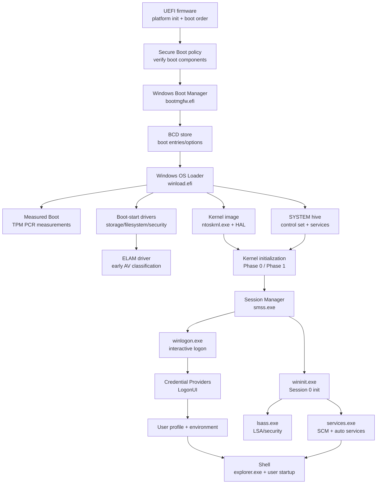
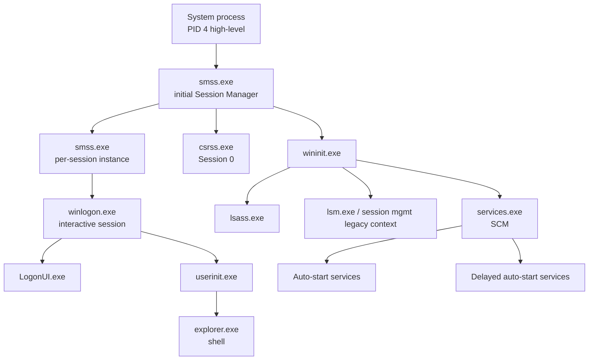
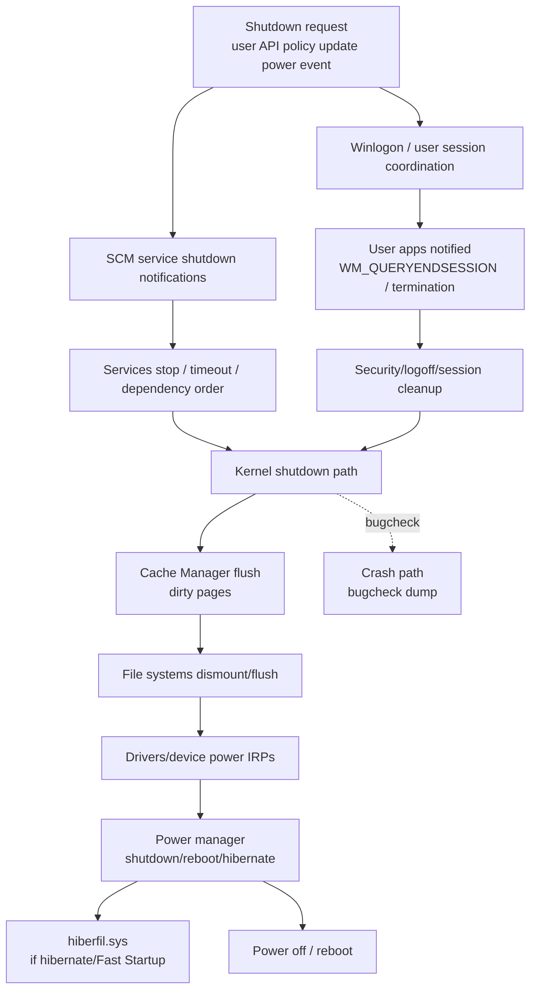
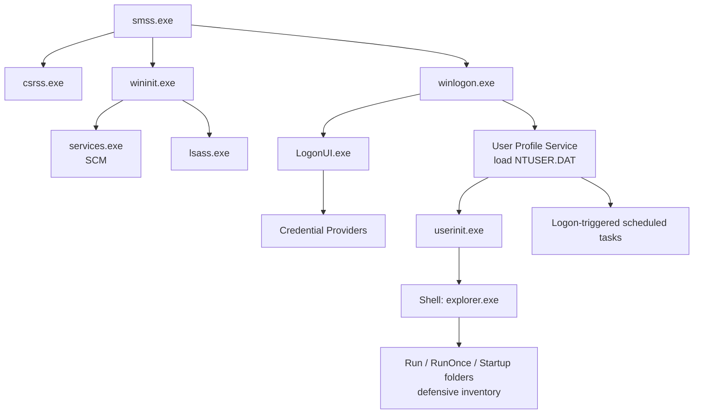
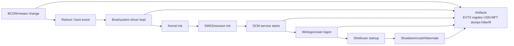

# Chapter 12: Startup and Shutdown

> **Framing note:** Chương này mô tả Windows startup và shutdown từ góc nhìn researcher: firmware, UEFI, Secure Boot, measured boot, BCD, Windows Boot Manager, kernel loader, boot-start drivers, ELAM, kernel initialization, Session Manager, services, LSASS, interactive logon, shutdown, hibernate, Fast Startup, recovery, telemetry, và forensic artifacts. Mục tiêu là xây dựng mental model chính xác về **boot as chain-of-trust + initialization timeline + evidence source** — không phải bypass guide, không phải tamper playbook.

---

## 0. Chapter Map

**Theo:** Windows Internals, Part 2, Chapter 12.

Chương này giải thích cách Windows đi từ firmware state đến interactive desktop, và ngược lại từ user/system shutdown đến filesystem flush, driver teardown, hibernate image, hoặc crash. Startup/shutdown không chỉ là “máy bật/tắt.” Đây là một chuỗi trust boundaries, loader decisions, kernel initialization, service ordering, logon transitions, sensor availability gaps, và forensic artifacts.

**Kết nối với các chương trước:**

| Chương | Liên hệ với Ch.12 |
|--------|-------------------|
| Ch.2 | System process tree, `System`, `smss.exe`, `wininit.exe`, `services.exe`, `lsass.exe`, `winlogon.exe` |
| Ch.5 | Memory Manager, page files, hibernation, working sets, crash dumps, modified pages |
| Ch.6 | I/O Manager, driver loading, boot-start/system-start drivers, storage stack, filesystem flush |
| Ch.7 | LSASS, logon, tokens, privileges, Credential Providers, security policy |
| Ch.8 | Object Manager namespace, symbolic links, sessions, debugging mechanisms |
| Ch.9 | Secure Boot, VBS/HVCI, Code Integrity, Credential Guard, measured trust implications |
| Ch.10 | Event Log, ETW, WER, Procmon boot logging, services/tasks/registry diagnostics |
| Ch.11 | Cache Manager, filesystem metadata, dirty shutdown, flush, VSS/hiberfil/cache evidence |

**Thông điệp cốt lõi của Ch.12:**
Boot-time analysis phải trả lời: *what ran before my sensor existed?* Shutdown analysis phải trả lời: *what state was persisted, flushed, hibernated, or lost?* Persistence/tamper investigation thường bắt đầu ở boot chain + BCD + drivers + services + Winlogon/user profile startup + telemetry gaps.

| Mục | Nội dung | Tại sao quan trọng |
|-----|----------|--------------------|
| 0 | Chapter Map | Điều hướng và liên kết với memory/I/O/security/telemetry |
| 1 | Researcher Mindset | Timeline, trust boundary, sensor availability, boot evidence |
| 2 | Big Picture | Firmware → Boot Manager → Loader → Kernel → Session → Services → Logon |
| 3 | Key Terms | Thuật ngữ UEFI, BCD, Secure Boot, ELAM, SMSS, SCM, Fast Startup |
| 4 | Core Internals | Boot phases, trust, BCD, kernel loading, ELAM, init, logon, shutdown |
| 5 | Important Components | Bảng boot components, process tree, service/driver start types |
| 6 | Trust Boundaries | Firmware, boot config, kernel, driver, service, logon, shutdown boundaries |
| 7 | Attack Surface Map | Boot config, drivers, services, Winlogon, recovery, shutdown artifacts |
| 8 | Abuse Patterns | Concept-level tamper/persistence/visibility classes, defensive-only |
| 9 | Defender / EDR Telemetry | Boot/logon/shutdown telemetry, timelines, Sigma/KQL-style ideas |
| 10 | Forensic Artifacts | EVTX, registry, BCD, services, control sets, boot logs, hiberfil, crash |
| 11 | Debugging and Reversing Notes | WinDbg boot debugging, bcdedit, Procmon boot, Autoruns, Event Viewer |
| 12 | Safe Local Labs | BCD inspection, Safe Mode compare, boot logging, service startup, events |
| 13 | Common Researcher Mistakes | Misconceptions and analysis traps |
| 14 | Windows Version Notes | UEFI/Secure Boot/Fast Startup/VBS/logging/version caveats |
| 15 | Summary | Startup/shutdown as trust + initialization + telemetry + evidence |
| 16 | Research Questions | Questions for validation and research |
| 17 | References | Documentation and tooling references |
| 18 | Illustration Plan | Diagrams, screenshots, search terms |

---

## 1. Researcher Mindset

### 1.1 Startup is a timeline, not a single event

Windows startup is a sequence of transitions:

```text
Firmware → boot manager → OS loader → kernel initialization → Session Manager → core user-mode services → logon → shell/user environment
```

Each transition changes who is trusted, what code can run, what storage/configuration is available, what telemetry exists, and what artifacts are created. A researcher must think in **time order**:

- Firmware runs before Windows.
- Boot Manager runs before kernel.
- Boot-start drivers run before most user-mode sensors.
- ELAM/security drivers run before normal boot-start driver trust decisions complete.
- `smss.exe` starts before service infrastructure.
- `services.exe` starts before many EDR user-mode components.
- User logon happens after Session 0 initialization.
- Explorer/Run/RunOnce are late compared with boot drivers/services.

The key question: **what ran before my observation layer existed?**

### 1.2 Boot is a chain of trust and a chain of assumptions

Secure Boot, measured boot, Code Integrity, ELAM, driver signing, service control, and logon security are connected, but they are not the same mechanism.

| Mechanism | Main purpose | Researcher caution |
|-----------|--------------|-------------------|
| UEFI Secure Boot | Verify early boot components against trusted keys | Does not by itself prove all later user-mode state is clean |
| Measured Boot | Record measurements into TPM PCRs | Measurement is evidence for attestation, not prevention by itself |
| Code Integrity | Enforce signature/policy for loaded code | Policy/state/build matters |
| ELAM | Let trusted AV driver classify early boot drivers | Requires ELAM-capable product and has scope limits |
| SCM/service start | Start configured services by type/dependency | Service config is not execution proof without telemetry |
| Logon controls | Credential providers/user profile/shell | Late in boot; many components already ran |

### 1.3 Startup forensics begins before the desktop

Incident response often begins with user-visible symptoms: desktop, shell, tray process, suspicious user process. Boot analysis starts earlier:

- BCD changes.
- Recovery/Safe Mode/debug flags.
- Boot-start drivers.
- Driver service keys.
- ELAM/security product state.
- Service creation/modification.
- Control set changes.
- `Winlogon\Shell` / `Userinit` and Run/RunOnce locations.
- Boot/shutdown Event Logs.
- Procmon boot PML, bootlog, ETW traces if captured.

Persistence at boot layers can execute before standard user-mode logging, before user logon, and sometimes before EDR full policy is loaded.

### 1.4 Shutdown is evidence generation and evidence loss

Shutdown is not “everything stops instantly.” It includes service notifications, process termination, session teardown, driver/device shutdown, Cache Manager write-back, filesystem flush, storage stack shutdown, and possibly hibernation image creation.

Research implications:

- Clean shutdown vs crash/dirty shutdown leaves different artifacts.
- Fast Startup can preserve kernel state in `hiberfil.sys`, changing “fresh boot” assumptions.
- Services may receive stop notifications and write logs/config.
- Dirty cache pages may flush, fail to flush, or be recovered later.
- Crash dumps/WER can preserve memory state.
- Event Logs may record planned shutdown, unexpected shutdown, boot type, and service failures.

### 1.5 Researcher questions for every startup/shutdown case

1. Was this a full boot, Fast Startup/hybrid boot, resume from hibernate, sleep resume, recovery boot, Safe Mode, or crash recovery?
2. Was Secure Boot enabled? Was measured boot/attestation available?
3. What BCD entry/options were used?
4. Which control set became `CurrentControlSet`?
5. Which boot-start/system-start drivers loaded and in what order?
6. Did ELAM/security drivers initialize?
7. When did EDR/AV sensor components become active?
8. Which services started, failed, delayed, or changed config?
9. Which user logged on, which profile loaded, and which shell/userinit paths executed?
10. Was shutdown clean, planned, unexpected, crash, hibernate, or hybrid?
11. Which telemetry source saw each phase?
12. Which artifacts can survive reboot and which are volatile?

### 1.6 Common mental trap: “my EDR saw the first event”

EDR sensors often have kernel components, minifilters, ETW consumers, user-mode services, and cloud backends. Their visibility begins at different phases. A boot-start minifilter may see file operations before a user-mode EDR service starts. A user-mode collector may miss early driver loads. Event Log may record service failure but not the full driver initialization path. Boot telemetry is special because **the sensor itself has a startup sequence**.

### 1.7 Field notes: what “early” means

“Early boot” is ambiguous. Be precise:

| Phrase | Better wording |
|--------|----------------|
| Early boot | Firmware/Boot Manager/Loader phase? Kernel boot-start drivers? SMSS? Services? |
| Before logon | Could include services and security products already running |
| Before EDR | Which component: driver, service, ETW consumer, cloud upload? |
| Boot persistence | Driver, service, scheduled task at startup, Winlogon, Run key, shell extension? |
| Shutdown artifact | Event Log, hiberfil, crash dump, dirty bit, service stop log, filesystem journal? |


### 1.8 Timeline discipline: boot evidence has phases

Khi điều tra startup, hãy viết timeline theo phases thay vì chỉ sort mọi timestamp chung một bảng. Một boot timeline tốt nên có ít nhất:

| Phase | Evidence examples | Typical gap |
|------|-------------------|-------------|
| Pre-OS | Firmware settings, Secure Boot state, ESP, BCD | Normal EDR absent |
| Loader | Boot Manager/BCD/options, loader diagnostics if debugged | Few durable logs |
| Kernel early | boot-start drivers, CI/ELAM, SYSTEM hive | User-mode logs absent/partial |
| Kernel late | PnP, system-start drivers, Session Manager start | EDR kernel driver may exist, service may not |
| Session 0 | SMSS, Wininit, SCM, LSASS | Interactive user absent |
| Services | auto/delayed services, EDR service, network | Ordering/dependency delays |
| Interactive | Winlogon, profile, shell, Run keys | Already late in boot |
| Shutdown/reboot | service stop, cache flush, hibernate/crash | Logs may be truncated |

Nếu một artifact timestamp nằm trong “boot window,” hãy hỏi nó thuộc phase nào. Một registry write trước EventLog service start có thể không có Event Log process evidence. Một driver load trước EDR service start có thể chỉ có kernel/CI evidence. Một Run key process sau Explorer start không phải early boot.

### 1.9 Sensor availability model

Defensive engineering cần model sensor như một cây startup riêng:

1. Boot-start security driver/minifilter nếu có.
2. ELAM driver nếu product hỗ trợ.
3. Kernel callbacks/minifilters initialized after driver load.
4. User-mode service starts via SCM.
5. ETW sessions/providers enabled by service.
6. Policy/config pulled from disk/network/cloud.
7. Backend upload/response becomes available.

Mỗi stage có blind spots. Một product có driver loaded không nghĩa là policy loaded. Một service running không nghĩa là cloud verdict available. Một ETW consumer enabled late sẽ miss earlier provider events. Detection reports nên nói rõ “sensor active from approximately X phase,” nếu biết.

### 1.10 Startup as configuration execution

Boot is where configuration becomes execution:

- BCD option → loader behavior.
- SYSTEM control set → driver/service database.
- Driver `Start=0/1` → early kernel load attempt.
- Service `Start=2` → SCM start attempt.
- Scheduled task boot/logon trigger → Task Scheduler action.
- Winlogon/Userinit/Shell → logon execution.
- Run/RunOnce → user startup execution.

Forensics phải tách “configured to run” khỏi “actually ran.” Startup analysis is the discipline of proving that transition.

### 1.11 Analyst language: precise claims

Prefer precise claims:

- “BCD contained a loader option enabling kernel debugging at collection time.”
- “The service was configured as auto-start before the observed boot.”
- “SCM recorded service start failure after kernel initialization.”
- “The driver service key existed, but no driver load evidence was found in available logs.”
- “Fast Startup was enabled, so the next power-on may not represent full kernel initialization.”
- “The EDR user-mode service started after these boot driver events.”

Avoid overclaims:

- “Secure Boot was on, so no boot tamper occurred.”
- “No EDR alert means no early boot activity.”
- “Service key equals execution.”
- “Shutdown means all caches were flushed safely.”
- “Restart and shutdown are equivalent.”

---

## 2. Big Picture

### 2.1 Full boot pipeline



### 2.2 Boot phases and trust boundaries

| Phase | Main actor | Trust boundary | Research focus |
|-------|------------|----------------|----------------|
| Firmware | UEFI/BIOS | Platform firmware and boot order | Boot device, Secure Boot state, firmware logs if available |
| Boot Manager | `bootmgfw.efi` | Microsoft-signed boot component + BCD | Boot entry/options, recovery/debug/safe mode flags |
| OS Loader | `winload.efi` | Loader decisions before kernel | Kernel/HAL/drivers/SYSTEM hive loading |
| Kernel early init | `ntoskrnl.exe` | Kernel trust begins | Memory, objects, processes, I/O, security managers |
| Boot drivers | Boot-start drivers | Driver signing/ELAM/CI boundary | Storage/security/filesystem drivers before services |
| Session init | `smss.exe` | First user-mode session manager | Pagefiles, object directories, subsystems, Session 0 |
| Core services | `wininit.exe`, `services.exe`, `lsass.exe` | Service/security infrastructure | SCM ordering, LSASS, service failures |
| Interactive logon | `winlogon.exe`, LogonUI, CPs | Credential/profile/shell boundary | User profile, shell, Run/RunOnce, logon artifacts |

### 2.3 Metadata/configuration path

Startup pulls configuration from multiple places:

```text
Firmware NVRAM / boot order
  ↓
EFI System Partition + bootmgfw.efi
  ↓
BCD store
  ↓
SYSTEM registry hive + control set
  ↓
Services/driver keys + load order groups
  ↓
Winlogon/user profile/shell/startup locations
```

Each layer has different tooling and artifacts. BCD is not the registry service database. Service registry keys are not proof of runtime service start. Run keys are later than services. User profile startup is later than machine boot.

### 2.4 Startup process tree high-level



### 2.5 Shutdown flow



---

## 3. Key Terms

| Term | Vietnamese explanation | Researcher relevance |
|------|------------------------|----------------------|
| **UEFI** | Firmware interface modern thay BIOS legacy | Controls boot order, Secure Boot, EFI apps |
| **Legacy BIOS** | Older firmware boot model using MBR-style flow | Still relevant in old systems/VMs; different artifacts |
| **EFI System Partition (ESP)** | FAT partition chứa EFI bootloaders | Boot files/artifacts live here; acquisition target |
| **Secure Boot** | UEFI feature verifying signed boot components | Chain-of-trust baseline; state must be verified |
| **Measured Boot** | Boot component measurements extended into TPM PCRs | Attestation and tamper evidence angle |
| **TPM** | Trusted Platform Module | Stores PCRs/keys; supports measured boot/BitLocker/attestation |
| **PCR** | Platform Configuration Register | Measurement register; sequence-sensitive evidence |
| **Attestation** | Remote/local verification of measured state | Defender verifies expected boot/security state |
| **BCD** | Boot Configuration Data store | Boot entries/options: Safe Mode, debug, recovery, loader settings |
| **Windows Boot Manager** | `bootmgfw.efi`, selects boot entry and starts loader | Critical pre-kernel component |
| **winload.efi** | Windows OS Loader | Loads kernel, HAL, boot drivers, SYSTEM hive |
| **ntoskrnl.exe** | Windows kernel image | Core kernel initialization begins here |
| **HAL** | Hardware Abstraction Layer | Hardware abstraction loaded with kernel |
| **SYSTEM hive** | Registry hive with control sets/services | Driver/service startup configuration |
| **Control set** | Registry configuration set under SYSTEM hive | `CurrentControlSet` maps to selected control set |
| **Last Known Good** | Concept of prior working control set | Recovery reasoning; modern behavior differs by version |
| **Boot-start driver** | Driver loaded by OS loader during boot | Runs before services; high-value persistence/telemetry point |
| **System-start driver** | Driver loaded by kernel later in boot | Still early, before many user-mode components |
| **Auto-start service** | Service started by SCM automatically | User-mode service persistence and core system behavior |
| **Delayed auto-start** | Auto service started after initial auto services | Timing caveat for telemetry/service readiness |
| **Load order group** | Driver/service ordering grouping | Determines dependency/order constraints |
| **ELAM** | Early Launch Anti-Malware | Early security driver classification of boot drivers |
| **Code Integrity** | Signature/policy enforcement for code load | Boot and driver load trust boundary |
| **smss.exe** | Session Manager | First major user-mode manager; creates sessions/subsystems |
| **Session 0** | Non-interactive services session | Services isolated from interactive users |
| **csrss.exe** | Client/Server Runtime Subsystem process | Required subsystem process started by SMSS |
| **wininit.exe** | Windows initialization process for Session 0 | Starts services.exe, lsass.exe, related core components |
| **services.exe** | Service Control Manager process | Starts/manages services based on registry config |
| **lsass.exe** | Local Security Authority Subsystem Service | Authentication/security policy/token-related role |
| **winlogon.exe** | Interactive logon manager | Coordinates secure attention/logon/profile/shell |
| **LogonUI.exe** | Credential UI host | User-facing credential entry UI |
| **Credential Provider** | Authentication UI/provider plugin model | Logon surface; legitimate extension and forensic point |
| **User profile** | Per-user registry/files/environment loaded at logon | Profile load artifacts and user startup context |
| **Shell** | User shell, commonly `explorer.exe` | Late user-mode startup surface |
| **Run / RunOnce** | Registry startup locations | Defensive/forensic persistence locations, user/machine scope |
| **Fast Startup** | Hybrid shutdown storing kernel session in hiberfil | Not a full cold boot; forensic and driver-state implications |
| **hiberfil.sys** | Hibernation file | Preserves memory state for hibernate/Fast Startup |
| **WinRE** | Windows Recovery Environment | Recovery/repair/Safe Mode/offline tools path |
| **Safe Mode** | Minimal driver/service boot mode | Troubleshooting and comparison baseline |
| **Boot logging** | Boot driver/service log mechanisms | Failure investigation and artifact generation |
| **Dirty shutdown** | Unclean shutdown/crash/power loss | Filesystem/log/event artifacts differ from clean shutdown |

---

## 4. Core Internals

### 4.1 Firmware, UEFI, and legacy BIOS

Firmware initializes platform hardware, selects boot device/order, and transfers control to a boot application. On modern Windows systems this usually means UEFI loads Windows Boot Manager (`bootmgfw.efi`) from the EFI System Partition.

**UEFI researcher notes:**

- Boot entries live in firmware NVRAM and reference EFI applications/paths.
- ESP is usually FAT and contains Microsoft boot files plus possible vendor tools.
- Secure Boot validates boot applications against firmware trust databases.
- Firmware settings, boot order, and Secure Boot state are outside normal Windows filesystem semantics.

**Legacy BIOS high-level:**
Older systems use BIOS/MBR-style boot. Many modern research environments still encounter legacy mode in VMs, old endpoints, or forensic images. The trust and artifact model differs: no UEFI Secure Boot chain in the same form, different boot sectors/MBR/VBR artifacts, different repair workflow.

### 4.2 Secure Boot chain of trust

Secure Boot is a UEFI feature that verifies signatures of boot components before they execute. In a typical Windows Secure Boot flow:

1. Firmware verifies Windows Boot Manager.
2. Windows Boot Manager verifies/loads Windows loader path.
3. Loader verifies kernel/boot components according to policy.
4. Code Integrity and kernel policies continue enforcement later.

Secure Boot is prevention-oriented: unsigned/untrusted boot components should not run in the verified chain. It is not the same as measured boot, and it does not mean every later service/user-mode component is benign.

**Defender verification angle:**

- Secure Boot enabled state.
- Boot mode UEFI vs legacy.
- DB/DBX updates and platform state where available.
- Code Integrity/HVCI/Device Guard state after boot.
- Event Logs indicating Secure Boot/Kernel-Boot/CI state.

**Adversarial-aware concept:**
Attackers conceptually care about boot trust because pre-OS and early-kernel tamper can run before many defenses. This chapter stays defensive: verify state, monitor configuration changes, and correlate early boot artifacts.

### 4.3 Measured Boot, TPM, PCRs, and attestation

Measured Boot records measurements of boot components/configuration into TPM PCRs. A PCR is extended with measurements in sequence; final PCR values represent the chain of measured events.

Important distinction:

- **Secure Boot:** blocks untrusted boot components according to policy.
- **Measured Boot:** records what happened for later verification.
- **Attestation:** compares measured state to expected state locally or remotely.

**Researcher notes:**

- Measurements are sequence-dependent; same components in different order can produce different PCR values.
- TPM PCRs do not directly tell a human “malicious/benign” without reference baseline/event log interpretation.
- BitLocker may depend on expected boot measurements; boot config changes can trigger recovery.
- Enterprise defenders can use attestation to verify boot security posture.

### 4.4 Windows Boot Manager and BCD

Windows Boot Manager (`bootmgfw.efi`) reads BCD — Boot Configuration Data — to select a boot entry and pass options to the OS Loader.

BCD concepts:

- Boot manager settings.
- OS loader entries.
- Recovery entries.
- Device/path references.
- Safe Mode options.
- Debugging options.
- Hypervisor/VBS-related boot options where applicable.
- Test signing / integrity-related settings depending configuration.

`bcdedit` is the common inspection tool. BCD changes are high-value because they affect boot behavior before the kernel and before many sensors.

**Researcher notes on suspicious BCD changes:**

- Debugging enabled unexpectedly.
- Safe Mode configuration changes.
- Recovery disabled unexpectedly.
- Test signing/integrity-related options changed.
- Boot status policy changes.
- Hypervisor launch type changes in VBS environments.
- Unknown boot entries or altered device/path references.

Do not assume every BCD change is malicious: dual-boot, virtualization, developer machines, kernel debugging labs, BitLocker recovery, and repair tools modify BCD legitimately.

### 4.5 OS Loader: winload.efi

`winload.efi` loads the Windows kernel, HAL, boot-start drivers, and SYSTEM hive information needed for early initialization. It prepares boot parameters and transfers control to the kernel.

Loader responsibilities high-level:

- Load `ntoskrnl.exe` and HAL.
- Load boot-start drivers needed to mount boot/system volumes.
- Load SYSTEM registry hive/control set data.
- Pass boot options from BCD.
- Participate in Code Integrity/Secure Boot policy chain.
- Prepare memory descriptors and boot context.

Researcher question: Which components were loaded before kernel telemetry was fully available?

### 4.6 SYSTEM hive, control sets, and Last Known Good

The SYSTEM hive contains control sets such as `ControlSet001`, `ControlSet002`, and a `Select` key indicating current/default/failed/last known good concepts. `CurrentControlSet` is a runtime alias to the selected control set.

Control set content includes:

- Services and driver configuration.
- Load order groups.
- Control/session manager settings.
- Crash control and boot-related system settings.
- Mounted devices and hardware/service state.

**Last Known Good concept:**
Historically, Windows could revert to a prior control set if boot/logon failed. Modern Windows recovery behavior differs by version, but control set reasoning remains important: analysts should inspect `Select` values and compare control sets when boot failure/tamper is suspected.

### 4.7 Driver and service startup types

Driver/service startup is controlled by registry configuration and SCM/kernel loading paths.

| Start type | Typical meaning | Loaded by | Research relevance |
|------------|-----------------|-----------|--------------------|
| Boot-start | Needed during boot before kernel fully initializes system | OS Loader/kernel early boot | Storage, filesystem, security drivers; very early visibility |
| System-start | Loaded by kernel during system initialization | Kernel/I/O manager | Early drivers before many services |
| Auto-start | Started automatically after SCM initializes | `services.exe` | Core services and many agents |
| Delayed auto-start | Started after initial auto-start wave | SCM | Timing caveat for EDR/telemetry readiness |
| Demand-start | Started manually/on demand | SCM/PnP/user action | Not proof of execution at boot |
| Disabled | Not started | N/A | Config state; can still be changed later |

Load order groups and dependencies affect ordering. Boot-start driver ordering matters for storage/filesystem/security stack readiness.

### 4.8 ELAM and early security drivers

ELAM — Early Launch Anti-Malware — exists because normal AV/EDR services start too late to classify boot-start drivers. An ELAM driver is loaded early and can classify boot-start drivers before they initialize fully.

Conceptual classifications include known good, known bad, bad but required for boot, unknown. Policy determines behavior.

**Defensive value:**

- Earlier visibility than user-mode services.
- Helps classify boot-start drivers.
- Integrates security product into early boot trust decisions.

**Limitations:**

- Requires ELAM-capable and properly installed security product.
- Scope is early driver classification, not universal malware detection.
- It does not replace Secure Boot, Code Integrity, or full EDR runtime telemetry.
- Attackers conceptually may target security product state/configuration; defenders monitor for tamper indicators.

### 4.9 Kernel initialization: Phase 0 and Phase 1

Windows kernel initialization is often described conceptually in phases.

**Phase 0 high-level:**
Runs on initial processor with minimal environment. Sets up core kernel structures, processor state, early memory management, and minimal executive infrastructure needed to continue.

**Phase 1 high-level:**
Initializes more executive subsystems, devices, drivers, worker threads, object namespace, process manager, memory manager, I/O manager, security reference monitor, cache manager, configuration manager, and starts user-mode initialization path.

Core components initialized:

- Memory Manager.
- Object Manager.
- Process Manager.
- I/O Manager.
- Security Reference Monitor.
- Configuration Manager.
- Cache Manager.
- Plug and Play / Power management high-level.

The System process and kernel/system threads exist early. Many operations that later appear as “System” activity during boot originate from kernel workers, driver init, lazy writer, memory manager, or PnP.

### 4.10 Driver initialization path

Drivers loaded at boot receive initialization callbacks and create device objects, attach to device stacks, register callbacks, initialize hardware, register minifilter instances, and expose interfaces.

Researcher notes:

- Driver load success/failure can be in System/Event Log/Code Integrity logs.
- A driver service registry key is configuration; load success requires telemetry/artifacts.
- Driver ordering affects visibility and behavior.
- Boot-start minifilters can observe filesystem activity before user-mode services.
- HVCI/Code Integrity can block drivers that load on older/non-HVCI systems.

### 4.11 Session Manager: smss.exe

`smss.exe` is the Session Manager. It is one of the first user-mode processes. It creates sessions, initializes critical user-mode environment pieces, creates page files, creates object directories, starts subsystem processes like `csrss.exe`, and starts `wininit.exe` for Session 0.

Important Session Manager responsibilities high-level:

- Process pending file rename/delete operations from Session Manager registry configuration.
- Create page files.
- Initialize environment and object directories.
- Start subsystem processes.
- Start Session 0 initialization.
- Create per-session `smss.exe` instances for interactive sessions.

**Forensic notes:**

- Pending file rename operations can explain file changes at boot.
- Pagefile configuration and creation are relevant to memory/forensics.
- SMSS failures can produce early boot failures before normal services.
- Object directory/session creation links Ch.8 Object Manager concepts to startup.

### 4.12 CSRSS, Wininit, Services, LSASS

`csrss.exe` is required for Win32 subsystem support. `wininit.exe` initializes core Session 0 processes. `services.exe` hosts SCM. `lsass.exe` hosts Local Security Authority functionality.

Typical Session 0 tree:

```text
smss.exe
  ├─ csrss.exe
  └─ wininit.exe
       ├─ services.exe
       ├─ lsass.exe
       └─ lsm.exe / related session-management component context depending version
```

**services.exe / SCM:**
Starts auto-start services based on registry, dependencies, groups, and delayed-auto policy. It records service start failures and state changes.

**lsass.exe:**
Handles authentication packages, security policy, logon sessions, token-related security operations, and interacts with Credential Guard/LSA protection depending configuration.

**Researcher notes:**

- Service startup ordering is not arbitrary; inspect dependencies and groups.
- Delayed auto-start affects sensor readiness and timeline gaps.
- LSASS state/protection affects credential investigation and logon artifacts.
- Failure of `wininit.exe`, `services.exe`, or `lsass.exe` is critical and can lead to shutdown/bugcheck.

### 4.13 Interactive logon

Interactive logon uses `winlogon.exe`, `LogonUI.exe`, Credential Providers, LSASS, user profile loading, and shell startup.

Flow high-level:

1. `winlogon.exe` manages secure logon session.
2. `LogonUI.exe` presents credential UI.
3. Credential Provider collects credential material/UI response.
4. LSASS authenticates and creates logon session/token.
5. User profile service loads user profile and `NTUSER.DAT`.
6. Environment/userinit runs.
7. Shell starts, usually `explorer.exe`.
8. User startup locations run later.

**Defensive/forensic startup locations:**

- `HKLM\Software\Microsoft\Windows\CurrentVersion\Run`.
- `HKCU\Software\Microsoft\Windows\CurrentVersion\Run`.
- `RunOnce` variants.
- Startup folders.
- Winlogon `Shell` and `Userinit` values.
- Scheduled tasks triggered at logon.
- Shell extensions and AppInit/IFEO/AppCompat-related contexts where applicable.

Keep analysis defensive: inventory, baseline, correlate process creation, signer, path, user, and timestamp.

### 4.14 Shutdown path

Shutdown can be user-initiated, policy-initiated, update-initiated, service/system-initiated, power-button initiated, remote, or crash-driven.

Clean shutdown high-level:

1. Shutdown request is authorized and broadcast.
2. User apps receive session end notifications.
3. Services receive preshutdown/shutdown/stop controls depending configuration.
4. SCM manages service stop ordering/timeouts.
5. Sessions log off.
6. Kernel coordinates device and filesystem shutdown.
7. Cache Manager flushes dirty pages.
8. File systems flush metadata/data and dismount as appropriate.
9. Drivers receive power/shutdown IRPs.
10. System powers off, reboots, hibernates, or hybrid shuts down.

Crash path differs: bugcheck writes crash dump if configured, Event Logs record unexpected shutdown after reboot, filesystems recover metadata using journals, and dirty bit/recovery paths may appear.

### 4.15 Hibernate, sleep, and Fast Startup

**Sleep:** preserves state in RAM with low power; resume is not a boot from scratch.

**Hibernate:** writes memory state to `hiberfil.sys` and powers off. Resume restores that state.

**Fast Startup / hybrid shutdown:** logs off users but hibernates the kernel session. Next power-on resumes kernel state rather than full cold boot.

Research implications:

- Fast Startup means “shutdown then boot” may not reload kernel/drivers like a full restart.
- Driver state and some kernel state can persist across Fast Startup.
- Updates and driver troubleshooting often require restart/full shutdown.
- `hiberfil.sys` can contain memory state relevant to forensics, subject to encryption/access constraints.
- Boot Event Logs may indicate boot type/hybrid behavior depending version/log source.

### 4.16 Recovery and failure paths

Recovery paths include WinRE, Automatic Repair, Safe Mode, Startup Settings, boot logging, System Restore, uninstall updates, command prompt, and offline registry/BCD repair.

**Safe Mode:**
Boots minimal drivers/services. Useful for comparing baseline: if issue disappears in Safe Mode, suspect third-party drivers/services/startup components.

**Boot logging:**
Can record loaded/not loaded drivers in a boot log. Procmon boot logging captures richer file/registry/process activity after its boot component is active.

**Common failure points:**

- Firmware/boot device not found.
- Secure Boot violation.
- BCD corruption/misconfiguration.
- BitLocker recovery due to boot measurement/config change.
- Boot-start storage driver failure.
- Filesystem corruption.
- Driver bugcheck during initialization.
- Code Integrity/HVCI driver block.
- Service hang during startup.
- User profile load failure.
- Credential provider/logon component issue.

### 4.17 Boot-time telemetry is sparse and layered

Early phases have fewer familiar logs. Later phases have richer telemetry. Practical sources:

- Firmware/TPM attestation where available.
- BCD store and `bcdedit` output.
- Event Logs: Kernel-Boot, Kernel-General, EventLog, Service Control Manager, Winlogon, User Profile Service, CodeIntegrity, BitLocker, VSS, Power-Troubleshooter.
- Security logs for logon if audit enabled.
- Procmon boot logging if configured before reboot.
- Boot log if enabled.
- EDR kernel driver telemetry, if sensor active early enough.
- MFT/USN for file changes during boot.
- Registry control sets/services/startup locations.

### 4.18 Clean shutdown vs dirty shutdown

Clean shutdown leaves planned shutdown/logoff/service-stop patterns. Dirty shutdown/crash/power loss leaves unexpected shutdown records, possible filesystem recovery, crash dump/WER, and missing orderly service stop events.

Researcher should distinguish:

- Planned restart for update.
- User-initiated shutdown.
- Remote/admin shutdown.
- Power loss.
- Bugcheck/crash.
- Hibernation/resume.
- Fast Startup/hybrid boot.


### 4.19 Boot Manager policy details worth tracking

BCD is a structured configuration store, not a simple text file. Researchers should treat BCD options as **pre-kernel policy inputs**.

High-value classes:

| BCD class | Examples | Research question |
|-----------|----------|------------------|
| Boot selection | default entry, timeout, display order | Which OS/loader entry actually booted? |
| Recovery | recovery enabled, recovery sequence | Was automatic repair suppressed or redirected? |
| Debugging | kernel debug, boot debug, debug transport | Was debug surface enabled unexpectedly? |
| Safe Mode | safeboot minimal/network/alternateshell | Did machine intentionally boot reduced services? |
| Integrity/test | test signing / integrity-related flags where present | Was code trust posture weakened? |
| Hypervisor | hypervisor launch settings | Did VBS/Hyper-V assumptions change? |
| EMS/boot status | emergency management / boot status policy | Did failure handling behavior change? |

BCD inspection should be paired with BitLocker/TPM context. Legitimate BCD changes can trigger recovery because measured boot inputs changed.

### 4.20 Boot status, boot success, and “good boot” reasoning

Windows needs to know whether a boot succeeded enough to mark configuration as usable. Historically this related to Last Known Good and control sets. Modern Windows recovery is more complex, but the research question remains: **did the system reach a stable enough point after choosing this configuration?**

Signals:

- Kernel boot completed enough for Event Log to start.
- SCM started core services.
- Winlogon reached logon UI.
- User logon succeeded.
- Boot status policy/recovery did or did not invoke repair.
- Repeated boot failures led to WinRE/Automatic Repair.

This matters for interpreting control sets and “failed” configuration. A driver may be configured in a control set that never reached successful logon.

### 4.21 Pending file rename/delete operations

Session Manager processes pending file rename/delete operations during boot. This is commonly used by installers/updaters to replace files that were locked during runtime.

Research implications:

- A file may be deleted/replaced early in boot before normal user-mode telemetry.
- Pending operations are configuration artifacts before reboot and execution artifacts after reboot.
- Installers, updates, AV quarantine/remediation, and legitimate repairs use this mechanism.
- Unexpected pending rename/delete targeting security tools, drivers, or system binaries is high-value.

Defensive review should record:

- Source process that created pending operation if telemetry exists.
- Target source/destination paths.
- Reboot time when SMSS would process it.
- Resulting file metadata after boot.

### 4.22 Page files during startup/shutdown

SMSS creates/configures page files based on registry settings. Pagefile state matters for memory pressure, crash dumps, and forensic residuals.

Research notes:

- Pagefile creation happens early in user-mode initialization.
- Crash dump configuration may require adequate pagefile or dedicated dump file depending version/config.
- Pagefile can contain remnants of memory content; handling requires sensitivity.
- Pagefile clearing at shutdown is policy-controlled and can lengthen shutdown.

### 4.23 Boot-start storage and filesystem dependency chain

The OS cannot mount the system volume without appropriate storage stack and filesystem components. Boot-start drivers often include storage controller drivers, disk/class drivers, volume manager pieces, filesystem-related components, encryption drivers, and security filters.

Research implications:

- A failed storage boot driver can prevent boot entirely.
- Encryption/storage filter ordering can change access to boot volume.
- Boot-start minifilters/security drivers observe early file operations, but misbehavior can cause boot failures.
- Driver load order group and tag values can matter when debugging boot hangs.

### 4.24 PnP and device initialization during boot

Plug and Play enumerates devices and loads drivers during boot. Some drivers are boot-start because required for boot volume; others are system-start or demand-start due to PnP enumeration.

Research notes:

- Device arrival can trigger driver loads after kernel init.
- Driver install/update before reboot may materialize as load failure during next boot.
- Event Logs may show device/driver installation separate from driver load.
- Hardware changes, docking, virtualization, and storage controllers can alter boot behavior.

### 4.25 Code Integrity, HVCI, and boot driver failures

Modern driver load behavior depends on signature, CI policy, HVCI compatibility, revocation, and platform security state.

Research questions:

- Was the driver signed?
- Was signer trusted at boot time?
- Did HVCI/Memory Integrity block it?
- Did Code Integrity log a policy violation?
- Did the driver previously load on a non-HVCI system?
- Was the failure security-relevant or compatibility-related?

Avoid labeling every driver load failure malicious. Compatibility and policy changes are common.

### 4.26 LSASS, LSA protection, and Credential Guard during boot

LSASS starts in Session 0 under `wininit.exe`. Its protection state can include RunAsPPL/LSA protection and Credential Guard/LSA isolation depending configuration.

Research notes:

- LSASS starts before interactive logon can succeed.
- Authentication packages/security packages load into LSASS context; suspicious additions are high-value.
- Credential Guard changes where credential material resides, connecting to Ch.9.
- LSA protection affects debugger/dump/tool behavior.
- LSASS crash is critical and can force system shutdown/reboot behavior.

### 4.27 Winlogon deeper notes

Winlogon coordinates secure attention sequence, workstation lock/unlock, logon/logoff, profile notification, screen saver security, and shell/userinit startup. It is not just “the process that shows login.”

Defensive high-value registry/config areas include:

- Winlogon `Shell`.
- Winlogon `Userinit`.
- Credential Provider registrations.
- Authentication package/security package related areas.
- User profile service state.

Researcher caution: many enterprise logon products legitimately integrate here. Baseline and signer/path validation are essential.

### 4.28 Shutdown service ordering and preshutdown

Services can register for preshutdown/shutdown notifications. SCM gives services time to stop, but timeouts and dependencies matter. Some services write final logs, flush databases, stop child processes, or unregister network state.

Research implications:

- Absence of orderly service stop can indicate crash/power loss or timeout.
- Long shutdown can be caused by service preshutdown behavior.
- EDR/AV services may still be active during part of shutdown, but backend upload may fail if network stops.
- Service stop events can be normal during planned shutdown; context matters.

### 4.29 Filesystem/cache shutdown details

During clean shutdown, Cache Manager and file systems attempt to flush dirty data and metadata. Storage devices receive shutdown/power IRPs. NTFS/ReFS consistency mechanisms prepare volume state.

Research caveats:

- Clean shutdown does not prove every application-level transaction was consistent.
- A service may have written partial app data before filesystem flush.
- Device write caches may have independent behavior.
- Dirty shutdown can cause filesystem recovery on next boot.
- USN/MFT/$LogFile can show metadata activity around shutdown/restart.

### 4.30 Reboot types and why “restart” matters

Windows Restart is not equivalent to Fast Startup shutdown. Restart generally performs fuller kernel reinitialization, while Fast Startup shutdown hibernates kernel session. Troubleshooting drivers, kernel hooks, and boot-start behavior often requires Restart or explicit full shutdown.

Research language:

- “Full restart observed” if evidence supports restart path.
- “Power-on after hybrid shutdown” if Fast Startup likely.
- “Resume from hibernate/sleep” if power events indicate resume.
- “Unexpected restart after bugcheck” if crash artifacts exist.

### 4.31 Update and servicing boot phases

Windows Update and servicing can add special boot-time behavior:

- Pending file operations.
- Component Based Servicing actions.
- Driver updates requiring reboot.
- Multiple reboot phases.
- Setup/Servicing Event Logs.
- Temporary services/tasks.

Researcher angle:

- Not every boot-time file replacement is suspicious.
- Update windows create noisy service/driver/file telemetry.
- Correlate with Windows Update/Servicing logs and maintenance windows.
- Failed updates can trigger recovery/rollback patterns.

### 4.32 Boot performance analysis

Boot slowness is often caused by driver initialization, service dependencies, disk I/O, network waits, Group Policy, profile load, or security product scanning.

Useful lenses:

- Event Viewer boot performance diagnostics if enabled.
- WPR boot trace and WPA timeline.
- Procmon boot log for registry/file hot spots.
- SCM service timeout/failure events.
- User Profile Service logs.
- Group Policy operational logs.

Researcher mindset: boot performance and security investigation overlap because persistence/tamper often appears as new driver/service/logon delay.

### 4.33 What ran before the network existed?

Many defenders rely on cloud telemetry, but early boot often precedes reliable network and backend upload.

Questions:

- Did network stack initialize before EDR policy retrieval?
- Was the endpoint offline during boot?
- Were events buffered locally?
- Did a crash/power loss occur before upload?
- Does backend event time reflect observation time or ingestion time?

For boot timelines, distinguish local event timestamp from cloud ingestion timestamp.

### 4.34 VM and sandbox boot caveats

Windows boot in VMs/sandboxes may differ:

- Firmware may be virtual UEFI/BIOS.
- Secure Boot may be disabled or implemented differently.
- TPM may be virtual or absent.
- Drivers/services differ from physical hardware.
- Fast Startup may be disabled in snapshots.
- Time sync can jump during resume/snapshot.

Malware analysis conclusions from VM boot behavior should be validated against target-like configuration when boot persistence matters.

---

## 5. Important Windows Components / Structures

### 5.1 Boot components and responsibilities

| Component | Role | Researcher angle | Useful tools |
|-----------|------|------------------|--------------|
| UEFI firmware | Platform init, boot order, Secure Boot | Pre-OS trust boundary | Firmware UI, msinfo32, vendor logs |
| EFI System Partition | Stores EFI boot files | Offline boot artifact source | mountvol, diskpart, forensic tools |
| Secure Boot DB/DBX | Trust/revocation databases | Verify boot policy state | msinfo32, PowerShell, firmware tools |
| TPM/PCRs | Measured boot registers | Attestation/evidence | tpm.msc, enterprise attestation |
| BCD store | Boot configuration | Safe Mode/debug/recovery/tamper analysis | bcdedit |
| Windows Boot Manager | Selects boot entry | Pre-kernel decision point | BCD, boot logs |
| winload.efi | Loads kernel/HAL/boot drivers | Loader phase evidence gap | boot debugging, BCD |
| ntoskrnl.exe | Kernel | Phase 0/1 initialization | WinDbg, symbols |
| HAL | Hardware abstraction | Hardware/boot compatibility | WinDbg, system info |
| SYSTEM hive | Control sets/services | Driver/service boot config | reg.exe, offline registry tools |
| Boot-start drivers | Early drivers | Before user-mode sensors | Event Log, CodeIntegrity, Autoruns |
| ELAM driver | Early AV classification | Early security posture | Event Log, AV/EDR console |
| smss.exe | Session Manager | First user-mode manager | Process tree, boot logs |
| csrss.exe | Win32 subsystem support | Critical process | Process Explorer, WinDbg |
| wininit.exe | Session 0 init | Starts core services/security | Process tree |
| services.exe | SCM | Service start ordering/failures | services.msc, sc.exe, Event Viewer |
| lsass.exe | Security authority | Authentication/logon/protection | Event Logs, security tooling |
| winlogon.exe | Interactive logon | User logon/profile/shell | Event Logs, Process Explorer |
| LogonUI/Credential Providers | Credential UI | Logon extension surface | Event Logs, registry, Autoruns |
| Explorer/shell | User shell | Late user startup | Autoruns, Process Explorer |
| hiberfil.sys | Hibernation/Fast Startup image | Memory state artifact | Powercfg, forensic tools |
| WinRE | Recovery environment | Repair/offline changes | reagentc, recovery logs |

### 5.2 Startup process tree

| Process | Parent high-level | Phase | Researcher notes |
|---------|-------------------|-------|------------------|
| System | Kernel-created | Kernel init | Kernel/system threads, driver work |
| smss.exe | System | First user-mode | Session creation, pagefiles, subsystems |
| csrss.exe | smss.exe | Session init | Critical subsystem process |
| wininit.exe | smss.exe | Session 0 | Starts services/LSASS |
| services.exe | wininit.exe | Core services | SCM, auto/delayed services |
| lsass.exe | wininit.exe | Security | Auth/security policy/logon sessions |
| lsm.exe / related | wininit.exe | Session mgmt legacy/context | Version-dependent relevance |
| winlogon.exe | smss per-session | Interactive session | Logon, profile, shell coordination |
| LogonUI.exe | winlogon.exe | Credential UI | Credential Providers |
| userinit.exe | winlogon.exe | User environment | Starts shell/startup flow |
| explorer.exe | userinit.exe | Shell | User desktop and late startup |

### 5.3 Service/driver startup types

| Registry Start value concept | Name | Start path | Defensive notes |
|------------------------------|------|------------|-----------------|
| 0 | Boot-start | OS Loader/kernel early | Highest boot persistence concern |
| 1 | System-start | Kernel initialization | Early driver concern |
| 2 | Auto-start | SCM | Standard service persistence |
| 2 + delayed flag | Delayed auto-start | SCM after initial wave | Sensor readiness/timing caveat |
| 3 | Demand-start | On demand | Config exists but not boot execution |
| 4 | Disabled | Not started | Monitor unexpected enablement |

### 5.4 Failure and recovery paths

| Path | Trigger | What to observe | Research value |
|------|---------|-----------------|----------------|
| WinRE | Boot failure/manual recovery | reagentc state, recovery logs, offline changes | Repair/tamper timeline |
| Automatic Repair | Repeated boot failure | Repair actions/logs | Explains BCD/registry changes |
| Safe Mode | Startup setting/BCD option | Minimal services/drivers | Compare third-party impact |
| Boot logging | Debug/troubleshooting option | Loaded/not-loaded drivers | Driver failure triage |
| Last Known Good/control set | Control set recovery concept | SYSTEM\Select values | Boot config reasoning |
| Crash recovery | Bugcheck/power loss | dump, Event Logs, dirty shutdown | Root cause and timeline |
| BitLocker recovery | Measurement/config change | recovery prompt/events | Boot trust/config change evidence |

### 5.5 User-mode initialization tree




### 5.6 Boot artifact confidence matrix

| Artifact | Strongly supports | Does not prove alone | Correlate with |
|----------|------------------|----------------------|----------------|
| BCD option present | Boot configuration at collection time | Option was active during prior boot | Event Logs, BitLocker, timestamps, EDR |
| Service `Start=2` | Auto-start configuration | Service successfully ran | SCM events, process telemetry |
| Driver `Start=0` | Boot-start configuration | Driver loaded successfully | CI/System logs, memory, driver object |
| SCM service start event | SCM attempted/started service | Service performed intended function | Process health, app logs, network/file telemetry |
| Kernel-Power unexpected | Unclean shutdown likely | Exact root cause | Bugcheck, power logs, UPS/hardware, dump |
| Hiberfil present | Hibernate/Fast Startup possible | This boot resumed from hiberfile | Kernel-Boot/power events, powercfg state |
| Winlogon Shell value | Configured shell | Shell launched successfully | Process creation, user profile logs |
| Procmon boot PML | Captured operations in its window | Pre-Procmon firmware/loader truth | BCD/CI/Event Logs/EDR |

### 5.7 Boot event source map

| Provider/log | Typical evidence | Research use | Caveat |
|--------------|------------------|--------------|--------|
| Microsoft-Windows-Kernel-Boot | boot type, boot environment fields | Boot/resume/hybrid hints | Field availability varies |
| Microsoft-Windows-Kernel-Power | unexpected shutdown, sleep/resume | Power/crash context | Root cause not always included |
| EventLog | event log service start/stop | Clean vs abrupt timeline | Can roll/clear |
| Service Control Manager | service start/fail/install/change | Service timeline | Many benign events |
| Microsoft-Windows-CodeIntegrity | code/driver policy blocks | Driver trust | Channel/policy dependent |
| Microsoft-Windows-Winlogon | logon/session events | Interactive phase | Version/config dependent |
| User Profile Service | profile load/unload failures | User environment | Profile issues can be noisy |
| Security | logon/logoff/audit | Authentication and policy | Audit policy required |
| BitLocker | recovery/protector events | Boot trust changes | Only if BitLocker used |
| Setup/Servicing | update boot phases | Update correlation | Noisy during patching |

### 5.8 Startup configuration tiers

| Tier | Examples | Timing | Investigation priority |
|------|----------|--------|------------------------|
| Pre-OS | firmware, ESP, BCD | Before Windows kernel | Highest for boot trust |
| Kernel driver | boot/system drivers, ELAM, minifilters | Before services/logon | Highest for early persistence |
| Machine service | auto/delayed services, SCM | Session 0 | High for persistence/sensors |
| Machine scheduled | startup tasks | After Task Scheduler | Medium/high depending action |
| Logon security | Credential Providers, Winlogon | Interactive logon | High for credential/logon integrity |
| User startup | Run/RunOnce, Startup folders, shell | After profile/shell | Common persistence, later timing |
| Application startup | app updaters, tray apps | Post-shell | Context-dependent |

This tiering helps answer “how early can it run?” and “which sensors could have seen it?”

### 5.9 Boot failure triage table

| Symptom | Likely phase | First artifacts/tools | Research note |
|---------|--------------|-----------------------|---------------|
| No boot device | Firmware/storage | firmware UI, disk layout, ESP | Windows logs may not exist |
| Secure Boot violation | UEFI boot | firmware message, Secure Boot state | Check signed boot path |
| BitLocker recovery | Measured boot/config | recovery screen, BitLocker logs | BCD/firmware/TPM change likely |
| INACCESSIBLE_BOOT_DEVICE | kernel/storage boot | crash dump, driver changes | Storage driver/filter ordering |
| Early bugcheck | kernel/driver init | MEMORY.DMP, CI/System logs | Boot debugging useful |
| Hangs before logon UI | kernel/SMSS/wininit/services | boot log, Procmon boot, SCM logs | Service/driver/profile distinction |
| Logon succeeds but shell absent | Winlogon/userinit/shell | Winlogon/User Profile, registry | Shell/Userinit/Run issues |
| Very slow boot | drivers/services/profile/network | WPR boot trace, SCM, Group Policy logs | Performance and persistence overlap |

---

## 6. Trust Boundaries

### 6.1 Firmware and boot device boundary

Firmware controls which boot application runs. Secure Boot state and boot order are foundational.

Research notes:

- Boot order changes can redirect execution before Windows.
- ESP contents are high-value.
- Firmware passwords, Secure Boot keys, and vendor tooling affect trust.
- Legacy boot lacks the same Secure Boot model.

### 6.2 BCD boundary

BCD controls loader behavior. Changing BCD can alter Safe Mode, debugging, recovery, hypervisor launch, integrity/test settings, and selected OS entry.

Detection notes:

- Monitor `bcdedit` execution and BCD file changes.
- Correlate with admin change windows, BitLocker recovery, repair actions.
- Unexpected debug/test/integrity-related changes are high-signal but require context.

### 6.3 Kernel/driver boundary

Boot-start and system-start drivers run before normal services.

Research notes:

- Driver signature/CI/HVCI/ELAM state matter.
- Driver service key write is configuration; load telemetry confirms runtime.
- Driver load failures can be benign compatibility issues or tamper indicators.
- Boot-start minifilters can observe files before user-mode EDR service starts.

### 6.4 Service boundary

SCM mediates auto-start services. Service DACL, account, binary path, dependencies, failure actions, and delayed start define behavior.

Research notes:

- `services.exe` starts services after core initialization.
- Service start event does not prove service fully functional.
- Service failure/retry can delay boot and create artifacts.
- EDR user-mode services have their own startup timing.

### 6.5 Logon boundary

Interactive logon transitions from machine/service state to user profile/shell state.

Research notes:

- Credential Providers affect logon UI/credential collection path.
- User profile load mounts `NTUSER.DAT` into HKCU.
- Run/RunOnce and shell startup happen late relative to drivers/services.
- Winlogon `Shell`/`Userinit` changes are high-value defensive artifacts.

### 6.6 Shutdown persistence boundary

Shutdown determines what state is flushed, hibernated, dumped, or lost.

Research notes:

- Clean shutdown can flush logs/cache/services.
- Crash can preserve memory in dump but lose buffered user-mode logs.
- Fast Startup preserves kernel session rather than full reset.
- Filesystem journal recovery can alter post-crash state.

### 6.7 Recovery boundary

WinRE/Safe Mode/Automatic Repair can modify boot configuration and registry offline.

Research notes:

- Offline changes may not have normal Windows process telemetry.
- Recovery actions can explain unexpected BCD/control set changes.
- Defender tooling may not be active in recovery environment.

---

## 7. Attack Surface Map

Attack surface here means configuration and execution points where boot trust, startup ordering, service/driver launch, logon behavior, recovery paths, and shutdown persistence meet.

| Surface | Examples | Boundary crossed | What to observe | Research value |
|---------|----------|------------------|-----------------|----------------|
| Firmware boot order | UEFI boot entries | Pre-OS execution | Boot order changes, ESP paths | Boot redirection detection |
| ESP files | `bootmgfw.efi`, vendor EFI apps | Firmware → boot app | File hashes, timestamps, Secure Boot state | Boot chain integrity |
| BCD store | Debug/Safe Mode/recovery options | Boot Manager config | `bcdedit /enum all`, file changes | Loader behavior changes |
| Secure Boot state | Enabled/disabled, DBX updates | Firmware trust | msinfo32/events/attestation | Trust baseline |
| TPM/PCR measurements | Measured boot | Attestation evidence | PCR quote/event log | Remote trust validation |
| Boot-start drivers | storage/security/filesystem drivers | Loader/kernel early code | service keys, CI logs, driver loads | Early persistence/tamper |
| ELAM driver | AV early driver | Early security decision | ELAM state/events | Security product readiness |
| Control sets | `ControlSet00x`, `Select` | Boot config selection | Compare control sets | Recovery/tamper timeline |
| Services | Auto/delayed services | SCM execution | create/change/start/fail events | Persistence and agent readiness |
| Dependencies/groups | Load order | Service/driver sequencing | group/dependency changes | Startup ordering manipulation |
| Winlogon keys | Shell/Userinit | Logon execution | registry changes, process tree | User logon persistence |
| Credential Providers | Auth UI extensions | Credential/logon boundary | registrations/signers | Logon surface integrity |
| Run/RunOnce | HKLM/HKCU startup | User shell startup | registry writes/process creation | Late persistence |
| Scheduled logon/startup tasks | Task triggers | Task Scheduler | task XML/history/process | Startup/logon automation |
| Shutdown config | CrashControl, power settings | Persistence/dump/hibernate | registry/powercfg/events | Evidence retention |
| Fast Startup | Hybrid shutdown | Kernel hibernation | powercfg/Event Logs/hiberfil | Boot assumption caveat |
| WinRE | Recovery tools | Offline repair | reagentc, logs, BCD changes | Offline modification context |

---

## 8. Abuse Patterns — Concept Level

This section is analytical and defensive. No exploit chain, no bypass guide, no destructive steps.

### 8.1 Boot configuration tamper class

BCD changes can alter boot behavior before many defenses load. Suspicious classes include unexpected debug options, Safe Mode configuration, recovery disabled, integrity/test-related changes, unknown boot entries, or hypervisor launch changes in VBS environments.

Detection focus:

- Who changed BCD?
- Was BitLocker recovery triggered?
- Was this during a legitimate repair/developer activity?
- Did boot behavior change after the modification?

### 8.2 Early driver persistence class

Boot-start/system-start drivers are powerful because they run before normal services. They can be legitimate storage, filesystem, security, VPN, encryption, EDR, or hardware drivers.

Detection focus:

- New/modified driver service keys.
- Driver file path, signer, hash, timestamp.
- Code Integrity/HVCI load result.
- ELAM/security product classification if available.
- Load ordering group and dependencies.

### 8.3 Service startup manipulation class

Auto-start services are common persistence and management points. Misuse can involve service creation, binary path change, account change, dependency manipulation, failure actions, delayed-start timing, or permissions changes.

Detection focus:

- Service install/change events.
- Registry changes under `Services`.
- Process creation from service binary.
- Service account and privileges.
- Startup failure or repeated restart patterns.

### 8.4 Logon startup manipulation class

Winlogon, Credential Providers, Run/RunOnce, Startup folders, and logon-triggered scheduled tasks affect user session startup.

Detection focus:

- Registry write context.
- User vs machine scope.
- Signer/path of binaries.
- Process tree after logon.
- Baseline deviations.

### 8.5 Recovery/Safe Mode visibility gap class

Recovery and Safe Mode can be legitimate troubleshooting paths but can also explain why normal sensors/logging were absent.

Detection focus:

- Safe Mode boot events/options.
- WinRE usage and repair logs.
- BCD/control set changes around recovery time.
- Missing EDR service because Safe Mode/minimal boot did not load it.

### 8.6 Shutdown/crash evidence gap class

Unexpected shutdown, crash, or power loss can interrupt logging and leave filesystem recovery artifacts.

Detection focus:

- EventLog unexpected shutdown records.
- Bugcheck/dump presence.
- Dirty shutdown indicators.
- Service stop events absent before reboot.
- Filesystem/NTFS recovery events.

### 8.7 Fast Startup assumption class

Fast Startup can make a “shutdown + power on” behave more like resume than cold boot.

Detection focus:

- Hybrid boot indicators.
- Driver state issues that disappear after full restart.
- Update/install requiring full reboot.
- Hibernation file existence/policy.


### 8.8 Security product startup gap class

Security tools are also software with boot order. A product may have a driver loaded early, a service started later, and a cloud policy applied even later.

Detection focus:

- Security driver/service startup type changed.
- Security service started late or failed.
- Policy update failed before suspicious activity.
- Network unavailable during initial telemetry buffering.
- ELAM driver absent where expected.

### 8.9 Boot repair ambiguity class

Automatic Repair, WinRE, and admin repair can legitimately alter BCD, control sets, pending operations, and files offline.

Detection focus:

- Recovery environment usage time.
- Repair logs and user/admin context.
- Changes lacking normal process telemetry.
- Whether changes align with repair objective.

### 8.10 Update/installer noise class

Updates modify drivers, services, pending rename operations, boot status, and sometimes BCD/recovery settings.

Detection focus:

- Windows Update/servicing events.
- Installer signer and maintenance window.
- Reboot chain with multiple phases.
- Whether unexpected persistence remains after update completes.

### 8.11 Boot-to-logon race class

Some behavior occurs in the gap between kernel availability and user logon: auto services, scheduled startup tasks, networking, group policy, device initialization.

Detection focus:

- Establish boot timestamp and logon timestamp.
- Attribute process starts to service/task/user session.
- Avoid assuming all pre-logon activity is malicious.
- Identify which user context, if any, existed.

---

## 9. Defender / EDR Telemetry


> Telemetry interpretation note:
> ETW/Event Log/WMI/EDR are provider-generated or sensor-generated views, not universal ground truth. Telemetry must be interpreted with source layer, configuration, provider state, collection policy, and retention. Absence of an event is not proof of absence. High-signal anomaly still requires context and correlation.

### 9.1 Startup telemetry table

| Event class | Examples | Source layer | Research notes | Limits |
|-------------|----------|--------------|----------------|--------|
| Boot start | Kernel-Boot events | Event Log | Boot type/timing/security state hints | Version-dependent fields |
| BCD change | `bcdedit`, BCD file writes | Process/registry/file/EDR | High-value config change | Offline/recovery changes may lack process telemetry |
| Driver load | Boot/system driver load | CodeIntegrity/System/EDR | Signer/path/result critical | Early phase visibility varies |
| ELAM/security state | ELAM driver init/classification | Security product/Event Log | Early AV posture | Product-specific and limited scope |
| Service start | Auto/delayed services | SCM/System/EDR | Map service→process→account | Start event ≠ fully healthy service |
| Service failure | Timeout/crash/dependency failure | SCM/System/WER | Explains boot delays/gaps | Retention and verbosity vary |
| LSASS/logon | Logon events/security | Security/Winlogon/User Profile | User session timeline | Audit policy-dependent |
| Shell startup | Explorer/userinit/Run keys | Process/registry/EDR | Late startup persistence | User-specific and noisy |

### 9.2 Shutdown telemetry table

| Event class | Examples | Source layer | Research notes | Limits |
|-------------|----------|--------------|----------------|--------|
| Planned shutdown | User/system initiated | EventLog/Kernel-General | Reason/user/process if available | Not always detailed |
| Unexpected shutdown | Power loss/crash | EventLog/Kernel-Power | Dirty shutdown indicator | Root cause needs more evidence |
| Bugcheck | Crash dump/event | WER/System/CrashControl | Exception/driver/root cause | Dump may be disabled/overwritten |
| Service stop | SCM stop notifications | SCM/System/EDR | Clean shutdown sequence | Some services time out/terminate |
| Filesystem recovery | NTFS/storage events | System log | Crash/dirty recovery context | Sparse, not full file history |
| Hibernate/Fast Startup | Hybrid boot/resume | Kernel-Boot/powercfg/hiberfil | Boot assumption caveat | Logs vary by version |

### 9.3 Important artifacts/events

| Source | Examples | Use | Caveat |
|--------|----------|-----|--------|
| Kernel-Boot | Boot type, boot timestamps, Secure Boot hints | Boot timeline | Field availability varies |
| Kernel-General | Time changes, system start context | Timeline sanity | Time sync can shift interpretation |
| EventLog service | Event log start/stop, unexpected shutdown | Clean vs dirty context | Logs can roll/clear |
| Service Control Manager | Service start/fail/install/change | Service timeline | Event IDs/source context required |
| Winlogon | Logon/session events | Interactive logon | Component/version dependent |
| User Profile Service | Profile load/unload errors | User session startup | Noisy in roaming/profile issues |
| CodeIntegrity | Driver/code load policy | Driver trust | Channel/config dependent |
| Security | Logon/logoff/policy/object access | Auth/security timeline | Audit policy-dependent |
| Power-Troubleshooter | Resume from sleep | Sleep/resume analysis | Not full power history |

### 9.4 Detection engineering notes

High-signal ideas, expressed conceptually:

- Alert on unexpected `bcdedit` execution changing debug, safeboot, recovery, integrity, or hypervisor options.
- Alert on new boot-start/system-start driver service keys outside approved software deployment.
- Alert on driver file dropped to driver directories followed by service key creation and load attempt.
- Alert on security product service/driver disabled or startup type changed.
- Alert on Winlogon `Shell`/`Userinit` changes outside baseline.
- Alert on Credential Provider registrations from unusual path/signer.
- Alert on repeated unexpected shutdowns followed by service/driver config changes.
- Correlate: BCD change → reboot → driver/service load → logon process tree.

**Sigma/KQL-style concept examples (not production-ready):**

```text
Suspicious BCD modification:
process_name == "bcdedit.exe"
and command_line contains any of ["debug", "safeboot", "recoveryenabled", "testsigning", "nointegritychecks", "hypervisorlaunchtype"]
```

```text
Unexpected boot-start driver config:
registry_path contains "\\System\\CurrentControlSet\\Services\\"
and value_name == "Start"
and new_value == 0
and signer/path not in approved baseline
```

```text
Winlogon shell/userinit change:
registry_path contains "\\Microsoft\\Windows NT\\CurrentVersion\\Winlogon"
and value_name in ["Shell", "Userinit"]
and process not in approved_admin_tools
```

Keep these as starting points. Real detections need baselines, allowlists, signer validation, change window context, and false-positive review.

### 9.5 Detection/forensic timeline



### 9.6 Telemetry limits

- Firmware/UEFI events may be outside normal Windows logs.
- Offline recovery changes may not have normal process telemetry.
- Early boot drivers can run before user-mode sensors.
- Event Logs start after sufficient OS initialization.
- Safe Mode may intentionally not load many agents/services.
- Fast Startup/resume changes boot assumptions.
- Service start success does not prove service health.
- Absence of Event Log entry does not prove absence of behavior.


### 9.7 Boot-to-logon correlation playbook

| Step | Evidence | Question |
|------|----------|----------|
| 1 | Last shutdown/boot events | Was previous shutdown clean, crash, hibernate, hybrid? |
| 2 | BCD/Secure Boot/VBS state | Did boot trust/config change? |
| 3 | Driver load/CI/ELAM events | Which early drivers loaded/failed? |
| 4 | SMSS/Wininit/SCM events | Did core initialization reach services? |
| 5 | Service start/failure events | Which auto services started before logon? |
| 6 | EDR/AV startup events | When did sensor become effective? |
| 7 | Winlogon/Security/User Profile | Which user logged on and when? |
| 8 | Shell/user startup | Which Run/RunOnce/tasks/shell items executed? |
| 9 | Shutdown/reboot events | Was the session ended cleanly? |

### 9.8 Practical KQL-style pivots

Conceptual pivots only; adapt to your schema:

```text
Boot config tool execution near reboot:
Process where FileName in~ ("bcdedit.exe", "reagentc.exe")
| join kind=leftouter (DeviceEvents where ActionType has "Restart" or ActionType has "Shutdown") on DeviceId
```

```text
Driver service configured for boot/system start:
RegistryEvents
| where RegistryKey contains @"\SYSTEM\CurrentControlSet\Services\"
| where RegistryValueName in ("Start", "Type", "ImagePath", "Group")
| where NewValue in ("0", "1") or RegistryValueName == "ImagePath"
```

```text
Service modified before reboot then process starts after boot:
RegistryEvents service_change
| join ProcessEvents service_process on DeviceId
| where service_change.Timestamp < service_process.Timestamp
| where service_process.Timestamp < boot_time + 30m
```

### 9.9 Sigma-style detection ideas

```yaml
title: BCD Boot Debug Or Safe Mode Option Changed
status: experimental
logsource:
  category: process_creation
selection:
  Image|endswith: '\\bcdedit.exe'
  CommandLine|contains:
    - 'debug'
    - 'safeboot'
    - 'recoveryenabled'
    - 'hypervisorlaunchtype'
condition: selection
notes: Baseline developer, recovery, and admin repair activity.
```

```yaml
title: Winlogon Shell Or Userinit Registry Change
status: experimental
logsource:
  category: registry_set
selection:
  TargetObject|contains: '\\Windows NT\\CurrentVersion\\Winlogon'
  TargetObject|endswith:
    - '\\Shell'
    - '\\Userinit'
condition: selection
notes: Validate signer/path and change window; legitimate management tools may modify.
```

```yaml
title: Boot Start Driver Configuration Created Or Modified
status: experimental
logsource:
  category: registry_set
selection_path:
  TargetObject|contains: '\\SYSTEM\\CurrentControlSet\\Services\\'
selection_start:
  TargetObject|endswith: '\\Start'
  Details: 'DWORD (0x00000000)'
condition: selection_path and selection_start
notes: Correlate with ImagePath, driver file creation, signer, CI load result.
```

### 9.10 Telemetry field checklist

For startup/shutdown detections, preserve:

- Boot ID/session ID if your platform has one.
- Previous shutdown type.
- Boot type: cold, restart, resume, hybrid if available.
- Secure Boot/VBS/CI state.
- BCD relevant options.
- Process timestamp vs ingestion timestamp.
- Service name, display name, image path, account, start type.
- Driver signer/hash/path/load status.
- User logon ID/session ID.
- Parent/child process tree across `wininit`, `services`, `winlogon`, `userinit`, `explorer`.
- Event provider/channel/Event ID, not just Event ID.

### 9.11 False positive sources

| Detection area | Common benign cause |
|----------------|--------------------|
| BCD changes | Dual boot setup, kernel debugging lab, repair, BitLocker operations |
| Boot-start driver | Storage/VPN/EDR/encryption install, hardware driver update |
| Service startup change | Software update, enterprise agent deployment |
| Winlogon changes | VDI, kiosk software, credential/logon products |
| Unexpected shutdown | Power loss, battery failure, firmware update, forced update restart |
| Safe Mode | Helpdesk troubleshooting, malware removal workflow |
| ELAM/security failures | Product update race, corrupted install, Safe Mode |

False positive review should not weaken the detection blindly; it should add context fields and approved-change logic.

---

## 10. Forensic Artifacts

### 10.1 Boot configuration artifacts

- EFI System Partition contents.
- BCD store.
- Firmware boot entries/order where available.
- Secure Boot state.
- TPM/measured boot/attestation evidence where available.
- BitLocker recovery events after boot config changes.

### 10.2 Registry artifacts

- `HKLM\SYSTEM\Select`.
- `HKLM\SYSTEM\ControlSet00x`.
- `HKLM\SYSTEM\CurrentControlSet\Services`.
- Service `Start`, `Type`, `ImagePath`, `Group`, `Tag`, `DependOnService`, `FailureActions`.
- Session Manager settings including pending rename operations.
- CrashControl settings.
- Winlogon `Shell` and `Userinit`.
- Run/RunOnce keys under HKLM/HKCU.
- User profile hives loaded at logon.

### 10.3 Event Log artifacts

- Kernel-Boot.
- Kernel-General.
- Kernel-Power.
- EventLog service events.
- Service Control Manager events.
- Winlogon events.
- User Profile Service events.
- Security log logon/logoff if audit enabled.
- CodeIntegrity events.
- BitLocker events.
- Power-Troubleshooter resume events.
- WER/crash events.

### 10.4 Startup execution artifacts

- Prefetch references for boot/logon executables where enabled.
- AmCache/ShimCache relation for executed/installed binaries.
- Scheduled task history for startup/logon triggers.
- Service process creation telemetry.
- Driver load telemetry.
- Autoruns inventory output.
- Procmon boot PML if captured.
- Boot log if enabled.

### 10.5 Shutdown/crash/hibernate artifacts

- Clean shutdown events.
- Unexpected shutdown events.
- Bugcheck event and crash dump.
- `MEMORY.DMP` / minidumps depending configuration.
- `hiberfil.sys` for hibernate/Fast Startup.
- Filesystem dirty bit/recovery events.
- NTFS journal/USN/MFT changes around shutdown/crash.
- Service stop/failure events.

### 10.6 Clean vs dirty shutdown indicators

| Indicator | Clean shutdown | Dirty/crash/power loss |
|-----------|----------------|------------------------|
| Service stop ordering | Often visible | May be missing/truncated |
| EventLog service stop | Expected | May be absent |
| Kernel-Power unexpected | No | Often yes |
| Bugcheck dump | No unless manual crash | Possible if bugcheck |
| Filesystem recovery | Usually no | Possible on next boot |
| User logoff events | Often present | May be absent |
| Hiberfil | If hibernate/Fast Startup | Depends on path |


### 10.7 Boot timeline artifact bundle

For a serious boot investigation, collect when available:

- `bcdedit /enum all` output.
- Secure Boot / BIOS mode / VBS state summary.
- SYSTEM hive and relevant control sets.
- `HKLM\SYSTEM\Select`.
- Service and driver keys under `Services`.
- EVTX: System, Security, CodeIntegrity, Kernel-Boot/Power, SCM, Winlogon, User Profile, BitLocker, Setup/Servicing.
- EDR raw events around previous shutdown through user logon.
- Driver files and hashes/signers for new boot/system-start drivers.
- Autoruns export.
- Procmon boot PML or WPR boot trace if captured.
- Crash dumps/minidumps if unexpected shutdown.
- `powercfg /a` and hibernation/Fast Startup state.
- WinRE/reagentc configuration if recovery involved.

### 10.8 Registry locations of interest

| Location | Meaning | Research caution |
|----------|---------|------------------|
| `HKLM\SYSTEM\Select` | selected/default/failed control sets | Interpret with control set comparison |
| `HKLM\SYSTEM\ControlSet00x\Services` | driver/service config | Config not execution proof |
| `...\Session Manager` | pagefiles, pending operations, environment | Boot-time file operations possible |
| `...\CrashControl` | dump configuration | Affects crash evidence availability |
| `HKLM\SOFTWARE\Microsoft\Windows NT\CurrentVersion\Winlogon` | shell/userinit/logon config | High-value, enterprise exceptions |
| `HKLM/HKCU\...\Run` | startup entries | Late user/machine startup |
| `HKLM/HKCU\...\RunOnce` | one-time startup | May disappear after execution |
| Credential Provider registrations | logon UI providers | Legitimate vendor integrations common |
| LSA/security packages areas | auth/security extensions | High sensitivity; baseline required |

### 10.9 Event interpretation examples

**Unexpected shutdown case:**

1. Kernel-Power unexpected shutdown event appears after reboot.
2. No orderly EventLog service stop before reboot.
3. Bugcheck event/dump exists or does not.
4. Filesystem recovery/NTFS events may appear.
5. Services start normally after reboot but prior shutdown cause remains unknown.

Conclusion language: “Evidence supports an unclean shutdown; root cause requires power, crash dump, hardware, and user action correlation.”

**Service startup failure case:**

1. SCM logs service start failure/timeout.
2. Service binary exists and is auto-start.
3. Process creation may be absent if failure before process launch, or present if process crashed.
4. WER may contain crash report.
5. Dependency service failure may be the actual root cause.

Conclusion language: “SCM attempted to start service X and recorded failure Y; this supports startup failure but not necessarily malicious tamper.”

**Hybrid boot caveat case:**

1. Fast Startup enabled.
2. Shutdown event followed by boot that indicates hybrid/resume behavior where available.
3. Driver issue persists until Restart.

Conclusion language: “The observed power cycle may not represent a full kernel reinitialization.”

### 10.10 Hibernation artifacts and sensitivity

`hiberfil.sys` may contain compressed/encrypted memory state depending OS/configuration. It can be valuable for memory forensics but sensitive.

Research notes:

- Hibernation file can preserve kernel/user memory from hibernate/Fast Startup context.
- BitLocker/live acquisition state affects access.
- Fast Startup hibernates kernel session, not full user session after logoff in the same way as classic hibernate.
- Do not casually delete or disable hibernation on evidence systems; it changes state.

### 10.11 Recovery artifacts

Potential recovery-related evidence:

- `reagentc /info` output.
- WinRE configuration.
- Automatic Repair logs.
- Setup/rollback logs.
- Offline registry modification times.
- BCD changes without normal Windows process telemetry.
- BitLocker recovery records.
- System Restore/VSS artifacts.

Recovery can be benign, maliciously induced, or a consequence of boot failure. Context decides.

### 10.12 Timekeeping around boot

Boot timelines are vulnerable to time confusion:

- Firmware clock vs Windows time.
- Time sync after network starts.
- VM snapshot restore time jumps.
- Daylight saving/timezone display differences.
- Event ingestion time vs endpoint event time.
- Crash/recovery logs written after reboot about prior failure.

Always record timezone and distinguish event creation time, collection time, and backend ingestion time.

---

## 11. Debugging and Reversing Notes

### bcdedit

Use `bcdedit` to inspect BCD:

```cmd
bcdedit /enum
bcdedit /enum all
```

Research notes:

- Run elevated.
- Record output before changes.
- Treat debug/safeboot/recovery/integrity/hypervisor options as high-value.
- Do not modify BCD on production systems casually; BitLocker recovery and boot failure risk.

### WinDbg boot debugging overview

Boot/kernel debugging can start very early if configured. Conceptually:

- BCD controls debug settings.
- Kernel debugger attaches over supported transport.
- Boot debugging can catch early driver/kernel initialization issues.
- Symbols are mandatory for useful analysis.

Use in lab/VM unless you have explicit production authorization. Debug settings change boot behavior and security posture.

### LiveKD / kernel debugging angle

LiveKD can inspect a live system with debugger-like commands without full reboot debugging setup. It is useful for process/object/driver state after boot, not for observing pre-kernel loader behavior.

### Procmon boot logging

Procmon boot logging captures early boot file/registry/process activity after its boot logging component is active.

Research notes:

- Enable only in VM/snapshot or controlled environment.
- Reboot, then save PML immediately.
- Filter for `Services`, driver paths, Run keys, Winlogon keys, suspicious paths.
- PML can be large and sensitive.
- Disable boot logging after test.

### Autoruns

Autoruns inventories startup locations:

- Logon.
- Services.
- Drivers.
- Scheduled tasks.
- Explorer shell extensions.
- Winlogon.
- AppInit/Image Hijacks/LSA providers depending view.

Defensive use:

- Compare baseline.
- Verify signer/path/hash.
- Export for diffing.
- Do not delete entries blindly.

### Event Viewer / wevtutil

Use Event Viewer or `wevtutil` to inspect boot/shutdown/service logs:

```cmd
wevtutil qe System /c:20 /f:text /rd:true
wevtutil el
```

Record provider, channel, Event ID, time, and message. Event ID without provider/channel is weak.

### sc.exe / services.msc / PowerShell

Inspect service startup types:

```cmd
sc query
sc qc <service>
```

```powershell
Get-CimInstance Win32_Service | Select-Object Name, State, StartMode, PathName
```

Correlate service config with runtime process and Event Logs.

### powercfg

Power configuration matters for hibernate/Fast Startup:

```cmd
powercfg /a
powercfg /hibernate /query
```

Use read-only inspection unless in lab. Disabling hibernation changes system behavior and removes `hiberfil.sys`.

### msinfo32 and systeminfo

`msinfo32` can show Secure Boot state, virtualization/security context, boot mode, and system summary. `systeminfo` can show boot time and OS/hypervisor context. Treat as summary view; validate with logs/config where needed.


### WPR/WPA boot tracing

WPR can capture boot traces for performance and behavior analysis. WPA can show CPU, disk, service, driver, and scheduling timelines.

Research workflow:

1. Use a VM/lab or approved endpoint.
2. Choose a boot trace profile.
3. Reboot and let WPR collect boot ETL.
4. Open in WPA.
5. Inspect CPU usage, disk I/O, Generic Events, services, driver delays, stack traces.
6. Correlate with SCM/Event Logs and Procmon boot if available.

Caveats:

- ETL files are large and sensitive.
- Stack capture/symbols matter.
- WPR itself changes collection environment slightly.
- Boot traces are best for reproduction, not after-the-fact forensics unless already captured.

### Boot log / ntbtlog orientation

Windows boot logging can record loaded and not-loaded drivers in `ntbtlog.txt` when enabled through supported startup settings.

Research use:

- Driver load troubleshooting.
- Safe Mode comparison.
- Boot failure triage.

Caveats:

- Not as rich as ETW/Procmon/WPR.
- Must be enabled before relevant boot.
- Interpret with driver signing/CI/Event Log context.

### Offline image analysis

When analyzing a disk image rather than live system:

- Mount/read ESP and BCD store.
- Load offline SYSTEM hive carefully.
- Inspect control sets and service keys.
- Extract EVTX logs.
- Inspect driver files and signatures where possible.
- Review hiberfil/crash dumps if included and legally/ethically permitted.
- Correlate VSS snapshots.

Avoid writing to evidence images. Use copies and record tool versions.

### Practical boot report template

```text
Boot context:
- Boot mode: <UEFI/Legacy>, Secure Boot: <state>, Fast Startup/hibernate: <state>
- Previous shutdown: <clean/unexpected/bugcheck/hibernate/unknown>
- BCD notable options: <none/list>
- Selected control set: <...>
- Early drivers: <new/failed/blocked/notable>
- ELAM/CI/security state: <...>
- Core services: <SCM/LSASS/EDR status>
- Interactive logon: <user/session/profile/shell>
- Gaps: <missing logs/offline changes/sensor start time>
Conclusion:
- Evidence supports <claim>, with limits <limits>.
```

This forces explicit evidence boundaries and prevents “boot happened, therefore X” assumptions.

---

## 12. Safe Local Labs


> Lab format note:
> Mỗi lab nên được đọc theo checklist: **Goal**, **Requirements**, **Steps**, **Expected observations**, **Research notes**, và **Cleanup**. Nếu một lab cũ chưa ghi đủ từng nhãn này, áp dụng checklist này trước khi chạy: dùng Windows VM/snapshot, ghi tool version/build, chỉ thao tác trên test artifact, dừng collector/debug setting sau lab, và xóa test files/keys/processes do lab tạo.

### Lab 12.1 — Inspect BCD safely

**Goal:** Understand boot entries/options without changing them.

**Steps:**

1. Open elevated Command Prompt.
2. Run:

   ```cmd
   bcdedit /enum
   bcdedit /enum all
   ```

3. Record default boot entry, recovery settings, debug flags, hypervisor launch type if present.
4. Do not modify values.

**Expected observations:**

- BCD contains boot manager and loader entries.
- Debug/recovery/safeboot-like options affect startup.

### Lab 12.2 — Compare normal boot vs Safe Mode conceptually

**Goal:** Understand minimal boot behavior.

**Steps:**

1. In a VM/snapshot, review normal boot services/drivers.
2. Boot Safe Mode using supported Windows UI, not manual BCD edits unless lab-only.
3. Compare running services, drivers, Event Logs, and EDR/AV state.
4. Revert to normal boot.

**Expected observations:**

- Many services/drivers do not load in Safe Mode.
- Telemetry coverage may differ.

### Lab 12.3 — Procmon boot logging

**Goal:** Inspect boot-time file/registry activity.

**Steps:**

1. Use VM/snapshot.
2. Enable Procmon boot logging.
3. Reboot.
4. Save PML.
5. Filter for `HKLM\SYSTEM\CurrentControlSet\Services`, driver paths, `Winlogon`, Run keys.
6. Disable boot logging.

**Expected observations:**

- Boot creates high-volume registry/file activity.
- Service/driver startup correlates with registry reads and image loads.

### Lab 12.4 — Inspect service startup types

**Goal:** Connect SCM configuration to startup behavior.

**Steps:**

1. Run:

   ```cmd
   sc query
   sc qc <known-safe-service>
   ```

2. Use Services UI to inspect startup type.
3. Use PowerShell/CIM to list services and StartMode.
4. Compare auto vs delayed vs demand services.

**Expected observations:**

- Service config differs from current running state.
- Delayed services may start later.

### Lab 12.5 — Review boot/shutdown Event Logs

**Goal:** Build boot/shutdown timeline.

**Steps:**

1. Open Event Viewer → System.
2. Filter for Kernel-Boot, Kernel-General, Kernel-Power, EventLog, Service Control Manager.
3. Identify last boot time and last shutdown/restart context.
4. Note unexpected shutdown or service failures if present.

**Expected observations:**

- Boot/shutdown evidence spans multiple providers.
- Provider/channel context matters.

### Lab 12.6 — Observe Fast Startup behavior

**Goal:** Understand hybrid shutdown caveat.

**Steps:**

1. Run:

   ```cmd
   powercfg /a
   ```

2. Check Windows power settings UI for Fast Startup state.
3. Compare “Restart” vs “Shut down then power on” behavior in Event Logs where possible.
4. Do not change production settings unless authorized.

**Expected observations:**

- Fast Startup availability depends on hibernate support/settings.
- Restart is more likely to be full kernel restart than hybrid shutdown.

### Lab 12.7 — Use Autoruns defensively

**Goal:** Inventory startup locations safely.

**Steps:**

1. Run Autoruns as Administrator.
2. Enable Microsoft-signed entry hiding only after first understanding baseline.
3. Inspect Logon, Services, Drivers, Scheduled Tasks, Winlogon tabs.
4. Export results.
5. Do not delete/disable entries in this lab.

**Expected observations:**

- Startup surface is broad.
- Drivers/services/logon entries have different timing.

### Lab 12.8 — Control set orientation

**Goal:** Understand `CurrentControlSet` and selected control set.

**Steps:**

1. Open regedit read-only.
2. Inspect `HKLM\SYSTEM\Select`.
3. Compare `ControlSet001` and `CurrentControlSet` for a safe known service key.
4. Do not edit values.

**Expected observations:**

- `CurrentControlSet` maps to selected control set.
- Multiple control sets can exist.


### Lab 12.9 — Build a boot-to-logon timeline

**Goal:** Correlate multiple event sources into one startup timeline.

**Steps:**

1. Identify last boot time using Event Viewer/System or `systeminfo`.
2. Record Kernel-Boot, Kernel-General, EventLog, SCM events around boot.
3. Record first Security logon event after boot if audit enabled.
4. Record User Profile Service events for the same user.
5. Record first `explorer.exe` process start if EDR/process telemetry is available.
6. Put all timestamps in UTC if possible.

**Expected observations:**

- Machine boot, service startup, and user logon are separate phases.
- Event provider context matters.

### Lab 12.10 — Service dependency and delayed start review

**Goal:** Understand service startup ordering.

**Steps:**

1. Pick a harmless Microsoft service.
2. Run:

   ```cmd
   sc qc <service>
   ```

3. Record dependencies, account, start type.
4. Check whether it is delayed auto-start in Services UI or registry.
5. Compare with SCM events after reboot if available.

**Expected observations:**

- Services can be configured auto but delayed.
- Dependency failure can explain service failure.

### Lab 12.11 — Secure Boot and measured boot orientation

**Goal:** Distinguish Secure Boot state from measured boot/attestation concepts.

**Steps:**

1. Run `msinfo32`.
2. Record BIOS Mode and Secure Boot State.
3. Open `tpm.msc` if available and record TPM presence/status.
4. Do not change firmware settings.
5. Write a short note: what is verified, what is measured, what is attested?

**Expected observations:**

- Secure Boot and TPM are related but different.
- Attestation requires baseline/policy beyond local UI.

### Lab 12.12 — Winlogon and Run key defensive inventory

**Goal:** Review late startup locations safely.

**Steps:**

1. Inspect Winlogon `Shell` and `Userinit` values read-only.
2. Inspect HKLM/HKCU Run and RunOnce keys.
3. Compare with Autoruns Logon tab.
4. For each non-Microsoft entry, record signer/path/user scope.
5. Do not delete/disable entries.

**Expected observations:**

- Logon startup is broad and user-specific.
- Configuration does not prove execution without process/logon telemetry.

### Lab 12.13 — Unexpected shutdown mini-case

**Goal:** Practice clean vs dirty shutdown interpretation.

**Steps:**

1. In Event Viewer/System, search for recent Kernel-Power unexpected shutdown events.
2. Check preceding EventLog service stop events.
3. Check for bugcheck/crash dump events.
4. Check next boot filesystem/service recovery events.
5. Write a conclusion with confidence and gaps.

**Expected observations:**

- Unexpected shutdown evidence often says “unclean,” not root cause.
- Crash dump/power/hardware evidence is needed for cause.

### Lab 12.14 — Autoruns diff workflow

**Goal:** Treat startup inventory as baseline/diff, not one-time truth.

**Steps:**

1. Export Autoruns baseline on a clean lab VM.
2. Install a benign tool that adds an auto-start service or Run key.
3. Export Autoruns again.
4. Diff exports.
5. Identify timing tier: driver/service/logon/task/shell.

**Expected observations:**

- Startup changes are easier to interpret as diffs.
- Timing tier matters for sensor coverage.

---

## 13. Common Researcher Mistakes

### 13.1 Misconceptions

1. Thinking boot starts at `explorer.exe`.
2. Thinking service startup and user logon are the same phase.
3. Thinking EDR user-mode service saw all earlier boot activity.
4. Thinking Secure Boot means the whole running OS is automatically clean.
5. Confusing Secure Boot with measured boot.
6. Thinking TPM PCR values are human-readable verdicts without baseline.
7. Ignoring BCD options.
8. Editing BCD on production systems casually.
9. Thinking service registry key proves service started.
10. Thinking boot-start driver key proves driver loaded successfully.
11. Ignoring Code Integrity/HVCI driver load failures.
12. Ignoring ELAM/security product startup state.
13. Ignoring control sets and `HKLM\SYSTEM\Select`.
14. Treating Safe Mode as normal telemetry environment.
15. Thinking Fast Startup is a full cold boot.
16. Thinking shutdown flushes every possible artifact cleanly.
17. Thinking crash and clean shutdown leave the same evidence.
18. Ignoring Winlogon `Shell`/`Userinit` defensive review.
19. Ignoring delayed auto-start service timing.
20. Ignoring recovery/repair offline changes.
21. Interpreting Event ID without provider/channel context.
22. Ignoring time synchronization around reboot.
23. Assuming Run keys are “early boot” persistence.
24. Forgetting that BitLocker recovery can be triggered by boot changes.
25. Treating Autoruns output as proof of execution rather than configuration.
26. Assuming `LastBootUpTime` means full cold boot.
27. Ignoring cloud/EDR ingestion delay during boot.
28. Treating a driver file timestamp as load time.
29. Forgetting that Safe Mode can intentionally suppress security services.
30. Assuming shutdown flushed application-level state correctly.
31. Ignoring pending rename operations processed by SMSS.
32. Ignoring update/servicing boot phases.
33. Treating BCD state at collection time as proof of prior boot state without corroboration.
34. Confusing service dependency failure with malicious service blocking.
35. Ignoring hibernation file sensitivity.

### 13.2 “Bad report sentence” → better sentence

| Bad sentence | Better sentence |
|--------------|-----------------|
| “The machine booted cleanly.” | “Available EventLog/Kernel events are consistent with a clean boot; no crash evidence was found in collected logs.” |
| “The driver ran because Start=0.” | “The driver was configured as boot-start; load success requires CI/System/memory corroboration.” |
| “Secure Boot prevents boot malware.” | “Secure Boot verifies boot components in its trust chain; later runtime state still needs validation.” |
| “EDR did not see it.” | “The available EDR telemetry begins after phase X; earlier activity may be outside coverage.” |
| “Shutdown saved everything.” | “Clean shutdown attempts orderly service stop and cache flush, but application-level consistency requires app-specific evidence.” |
| “No logon event means no user.” | “No logon event was available under current audit/log retention; corroborate with profile, shell, and Security logs.” |

---

## 14. Windows Version Notes

- UEFI/Secure Boot availability depends on hardware, firmware, OS install mode, and policy.
- Legacy BIOS systems have different boot artifacts and trust model.
- Measured Boot/attestation features depend on TPM and enterprise configuration.
- ELAM requires compatible security product and OS support.
- VBS/HVCI/Code Integrity behavior differs across Windows 10/11 builds and policy.
- Last Known Good behavior is historically important; modern recovery behavior varies.
- Fast Startup defaults and availability vary by edition/hardware/power policy.
- Event Log fields and channels differ by build and configuration.
- Service host grouping and service defaults changed across Windows 10/11.
- WinRE configuration can be disabled, relocated, or vendor-customized.

---

## 15. Summary

Startup/shutdown is a chain of trust, initialization, telemetry, and forensic evidence.

- Firmware and UEFI select the boot path.
- Secure Boot verifies boot components; measured boot records measurements for attestation.
- Windows Boot Manager reads BCD; `winload.efi` loads kernel/HAL/boot drivers/SYSTEM hive context.
- Kernel initialization creates core executive subsystems and early processes.
- ELAM and Code Integrity influence early driver trust decisions.
- `smss.exe` starts sessions, pagefiles, subsystems, and Session 0 initialization.
- `wininit.exe`, `services.exe`, and `lsass.exe` create service and security infrastructure.
- `winlogon.exe`, Credential Providers, profile loading, and shell startup create interactive user state.
- Shutdown can be clean, crash, hibernate, Fast Startup, or recovery-driven, each leaving different artifacts.
- Defensive research must ask what ran before sensors existed and which artifacts prove configuration vs execution.

### 15.1 One-page mental model

Think of startup as four chains running together:

1. **Trust chain:** firmware → Secure Boot → Boot Manager → loader → CI/HVCI/ELAM → kernel/user trust policy.
2. **Configuration chain:** BCD → SYSTEM hive/control set → services/drivers → Winlogon/profile/user startup.
3. **Execution chain:** loader → kernel → boot drivers → SMSS → Wininit/SCM/LSASS → Winlogon → shell.
4. **Evidence chain:** measurements/logs/registry/MFT/USN/EVTX/ETW/EDR/dumps/hiberfil.

A strong investigation maps all four. A weak investigation looks at only one, usually late user-mode process execution.

### 15.2 Practical conclusion rules

- If you only have configuration, say “configured,” not “executed.”
- If you only have Event Logs, say “recorded,” not “complete.”
- If Fast Startup is enabled, avoid saying “cold boot” without proof.
- If EDR starts late, mark early boot visibility gap.
- If Secure Boot is enabled, still validate BCD, drivers, services, and logon startup.
- If shutdown was dirty, expect missing orderly stop/logoff evidence.
- If recovery/WinRE was used, expect offline changes without normal process telemetry.
- If boot failure is involved, collect before repair changes state.

### 15.3 What quality looks like

A high-quality Chapter 12-style analysis includes:

- Absolute timestamps with timezone.
- Boot type and previous shutdown type.
- Secure Boot/VBS/CI state.
- BCD notable options.
- Selected control set.
- Boot/system driver deltas and signer/load status.
- ELAM/security product startup state.
- SCM service timeline.
- User logon/profile/shell timeline.
- Shutdown/crash/hibernate artifacts.
- Explicit evidence gaps.

---

## 16. Research Questions

### 16.1 Core research questions

1. Which boot phase first loads your EDR kernel driver? User-mode service?
2. How can you distinguish full boot, Fast Startup, hibernate resume, and crash recovery?
3. Which BCD options are high-value for defensive monitoring?
4. How do Secure Boot and measured boot differ?
5. What does a TPM PCR value prove and not prove?
6. How can you confirm a boot-start driver actually loaded?
7. How do control sets help investigate failed boot or rollback?
8. Which services started before user logon?
9. Which artifacts prove interactive logon vs machine boot?
10. How do Winlogon `Shell` and `Userinit` changes affect logon timeline?
11. What artifacts survive an unexpected power loss?
12. How does Fast Startup change driver/debugging assumptions?
13. How can Procmon boot logging complement Event Logs?
14. Which recovery actions can occur without normal EDR telemetry?
15. How would you build a boot-to-logon timeline from EVTX + registry + EDR?

### 16.2 Advanced validation prompts

1. Can you prove a BCD option was active during the prior boot, not merely present during collection?
2. Can you identify the earliest event from your EDR sensor after kernel initialization?
3. Can you distinguish driver load, driver initialization failure, and service wrapper failure?
4. Can you reconstruct boot service ordering from SCM events and dependencies?
5. Can you determine whether a reboot was update-driven, user-driven, crash-driven, or policy-driven?
6. Can you show which control set selected `CurrentControlSet` and whether another control set differs materially?
7. Can you prove that Winlogon shell value launched the observed shell process?
8. Can you identify whether a suspicious file replacement occurred through pending rename at boot?
9. Can you tell local event time from SIEM ingestion time around reboot?
10. Can you explain why a security product was absent in Safe Mode without calling it tamper?
11. Can you determine whether BitLocker recovery was caused by Secure Boot/BCD/firmware changes?
12. Can you reproduce the boot issue under WPR boot tracing without changing the behavior too much?

### 16.3 Defensive engineering review questions

1. Which boot-start drivers belong to the security product, and are they protected against config drift?
2. Does the platform alert on BCD changes when the endpoint is offline?
3. Does the EDR preserve boot ID/session ID across reboot?
4. Does service telemetry include delayed-auto and dependency context?
5. Are Safe Mode boots visible centrally?
6. Are unexpected shutdowns correlated with prior security control changes?
7. Does the system baseline Credential Providers and Winlogon values?
8. Does the incident playbook collect hiberfil/crash dump state before remediation changes it?
9. Are WPR/Procmon boot traces approved for lab reproduction?
10. Are update windows annotated to reduce boot noise false positives?

---

## 17. References

- Windows Internals, Part 2, Chapter 12.
- Microsoft Learn: Windows boot process — https://learn.microsoft.com/en-us/windows-hardware/drivers/bringup/boot-and-uefi.
- Microsoft Learn: UEFI and Secure Boot — https://learn.microsoft.com/en-us/windows-hardware/design/device-experiences/oem-secure-boot.
- Microsoft Learn: Secure Boot — https://learn.microsoft.com/en-us/windows/security/operating-system-security/system-security/secure-the-windows-10-boot-process.
- Microsoft Learn: Measured Boot — https://learn.microsoft.com/en-us/windows/security/operating-system-security/system-security/secure-the-windows-10-boot-process.
- Microsoft Learn: TPM fundamentals — https://learn.microsoft.com/en-us/windows/security/hardware-security/tpm/trusted-platform-module-overview.
- Microsoft Learn: BitLocker and PCR validation — https://learn.microsoft.com/en-us/windows/security/operating-system-security/data-protection/bitlocker/bitlocker-countermeasures.
- Microsoft Learn: Boot Configuration Data / BCDEdit — https://learn.microsoft.com/en-us/windows-hardware/drivers/devtest/bcdedit--set.
- Microsoft Learn: Windows Boot Manager — https://learn.microsoft.com/en-us/windows-hardware/drivers/devtest/boot-options-in-windows.
- Microsoft Learn: Early Launch Anti-Malware — https://learn.microsoft.com/en-us/windows-hardware/drivers/install/early-launch-antimalware.
- Microsoft Learn: Service Control Manager — https://learn.microsoft.com/en-us/windows/win32/services/service-control-manager.
- Microsoft Learn: Credential Providers — https://learn.microsoft.com/en-us/windows/win32/secauthn/credential-providers-in-windows.
- Microsoft Learn: Windows Recovery Environment — https://learn.microsoft.com/en-us/windows-hardware/manufacture/desktop/windows-recovery-environment--windows-re--technical-reference.
- Microsoft Learn: Safe Mode — https://support.microsoft.com/windows/start-your-pc-in-safe-mode-in-windows-92c27cff-db89-8644-1ce4-b3e5e56fe234.
- Microsoft Learn: Hibernate and Fast Startup — https://learn.microsoft.com/en-us/troubleshoot/windows-client/setup-upgrade-and-drivers/disable-and-re-enable-hibernation.
- Microsoft Learn: Windows Event Log — https://learn.microsoft.com/en-us/windows/win32/wes/windows-event-log.
- Sysinternals Process Monitor boot logging — https://learn.microsoft.com/en-us/sysinternals/downloads/procmon.
- Sysinternals Autoruns — https://learn.microsoft.com/en-us/sysinternals/downloads/autoruns.
- WinDbg kernel debugging / boot debugging — https://learn.microsoft.com/en-us/windows-hardware/drivers/debugger/setting-up-kernel-mode-debugging-in-windbg--cdb--or-ntsd.
- Microsoft Learn: Crash dump configuration — https://learn.microsoft.com/en-us/windows-hardware/drivers/debugger/enabling-a-kernel-mode-dump-file.

---

## 18. Illustration Plan

### Mermaid diagrams included

1. **Full boot pipeline** — firmware → Secure Boot → Boot Manager → BCD → Loader → Kernel → SMSS → services/logon/shell. Included in Section 2.1.
2. **User-mode initialization tree** — SMSS → CSRSS/Wininit → Services/LSASS → Winlogon/LogonUI/Userinit/Explorer. Included in Sections 2.4 and 5.5.
3. **Shutdown flow** — request → app/service notifications → kernel → cache/filesystem/driver → power/hibernate/crash. Included in Section 2.5.
4. **Detection/forensic timeline** — BCD change → reboot → driver → kernel → SMSS → SCM → logon → artifacts. Included in Section 9.5.

### Screenshot ideas

- `bcdedit /enum all` output with safe redaction.
- `msinfo32` showing BIOS Mode and Secure Boot State.
- Event Viewer System log filtered for Kernel-Boot/Kernel-Power/SCM.
- Autoruns Drivers and Services tabs.
- Procmon boot log filtered to `CurrentControlSet\Services`.
- `sc qc` output for auto vs demand service.
- `powercfg /a` output showing hibernate/Fast Startup support.
- Registry `HKLM\SYSTEM\Select` control set view.
- WinDbg boot/kernel debugging symbol-loaded session in a lab VM.

### Search terms

- Windows boot process bootmgfw winload ntoskrnl smss
- Windows BCD bcdedit boot options safe mode debug
- Windows Secure Boot measured boot TPM PCR attestation
- Windows ELAM Early Launch Anti Malware driver
- Windows Session Manager smss csrss wininit services lsass
- Windows Fast Startup hiberfil hybrid shutdown forensics
- Windows shutdown Event ID Kernel Power EventLog SCM
- Procmon boot logging services drivers startup
